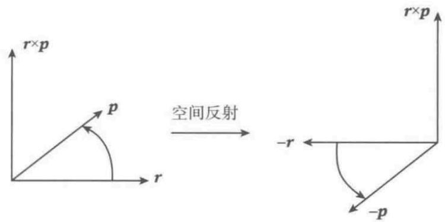
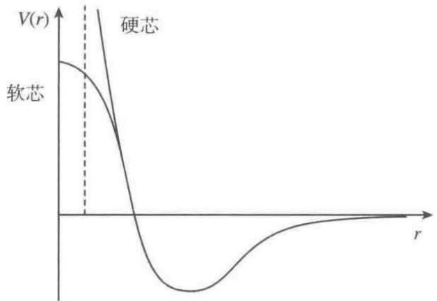
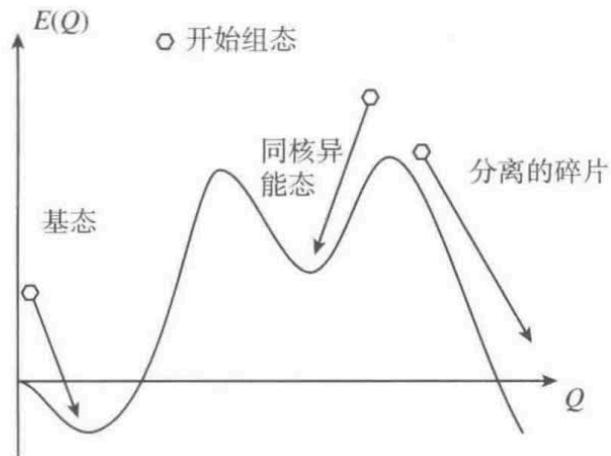
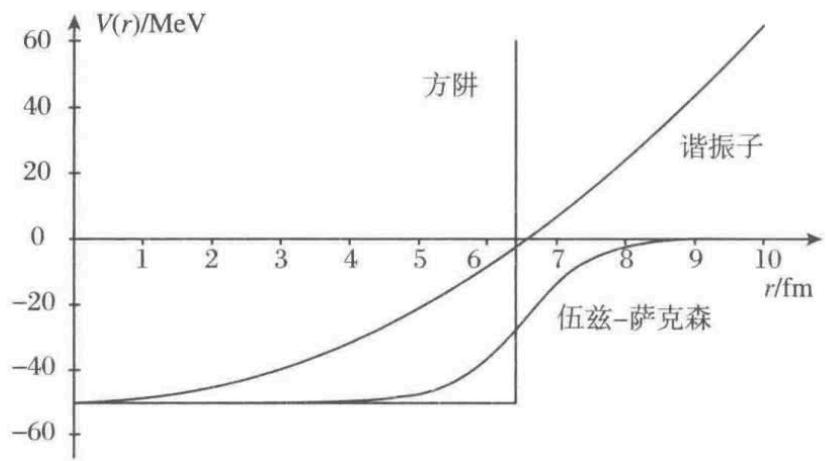
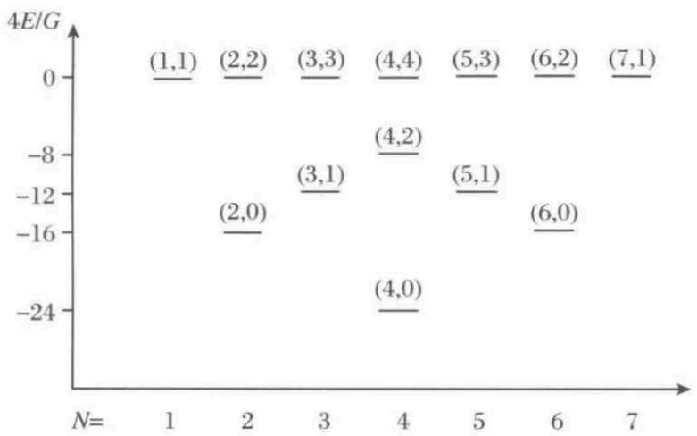
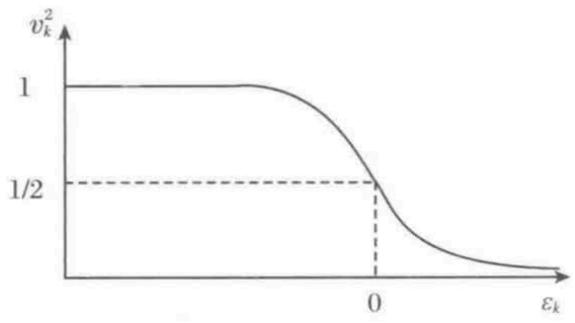

# 第1章 引 言

## 1.1 核结构物理

本书讨论的核模型属于核结构理论领域。按现在的惯例，核结构物理致力于研究核在低激发能下的性质，此时单独的能级能被分解。这意味着典型的量子效应占主导地位，核态有很复杂的结构，其依赖于涉及的所有多个核子的错综复杂的相互关系。

相比之下，在高能尤其是重离子反应中，量子力学变得不那么重要了，其让位于统计力学的方法。此时理论通常利用核物质的体性质，比如状态方程或耗散系数，甚至基于纯粹的经典多体物理，如级联模型。

当然不太可能给出这两类理论的确切能量分界线，呈现于此的理论通常适用于直到 $2 \sim 3 \ \mathrm{MeV}$ 激发能。通常只有最低的几个能级能被理论模型描述得好，高出那一能量范围后能级数量增加很快，以至变得没法对理论和实验作合理的对比（对奇中子数核或奇质子数核或双奇核，这更加具有戏剧性，大多数核模型倾向于偶-偶核，因为它们具有相对简单的能谱）。你也应该记住，实验谱中只有相对少数态可被确定为自旋和宇称，而且为了真正检验模型，跃迁（即波函数之间本质上的重叠）是需要的，这对最有趣的态而言又是不知道的。

因此并不奇怪，本书呈现的模型通常以适中的精度解释相对少数的低位态，即使这样也是一个相当大的进步。为了尊重这一点，记住我们是在处理一个粒子系统，其粒子数目既没有小到允许直接求解，也没有大到使统计方法高度精确，粒子通过还没有被固定到任何明确形式的相互作用力来相互作用。正是这个异常的困难和其他许多分支学科的方法和思想应用于此的自由度，使得核结构物理这么吸引人和有活力。

## 1.2 基本方程

为找到一个合适的理论出发点，一些相关物理量的大概估计需要介绍一下。让我们首先从基本的实验核物理回忆一些数字。

写作这本书时已知元素的原子核包括（到目前为止） $Z = 1, \cdots, 111$ 个质子和 $N = 0, \cdots, 161$ 个中子，由此给出总的核子数 $A$ 。核半径遵循如下经验规律：

$$
R \left( A \right) = r_{0} A^{1/3}
$$

其中 $r_{0} \approx 1.2 \ \mathrm{fm}$ 。这样核半径大约可达 $7.5 \ \mathrm{fm}$ 。此公式也暗示核体积正比于核内粒子数，指出核物质的不可压缩性（由电子散射所观测到的真正的密度轮廓稍微复杂一点）。最小束缚核子的结合能大概为 $8 \ \mathrm{MeV}$ ，而动能接近于 $40 \ \mathrm{MeV}$ 。

具有动能 $T = 40 \ \mathrm{MeV}$ 的核子的速度为

$$
v = \sqrt{ \frac{2 T}{m} } = c \sqrt{ \frac{2 T}{m c^{2}} } \approx 0.3 c
$$

对应的德布罗意波长为

$$
\lambda = \frac{2 \pi \hbar}{m v} = \frac{2 \pi (\hbar c)}{(m c^{2}) (v / c)} \approx 4.5 \ \mathrm{fm}
$$

这里用了有用的常数 $\hbar c \approx 197.32 \ \mathrm{MeV} \cdot \mathrm{fm}$ 。结果显示量子效应当然不能忽略，因为与核半径相比， $\lambda$ 绝不是小值。这对于紧束缚核子越发明显，因为其动能较小。

考虑到这些，关于核本征态的理论的出发点应该是定态薛定谔方程，通常给出如下形式：

$$
\hat{H} \psi = E \psi
$$

本书的其余部分就是关于怎么写出这个 $\hat{H}$ 和在波函数中使用何种自由度。

## 1.3 微观模型与集体模型

当然，最自然的自由度选择是核子自由度，即 $A$ 套位置 $\vec{r}_{i}$ 、自旋 $\vec{s}_{i}$ 和同位旋 $\tau_{i}$ 。然后波函数采用一般形式

$$
\psi ( \vec{r}_{1}, s_{1}, \tau_{1}, \vec{r}_{2}, s_{2}, \tau_{2}, \cdots, \vec{r}_{A}, s_{A}, \tau_{A} )
$$

而对哈密顿量我们将试着用自然的表达式

$$
\hat{H} = - \sum_{i=1}^{A} \frac{\hbar^{2}}{2 m} \nabla^{2} + \frac{1}{2} \sum_{i, j} v ( i, j )
$$

这是微观模型的主要出发点，其自由度是核的组成粒子。这里 $v ( i, j )$ 是核子-核子相互作用，其可能依赖于核子对的所有自由度。显然，即使使用现代计算机，直接求解 $A$ 大于 $3$ 或 $4$ 的多粒子薛定谔方程也是不现实的，所以为此类模型寻找合适的近似是压倒一切的。

核理论的一个重要特点是没有一个关于 $v ( i, j )$ 的先验理论。取而代之的是使用各种参数化，它们适用于不同目的：一种参数化适用于描述核子-核子散射，而另一种适用于对重核的哈特里-福克计算。甚至不清楚在上述哈密顿量中不包含三体力可能有多重要。我们将不得不维持这种做法，直到核子-核子相互作用能够由更基本的理论（比如量子色动力学）导出。原子物理的情况与此截然不同，在那里基本的相互作用理论量子电动力学是众所周知的，寻找问题的解只是一个近似方法问题。

于是一个典型的微观模型依赖于核子-核子相互作用，其必然包含拟合以再现实验数据的参数。这甚至证明了微观方法的名称“模型”的合理性：基本相互作用相关知识的缺乏由带有有限数目的参数的合理函数形式代替，这些参数不能由一个基础理论决定。

关于核子-核子相互作用的适当函数形式的建议很大程度上取决于对称性的要求。这些考虑和实际使用中的一些相互作用的概述将于 7.1 节给出。

集体模型也起到补充的和重要的作用。这些模型基于不涉及个别核子的自由度，取而代之的是指出核作为一个整体的一些体性质。集体坐标的简单但是琐碎的例子有核的质心矢量和四极矩：

$$
\vec{R} = \frac{1}{A} \sum_{i=1}^{A} \vec{r}_{i}, \quad Q_{20} = \sum_{i=1}^{A} r_{i}^{2} Y_{2 \mu} ( \Omega_{i} )
$$

注意在这些情况下有可能用微观坐标表示集体坐标，这样我们至少在理论上应该能够在两种描述间变换。然而在实践中，人们经常引入坐标定义而不涉及任何微观物理，例如把核表面用球谐函数展开并用系数作为坐标。这里我们只对这个问题有一个印象，其细节读者可参见第 6 章。

在几何模型的特殊情况下，用球坐标系给出核表面为

$$
R ( \Omega ) = R_{0} ( 1 + \alpha ( t ) Y_{20} ( \Omega ) )
$$

上式被用来描述接近椭球的形状，其中的形变 $\alpha$ 不是很大。时间依赖的 $\alpha ( t )$ 描述核形状的振动。如果核的平衡态为球形，很自然地假定围绕 $\alpha = 0$ 做简谐振动，导致经典拉氏量

$$
L = \frac{1}{2} B \dot{\alpha}^{2} - \frac{1}{2} C \alpha^{2}
$$

其中 $B$ 为质量参数， $C$ 为刚度参数，它们还没有确定。要将它发展成为成熟的模型并加以运用，要采取如下步骤：

1. **拉氏量量子化**：对于谐振子，这很好办，但是如果集体坐标以更复杂的方式定义，量子化可能是个问题。6.4 节讨论的转动-振动模型给出一个例子。

2. **确定本征态**：这主要是一个数学能力方面的问题。

3. **建立其他可观测量的表达式**：确定能谱是不充分的；计算跃迁概率还需要算符，例如四极算符，其必须用集体坐标给出。于是又得使用物理模型来发现这种表达式。

4. **与实验对比**：因为模型总是包含一些未确定的参数，我们应该将注意力集中于特征结构。例如对于谐振子，我们期望有一个等间隔能级的谱（在现实情况下，我们确实发现一个等间隔谱，但是叠加了丰富的角动量结构）。如果一个实验谱接近于此，能级间隔确定振子频率 $\omega = \sqrt{ C / B }$。结果表明一个单一的跃迁概率就足够用来独立确定 $B$ 和 $C$。这完全定义了这个简单模型，实验中与模型相符的任何附加量都支持模型作为对数据的合理解释。在这个阶段，人们可能会声称已经获得对某个原子核的结构的理解。

5. **参数的理解**：最后如果有可能，检查一下参数 $B$ 和 $C$ 是否可以从对物理的更深刻的描述中理解，比如质量参数 $B$ 可能从一个关于表面振动过程中核内物质运动的模型中计算出来。

本书最终的目标是通过微观模型来解释集体模型以统一两者：集体模型用于对谱作分类和解释它们的结构，而微观模型则用于解释为什么某种类型的集体坐标导致一个可行的模型。

## 1.4 对称的作用

就像本章中所讨论的，很多核结构理论的基础还是不清楚的。在这种情况下，在为核子-核子相互作用、集体哈密顿量等建立新模型时，用对称性讨论限制固有自由度是很重要的。所以对量子物理中的对称性讨论的深刻理解对每一位对核结构感兴趣的人来说是必要的。这个主题最重要的部分将在下一章中重复，在那里我们只给出本书实际需要的细节。对核结构理论中活跃工作的介绍所要求的篇幅比本书所能提供的要多得多，而且需要参考关于角动量理论的合适著作。

## 1.5 自然单位制

所谓自然单位制，就是令一些物理常数为 $1$ ，以此在最终的表达式中不再重复出现这些常数。

### 普朗克自然单位制

有如下常用的物理量：
$$
c = 2.9979 \times 10^{8} \ \mathrm{m}\cdot \mathrm{s}^{-1}, \\
\hbar = 6.626/2\pi \times 10^{-34} \ \mathrm{eV} \cdot \mathrm{s}^{-1}, \\
G = 6.674 \times 10^{-11} \ \mathrm{kg}^{-1} \cdot \mathrm{m}^{3} \cdot \mathrm{s}^{-2}, \\
k_B = 1.38 \times 10^{-23} \ \mathrm{eV} \cdot \mathrm{K}^{-1}, \\
k_c = 8.99 \times 10^{9} \ \mathrm{kg} \cdot \mathrm{m}^{3} \cdot \mathrm{s}^{-4} \cdot \mathrm{A}^{-2}.
$$
通过以上物理量，可以重新表示国际基本单位，如
$$
\text{长度：} 1 \ \mathrm{m} = 6.18 \times 10^{34} \sqrt{\frac{\hbar G}{c^{3}}}, \\
\text{时间：} 1 \ \mathrm{s} = 1.85 \times 10^{43} \sqrt{\frac{\hbar G}{c^{5}}}, \\
\text{质量：} 1 \ \mathrm{kg} = 4.595 \times 10^{7} \sqrt{\frac{\hbar c}{G}}, \\
\text{温度：} 1 \ \mathrm{K} = 7.058 \times 10^{-33} \sqrt{\frac{\hbar c^{5}}{k_B^{2} G}}, \\
\text{电流：} 1 \ \mathrm{A} = 2.87 \times 10^{-26} \sqrt{\frac{c^{6}}{k_c G}}.
$$
略去系数，可以得到普朗克单位
$$
\text{普朗克长度：} L_{pl} = \sqrt{\frac{\hbar G}{c^{3}}}, \\
\text{普朗克时间：} t_{pl} = \sqrt{\frac{\hbar G}{c^{5}}}, \\
\text{普朗克质量：} m_{pl} = \sqrt{\frac{\hbar c}{G}}, \\
\text{普朗克温度：} T_{pl} = \sqrt{\frac{\hbar c^{5}}{k_B^{2} G}}, \\
\text{普朗克电流：} I_{pl} = \sqrt{\frac{c^{6}}{k_c G}}.
$$
在使用普朗克单位制的时候，常用的物理常量均为 $1$ ，即
$$
c = \hbar = G = k_B = k_c = 1.
$$

### 实用自然单位制

这个单位制也可以称为以 $\mathrm{MeV}$ 为基础单位的自然单位制。常用于粒子物理领域，忽略了万有引力常数。

令
$$
c = \hbar = k_B = e = 1.
$$
则
$$
\text{长度：} 1 \ \mathrm{m} = \cdots \ \mathrm{MeV}^{-1} \hbar c = \cdots L_{Nu}, \\
\text{时间：} 1 \ \mathrm{s} = \cdots \ \mathrm{MeV}^{-1} \hbar c = \cdots t_{Nu}, \\
\text{质量：} 1 \ \mathrm{kg} = \cdots \ \mathrm{MeV} \ c^{-2} = \cdots m_{Nu}, \\
\text{电流：} 1 \ \mathrm{A} = \cdots \ \mathrm{MeV} \ e / \hbar = \cdots I_{Nu}. \\
$$
其中 $\cdots$ 代表了系数，在这里不重要就略去。在使用实用自然单位中，注意
$$
\mathrm{MeV} \sim m v^{2} \sim m
$$
即质量等价为能量，因为在自然单位制中任意速度可以用几倍光速来表示，也就是速度无量纲。

# 第 2 章 对称性

## 向量空间

满足如下规则

-   数乘的封闭性；
-   加法的封闭性：任意两个数的和仍然是原集合中的数；
-   满足加法交换律（$\ket{x} + \ket{y} = \ket{y} + \ket{x}$）、加法结合律（$(\ket{x} + \ket{y}) + \ket{z} = \ket{x} + (\ket{y} + \ket{z})$）、乘法结合律、乘法分配律。
-   存在零元素 $\ket{0}$ ，满足 $\ket{x} + \ket{0} = \ket{x}$ 。

如果存在系数 $a_i$ 令
$$
\sum_{i = 1}^N a_i \ket{i} = 0.
$$
的解为 $a_i=0, \ \text{for all} \ i$ ，则称为这 $i$ 个向量相互线性无关；反之则相关。

在 $n$ 维向量空间中，任意 $n$ 个线性无关向量可以表示为空间的基，任意矢量可以表示为基的线性叠加。

#### 标积/内积

定义 $\bra{x}\ket{y} = x^*_iy_j \bra{e_i}\ket{e_j} \rightarrow x^*_iy_i \quad \text{正交归一基}$

性质：

-   $\bra{x}\ket{y}^T = \bra{y}\ket{x}$
-   $\bra{x}\ket{y} > 0 $
-   $\bra{x+y}\ket{z} = \bra{x}\ket{z} + \bra{y}\ket{z}$

#### 算符

作用在向量上的一个操作。

如果算符满足
$$
\hat O (a\ket{x} + b\ket{y}) =  a\hat O\ket{x} + b\hat O\ket{y},
$$
则称算符是线性的。

如果 $\hat O\ket{x} = \ket{y}$ ，则

在向量空间中，算符可以用一个矩阵表示，也就是
$$
\hat O_{ij} = \bra{i}\hat O\ket{j}.
$$

#### 相似变换

在不同的基 $\left\{ \ket{e_j} \right\}$ 与 $\left\{ \ket{e_i'} \right\}$ 中 $e_i' = S_{ij}e_j$ ，同一向量会有不同的表示（ $\ket{x}  = x_j \ket{e_j} = x_i'\ket{e_i'} = x_i' S_{ij}e_j$ ）。

所以有
$$
x_j = x_i'S_{ij}.
$$
如果有 $\ket{y'} = \hat O'\ket{x'}$ ， $\ket{y} = \hat O\ket{x}$ ，描述的是**同一空间下不同基**的算符作用，那么有如下变换关系
$$
\ket{y'} = U\ket{y} = U\hat O \ket{x} = U\hat O U^{-1}\ket{x'}.
$$
所以可以得到
$$
\hat O' = U\hat O U^{-1}.
$$
如果 $U$ 是**幺正（转置共轭为倒矩阵）**的，那么有
$$
U^\dagger U = 1.
$$

## 群

处在同一个向量空间中的算符，满足特定条件后可以构成一个参数空间，这个参数空间又被称为群。群中元素的数目就是群的维度，群需要满足以下条件：

1. 如果 $\hat{S}$ 和 $\hat{S}^{\prime}$ 是同一个群中的不同元素（算符），那么总可以定义一个新的元素（算符）$\hat{T} = \hat{S} \cdot \hat{S}^{\prime}$ 。这样 $\hat{T}$ 也是同类型的对称操作（属于相同的群）。一般我们定义这个乘积是先 $\hat{S}^{\prime}$ 后 $\hat{S}$ 作用于系统（就是位置决定了先后作用顺序，也可以说是不满足乘法交换律）。

2. 乘法结合律，即对所有的 $\hat{S}, \hat{S}^{\prime}$ 和 $\hat{S}^{\prime\prime}$ ，我们有
   $$
   \hat{S} \cdot ( \hat{S}^{\prime} \cdot \hat{S}^{\prime\prime} ) = ( \hat{S} \cdot \hat{S}^{\prime} ) \cdot \hat{S}^{\prime\prime}
   $$

3. 存在一个恒等操作 $1$​ ，其具有性质：
   $$
   1 \cdot \hat{S} = \hat{S}, \quad \hat{S} \cdot 1 = \hat{S}
   $$
   需要注意在这里不能认为 $1 \cdot \hat{S} = \hat{S} \cdot 1$ ，因为算符的操作不满足乘法交换律。一般恒等操作通过“什么都不做”的操作实现，例如角度为零的转动。

4. 对每一个 $\hat{S}$ ，有一个逆 $\hat{S}^{-1}$ ，即

   $$
   \hat{S} \cdot \hat{S}^{-1} = 1, \quad \hat{S}^{-1} \cdot \hat{S} = 1
   $$
   同样这里要注意不能认为 $\hat{S} \cdot \hat{S}^{-1} = \hat{S}^{-1} \cdot \hat{S}$ 。

我们感兴趣的群可以划分为两种截然不同的类：一类群的群元素依赖于连续参数，比如平动和转动群，其分别就平移矢量和转动角度而言是参数化的，群参数的个数就是群的维数；另一类群由分立（不连续）操作组成，比如空间或时间反演。

在连续群中，如果群是参数构成有限单连通区域（单连通空间中所有闭曲线都能连续地收缩至一点），就是紧致群；如果**群参数可以微分**，就是李群。

#### 例子： $\mathrm{SO}(2)$ 群

$\mathrm{SO}(2)$ 群的具体形式为
$$
\begin{bmatrix}
\sin\theta & \cos\theta \\
-\cos\theta & \sin\theta
\end{bmatrix}
$$
可以看出，虽然这是一个 $2\times 2$ 矩阵，但是其群参量只有一个且是连续的，所以是一维李群。

也可以说：群本身就是一个含参算符。

#### 例子：二维平移群

二维平移群是一个 $2\times 2$ 矩阵，其作用与一个位置矢量 $\vec{x}$ 的作用是
$$
\hat g(\alpha,\beta) \vec{x} = \hat g(\alpha,\beta) (x,y) = (\alpha + x,\beta+y).
$$
如果两个平移操作连续作用，会有
$$
\hat g(\alpha,\beta)\hat g(\gamma,\delta) \vec{x} =\hat g(\alpha,\beta)(\gamma + x,\delta+y) = (\alpha+\gamma+x,\beta+\delta+y) =\hat g(\alpha+\gamma,\beta+\delta)(x,y).
$$
可以看出两个群员的乘积仍然在群中，证明了其封闭性。
$$
\left[\hat g(\alpha,\beta)\hat g(\gamma,\delta) \right]\hat g(\mu,\nu) \vec{x}= (\alpha+\gamma+\mu+x,\beta+\delta+\nu+y) = \hat g(\alpha,\beta) \left[\hat g(\gamma,\delta)\hat g(\mu,\nu) \right] \vec{x}.
$$
其乘法结合律也被证明。
$$
\hat g(0,0)\vec{x} = \vec{x}.
$$
说明单位元也存在。
$$
\hat g(\alpha,\beta)\hat g(-\alpha,-\beta) \vec{x} = \vec{x}
$$
证明了逆元素的存在。

说明二维平移操作是一个群。

### 连续群的生成元

需要注意在下面的讨论中， **$N$ 表示矢量 $\vec{x}$ 的维度， $r$ 表示 $\vec{\alpha}$ 的维度。**

生成元有两种意思，分别是**某个李群的李代数生成元**以及**李代数元素在函数表示中的生成元**。前者表示一个抽象的生成元；后者表示群作用在某个空间（函数空间或者 Hilbert 空间），李代数生成元通过映射变成一个具体算符。

所谓“生成元”就是指一组能够生成整个李代数的元素，也就是找到李代数这个向量空间中的一组完备基矢（**李代数生成元 = 一组完备基矢**）。

连续群具有生成元（或“产生子”），其数量不止一个。生成元与无穷小变换有关，比如
$$
\vec{x} \rightarrow \vec{x}',\vec{x}' = g(\vec{\alpha})\vec{x} = \vec{f}(\vec{x},\vec{\alpha}).
$$
其中变换 $f(\vec{\alpha},\vec{x})$ 可以对 $\vec{\alpha}$ 在 $\vec{\alpha} = 0$ 泰勒展开到一阶，为
$$
\vec{f}(\vec{x}, \vec{\alpha}) = \vec{f}(\vec{x},0) +  \mathrm{d}\vec{\alpha} \cdot \nabla_\alpha \vec{f} |_{\vec{\alpha} = 0}.
$$

对于无穷小变化 $\mathrm{d} \vec{x}$ 有
$$
\mathrm{d} \vec{x} = \mathrm{d} \vec{\alpha} \cdot \nabla_\alpha \vec{f} |_{\alpha=0} = \sum_{i=1}
^r\mathrm{d} \alpha_i\frac{\partial}{\partial \alpha_i}\vec{f} |_{\vec{\alpha} = 0},\\
\mathrm{d} x_k = \sum_{i=1}^r\mathrm{d} \alpha_i U_i^k.
$$
其中 $\boxed{U_i^k = \frac{\partial}{\partial \alpha_i} f_k |_{\vec{\alpha} = 0} }$ 。变换无穷小地作用在一个标量函数 $F(\vec{x})$ ，造成的无穷小变化为
$$
\mathrm{d} F(\vec{x}) = \sum_{k = 1}^N \frac{\partial F(\vec{x})}{\partial x_k} \mathrm{d}x_k = \sum_{k = 1}^N \frac{\partial F(\vec{x})}{\partial x_k} \cdot \sum_{i=1}^rU_i^k\mathrm{d} \alpha_i  = \sum_{i=1}^r\mathrm{d} \alpha_i \hat G_iF(\vec{x}).
$$
其中
$$
\boxed{\hat G_i = \sum_{k=1}^N U_i^k\frac{\partial}{\partial x_k}. \quad i = 1,2,3,...,r}
$$
就是群 $G$ 的生成元，用于产生 $F(\vec{x})$ 的无穷小变化。

#### 例子：二维正交变化群（转动群、 $\mathrm{SO}(2)$ 群）

#####  $\mathrm{SO}(n)$ 群

$\mathrm{SO}(n)$ 群，又称转动群，就是满足如下定义的群
$$
\boxed{\mathrm{SO}(n) = \left\{ X \in M_n(\mathbb{R}) | X^T  X = I \quad \text{and} \quad \det(X) = 1 \right\}}
$$
就是这个群中所有元素都是**对称实矩阵**且**行列式为 1** 。旋转操作前后波函数归一化不能变，也就是可以计算出
$$
X^{\dagger}X = \left|\det{X} \right|^2 = 1.
$$
由于 $\mathrm{SO}(n)$ 是实数群，因此 $\det{X} = \pm 1$ 。此时如果我们不限制 $\det(X) = 1 $ ，则在转动过后参考系可能从右手系  变为左手系，也就是额外引入了一个反射操作。

这样子的群元自由度为
$$
\text{dim} \ \mathrm{SO}(n) = \frac{n(n-1)}{2}.
$$
所有的产生子都是无穷小变换，记
$$
A' = (I+\delta X)A.
$$
于是
$$
A^T(I+\delta X^T)(I+\delta X)A = A^T(I+\delta X^T+\delta X)A = A^TA \rightarrow \delta X^T+\delta X = 0.
$$
可以看出来，这里只有反对称矩阵的限制条件，所以**只有反对称矩阵条件对群元有约束，行列式为1不约束**。

$\mathrm{SO}(2)$ 群只有一个自由度，也就是其生成元只有一个。

##### 生成元

我们考虑的情况如下：

一个描述物理场的函数 $\psi$ 在旋转算符 $\hat{R}$ 作用下旋转，相当于原本系统中的坐标在旋转算符 $\hat{g}^{-1}$ 作用下旋转。显然这两者不论如何旋转，物理的物理场不会改变，会改变的只有物理场的数学形式，即转动前后总是应该满足

形容转动的时候有两个观点，分别是主动与被动。所谓主动是指**坐标轴保持固定，转动函数**，就是 $\boxed{(\hat R\psi)(\vec{r}) = \psi(\hat g^{-1}\vec{r})}$ ；被动观点就是**转动坐标轴，函数不变**，就是 $\boxed{\psi'(\vec{r}') = \psi(\hat g^{-1}\vec{r}')}$ 。需要注意的是，这里的函数不变不是指函数形式不变而是指物理场不变，也就是说一个点在转动前后的位置不同，但是其值是不变的。

为了同一主动和被动观点，将被动观点中的 prime 去掉，最终无论是主动还是被动观点都是
$$
\psi'(\vec{r}) = \psi(\hat g^{-1}\vec{r}).
$$
对于主动观点，这里的 $\vec{r}$ 是转动之前的矢量；对于被动观点，这里的 $\vec{r}$ 是转动之后的矢量。

首先考虑**被动观点**，也就是矢量 $(x,y)$ 的转动变化 $\phi$ 的结果 $(x',y')$ 有如下关系
$$
\vec{r}' = \hat{g}(\phi) \vec{r}.\\
x' = f_x(x,y,\phi) =  x\cos\phi - y\sin\phi,\\
y' = f_y(x,y,\phi) = x\sin\phi + y\cos\phi.
$$
类比之前的讨论，可以发现 $r = 1$ ，于是转动群的生成元可以表示为
$$
U_1^x = \frac{\partial }{\partial \phi}f_x|_{\phi=0} = -y,\\
U_1^y = x.\\
\hat G_\phi = U_\phi^x\frac{\partial}{\partial x} + U_\phi^y\frac{\partial}{\partial y} = -y\frac{\partial}{\partial x} + x\frac{\partial}{\partial y}.
$$
其中 $\hat G_\phi = -y\frac{\partial}{\partial x} + x\frac{\partial}{\partial y}$ 是 $ \mathrm{SO}(2)$ 群**在函数空间上微分算子表示**。

或者

无穷小的作用，也就是对算符做展开。所以可以直接对无穷小角度 $\delta \theta$ 转动矩阵展开，只保留一阶有
$$
\begin{aligned}
\hat g(\theta) &=
\begin{bmatrix}
\cos\theta & - \sin\theta   \\
\sin\theta & \cos\theta
\end{bmatrix} \rightarrow
\hat g(\delta\theta) =
\begin{bmatrix}
1 & -\delta\theta   \\
\delta\theta & 1
\end{bmatrix}  \\
&= I + \delta \theta
\begin{bmatrix}
0 & -1   \\
1 & 0
\end{bmatrix} = I+\delta\theta X .
\end{aligned}
$$
其中 $X=
\begin{bmatrix}
0 & -1   \\
1 & 0
\end{bmatrix}
$ 是 $ \mathrm{SO}(2)$ 群在矢量空间 $\mathbb{R}^2$ 上矩阵表示的**李代数生成元**。

或者

仍然考虑标量函数 $\psi( \vec{r} )$ ，对其**主动转动变化**，于是会有
$$
\hat R\psi(\vec{r} ) = \psi'( \vec{r} ) = \psi( \hat g^{-1}\vec{r} ).
$$
其中 $\hat g^{-1} =
\begin{bmatrix}
\cos\alpha  &  \sin\alpha   \\-\sin\alpha & \cos\alpha
\end{bmatrix}
$ ，对其中的 $\alpha = 0$ 做展开，有
$$
\begin{aligned}
\hat R\psi( \vec{r} ) &= \psi'( \vec{r}' ) = \psi\left[ \hat g^{-1}(\alpha)\vec{r} \right] = \psi(x\cos\alpha+y\sin\alpha , -x\sin \alpha+y\cos\alpha)\\
&= \psi(x,y) + \frac{\partial \psi}{\partial \alpha}|_{\alpha = 0}\mathrm{d} \alpha \\
&= \psi(x,y) + \left[ \frac{\partial\psi}{\partial (x\cos\alpha+y\sin\alpha)}\frac{\partial (x\cos\alpha+y\sin\alpha)}{\partial \alpha} + \frac{\partial\psi}{\partial (-x\sin \alpha+y\cos\alpha)}\frac{\partial (-x\sin \alpha+y\cos\alpha)}{\partial \alpha} \right]|_{\alpha = 0}\mathrm{d} \alpha\\
\end{aligned}
$$
考虑无穷小转动的作用
$$
\hat R(\mathrm{d}\alpha)\psi( \vec{r} ) = \left[I - \frac{\mathrm{i}}{\hbar}\hat L_z\mathrm{d} \alpha\right] \psi( \vec{r} ),\\
\hat R(\mathrm{d}\alpha) = \left[I - \frac{\mathrm{i}}{\hbar}\hat L_z\mathrm{d} \alpha\right].
$$

导致无穷小变化的程度就是 $- \frac{\mathrm{i}}{\hbar}\hat L_z$ ，所以此时 $ \mathrm{SO}(2)$ **在 Hilbert 空间上的幺正表示**是
$$
\hat G_\phi  = - \frac{\mathrm{i}}{\hbar}\hat L_z.
$$
首先我们关注一下主动和被动观点计算出来的结果相差一个负号。其实这个很好理解，就是主动观点下函数转动的方向与被动观点下的坐标轴转动方向正好相反，所以正好有一个负号的差异。

### 李代数

**李代数** $\mathfrak{g}$ 就是一个定义在复数域上的向量空间。这个向量空间中的元素一定要满足的运算法则为
$$
\boxed{\left[G_\mu,G_\nu \right] = -\left[G_\nu,G_\mu \right]},\\
\boxed{\left[\left[G_\mu,G_\nu \right],G_\tau \right] + \left[\left[G_\nu,G_\tau \right],G_\mu \right] + \left[\left[G_\tau,G_\mu \right] ,G_\nu \right] =0}.
$$
定义对易关系
$$
\left[G_\mu,G_\nu \right] = G_\mu G_\nu - G_\nu G_\mu,
$$
李群生成元（李代数基矢）的对易关系为
$$
\boxed{\left[G_\mu,G_\nu \right] = \sum_{\lambda = 1}^r C_{\mu\nu}^{\lambda}G_\lambda},
$$
其中 $C_{\mu\nu}^\lambda$ 是李代数结构常数，上面的操作相当于将对易结果展开到完备基 $\left\{G_\lambda\right\}$ 上，这个关系又可以称为**李代数关系**或者**李代数结构**。结构常数满足
$$
C_{\mu\nu}^{\lambda} = -C_{\nu\mu}^{\lambda}.
$$
考虑有雅可比恒等式
$$
\left[\left[G_\mu,G_\nu \right],G_\tau \right] + \left[\left[G_\nu,G_\tau \right],G_\mu \right] + \left[\left[G_\tau,G_\mu \right] ,G_\nu \right] =0,
$$
于是有
$$
\sum_\lambda C_{\mu\nu}^\lambda C_{\lambda\tau}^{\delta} + C_{\tau\mu}^\lambda C_{\lambda\nu}^{\delta} + C_{\nu\tau}^\lambda C_{\lambda\mu}^{\delta}  = 0,
$$

使用**爱因斯坦求和约定**可以写成
$$
\boxed{C_{\mu\nu}^\lambda C_{\lambda\tau}^{\delta} + C_{\tau\mu}^\lambda C_{\lambda\nu}^{\delta} + C_{\nu\tau}^\lambda C_{\lambda\mu}^{\delta}  = 0}.
$$

可以通过李代数获得对应的李群。在实践中，相比于构造具有正确对易性质的群（矩阵），构造李代数的表示通常要容易得多（因为构造李代数只用考虑构造出合适的满足李括号的生成元而不必考虑构造满足矩阵乘法的群），一旦有了李代数生成元（比如 $\hat J_n$ ）的矩阵表示，可以通过一个称为“指数映射”的过程，来恢复出**李群元素**的矩阵表示（即 $\hat R(\theta) = \mathrm{e} ^{ - \mathrm{i}\theta \hat J_n}$ ）。

#### 例如：角动量算符的李代数

角动量算符构成一个 $\mathrm{so}(3)$ 的李代数。考虑角动量算符的对易关系
$$
\left[\hat L_i, \hat L_j\right] = \mathrm{i}\hbar\varepsilon_{ijk}\hat L_k,
$$

如果我们定义李代数基矢（李群生成元）$J_i = \frac{1}{\mathrm{i}\hbar}\hat L_i$ ，显然李代数结构（李代数关系）可以写为
$$
\left[ J_i,J_j \right] = \varepsilon_{ijk}J_k.
$$
所以可以直观的看出结构常数
$$
C_{ij}^k = \varepsilon_{ijk},
$$

李代数的结构常数满足的雅可比恒等式为，其中使用了**爱因斯坦求和约定**
$$
\varepsilon_{ijl}\varepsilon_{lkp} + \varepsilon_{kil}\varepsilon_{ljp} + \varepsilon_{jkl}\varepsilon_{lip} = 0.
$$
注意如下常用关系

-   $ \varepsilon_{ijk}\delta_{ij} = 0 $
-   $\delta_{ij}\delta_{ij}=3$
-   $\delta_{ij}\delta_{jk} = \delta_{ik}$
-   $\varepsilon_{ijk}\varepsilon_{ijk} = 6$
-   $\varepsilon_{ijk}\varepsilon_{ijl} = 2\delta_{kl}$
-   $\varepsilon_{ijl} \varepsilon_{lkp} = \delta_{ik} \delta_{jp} - \delta_{ip} \delta_{jk}$

### 卡西米尔算符

所谓卡西米尔算符，就是与群的**任意**生成元 $\hat G_i$ 对易的算符。
$$
\left[\hat C_\lambda,\hat G_i\right] = 0
$$
如果 $\hat C_\lambda,\hat C_\sigma$ 是卡西米尔算符，那么 $\hat C_\lambda\hat C_\sigma$ 以及 $\hat C_\lambda+\hat C_\sigma$ 都是卡西米尔算符。

卡西米尔算符可以通过群的生成元构造
$$
\boxed{\hat C_\lambda = \sum_{\mu\nu} g_{\mu\nu}\hat G_\mu \hat G_\nu}.
$$
其中 $ g_{\mu\nu} = \sum_{\tau\rho}C_{\mu\tau}^\rho C_{\nu\rho}^\tau$ ， $C_{\mu\tau}^\rho$ 是李代数结构常数。需要注意的是，卡西米尔算符不唯一，只能说能找到一个卡西米尔算符。

#### 例如 $\mathrm{SO}(3)$ 群的角动量代数卡西米尔算符

根据之前的知识，其李代数结构常数为
$$
C_{ij}^k = \varepsilon_{ijk}.
$$
其生成元为 $\hat L_x, \hat L_y, \hat L_z$ ，于是可以计算出卡西米尔算符为
$$
g_{\mu\nu} = \sum_{\tau\rho}\varepsilon_{\mu\tau\rho} \varepsilon_{\nu\rho\tau} = -\sum_{\tau\rho}\varepsilon_{\mu\tau\rho} \varepsilon_{\nu\tau\rho} = -2\delta_{\mu\nu}\\
\rightarrow \hat C_\lambda = \sum_{\mu\nu} -2\delta_{\mu\nu}\hat L_\mu \hat L_\nu = -2\hat L^2.
$$

注意，在这里的计算中交换了 $\varepsilon_{ijk}$ 的两个下标，所以需要取负号。

### 群的矩阵表示

群 $G$ 的元素 $g_m$ ，如果存在一个映射 $D(g_m)$ 将群元映射成一个矩阵，那么就说 $D(g_m)$ 是群元 $g_m$ 的矩阵表示。

如果 $D(g_m)$ 作用在一个波函数基矢上，则有
$$
\hat g_m \ket{\psi_i} = \sum_{j} D_{ji}^m \ket{\psi_j}.\\
\rightarrow \bra{\psi_k}g_m\ket{\psi_i} = \sum_jD_{ji}^m \bra{\psi_k}\ket{\psi_j} = \sum_jD_{ji}^m \delta_{kj} = D_{ki}^m.
$$
可以得到群的矩阵表示为
$$
\boxed{D_{ij}^m = \bra{\psi_i}g_m\ket{\psi_j}}.
$$
可以通过如下方式验证，群元的封闭性在矩阵表示中也必须严格实现。
$$
D(g_1)D(g_1) = D(g_1g_2)
$$

#### 例子： $\mathrm{SO}(n)$ 的李代数生成元（一般性结论）

$\mathrm{SO}(n)$ 的群参数有 $r_{ij}, i<j$ ，其无穷小变换为 $\delta X(r_{ij}) = r_{ij}(E^{ij} - E^{ji})$ ，其中 $E^{ij}$ 是只在第 $i$ 行第 $j$ 列位置为 $1$ ，其他所有位置都为 $0$ 的矩阵。所以 **$\mathrm{SO}(n)$ 群李代数生成元为 $E^{ij} - E^{ji}$** 。

### 群链

群链就是描述一个群不断破缺对称性之后获得的一堆子群。

### 二次量子化中的李代数

就是利用升降算符，计算对易关系获得结构常数，最后通过验证 Jacobi 恒等式是否成立来验证李代数有没有被构造。

李代数的生成元往往以二次量子化的形式出现。数学上的原因很简单：如果粒子是在 $n$ 个单粒子波函数空间中产生的，它可以用这些波函数的一些线性组合来描述。将波函数改变为另一个这样的线性组合的变换对应于 $\mathrm{U} ( n )$ 群的一个元素。或者，这种再分布可以通过产生和湮没算符的一些结合 $\hat{a}_j^{\dagger} \hat{a}_k$ 来实现，其作用是把粒子从原来的态中除去，然后把它放入新的态。最简单的例子又是由无处不在的转动群提供的，在这种情况下，它化身为 $\mathrm{SU} ( 2 )$ 。

考虑一个能存在于两种不同态的费米子。考虑同位旋作为最简单的例子，把它们记为 $\ket{p}$ 和 $\ket{n}$ ，它们将通过使用算符 $\hat{a}_p^{\dagger}$ 和 $\hat{a}_n^{\dagger}$ 产生，这样
$$
\ket{p} = \hat{a}_p^{\dagger} \ket{0} , \quad \ket{n} = \hat{a}_n^{\dagger} \ket{0}
$$

于是粒子的状态改变可以由算符 $\hat{a}_n^{\dagger} \hat{a}_p$ 和 $\hat{a}_p^{\dagger} \hat{a}_n$ 分别促成。这可能与角动量理论的移位算符相对应。如果将 $1/2$ 的投影赋值给态 $\ket{p}$ ，将 $-1/2$ 的投影赋值给态 $\ket{n}$ ，我们就可以定义角动量算符：
$$
\hat{J}_+ = \hat{a}_p^{\dagger} \hat{a}_n , \quad \hat{J}_- = \hat{a}_n^{\dagger} \hat{a}_p
$$

此外，可以推测角动量算符的 $z$ 分量为
$$
\hat{J}_z = \frac{1}{2} ( \hat{a}_p^{\dagger} \hat{a}_p - \hat{a}_n^{\dagger} \hat{a}_n )
$$

这清楚地产生了两个态所希望的本征值 $\pm 1/2$

这**是否产生李代数可以通过求对易关系来检验**。由于算符 $\hat{a}_n$ 能反对易到后面，我们有
$$
[ \hat{a}_p^{\dagger} \hat{a}_p , \hat{a}_p^{\dagger} \hat{a}_n ] = [ \hat{a}_p^{\dagger} \hat{a}_p , \hat{a}_p^{\dagger} ] \hat{a}_n = \hat{a}_p^{\dagger} \hat{a}_n
$$

使用算符 $\hat{a}_n^{\dagger} \hat{a}_n$ 的类似结果，我们得到
$$
\left[ \frac{1}{2} ( \hat{a}_p^{\dagger} \hat{a}_p - \hat{a}_n^{\dagger} \hat{a}_n ) , \hat{a}_p^{\dagger} \hat{a}_n \right] = \hat{a}_p^{\dagger} \hat{a}_n
$$

或
$$
[ \hat{J}_z , \hat{J}_+ ] = \hat{J}_+
$$

正如角动量移位算符一样。**类似地，所有其他的角动量对易规则都可以得到确认（这样就可以获得李代数的结构常数了，如果结构常数满足 Jacobi 恒等式，那么证明了可以构成李代数）**。这样，我们用二次量子化算符形式实现了 $\mathrm{SU}( 2 )$ 群的全李代数。

类似地， $\mathrm{SO} ( n )$ 的生成元可以简单看出。每个矩阵 $E ^ { ( i j ) }$ 对应于一个算符对 $\hat{a}_i^{\dagger} \hat{a}_j$ ，这样二次量子化形式变为
$$
\hat{G}_{ij} = \hat{a}_i^{\dagger} \hat{a}_j - \hat{a}_j^{\dagger} \hat{a}_i
$$

该方法将被应用到一个六维空间的更复杂的相互作用玻色子近似情况（6.8 节）。

然而，也有一个角动量代数应用的例子，在这种情况下，与 $\mathrm{SU} ( 2 )$ 群的连接不是那么平凡，这个例子是 7.5.3 小节解释的准自旋模型。

对易关系就是
$$
\begin{aligned}
\left[\alpha^\dagger_p\alpha_p,\alpha_p^\dagger\alpha_n \right] &= \alpha_p^\dagger\alpha_n\\
\left[\alpha_i,\alpha_j^\dagger \right] &= \delta_{ij},\\
\left[J_z,\alpha_p^\dagger\alpha_n \right] &= \alpha_p^\dagger\alpha_n.
\end{aligned}
$$

###  $\mathrm{SU} ( n )$ 群

$\mathrm{SU} ( n )$ 群，又称“**特殊幺正群**”，定义为幺正群 $\mathrm{U}(n)$ $+$ 行列式为 $1$ （特殊条件），与 $\mathrm{SO} ( n )$ 类似，只是将转置变为厄密共轭
$$
\boxed{\mathrm{SU}(n) = \left\{ X \in M_n(\mathbb{C}) | X^\dagger  X = I \quad \text{and} \quad \det(X) = 1 \right\}}.
$$
其中幺正群的要求来源于量子力学中要求波函数变换之后归一化不变的要求
$$
\bra{\psi}\ket{\psi} = 1 \rightarrow \bra{\psi} X^\dagger X \ket{\psi} = 1 \rightarrow X^\dagger X = 1.
$$
$\det(X) = 1 $ 来源于相位的要求，首先考虑 $X^\dagger X$ 的行列式
$$
\det(X^\dagger X) = \det (X^{\dagger}) \det(X) = 1 \rightarrow \det(X) = \mathrm{e}^{\mathrm{i}\phi}.
$$
也就是说，群有一个相位不确定性，但是不同相位波函数反应的是一个量子态，所以这种相位不确定性最好还是消除，所以我们定义 $\det(X) = 1 $ 。

由于 $\mathrm{SU} ( n )$ 群元素是复数，所有其是 $n \times n$ 的复矩阵，每个复元素贡献两个自由度（实部和虚部），共有自由度 $2n^2$ 。由于 $X$ 应该是一个厄密矩阵，就是说 $X^{\dagger} = X^{-1}$ ，所以说其中**对角线元素一定是实数**，此时自由度变为上三角的 $(n^2 -n )/2$ 个复数以及主对角线的 $n$ 个，总共 $n^2 - n + n = n^2$ 自由度。

$\det(X) = 1 $ 确定了相位，丧失一个相位的自由度，所以总自由度是 $n^2 - 1$ 。

####  $\mathrm{SU} ( 2 )$ 群的李代数生成元

由于我们已经得到的结果，可以知道 $\mathrm{SU} ( 2 )$ 的形状可以写成
$$
A = \begin{bmatrix}
a & b+\mathrm{i}c\\
b-\mathrm{i}c & -a \\
\end{bmatrix} \\ \Rightarrow \delta A = \begin{bmatrix}
\delta a & \delta b+\mathrm{i}\delta c\\
\delta b-\mathrm{i}\delta c & -\delta a \\
\end{bmatrix}= \delta a\begin{bmatrix}
1 & 0\\
0 & -1 \\
\end{bmatrix}+\delta  b \begin{bmatrix}
0 & 1\\
1 & 0 \\
\end{bmatrix}+\delta  c \begin{bmatrix}
0 & \mathrm{i}\\
\mathrm{i} & 0 \\
\end{bmatrix}.
$$
于是可以发现 Pauli 矩阵就是 $\mathrm{SU} ( 2 )$ 的李代数生成元。

###  $\mathrm{SU}( 3 )$ 群

$\mathrm{SU}( 3 )$ 群的生成元有 $8$ 个，分别是
$$
\lambda_\tau = \begin{bmatrix}
\sigma_i & & 0\\
& & 0\\
0&0&0
\end{bmatrix}, \quad \tau = 1,2,3,\\
\lambda_4 = \begin{bmatrix}
0 & 0 & 1\\
0 & 0 & 0\\
1&0&0
\end{bmatrix},
\quad \lambda_5 = \begin{bmatrix}
0 & 0 & -\mathrm{i} \\
0 & 0 & 0\\
\mathrm{i}&0&0
\end{bmatrix},
\quad \lambda_6 = \begin{bmatrix}
0 & 0 & 0 \\
0 & 0 & 1\\
0 & 1 & 0
\end{bmatrix}\\
\lambda_7 = \begin{bmatrix}
0 & 0 &0 \\
0 & 0 &  -\mathrm{i}\\
0&\mathrm{i}&0
\end{bmatrix},
\quad \lambda_8 = \frac{1}{\sqrt{3}}\begin{bmatrix}
1 & 0 & 0 \\
0 & 1 & 0\\
0&0&-2
\end{bmatrix}\\
$$
李代数
$$
\left[\lambda_a,\lambda_b\right] = 2\mathrm{i}f_{abc}\lambda_c,\\
\left\{ \lambda_a,\lambda_b \right\} = \frac{4}{3}\delta_{ab}I+2d_{abc}\lambda_c,\\
\Rightarrow \Tr(\lambda_a,\lambda_b) = 2\delta_{ab}.
$$
其中， $f_{abc} = \Tr(\lambda_a\left[\lambda_b,\lambda_c\right])$ ， $d_{abc} = \Tr(\lambda_a\left\{ \lambda_b,\lambda_c \right\})$

## 2.2 平移

### 2.2.1 平移算符

以下计算了平移算符的形式、微分形式、生成算符以及对算符的作用

平移不变性提供了一种对称性，然而这在核物理中并不太有用，但其作为一个很简单的例子可用于说明许多方法，这些方法将被用于更复杂的转动情况。平移不变性通常可以很简单地被考虑，但是在核物理的一些情况中它扮演了更微妙的角色。例如一个带有规定势的唯象单粒子模型不满足平移不变性，因为势必须在空间处于固定位置，必须特别考虑以纠正这个问题。

一个带有动量 $\vec{p}$ 和自旋 $\vec{s}$ 位于 $\vec{r}$ 的点粒子的平移由以下操作定义：
$$
\vec{r} \rightarrow \vec{r}^{\prime} = \vec{r} + \vec{a} , \quad \vec{p} \rightarrow \vec{p}^{\prime} = \vec{p} , \quad \vec{s} \rightarrow \vec{s}^{\prime} = \vec{s}
$$

矢量 $\vec{a}$ 是表示粒子所作移动的常矢量。这是变换的主动视角。被动视角可以通过移动坐标系统来实现，其对应于移动粒子 $-\vec{a}$ 。这两种变换表述是等价的，但是可能导致公式中的符号不同。本书**自始至终使用主动视角**。

如果粒子用波函数 $\psi ( \vec{r} , \vec{p} , \vec{s} )$ 描述，平移的波函数被简单地定义为让波函数值随粒子一起移动，即新位置 $\vec{r}^{\prime}$ 的值与在位置 $\vec{r}$ 的原波函数值相同：
$$
\psi^{\prime} ( \vec{r}^{\prime} ) = \psi^{\prime} ( \vec{r} + \vec{a} ) = \psi ( \vec{r} )
$$

而在点 $\vec{r}$ 处的值通过将这两点移动 $- \vec{a}$ 给出：
$$
\psi^{\prime} ( \vec{r} ) = \psi ( \vec{r} - \vec{a} )
$$

量子力学中将 $\psi ( \vec{r} )$ 变换到 $\psi^{\prime} ( \vec{r} )$ 的行为由算符 $\hat{U} ( \vec{a} )$ 表示。将上式用泰勒级数在 $\vec{a}=0$ 处展开做到：
$$
\begin{aligned}
\psi^{\prime} ( \vec{r} ) &= \psi ( \vec{r} ) - \vec{a} \cdot \nabla \psi ( \vec{r} ) + \frac{1}{2!} ( - \vec{a} \cdot \nabla )^2 \psi ( \vec{r} ) - \cdots \\
&= \sum_{n=0}^{\infty} \frac{ (-\vec{a} \cdot \nabla)^n }{ n! } \psi ( \vec{r} )
\end{aligned}
$$

形式上求和可以写成指数函数，算符 $\nabla$ 可以用动量算符 $\hat{\vec{p}} = - \mathrm{i} \hbar \nabla$ 表示，这样
$$
\psi^{\prime} ( \vec{r} ) = \exp ( - \vec{a} \cdot \nabla ) \psi ( \vec{r} ) = \exp \Bigl ( - \frac{\mathrm{i} }{\hbar} \vec{a} \cdot \hat{\vec{p}} \Bigr ) \psi ( \vec{r} )
$$

这样动量算符直接与平动联系在一起；**实际上，关于小位移 $\vec{a}$ 的展开**导致
$$
\psi^{\prime} ( \vec{r} ) \approx \Big ( 1 - \frac{ \mathrm{i} }{\hbar} \vec{a} \cdot \hat{\vec{p}} \Big ) \psi ( \vec{r} )
$$

所以 $\hat{\vec{p}}$ 可以称为算符，或者称为无限小平移的生成元。

这样我们得到了平移算符
$$
\hat{U} ( \vec{a} ) = \exp \left( - \frac{ \mathrm{i} }{\hbar} \vec{a} \cdot \hat{\vec{p}} \right)
$$

波函数按下式变换：
$$
\hat{U} ( \vec{a} ) \psi ( \vec{r} ) = \psi^{\prime} ( \vec{r} ) = \psi ( \vec{r} - \vec{a} )
$$

为找出位置依赖算符 $\hat{A} ( \vec{r} )$ 如何转换，只要记住 $\hat{A} \left( \vec{r} \right) \psi ( \vec{r} )$ 必须像一个波函数那样变换，这样
$$
\begin{aligned}
\hat{A}^{\prime} ( \vec{r} ) \psi^{\prime} ( \vec{r} ) &= \hat{A} ( \vec{r} - \vec{a} ) \psi ( \vec{r} - \vec{a} ) \\
&= \hat{U} ( \vec{a} ) ( \hat{A} ( \vec{r} ) \psi ( \vec{r} ) ) \\
&= \hat{U} ( \vec{a} ) \hat{A} ( \vec{r} ) \hat{U}^{-1} ( \vec{a} ) \hat{U} ( \vec{a} ) \psi ( \vec{r} )
\end{aligned}
$$

所以算符按照下式变换：
$$
\hat{A}^{\prime} = \hat{U} \hat{A} \hat{U}^{-1}
$$

显然这是一般的结果，对任何变换群类似。

如果我们采用幂级数展开，立即可以看到对于算符的指数有
$$
\exp ( \hat{T} )^{\dagger} = \exp ( \hat{T}^{\dagger} ), \quad \exp ( \hat{T} )^{-1} = \exp ( - \hat{T} )
$$

由于 $\hat{\vec{p}}$ 是一个厄米算符，它与一个虚数的乘积在厄米共轭下改变符号，我们有
$$
\hat{U}^{\dagger} ( \vec{a} ) = \hat{U}^{-1} ( \vec{a} ) = \hat{U} ( - \vec{a} )
$$

这样算符 $\hat{U} ( \vec{a} )$ 是幺正的，于是它既使波函数的范数守恒也使它们之间的矩阵元守恒。反向平移和平移 $- \vec{a}$ 一样，这只是正式地表述直觉上显而易见的东西。

### 2.2.2 平移不变性

这些讨论仍然适用于任意单粒子系统。推导的公式简单地表达了平动对波函数的作用而没有假定任何不变性质。如果**哈密顿量在平移下不变**（注意，这里的平移不变性是指 Hamiltonian 在平移后不变）的话，一个物理系统是平移不变的（注意 $\hat{H}$ 的所有其他自变量如自旋和动量为简洁起见都省略了）。对一个任意的 $\vec{a}$ ，一定有
$$
\hat{H}^{\prime} ( \vec{r} ) = \hat{H} ( \vec{r} - \vec{a} ) = \hat{H} ( \vec{r} )
$$

这意味着
$$
\hat{H' } ( \vec{r} ) = \hat{U} ( \vec{a} ) \hat{H} ( \vec{r} ) \hat{U}^{-1} ( \vec{a} ) = \hat{H} ( \vec{r} )
$$

或通过右乘以 $\hat{U} ( \vec{a} )$ ，得
$$
\hat{U} ( \vec{a} ) \hat{H} ( \vec{r} ) = \hat{H} ( \vec{r} ) \hat{U} ( \vec{a} )
$$

即
$$
\left[ \hat{H} ( \vec{r} ) , \hat{U} ( \vec{a} ) \right] = 0
$$

这样哈密顿量与任意平移量为 $\vec{a}$ 的平移算符对易。在这一点上使用式 (2.10) 变得有利：假如动量算符与 $\hat{H}$ 对易，很显然 $\hat{U} ( \vec{a} )$ 与 $\hat{H}$ 对易不受特定位移 $\vec{a}$ 的影响。这导致一个比较简单的情况：
$$
[ \hat{H} , \hat{\vec{p}} ] = 0
$$

综上所述，我们可以得出这样的结论：物理系统关于平动的性质都可以用动量算符表示。

### 2.2.3 多粒子系统

以下计算了多例子系统的平移算符，并且计算量质心矢量不同分量的对易关系。

一个多粒子系统的平动自然导致总动量的概念，再次给出一个对角动量来说将会更复杂的概念的简单介绍。 $N$ 个粒子组成的系统平移一个位移 $\vec{a}$ 表示为
$$
( \vec{r}_1 , \vec{r}_2 , \cdots , \vec{r}_N ) \rightarrow ( \vec{r}_1 + \vec{a} , \vec{r}_2 + \vec{a} , \cdots , \vec{r}_N + \vec{a} )
$$

（就像此前一样，动量和自旋不受影响。）对于多体波函数，变换由下式给出：
$$
\phi^{\prime} ( \vec{r}_1 , \vec{r}_2 , \cdots , \vec{r}_N ) = \phi ( \vec{r}_1 - \vec{a} , \vec{r}_2 - \vec{a} , \cdots , \vec{r}_N - \vec{a} )
$$

可以对每个坐标单独运用平移算符。因为这些算符指的是不同的自由度，它们对易，所以我们可以选择任意次序。
$$
\psi^{\prime} ( \vec{r}_1 , \vec{r}_2 , \cdots , \vec{r}_N ) = \hat{U}_1 ( \vec{a} ) \hat{U}_2 ( \vec{a} ) \cdots \hat{U}_N ( \vec{a} ) \psi ( \vec{r}_1 , \vec{r}_2 , \cdots , \vec{r}_N )
$$

这里 $\hat{U}_i ( \vec{a} )$ 对 $i$ 号坐标起作用：
$$
\hat{U}_i ( \vec{a} ) = \exp ( - \vec{a} \cdot \nabla_i ) = \exp \bigg ( - \frac{ \mathrm{i} }{\hbar} \vec{a} \cdot \hat{\vec{p}}_i \bigg )
$$

又由于 $\hat{\vec{p}}_i$ 对易，指数可以结合在一起而得出：
$$
\psi^{\prime} ( \vec{r}_1 , \vec{r}_2 , \cdots , \vec{r}_N ) = \exp \Big ( - \frac{\mathrm{i}}{\hbar} \vec{a} \cdot \hat{\vec{P}} \Big ) \psi ( \vec{r}_1 , \vec{r}_2 , \cdots , \vec{r}_N )
$$

其中 $\hat{\vec{P}}$ 是总动量算符：
$$
\hat{\vec{P}} = \sum_{i = 1}^{N} \hat{\vec{p}}_i
$$

所以**总动量算符表现为所有粒子同时作无穷小平移的算符**。

这也使得我们很容易明白多粒子系统的平移不变性实际上意味着什么：哈密顿量在所有粒子同时平移时应该是不变的。例如，对于二体相互作用，如果势能仅依赖于相对位置 $\vec{r}_i - \vec{r}_j$ （ $V(\vec{r}_i,\vec{r}_j),\ i \neq j $ 是一个互相互作用势能），一个标准形式的哈密顿量
$$
\hat{H} = \sum_{i = 1}^{N} \frac{\hat{\vec{p}}_i^{2}}{2 m_i} + \frac{1}{2} \sum_{\substack{i , j = 1 \\ i \neq j}}^{N} V ( \vec{r}_i , \vec{r}_j )
$$
将是不变的。

总动量的正则共轭坐标是质心矢量：
$$
\vec{R} = \frac{\displaystyle \sum_{i = 1}^{N} m_i \vec{r}_i }{\displaystyle \sum_{i = 1}^{N} m_i }
$$

通过验证，笛卡儿分量 $\hat{R}_{k}$ 和 $\hat{P}_{k^{\prime}}$ 满足（就是不同的位置分量的对易关系）
$$
[ \hat{R}_k , \hat{P}_{k^{\prime}} ] = \mathrm{i} \hbar \delta_{k k^{\prime}}
$$

可以很容易地证明这一点。

## 2.3 转动

### 2.3.1 角动量算符

为了简化初步结论，首先考虑在极坐标系中的二维转动（图 2.1）。点 $r =$ $( r , \varphi )$ 通过转动一个角度 $\theta$ 变为 $\boldsymbol{r}^{\prime} = ( r , \varphi + \theta )$ 。这个转动将用 $\mathcal{R} ( \theta )$ 表示。与平移情况相似，我们能够定义转动后的波函数 $\psi^{\prime}$

$$
\psi^{\prime} ( r^{\prime} ) = \psi ( r )
$$

它在 $r$ 处的值由 $\psi$ 在那点的值决定，后者由转动带到 $r$
$$
\mathcal{R} ( \theta ) \psi ( r , \varphi ) = \psi^{\prime} ( r , \varphi ) = \psi ( r , \varphi - \theta )
$$

角度 $\theta$ 的变动也可用泰勒级数展开表示：
$$
\begin{aligned}
\psi^{\prime} ( \boldsymbol{r} , \varphi ) &= \sum_{n=0}^{\infty} \frac{ (-\theta)^n }{ n! } \frac{\partial^{n}}{\partial \varphi^{n}} \psi ( \boldsymbol{r} , \varphi ) \\
&= \exp \Big ( - \theta \frac{\partial}{\partial \varphi} \Big ) \psi ( \boldsymbol{r} , \varphi )
\end{aligned}
$$
$$
\exp \Big ( - \frac{\mathrm{i}}{\hbar} \theta \hat{J}_z \Big ) \psi ( r , \varphi )
$$

无穷小转动算符 $\hat{J}_z$ 也可以在直角坐标系中写为
$$
\hat{J}_z = - \mathrm{i} \hbar \frac{\partial}{\partial \varphi} = - \mathrm{i} \hbar \left( x \frac{\partial}{\partial y} - y \frac{\partial}{\partial x} \right)
$$

因而与角动量算符是同一的。

#### 练习 2.1 角动量算符 $\hat{J}_z$ 的笛卡儿形式

问题：推导角动量算符 $\hat{J}_{z}$ 的笛卡儿形式。

解答一种方法是简单地把柱坐标系中的表达式转换到笛卡儿坐标系中。然而，回到转动波函数的定义更具启发性。转动一个角度 $- \theta$ 由 $x \to x \cos \theta + y \sin \theta$ 和 $y \to y \cos \theta - x \sin \theta$ 给出，这样
$$
\mathcal{A}(\theta) \phi(x, y) = \phi(x \cos \theta + y \sin \theta, y \cos \theta - x \sin \theta)
$$

对于小角度 $\theta$ ，上式简化为（这里还是直接展开了）
$$
\begin{aligned}
\mathcal{R}(\theta) \psi(x, y) &\approx \psi(x + y \theta, y - x \theta) \\
&= \left( 1 + \theta \left( y \frac{\partial}{\partial x} - x \frac{\partial}{\partial y} \right) \right) \psi(x, y)
\end{aligned}
$$

比较对应的小角结果：
$$
\mathcal{R}(\theta) = \exp \left( - \frac{\mathrm{i}}{\hbar} \theta \hat{J}_{z} \right) \approx 1 - \frac{\mathrm{i}}{\hbar} \theta \hat{J}_{z}
$$

立即得到上面有关 $\hat{J}_{z}$ 的结果。

在笛卡儿坐标系中矢量 $\vec{r}$ 的转动本身可以写成矩阵形式：
$$
\begin{bmatrix} x' \\ y' \end{bmatrix} = \begin{bmatrix} \cos \theta & -\sin \theta \\ \sin \theta & \cos \theta \end{bmatrix} \begin{bmatrix} x \\ y \end{bmatrix}
$$

如果转动矩阵对小角度 $\theta$ 展开到一阶，我们也能够得到 $\hat{J}_{z}$ 的矩阵表示：
$$
\begin{bmatrix} x' \\ y' \end{bmatrix} = \begin{bmatrix} \cos \theta & -\sin \theta \\ \sin \theta & \cos \theta \end{bmatrix} \begin{bmatrix} x \\ y \end{bmatrix}
$$

这样
$$
J_{z} = - \mathrm{i} \hbar \begin{bmatrix} 0 & 1 \\ -1 & 0 \end{bmatrix}
$$

我们现在来展示**有限转动可以从这个矩阵复原**。对一个矩阵的指数函数的这个评估本身是很有启发性的，因为在这种情况下，使用的技巧总是重复出现：如果指数中矩阵的某个幂与单位矩阵成比例，就可以应用它。在现在这个情况下，我们有
$$
\exp \left( - \frac{\mathrm{i}}{\hbar} \theta J_{z} \right) = \sum_{n=0}^{\infty} \frac{ (-\theta)^{n} }{n!} \begin{bmatrix} 0 & 1 \\ -1 & 0 \end{bmatrix}^{n}
$$
$$
\begin{aligned}
&= \sum_{n=0}^{\infty} \frac{ (-\theta)^{2n} }{ (2n)! } \begin{bmatrix} 0 & 1 \\ -1 & 0 \end{bmatrix}^{2n} + \sum_{n=0}^{\infty} \frac{ (-\theta)^{2n+1} }{ (2n+1)! } \begin{bmatrix} 0 & 1 \\ -1 & 0 \end{bmatrix}^{2n+1} \\
&= \begin{bmatrix} 1 & 0 \\ 0 & 1 \end{bmatrix} \sum_{n=0}^{\infty} \frac{ (-1)^{n} \theta^{2n} }{ (2n)! } - \begin{bmatrix} 0 & 1 \\ -1 & 0 \end{bmatrix} \sum_{n=0}^{\infty} \frac{ (-1)^{n} \theta^{2n+1} }{ (2n+1)! } \\
&= \cos \theta \begin{bmatrix} 1 & 0 \\ 0 & 1 \end{bmatrix} - \sin \theta \begin{bmatrix} 0 & 1 \\ -1 & 0 \end{bmatrix} \\
&= \begin{bmatrix} \cos \theta & -\sin \theta \\ \sin \theta & \cos \theta \end{bmatrix}
\end{aligned}
$$

这里我们利用了
$$
\begin{bmatrix} 0 & 1 \\ -1 & 0 \end{bmatrix}^{2} = - \begin{bmatrix} 1 & 0 \\ 0 & 1 \end{bmatrix}
$$

这样，对于偶次幂一般有
$$
\begin{bmatrix} 0 & 1 \\ -1 & 0 \end{bmatrix}^{2n} = (-1)^{n} \begin{bmatrix} 1 & 0 \\ 0 & 1 \end{bmatrix}
$$

而对于奇次幂一般有
$$
\begin{bmatrix} 0 & 1 \\ -1 & 0 \end{bmatrix}^{2n+1} = (-1)^{n} \begin{bmatrix} 0 & 1 \\ -1 & 0 \end{bmatrix}
$$

这允许从连加号中取出矩阵而连加被三角函数取代。

通过无穷小变换算符的指数函数给出的有限变换的表示（前者反过来也可以表示为微分算符或矩阵）称为指数表示。

推导角动量算符的另一种可供选择的方法是**用有限转动的导数**。对于矩阵和微分算符形式，我们可以写出
$$
\hat{J}_{z} = \mathrm{i} \hbar \left. \frac{ \partial \mathcal{R}(\theta) }{ \partial \theta } \right|_{\theta=0}
$$

这仅仅是由于它被定义为泰勒级数中的一阶系数。

在三维的情况下转动有三个自由度，检查绕三个笛卡儿坐标轴的转动导致对二维结果的一个简单推广。对于绕 $z$ 轴的转动，有
$$
\begin{bmatrix} x' \\ y' \\ z' \end{bmatrix} = \begin{bmatrix} \cos \theta_{z} & -\sin \theta_{z} & 0 \\ \sin \theta_{z} & \cos \theta_{z} & 0 \\ 0 & 0 & 1 \end{bmatrix} \begin{bmatrix} x \\ y \\ z \end{bmatrix}
$$

这样根据，角动量矩阵为
$$
J_{z} = - \mathrm{i} \hbar \begin{bmatrix} 0 & 1 & 0 \\ -1 & 0 & 0 \\ 0 & 0 & 0 \end{bmatrix}
$$

类似地，对于绕 $y$ 轴的转动，有
$$
\begin{bmatrix} x' \\ y' \\ z' \end{bmatrix} = \begin{bmatrix} \cos \theta_{y} & 0 & \sin \theta_{y} \\ 0 & 1 & 0 \\ -\sin \theta_{y} & 0 & \cos \theta_{y} \end{bmatrix} \begin{bmatrix} x \\ y \\ z \end{bmatrix}
$$

对于矩阵中的负号，考虑了绕 $y$ 轴的正向转动把 $x$ 轴转到 $z$ 轴负方向这一事实（也就是旋转前后右手螺旋法则不变）。 相关的角动量矩阵是
$$
J_{y} = -\mathrm{i} \hbar \begin{bmatrix} 0 & 0 & -1 \\ 0 & 0 & 0 \\ 1 & 0 & 0 \end{bmatrix}
$$

最后，对于绕 $x$ 轴的转动，有
$$
\begin{bmatrix} x' \\ y' \\ z' \end{bmatrix} = \begin{bmatrix} 1 & 0 & 0 \\ 0 & \cos \theta_{x} & -\sin \theta_{x} \\ 0 & \sin \theta_{x} & \cos \theta_{x} \end{bmatrix} \begin{bmatrix} x \\ y \\ z \end{bmatrix}
$$

和
$$
J_{x} = - \mathrm{i} \hbar \begin{bmatrix} 0 & 0 & 0 \\ 0 & 0 & 1 \\ 0 & -1 & 0 \end{bmatrix}
$$

角动量矩阵满足大家熟悉的关于角动量的对易关系：
$$
\left[ J_{x} , J_{y} \right] = \mathrm{i} \hbar J_{z} , \quad \left[ J_{y} , J_{z} \right] = \mathrm{i} \hbar J_{x} , \quad \left[ J_{z} , J_{x} \right] = \mathrm{i} \hbar J_{y}
$$

角动量微分算符表示保持相同的对易关系：
$$
\begin{aligned}
\hat{J}_{x} &= - \mathrm{i} \hbar \left( y \frac{\partial}{\partial z} - z \frac{\partial}{\partial y} \right) \\
\hat{J}_{y} &= - \mathrm{i} \hbar \left( z \frac{\partial}{\partial x} - x \frac{\partial}{\partial z} \right) \\
\hat{J}_{z} &= - \mathrm{i} \hbar \left( x \frac{\partial}{\partial y} - y \frac{\partial}{\partial x} \right)
\end{aligned}
$$

角动量算符形成一个李代数，其性质由对易关系决定。我们将看到，这些对易关系本身很大程度上决定了有限转动的性质，通常在数学上研究李代数比研究转动群本身要简单得多。形式上李代数是一组在线性组合和对易关系下封闭的算符。李代数的两个元素的对易子必须可以表示为代数元素的线性组合。角动量代数的对易关系显然有这个性质。

绕任意轴的有限转动可以用指数表示为
$$
\mathcal{R}(\theta_{k}) = \exp \left( - \frac{\mathrm{i}}{\hbar} \theta_{k} \hat{J}_{k} \right) \quad ( k \in \{ x, y, z \} )
$$

然而，在表示任意转动时有一个问题，因为绕不同轴的转动不对易。如果有一个复合转动由 $\vec{\theta} = ( \theta_{x} , \theta_{y} , \theta_{z} )$ 正式表示，应该精确地指定绕三个坐标轴的转动按什么顺序进行。此外，尚不清楚给定的有限转动是否能被 $\vec{\theta}$ 唯一地参数化以及这样的参数化在实践中如何决定。我们稍后会看到，为了这个目的，最好使用欧拉角而不是绕三轴的转动。为了正式展开本章，我们仅仅假设有限转动 $\mathcal{R}(\vec{\theta})$ 可以以某种方式被唯一地定义。

关于群的术语，最后再说一句：三维转动用实 $3 \times 3$ 矩阵表示，并保持矢量之间的标量积守恒。条件
$$
\vec{a} \cdot \vec{b} = \vec{a}' \cdot \vec{b}' = ( \mathcal{R}(\vec{\theta}) \vec{a} ) \cdot ( \mathcal{R}(\vec{\theta}) \vec{b} )
$$

能够用矩阵符号重写为
$$
\vec{a}^{\mathrm{T}} \vec{b} = ( \mathcal{R}(\vec{\theta}) \vec{a} )^{\mathrm{T}} \mathcal{R}(\vec{\theta}) \vec{b} = \vec{a}^{\mathrm{T}} \mathcal{R}^{\mathrm{T}}(\vec{\theta}) \mathcal{R}(\vec{\theta}) \vec{b}
$$

这样 $\mathcal{R}(\vec{\theta})$ 的矩阵必须满足正交性条件
$$
\mathcal{R}^{\mathrm{T}}(\vec{\theta}) \mathcal{R}(\vec{\theta}) = 1
$$

因为
$$
\det \mathcal{R}^{\mathrm{T}}(\vec{\theta}) = \det \mathcal{R}(\vec{\theta})
$$

所以正交矩阵可以有值为 $+ 1$ 或 $-1$ 的行列式。那些负值行列式不应该包括在内，因为它们改变了坐标系的左右手性，所以不是真的转动（它们是转动和空间反演的结合）。

因此，我们可以得出结论：三维转动由属于特殊正交群 $\mathrm{SO}(3)$ 的矩阵来表示，即群由所有 $3 \times 3$ 矩阵 $\mathcal{R}$ 组成，而 $\mathcal{R}$ 满足
$$
\mathcal{R}^{\mathrm{T}} \mathcal{R} = 1, \quad \det \mathcal{R} = 1
$$

### 2.3.2 转动群的表示

#### 可约与不可约表示

如果存在一个群表示 $\mathcal{R}^m$ ，作用在一个选取了合适的基的向量空间 $W$ 上之后，可能会发现 $W$ 的某个真子空间 $V$ 中的向量在 $\mathcal{R}^m$ 作用之后仍然处在这个真子空间中，这个真子空间就被称为“不变子空间”，这个群表示也就是可约表示。可约表示的最重要的特征就是其是块对角化的。

我们已经看到，角动量算符可以用矩阵表示。用同样的方法，任何抽象的转动 $\mathcal{R}(\vec{\theta})$ 作用到波函数上通过一个基展开可以用矩阵表示。在一个完整的正交基 $\varphi_{i}(\vec{r})$ 下展开
$$
\psi^{\prime}(\vec{r}) = \mathcal{R}(\vec{\theta}) \psi(\vec{r})
$$

在两边考虑与 $\varphi_{i}$ 的重叠，得出
$$
\bra{\varphi_{i}}\ket{\psi^{\prime}} = \bra{\varphi_{i}} \mathcal{R}(\vec{\theta}) \ket{\psi} = \sum_{j} \bra{\varphi_{i}} \mathcal{R}(\vec{\theta}) \ket{\varphi_{j}} \bra{\varphi_{j}}\ket{\psi}
$$

这样抽象的转动 $\mathcal{R}(\vec{\theta})$ 就用矩阵表示，其矩阵元为
$$
R_{ij}(\vec{\theta}) = \bra{\varphi_{i}} \mathcal{R}(\vec{\theta}) \ket{\varphi_{j}}
$$

从群里的乘积和逆用矩阵的乘积和逆表示这个意义上来说，显然**这个表示必须重现群结构**：
$$
\begin{aligned}
\mathcal{R}(\vec{\theta}^{\prime\prime}) &= \mathcal{R}(\vec{\theta}) \mathcal{R}(\vec{\theta}^{\prime}) \quad \Rightarrow \quad R_{ij}(\vec{\theta}^{\prime\prime}) = \sum_{k} R_{ik}(\vec{\theta}) R_{kj}(\vec{\theta}^{\prime}) \\
\mathcal{R}(\vec{\theta}^{\prime}) &= \mathcal{R}^{-1}(\vec{\theta}) \quad \Rightarrow \quad R_{ij}(\vec{\theta}^{\prime}) = R_{ij}^{-1}(\vec{\theta})
\end{aligned}
$$

一个矩阵集叫做转动群的一个表示。它不需要是忠实的，也就是说，**不同的转动可以用同一个矩阵来表示**。一个简单的例子是标量波函数，它的所有转动对应于恒等变换。基本函数 $\varphi_{i}$ 的数目也是矩阵的维数，叫做表示的维数。

在许多情况下，表示可以被约化为比较简单的形式。比如，波函数的总空间可分解为两个不变子空间，仅在转动下每个子空间的波函数自己相互混合。选择合适的基，表示的矩阵就都取形式
$$
R_{ij}(\vec{\theta}) = \begin{bmatrix}
R_{ij}^{(1)}(\vec{\theta}) & 0 \\
0 & R_{ij}^{(2)}(\vec{\theta})
\end{bmatrix}
$$

这里 $R_{ij}^{(1)}$ 和 $R_{ij}^{(2)}$ 都是较低维的表示。特别令人感兴趣的是不可约表示，其在这个意义上不能分解。对于**转动群**，可以证明**所有表示能够由有限维不可约表示来建立**。

对于转动群，这意味着我们只需要确定表示三个算符 $\hat{J}_{x}, \hat{J}_{y}$ 和 $\hat{J}_{z}$ 的矩阵。因为所有这些算符与 $\hat{J}^{2}$ 对易（**所以 $\hat{J}^{2}$ 就是卡西米尔算符**），任何转动都不能改变 $\hat{J}^{2}$ 的本征值，且在一个不可约表示中它必须是一样的。因为角动量矢量的各分量彼此不对易，所以除了 $\hat{J}^{2}$ ，它们中只有一个可被选择是对角的（根据量子力学原理，**不对易的算符不能同时被对角化**，即它们没有共同的一套完整的本征矢，一般我们都选择让 $\hat J_z$ 与卡西米尔算符对易）。

现在我们试着用一个在 $\hat{J}^{2}$ 和 $\hat{J}_{z}$ 中都对角的基：
$$
\hat{J}^{2} \ket{j m} = \hbar^{2} \Lambda_{j} \ket{j m}, \quad \hat{J}_{z} \ket{j m} = \hbar m \ket{j m}
$$

$j$ 为常数， $m$ 在一定范围内变化，这个范围有待确定（初等量子力学表明虽然 $\hat{J}_{z}$ 的本征值将会是 $\hbar m$ ，但 $\hat{J}^{2}$ 的本征值不会那么简单，所以我们姑且写为 $\Lambda_{j}$ ）。因为 $\hat{J}_{x}$ 和 $\hat{J}_{y}$ 与 $\hat{J}_{z}$ 不对易，它们不能同时被选择为对角的。相较于研究 $\hat{J}_{x}$ 和 $\hat{J}_{y}$ 对这些波函数的作用，研究移位算符比较简单：
$$
\hat{J}_{+} = \hat{J}_{x} + \mathrm{i} \hat{J}_{y}, \quad \hat{J}_{-} = \hat{J}_{x} - \mathrm{i} \hat{J}_{y}
$$

通过对易关系
$$
\left[ \hat{J}_{z}, \hat{J}_{\pm} \right] = \pm \hbar \hat{J}_{\pm}
$$

术语“移位算符”的含义变得清晰。这允许我们计算对应于 $\hat{J}_{\pm} \ket{j m}$ 的本征值：
$$
\begin{aligned}
\hat{J}_{z} (\hat{J}_{\pm} \ket{j m}) &= \hat{J}_{\pm} \hat{J}_{z} \ket{j m} + \left[ \hat{J}_{\pm}, \hat{J}_{z} \right] \ket{j m} \\
&= \hbar m \hat{J}_{\pm} \ket{j m} \mp \hbar \hat{J}_{\pm} \ket{j m} \\
&= \hbar (m \pm 1) \hat{J}_{\pm} \ket{j m}
\end{aligned}
$$

**这说明 $\hat{J}_{\pm}$ 使 $\hat{J}_{z}$ 的本征值改变 $\pm \hbar$ ，或者说使 $m$ 的值改变 $\pm 1$ 。**

> [!tip]
>
> 本书将要多次使用的基本思想是，如果两个算符 $A$ 和 $B$ 有如下形式的对易关系：
> $$
> \left[ A, B \right] = \beta B
> $$
> 其中 $\beta$ 是某个数，那么和上述一样的计算显示 $B$ 使 $A$ 的本征值改变 $\beta$ 。

给定一个特定的基态 $\ket{j m}$ ，通过使用算符 $\hat{J}_{\pm}$ ，我们可以依次构造态 $\ket{j m \pm 1}$ ， $\ket{j m \pm 2}$ 等。因为我们在寻找有限维的表示，这个过程必须在某处结束（事实上，可以证明“一个连通单紧群的所有不可约酉表示”是有限维的，详情见群理论的教科书。我们只说这个定理适用于转动群）。用 $\mu$ 表示 $m$ 所能达到的最大值，则我们一定有
$$
\hat{J}_{+} \ket{j \mu} = 0
$$

因为任何其他结果都暗示一个具有本征值 $\mu + 1$ 的矢量的存在。现在用
$$
\hat{J}^{2} = \frac{1}{2} (\hat{J}_{+} \hat{J}_{-} + \hat{J}_{-} \hat{J}_{+}) + \hat{J}_{z}^{2}
$$

计算 $\hat{J}^{2}$ 对 $\ket{j \mu}$ 的作用。由对易关系
$$
\left[ \hat{J}_{+}, \hat{J}_{-} \right] = 2 \hbar \hat{J}_{z}
$$

上式能被改写为
$$
\hat{J}^{2} = \hat{J}_{-} \hat{J}_{+} + \hat{J}_{z}^{2} + \hbar \hat{J}_{z}
$$

右边第一项作用到 $\ket{j \mu}$ 上产生 $0$ ，而 $\hat{J}_{z}$ 有本征值 $\hbar \mu$ ，所以我们得到 $\hat{J}^{2}$ 的本征值：
$$
\hat{J}^{2} \ket{j \mu} = \hbar^{2} \mu (\mu + 1) \ket{j \mu}
$$

这样
$$
\Lambda_{j} = \mu (\mu + 1)
$$

到目前为止**变量 $j$ 没有直接的物理意义，只是列举了 $j$ 的本征值**。前面的公式建议我们用 $\hat{J}_{z}$ 的最大本征值来代替。这样我们**将 $j$ 与 $\mu$ 等同起来，并保留字母 $j$** 于是表示的态满足
$$
\hat{J}^{2} \ket{j m} = \hbar^{2} j (j + 1) \ket{j m}, \quad \hat{J}_{z} \ket{j m} = \hbar m \ket{j m}
$$

$\hat{J}_{z}$ 具有最大本征值的态是 $\ket{j j}$ 。

现在同样的讨论可以应用于** $m$ 的最小可能值**。假设对某个正数 $n$ 有
$$
\hat{J}_{-} \ket{j, j - n} = 0
$$

以终止在低端的态的产生。角动量平方也可以表示为
$$
\hat{J}^{2} = \hat{J}_{+} \hat{J}_{-} + \hat{J}_{z}^{2} - \hbar \hat{J}_{z}
$$

第一项再次产生 $0$ ，所以
$$
\hat{J}^{2} \ket{j, j - n} = \hbar^{2} \left[ (j - n)^{2} - (j - n) \right] \ket{j, j - n}
$$

因为 $\hat{J}^{2}$ 的本征值必须仍然相同，所以一定有
$$
j (j + 1) = (j - n)^{2} - (j - n)
$$

这是 $n$ 的二次方程，具有**唯一正解 $n = 2j$** 。这使得**最小投影等于 $-j$ 。**

这样我们构建的表示具有基态
$$
\ket{j m} \quad (m = -j, -j + 1, \cdots, j)
$$

共有 $2j + 1$ 个，按照
$$
\hat{J}^{2} \ket{j m} = \hbar^{2} j (j + 1) \ket{j m}, \quad \hat{J}_{z} \ket{j m} = \hbar m \ket{j m}
$$

它们是角动量平方和 $z$ 轴投影的本征态。用**移位算符作基的构建并没有使态显式地归一化**，但是如果我们注意到 $\hat{J}_{+}$ 正好是 $\hat{J}_{-}$ 的厄米共轭，就可以很容易地做到这一点，因此态 $\hat{J}_{\pm} \ket{j m}$ 的范数（或者说**归一化系数的倒数**）由下式给出：
$$
\begin{aligned}
\bra{jm+1}\ket{jm+1} &= \bra{j m} \hat{J}_{\mp} \hat{J}_{\pm} \ket{j m} = \bra{j m} \hat{J}^{2} - \hat{J}_{z}^{2} \mp \hbar \hat{J}_{z} \ket{j m} \\
&= \hbar^{2} \left[ j (j + 1) - m^{2} \mp m \right] \\
&= \hbar^{2} (j \pm m + 1) (j \mp m)
\end{aligned}
$$

态 $\ket{j m \pm 1 }$ 的归一化因子是 $\left[\hbar^{2} (j \pm m + 1) (j \mp m)\right]^{-1/2}$ ，移位算符的矩阵元也会导致，移位算符的矩阵元也会导致
$$
\bra{j m \pm 1} \hat{J}_{\pm} \ket{j m} = \hbar \sqrt{ (j \pm m + 1) (j \mp m) }
$$

> [!note]
>
> 在这里我要补充一点，必须辨析如下式子
> $$
> J_\pm \ket{jm} = \hbar \sqrt{ (j \pm m + 1) (j \mp m) } \ket{jm\pm 1}.
> $$
> 算符 $J_\pm$ 的没有本征值，也就是 $J_\pm \ket{jm}\neq C\ket{jm}$ 。

这些矩阵元定义移位算符的矩阵表示，可以看出来位移算符的矩阵表示一定是一个非对角阵。通过
$$
\hat{J}_{x} = \frac{1}{2} (\hat{J}_{+} + \hat{J}_{-}), \quad \hat{J}_{y} = -\frac{\mathrm{i}}{2} (\hat{J}_{+} - \hat{J}_{-})
$$

定义算符 $\hat{J}_{x}$ 和 $\hat{J}_{y}$ ，得到
$$
\bra{j m^{\prime}} \hat{J}_{x} \ket{j m} = \frac{\hbar}{2} \left( \sqrt{ (j + m + 1) (j - m) } \delta_{m^{\prime}, m + 1} + \sqrt{ (j - m + 1) (j + m) } \delta_{m^{\prime}, m - 1} \right)
$$
$$
\bra{j m^{\prime}} \hat{J}_{y} \ket{j m} = -\frac{\mathrm{i} \hbar}{2} \left( \sqrt{ (j + m + 1) (j - m) } \delta_{m^{\prime}, m + 1} - \sqrt{ (j - m + 1) (j + m) } \delta_{m^{\prime}, m - 1} \right)
$$
$$
\bra{j m^{\prime}} \hat{J}_{z} \ket{j m} = \hbar m \delta_{m^{\prime} m}
$$

这里为了完整起见也给出了 $\hat{J}_{z}$ 的矩阵元。这样用 $3$ 个 $(2j + 1) \times (2j + 1)$ 维矩阵表示了完整的李代数。矩阵元的相位可自由选择，因为将它们乘以任意相位不会改变归一化讨论。这里选择的相位是康登-肖特利相位，这是通常的选择。另一种相位选择将用于处理配对的 BCS 模型（7.5 节）。

### 2.3.3 转动矩阵

有限转动有点复杂。就按指定的次序绕一定的轴转动而言，重要的是要找到这些转动的唯一的参数化。**转动次序是重要的，因为绕不同轴的转动一般不对易。**最熟悉的一套角是欧拉角 $\vec{\theta} = (\theta_1, \theta_2, \theta_3)$ ，其定义如下（所有**转动都为逆时针转动**）：

1.  系统绕 $z$ 轴转一角度 $\theta_1$ ，产生新的轴 $x^{\prime}, y^{\prime}$ 和 $z^{\prime}$
2.  第二个转动是绕新的 $y^{\prime}$ 轴转一角度 $\theta_2$ ，这产生 $(x^{\prime\prime}, y^{\prime\prime}, z^{\prime\prime})$
3.  最后绕在前两个步骤中产生的 $z^{\prime\prime}$ 轴转一角度 $\theta_3$

比起绕我们迄今为止一直在使用的三个笛卡儿坐标轴转动，使用欧拉角的优点是什么？要在空间中唯一地定位一个物体，确定欧拉角要容易得多：通过使用前两个角度正确地定位体固定 $z$ 轴（固定在物体上的坐标轴，记为 $z$ 轴），然后绕这个轴转到正确的位置。对于欧拉角，转动的两个角也涉及一个对角的 $\hat{J}_z$ 。另一方面，对于无穷小转动，欧拉角是无用的，因为对于 $\theta_2 \approx 0, \theta_1$ 和 $\theta_3$ 绕同一轴转动，不导致独立的角动量算符。

> [!note]
> 		**仔细理解，算符作用顺序从右到左！**
>
> 为了用角动量算符写出这些转动，对转动角度 $\theta_2$ ，我们需定义 $\hat{J}_y$ 为绕转动轴 $y^{\prime}$ 的无穷小转动的算符；对转动角度 $\theta_3$ ，我们需定义 $\hat{J}_{z^{\prime}}$ 为绕最后的 $z^{\prime\prime}$ 轴无穷小转动的算符。于是转动算符由下式给出：
> $$
> \mathcal{R}(\vec{\theta}) = \exp \left( -\frac{\mathrm{i}}{\hbar} \theta_3 \hat{J}_{z^{\prime}} \right) \exp \left( -\frac{\mathrm{i}}{\hbar} \theta_2 \hat{J}_{y^{\prime}} \right) \exp \left( -\frac{\mathrm{i}}{\hbar} \theta_1 \hat{J}_z \right)
> $$
>
> 按照现在的情况，它是很难被运用的，但幸运的是，它可以转化成绕固定轴转动的形式。代替系统绕 $y^{\prime}$ 轴的转动，我们可以清楚地**先回到原坐标轴，绕原来的 $y$ 轴转动，然后转回到带撇坐标系**。用算符表示，转动算符的这部分变为
> $$
> \exp \left( -\frac{\mathrm{i}}{\hbar} \theta_2 \hat{J}_{y^{\prime}} \right) = \exp \left( -\frac{\mathrm{i}}{\hbar} \theta_1 \hat{J}_z \right) \exp \left( -\frac{\mathrm{i}}{\hbar} \theta_2 \hat{J}_y \right) \exp \left( \frac{\mathrm{i}}{\hbar} \theta_1 \hat{J}_z \right)
> $$
>
> 对 $\theta_3$ 的相似讨论导致
> $$
> \exp \left( -\frac{\mathrm{i}}{\hbar} \theta_3 \hat{J}_{z^{\prime}} \right) = \exp \left( -\frac{\mathrm{i}}{\hbar} \theta_2 \hat{J}_{y^{\prime}} \right) \exp \left( -\frac{\mathrm{i}}{\hbar} \theta_1 \hat{J}_z \right) \exp \left( -\frac{\mathrm{i}}{\hbar} \theta_3 \hat{J}_z \right) \exp \left( \frac{\mathrm{i}}{\hbar} \theta_1 \hat{J}_z \right) \exp \left( \frac{\mathrm{i}}{\hbar} \theta_2 \hat{J}_{y^{\prime}} \right)
> $$
>
> 其中其他两个转动是先往相反方向转，然后重新转回来。把该结果代入上式，尽可能地消去算符，最终得到
> $$
> \mathcal{R}(\vec{\theta}) = \exp \left( -\frac{\mathrm{i}}{\hbar} \theta_1 \hat{J}_z \right) \exp \left( -\frac{\mathrm{i}}{\hbar} \theta_2 \hat{J}_y \right) \exp \left( -\frac{\mathrm{i}}{\hbar} \theta_3 \hat{J}_z \right)
> $$

可以看出来式 (151) 与 (148) 的作用次序正好相反，即一个有趣的事实是：通过**绕固定的原坐标轴而欧拉角的次序相反的转动产生了相同的转动**。

在角动量 $j$ 的**不可约表示**中，这些转动的矩阵定义为 **Wigner D 矩阵**，具体形式为
$$
\mathcal{D}_{m^{\prime}m}^{(j)}(\vec{\theta}) = \bra{j m^{\prime}} \mathcal{R}(\vec{\theta}) \ket{j m}
$$

这意味着**==态 $\ket{j m}$ 在被 $\mathcal{R}(\vec{\theta})$ 作用之后==**转换成
$$
\boxed{\ket{j m}^{\prime} = \mathcal{R}(\vec{\theta})\ket{j m} = \sum_{m'}\ket{jm'}\bra{jm'}\mathcal{R}(\vec{\theta})\ket{j m} = \sum_{m^{\prime}} \ket{j m^{\prime}} \mathcal{D}_{m^{\prime}m}^{(j)}(\vec{\theta})}
$$

我们不需要矩阵 $\mathcal{D}_{m^{\prime}m}^{(j)}$ 的许多显式性质，需要时将提供。然而，注意到式中第一个和最后一个算符在基 $\ket{j m}$ 中是对角的（这是因为 $\ket{j m}$ 是 $J_z$ 的本征态，所以在这个表象下 $J_z$ 是一个对角阵。第一个和第三个算符显然与 $J_z$ 对易，所以也是对角阵，可以直接计算），将矩阵简化为较简单的形式是有用的，这样就可以把矩阵简化为
$$
\mathcal{D}_{m^{\prime}m}^{(j)}(\vec{\theta}) = \exp \left[ -\mathrm{i} (\theta_1 m^{\prime} + \theta_3 m) \right] d_{m^{\prime}m}^{(j)}(\theta_2)
$$

这样一来，对其中两个角度的依赖就变得微不足道了，唯一的复杂函数是约化转动矩阵 $d_{m^{\prime}m}^{(j)}(\theta_2)$ 。

> [!note]
>
> 其中 $d_{m^{\prime}m}^{(j)}(\theta_2) = \bra{jm'}\exp \left( -\frac{\mathrm{i}}{\hbar} \theta_2 \hat{J}_y \right)\ket{jm}$ 。==（不会考！）==

### 2.3.4 $\mathrm{SU}(2)$ 和自旋

让我们回到 $j$ 实际取哪些可能值的问题。角动量代数（ $\mathrm{so}(3)$ 代数）表示的结构导致 $2j$ 应该为整数的状况。但是，**$j$ 可能是整数或半整数，后一种情况导致自旋的自然出现**。具有半整数角动量的表示**不能对应于经典物体的正常转动（就是转 $360^o$ 回到初始状态）**。要理解这一点，只需**检查一个角度为 $2\pi$ 的转动**。例如对于 $z$ 轴，这由下式给出：
$$
\mathcal{R}(\theta_z = 2\pi) = \exp \left( -2\pi \frac{\mathrm{i}}{\hbar} \hat{J}_z \right)
$$

对于角动量投影为 $\frac{1}{2}$ 的态有 $j_z = \frac{1}{2} \hbar$ ，也就是最终的结果将乘以一个因子 $\exp(-\mathrm{i}\pi ) = -1$ 而不是 $\mathrm{exp}(-\mathrm{i}2\pi)$ 。对于波函数，这没有什么不对，因为所有可测量的量导致的矩阵元包含此因子的模方（波函数拥有相位自由度）。 $\mathrm{SO}(3)$ 群具有转动 $2\pi$ 角返回到恒等矩阵的特性，所以半整数表示不是 $\mathrm{SO}(3)$ 表示而是 $\mathrm{SU}(2)$ 表示。

使用角动量表象。这些算符连同它们的对易关系一起形成与转动的李群相关的李代数，它们决定无穷小的转动。现在的结果是**李代数并不能完全决定相联系的李群**（在下面的计算中可以看出 $\mathrm{SO}(3)$ 和 $\mathrm{SU}(2)$ 具有相同的李代数）。

$\mathrm{SU}(2)$ 群是特殊幺正群，其所有 $2 \times 2$ 幺正矩阵的行列式为 $1$ ，即矩阵 $U$ 满足
$$
U^{\dagger} U = I, \quad \det U = 1
$$

> [!note]
> 		凯莱-克莱因参数
>
> 1.  核心问题：如何描述三维旋转？
>
>     在经典力学中，描述一个刚体（例如陀螺或卫星）在三维空间中的**取向（姿态）**是一个基本问题。最直观的方式是使用**欧拉角**（例如偏航、俯仰、翻滚）来描述旋转。
>
>     然而，欧拉角在数学和计算上存在一些问题：
>
>     -   **万向节死锁（Gimbal Lock）** ：在某些特定角度下，会失去一个自由度，导致系统出现奇异性。
>     -   **运动方程复杂** ：用欧拉角写出的动力学方程包含大量三角函数，形式复杂且难以求解。
>
>     因此，科学家们寻找一种更优雅、计算上更方便的方式来描述旋转。
>
> 2.  解决方案之一：四元数与凯莱-克莱因参数
>
>     19 世纪，数学家**哈密顿（Hamilton）**发现了**四元数（Quaternion）** 。四元数可以看作是复数的扩展，一个四元数由一个实部和三个虚部构成：
>     $$
>     q = a + b\mathrm i + c\mathrm j + d\mathrm k
>     $$
>
>     其中 $\mathrm i, \mathrm j, \mathrm k$ 是满足特定乘法规则的虚数单位。
>
>     四元数非常适合描述三维旋转，因为它具有以下优点：
>
>     -   **没有奇异性**（避免万向节死锁）；
>     -   **旋转组合方便** ：两个旋转只需通过四元数乘法即可实现；
>     -   **计算效率高** ，适合计算机实时运算。
>
>     **凯莱-克莱因参数（Cayley–Klein parameters）**正是四元数的一种“复数化”表示。
>
> 3.  什么是凯莱-克莱因参数？
>
>     凯莱（Cayley）和克莱因（Klein）发现，可以用两个复数 $(\alpha, \beta)$ 来等价地表示一个描述旋转的单位四元数。
>
>     它们满足归一化条件：
>     $$
>     |\alpha|^2 + |\beta|^2 = 1
>     $$
>
>     如果我们有一个单位四元数：
>     $$
>     q = a + b\mathrm i + c\mathrm j + d\mathrm k
>     $$
>
>     则凯莱-克莱因参数定义为：
>     $$
>     \begin{aligned}
>     \alpha &= a + b\mathrm i \\
>     \beta &= c + d\mathrm i
>     \end{aligned}
>     $$
>
> 4.  与欧拉角的关系
>
>     对于一个由欧拉角 $(\phi, \theta, \psi)$ 定义的旋转，凯莱-克莱因参数可以表示为：
>     $$
>     \begin{aligned}
>     \alpha &= \mathrm{e}^{\mathrm{i}(\phi + \psi)/2} \cos\left(\frac{\theta}{2}\right) \\
>     \beta &= \mathrm{i}\mathrm{e}^{\mathrm{i}(\phi - \psi)/2} \sin\left(\frac{\theta}{2}\right)
>     \end{aligned}
>     $$
>
>     由此可以看出，凯莱-克莱因参数以一种**对称且简洁**的方式，将三个欧拉角“打包”为两个复数参数，实现了旋转的优雅表示。

$U$ 与转动的关系已经用于与凯莱-克莱因（Cayley-Klein）参数有关的经典力学，这里我们简述推导。考虑一个 $2 \times 2$ 复数矩阵
$$
U = \begin{bmatrix} a & b \\ c & d \end{bmatrix}
$$

由要求行列式为 $1$ 得到条件
$$
a d - b c = 1
$$

而幺正性条件为
$$
\begin{bmatrix} a^{*} & c^{*} \\ b^{*} & d^{*} \end{bmatrix} \begin{bmatrix} a & b \\ c & d \end{bmatrix} = \begin{bmatrix} 1 & 0 \\ 0 & 1 \end{bmatrix}
$$

或者明确地表示如下：
$$
\begin{aligned}
a^{*} a + c^{*} c &= 1 \\
b^{*} b + d^{*} d &= 1 \\
a^{*} b + c^{*} d &= 0
\end{aligned}
$$

最后一个方程只是前一个的复共轭，所以可以省略。这些条件允许人们减少矩阵自由度的数目。从 (165) 式有
$$
d = -\frac{a^{*} b}{c^{*}}
$$

把上式代入式（163）得到
$$
1 = -\frac{a^{*} a b}{c^{*}} - c b = -(a^{*} a + c^{*} c) \frac{b}{c^{*}} = -\frac{b}{c^{*}}
$$

这里因为式 (165) ，括号中的项等于 $1$ 。所以必须有 $b = -c^{*}$ ，把此式再代入式，得到 $d = a^{*}$ 。于是式自动得到满足，这样矩阵可以写成更具体的形式：
$$
U = \begin{bmatrix} a & b \\ -b^{*} & a^{*} \end{bmatrix}
$$

这里有四个实自由度，分别是 $a$ 以及 $b$ 的实部和虚部。它具有附加条件
$$
a^{*} a + b^{*} b = 1
$$

这里 $a$ 和 $b$ 就是凯莱-克莱因参数，这种表述转动矩阵的表示被称为**凯莱-克莱因表示**。最终剩下**三个实的自由度**，在数量上与三维空间中转动的三个自由度同一。

> [!note]
> 		为了看出这些转动的关系，考虑一个矢量 $\vec{r} = (x, y, z)$ 和一个矩阵
> $$
> P(\vec{r}) = \begin{bmatrix} z & x - \mathrm{i} y \\ x + \mathrm{i} y & -z \end{bmatrix}
> $$
>
> 这个矩阵是厄米的，其迹为 $0$ 。反过来，任何一个迹为 $0$ 的 $2 \times 2$ 厄米矩阵在三维空间中定义一个矢量，这可以通过读取矩阵元的实部和虚部来简单地获得。现在研究如下形式的转换：
> $$
> P^{\prime} = U P U^{\dagger}
> $$
>
> 这里 $U$ 是 $\mathrm{SU}(2)$ 中的任意矩阵。上式描述了关联矢量的一个转动，矩阵 $P^{\prime}$ 也是厄米的，因为
> $$
> P^{\prime\dagger} = (U P U^{\dagger})^{\dagger} = U P^{\dagger} U^{\dagger} = U P U^{\dagger} = P^{\prime}
> $$
>
> 它的迹也为 $0$ 。为了明白后者，我们用分量形式写出矩阵乘积的迹，乘积中矩阵的顺序可以轮换而不改变迹，就是说如果有矩阵 $A,B,...$ ，其乘积的迹满足如下关系
> $$
> \begin{aligned}
> \mathrm{tr}\{A B C \cdots Z\} &= \sum_{i j k l \cdots n} A_{i j} B_{j k} C_{k l} \cdots Z_{n i} \\
> &= \sum_{j k l \cdots n i} B_{j k} C_{k l} \cdots Z_{n i} A_{i j} \\
> &= \mathrm{tr}\{B C \cdots Z A\}
> \end{aligned}
> $$
>
> 将其应用于我们的转换公式中，得到
> $$
> \mathrm{tr}\{P^{\prime}\} = \mathrm{tr}\{U P U^{\dagger}\} = \mathrm{tr}\{P U^{\dagger} U\} = \mathrm{tr}\{P\} = 0
> $$
>
> 因为 $U^{\dagger} U = 1$ 。
>
> 这样 $P^{\prime}$ 也定义了一个矢量 $\vec{r}^{\prime}$ 。要证明 $\vec{r}^{\prime}$ 是通过 $\vec{r}$ 转动得到的，只需证明这个线性变换前后所有矢量长度不变且变换是连续的（或行列式为 $+1$ ）（满足这个条件的只有转动），由行列式给出
> $$
> \det P = -z^2 - (x - \mathrm{i} y)(x + \mathrm{i} y) = -(x^2 + y^2 + z^2) = -r^2
> $$
>
> 矩阵乘积的行列式等于行列式的乘积，所以
> $$
> \det P^{\prime} = \det(U P U^{\dagger}) = \det U \det P \det U^{\dagger} = \det P \Rightarrow r^{\prime 2} = r^2
> $$

绕三个坐标轴的转动必须在这个表示中来构建。

> [!tip]
>
> 在这里展示一下绕 $z$ 轴转动变化矩阵的构造过程
>
> 我们必须将通常的变换
> $$
> \begin{aligned}
> x^{\prime} &= x \cos \theta - y \sin \theta \\
> y^{\prime} &= x \sin \theta + y \cos \theta \\
> z^{\prime} &= z
> \end{aligned}
> $$
>
> 与给出的变换进行比较。用形式的矩阵，这导致矩阵方程
> $$
> \begin{bmatrix} z^{\prime} & x^{\prime} - \mathrm{i} y^{\prime} \\ x^{\prime} + \mathrm{i} y^{\prime} & -z^{\prime} \end{bmatrix} = \begin{bmatrix} a & b \\ -b^{*} & a^{*} \end{bmatrix} \begin{bmatrix} z & x - \mathrm{i} y \\ x + \mathrm{i} y & -z \end{bmatrix} \begin{bmatrix} a^{*} & -b \\ b^{*} & a \end{bmatrix}
> $$
>
> 进行矩阵乘法，插入带撇坐标的表达式，得到四个复数方程，在那里 $x, y$ 和 $z$ 的系数可以分别比较。**在对角线上， $x$ 和 $y$ 的系数必须为 $0$** ，而 $z$ 的系数必须为 $1$ 或 $-1$ ，导致
> $$
> a b^{*} = a^{*} b = 0, \quad a^{*} a - b^{*} b = 1
> $$
>
> **非对角项中 $z$ 的系数必须消失**，这要求 $a b = 0$ 。现在将低阶非对角方程分解为实部和虚部。定义 $a = a_r + \mathrm{i} a_i$ 和 $b = b_r + \mathrm{i} b_i$ ，得到
> $$
> \begin{aligned}
> \cos \theta &= -a_i^2 + a_r^2 + b_i^2 - b_r^2, \quad -\sin \theta = 2 a_i a_r + 2 b_i b_r \\
> \cos \theta &= -a_i^2 + a_r^2 + b_i^2 - b_r^2, \quad \sin \theta = -2 a_i a_r + 2 b_i b_r
> \end{aligned}
> $$
>
> 从上面得出 $b_i = b_r = 0$ （即 $b = 0$ ）和
> $$
> 2 a_i a_r = -\sin \theta, \quad a_r^2 - a_i^2 = \cos \theta
> $$
>
> 接着，上面的 $a_r$ 和 $a_i$ 可以解出，得到
> $$
> a_r = \cos \frac{\theta}{2}, \quad a_i = \sin \frac{\theta}{2}, \quad a = \exp \left( -\mathrm{i} \frac{\theta}{2} \right)
> $$
>
> 这样完成了矩阵的构建。

绕 $z$ 轴转动的结果是
$$
U(\theta_z) = \begin{bmatrix} \mathrm{e}^{-\mathrm{i} \theta_z / 2} & 0 \\ 0 & \mathrm{e}^{\mathrm{i} \theta_z / 2} \end{bmatrix} \Rightarrow U(\delta\theta_z) = \begin{bmatrix} 1 - \frac{\mathrm i}{2}\delta\theta_z & 0 \\ 0 & 1 + \frac{\mathrm i}{2}\delta\theta_z\end{bmatrix} = I_{2\times 2} - \frac{\mathrm i}{2}\delta\theta_z\begin{bmatrix} 1 & 0 \\ 0 & -1 \end{bmatrix}
$$

而绕 $x$ 轴转动的结果是
$$
U(\theta_x) = \begin{bmatrix} \cos(\theta_x / 2) & -\sin(\theta_x / 2) \\ \sin(\theta_x / 2) & \cos(\theta_x / 2) \end{bmatrix}
$$

最后绕 $y$ 轴转动的结果是（注意这里也是在反对角线的 $\sin$ 上取反了，也是为了保证右手螺旋定则的不改变）
$$
U(\theta_y) = \begin{bmatrix} \cos(\theta_y / 2) & \sin(\theta_y / 2) \\ -\sin(\theta_y / 2) & \cos(\theta_y / 2) \end{bmatrix}
$$

由这些表达式的形式得到两个重要的结论：

首先，三角函数中的角度减半，且所有这些矩阵对 $2\pi$ 角化为负单位矩阵。在这种情况下这不会造成问题，因为在转动规律中 $U$ 出现两次，符号消去了。

其次，对**小角度展开**转动矩阵产生角动量算符：
$$
\hat{J}_x = \frac{1}{2} \begin{bmatrix} 0 & 1 \\ 1 & 0 \end{bmatrix}, \quad \hat{J}_y = \frac{1}{2} \begin{bmatrix} 0 & -\mathrm{i} \\ \mathrm{i} & 0 \end{bmatrix}, \quad \hat{J}_z = \frac{1}{2} \begin{bmatrix} 1 & 0 \\ 0 & -1 \end{bmatrix}
$$

它们也可以用泡利矩阵表示：
$$
\hat{J} = \frac{1}{2} \vec{\sigma}
$$

其中
$$
\sigma_x = \begin{bmatrix} 0 & 1 \\ 1 & 0 \end{bmatrix}, \quad \sigma_y = \begin{bmatrix} 0 & -\mathrm{i} \\ \mathrm{i} & 0 \end{bmatrix}, \quad \sigma_z = \begin{bmatrix} 1 & 0 \\ 0 & -1 \end{bmatrix}
$$

它们满足通常的角动量对易关系。这显示 $\mathrm{SU}(2)$ 和 $\mathrm{SO}(3)$ 有相同的李代数。

虽然如上所述的凯莱-克莱因公式化表示在本书中将不会进一步使用，但这一讨论应该使转动与 $\mathrm{SU}(2)$ 群之间的密切联系变得清晰。因为 $\mathrm{SU}(2)$ 描述波函数在二维空间中行列式为 $1$ 的任意幺正变换，每当人们处理这样的空间中的对称性时，可以通过数学类比用角动量方法。同位旋是这一思想的主要应用。

### 2.3.5 角动量耦合

在两粒子系统中，每个粒子都有一个角动量算符，定义该粒子绕坐标原点的无穷小转动，我们用 $\hat{\vec{J}}_1$ 和 $\hat{\vec{J}}_2$ 表示这些算符。如果粒子相互作用，若只有一个粒子转动，系统的能量就是变的；但是如果两者同时转动，它们的相对位置、相对自旋取向等将不会改变，物理应该保持不变。因此需要研究这两个粒子的一个**共同无穷小转动算符（总角动量算符）**，总角动量算符可以表示如下
$$
\hat{\vec{J}} = \hat{\vec{J}}_1 + \hat{\vec{J}}_2
$$

对于二粒子系统，必须重新寻求 $\hat{J}^2$ 和 $\hat{J}_z$ 的本征函数，通常它们通过角动量耦合得到。

给出两套本征函数 $\ket{j_1 m_1}$ 和 $\ket{j_2 m_2}$ ，这样
$$
\begin{aligned}
\hat{J}_1^2 \ket{j_1 m_1} &= \hbar^2 j_1 (j_1 + 1) \ket{j_1 m_1}, \quad \hat{J}_{1z} \ket{j_1 m_1} = \hbar m_1 \ket{j_1 m_1} \\
\hat{J}_2^2 \ket{j_2 m_2} &= \hbar^2 j_2 (j_2 + 1) \ket{j_2 m_2}, \quad \hat{J}_{2z} \ket{j_2 m_2} = \hbar m_2 \ket{j_2 m_2}
\end{aligned}
$$

可以由这些态的乘积建立两粒子系统的基，形成所谓的**非耦合基**：
$$
\ket{j_1 m_1 j_2 m_2} = \ket{j_1 m_1} \ket{j_2 m_2}
$$

马上可以看出这样的态 $\hat{J}_z$ 的一个本征态，其本征值为 $m_1 + m_2$ ，这是因为
$$
\begin{aligned}
\hat{J}_z \ket{j_1 m_1 j_2 m_2} &= (\hat{J}_{1z} + \hat{J}_{2z}) \ket{j_1 m_1 j_2 m_2} \\
&= \hbar (m_1 + m_2) \ket{j_1 m_1 j_2 m_2}
\end{aligned}
$$

然而，它不可能是 $\hat{J}^2$ 的一个本征态。所以，如果需要的好量子数如果一定要包括 $J^2$ ，就不能选这个态，必须重新选择，具体考虑过程如下

首先注意到 $\hat{\vec{J}}_1$ 的所有分量和 $\hat{\vec{J}}_2$ 的所有分量对易，因为它们指向不同的粒子。这样我们马上得到
$$
\begin{aligned}
\left[ \hat{J}_z, \hat{J}_1^2 \right] &= \left[ \hat{J}_z, \hat{J}_2^2 \right] = \left[ \hat{J}^2, \hat{J}_1^2 \right] = \left[ \hat{J}^2, \hat{J}_2^2 \right] = 0 \\
\left[ \hat{J}_z, \hat{J}_{1z} \right] &= \left[ \hat{J}_z, \hat{J}_{2z} \right] = 0
\end{aligned}
$$

$\hat{J}^2$ 和单个粒子角动量的 $z$ 轴投影不对易，例如，
$$
\left[ \hat{J}^2, \hat{J}_{1z} \right] = \left[ \hat{J}_1^2, \hat{J}_{1z} \right] + \left[ \hat{J}_2^2, \hat{J}_{1z} \right] + \left[ 2 \hat{\vec{J}}_1 \cdot \hat{\vec{J}}_2, \hat{J}_{1z} \right]
$$

虽然右边的前两个对易式消失，但第三个保留，结果变为
$$
\left[ \hat{J}^2, \hat{J}_{1z} \right] = 2 \mathrm{i} \hbar (\hat{J}_{2y} \hat{J}_{1x} - \hat{J}_{2x} \hat{J}_{1y})
$$

**由此 $\hat{J}^2, \hat{J}_z, \hat{J}_1^2$ 和 $\hat{J}_2^2$ 给出算符的一个完全对易集**，角动量耦合本质上在于用 $j$ 和 $m$ 代替量子数 $m_1$ 和 $m_2$ 。新的基矢量（被称为**耦合基**）可以表示为
$$
\ket{j m j_1 j_2}
$$

将耦合基 $\ket{j m j_1 j_2}$ 在非耦合基 $\ket{j_1 m_1 j_2 m_2}$ 下展开
$$
\ket{j m j_1 j_2} = \sum_{m_1 m_2} \ket{j_1 m_1 j_2 m_2} \bra{j_1 m_1 j_2 m_2}\ket{j m j_1 j_2}
$$

将**展开系数**更简洁地定义为
$$
\bra{j_1 m_1 j_2 m_2}\ket{j m j_1 j_2} \coloneqq (j_1 j_2 j \mid m_1 m_2 m)
$$

这是**克莱布希-戈尔登系数（ CG 系数）**。现在变换写为
$$
\ket{j m j_1 j_2} = \sum_{m_1 m_2} \ket{j_1 m_1 j_2 m_2} (j_1 j_2 j \mid m_1 m_2 m) = \sum_{m_1 m_2}(j_1 j_2 j \mid m_1 m_2 m) \ket{j_1 m_1}\ket{j_2 m_2}.
$$

可以看出来，两个角动量 $\ket{j_1m_1},\ket{j_2m_2}$ 就是通过 CG 系数耦合成总角动量。

CG 系数的如下性质：

1.  选择定则：要令 CG 系数非 $0$ ，量子数需要满足
    $$
    m_1 + m_2 = m
    $$
    和
    $$
    j_1 - j_2 \leq j \leq j_1 + j_2
    $$
    这两个条件。前一个条件只是重复我们在上面说的关于 $\hat{J}_z$ 的本征值的内容，后一个条件被称为“三角条件”：总角动量的大小被限制于那些矢量相加法则允许的值，在那里矢量 $\hat{\vec{J}}_1, \hat{\vec{J}}_2$ 和 $\hat{\vec{J}}$ 形成一个三角形。

2.  约定 CG 系数为实数。我们计算 CG 系数的时候一般使用康登和肖特利的相位规定。这种约定将导致 CG 系数是一个实矩阵（正交矩阵，转置等于逆）。
    $$
    \bra{j_1 m_1 j_2 m_2}\ket{j m j_1 j_2} = \bra{j m j_1 j_2}\ket{j_1 m_1 j_2 m_2} = (j_1 j_2 j \mid m_1 m_2 m)
    $$
    **回到非耦合基的变换使用相同的系数，但是对不同的指标求和**：
    $$
    \ket{j_1 m_1 j_2 m_2} = \sum_{j m} \ket{j m j_1 j_2} (j_1 j_2 j \mid m_1 m_2 m)
    $$
    所以这里需要注意：非耦合基到耦合基是对 $m',m$ 指标求和；由耦合基到非耦合基是对 $j,m$ 指标求和。

3.  在群表示语言中，角动量耦合的群表示 Wigner D 矩阵（ $\mathcal{D}^{(j_1)} \times \mathcal{D}^{(j_2)}$ ）可以分解为不可约表示 Wigner D 矩阵的直和：
    $$
    \mathcal{D}^{(j_1)} \times \mathcal{D}^{(j_2)} = \mathcal{D}^{(j_1 + j_2)} + \mathcal{D}^{(j_1 + j_2 - 1)} + \dots + \mathcal{D}^{(|j_1 - j_2|)} =
    \begin{bmatrix}
    \mathcal{D}^{(j_1 + j_2)} & 0 & 0 & \cdots & 0 \\
    0 & \mathcal{D}^{(j_1 + j_2 - 1)} & 0 & \cdots & 0 \\
    \vdots & \vdots & \vdots & \ddots & \vdots \\
    0 & 0 & 0 & \cdots & \mathcal{D}^{(|j_1 - j_2|)}
    \end{bmatrix}.
    $$
    这说明了角动量耦合的群表示是一个块对角矩阵（耦合基表象下）。
    **两边包含的基的维数相符**，即
    $$
    (2 j_1 + 1)(2 j_2 + 1) = \sum_{j = |j_1 - j_2|}^{j_1 + j_2} (2 j + 1)
    $$
    通过直接计算可以容易地验证。

4.  CG 系数的专门公式可以在有关角动量的教科书和专门的表中找到。本书所需的少数公式将总是被明确地引用。

5.  **CG 系数的求和结果**
    $$
    \sum_{m_1,m_2} \bra{m_1,m_2,j_1,j_2}\ket{j,m}^2 = 1\\
    \sum_{j,m} \bra{m_1,m_2,j_1,j_2}\ket{j,m}^2 = 1\\
    $$

### 2.3.6 内禀角动量

到目前为止，就波函数对空间坐标的依赖性，我们研究了它们的转动不变性（ $\psi^{\prime}(r^{\prime}) = \psi(r)$ ），得到轨道角动量。也有一些具有内禀角动量的场，例如矢量场。图 2.2 显示这种情况。转动不仅将场移动到空间中的不同点 $\vec{r}^{\prime}$ ，而且转动矢量本身。所以我们必须有
$$
\vec{A}^{\prime}(\vec{r}^{\prime}) = \mathcal{R} \vec{A}(\vec{r})
$$

其中 $\mathcal{R}$ 是三维空间中一个矢量的适当转动矩阵，例如绕 $z$ 轴的转动：
$$
\mathcal{R}(\theta_z) = \begin{bmatrix} \cos \theta_z & -\sin \theta_z & 0 \\ \sin \theta_z & \cos \theta_z & 0 \\ 0 & 0 & 1 \end{bmatrix}
$$

于是 $\vec{r}$ 处的转动场由下式给出：
$$
\vec{A}^{\prime}(\vec{r}^{\prime}) = \mathcal{R} \vec{A}(\mathcal{R}^{-1} \vec{r}^{\prime}) \Rightarrow \vec{A}^{\prime}(\vec{r}) = \mathcal{R} \vec{A}(\mathcal{R}^{-1} \vec{r})
$$

无穷小转动很容易从这个表达式导出：对于对坐标的依赖，我们得到通常的角动量算符；对于矢量本身的转动，矩阵 $\mathcal{R}$ 必须按角度展开。对于绕 $z$ 轴的转动，有
$$
\mathcal{R}(\theta_z) \approx \begin{bmatrix} 1 & -\theta_z & 0 \\ \theta_z & 1 & 0 \\ 0 & 0 & 1 \end{bmatrix} = 1 - \frac{\mathrm{i}}{\hbar} \theta_z \hat{S}_z
$$

其中 $\hat{S}_z$ 是一个矩阵：
$$
\hat{S}_z = \hbar \begin{bmatrix} 0 & -\mathrm{i} & 0 \\ \mathrm{i} & 0 & 0 \\ 0 & 0 & 0 \end{bmatrix}
$$

这是内禀角动量（通常称为自旋）算符的一个分量，即使它不涉及半整数角动量。在这种情况下，对于矢量场，角动量是一个单位，对应于 $j = 1$ 的三维表示。这种类型的场的一个例子是光子。

用同样的方法得到其他的角动量分量，它们是
$$
\hat{S}_y = \hbar \begin{bmatrix} 0 & 0 & \mathrm{i} \\ 0 & 0 & 0 \\ -\mathrm{i} & 0 & 0 \end{bmatrix}, \quad \hat{S}_x = \hbar \begin{bmatrix} 0 & 0 & 0 \\ 0 & 0 & -\mathrm{i} \\ 0 & \mathrm{i} & 0 \end{bmatrix}
$$

这些矩阵满足角动量所需满足的对易关系，事实上它们必须满足。

对于场 $\vec{A}(\vec{r})$ ，无穷小转动由下式给出：
$$
\vec{A}^{\prime}(\vec{r}) = \left[ 1 - \frac{\mathrm{i}}{\hbar} \theta_z (\hat{L}_z + \hat{S}_z) \right] \vec{A}(\vec{r})
$$

这里轨道角动量用 $\hat{\vec{L}}$ 表示，保留字母 $\hat{\vec{J}}$ 为总角动量， $\hat{\vec{J}}$ 由下式给出：
$$
\hat{\vec{J}} = \hat{\vec{L}} + \hat{\vec{S}}
$$

显然 $\hat{\vec{J}}$ 对矢量场产生转动， $\hat{J}^2$ 和 $\hat{J}_z$ 的本征态必须由角动量耦合构建。

然而，对于这种耦合，用于矢量的坐标系是不恰当的。从矩阵 $\hat{S}_z$ 的形式可以看得很清楚，它在直角坐标中不是对角的，必须转到球坐标来得到自旋本征态。形式上我们需要构建满足 $\hat{S}_z \vec{e}_{\mu} = \hbar \mu \vec{e}_{\mu}$ 的矢量，或者如果我们设未知的本征矢量有分量 $a, b, c$ ，则
$$
\begin{bmatrix} 0 & -\mathrm{i} & 0 \\ \mathrm{i} & 0 & 0 \\ 0 & 0 & 0 \end{bmatrix} \begin{bmatrix} a \\ b \\ c \end{bmatrix} = \hbar \mu \begin{bmatrix} a \\ b \\ c \end{bmatrix}\\
\Rightarrow \begin{bmatrix} -\hbar \mu & -\mathrm{i} & 0 \\ \mathrm{i} & -\hbar \mu & 0 \\ 0 & 0 & -\hbar \mu \end{bmatrix} \begin{bmatrix} a \\ b \\ c \end{bmatrix} =  0
$$

只有当行列式 $\det(\hat{S}_z - \hbar \mu I_{3\times 3})$ 消失时，这个方程才有非平庸解，因此有
$$
\mu (\mu^2 - 1) = 0
$$

得到解 $\mu = -1, 0, 1$ ，正如对单位角动量的三个投影所预期的。在方程中代入这些本征值，找到 $a, b$ 和 $c$ 之间所需满足的关系，对得到的矢量进行归一化处理，得到
$$
\begin{aligned}
\vec{e}_{+1} &= -\frac{1}{\sqrt{2}} (\vec{e}_x + \mathrm{i} \vec{e}_y)=\begin{bmatrix}-\frac{1}{\sqrt{2}}\\-\frac{\mathrm{i}}{\sqrt{2}}\\0\end{bmatrix}, \\
\vec{e}_0 &= \vec{e}_z=\begin{bmatrix}0\\0\\1\end{bmatrix}, \\
\vec{e}_{-1} &= \frac{1}{\sqrt{2}} (\vec{e}_x - \mathrm{i} \vec{e}_y)=\begin{bmatrix}-\frac{1}{\sqrt{2}}\\\frac{\mathrm{i}}{\sqrt{2}}\\0\end{bmatrix}
\end{aligned}
$$

这些复矢量原则上能够乘以一个任意相位而不改变自身的本征矢性质，这里作的特殊选择部分是基于习惯，也是为了使一般性质
$$
\vec{e}_{\mu}^{*} = (-1)^{\mu} \vec{e}_{-\mu}
$$

得到满足。这类似于球谐函数，且对应于角动量本征态的康登-肖特利相位选择。

我们列出球坐标的几个性质。

-   基矢量是正交的：
    $$
    \vec{e}_{\mu}^{*} \cdot \vec{e}_{\mu^{\prime}} = \delta_{\mu \mu^{\prime}}
    $$

-   一个矢量 $\vec{a}$ 的球分量 $a_{\mu} (\mu = -1, 0, 1)$ 通过下式定义：
    $$
    \sum_{\mu} a_{\mu} \vec{e}_{\mu} = \vec{a}
    $$
    注意！这里的球分量不是球坐标分量！

    > [!tip]
    > 所谓球分量，就是将矢量在球谐函数基下展开的系数。

    球分量与笛卡儿分量的关系如下：
    $$
    a_{\pm 1} = \mp \frac{1}{\sqrt{2}} (a_x \pm \mathrm{i} a_y), \quad a_0 = a_z
    $$

> [!note]
>
> 为了了解球分量的物理意义，考虑平面波电磁场的情况，用球基矢量之一给出一个极化矢量：
> $$
> \begin{aligned}
> \vec{A}(\vec{r}, t) &= \vec{e}_1 \exp(\mathrm{i} \vec{k} \cdot \vec{r} - \mathrm{i} \omega t) \\
> &= -\frac{1}{\sqrt{2}} \left[ \vec{e}_x \cos(\vec{k} \cdot \vec{r} - \omega t) - \vec{e}_y \sin(\vec{k} \cdot \vec{r} - \omega t) \right] \\
> &\quad - \frac{\mathrm{i}}{\sqrt{2}} \left[ \vec{e}_x \sin(\vec{k} \cdot \vec{r} - \omega t) + \vec{e}_y \cos(\vec{k} \cdot \vec{r} - \omega t) \right]
> \end{aligned}
> $$
> 注意，这里是利用了上式中
> $$
> a_{+1} = -\frac{1}{\sqrt 2}(a_x + \mathrm{i}a_y)
> $$
> 其中 $a_{+1} = \exp(\mathrm{i} \vec{k} \cdot \vec{r} - \mathrm{i} \omega t)$ ==研究一下这里的推导==
>
> 其对应于物理场的实部是（为简单起见求 $\vec{r} = 0$ 处的值）
> $$
> \mathrm{Re} \langle \vec{A}(0, t) \rangle = -\frac{1}{\sqrt{2}} \left[ \vec{e}_x \cos(\omega t) + \vec{e}_y \sin(\omega t) \right]
> $$
>
> 它描述一个从数学角度来说绕 $z$ 轴正向转动的场（圆偏振光），这样很好地符合绕该轴有正内禀角动量这个想法。

内禀角动量的第二个重要事例是自旋场。在这种情况下，波函数在空间的每一点上都有两个分量，其根据具有角动量 $j = 1/2$ 的转动群的表示在转动下进行变换。这没有经典的类比，在这种情况下我们也不必担心基的选取：因为没有预定义的物理基，所以可以直接用角动量 $\hat{s}_z$ 的本征态。这两个状态可以称为 $\ket{\frac{1}{2}}$ 和 $\ket{-\frac{1}{2}}$ ，且
$$
\hat{s}_z \ket{\pm \frac{1}{2}} = \pm \frac{1}{2} \hbar \ket{\pm \frac{1}{2}}
$$

自旋算符用小写字母 $\hat{\vec{s}}$ 表示，以把它与单位内禀角动量的情况区别开来，在那里通常使用 $\hat{\vec{S}}$ 。它的分量由
$$
\hat{\vec{s}} = \frac{1}{2} \hbar \hat{\vec{\sigma}}
$$

决定，其中是式定义的泡利矩阵。对于算符 $\hat{\vec{S}}$ 和 $\hat{\vec{s}}$ ，这都与在小节中构建的表示一致，因为可以通过计算这些特殊情况下那里给出的 $\hat{J}_z$ 和 $\hat{J}_{\pm}$ 的矩阵元来验证，然后从它们得到 $\hat{J}_x$ 和 $\hat{J}_y$ 。

### 2.3.7 张量算符

到目前为止，只研究了转动下波函数的变换。在详细考虑算符之前，我们首先介绍变换性质的各种类型。**标量是转动时不改变的量，而矢量或一阶张量是具有三个分量的客体，它们像位置矢量 $\vec{r}$ 一样变换。**正如上一小节所讨论的，这对应于单位角动量。

高阶张量能够用两种方法构建，即**笛卡尔张量**以及**球张量**，使人联想起可供选择的角动量耦合或非耦合基。

#### 2.3.7.1 笛卡尔张量

记 $n$ 阶笛卡儿张量 $A$ ，其分量为 $a_{m_1 m_2 \cdots m_n}$ 具有 $n$ 个指标，每个指标的取值范围对应空间维数 $d$ ，总元素数目为 $d^n$ 。

**每个指标都独立地像一个矢量（即 $j=1$ 的对象）一样变换**：
$$
a_{m_1 m_2 \cdots m_n}^{\prime} = \sum_{m_1^{\prime} m_2^{\prime} \cdots m_n^{\prime}} a_{m_1^{\prime} m_2^{\prime} \cdots m_n^{\prime}} \mathcal{D}_{m_1^{\prime} m_1}^{(1)} \mathcal{D}_{m_2^{\prime} m_2}^{(1)} \cdots \mathcal{D}_{m_n^{\prime} m_n}^{(1)}
$$

对于最简单的二阶张量（此时就是一个简单的矩阵）的情况，即为
$$
a_{i j}^{\prime} = \sum_{i^{\prime} j^{\prime}} a_{i^{\prime} j^{\prime}} \mathcal{D}_{i^{\prime} i}^{(1)} \mathcal{D}_{j^{\prime} j}^{(1)}
$$

这可以理解为 $n$ 个独立的角动量通过直和变成一个大的角动量矩阵，这个矩阵显然是可约矩阵，只要**对其最小的不可约子阵分别独立地做变换**就可以得到变换之后的角动量矩阵。这也正好对应了非耦合基。

上式本质上是和给出了由两个大小为 $1$ 的角动量（因为 Wigner D 矩阵中说明了其 $j = 1$ ）建立的非耦合基的转动公式相同的公式。这样一个笛卡儿张量有 $3^n$ 个分量。

#### 2.3.7.1 球张量

一个 $k$ 阶球张量 $T^k$ ，有 $(2k+1)$ 个分量（元素） $T^k_q,\ q = -k,...,k$ ，这些分量都是一个复数（标量）。

球张量算符的好处是**可以将球张量算符也视作一个矢量**，所以与态矢**不再是作用的关系**（矩阵乘矢量，变换矢量）而是**耦合**的关系（类似角动量非耦合基耦合成耦合基。）

等价地，可以使用球张量（更确切地说，是不可约球张量），这通常在核结构中更有用，它们是在转动下变换的客体，就像**一个具有好角动量的波函数（就是耦合基，耦合基是一组好量子数的本征值）**。这样，具有角动量 $k$ 的一个不可约张量包括分量 $\hat{T}_q^k (q = -k, \cdots, +k)$ ，其在**转动下**按照下式变换：
$$
\boxed{\hat{T}_q^{\prime k} = \sum_{q^{\prime} = -k}^{k}  \mathcal{D}_{q^{\prime} q}^{(k)}(\vec{\theta})\hat{T}_{q^{\prime}}^k}.
$$

> [!warning]
>
> 上式是球张量算符的判据，只要一个与角动量有关的算符满足如上变换，就可以认为其是一个球张量算符。
>
> 这里的逆变换是
> $$
> \boxed{\hat{T}_q^{k} = \sum_{q^{\prime} = -k}^{k}  \mathcal{D}_{q q^{\prime}}^{(k)*}(\vec{\theta})\hat{T}_{q^{\prime}}^{\prime k}}.
> $$
> 或者是
> $$
> \boxed{\hat{T}_q^{k} = \sum_{q^{\prime} = -k}^{k}  \mathcal{D}_{q^{\prime} q}^{(k)}(-\vec{\theta})\hat{T}_{q^{\prime}}^{\prime k}}.
> $$
> 这里是运用了 wigner - D 矩阵的形式
> $$
> \mathcal{D}^{(k)}(\vec{\theta})^{-1}
> =
> \mathcal{D}^{(k)}(\vec{\theta})^{\dagger}
> =
> \mathcal{D}^{(k)}(-\vec{\theta})
> $$

当然，最有用的应用是这种张量的耦合，其中对波函数的所有考虑仍然适用。两个角动量分别为 $k$ 和 $k^{\prime}$ 的张量 $\hat{R}^k$ 和 $\hat{S}^{k^{\prime}}$ 可采用下式耦合成总角动量 $K$
$$
\hat{T}_Q^K = \sum_{q q^{\prime}} (k k^{\prime} K \mid q q^{\prime} Q) \hat{R}_q^k \hat{S}_{q^{\prime}}^{k^{\prime}} \quad (Q = -K, \cdots, K)
$$

$(k k^{\prime} K \mid q q^{\prime} Q)$ 就是 CG 系数，所以这种张量就是不可约表示，对应于耦合基。我们引入一个更简洁的记号：
$$
\hat{T}_Q^K = [\hat{R}^k \times \hat{S}^{k^{\prime}}]_Q^K \quad \text{或} \quad \hat{T}^K = [\hat{R}^k \times \hat{S}^{k^{\prime}}]^K
$$

当人们对投影不感兴趣时，后一版本是有用的。

> [!note]
>
> 问题：两个矢量（一阶张量） $\vec{a}$ 和 $\vec{b}$ 耦合成**好总角动量**的可能耦合是什么？
>
> 解答：首先要是好总角动量，那么就一定要是球张量，所以先要将矢量分解为球分量，即
> $$
> \begin{aligned}
> \vec{a} &= a_{-1}\hat{e}_{-1} + a_{0}\hat{e}_{0} + a_{+1}\hat{e}_{+1},\\
> \vec{b} &= b_{-1}\hat{e}_{-1} + b_{0}\hat{e}_{0} + b_{+1}\hat{e}_{+1},\\
> \end{aligned}
> $$
> 根据三角形法则，矢量耦合是指具有单位角动量的两个张量耦合成角动量 $K = 0, 1, 2$ 。一般公式是
> $$
> T_Q^K = \sum_q (1 1\ K \mid q \ Q - q \ Q) a_q b_{Q - q}
> $$
>
> 其中 CG 系数为 $(k k' K \mid q q' \ Q) = (1 1\ K \mid q \ Q - q \ Q)$ ， $a_q,b_{Q-q}$ 是矢量 $\vec{a}$ 和 $\vec{b}$ 的球分量。对于 $K = 0$ ，显然 $Q = 0$ ，我们利用 $(1 1 0 \mid q - q 0) = -(-1)^q / \sqrt{3}$ 得到
> $$
> \begin{aligned}
> T_0^0 &= -\frac{1}{\sqrt{3}} (a_0 b_0 - a_1 b_{-1} - a_{-1} b_1) \\
> &= -\frac{1}{\sqrt{3}} \left[ a_z b_z + \frac{1}{2} (a_x + \mathrm{i} a_y)(b_x - \mathrm{i} b_y) + \frac{1}{2} (a_x - \mathrm{i} a_y)(b_x + \mathrm{i} b_y) \right] \\
> &= -\frac{1}{\sqrt{3}} (a_x b_x + a_y b_y + a_z b_z) = -\frac{1}{\sqrt{3}} \vec{a} \cdot \vec{b}
> \end{aligned}
> $$
>
> 一个并不那么令人惊讶的结果是，除了一个常数因子之外，由两个矢量构成的标量只是标量积。
>
> 对于 $K = 1$ ，我们只明确地处理一个分量： $Q = 1$ 。按道理来说，此时参与累加过程的 CG 系数一共有三个，分别是 $(1 1 1 \mid 0 1 1),\ (1 1 1 \mid 1 0 1),\ (1 1 1 \mid -1 2 1)$ ，但是需要注意到最后一个 CG 系数中出现了 $Q-q=2$ ，这个显然不是 $q'$ 的取值，所以在这里实际上只有前两个 CG 系数参与连加。
>
> 这里我们有 $(1 1 1 \mid 0 1 1) = -(1 1 1 \mid 1 0 1) = 1 / \sqrt{2}$ ，且
> $$
> \begin{aligned}
> T_1^1 &= \frac{1}{\sqrt{2}} (-a_0 b_1 + a_1 b_0) \\
> &= \frac{1}{2} \left[ a_z (b_x + \mathrm{i} b_y) - b_z (a_x + \mathrm{i} a_y) \right] \\
> &= -\frac{\mathrm{i}}{2} \left[ (a_y b_z - a_z b_y) + \mathrm{i} (a_z b_x - a_x b_z) \right] \\
> &= \frac{\mathrm{i}}{\sqrt{2}} (\vec{a} \times \vec{b})_{+1}
> \end{aligned}
> $$
>
> 这是矢量积的球分量。其他的分量可以类似求出，一般地，我们有
> $$
> T^1_Q = [\vec{a} \times \vec{b}]_Q^1 = \frac{\mathrm{i}}{\sqrt{2}} (\vec{a} \times \vec{b})_Q
> $$
>
> 一般我们将角动量量子数 $K = 1$ 的不可约球张量 $T^1_{Q}$ 称为**单位角动量的不可约球张量**。
>
> 同样，这个结果直观明了。最后，对于 $K = 2$ ，我们明确地写出前三个分量：
> $$
> \begin{aligned}
> T_2^2 &= a_1 b_1 = \frac{1}{2} (a_x b_x - a_y b_y + 2 \mathrm{i} a_x b_y) \\
> T_1^2 &= \frac{1}{\sqrt{2}} (a_1 b_0 + a_0 b_1) = -\frac{1}{2} [a_x b_z + a_z b_x + \mathrm{i} (a_y b_z + a_z b_y)] \\
> T_0^2 &= \frac{1}{\sqrt{6}} (a_1 b_{-1} + a_{-1} b_1) + \sqrt{\frac{2}{3}} a_0 b_0 = -\frac{1}{\sqrt{6}} (a_x b_x + a_y b_y) + \sqrt{\frac{2}{3}} a_z b_z
> \end{aligned}
> $$
>
> 负 $Q$ 分量可以由法则 $T_{-Q}^K = (-1)^Q T_Q^{K*}$ 获得。

人们也可以根据笛卡儿张量积
$$
\begin{bmatrix}
a_x b_x & a_x b_y & a_x b_z \\
a_y b_x & a_y b_y & a_y b_z \\
a_z b_x & a_z b_y & a_z b_z
\end{bmatrix}
$$

分解成标量 $\vec{a} \cdot \vec{b}$ 、矢量 $\vec{a} \times \vec{b}$ 和有 $a_x b_y + a_y b_x$ 这样的分量的对称张量 $T_Q^2$ 来得到这些结果。

我们之前讨论的不可约球张量的分量都是一个数。**如果现在不可约球张量的分量是算符**，那么就称为**不可约球张量算符**，其分量 $\hat{T}_q^k$ 通过下面的一般公式来进行旋转变换：
$$
\boxed{\hat{T}_q^{\prime k} = \mathcal{D}(\vec{\theta}) \hat{T}_q^k \mathcal{D}^{-1}(\vec{\theta}) = \sum_{q'}\hat{T}^k_{q'}D^k_{q'q}(\theta)}
$$

其中 $\mathcal{D}(\vec{\theta})$ 是**转动波函数**的适当算符（它对于好角动量的波函数来说可能又是转动矩阵，虽然可能仅适于除 $k$ 以外的角动量），形式上与前文没有什么不同。

这两种不同的变换规律暗示着什么？虽然式对任何算符都成立，从本质上说，可以通过首先往回转动波函数，然后应用原始算符，最后将结果向前转动到期望的位置来应用转动算符。式仅适用于不可约球张量算符。它要求与球张量算符的分量对应的一组算符按照式规定的方式在转动下像一组球分量一样进行变换。

#### 例 2.1 位置算符作为一个不可约球张量

三个算符 $x, y$ 和 $z$ 可组合成单位角动量的不可约球张量算符 $r_q$ ，分量遵循通常的球分量定义：
$$
r_0 = z, \quad r_{+1} = -\frac{1}{\sqrt{2}} (x + \mathrm{i} y), \quad r_{-1} = \frac{1}{\sqrt{2}} (x - \mathrm{i} y)
$$

根据对矢量场的讨论，应该明确地说， $r_q$ 确实是按照 $k = 1$ 时的式变换的。

比较变换不可约球张量算符的两种方法，人们会预期，如果考虑无穷小转动， $\hat{T}^k$ 和角动量算符的对易关系的一些条件应该被遵循。如果我们假定**绕 $\alpha$ 轴的一个无穷小转动**， (233) 式可以展开到二阶：
$$
\begin{aligned}
\hat{T}_q^{\prime k} &\approx \left( 1 - \frac{\mathrm{i}}{\hbar} \theta_{\alpha} \hat{J}_{\alpha} \right) \hat{T}_q^k \left( 1 + \frac{\mathrm{i}}{\hbar} \theta_{\alpha} \hat{J}_{\alpha} \right) \\
&\approx \hat{T}_q^k - \frac{\mathrm{i}}{\hbar} \theta_{\alpha} \left[ \hat{J}_{\alpha}, \hat{T}_q^k \right]
\end{aligned}
$$

另一方面，转动矩阵元对于无穷小转动也可以简化：
$$
\mathcal{D}_{q^{\prime} q}^{(k)}(\theta_{\alpha}) \approx \bra{k q^{\prime}} 1 - \frac{\mathrm{i}}{\hbar} \theta_{\alpha} \hat{J}_{\alpha} \ket{k q} = \delta_{q q^{\prime}} - \frac{\mathrm{i}}{\hbar} \theta_{\alpha} \bra{k q^{\prime}} \hat{J}_{\alpha} \ket{k q}\\
\Rightarrow \hat T_q'^k = \sum_{q'}\hat{T}^k_{q'}D^k_{q'q}(\theta) = \sum_{q'}\hat{T}^k_{q'}\left(\delta_{q q^{\prime}} - \frac{\mathrm{i}}{\hbar} \theta_{\alpha} \bra{k q^{\prime}} \hat{J}_{\alpha} \ket{k q}\right)
$$

这样，比较转动的两种方式得出
$$
\left[ \hat{J}_{\alpha}, \hat{T}_q^k \right] = \sum_{q^{\prime}} \hat{T}_{q^{\prime}}^k \bra{k q^{\prime}} \hat{J}_{\alpha} \ket{k q}
$$

使用 2.3.2 小节末尾给出的角动量算符的矩阵元，我们得到
$$
\begin{aligned}
\left[ \hat{J}_z, \hat{T}_q^k \right] &= \hbar q \hat{T}_q^k \\
\left[ \hat{J}_{\pm}, \hat{T}_q^k \right] &= \hbar \sqrt{(k \pm q + 1)(k \mp q)} \hat{T}_{q \pm 1}^k
\end{aligned}
$$

注意这个结果本质上意味着**角动量算符作用在不可约球张量算符的分量上的方式与它们作用在波函数上的方式相同**。**对于算符来说，乘积只需要用对易式来代替**，因为 $\hat{\vec{J}}$ 也需要“被通过”而作用于波函数。

#### 例 2.2 位置算符的对易关系

利用上面的结论，可以很轻易地证明位置矢量算符 $\hat{\vec{r}}$ 应该满足如下对易关系
$$
\begin{aligned}
\left[ \hat{J}_z, \hat{r}^1_0 \right] &= \hbar0\hat{r}^1_0 = 0, \quad \left[ \hat{J}_z, \hat{r}_{\pm 1} \right] = \pm \hbar \hat{r}_{\pm 1} \\
\left[ \hat{J}_{\pm}, \hat{r}_0 \right] &= \sqrt{2} \hbar \hat{r}_{\pm 1}, \quad \left[ \hat{J}_{+}, \hat{r}_{+1} \right] = 0, \quad \left[ \hat{J}_{-}, \hat{r}_{-1} \right] = 0 \\
\left[ \hat{J}_{+}, \hat{r}_{-1} \right] &= \sqrt{2} \hbar \hat{r}_0, \quad \left[ \hat{J}_{-}, \hat{r}_{+1} \right] = \sqrt{2} \hbar \hat{r}_0
\end{aligned}
$$

角动量算符本身也是具有单位角动量的球张量，其分量与移位算符只相差一个常数。球分量用下标 $+1$ 和 $-1$ 表示，由下式给出：
$$
\begin{aligned}
\hat{J}_0 &= \hat{J}_z \\
\hat{J}_{+1} &= -\frac{1}{\sqrt{2}} (\hat{J}_x + \mathrm{i} \hat{J}_y) = -\frac{1}{\sqrt{2}} \hat{J}_{+} \\
\hat{J}_{-1} &= \frac{1}{\sqrt{2}} (\hat{J}_x - \mathrm{i} \hat{J}_y) = \frac{1}{\sqrt{2}} \hat{J}_{-}
\end{aligned}
$$

在一般情况下，**任何矢量算符都可以通过使用球分量写成具有单位角动量的球张量算符**。

注意，所谓的矢量算符就是指一个**拥有三个分量一阶张量算符**，它一定满足与角动量的如下对易关系
$$
\left[J_i, V_j\right] = \mathrm{i}\hbar\varepsilon_{ijk}V_k.
$$

张量算符的应用主要式**它们与波函数或者其它算符耦合**：

-   波函数：一个**具有好角动量的新波函数**可以通过下式构建：
    $$
    \ket{\beta K M} = \sum_{q m} (j k K \mid m q M) \hat{T}_q^k \ket{\alpha j m}
    $$
    这里 $\alpha$ 和 $\beta$ 是指受算符影响的任何其他量子数（例如能级，不同粒子的标记等等。反正就是与角动量无关的、决定粒子其它物理属性的量子数）。由此产生的角动量由隐含在 CG 系数中的选择规则确定。

### 2.3.8 维格纳-埃卡特定理

取形式为 $\ket{\alpha j m}$ 的两个角动量态之间的一个不可约球张量算符 $\hat{T}_q^k$ 的矩阵元。由于算符也可以改变非转动量子数，故它们显式地用 $\alpha$ 和 $\beta$ 表示。我们感兴趣的矩阵元是
$$
\bra{\beta j^{\prime} m^{\prime}} \hat{T}_q^k \ket{\alpha j m}
$$

现在的想法是将右边的态和张量算符（ $\hat{T}_q^k \ket{\alpha j m}$ ）耦合到好角动量，然后利用与左边的态（ $\bra{\beta j^{\prime} m^{\prime}}$ ）的正交性。
$$
\ket{\gamma j^{\prime\prime} m^{\prime\prime}} = \sum_{m q} (j k j^{\prime\prime} \mid m q m^{\prime\prime}) \hat{T}_q^k \ket{\alpha j m}
$$

$j^{\prime\prime}$ 和 $m^{\prime\prime}$ 取所有允许的值。根据 2.3.5 小节，这个耦合可以倒过来（改变求和参数），得到
$$
\hat{T}_q^k \ket{\alpha j m} = \sum_{j^{\prime\prime} m^{\prime\prime}} (j k j^{\prime\prime} \mid m q m^{\prime\prime}) \ket{\gamma j^{\prime\prime} m^{\prime\prime}}
$$

取与 $\ket{\beta j^{\prime} m^{\prime}}$ 的内积，得出
$$
\begin{aligned}
\bra{\beta j^{\prime} m^{\prime}} \hat{T}_q^k \ket{\alpha j m} &= \sum_{j^{\prime\prime} m^{\prime\prime}} (j k j^{\prime\prime} \mid m q m^{\prime\prime}) \bra{\beta j^{\prime} m^{\prime}}\ket{\gamma j^{\prime\prime} m^{\prime\prime}} \\
&= \sum_{j^{\prime\prime} m^{\prime\prime}} (j k j^{\prime\prime} \mid m q m^{\prime\prime}) \delta_{j^{\prime}j^{\prime\prime}}\delta_{m^{\prime}m^{\prime\prime}} \bra{\beta j^{\prime} m^{\prime}}\ket{\gamma j^{\prime\prime} m^{\prime\prime}} \\
&= (j k j^{\prime} \mid m q m^{\prime}) \bra{\beta j^{\prime} m^{\prime}}\ket{\gamma j^{\prime} m^{\prime}} \\
&\eqqcolon (j k j^{\prime} \mid m q m^{\prime}) \bra{\beta j^{\prime}} \hat{T}^k \ket{\alpha j}
\end{aligned}
$$

注意！ $\bra{\beta j^{\prime} m^{\prime}}\ket{\gamma j^{\prime} m^{\prime}} \eqqcolon \bra{\beta j^{\prime}} \hat{T}^k \ket{\alpha j}$ 定义为约化矩阵元。约化矩阵元不依赖于磁量子数 $m^{\prime}$ ，这可以通过如下计算看出：
$$
\begin{aligned}
\bra{\beta j m + 1}\ket{\gamma j m + 1} &= \frac{\bra{\beta j m} \hat{J}_{-} \hat{J}_{+} \ket{\gamma j m}}{\sqrt{\bra{\beta j m} \hat{J}_{-} \hat{J}_{+} \ket{\beta j m} \bra{\gamma j m} \hat{J}_{-} \hat{J}_{+} \ket{\gamma j m}}} \\
&= \bra{\beta j m}\ket{\gamma j m}
\end{aligned}
$$

其中算符组合 $\hat{J}_{-} \hat{J}_{+} = (\hat{j_x} - \mathrm{i}\hat{J}_y)(\hat{j_x} + \mathrm{i}\hat{J}_y) = \hat{j}^2 - \hat{J}^2_z$ 是对角的，它的本征值与任何附加量子数（ $\alpha,\beta,\gamma$ ）无关。

结论是矩阵元可以被拆分成**一个克莱布希-戈尔登系数**和**一个到现在为止还未知的约化矩阵元** $\bra{\beta j^{\prime}} \hat{T}^k \ket{\alpha j}$ ，即
$$
\boxed{\bra{\beta j^{\prime} m^{\prime}} \hat{T}_q^k \ket{\alpha j m} = (-1)^{2k} \bra{\beta j^{\prime}} \hat{T}^k \ket{\alpha j} (j k j^{\prime} \mid m q m^{\prime})}
$$

因子 $(-1)^{2k}$ 是**传统的相位因子（约定）**，不同的作者对约化矩阵元使用不同的定义。

### 2.3.9 6j 和 9j 符号

由**三个或四个角动量的耦合**得到 6j 和 9j 符号的定义。它们最重要的应用是约化矩阵元的分解。因为本书很少用到它们，故我们只作简短的讨论，请读者参阅有关角动量理论的书籍，了解它们的性质和评价。

假设由单个角动量量子数给出的一个非耦合基为 $\ket{j_1 m_1, j_2 m_2, j_3 m_3}$ 。总的角动量由 $\hat{\vec{J}} = \hat{\vec{j}}_1 + \hat{\vec{j}}_2 + \hat{\vec{j}}_3$ 给出，**它的平方和 $z$ 分量是好量子数**。附加量子数由**单个角动量的平方**提供，所有这些算符与两角动量之和的平方（例如 $\hat{J}_{12}^2 = (\hat{\vec{j}}_1 + \hat{\vec{j}}_2)^2$ ）也对易。但显然我们有 $[\hat{J}_{12}^2, \hat{J}_{23}^2] \neq 0$ ，所以这些**中间耦合算符至多有一个是对角的**。如果选择 $\hat{J}_{12}^2$ 对角，构建过程是首先耦合 $\hat{\vec{j}}_1$ 和 $\hat{\vec{j}}_2$ ：
$$
\ket{j_1 j_2 J_{12} M_{12}} = \sum_{m_1 m_2} (j_1 j_2 J_{12} \mid m_1 m_2 M_{12}) \ket{j_1 m_1} \ket{j_2 m_2}
$$

然后执行附加耦合 $\hat{J}_{12}^2$ 和 $\hat{\vec{j}}_3$ ：
$$
\ket{J M, (j_1 j_2) J_{12} j_3} = \sum_{M_{12} m_3} (J_{12} j_3 J \mid M_{12} m_3 M) \ket{j_1 j_2 J_{12} M_{12}} \ket{j_3 m_3}
$$

另一种选择是先耦合 $\hat{\vec{j}}_2$ 和 $\hat{\vec{j}}_3$ ，得到如下的构建：
$$
\ket{j_2 j_3 J_{23} M_{23}} = \sum_{m_2 m_3} (j_2 j_3 J_{23} \mid m_2 m_3 M_{23}) \ket{j_2 m_2} \ket{j_3 m_3}
$$
$$
\ket{J M, j_1 (j_2 j_3) J_{23}} = \sum_{M_{23} m_1} (j_1 J_{23} J \mid m_1 M_{23} M) \ket{j_1 m_1} \ket{j_2 j_3 J_{23} M_{23}}
$$

这样，**对于三个耦合角动量的系统，我们有两组可供选择的基态，它们描述的是同一个希尔伯特空间**，其**必然通过幺正变换联系**。

按照惯例，将使用下面两个定义（拉卡系数或 6j 符号）。

-   一个是拉卡（Racah）系数 $W$ ，由下式给出：
    $$
    \bra{J, (j_1 j_2) J_{12} j_3}\ket{J, j_1 (j_2 j_3) J_{23}} = \sqrt{(2 J_{12} + 1)(2 J_{23} + 1)}W(j_1 j_2 J j_3; J_{12} J_{23})
    $$
    注意 $M$ 在波函数中被省略，因为结果表明 $W$ 与 $M$ 无关。归一化因子有助于使 $W$ 更对称。两个基态（表象）之间变换此时可以通过拉卡系数表示为
    $$
    \begin{aligned}
    \ket{J M, (j_1 j_2) J_{12} j_3} = \sum_{J_{23}} &\sqrt{(2 J_{12} + 1)(2 J_{23} + 1)} \\
    &\times W(j_1 j_2 J j_3; J_{12} J_{23}) \ket{J M, j_1 (j_2 j_3) J_{23}}
    \end{aligned}
    $$

-   6j 符号拥有更高程度的对称性，其定义为
    $$
    \left\{ \begin{array}{ccc} j_1 & j_2 & J_{12} \\ j_3 & J & J_{23} \end{array} \right\} = (-1)^{j_1 + j_2 + J + j_3} W(j_1 j_2 J j_3; J_{12} J_{23})
    $$

在四个角动量的情况下，做法是非常相似的。例如可以把 $j_1$ 和 $j_2$ 耦合成 $J_{12}$ 以及 $j_3$ 和 $j_4$ 耦合成 $J_{34}$ ，然后把它们结合成总的 $J$ ，或把 $J_{13}$ 和 $J_{24}$ 耦合成 $J$ （这里也可以是 $j_1$ 和 $j_4$ 耦合成 $J_{14}$ 以及 $j_2$ 和 $j_3$ 耦合成 $J_{23}$ ，但是这样的定义导出的 9j 系数没有数学美，所以我们经常只考虑这里的两种耦合方式。）。变换由 9j 符号给出，通过下式定义：
$$
\begin{aligned}
&\bra{J, (j_1 j_2) J_{12} (j_3 j_4) J_{34}}\ket{J, (j_1 j_3) J_{13} (j_2 j_4) J_{24}} \\
&= \sqrt{(2 J_{12} + 1)(2 J_{34} + 1)(2 J_{13} + 1)(2 J_{24} + 1)} \left\{ \begin{array}{ccc} j_1 & j_2 & J_{12} \\ j_3 & j_4 & J_{34} \\ J_{13} & J_{24} & J \end{array} \right\}
\end{aligned}
$$

注意**每一列或每一行描述一个角动量耦合**。9j 符号又叫**法诺 (Fano) $X$ 系数**，用 $X(j_1 j_2 J_{12}, j_3 j_4 J_{34}, J_{13} J_{24} J)$ 表示。

> [!tip]
>
> 如上所述，这些符号对张量算符矩阵元的分解非常有用，现在简要讨论一下。
>
> 考虑两个粒子结合，它们的角动量和一个算符（由两个算符的乘积组成，这两个算符中的每一个只作用于其中一个粒子）。于是我们不得不考虑类型为 $\bra{j_1 j_2 J} \hat{T}^k \ket{j_1^{\prime} j_2^{\prime} J^{\prime}}$ 的矩阵元，这里
> $$
> \hat{T}^k = [\hat{R}^{k_1} \times \hat{S}^{k_2}]^k
> $$
>
> $\hat{R}$ 作用在以 $j_1$ 和 $j_1^{\prime}$ 表征的粒子 1 上，而 $\hat{S}$ 仅作用在以 $j_2$ 和 $j_2^{\prime}$ 表征的粒子 2 上。如下的通式允许以子系统的矩阵元的乘积表达总矩阵元：
> $$
> \bra{j_1 j_2 J} \hat{T}^k \ket{j_1^{\prime} j_2^{\prime} J^{\prime}} = \sqrt{(2 J^{\prime} + 1)(2 k + 1)(2 j_1 + 1)(2 j_2 + 1)}
> \left\{ \begin{array}{ccc} J & J^{\prime} & k \\ j_1 & j_1^{\prime} & k_1 \\ j_2 & j_2^{\prime} & k_2 \end{array} \right\} \bra{j_1} \hat{R}^{k_1} \ket{j_1^{\prime}} \bra{j_2}\hat{S}^{k_2}\ket{j_2^{\prime}}
> $$
>
> 在其中一个算符是恒等式的特殊情况下，例如 $\hat{T} = \hat{S}$ ，矩阵元对粒子 2 必须是对角的，但结果仍然依赖于出现在波函数中的角动量耦合，公式是
> $$
> \begin{aligned}
> &\bra{j_1 j_2 J} \hat{R}^k \ket{j_1^{\prime} j_2^{\prime} J^{\prime}} = (-1)^{J + j_1^{\prime} + k + j_2} \sqrt{(2 J^{\prime} + 1)(2 j_1 + 1)} \\
> &\quad \cdot W(j_1 j_1^{\prime} J J^{\prime}; k j_2) \bra{j_1} \hat{R}^k \ket{j_1^{\prime}} \delta_{j_2 j_2^{\prime}}
> \end{aligned}
> $$

## 同位旋

核物理中令人感兴趣的应用是同位旋。**质子和中子似乎是同一粒子的两种状态**，不考虑质子带正电而中子不带电这一区别，其**在强相互作用下难以分辨**。如果在一阶近似中**库仑力被忽略**，那么原子核的物理在质子和中子状态相互转化的变换下是不变（就是说可以将质子和中子认为是一种粒子的不同自旋状态）的。在数学上，如果我们指定质子基态 $\ket{p}$ 和中子基态 $\ket{n}$ 为二维空间中的单位基：
$$
\ket{p} = \begin{bmatrix} 1 \\ 0 \end{bmatrix}, \quad \ket{n} = \begin{bmatrix} 0 \\ 1 \end{bmatrix}
$$

那么 $\mathrm{SU}(2)$ 中的变换将混合质子和中子态，由于群结构相同，我们可以照搬角动量理论的所有结果。选择“同位旋”这个名称是为了显示**数学的相似性和物理含义的不同**。

群的生成元是同位旋算符 $\hat{t} = (1/2) \hat{\tau}$ ，其中 $\hat{\tau}$ 是一个矩阵矢量，和泡利矢量 $\hat{\sigma}$ 数学形式完全相同，只是用不同的记号来表明它指的是不同的物理自由度（就是有 $\hat{\tau} = \tau_1 + \tau_2 + \tau_3 = \hat{\sigma}$ ）。质子和中子在对应于同位旋 $1/2$ ，在本书以及大多数有关核物理学的出版物中，**质子得到正的同位旋投影**，这样
$$
\hat{t}_z \ket{p} = \frac{1}{2} \ket{p}, \quad \hat{t}_z \ket{n} = -\frac{1}{2} \ket{n}
$$

算符 $\hat{t}^2$ 有本征值 $(1/2)(1/2 + 1) = 3/4$ ， $\hat{t}_x$ 和 $\hat{t}_y$ 分别把质子转化成中子及反过来。例如
$$
\hat{t}_x \ket{p} = \frac{1}{2} \begin{bmatrix} 0 & 1 \\ 1 & 0 \end{bmatrix} \begin{bmatrix} 1 \\ 0 \end{bmatrix} = \frac{1}{2} \begin{bmatrix} 0 \\ 1 \end{bmatrix} = \frac{1}{2} \ket{n}
$$

如果一个哈密顿量与算符 $\hat{t}$ 对易，则它具有**同位旋不变性**。这实际上比一开始的考虑要稍微一般一些：哈密顿量将在同位旋任何有限转动（即质子和中子态的任何混合）下保持不变，而自然界中只有 $\hat{t}_z$ 的本征态（质子和中子）能实现。

当然，如果仅考虑同位旋 $1/2$ 的单态表示，那么同位旋形式是相当无用的。然而，可把角动量耦合的概念有用地扩展到同位旋。在数学上，这完全一样，使用相同的 CG 系数。如果一个系统由 $A$ 个核子组成，其总同位旋的定义是
$$
\hat{T} = \sum_{i=1}^{A} \hat{t}_i
$$

哈密顿量的同位旋不变性意味着它与 $\hat{T}$ 对易，所以它的本征态也可以用类似于 $\mathcal{D}^j$ 的表示来分类，其中 $j$ 被 $T$ 所取代。用 $\lambda$ 表示核的所有其他量子数，本征态将满足
$$
\hat{T}^2 \ket{T, T_z, \lambda} = T(T + 1) \ket{T, T_z, \lambda}, \quad \hat{T}_z \ket{T, T_z, \lambda} = T_z \ket{T, T_z, \lambda}
$$

由于每一个质子都贡献 $+1/2$ ，每一个中子都贡献 $-1/2$ ，因此它由下式给出：
$$
T_z = \frac{1}{2}(Z - N)
$$

$\hat{T}$ 的本征值相同， $T_z$ 不同的本征态对应于**核子数相同但是质子中子比不同的核**。**如果哈密顿量是同位旋不变的，这些核都必须具有相同的能量**，因为同位旋移位算子与 $\hat{H}$ 对易，我们还得到一个预测，即在具有相同内部结构的**同量异位核链中（具有相同质量数 A ，但质子数 Z 和中子数 N 不同的一系列原子核）**应该存在相似态。事实上这种态存在于**轻核**中，在那里**库仑效应可以忽略不计**。这些都是众所周知的**同位旋相似态**。

这样的态可能是什么样的多重态的成员取决于核的 $Z$ 和 $N$ 。例如，对称核有一个为零的同位旋投影，因此可以是任何同位旋多重态的成员。最简单的是同位旋为零的单态，在此情况下在相邻的同量异位素中没有相似态。一般而言，核 $(Z, N)$ 的一个态要求同位旋
$$
T \geq |T_z| = \frac{1}{2} |Z - N|
$$

同位旋的另一个优势是所有核子可以用同样的方式处理。如果质子和中子保持不同，人们必须分别对每种类型的粒子波函数反对称化，没有反对称化被强加在质子和中子的交换上，因为它们是不同的粒子。如果添加了包含同位旋依赖的波函数是反对称的这一要求，同位旋允许我们把它们看成相同的粒子。

> [!note]
>
> 对波函数的同位旋部分，我们有四个态组成的非耦合基（指标 $1$ 和 $2$ 指的是两个粒子）：
> $$
> \ket{p_1} \ket{p_2}, \quad \ket{p_1} \ket{n_2}, \quad \ket{n_1} \ket{p_2}, \quad \ket{n_1} \ket{n_2}
> $$
>
> 把角动量结果应用到耦合基上，得
> $$
> \begin{aligned}
> \ket{T = 0, T_z = 0} &= \frac{1}{\sqrt{2}} \left( \ket{p_1} \ket{n_2} - \ket{n_1} \ket{p_2} \right) \\
> \ket{T = 1, T_z = 0} &= \frac{1}{\sqrt{2}} \left( \ket{p_1} \ket{n_2} + \ket{n_1} \ket{p_2} \right) \\
> \ket{T = 1, T_z = 1} &= \ket{p_1} \ket{p_2} \\
> \ket{T = 1, T_z = -1} &= \ket{n_1} \ket{n_2}
> \end{aligned}
> $$
>
> 总同位旋 $T = 1$ 的态在两粒子的交换下是明显地对称的，而同位旋为 $0$ 的态是反对称的。因此，为了使总波函数反对称，波函数的自旋和轨道部分必须具有相反的对称性。强相互作用的同位旋不变性意味着它不应该依赖于同位旋投影，从而 p-p 系统和 n-n 系统应该具有相似的散射行为。对于 p-n 系统，只有同位旋为 $1$ 的对称分量表现出相同的行为，而同位旋为 $0$ 的反对称分量可能具有完全不同的散射特性。因此，同位旋不变性并不预测 p-n 系统和 p-p 系统及 n-n 系统有相同的行为（由于库仑效应而引起的修正在本次讨论中均被忽略）。

## 2.5 宇 称

### 2.5.1 定义

空间反射的操作定义如下：
$$
r \to - r , \quad p \to - p , \quad s \to s , \quad t \to t
$$

自旋矢量不反向的原因是作为角动量它对应于叉乘。如果形成一个叉乘的两个矢量反向，叉乘的右手约定使得得到的矢量指向同一方向（图 2.3）。

 图 2.3 空间反射下轴矢量的行为：如果 $r$ 和 $p$ 都反向，叉乘 $r \times p$ 不改变方向

这样有两种类型的矢量：像 $r$ 和 $p$ 这种基本矢量，称为极矢量；像角动量这种轴矢量，其根据转动或叉乘定义，在空间反射时不改变符号。

引入空间反射算符 $\hat{P}$ ， 我们也可以把式 (2.189) 写为
$$
\hat{P} r = - r , \quad \hat{P} p = - p , \quad \hat{P} s = s , \quad \hat{P} t = t
$$

算符 $\hat{P}$ 以类似于前几节的连续变换的精神作用到波函数上：新点处变换后的波函数取旧点处旧波函数的值：
$$
( \hat{P} \psi ) ( \hat{P} r ) = \psi ( r )
$$

既然 $\hat{P}$ 必须是它自己的反射（平凡地写为 $\hat{P}^{2} = 1 )$ ，我们还有
$$
\hat{P} \psi ( r ) = \psi ( - r )
$$

又一次，就像平动和转动，如果哈密顿量在空间反射下不变，则它一定与 $\hat{P}$ 对易，波函数可以被选为 $\hat{H}$ 和 $\hat{P}$ 的共同本征态。如果我们用 $\pi$ 表示 $\hat{P}$ 的本征值，有
$$
\psi ( - r ) = \hat{P} \psi ( r ) = \pi \psi ( r )
$$

然后再次应用 $\hat{P}$
$$
\psi ( r ) = \hat{P}^{2} \psi ( r ) = \pi^{2} \psi ( r )
$$

这样宇称量子数只能取 $\pm 1$ 。显然极矢量反向，其内禀宇称为 $-1$ ；轴矢量相反，所以内禀宇称为 $-1$ 。

### 2.5.2 矢量场

类似于角动量的情况，对于矢量场，宇称的定义必须仔细考虑。如果我们处理单个矢量，比如位置或动量矢量，那么很明显，如果它是一个极矢量，则它反向；如果它是轴矢量，则保持不变。对于矢量场，我们必须在每一点都做同样的处理并检验它对坐标的依赖性。

例如，对于有好宇称的**极矢量场 $A ( r )$** ，要求所有分量满足
$$
A_x ( r ) = \pi_r A_x ( - r ) , \quad A_y ( r ) = \pi_r A_y ( - r ) , \quad A_z ( r ) = \pi_r A_z ( - r )
$$

这里 $\pi_r$ 是轨道宇称。对于极矢量。总宇称也包含一个**描述极矢量场内禀宇称的额外因子** $-1$ ，它的**总宇称 $\pi$ 由 $- \pi_r$** 给出；而对轴矢量场则总宇称由 $\pi_r$ 给出，所以可以由不同状况来定义。

对于极矢量场，有
$$
PA(r) = -A(-r)
$$

对于轴矢量场，有
$$
PA(r) = A ( - r )
$$

作为例子，考虑位置矢量场 $r$ 。它的分量 $x \left( r \right) , y \left( r \right)$ 和 $z ( r )$ 具有**负轨道宇称**，因矢量 $r$ 的极性特征而附加的负宇称使得总宇称是 $+1$ 。这与场绘制时的反射不变特性是一致的。

这个例子也清楚地表明，**单个矢量和矢量场之间的区别**是非常重要的：极矢量 $r$ 本身仅具有 $-1$ 的内禀宇称。

## 2.6 时间反演

虽然库仑作用和强相互作用在时间反演下都保持不变，但这种对称在核结构物理学中只起着次要作用（它对核反应更为重要，在那里自然对时间反演的过程感兴趣）。时间反演由下式定义：
$$
r \to r , \quad p \to - p , \quad s \to - s , \quad t \to - t
$$

它的一个应用是限制哈密顿量的函数形式。比如，不允许有如 $\boldsymbol{r} \cdot \boldsymbol{p}$ 这样的项。然而本书中的主要应用将在配对理论（7.3 节）中，这样读者可以跳过本节，直到有需要时再阅读。

与其他讨论过的对称性比较，时间反演具有不寻常的特性。使用已定义的属性，位置和动量的对易式应按照下式变换：
$$
[ x , p_x ] = \mathrm{i} \hbar  \quad [ x , - p_x ] = - \mathrm{i} \hbar
$$

这意味着常数 $\mathrm{i}\hbar$ 在时间反演下改变符号！实现这一点的唯一方法是假设时间反演包括复共轭。如果我们考虑时间依赖的薛定谔方程
$$
\mathrm{i} \hbar \frac{\partial}{\partial t} \psi ( \boldsymbol{r} , t ) = \hat{H} \psi ( \boldsymbol{r} , t )
$$

这似乎也是合理的。由于 $\hat{H}$ 不应在时间反演下改变，如果 $t$ 的符号改变被 $\mathrm{i}$ 的符号改变平衡，则这个等式就保持它的形式不变。

其结果是时间反演算符 $\hat T$ 不能是幺正的，因为**它是反线性算符**。

> [!tip]
>
> 线性算符与任意常数 $c$ 对易，所以应该有
> $$
> \hat T \mathrm{i} \hbar \hat T^{-1} = \mathrm{i} \hbar \hat T\hat T^{-1} = \mathrm{i} \hbar
> $$
> 这就不允许所需要的复共轭。
>
> 具有 $\hat{T} (\alpha \ket \psi) = \alpha^* \hat{T} \ket\psi$ 性质的算符叫反线性算符。

当构建 $\hat{T}$ 的本征态时必须非常小心，因为许多通常的算符属性不成立。假定 $\ket{A}$ 是 $\hat{T}$ 的一个本征态，其本征值为 $A$ 。应用 $\hat{T}^2$ ，得到
$$
\hat{T}^2 \ket{A} = \hat{T} A \ket{A} = A^* \hat{T} \ket{A} = |A|^2 \ket{A}
$$

因为时间反演的定义表明它仍然满足 $\hat{T}^2 = 1$ ，所以一定有
$$
A = \mathrm{e}^{\mathrm{i}\varphi_A}
$$

带有某一角度 $\varphi_A$ 。角度取决于对本征态相位的选择。如果 $\ket{A}$ 被一个新态所代替：
$$
\ket{A'} = \mathrm{e}^{\frac{1}{2}\mathrm{i}\varphi_A} \ket{A}
$$

本征值也随之改变：
$$
\begin{aligned}
\hat{T} \ket{A'} &= \hat{T} \mathrm{e}^{\frac{1}{2}\mathrm{i}\varphi_A} \ket{A} = \mathrm{e}^{-\frac{1}{2}\mathrm{i}\varphi_A} \hat{T} \ket{A} \\
&= \mathrm{e}^{-\frac{1}{2}\mathrm{i}\varphi_A} \mathrm{e}^{\mathrm{i}\varphi_A} \ket{A} = \ket{A'}
\end{aligned}
$$

这样，可以通过相位的改变使 $\hat{T}$ 的本征值等于 $1$ 。读者应该记住，**时间反演的性质与波函数的相位密切相关**。

对于核物理学来说，角动量和时间反演之间的相互作用是有趣的。因 $\hat{T}$ 改变 $\hat{\boldsymbol{J}}$ 的符号，它与 $\hat{\boldsymbol{J}}^2$ 对易但不与 $\hat{J}_z$ 对易。如果它与使 $z$ 轴方向反向的转动 $\mathcal{R}$ 相结合，它应该与两者都对易：
$$
[\mathcal{R}\hat{T}, \hat{J}^2] = 0, \quad [\mathcal{R}\hat{T}, \hat{J}_z] = 0
$$

$\mathcal{R}\hat{T}$ 可以在通常的角动量基上对角化。和 $\hat{T}$ 同样的道理，可能的本征值一定具有形式 $\exp(\mathrm{i}\varphi_A)$ ，并且通过波函数相位的变化可以再次等于 $1$ 。我们可以假设一个本征函数为 $\ket{\alpha J M}$ 的系统，用 $\alpha$ 表示任何额外的量子数，这样
$$
\mathcal{R}\hat{T} \ket{\alpha J M} = \ket{\alpha J M}
$$

这就需要对基本函数进行特殊的相位选择。

除了使 $z$ 轴方向反向的条件外，转动 $\mathcal{R}$ 是任意的。**习惯上选择绕 $y$ 轴转动 $\pi$ 角**， $\mathcal{R} = R_y(\pi)$ 。

$R_y(\pi)$ 对波函数的作用可以用转动矩阵来计算：
$$
\bra{\alpha J M'} R_y(\pi) \ket{\alpha' J M} = d_{MM'}^J(\pi) \delta_{\alpha\alpha'} = (-1)^{J-M} \delta_{M,-M'} \delta_{\alpha\alpha'}
$$

这样
$$
\boxed{R_y^{-1}(\pi) \ket{\alpha J M} = (-1)^{J-M} \ket{\alpha, J, -M}}
$$

因为 $\mathcal{R}\hat{T}$ 的本征值是 $1$ ，这意味着
$$
\boxed{\hat{T} \ket{\alpha J M} = R_y^{-1}(\pi) (\mathcal{R}\hat{T} \ket{\alpha J M}) = (-1)^{J-M} \ket{\alpha, J, -M}}
$$

现在我们来看看 $(\mathcal{R}\hat{T})^2$ 的作用。一方面，由于它的本征值是 $1$ ，因此有
$$
(\mathcal{R}\hat{T})^2 \ket{\alpha J M} = \ket{\alpha J M}
$$

另一方面， $\mathcal{R}$ 与 $\hat{T}$ 对易，因为有限转动 $R_y(\pi)$ 由 $\exp(\mathrm{i}\pi \hat{J}_y)$ 给出， $\hat{T}$ 改变 $\hat{J}_y$ 和虚数因子 $\mathrm{i}\pi$ 的符号。这样我们也可以写出
$$
(\mathcal{R}\hat{T})^2 \ket{\alpha J M} = \mathcal{R}^2 \hat{T}^2 \ket{\alpha J M} = R_y(2\pi) \hat{T}^2 \ket{\alpha J M}
$$

注意 $R_y(2\pi)$ 的本征值是 $(-1)^{2J}$ 。若粒子整数自旋， $R_y(2\pi)$ 本征值是 $+1$ ；若粒子半整数自旋， $R_y(2\pi)$ 本征值是 $-1$ 。我们必有
$$
\boxed{\hat{T}^2 = \begin{cases}
+1 & (\text{整数自旋}) \\
-1 & (\text{半整数自旋})
\end{cases}}
$$

而 $\hat{T}^2$ 只能具有 $+1$ 的本征值。对于 $\hat{T}$ 的本征矢， $\hat{T}^2$ 的本征值为 $+1$ ；而对于半整数自旋，在符号上有一个冲突。解决的办法是： $\hat{T}$ 可以作用在本整数自旋情况下，但是**在半整数自旋情况下 $\hat{T}$ 没有本征矢量**。由于哈密顿量在时间反演下是不变的，因此和 $\hat{T}$ 对易，**$\ket{A}$ 和 $\hat{T} \ket{A}$ 是哈密顿量的两个线性独立但简并的本征态**。

这个一般结果可以重述如下：**如果一个由奇数个费米子组成（半整数自旋）的系统的哈密顿量在时间反演下是不变的，它的本征态将总是显示二重简并，这两个态彼此互为时间反演。这叫做克拉默斯（Kramers）简并**， Kramers 不在整数自旋体系中存在是因为整数自旋体系中 $\hat{T} \ket{A}$ 与 $\ket{A}$ 只相差一个相位，实际上是同一个态。

> [!note]
>
> 一个典型的应用是在微观核模型里，在那里具有角动量投影相反值的单粒子波函数总是简并的。

#### 练习 2.4 自旋为 $1/2$ 的旋量的时间反演算符

问题：给出自旋为 $1/2$ 的旋量的时间反演算符的明确形式。

解答：时间反演按照下式作用到 $\sigma = \pm 1/2$ 的旋量 $\ket{\sigma}$ 上：
$$
\hat{T} \ket{\sigma} = (-1)^{\frac{1}{2}-\sigma} \ket{-\sigma}
$$

或
$$
\hat{T} \ket{\frac{1}{2}} = \ket{-\frac{1}{2}}, \quad \hat{T} \ket{-\frac{1}{2}} = -\ket{\frac{1}{2}}
$$

这可以很容易地重新构造成为一个矩阵算符：
$$
\hat{T} = \begin{bmatrix}
0 & -1 \\
1 & 0
\end{bmatrix} = -\mathrm{i} \sigma_y
$$

鉴于使用绕 $y$ 轴的转动时的相位的定义，泡利矩阵 $\sigma_y$ 出现在这个结果里并不奇怪。

# 第 3 章 二次量子化

## 3.1 一般形式

### 3.1.1 动机

最简单的出发点是一个**无相互作用的粒子系统**。“无相互作用”意味着系统的总哈密顿量即为每个粒子的哈密顿量的总和，没有依赖于多于一个粒子坐标的相互作用项。对于这样一个哈密顿量：
$$
\hat{H} = \sum_{i=1}^{A} \hat{h}(\vec{r}_i, \hat{\vec{p}}_i)
$$

依据单粒子态的乘积可以很容易地找到一个解。如果我们有一组单粒子波函数 $\psi_k(\vec{r})$ 满足单粒子的薛定谔方程 $\hat{h}(\vec{r}, \hat{\vec{p}}) \psi_k(\vec{r}) = \varepsilon_k \psi_k(\vec{r})$ ，类似的有
$$
\psi(\vec{r}_1, \cdots, \vec{r}_A) = \psi_{k_1}(\vec{r}_1) \cdots \psi_{k_A}(\vec{r}_A)
$$

的乘积态将是 $\hat{H}$ 的一个本征态，且
$$
\hat{H} \psi = E \psi , \quad E = \sum_{k=1}^{A} \varepsilon_k
$$

然而，**波函数还必须对于玻色子对称和对于费米子反对称**。对于 $A$ 个**费米子**的情况，我们就得到了一个像**斯莱特（Slater）行列式**的表达式：
$$
\psi(\vec{r}_1, \vec{r}_2, \cdots, \vec{r}_A) = \frac{1}{\sqrt{A!}} \sum_{\pi} (-1)^{\pi} \prod_{k=1}^{A} \psi_{k_{\pi}}(\vec{r}_{k_{\pi}})
$$

这里 $\pi$ 是指标 $i = 1 , \cdots , A$ 的一个置换， $( -1 )^{\pi}$ 是它的符号，即对于偶置换为 $+1$ ；对于奇置换为 $-1$ 。置换将指标 $i$ 变为 $i_{\pi}$ ；对于玻色子，这个符号去掉。求和是对 $A$ 个指标的全部 $A!$ 个置换进行的，归一化因子可简单地由这些项的数目得到，因为每一项都是归一化的。

量子力学坚持认为，因为粒子的不可区分性，**关于哪个粒子占有哪个波函数的信息是没有意义的**，所以更好的形式不应该以显式形式包含此信息。唯一有意义的信息是**有多少粒子填充每一个状态** $\psi_i(\vec{r}) $ ，这称为占有数 $n_i$ 。于是在**粒子数表象**中我们可以把多粒子态定义为一个抽象的（归一的）矢量。
$$
\ket{\psi} = \ket{n_1, n_2, \cdots, n_A}
$$

这些以变化粒子数为特征的抽象矢量空间称为福克空间。对于费米子，每一个占有数 $n_i$ 可取 $0$ 或 $1$ ；对于玻色子，可取 $0, \cdots, \infty$ 。

为了简化问题，看一个简单的情况，即**只有一个单粒子波函数可供占有**。当我们去掉指标 $k$ 时，多粒子态将只以这个波函数的占有数 $n$ 为特征，我们可以简单地用 $\ket{n}$ 表示它。我们需要一个改变数字 $n$ 的算符。可以尝试如下定义：
$$
\ket{n-1} \coloneqq \hat{c} \ket{n}
$$

则态的归一化要求
$$
1 = \braket{n-1}{n-1} = \bra{n} \hat{c}^{\dagger} \hat{c} \ket{n}
$$

这是算符 $\hat{c}^{\dagger} \hat{c}$ 唯一的非零矩阵元，所以这个算符在粒子数表象中一定是对角的，其本征值为 $1$ 。遗憾的是，这会给 $n = 0$ 带来麻烦： $\hat{c}$ 作用到 $\ket{0}$ 后我们得到一个归一化态 $\ket{-1}$ ，其具有负占有数，这显然**在物理上是无用的**。人们应该要求 $\hat{c} \ket{0} = 0$ ，所以较低粒子数态的构造在 $n = 0$ 处停止。但是 $\hat{c}^{\dagger} \hat{c}$ 必须对态 $\ket{0}$ 有一个本征值 $0$ ，而我们对算符 $\hat{c}$ 的尝试性定义不起作用。

一个自然的解决方法是假设 $\hat{c}^{\dagger} \hat{c}$ 的本征值不是 $1$ 而是 $n$ ，这样就不会出现这个困难（我们还得到了一个确定波函数中粒子数的简单算符）。于是态 $\hat{c} \ket{n}$ 不能被归一化为 $1$ ，取而代之的是范数
$$
\bra{n} \hat{c}^{\dagger} \hat{c} \ket{n} = n
$$

所以我们尝试一个新的定义：
$$
\hat{c} \ket{n} = \sqrt{n} \ket{n-1}
$$

或者写成矩阵元的形式：
$$
\bra{n-1}\hat{c}\ket{n} = \sqrt{n}
$$

假定该算符的所有其他矩阵元都消失。取该矩阵元的厄米共轭，得到
$$
\bra{n} \hat{c}^{\dagger} \ket{n-1} = \sqrt{n}
$$

很明显， $\hat{c}$ 使粒子数减少 $1$ ， $\hat{c}^{\dagger}$ 使粒子数增加 $1$ 。为完成这一推导，我们要做的只是去检验 $\hat{c}$ 和 $\hat{c}^{\dagger}$ 之间的对易关系。对于任何 $n$ ，必须有
$$
\begin{aligned}
\bra{n} [\hat{c}, \hat{c}^{\dagger}] \ket{n} &= \bra{n} \hat{c} \hat{c}^{\dagger} \ket{n} - \bra{n} \hat{c}^{\dagger} \hat{c} \ket{n} \\
&= (n+1) - n = 1
\end{aligned}
$$

因此对易关系必须是
$$
[\hat{c}, \hat{c}^{\dagger}] = 1 , \quad [\hat{c}, \hat{c}] = 0 , \quad [\hat{c}^{\dagger}, \hat{c}^{\dagger}] = 0
$$

当然后两者是平常的。

离开一个单粒子态的简单情况，让我们回到一组单粒子波函数 $\psi_k(\vec{r})$ 。算符也必须加上这个指标，所以 $\hat{c}_k$ 使波函数 $\psi_k(\vec{r})$ 中的粒子数减少 $1$ 。对于玻色子，**粒子填充状态的次序是无关紧要的，因此不同指标的算符应该对易**，我们得到
$$
[\hat{c}_i, \hat{c}_j] = 0 , \quad [\hat{c}_i^{\dagger}, \hat{c}_j^{\dagger}] = 0 , \quad [\hat{c}_i, \hat{c}_j^{\dagger}] = \delta_{ij}
$$

**在一个单粒子波函数的情况下，对易关系对于玻色子和费米子可以以同样的方法使用**。如果体系是多体的，这不成立，因为在设置算符 $\hat{c}^{\dagger}$ 时，它允许在相同的单粒子波函数中任意大数目粒子的态的构造。相反，泡利原理要求 $n$ 应该只取 $0$ 和 $1$ 这两个值，对于增加的粒子数，构建必须以同样的方式切断，在 $\ket{0}$ 时是
$$
0 = \hat{c}^{\dagger} \ket{1} = \hat{c}^{\dagger} \hat{c}^{\dagger} \ket{0}
$$

显然 $\hat{c}^{\dagger}$ 的任何大于 $1$ 的幂必须消失，这可以通过要求 $\hat{c}^{\dagger 2} = 0$ 来完成。因为在任何态中最多只能有一个粒子，也必须满足 $\hat{c}^2 = 0$ 。对于处于不同单粒子波函数中的粒子，波函数也应在粒子交换下改变符号，所以我们预期如果它们互换，则这两个算符的乘积改变符号： $\hat{c}_i^{\dagger} \hat{c}_j^{\dagger} = - \hat{c}_j^{\dagger} \hat{c}_i^{\dagger}$ 。所有这些状况可以用反对易关系公式化（用通常的反对易式 $\{ \hat{A}, \hat{B} \} = \hat{A} \hat{B} + \hat{B} \hat{A}$ 标记）：
$$
\{ \hat{c}_i, \hat{c}_j^{\dagger} \} = \delta_{ij} , \quad \{ \hat{c}_i, \hat{c}_j \} = 0 , \quad \{ \hat{c}_i^{\dagger}, \hat{c}_j^{\dagger} \} = 0
$$

这些关系中的第一个仍然需要检查其正确性。对于 $i = j ,$ 唯一的矩阵元是
$$
\bra{0} \hat{c} \hat{c}^{\dagger} + \hat{c}^{\dagger} \hat{c} \ket{0} = \bra{0} \hat{c} \hat{c}^{\dagger} \ket{0} = 1
$$
和
$$
\bra{1} \hat{c} \hat{c}^{\dagger} + \hat{c}^{\dagger} \hat{c} \ket{1} = \bra{1} \hat{c}^{\dagger} \hat{c} \ket{1} = 1
$$

由于 $\hat{c} \ket{0} = 0$ 和 $\hat{c}^{\dagger} \ket{1} = 0$ ，因此反对易关系也对这个组合成立。

这就完成了二次量子化中关于对易和反对易关系的引入。我们现在将使用这些关系作为发展下一小节二次量子化公式的起点。

### 3.1.2 玻色子的二次量子化

在前一小节中，定义了两个算符，它们**彼此厄米共轭**，现在将用习惯名称和标记来表示它们：湮没算符 $\hat{a}$ 和产生算符 $\hat{a}^{\dagger}$ ， 在一个给定的单粒子态中分别描述粒子的湮没和产生。对于玻色子，它们必须满足对易关系
$$
[\hat{a}, \hat{a}] = 0 , \quad [\hat{a}^{\dagger}, \hat{a}^{\dagger}] = 0 , \quad [\hat{a}, \hat{a}^{\dagger}] = 1
$$

现在定义**粒子数算符** $\hat{n}$ 为
$$
\hat{n} = \hat{a}^{\dagger} \hat{a}
$$

并研究它与 $\hat{a}$ 和 $\hat{a}^{\dagger}$ 的对易规则：
$$
\boxed{\left[\hat{a}, \hat{n}\right] = \left[\hat{a}, \hat{a}^{\dagger} \hat{a}\right] = \hat{a} \hat{a}^{\dagger} \hat{a} - \hat{a}^{\dagger} \hat{a} \hat{a} = \left[\hat{a}, \hat{a}^{\dagger}\right] \hat{a} = \hat{a}}
$$
和
$$
\boxed{\left[\hat{a}^{\dagger}, \hat{n}\right] = \left[\hat{a}^{\dagger}, \hat{a}^{\dagger} \hat{a}\right] = \hat{a}^{\dagger} \hat{a}^{\dagger} \hat{a} - \hat{a}^{\dagger} \hat{a} \hat{a}^{\dagger} = \hat{a}^{\dagger} \left[\hat{a}^{\dagger}, \hat{a}\right] = - \hat{a}^{\dagger}}
$$

这些是移位算符类型的对易关系，如同 2.3.2 小节中关于角动量算符的讨论。这样，我们可以立即得出结论： $\hat{a}$ 和 $\hat{a}^{\dagger}$ 分别使 $\hat{n}$ 的本征值减少和增加 $1$ 。假定 $\hat{n}$ 的本征态具有如下形式：
$$
\hat{n} \ket{n} = n \ket{n}
$$

如同前一小节，我们得到
$$
\hat{a} \ket{n} = \sqrt{n} \ket{n-1} , \quad \hat{a}^{\dagger} \ket{n} = \sqrt{n+1} \ket{n+1}
$$

$n$ 有什么值？因为
$$
n = \bra{n}\hat{n}\ket{n} = \bra{n}\hat{a}^{\dagger}\hat{a}\ket{n}
$$

对应于态 $\hat{a} \ket{n}$ 的范数的平方，它一定是一个正数。如果我们反复将 $\hat{a}$ 应用到这样的态，本征值最终变为负值，这将是不一致的，或者构建必须在某个地方中断。这发生在真空态 $n = 0$ 的情况下，这里
$$
\hat{a} \ket{0} = 0
$$

方程 (3.26) 可以用作真空态定义。

态 $n$ 也可以通过重复应用 $\hat{a}^{\dagger}$ 而由真空产生。考虑到从式 (3.24) 得出的归一化因子，得到
$$
\ket{n} = \frac{1}{\sqrt{n!}} (\hat{a}^{\dagger})^n \ket{0}
$$

对于被玻色子占据的具有指标 $i$ 的许多单粒子态的情况，算符标以指标 $i$ 表示它们影响哪个态，对易关系变为
$$
\boxed{[\hat{a}_i, \hat{a}_j] = 0 , \quad [\hat{a}_i^{\dagger}, \hat{a}_j^{\dagger}] = 0 , \quad [\hat{a}_i, \hat{a}_j^{\dagger}] = \delta_{ij}}
$$

对于每一个单粒子态，现在也有一个粒子数算符：
$$
\hat{n}_i = \hat{a}_i^{\dagger} \hat{a}_i
$$

也可以计算粒子总数：
$$
\hat{n} = \sum_i \hat{n}_i = \sum_i \hat{a}_i^{\dagger} \hat{a}_i
$$

系统的态以所有的占有数表征：
$$
\hat{n}_i \ket{n_1, n_2, \cdots, n_i, \cdots} = n_i \ket{n_1, n_2, \cdots, n_i, \cdots}
$$

可以用真空态写成
$$
\ket{n_1, n_2, \cdots, n_i, \cdots} = \prod_i \frac{(\hat{a}_i^{\dagger})^{n_i}}{\sqrt{n_i!}} \ket{0}
$$

这里通常写为 $\ket{0}$ ，以代替更加正确但冗长的 $\ket{0, 0, \cdots, 0, \cdots}$ 。**算符的顺序不重要，因为作用在不同 $i$ 上的算符可以自由对易**。算符 $\hat{a}_i$ 和 $\hat{a}_i^{\dagger}$ 的应用简单地由下式给出：
$$
\boxed{\hat{a}_i \ket{n_1, n_2, \cdots, n_i, \cdots} = \sqrt{n_i} \ket{n_1, n_2, \cdots, n_i-1, \cdots}} \\
\boxed{\hat{a}_i^{\dagger} \ket{n_1, n_2, \cdots, n_i, \cdots} = \sqrt{n_i+1} \ket{n_1, n_2, \cdots, n_i+1, \cdots}}
$$

### 3.1.3 费米子的二次量子化

在费米子的情况下，基本反对易关系是
$$
\{\hat{a}, \hat{a}\} = 0 , \quad \{\hat{a}^{\dagger}, \hat{a}^{\dagger}\} = 0 , \quad \{\hat{a}, \hat{a}^{\dagger}\} = 1
$$

粒子数算符是用同样的方式定义的：
$$
\hat{n} = \hat{a}^{\dagger} \hat{a}
$$

移位算符的性质可以类似得出，例如
$$
\begin{aligned}
[\hat{a}, \hat{n}] &= [\hat{a}, \hat{a}^{\dagger} \hat{a}] = \hat{a} \hat{a}^{\dagger} \hat{a} - \hat{a}^{\dagger} \hat{a} \hat{a} = (1-  \hat{a}^{\dagger}\hat{a})\hat{a} - \hat{a}^{\dagger} \hat{a} \hat{a} \\
&= \hat{a} -  \hat{a}^{\dagger}\hat{a}\hat{a} - \hat{a}^{\dagger} \hat{a} \hat{a} = \hat{a} - 2\hat{a}^{\dagger}\hat{a}\hat{a} = \hat{a}\\
[\hat{a}^{\dagger}, \hat{n}] &= -\hat{a}^{\dagger},\\
\{\hat{a}, \hat{n}\} &= \hat{a},\\
\{\hat{a}^{\dagger}, \hat{n}\} &= \hat{a}^{\dagger}.
\end{aligned}
$$

在以上计算中，使用了 $\{\hat{a}, \hat{a}^{\dagger}\} = \hat{a}\hat{a}^{\dagger} + \hat{a}^{\dagger}\hat{a} = 1$ 。这样，我们可以再次使用 $\hat{n}$ 的本征态，本征值因 $\hat{a}^{\dagger}$ 和 $\hat{a}$ 而分别增加和减少。
$$
\begin{aligned}
\hat{n}^2 &= \hat{a}^{\dagger} \hat{a} \hat{a}^{\dagger} \hat{a} = \hat{a}^{\dagger} ( 1 - \hat{a}^{\dagger} \hat{a} ) \hat{a} = \hat{a}^{\dagger} \hat{a} - \hat{a}^{\dagger} \hat{a}^{\dagger} \hat{a} \hat{a} \\
&= \hat{a}^{\dagger} \hat{a} = \hat{n}
\end{aligned}
$$

所以 $\hat{n}$ 只能有本征值 $0$ 和 $1$ 。这样仅有两个本征态：真空态 $\ket{0}$ 和单粒子态 $\ket{1}$ 。算符的作用由下式给出：
$$
\begin{aligned}
\hat{n} \ket{0} &= 0 , \quad \hat{n} \ket{1} = \ket{1} ,\\
\hat{a} \ket{0} &= 0, \quad\hat{a} \ket{1} = \ket{0} ,\\
\hat{a}^{\dagger} \ket{0} &= \ket{1} , \quad  \hat{a}^{\dagger} \ket{1} = 0.
\end{aligned}
$$

这些算符对两个态可以采用如下同一形式：
$$
\hat{n} \ket{n} = n \ket{n} , \quad \hat{a}^{\dagger} \ket{n} = (1-n) \ket{n+1} , \quad \hat{a} \ket{n} = n \ket{n-1}
$$

对于多个单粒子能级的系统，步骤的出发点与玻色子相似。我们现在有许多算符 $\hat{a}_i$ 和 $\hat{a}_i^{\dagger}$ 及反对易关系
$$
\boxed{\{\hat{a}_i, \hat{a}_j\} = 0 , \quad \{\hat{a}_i^{\dagger}, \hat{a}_j^{\dagger}\} = 0 , \quad \{\hat{a}_i, \hat{a}_j^{\dagger}\} = \delta_{ij}}
$$

同样，态以粒子数算符的本征值为特征：
$$
\hat{n}_i = \hat{a}_i^{\dagger} \hat{a}_i , \quad \hat{n}_i \ket{n_1, n_2, \cdots, n_i, \cdots} = n_i \ket{n_1, n_2, \cdots, n_i, \cdots}
$$

尽管限制所有 $n_i$ 值为 $0$ 和 $1$ 。然而，产生算符的乘积作用到真空态上时，**算符的次序对于波函数的整体符号是重要的**。我们使用约定
$$
\ket{n_1, n_2, \cdots, n_i, \cdots} = (\hat{a}_1^{\dagger})^{n_1} (\hat{a}_2^{\dagger})^{n_2} \cdots (\hat{a}_i^{\dagger})^{n_i} \cdots \ket{0}
$$

即**算符的次序与态矢中量子数的次序相同**。没有归一化因子，因为 $0!$ 和 $1!$ 都为 $1$ 。

将算符 $\hat{a}_i$ 或 $\hat{a}_j$ 应用到类似于式 (3.42) 的态将产生一个符号，这取决于产生算符的确切顺序。以算符 $\hat{a}_i$ 为例。如果态具有 $n_i = 0$ ，则 $\hat{a}_i$ 的应用一定得到零。但是如果 $n_i = 1$ ，那么表达式 (3.42) 在某一位置包含 $\hat{a}_i^{\dagger}$ 一次。为求得符号，**我们对 $\hat{a}_i$ 与乘积中在 $\hat{a}_i^\dagger$ 前面的所有算符做反对易**（这是因为我们约定了，所有**算符都要从左到右指标从小到大排列**）：
$$
\hat{a}_i (\hat{a}_1^{\dagger})^{n_1} \cdots (\hat{a}_{i-1}^{\dagger})^{n_{i-1}} \hat{a}_i^{\dagger} \cdots \ket{0} = \sigma_i (\hat{a}_1^{\dagger})^{n_1} \cdots (\hat{a}_{i-1}^{\dagger})^{n_{i-1}} \hat{a}_i \hat{a}_i^{\dagger} \cdots \ket{0}
$$

符号因子 $\sigma_i$ 取决于乘积中 $\hat{a}_i^{\dagger}$ **前面的算符因子数目**，这样由下式给出：
$$
\boxed{\sigma_i = (-1)^{\sum_{j=1}^{i-1} n_j}}
$$

乘积 $\hat{a}_i \hat{a}_i^{\dagger}$ 现在能与它和 $\ket{0}$ 之间的所有其他算符对易。这是可能的，因为所有这些算符与 $\hat{a}_i$ 和 $\hat{a}_i^{\dagger}$ 都反对易，并因此与它们的乘积对易，因为符号改变两次。最后，由式 (3.39) 可得
$$
\hat{a}_i \hat{a}_i^{\dagger} \ket{0} = \ket{0}
$$

这样
$$
\begin{aligned}
\hat{a}_i (\hat{a}_1^{\dagger})^{n_1} \cdots (\hat{a}_{i-1}^{\dagger})^{n_{i-1}} \hat{a}_i^{\dagger} \cdots \ket{0} &= \sigma_i (\hat{a}_1^{\dagger})^{n_1} \cdots (\hat{a}_{i-1}^{\dagger})^{n_{i-1}} (\hat{a}_{i+1}^{\dagger})^{n_{i+1}} \ket{0} \\
&= \sigma_i \ket{n_1, n_2, \cdots, n_{i-1}, 0, n_{i+1}, \cdots}
\end{aligned}
$$

我们可以总结一下对 $\hat{a}_i^{\dagger}$ 作同样的推导的结果：
$$
\boxed{
\hat{a}_i \ket{n_1, \cdots, n_i, \cdots} = \sigma_i n_i \ket{n_1, \cdots, n_i-1, \cdots}} \\
\boxed{
\hat{a}_i^{\dagger} \ket{n_1, \cdots, n_i, \cdots} = \sigma_i (1 - n_i) \ket{n_1, \cdots, n_i+1, \cdots}
}
$$

## 3.2 算符的表示

### 3.2.1 单粒子算符

到现在为止，我们已经看到了无相互作用多体系统的波函数如何在占有数表象中表示。为完成这个描述，我们还必须**把算符转换到粒子数表象里去**。需要的算符类型是**只依赖一个粒子坐标的单体算符**，例如动能或外部势能，和涉及两粒子坐标的二体算符，例如相互作用势。必须在斯莱特行列式之间求解此类算符的矩阵元，然后在二次量子化中构造一个算符，其在等价的占有数态中产生相同的矩阵元。这提供了一个很好的说明使用原来的表象会有多麻烦的例子。

正如我们使用斯莱特行列式时已经暗示的，我们将**只考虑费米子**的情况。对于玻色子，其结论很相似，但是本书里只需要一些平凡的例子。

一个单粒子算符有一般形式 $\hat{f}(\vec{r}_k) $ ，这里第 $k$ 个粒子的坐标 $\vec{r}_k$ 也代表动量、自旋以及任何其他需要的自由度。在一个全同粒子系统中，询问某一粒子的性质是没有意义的，取而代之的是只应**计算在粒子的任意排列下不变的量**（就是说算符要对粒子交换不变，否则算符就能区分全同粒子系中的粒子，显然这不是物理的）。因此，一个单粒子算符的合理定义是这样的：
$$
\hat{f} = \sum_{k=1}^{A} \hat{f}(\vec{r}_k)
$$

可以看出来单粒子算符就是**体系中某一物理量的总量**。

下面开始计算具体的矩阵元，首先定义一下下标

- $i$ ：表示第 $i$ 个粒子
- $\pi$ ：表示排列 $\pi$
- $i_\pi$ ：表示排列 $\pi$ 下的第 $i$ 个粒子

取两个行列式波函数
$$
\Psi(\vec{r}_1, \cdots, \vec{r}_A) = \frac{1}{\sqrt{A!}} \sum_{\pi} (-1)^{\pi} \prod_{i =1}^A \psi_{i_{\pi}}(\vec{r}_{i})\\
\Psi^{\prime}(\vec{r}_1, \cdots, \vec{r}_A) = \frac{1}{\sqrt{A!}} \sum_{\pi^{\prime}} (-1)^{\pi^{\prime}} \prod_{i^{\prime} =1}^A \psi_{i^{\prime}_{\pi^{\prime}}}(\vec{r}_{i^{\prime}})
$$

连乘中的意思是：粒子排列不变（一直都是 $\vec{r}_1, \cdots, \vec{r}_A$ ），但是波函数的排列现在按照 $\pi$ 给出的排列 $\psi_{i_\pi}$  。也可以理解为现在是**排列 $\pi$ 中的第 $i$ 个波函数 $\psi_{i_{\pi}}$ 作用在顺序排列的第 ${i}$ 个的粒子上**

矩阵元变为
$$
\bra{\Psi} \hat{f} \ket{\Psi^{\prime}} = \sum_{k=1}^{A} \frac{1}{A!} \int  \sum_{\pi,\pi^{\prime}} (-1)^{\pi + \pi^{\prime}} \left[ \prod_{i =1}^A \psi_{i_{\pi}}^{*}(\vec{r}_i) \right] \hat{f}(\vec{r}_k) \left[ \prod_{i^{\prime} =1}^A \psi_{i^{\prime}_{\pi^{\prime}}}(\vec{r}_{i^{\prime}}) \right] \cdot \left(\mathrm{d}^3 \vec{r}_1 \cdots  \mathrm{d}^3 \vec{r}_A \right)
$$

由于这里被积函数是多个函数相乘，**总积分可以化成这子积分的乘积**。又由于积分对象是第 $i$ 个粒子的位置，所以子积分应保证被积函数的自变量统一为 $\vec{r}_i$ 但是态所以子积分有如下形式
$$
\int_{\vec{r}_i} \psi_{i_{\pi}}(\vec{r}_i) \psi_{i_{\pi^{\prime}}}(\vec{r}_{i})\mathrm{d}^3 \vec{r}_i = \delta_{i_{\pi}i_{\pi^{\prime}}}
$$
如果正好取到指标 $i=k$ ，就会有
$$
\boxed{\int \psi_{k_{\pi}}^{*}(\vec{r}_k) \hat{f}(\vec{r}_k) \psi_{k_{\pi^{\prime}}}(\vec{r}_{k}) \cdot \mathrm{d}^3 \vec{r}_k = f_{k_{\pi} k_{\pi^{\prime}}}} 
$$

总矩阵元现在可以写成
$$
\boxed{\bra{\Psi} \hat{f} \ket{\Psi^{\prime}} = \sum_{k} \frac{1}{A!} \sum_{\pi,\pi^{\prime}} (-1)^{\pi + \pi^{\prime}} f_{k_{\pi} k_{\pi^{\prime}}} \prod_{ i \neq k} \delta_{i_{\pi} i_{\pi^{\prime}}}}
$$

> [!tip]
>
> - 观察到连乘中的克罗内克符号，可以发现只有**在 $i\neq k$ 时 $\delta_{i_{\pi} i_{\pi^{\prime}}}\neq 0$ 才能保证矩阵元非 $0$ ； $i = k$ 时 $\delta_{k_{\pi} k_{\pi^{\prime}}}$ 的取值则无关紧要**。也就是说 $\Psi$ 和 $\Psi^{\prime}$ 中**最多只有一个态不一样，其它的态都要一样**。这样一个单粒子算符只改变一个粒子的状态。
> - 为了得到非零矩阵元，**对于一个固定置换 $\pi$ ，有且仅有一个置换 $\pi^{\prime}$ ，它将 $\Psi^{\prime}$ 中的单粒子波函数与 $\Psi$ 中的单粒子波函数正确地配对。**无需对置换双重求和，一次求和就足够了（就是说 $\sum_{\pi,\pi^{\prime}} \rightarrow \sum_{\pi}$）；我们只需记录符号。由于 **$\pi$ 和 $\pi^{\prime}$ 是需要将以 $i$ 和 $i^{\prime}$ 编号的态从原顺序改为相同顺序的置换**（指标 $k_{\pi}$ 和 $k_{\pi^{\prime}}$ 也在同一位置），因子 $\sigma = ( -1 )^{\pi + \pi^{\prime}}$ 告诉我们是否需要偶置换或奇置换，以将这些原始顺序转换成彼此，这不取决于 $\pi$ 或 $\pi^{\prime}$ 。
> - 这个算符 $\bra{\Psi} \hat{f} \ket{\Psi^{\prime}} = \sum_{k} \frac{1}{A!} \sum_{\pi,\pi^{\prime}} (-1)^{\pi + \pi^{\prime}} f_{k_{\pi} k_{\pi^{\prime}}} \prod_{ i \neq k} \delta_{i_{\pi} i_{\pi^{\prime}}}$ 中的每个参与求和的算符 $\frac{1}{A!} \sum_{\pi,\pi^{\prime}} (-1)^{\pi + \pi^{\prime}} f_{k_{\pi} k_{\pi^{\prime}}} \prod_{ i \neq k} \delta_{i_{\pi} i_{\pi^{\prime}}}$ 是作用在第 $k$ 个粒子上的，代表着第 $k$ 个粒子的状态从初态 $j$ 变为末态 $j^\prime$ 。因为最多只有一个态不一样，这里可以认为：在考虑 $\frac{1}{A!} \sum_{\pi,\pi^{\prime}} (-1)^{\pi + \pi^{\prime}} f_{k_{\pi} k_{\pi^{\prime}}} \prod_{ i \neq k} \delta_{i_{\pi} i_{\pi^{\prime}}}$ 时，**每个置换中第 $k$ 个粒子是固定的**，剩余的 $A-1$ 个不同粒子分配到 $A-1$ 个不同轨道上，所以这样子的置换总共就要有 $(A - 1)!$ 个（ $\sum_{\pi} 1 = (A - 1)!$ ）。

由此矩阵元与置换完全无关。它仅包含因子 $\sigma = ( -1 )^{\pi + \pi^{\prime}}$ ，矩阵元 $f_{k_{\pi} k_{\pi^{\prime}}}$ 总是得到相同的下标，即 **$\Psi$ 和 $\Psi^{\prime}$ 的两个单粒子态中**有区别的那些量子数我们简单地称之为 $j$ 和 $j^{\prime}$ ，就是记 $f_{k_{\pi} k_{\pi^{\prime}}} = f_{jj^{\prime}}$ 。矩阵元现在是
$$
\langle \Psi | \hat{f} | \Psi' \rangle 
= \sum_{k=1}^{A} \frac{1}{A!} \sigma f_{jj'} \sum_{\pi} 1 
= \frac{1}{A!} \sigma A f_{jj'} (A-1)! 
= \sigma f_{jj'}
$$

二次量子化中的等价算符必须**从态 $j^{\prime}$ 中移去一个粒子，并将其放入态 $j$** （一次量子化中的表述是粒子从初态 $j$ 演化到末态 $j^\prime$ ），而对其他态不做任何操作。由于得到的矩阵元是 $f_{j j^{\prime}}$ ，很自然地作如下尝试：
$$
\hat{f} = \sum_{j j^{\prime}} f_{j j^{\prime}} \hat{a}_j^{\dagger} \hat{a}_{j^{\prime}}
$$

求和包括在内，因为它应该对所有可能的状态 $j$ 和 $j^{\prime}$ 有效。剩下只需要检查一下符号是否正确。在二次量子化中态是
$$
\ket{\Psi} = \hat{a}_{i_1}^{\dagger} \cdots \hat{a}_{i_A}^{\dagger} \ket{0} , \quad \ket{\Psi^{\prime}} = \hat{a}_{i_1}^{\dagger} \cdots \hat{a}_{i_A}^{\dagger} \ket{0}
$$

矩阵元是
$$
\bra{\Psi}\hat{f}\ket{\Psi^{\prime}} = \sum_{j j^{\prime}} f_{j j^{\prime}} \bra{0} \hat{a}_{i_A} \cdots \hat{a}_{i_1} \hat{a}_j^{\dagger} \hat{a}_{j^{\prime}} \hat{a}_{i_1}^{\dagger} \cdots \hat{a}_{i_A}^{\dagger} \ket{0}
$$

很明显，指标 $i$ 又一次必须与 $i^{\prime}$ 表示相同的态，除了 $j$ 取代 $j^{\prime}$ 。以这样一种方式排列 $i^{\prime} ,$ 使得它们与 $i$ 顺序相同 $(j^{\prime}$ 和 $j$ 在同一个位置），这将产生与上面定义相同的符号因子 $\sigma$ 。在 $\hat{a}_j^{\dagger}$ 前面置换算符组合 $\hat{a}_j^{\dagger} \hat{a}_{j^{\prime}}$ 不改变符号，我们得到
$$
\bra{\Psi}\hat{f}\ket{\Psi^{\prime}} = \sum_{j j^{\prime}} f_{j j^{\prime}} \bra{0} \hat{a}_{i_A} \cdots \hat{a}_{i_1} \hat{a}_{i_1}^{\dagger} \cdots \hat{a}_j^{\dagger} \hat{a}_{j^{\prime}} \hat{a}_{j^{\prime}}^{\dagger} \cdots \hat{a}_{i_A}^{\dagger} \ket{0}
$$

在这个表达式中算符组合 $\hat{a}_i^{\dagger} \hat{a}_{i^{\prime}}$ 产生因子 $1$ ，这样我们以下式结束：
$$
\bra{\Psi}\hat{f}\ket{\Psi^{\prime}} = \sigma f_{j j}
$$

这与以前的结果是一致的。

把**单粒子算符**写成二次量子化形式的规则是这样的：
$$
\boxed{\hat{f} = \sum_{k=1}^{A} \hat{f}(\vec{r}_k)  \Rightarrow  \hat{f} = \sum_{j j^{\prime}} f_{j j^{\prime}} \hat{a}_j^{\dagger} \hat{a}_{j^{\prime}}}
$$

### 3.2.2 二粒子算符

对二粒子算符（比如势能），可以导出类似的结果：
$$
\hat{V} = \frac{1}{2} \sum_{k \neq k^{\prime}} \hat{v}(\vec{r}_k, \vec{r}_{k^{\prime}})
$$

但更费力。我们更愿意只给出结果，在练习 3.1 中对一个简单的特殊情形提供验证。

二次量子化算符是
$$
\boxed{\hat{V} = \frac{1}{2} \sum_{i j k l} v_{i j k l} \cdot \hat{a}_i^{\dagger} \hat{a}_j^{\dagger} \hat{a}_l \hat{a}_k}
$$

二粒子矩阵元定义为
$$
\boxed{v_{i j k l} = \int  \left[\psi_i^{*}(\vec{r}) \psi_j^{*}(\vec{r}^{\prime})\right] \cdot v(\vec{r}, \vec{r}^{\prime}) \cdot \left[\psi_k(\vec{r}) \psi_l(\vec{r}^{\prime})\right] \cdot \mathrm{d}^3 \vec{r} \mathrm{d}^3 \vec{r}^{\prime}}
$$

注意，正如预期的那样，算符可以同时改变两个单粒子态。**算符乘积中的指标次序相对于矩阵元中的次序，最后两个指标发生了互换**。

在许多计算中，矩阵元的求解导致反对称组合（**最后两个指标**交换位置），因此给出一个特殊的简写：
$$
\boxed{\overline{v}_{i j k l} = v_{i j k l} - v_{i j l k}}
$$

也要注意存在如下对称性（前后两组指标相互交换保持不变）：
$$
\boxed{
\begin{aligned}
v_{i j k l} &= v_{k l i j}\\
\overline{v}_{ij,kl} &= -\,\overline{v}_{ji,kl} \quad &(\text{反对称于产生指标交换})\\
                     &= -\,\overline{v}_{ij,lk} \quad &(\text{反对称于湮灭指标交换})\\
                     &= \ \overline{v}_{kl,ij} \quad &(\text{对称于前后两组交换})\\
                     &= \ \overline{v}_{lk,ji} \quad &(\text{联合反对称后不变})\\
\end{aligned}
}
$$

> [!note]
>
> 问题：对二全同费米子体系的特殊情况，推导把二体算符写成二次量子化的转换。
>
> 解答：二全同费米子波函数写成斯莱特行列式是
> $$
> \begin{aligned}
> \Psi_{i j}(\vec{r}, \vec{r}^{\prime}) &= \frac{1}{\sqrt{2}} \left[ \psi_i(\vec{r}) \psi_j(\vec{r}^{\prime}) - \psi_i(\vec{r}^{\prime}) \psi_j(\vec{r}) \right]\\
> \Psi_{k l}(\vec{r}, \vec{r}^{\prime}) &= \frac{1}{\sqrt{2}} [ \psi_k(\vec{r}) \psi_l(\vec{r}^{\prime}) - \psi_k(\vec{r}^{\prime}) \psi_l(\vec{r}) ]
> \end{aligned}
> $$
>
> 这样矩阵元变为
>
> $$
> \begin{aligned}
> \bra{\Psi_{i j}}\hat{V} \ket{\Psi_{k l}} &= \frac{1}{2} \int \mathrm{d}^3 \vec{r} \int \mathrm{d}^3 \vec{r}^{\prime} \left[\psi^*_i(\vec{r}) \psi_j^*(\vec{r}^{\prime})\right] \cdot \hat{v}(\vec{r}, \vec{r}^{\prime}) \cdot \left[\psi_k(\vec{r}) \psi_l(\vec{r}^{\prime})\right] \\
> &\quad - \frac{1}{2} \int \mathrm{d}^3 \vec{r} \int \mathrm{d}^3 \vec{r}^{\prime} \left[\psi_j^*(\vec{r}) \psi_i^*(\vec{r}^{\prime})\right] \cdot  \hat{v}(\vec{r}, \vec{r}^{\prime}) \cdot  \left[\psi_k(\vec{r}) \psi_l(\vec{r}^{\prime})\right] \\
> &\quad - \frac{1}{2} \int \mathrm{d}^3 \vec{r} \int \mathrm{d}^3 \vec{r}^{\prime} \left[\psi_i^*(\vec{r}) \psi_j^*(\vec{r}^{\prime})\right]\cdot \hat{v}(\vec{r}, \vec{r}^{\prime})\cdot \left[ \psi_l(\vec{r}) \psi_k(\vec{r}^{\prime})\right] \\
> &\quad + \frac{1}{2} \int \mathrm{d}^3 \vec{r} \int \mathrm{d}^3 \vec{r}^{\prime} \left[\psi_j^{*}(\vec{r}) \psi_i^*(\vec{r}^{\prime}) \right] \cdot\hat{v}(\vec{r}, \vec{r}^{\prime}) \cdot\left[ \psi_l(\vec{r})\psi_k(\vec{r}^{\prime})\right]
> \end{aligned}
> $$
>
> 使用定义式 (3.64) 上式可以再写为
>
> $$
> \begin{aligned}
> \bra{\Psi_{i j}}\hat{V} \ket{\Psi_{k l}} &= \frac{1}{2} (v_{i j k l} - v_{ji kl} - v_{i j l k} + v_{jilk}) \\
> &= \frac{1}{2}\bar{v}_{i j k l} + \frac{1}{2}\bar{v}_{j i l k} \\
> &= \overline{v}_{i j k l}
> \end{aligned}
> $$
>
> 现在**在二次量子化中进行相同的计算**。这两个态是
> $$
> \ket{\Psi_{i j}} = \hat{a}_i^{\dagger} \hat{a}_j^{\dagger} \ket{0,0} \eqqcolon \hat{a}_i^{\dagger} \hat{a}_j^{\dagger} \ket{0}
> $$
>
> 和
>
> $$
> \ket{\Psi_{k l}} = \hat{a}_k^{\dagger} \hat{a}_l^{\dagger} \ket{0}
> $$
>
> 矩阵元变成
>
> $$
> \bra{\Psi_{i j} } \hat{V} \ket{\Psi_{k l}} = \frac{1}{2} \sum_{i^{\prime} j^{\prime} k^{\prime} l^{\prime}} v_{i^{\prime} j^{\prime} k^{\prime} l^{\prime}} \bra{0} \hat{a}_j \hat{a}_i \hat{a}_{i^{\prime}}^{\dagger} \hat{a}_{j^{\prime}}^{\dagger} \hat{a}_{l^{\prime}} \hat{a}_{k^{\prime}} \hat{a}_k^{\dagger} \hat{a}_l^{\dagger} \ket{0}
> $$
>
> 用 3.3 节中的方法求解它，得
>
> $$
> \begin{aligned}
> \bra{\Psi_{i j} } \hat{V} \ket{\Psi_{k l}} &= \frac{1}{2} \sum_{i^{\prime} j^{\prime} k^{\prime} l^{\prime}} v_{i^{\prime} j^{\prime} k^{\prime} l^{\prime}} ( \delta_{i^{\prime} i} \delta_{j^{\prime} j} \delta_{k^{\prime} k} \delta_{l^{\prime} l} - \delta_{i^{\prime} j} \delta_{j^{\prime} i} \delta_{k^{\prime} k} \delta_{l^{\prime} l}  - \delta_{i^{\prime} i} \delta_{j^{\prime} j} \delta_{k^{\prime} l} \delta_{l^{\prime} k} + \delta_{i^{\prime} j} \delta_{j^{\prime} j} \delta_{k^{\prime} l} \delta_{l^{\prime} k} ) \\
> &= \frac{1}{2} (v_{i j k l} - v_{ji k l} - v_{i jl k} + v_{ji l k}) \\
> &= v_{i j k l} - v_{i j lk} \\
> &= \overline{v}_{i j kl}
> \end{aligned}
> $$
>
> 在最后一步利用了矩阵元的对称性。
>
> 这个推导使得引起矩阵元和算符乘积中指标次序差异的原因变得相当明显：当将波函数从右矢变到左矢时它必须弥补算符的互换。

## 3.3 对费米子矩阵元的求解

微观核模型所要求的**最常见类型计算**是**费米子产生和湮没算符乘积的矩阵元**计算。最简单的情况是真空中这样一个算符的期望值，我们将以下式为例说明一般程序：
$$
M = \bra{0} \hat{a}_i \hat{a}_j \hat{a}^{\dagger}_k \hat{a}_l \hat{a}_m^{\dagger} \hat{a}^{\dagger}_n \ket{0}
$$

任何**非零矩阵元必须有相同数目的产生和湮没算符**，这是因为将算符乘积应用于右侧的真空态必须返回真空态，所有产生的粒子必须再次消灭。**如果有剩余的湮没算符，在任何情况下它们作用到真空态上都产生零**。

注意，如果在乘积的右边有一个湮没算符，或者乘积的左边有一个产生算符，矩阵元将消失，这是因为
$$
\hat{a}_i \ket{0} := 0 , \quad \bra{0} \hat{a}_i^{\dagger} = 0
$$

所以我们需要**把湮没算符交换到右边，当然也把产生算符交换到左边**。

为此，反对易规则可以表述为如下两条简单规则：

- **相同类型的两个算符**（都是产生算符或都是湮没算符）的**交换只颠倒符号**（也就是改变符号）。

- **相反类型的两个算符产生一个附加项，用一个克罗内克符号代替两算符**：
  $$
  \hat{a}_i^{\dagger} \hat{a}_j = - \hat{a}_j \hat{a}_i^{\dagger} + \delta_{i j} , \quad \hat{a}_i \hat{a}_j^{\dagger} = - \hat{a}_j^{\dagger} \hat{a}_i + \delta_{i j}
  $$

这样，在我们的程序中，**每次交换要么只改变符号，要么添加一个用克罗内克符号代替两算符的项**。如果过程继续，最后只有完全由克罗内克符号组成的项剩下来，因为算符进行足够多的交换以产生零。

第一步， $\hat{a}_l$ 与 $\hat{a}_m^{\dagger}$ 交换
$$
M = - \bra{0} \hat{a}_i \hat{a}_j \hat{a}_k^{\dagger} \hat{a}_m^{\dagger} \hat{a}_l \hat{a}_n^{\dagger} \ket{0} + \delta_{l m} \bra{0} \hat{a}_i \hat{a}_j \hat{a}_k^{\dagger} \hat{a}_n^{\dagger} \ket{0}
$$

在右边的第一个矩阵元中，这个过程必须通过与 $\hat{a}_n^{\dagger}$ 的交换继续下去；而在第二个矩阵元中，我们可以开始将 $\hat{a}_j$ 交换到右边。其结果是
$$
\begin{aligned}
M &= \bra{0} \hat{a}_i \hat{a}_j \hat{a}_k^{\dagger} \hat{a}_m^{\dagger} \hat{a}_n^{\dagger} \hat{a}_l \ket{0} - \delta_{l n} \bra{0} \hat{a}_i \hat{a}_j \hat{a}_k^{\dagger} \hat{a}_m^{\dagger} \ket{0} \\
&\quad - \delta_{l m} \bra{0} \hat{a}_i \hat{a}_k^{\dagger} \hat{a}_j \hat{a}_n^{\dagger} \ket{0} + \delta_{l m} \delta_{j k} \bra{0} \hat{a}_i \hat{a}_n^{\dagger} \ket{0}
\end{aligned}
$$

**右边的第一个矩阵元消失，因为 $\hat{a}_l$ 直接作用在真空态上**。在第二个和第三个矩阵元中， $\hat{a}_j$ 与右边的交换继续进行，而最后一个矩阵元需要最后一次交换。于是剩下
$$
\begin{aligned}
M &= \delta_{l n} \bra{0} \hat{a}_i \hat{a}_k^{\dagger} \hat{a}_j \hat{a}_m^{\dagger} \ket{0} - \delta_{l n} \delta_{j k} \bra{0} \hat{a}_i \hat{a}_m^{\dagger} \ket{0} \\
&\quad - \delta_{l m} \delta_{j n} \bra{0} \hat{a}_i \hat{a}_k^{\dagger} \ket{0} + \delta_{l m} \delta_{j k} \delta_{i n}
\end{aligned}
$$

作为一种快捷方法，值得记住的是
$$
\boxed{\bra{0} \hat{a}_i \hat{a}_j^{\dagger} \ket{0} = \delta_{i j}}
$$

这意味着从真空中产生一个粒子然后立即湮没它只提供一个因子 $1$ 。这一事实已经使剩下的三个矩阵元中的两个变得微不足道，而对另一个我们继续交换：
$$
\boxed{
\begin{aligned}
M &= \delta_{l n} \delta_{j m} \bra{0} \hat{a}_i \hat{a}_k^{\dagger} \ket{0} - \delta_{l n} \delta_{j k} \delta_{i m} - \delta_{l m} \delta_{j n} \delta_{i k} + \delta_{l m} \delta_{j k} \delta_{i n} \\
&= \delta_{l n} \delta_{j m} \delta_{i k} - \delta_{l n} \delta_{j k} \delta_{i m} - \delta_{l m} \delta_{j n} \delta_{i k} + \delta_{l m} \delta_{j k} \delta_{i n}
\end{aligned}
}
$$

注意这个最终结果的形式，同时记住它是如何得到的，可以使这种类型的计算未来更迅速地完成。

- 矩阵元约化到克罗内克符号的组合，考虑到反对称性而用不同的符号。
- 克罗内克符号里的**指标组合显示一个湮没算符和一个产生算符的所有可能组合**，其中在原始矩阵元中湮没算符处于产生算符之前。正是在这种情况中，交换过程会留下一个克罗内克符号。
- 最后结果的某一项的符号可以由以下考虑获得：重新排列原矩阵元中的算符，直到产生出现在克罗内克符号中的湮没算符处于产生算符之前的组合为止。对于这个重新排序，只考虑符号的改变，而不是交换后剩下来的，得到的符号正是想得到的。其他算符是在这对的前面还是后面并不重要，因为矩阵元的符号不依赖于此（与对的交换总是产生一个加号）。

回到示例原始矩阵元，我们可以通过注意使组合成克罗内克符号的指标 $i$ 和 $j$ 分别与 $k , m$ 和 $n$ 组合，而 $l$ 只与 $m$ 和 $n$ 组合（因为 $\hat{a}_l$ 在 $\hat{a}_k^{\dagger}$ 的右边），来更简单地生成最终结果。这产生组合 $\delta_{l n} \delta_{j m} \delta_{i k} , \  \delta_{l n} \delta_{j k} \delta_{i m} , \ \delta_{l m} \delta_{j n} \delta_{i k}$ 和 $\delta_{l m} \delta_{j k} \delta_{i n}$ ，正如矩阵元中所见。比如，为理解第二项的符号，注意到从 $\hat{a}_i \hat{a}_j \hat{a}_k^{\dagger}\hat{a}_l \hat{a}_m^{\dagger} \hat{a}_n^{\dagger} $ （初始排列）到 $\hat{a}_j \hat{a}_k^\dagger \hat{a}_i \hat{a}_m^\dagger  \hat{a}_l \hat{a}_n^\dagger  $ 需要三次交换（分别是 $\hat{a}_j \leftrightarrow  \hat{a}_i$ ， $\hat{a}_k^\dagger \leftrightarrow  \hat{a}_i$ ，  $\hat{a}_l \leftrightarrow  \hat{a}_m^\dagger$ ），所以这个符号应该是负的。

## 3.4 粒子-空穴图像

真空中算符的期望值在理论核物理中并不经常出现。更频繁的情况是核基态的矩阵元，在单粒子模型中由 $A$ 个核子占据最低可获得的单粒子态给出。如果我们按单粒子能量递增的顺序排列指标：
$$
\varepsilon_1 < \varepsilon_2 < \cdots < \varepsilon_A < \varepsilon_{A+1} < \cdots
$$

$A$ 核子系统的基态（相当于 $A$ 个粒子，从**最低的能级开始往高能级填充**，这样子自然得到全同费米子体系的基态波函数）是
$$
\ket{\Psi_0} := \prod_{i=1}^{A} \hat{a}_i^{\dagger} \ket{0}
$$

具有能量
$$
E_0 = \sum_{i=1}^{A} \varepsilon_i
$$

具有能量 $\varepsilon_A$ 的最高占据态是费米能级。于是可以将算符 $\hat{O}$ 在基态中的期望值写为
$$
\bra{\Psi_0} \hat{O} \ket{\Psi_0} = \bra{0} \hat{a}_A \cdots \hat{a}_1 \hat{O} \hat{a}_1^{\dagger} \cdots \hat{a}_A^{\dagger} \ket{0}
$$

这正是右边矩阵元中**更复杂的算符**的**真空期望值**。因此，在这个意义上，这样的期望值总是可以重写为**真空期望值**。原则上，它们可以用上面讨论的方法进行求值，但它们当然包含不切实际的大量算符。然而，如果我们记得在数学上基态的性质与真空相似，就有可能作一些简化。对于后者我们有
$$
\hat{a}_i\ket{0} = 0
$$

基态满足
$$
\hat{a}_i \ket{\Psi_0} = 0 \quad (i > A) , \quad \hat{a}_i^{\dagger} \ket{\Psi_0} = 0 \quad (i \leqslant A)
$$

这意味着，如果 $A$ 以上和以下的指标有不同的处理方法，就可以使用类似的方法。有两种方法可以正式地处理这个问题：

- 保持现在的记号并在公式中明确指出每一项的每个指标取什么范围的值。
- 重新定义算符，这样一来使基态代替真空的作用。

我们通过观察矩阵元和系统的激发态，在这两种记号方法中举例说明这一点。

最简单的激发态**将有一个粒子从一个占据态提到一个未占据态**。它们可以被写成
$$
\ket{\Psi_{m i}} = \hat{a}_m^{\dagger} \hat{a}_i \ket{\Psi_0} \quad (m > A , i \leqslant A )
$$

相关激发能为
$$
E_{m i} - E_0 = \varepsilon_m - \varepsilon_i
$$

态 $\ket{\Psi_{m i}}$ 有一个未占据能级 $i$ ，费米能级下面有一个空穴，在费米能级之上有一个粒子在态 $m$ 。由于这个原因，它被称为单粒子/单空穴态或 1p1h 态。下一个更复杂的激发类型是二粒子/二空穴（2p2h）态，如
$$
\ket{\Psi_{m n i j}} = \hat{a}_m^{\dagger} \hat{a}_n^{\dagger} \hat{a}_i \hat{a}_j \ket{\Psi_0}
$$

具有激发能
$$
E_{m n i j} = \varepsilon_m + \varepsilon_n - \varepsilon_i - \varepsilon_j
$$

观察一个单粒子算符（已经二次量子化）的期望值：
$$
\bra{\Psi_0} \sum_{i, j=1}^{\infty} t_{i j} \hat{a}_i^{\dagger} \hat{a}_j \ket{\Psi_0} = \sum_{i, j=1}^{\infty} t_{i j} \bra{\Psi_0} \hat{a}_i^{\dagger} \hat{a}_j \ket{\Psi_0}
$$

很显然，对于 $j > A$ ，贡献将消失；对于 $j \leqslant A$ ，算符可以交换，得到
$$
\bra{\Psi_0} \hat{a}_i^{\dagger} \hat{a}_j \ket{\Psi_0} = \delta_{i j} - \bra{\Psi_0} \hat{a}_j \hat{a}_i^{\dagger} \ket{\Psi_0}
$$

右边的第二项现在消失。这个结果的一个方便的记号是
$$
\bra{\Psi_0} \hat{a}_i^{\dagger} \hat{a}_j \ket{\Psi_0} = \delta_{i j} \theta_{i A}
$$

符号 $\theta_{k l}$ 是 $\theta$ 函数改写过的类似符号，定义为
$$
\theta_{i A} = \begin{cases} 1 & (i \leq A) \\ 0 & (i > A) \end{cases}
$$

它的功能是将总和限制在指标 $i$ 为 $1 , \cdots , A$ 范围。完整的矩阵元现在变成
$$
\bra{\Psi_0} \sum_{i j=1}^{\infty} t_{i j} \hat{a}_i^{\dagger} \hat{a}_j \ket{\Psi_0} = \sum_{i , j=1}^{\infty} t_{i j} \delta_{i j} \theta_{i A} = \sum_{i=1}^{A} t_{i i}
$$

也就是说，只是所有占据态对角矩阵元的和。

本书中通常使用这种处理基态的方法。另一种变通方法是以以下方式**重新定义算符**。我们引入新的产生和湮没算符 $\hat{\beta}_i^{\dagger}$ 和 $\hat{\beta}_i$ ，通过如下方式与通常的产生和湮没算符相联系：
$$
\hat{\beta}_i^{\dagger} = \begin{cases} \hat{a}_i^{\dagger} & (i > A) \\ \hat{a}_i & (i \leqslant A) \end{cases} , \quad \hat{\beta}_i = \begin{cases} \hat{a}_i & (i > A) \\ \hat{a}_i^{\dagger} & (i \leqslant A) \end{cases}
$$

对于这些算符，核基态是真空态：
$$
\hat{\beta}_i \ket{\Psi_0} = 0 \quad (\text{对所有 } i)
$$

算符 $\hat{\beta}_i\ ( i \leqslant A )$ 通过**湮没相应态的粒子来描述空穴的产生**。

在这个框架中， 1p1h 态由下式给出：
$$
\ket{\Psi_{m i}} = \hat{\beta}_m^{\dagger} \hat{\beta}_i^{\dagger} \ket{\Psi_0} \quad (m > A , \ i \leqslant A )
$$

2p2h 态是
$$
\ket{\Psi_{m n i j}} = \hat{\beta}_m^{\dagger} \hat{\beta}_n^{\dagger} \hat{\beta}_i^{\dagger} \hat{\beta}_j^{\dagger} \ket{\Psi_0} \quad (m , n > A , \  i , j \leqslant A )
$$

重写算符之后，上面讨论的矩阵元现在也可以以这种记号计算：
$$
\begin{aligned}
\hat{t} &= \sum_{i=1}^{A} \sum_{j=1}^{A} t_{ij} \hat{\beta}_i \hat{\beta}_j^\dagger \quad &(1) \\
&+ \sum_{i=A+1}^{\infty} \sum_{j=1}^{A} t_{ij} \hat{\beta}_i^\dagger \hat{\beta}_j^\dagger \quad &(2) \\
&+ \sum_{i=1}^{A} \sum_{j=A+1}^{\infty} t_{ij} \hat{\beta}_i \hat{\beta}_j \quad &(3) \\
&+ \sum_{i=A+1}^{\infty} \sum_{j=A+1}^{\infty} t_{ij} \hat{\beta}_i^\dagger \hat{\beta}_j \quad &(4)
\end{aligned}
$$

记住，对于这些算符， $\ket{\Psi_0}$ 是真空态，我们立即看到**第二项至最后一项将产生零期望值**，而第一项给出上面计算的结果。

显然第二种方法对这里讨论的问题类型没有特别的优势。在这两种情况下，**指标范围都必须划分为占据态和未占据态**。在可以把空穴与粒子类似地处理的情况下其真正的威力变得明显。例如，封闭壳内的一个空穴可以与空壳中的单个粒子非常类似地处理（有关例子请参见关于配对的 7.5.5 小节）。

我们简单地提及空穴的量子数应该如何与处于同一态中的粒子的量子数联系起来。因为一个空穴是通过消灭一个粒子而产生的，所以它的**所有附加量子数的符号与消灭的那个粒子的量子数的符号是相反的**。例如，如果态有好角动量，则有算符 $\hat{a}_{j m}^{\dagger} ( m = - j , \cdots , j )$ 的多重态。在这种情况下，**空穴产生算符**（注意，这里的 $\hat\beta$ 不是上面重新定义的算符）应定义为
$$
\hat{\beta}_{j m}^{\dagger} = (-1)^m \hat{a}_{j -m}
$$

添加一个相位因子以满足康登-肖特利相位约定。

# 第 5 章 电磁矩和跃迁

## 5.1 引言

电磁场与原子核相互作用的测量提供了实验信息的最重要来源。 $\gamma$ 射线既可以被核吸收也可以被核发射，并在其角动量和能量以及相关的跃迁概率里携带信息。这些信息允许直接得出关于核的定态的角动量、宇称、激发能和跃迁矩阵元的结论。在某些情况下，信息可以简单地用电磁多极矩（例如四极矩）来概括，这与**核电荷分布的形状**有着直接的关系。

本章的目的是导出必要的公式，以便允许从核模型计算电磁跃迁概率和矩。电磁场首先要量子化和分解成具有确定宇称与多极性的场。然后，这些场与核内的电荷和电流分布的相互作用必须公式化，这样可以插入核模型分布。上述步骤将是以下各节的主题。

## 5.2 量子化的电磁场

> [!NOTE]
>
> 这里选用了高斯单位制（ $\varepsilon_0 = \mu_0 = 1$ ）进行讨论

以矢势 $\vec{A}(\vec{r}, t)$ 为主要的动力学场并使用库仑（或横向）规范。于是场满足规范条件

$$
\nabla \cdot \vec{A} = 0
$$

并在**没有电荷或电流**的情况下，满足波动方程（亥姆霍兹方程）

$$
\left( \frac{1}{c^2} \frac{\partial^2}{\partial t^2} - \nabla^2 \right) \vec{A} = 0
$$

电磁场用 $\vec{A}$ 给出如下：

$$
\vec{E} = -\frac{1}{c} \frac{\partial}{\partial t} \vec{A}, \quad \vec{H} = \nabla \times \vec{A}
$$

这个式子也可以看出 $\vec{E} = a\vec{A}, \ \vec{H}\cdot\vec{A} = 0 $ 。这个场的能量密度是

$$
\varepsilon_{\mathrm{em}} = \frac{1}{8\pi} (|\vec{E}|^2 + |\vec{H}|^2)
$$

由矢势的平面波

$$
\vec{A}_k(\vec{r}, t) = \vec{A}_0 \cos(\vec{k} \cdot \vec{r} - \omega t)
$$

这些表达式成为（利用波动方程的直接结果 $\omega = c k = c |\vec{k}|$）

$$
\vec{E}_k = -k \vec{A}_0 \sin(\vec{k} \cdot \vec{r} - \omega t), \quad \vec{H}_k = -\vec{k} \times \vec{A}_0 \sin(\vec{k} \cdot \vec{r} - \omega t)
$$

能量密度将是

$$
\varepsilon_{\mathrm{cm}} = \frac{1}{8\pi} k^2 |\vec{A}_0|^2
$$

单光子场的能量密度 $\varepsilon_{\mathrm{em}}$ 应该等于 $\hbar \omega / V$ ， $V$ 是系统体积。则适当的振幅变为

$$
|\vec{A}_0| = \sqrt{\frac{8\pi \hbar \omega}{k^2 V}} = \sqrt{\frac{8\pi \hbar c^2}{\omega V}}
$$

产生相同的平均能量密度的**相应复数表达式**（欧拉公式： $\cos \theta = \frac{\mathrm{e}^{\mathrm{i}\theta} + \mathrm{e}^{-\mathrm{i}\theta}}{2}$ ）是

$$
\vec{A}_{\mathrm{em}}(\vec{r}, t) = \vec{e} \sqrt{\frac{2\pi \hbar c^2}{\omega V}} (a_0 \mathrm{e}^{\mathrm{i} \vec{k} \cdot \vec{r} - \mathrm{i} \omega t} + a_0^* \mathrm{e}^{-\mathrm{i} \vec{k} \cdot \vec{r} + \mathrm{i} \omega t})
$$

其中 $a_0$ 是单位模的复数，它决定波的相位； $\vec{e}$ 是表示极化的单位矢量。由于电磁波的横向性质，有两个独立的偏振方向 $\vec{e}_l (l = \pm )$ 都满足 $\vec{e}_l \cdot \vec{k} = 0$ 。

> [!note]
>
> 这里的偏振方向是指光子的磁量子数有 $-1,0,1$ ，但是偏振模式只有两种，分别是左偏光以及右偏光，所以说有两种偏振方向。

我们现在给出这个矢势的量子化形式的引子。**光子与物质相互作用的哈密顿密度**的一次量子化形式为：

$$
\hat{H}_{\mathrm{int}} = -\frac{1}{c} \vec{j}(\vec{r}) \cdot \vec{A}(\vec{r})
$$

其中 $\vec{j}$ 是电流分布。在二次量子化的语言中，上式应**描述光子的发射和吸收**。**系统从“原子核在初态且无光子”的状态，通过相互作用 $-\frac{1}{c} \vec{j} \cdot \vec{A}$ ，跃迁到“原子核在末态且有一个光子”的状态**。这正是一个**光子发射过程**。这个过程的散射概率幅是：

$$
\bra{\Psi_f, \text{光子}} \left( -\frac{1}{c} \vec{j} \cdot \vec{A} \right) \ket{\Psi_i, \text{真空}}
$$

**上式的厄米共轭是光子的吸收过程**。这样，场算符应该包含两个涉及光子的产生和湮没算符的厄米共轭部分，**仅用光子的产生和湮没算符** $\hat{\beta}^{\dagger}$ **和** $\hat{\beta}$ **代替振幅** $a_0$ 和 $a_0^*$ （后面记 $\hat\beta_{\vec{k}\mu}$ 表示湮灭一个波矢为 $\vec k$ ，偏振模式为 $\mu$ 的光子）。现在只剩下决定 $a_0$ 和 $a_0^*$ 各对应哪个算符，这可以由能量平衡看出。在 $\ket{\Psi_i, \text{真空}}$ 态中，能量为 $E_i$ ；在 $\ket{\Psi_f, \text{光子}}$ 态中，能量为 $E_f$ 。所以总的时间依赖的相位是
$$
\frac{\mathrm{i}}{\hbar} (E_f - E_i) t + \mathrm{i} \varphi
$$

其中 $\varphi$ 是**伴随辐射场中的==产生算符==的未知相位**。总能量守恒暗示 $E_f = E_i - \hbar \omega$ 所以我们必须有 $\varphi = \omega t$ 。也就是说，产生算符 $\hat\beta^{\dagger}$ 必须要和时间依赖为 $\mathrm{e}^{\mathrm{i}\omega t}$ 的平面波搭配，所以可以得出
$$
a_0^* \rightarrow \hat\beta^{\dagger} \quad\text{and}\quad a_0 \rightarrow \hat\beta
$$

> [!note]
>
> 这是因为迁矩阵元如果包含随时间振荡的相位因子，平均跃迁率会为零；只有**时间不依赖**的矩阵元才会导致显著的跃迁概率。

为算符加上指标，指出它们在场（由波矢 $\vec{k}$ 和极化指标 $\mu$ 决定）中作用的模式。在下面，符号 $\omega$ 总是代表 $c k$ 。这样合计所有模式 $(\vec{k}, \mu)$ 得出的**场算符**（注意这里是个算符而不是一个量子态）是

$$
\hat{\vec{A}}(\vec{r}, t) = \sum_{\vec{k}, \mu} \sqrt{\frac{2\pi \hbar c^2}{\omega V}} \left( \hat{\beta}_{\vec{k}\mu} \vec{e}_\mu \mathrm{e}^{\mathrm{i} \vec{k} \cdot \vec{r} - \mathrm{i} \omega t} + \hat{\beta}_{\vec{k}\mu}^{\dagger} \vec{e}_\mu^* \mathrm{e}^{-\mathrm{i} \vec{k} \cdot \vec{r} + \mathrm{i} \omega t} \right)
$$

> [!note]
>
> 在这里我们可以会疑惑，为什么球分量可以取复共轭？这是因为下面这个关系
> $$
> \vec{e}_\mu^* = (-)^{\mu}\vec{e}_{-\mu}.
> $$
> 现在已经排除了纵模，所以上面的关系可以简化为
> $$
> \vec{e}_\mu^* = -\vec{e}_{-\mu}.
> $$
> 当然，不写成 $\hat{\vec{A}}(\vec{r}, t) = \sum_{\vec{k}, \mu} \sqrt{\frac{2\pi \hbar c^2}{\omega V}} \left( \hat{\beta}_{\vec{k}\mu} \vec{e}_\mu \mathrm{e}^{\mathrm{i} \vec{k} \cdot \vec{r} - \mathrm{i} \omega t} + \hat{\beta}_{\vec{k}-\mu}^{\dagger} \vec{e}_{-\mu}^* \mathrm{e}^{-\mathrm{i} \vec{k} \cdot \vec{r} + \mathrm{i} \omega t} \right)$ 这个形式是为了满足场算符是个厄米算符的要求（因为它是一个可观测量），即
> $$
> A^{\dagger} = A.
> $$

这个场的总能量（对体积 $V$ 积分）的算符是

$$
\boxed{\hat{H} = \sum_{\vec{k}\mu} \hbar \omega_k \left( \hat{\beta}_{\vec{k}\mu}^{\dagger} \hat{\beta}_{\vec{k}\mu} + \frac{1}{2} \right)}
$$

总动量由下式给出：

$$
\boxed{\hat{\vec{P}} = \sum_{\vec{k}\mu} \hbar \vec{k} \hat{\beta}_{\vec{k}\mu}^{\dagger} \hat{\beta}_{\vec{k}\mu}}
$$

此处处理的光子态是动量算符的本征态。然而，对于它们与核之间的相互作用，使用角动量本征态更方便。下一节给出它们的构建。

## 5.3 好角动量的辐射场

### 5.3.1 标量亥姆霍兹方程的解

如 2.3.6 小节所示，描述光子的矢量场 $\vec{A}$ 有一个**为 $1$ 的自旋角动量**，其自旋态用球单位矢量 $\vec{e}_\mu (\mu = -1, 0, 1)$ 给出。要构造**好的总角动量（记为 $l$ ）的态**，**好的自旋态** $\vec{e}_\mu$ 必须与**好的轨道角动量态 $\Phi_{\lambda m_{\lambda}}(\vec{r})$ **耦合（ $l = \abs{\lambda - 1}, \cdots, \lambda + 1$ ）。**我们首先考虑具有确定能量（频率）的光子态，其时间部分自然地分离为一个指数振荡因子 $\mathrm{e}^{-\mathrm{i}\omega t}$** ：

$$
\vec{A}_{lm_l, \lambda}(\vec{r}, t) = \sum_{\mu m_{\lambda}} (\lambda 1 l | m_{\lambda} \mu m_l) \phi_{\lambda m_{\lambda}}(\vec{r}) \vec{e}_{\mu} \mathrm{e}^{-\mathrm{i} \omega t}
$$

注意， $\lambda$ 对于耦合场来说仍为一个好量子数。由 $\omega = c k$ ，波动方程化简为 $\phi_{\lambda m_{\lambda}}$ 的亥姆霍兹方程（因为空间部分只有 $\phi_{\lambda m_{\lambda}}$ ）：

$$
(\Delta + k^2) \phi_{\lambda m_{\lambda}}(\vec{r}) = 0
$$

边界条件是 $\lim_{r\rightarrow\infty}\phi = 0$ 。由初等散射理论可以很简单的获得解：

$$
\phi_{\lambda m_{\lambda}}(\vec{r}) = j_\lambda(k r) Y_{\lambda m_{\lambda}}(\Omega)
$$

其中 $j_\lambda(k r)$ 表示球贝塞尔函数。

在这里，总结球贝塞尔函数的几个性质是很有帮助的，本章将用到以下性质：

1.  第一类贝塞尔函数的定义：
    $$
    j_l(x) = \sqrt{\frac{\pi}{2x}} J_{l+1/2}(x) \quad (l = 0, \pm 1, \pm 2, \cdots)
    $$

2.  小自变量值的近似：
    $$
    \boxed{j_l(x) \approx \frac{x^l}{(2l+1)!!} \quad (x \to 0)}
    $$

3.  大自变量值的近似：
    $$
    j_l(x) \approx \frac{1}{x} \sin\left(x - \frac{1}{2} l \pi\right) \quad (x \to \infty)
    $$

4.  微分方程：
    $$
    \left[ \frac{\mathrm{d}^2}{\mathrm{d}x^2} + \frac{2}{x} \frac{\mathrm{d}}{\mathrm{d}x} + 1 - \frac{l(l+1)}{x^2} \right] j_l(x) = 0
    $$

解 $\phi_{\lambda m_{\lambda}}(\vec{r})$ 显然有角动量 $\lambda$ 和投影 $m_{\lambda}$ ，宇称为 $(-1)^\lambda$ 。

### 5.3.2 矢量亥姆霍兹方程的解

具有好角动量的亥姆霍兹方程的矢量解现在可以用所列出的角动量耦合来构造。它们是

$$
\vec{A}_{lm_l, \lambda}(\vec{r}, t) = \sum_{m_{\lambda}\mu} \bra{\lambda 1 m_\lambda \mu}\ket{l m_l} j_\lambda(k r) Y_{\lambda m_{\lambda}}(\Omega) \vec{e}_{\mu}
$$

**径向函数 $j_\lambda(k r)$ 仅作为一个平凡因子出现**，所以定义**矢量球谐函数**为**角度和矢量部分**：
$$
\vec{Y}_{lm_l, \lambda}(\Omega) = \sum_{m_{\lambda}\mu} \bra{\lambda 1 m_\lambda \mu}\ket{l m_l} Y_{\lambda m_{\lambda}}(\Omega) \vec{e}_{\mu}
$$

> [!important]
>
> 注意！虽然一直强调 $\vec{e}_0$ 是纵模应该排除，但是在矢量球谐函数的求和过程中还是要考虑 $\mu = \pm,0$ 三者的求和。

这里给出矢量球谐函数的两个有用的性质：

1.  复共轭：
    $$
    \vec{Y}_{lm_l, \lambda}^*(\Omega) = (-1)^{m_l+l+\lambda+1} \vec{Y}_{l-m_l, \lambda}(\Omega)
    $$

2.  正交归一性：
    $$
    \int \mathrm{d}\Omega \vec{Y}_{l'm_l', \lambda'}^*(\Omega) \cdot \vec{Y}_{lm_l, \lambda}(\Omega) = \delta_{ll'} \delta_{\lambda\lambda'} \delta_{m_l m_l'}
    $$

注意，这涉及函数空间中的标量积（对 $\Omega$ 的积分）和两个矢量的标量积。

> [!important]
>
> **问题**：计算矢量球谐函数 $\vec{Y}_{00,1}(\Omega)$ 。它是否显示了与它的总角动量为零相关的对称性？
>
> **解答**：根据定义，有
> $$
> \vec{Y}_{00,1}(\Omega) = \sum_{m_\lambda}\bra{1, 1, m_\lambda, -m_\lambda}\ket{00} Y_{1 m_{\lambda}}(\Omega) \vec{e}_{-m_{\lambda}}
> $$
>
> 将 CG 系数代入，得到
>
> $$
> \vec{Y}_{00,1}(\Omega) = \frac{1}{\sqrt{3}} \sum_{m_{\lambda}} (-1)^{1-m_{\lambda}} Y_{1 m_{\lambda}}(\Omega) \vec{e}_{-m_{\lambda}}
> $$
>
> 进一步简化只有通过以显式形式使用球谐函数才能做到：
>
> $$
> \begin{aligned}
> \vec{Y}_{00,1}(\Omega) &= \frac{1}{\sqrt{3}} \left[ -\sqrt{\frac{3}{8\pi}} \sin\theta \mathrm{e}^{\mathrm{i}\varphi} \frac{1}{\sqrt{2}} (\vec{e}_x - \mathrm{i} \vec{e}_y) \right.  - \sqrt{\frac{3}{4\pi}} \cos\theta \vec{e}_z \left. - \sqrt{\frac{3}{8\pi}} \sin\theta \mathrm{e}^{-\mathrm{i}\varphi} \frac{1}{\sqrt{2}} (\vec{e}_x + \mathrm{i} \vec{e}_y) \right] \\
> &= -\frac{1}{\sqrt{4\pi}} (\cos\theta \vec{e}_z + \sin\theta \cos\varphi \vec{e}_x + \sin\theta \sin\varphi \vec{e}_y) \\
> &= -\frac{1}{\sqrt{4\pi}} \vec{e}_r
> \end{aligned}
> $$
>
> 所以结果是球对称矢量场在每一点的径向方向与单位矢量成正比。它可以与 $r$ 的任意函数相结合而不破坏其标量特征。例如，我们有
>
> $$
> \vec{r} = -r \sqrt{4\pi} \vec{Y}_{00,1}(\Omega)
> $$
>
> 同样有趣的是它的宇称。矢量的分量 $(x, y, z)$ 在空间反射下改变符号，但是作为矢量场，矢量必须在每一点上有一个附加的反转，这样总宇称是正的。这符合几何图像。
>
> 矢量球谐函数的一个重要应用是梯度公式，它允许用矢量球谐函数表示**球谐函数和径向函数乘积**的梯度：
>
> $$
> \nabla f(r) Y_{lm_l}(\Omega) = \sqrt{\frac{l}{2l+1}} \left( \frac{\mathrm{d}f}{\mathrm{d}r} + \frac{l+1}{r} f \right) \vec{Y}_{lm_l, l-1}(\Omega) - \sqrt{\frac{l+1}{2l+1}} \left( \frac{\mathrm{d}f}{\mathrm{d}r} - \frac{l}{r} f \right) \vec{Y}_{lm_l, l+1}(\Omega)
> $$

亥姆霍兹方程矢量解是通过标量解 $\phi_{\lambda m_{\lambda}}(\Omega)$ 与极化矢量 $\vec{e}_\mu$ 的耦合而得到的。 $\vec{e}_\mu$ 是极化空间的三个正交基（例如沿 $x,y,z$ 或球基 $\mu = -1,0,1$ ）；而经过角动量耦合后

$$
\{ j_{l-1}(kr)\vec{Y}_{lm_l,l-1},\; j_l(kr)\vec{Y}_{lm_l,l},\; j_{l+1}(kr)\vec{Y}_{lm_l,l+1}\}
$$
这三组函数在**函数空间中起到与 $\vec{e}_\mu$** 相同的作用——它们是亥姆霍兹方程矢量解空间的**三维基底**，分别代表不同的“极化模式”。但 $\vec{e}_0$ 并没有描述物理解，因为场必须是横向的。这种情况**剩下两个独立的解**（磁多级场以及电多级场），人们可以通过要求宇称确定进一步缩小选择范围。

发现矢量球谐函数 $\vec{Y}_{lm_l, \lambda}$ 的宇称是轨道宇称（这由球谐函数 $Y_{\lambda m_{\lambda}}$ 产生，其结果是 $(-1)^\lambda$ ）和极矢量 $\vec{e}_\mu$ 的一个 $-1$ 的乘积，所以总宇称是 $(-1)^{\lambda+1}$ 。**宇称确定的场**必须构造如下（相同宇称的结果线性叠加，不同宇称的结果分开讨论）：

$$
\begin{aligned}
\vec{A}_{lm_l}(\vec{r}; \mathrm{M}) &= j_l(k r) \vec{Y}_{lm_l, l}(\Omega) \\
\vec{A}_{lm_l}(\vec{r}; \mathrm{E}) &= c_{l-1} j_{l-1}(k r) \vec{Y}_{lm_l, l-1}(\Omega) + c_{l+1} j_{l+1}(k r) \vec{Y}_{lm_l, l+1}(\Omega)
\end{aligned}
$$

变量 $\vec{A}_{lm_l}(\vec{r}; \mathrm{M})$ 和 $\vec{A}_{lm_l}(\vec{r}; \mathrm{E})$ 分别表示**磁多极矢势**和**电多极矢势**。电多极场和磁多极场**并不是直接指电场或磁场本身**，而是指**电磁场的两种类型的角动量本征模式**。

> [!NOTE]
>
> 对于一个一般的矢量场 $\vec{A}(\vec{r})$ ，我们可以将其唯一地分解为横场（横向部分）和纵场（纵向部分）：
> $$
> \vec{A} = \vec{A}_{\perp} + \vec{A}_{\parallel}
> $$
> 其中：
>
> - **横场**：满足 $\boxed{\nabla \cdot \vec{A}_{\perp} = 0}$ （点乘）。这对应于辐射场、传播的波。
> - **纵场**：满足 $\boxed{\nabla \times \vec{A}_{\parallel} = 0}$ （叉乘）。这通常与静态场（如库仑场）相关。
>
> 在自由空间亥姆霍兹方程背景下，物理的辐射解**必须是纯粹的横场**，即 $\vec{A}_{\parallel} = 0$ 。
>
> 一个重要结论是：在**球对称问题**中，对于**同一个角动量量子数** $l$ ，矢量场的**横向模式和纵向模式天生就具有相反的宇称**。

库伦规范要求所有解必须要是横场！观测可以发现，要满足库伦规范， $\vec{A}_{lm_l}(\vec{r}; \mathrm{M})$ 作为唯一宇称场（就是说 $j_l(k r) \vec{Y}_{lm_l, l}(\Omega)$ 的宇称与 $j_{l-1}(kr)\vec{Y}_{lm_l,l-1},\; j_{l+1}(kr)\vec{Y}_{lm_l,l+1}$ 相反，是三者中唯一的），**它本身必须是一个纯粹的横场**； $\vec{A}_{lm_l}(\vec{r}; \mathrm{E})$ 也必须是一个横场，所以 $j_{l-1}(kr)\vec{Y}_{lm_l,l-1},\; j_{l+1}(kr)\vec{Y}_{lm_l,l+1}$ 必须**各自既不是纯粹的横向场，也不是纯粹的纵向场**，以便两者的线性叠加可以组成一个纯粹的横场。如果上述结论相反，磁多级场就不可能是横场。

不经证明给出，系数作如下选择， $\nabla \cdot \vec{A}_{lm_l}(\vec{r}; \mathrm{E}) = 0$ 成立，完全成为横场：

$$
c_{l-1} = \sqrt{\frac{l+1}{2l+1}}, \quad c_{l+1} = -\sqrt{\frac{l}{2l+1}}
$$

类似地，纵向多极场由下式给出：

$$
c_{l-1} = \sqrt{\frac{l}{2l+1}}, \quad c_{l+1} = \sqrt{\frac{l+1}{2l+1}}
$$

### 5.3.3 多极场的性质

我们通过给出不同多极场的表达式以及替代的公式来总结这些发展。

- 磁多极场：
  $$
  \vec{A}_{lm}(\vec{r}; \mathrm{M}) = j_l(k r) \vec{Y}_{lm, l}(\Omega) = \frac{1}{\hbar \sqrt{l(l+1)}} \hat{\vec{L}} j_l(k r) Y_{lm}(\Omega)
  $$
  其中 $\hat{\vec{L}} = \mathrm{i}\hbar(r\times \nabla)$ 是轨道角动量算符，需要注意的是这里将矢量球谐函数 $\vec{Y}_{lm_l, l}(\Omega)$ 转换为 $\frac{1}{\hbar \sqrt{l(l+1)}}\hat{\vec{L}}Y_{lm}(\Omega)$ 。后一种形式立即显示该场实际上是横向的，这是由于 $\nabla \cdot \hat{\vec{L}}\propto \nabla \cdot(r\times \nabla) = 0$ 。

- 电多极场：
  $$
  \begin{aligned}
  \vec{A}_{lm}(\vec{r}; \mathrm{E}) &= \sqrt{\frac{l+1}{2l+1}} j_{l-1}(k r) \vec{Y}_{lm, l-1}(\Omega) - \sqrt{\frac{l}{2l+1}} j_{l+1}(k r) \vec{Y}_{lm, l+1}(\Omega)\\
  &= \frac{-\mathrm{i}}{\hbar k \sqrt{l(l+1)}} \nabla \times \left( \hat{\vec{L}} j_l(k r) Y_{lm}(\Omega) \right)
  \end{aligned}
  $$
  散度又一次明显消失（这里是因为 $\nabla \cdot (\nabla\times\vec{A}) = 0$ 恒等式）。

- 纵向多极场：
  $$
  \vec{A}_{lm}(\vec{r}; \mathrm{L}) = \sqrt{\frac{l}{2l+1}} j_{l-1}(k r) \vec{Y}_{lm, l-1}(\Omega) + \sqrt{\frac{l+1}{2l+1}} j_{l+1}(k r) \vec{Y}_{lm, l+1}(\Omega) = \frac{1}{k} \nabla \left( j_l(k r) Y_{lm}(\Omega) \right)
  $$

最后一个公式立即表明 $\nabla \times \vec{A}_{lm}(\vec{r}; \mathrm{L}) = 0$ 。

这些场的一些附加特性也可以总结：

1. 它们都是亥姆霍兹方程的解：
   $$
   (\nabla^2 + k^2) \vec{A}_{lm}(\vec{r}; R) = 0 \quad (R = \mathrm{E}, \mathrm{M}, \mathrm{L})
   $$

2. 对于电多极场和纵向多极场，宇称为 $(-1)^l$ ；对于磁多极场，宇称为 $(-1)^{l+1}$ 。

3. 相互关系：
   $$
   \boxed{\nabla \times \vec{A}_{lm}(\vec{r}; \mathrm{E}) = -\mathrm{i} k \vec{A}_{lm}(\vec{r}; \mathrm{M})}\quad  \boxed{ \nabla \times \vec{A}_{lm}(\vec{r}; \mathrm{M}) = \mathrm{i} k \vec{A}_{lm}(\vec{r}; \mathrm{E})}
   $$

4. 电多极场和磁多极场本身由下式给出：
   $$
   \begin{aligned}
   \vec{E}(\vec{r}; \mathrm{E}) &= -\frac{1}{c} \frac{\partial}{\partial t} \vec{A}(\vec{r}; \mathrm{E}) = \mathrm{i} k \vec{A}(\vec{r}; \mathrm{E}) \\
   \vec{E}(\vec{r}; \mathrm{M}) &= -\frac{1}{c} \frac{\partial}{\partial t} \vec{A}(\vec{r}; \mathrm{M}) = \mathrm{i} k \vec{A}(\vec{r}; \mathrm{M}) \\
   \vec{H}(\vec{r}; \mathrm{E}) &= \nabla \times \vec{A}(\vec{r}; \mathrm{E}) = -\mathrm{i} k \vec{A}(\vec{r}; \mathrm{M}) \\
   \vec{H}(\vec{r}; \mathrm{M}) &= \nabla \times \vec{A}(\vec{r}; \mathrm{M}) = \mathrm{i} k \vec{A}(\vec{r}; \mathrm{E})
   \end{aligned}
   $$
   **在源附近**，在那里 $k r \ll 1$ ，球贝塞尔函数 $j_l(k r)$ 可以近似为 $(k r)^l / (2l+1)!!$ 。所以**电多级矢势场 $\vec{A}(\vec{r}; \mathrm{E})$ （它包含 $j_{l-1}(k r)$ ）将主导磁多极场**。于是上述关系表明在这个区域
   $$
   \boxed{|\vec{E}(\vec{r}; \mathrm{E})| \gg |\vec{H}(\vec{r}; \mathrm{E})|} \quad \boxed{|\vec{H}(\vec{r}; \mathrm{M})| \gg |\vec{E}(\vec{r}; \mathrm{M})|}
   $$

### 5.3.4 平面波的多极展开

实验上，入射或出射光子通常处于具有**确定动量**的**平面波态**。这样，必须**将平面波在角动量表象中表示**来找到与好角动量态的连接。

通过下式定义**沿 $z$ 方向传播、偏振方向为 $\vec{e}_\mu$ 的单位振幅平面波**的展开系数：

$$
\vec{e}_\mu \mathrm{e}^{\mathrm{i} k z} = \sum_{lm} \left[ c_{lm} \vec{A}_{lm}(\vec{r}; \mathrm{E}) + d_{lm} \vec{A}_{lm}(\vec{r}; \mathrm{M}) \right]
$$

为求系数的值，将两边取旋度。等号左侧为

$$
\nabla \times \vec{e}_\mu \mathrm{e}^{\mathrm{i} k z} = \mathrm{i} k \vec{e}_0 \times \vec{e}_\mu \mathrm{e}^{\mathrm{i} k z} = \mu k \vec{e}_\mu \mathrm{e}^{\mathrm{i} k z}
$$

其中使用了 $\vec{e}_0 \times \vec{e}_\mu = -\mathrm{i} \mu \vec{e}_\mu$ 。在右边，由多极场的性质可以得到

$$
\begin{aligned}
&\nabla \times \sum_{lm} \left[ c_{lm} \vec{A}_{lm}(\vec{r}; \mathrm{E}) + d_{lm} \vec{A}_{lm}(\vec{r}; \mathrm{M}) \right] \\
&= \sum_{lm} \left[ -\mathrm{i} k c_{lm} \vec{A}_{lm}(\vec{r}; \mathrm{M}) + \mathrm{i} k d_{lm} \vec{A}_{lm}(\vec{r}; \mathrm{E}) \right]
\end{aligned}
$$

比较这两个表达式可导出 $c_{lm} = \mathrm{i} \mu d_{lm}$ 。现在这个展开变为

$$
\vec{e}_\mu \mathrm{e}^{\mathrm{i} k z} = \sum_{lm} d_{lm} \left[ \vec{A}_{lm}(\vec{r}; \mathrm{M}) + \mathrm{i} \mu \vec{A}_{lm}(\vec{r}; \mathrm{E}) \right]
$$

再**使用==标量平面波==的展开**（一个沿 $z$ 轴传播的平面波，可以看作是从原点发出的**所有角动量分量**的**球面波**的相干叠加）：

$$
\begin{aligned}
\mathrm{e}^{\mathrm{i} k z} &= \sum_l \mathrm{i}^l (2l+1)  j_l(k r) P_l(\cos\theta) \\
&= \sqrt{4\pi} \sum_l \mathrm{i}^l\sqrt{2l+1}  j_l(k r) Y_{l0}(\theta, \varphi)
\end{aligned}
$$

> [!IMPORTANT]
>
> 注意平面波 $e^{i k z} = e^{i k r \cos\theta}$ 是**关于 $z$ 轴旋转对称的**（不依赖于方位角 $\varphi$ ），所以它的展开式中只包含**磁量子数 $m=0$** 的球谐函数 $Y_{l0}(\theta, \varphi) = \sqrt{\frac{2l+1}{4\pi}} P_l(\cos\theta)$ 。（如果 $m \neq 0$ ，则会多出一个 $\mathrm{e}^{-\mathrm{i}m\varphi}$ 的因子。）

其中 $\theta$ 表示球坐标中的极角。

上面论述的是标量平面波 $\mathrm{e}^{\mathrm{i} k z}$ 的展开结果，但是实际上应该考虑的是矢量平面波 $\vec{e}_\mu \mathrm{e}^{\mathrm{i} k z}$ 。由于**矢量场被角动量算符作用后变成标量场**，可以对**式 (49)** 做如下操作
$$
\hat{\vec{L}} \cdot \vec{e}_\mu \mathrm{e}^{\mathrm{i} k z} = \sqrt{4\pi} \sum_l \mathrm{i}^l\hbar \sqrt{l(l+1)(2l+1)}  \vec{e}_\mu \cdot \vec{A}_{l0}(\vec{r}; \mathrm{M})
$$

可以对**式 (48)** 做同样的操作。**式 (48)** 等号右边的**磁多极写成其定义**；**电多极用磁多极的旋度表示**：

$$
\begin{aligned}
&\hat{\vec{L}} \cdot \vec{e}_\mu \mathrm{e}^{\mathrm{i} k z} = \sum_{lm} d_{lm} \left[ \frac{\hat{\vec{L}}^2}{\hbar \sqrt{l(l+1)}} j_l(k r) Y_{lm}(\Omega) + \frac{\mu}{k} \hat{\vec{L}} \cdot \left( \nabla \times \vec{A}_{lm}(\vec{r}; \mathrm{M}) \right) \right]
\end{aligned}
$$

**式 (51)** 等号右边的第二项中**混合积**可以被如下操作：
$$
\begin{aligned}
\hat{\vec{L}} \cdot \left(\nabla \times \vec{A}_{lm}(\vec{r}; \mathrm{M})\right) &= -\mathrm{i} \hbar (\vec{r} \times \nabla) \cdot (\nabla \times \vec{A}_{lm}(\vec{r}; \mathrm{M})) \\
&= -\mathrm{i} \hbar \vec{r} \cdot \left[ \nabla \times (\nabla \times \vec{A}_{lm}(\vec{r}; \mathrm{M})) \right] \\
&= -\mathrm{i} \hbar \vec{r} \cdot \left[ \nabla (\nabla \cdot \vec{A}_{lm}(\vec{r}; \mathrm{M})) - \nabla^2 \vec{A}_{lm}(\vec{r}; \mathrm{M}) \right] \\
&= -\mathrm{i} \hbar k^2 \vec{r} \cdot \vec{A}_{lm}(\vec{r}; \mathrm{M}) = 0
\end{aligned}
$$

在倒数第二步，使用了场的横向性和亥姆霍兹方程。最终结果为零是因为 $\vec{r} \cdot \vec{A}_{lm}(\vec{r}; \mathrm{M}) = 0$ 。

结合两个中间结果，现在可以得到

$$
\sqrt{4\pi} \sum_l \mathrm{i}^l\hbar \sqrt{l(l+1)(2l+1)}  \vec{e}_\mu \cdot \vec{A}_{l0}(\vec{r}; \mathrm{M}) = \sum_{lm} d_{lm} \frac{\hat{\vec{L}}^2}{\hbar \sqrt{l(l+1)}} j_l(k r) Y_{lm}(\Omega)
$$

确定系数 $d_{lm}$ 还需要在函数的同一正交归一集中两边求和。**式 (53)** 等号左边的磁多极可以用球谐函数表示：

$$
\begin{aligned}
\vec{e}_\mu \cdot \vec{A}_{l0}(\vec{r}; \mathrm{M}) &= \vec{e}_\mu j_l(k r)  \cdot\sum_{\mu'} (l 1 l | \mu' -\mu' 0) Y_{l\mu'}(\Omega)  \vec{e}_{-\mu'} \\
&= -j_l(k r) \sum_{\mu} (l 1 l | \mu -\mu 0) Y_{l\mu}(\Omega)
\end{aligned}
$$

> [!note]
>
> 在这里需要注意：$\vec{Y}_{l0,l} = \sum_{\mu'} \bra{l,1,\mu', -\mu'}\ket{l,0} Y_{l\mu'}(\Omega) \vec{e}_{-\mu'}$ ， $\vec{e}_{-\mu'}$ 的出现并不是人为规定的而**是自然的数学要求**。

式 (54) 第二步运用了球基矢量的性质（ $\boxed{\vec{e}_{-\mu} = -\vec{e}^*_{\mu}}$ ）得
$$
\vec{e}_\mu \cdot \vec{e}_{-\mu'} = -\vec{e}_\mu \cdot \vec{e}_{\mu'}^* = -\delta_{\mu\mu'} \quad (\mu = \pm 1)
$$

用本征值 $\hbar^2 l(l+1)$ 代替**式 (53)** 等号右侧的 $\hat{\vec{L}}^2$ ，**式 (54)** 代替**式 (53)** 左侧的 $\vec{e}_\mu \cdot \vec{A}_{l0}(\vec{r}; \mathrm{M})$ 后，比较两边的系数可得

$$
-\mathrm{i}^l\sqrt{4\pi} \hbar \sqrt{l(l+1)(2l+1)}  (l 1 l | \mu -\mu 0) \delta_{m\mu} = d_{lm} \hbar \sqrt{l(l+1)}
$$

这样

$$
d_{lm} = -\mathrm{i}^l\sqrt{4\pi(2l+1)}  (l 1 l | \mu -\mu 0) \delta_{m\mu}
$$

插入附录中的克莱布希-戈尔登系数

$$
\boxed{d_{lm} = -\mathrm{i}^l\mu \sqrt{2\pi(2l+1)} \delta_{m\mu}}
$$

这就得到了平面波多极展开的最终结果：

$$
\boxed{\vec{e}_\mu \mathrm{e}^{\mathrm{i} k z} = -\mathrm{i}^l\mu \sqrt{2\pi} \sum_l \sqrt{2l+1}  \left( \vec{A}_{l\mu}(\vec{r}; \mathrm{M}) + \mathrm{i} \mu \vec{A}_{l\mu}(\vec{r}; \mathrm{E}) \right)}
$$

上式可以通过应用适当的转动矩阵，推广到任意方向的波矢 $\vec{k}$ 。

## 5.4 辐射与物质耦合

### 5.4.1 基本矩阵元

在扰动哈密顿量 $\hat{H}_{\mathrm{int}}$ 的影响下，初态 $\ket{i}$ 与末态 $\ket{f}$ 之间的**跃迁率**（单位时间内跃迁发生的概率）由费米黄金法则给出：

$$
w_{f \leftarrow i} = \frac{2\pi}{\hbar} |\bra{f} \hat{H}_{\mathrm{int}} \ket{i}|^2 \rho_f
$$

这里 $\rho_f$ 为**末态态密度**。在本章中，我们将提供**核与电磁场相互作用**的特殊情况下跃迁率的详细表达式。

==我们首先求出这里的散射概率 $\bra{f} \hat{H}_{\mathrm{int}} \ket{i}$ 。==

初态和终态是由**核态耦合辐射场态组成**的。 $\ket{\alpha(t)}, \ket{\beta(t)}$ 表示核态；辐射场是真空态 $\ket{0}$ 或者由波矢和极化决定的光子态 $\ket{\vec{k}\mu}$ 。**辐射场在算符时间依赖的海森伯绘景中处理**，**核态在波函数时间依赖的薛定谔绘景中处理**（相互作用绘景）。

如果这个过程对应光子的发射，则
$$
\begin{aligned}
\ket{i} &= \ket{\alpha(t), 0} = \ket{\alpha(t)} \ket{0} \\
\ket{f} &= \ket{\beta(t), \vec{k}\mu} = \ket{\beta(t)} \ket{\vec{k}\mu}
\end{aligned}
$$

对于吸收，初态和终态的作用颠倒过来。

对于辐射与物质相互作用的哈密顿量，我们将采用通常的表示：

$$
\hat{H}_{\mathrm{int}} = -\frac{1}{c} \int  \hat{\vec{j}}(\vec{r}) \cdot \hat{\vec{A}}(\vec{r}, t)\cdot\mathrm{d}^3 r
$$

场算符 $\hat{\vec{A}}$ 是5.2节中构建的福克空间算符。对于光子发射，组合矩阵元变为

$$
\begin{aligned}
\bra{\beta(t) ,\vec{k}\mu} \hat{H}_{\mathrm{int}} \ket{\alpha(t), 0} &= -\frac{1}{c} \int  \bra{\beta(t) ,\vec{k}\mu}\hat{\vec{j}}(\vec{r}) \cdot \hat{\vec{A}}(\vec{r}, t)\ket{\alpha(t), 0}\cdot\mathrm{d}^3 r \\
&= -\frac{1}{c} \int  \bra{\beta(t) }\hat{\vec{j}}(\vec{r})\ket{\alpha(t)} \cdot\bra{\vec{k}\mu} \hat{\vec{A}}(\vec{r}, t)\ket{0}\cdot\mathrm{d}^3 r \\
&= -\int  \sqrt{\frac{2\pi \hbar }{\omega V}} \vec{e}_{\vec{k}\mu}^* \mathrm{e}^{-\mathrm{i} \vec{k} \cdot \vec{r} + \mathrm{i} \omega t} \cdot \bra{\beta(t)} \hat{\vec{j}}(\vec{r}) \ket{\alpha(t)}\cdot\mathrm{d}^3 r
\end{aligned}
$$

对于光子吸收，组合矩阵元变为

$$
\bra{\beta(t), 0} \hat{H}_{\mathrm{int}} \ket{\alpha(t), \vec{k}\mu} = -\int \sqrt{\frac{2\pi \hbar}{\omega V}} \vec{e}_{\vec{k}\mu} \mathrm{e}^{\mathrm{i} \vec{k} \cdot \vec{r} - \mathrm{i} \omega t} \cdot \bra{\beta(t)} \hat{\vec{j}}(\vec{r}) \ket{\alpha(t)}\cdot\mathrm{d}^3 r
$$

注意，这两个表达式**仅是指数函数中的符号不同**。

描述原子核中电流密度的算符 $\hat{\vec{j}}(\vec{r})$ 的矩阵元通过波函数获得其时间依赖性。因为它们是定态，我们有

$$
\begin{aligned}
\ket{\alpha^S(t)} &= \ket{\alpha} \exp\left( -\frac{\mathrm{i} E_\alpha t}{\hbar} \right) = \ket{\alpha^H} \exp\left( -\frac{\mathrm{i} E_\alpha t}{\hbar} \right) \\
\ket{\beta^S(t)} &= \ket{\beta} \exp\left( -\frac{\mathrm{i} E_\beta t}{\hbar} \right) = \ket{\beta^H} \exp\left( -\frac{\mathrm{i} E_\beta t}{\hbar} \right)
\end{aligned}
$$

和

$$
\bra{\beta(t)} \hat{\vec{j}}(\vec{r}) \ket{\alpha(t)} = \bra{\beta} \hat{\vec{j}}(\vec{r}) \ket{\alpha} \exp\left[\frac{\mathrm{i} (E_\beta - E_\alpha) t}{\hbar} \right]
$$

**矩阵元的时间依赖相位必须消失，以确保时间平均的跃迁率不为 $0$ **。

> [!important]
>
> 吸收光子则 $E_\beta = E_\alpha + \hbar \omega$ ，发射光子则 $E_\beta = E_\alpha - \hbar \omega$ 。还需要注意外场还会有一个时间因子，因为电磁场也是波动的。

电流密度算符 $\hat{\vec{j}}(\vec{r})$ 可以通过连续性方程（对于海森伯绘景中的算符也必须是有效的）用电荷密度算符 $\hat{\rho}(\vec{r})$ 代替。海森堡绘景中连续性方程为：

$$
\frac{\partial}{\partial t} \hat{\rho}^H(\vec{r}, t) + \nabla \cdot \hat{\vec{j}}^H(\vec{r}, t) = 0
$$
取矩阵元得到：
$$
\frac{\partial}{\partial t} \langle \beta^H | \hat{\rho}^H(\vec{r}, t) | \alpha^H \rangle + \nabla \cdot \langle \beta^H | \hat{\vec{j}}^H(\vec{r}, t) | \alpha^H \rangle = 0
$$
这里 $|\alpha^H\rangle, |\beta^H\rangle$ 在海森堡绘景中是**时间不变的**，因此矩阵元的时间导数只作用在算符上。

转到薛定谔绘景：
$$
\hat{\rho}^H(\vec{r}, t) = U^{\dagger}(t) \hat{\rho}^S(\vec{r}) U(t), \quad 
|\alpha^H\rangle = |\alpha^S(t=0)\rangle
$$
于是矩阵元可以写为：
$$
\langle \beta^H | \hat{\rho}^H(\vec{r}, t) | \alpha^H \rangle
= \langle \beta^S(t) | \hat{\rho}^S(\vec{r}) | \alpha^S(t) \rangle
$$
因此薛定谔绘景中的连续性方程为：
$$
\frac{\partial}{\partial t} \langle \beta^S(t) | \hat{\rho}^S(\vec{r}) | \alpha^S(t) \rangle
+ \nabla \cdot \langle \beta^S(t) | \hat{\vec{j}}^S(\vec{r}) | \alpha^S(t) \rangle = 0
$$
如果 $|\alpha^S(t)\rangle$ 和 $|\beta^S(t)\rangle$ 是哈密顿量本征态：
$$
|\alpha^S(t)\rangle = e^{-\frac{i}{\hbar} E_\alpha t} |\alpha^S\rangle, \quad
|\beta^S(t)\rangle = e^{-\frac{i}{\hbar} E_\beta t} |\beta^S\rangle
$$
代入时间导数，得到：
$$
\boxed{-\frac{i}{\hbar} (E_\alpha - E_\beta) \langle \beta^S | \hat{\rho}^S(\vec{r}) | \alpha^S \rangle
+ \nabla \cdot \langle \beta^S | \hat{\vec{j}}^S(\vec{r}) | \alpha^S \rangle = 0}
$$
这样，矩阵元中涉及电流算符散度的部分可以用电荷密度算符的矩阵元表示。

至此， $\bra{f} \hat{H}_{\mathrm{int}} \ket{i}$ 已经求出，现在开始求态密度。此时必须区分吸收和发射的情况。

- **吸收**：本书感兴趣的事例是核（初态）吸收一个光子，跃迁到**一个孤立的能级**或**一个狭窄的共振态**（末态）。在这两种情况下，人们只对在线或共振的范围内积分的总跃迁率感兴趣，并可以**假定矩阵元 $\bra{f} \hat{H}_{\mathrm{int}} \ket{i}$ 在共振区域内作为能量的函数变化不大**。有
  $$
  \int_{\text{线}}  \frac{2\pi}{\hbar} |\bra{f} \hat{H}_{\mathrm{int}} \ket{i}|^2 \rho(E)\cdot \mathrm{d}E \approx \frac{2\pi}{\hbar} |\bra{f} \hat{H}_{\mathrm{int}} \ket{i}|_{\mathrm{avg}}^2 \int_{\text{线}}  \rho(E)\cdot \mathrm{d}E
  $$
  并且在谱线宽度上的剩余积分是一个单位（就是 $\int_{\text{线}}  \rho(E)\cdot \mathrm{d}E = 1$ ）。

  > [!tip]
  >
  > 注意，费米黄金定律中按道理来说应该是态密度，但是这里的 $\rho(E)$ 是能量分布概率密度函数，所以其积分归一。
  >
  > 可以认为，这里的 $\rho(E)$ 是将态密度归一化之后的态密度。
  >
  > 因为我们现在讨论的是一个固定的有展宽末态而不是一个连续分布的末态，所以我们必须要保证落在这个末态上的总概率为 $1$ ，如果不为 $1$ 就意味着末态有可能是其它态。

   吸收截面定义为**吸收率除以入射光子通量**。在这里，吸收率就是上述的跃迁速率；如果记光子密度为 $1/V$ ，光子数通量密度就是 $c/V$ 。这样截面为
  $$
  \sigma_{\mathrm{吸收}} = \frac{2\pi V}{\hbar c} |\bra{f} \hat{H}_{\mathrm{int}} \ket{i}|^2
  $$
  插入表达式，我们有
  $$
  \boxed{\sigma_{\mathrm{吸收}} = \frac{(2\pi)^2 c}{\omega} \left| \int  \bra{\beta} \hat{\vec{j}}(\vec{r}) \ket{\alpha} \cdot \vec{e}_{\vec{k}\mu} \mathrm{e}^{\mathrm{i} \vec{k} \cdot \vec{r}}\cdot\mathrm{d}^3 r \right|^2}
  $$

- **发射**：在这种情况下，核的终态是**分立态或窄共振态**与**能量给定但偏振方向任意的一个光子态相结合**，因此核终态是分立的，没有连续变化的量子数，**可用态密度**完全由光子决定。为计算光子态的数目，取体积为 $V$ 边长为 $L$ 的立方体，施加周期性边界条件，每个方向上的波数为 $2n_i\pi/L,\ i = x,y,z$ 。因此，反过来，光子态的数目由 $L/2\pi$ 乘以波数的范围给出。

  > [!NOTE]
  >
  > 这里的意思是，如果在 $x$ 方向上的波数范围被限制为 $\left[k_x^\text{min},k_x^\text{max} \right]$ 。那么在这个范围内，允许的光子态数目为
  > $$
  > n_x = \frac{k_x^\text{max}-k_x^\text{min}}{2\pi/L} = \frac{L}{2\pi}(k_x^\text{max}-k_x^\text{min}).
  > $$
  > 将这个式子拓展到三维空间中，就会有
  > $$
  > n_xn_yn_z = \left(\frac{L}{2\pi}\right)^3\Delta k_x\Delta k_y\Delta k_z.
  > $$

  将此转换到球坐标意味着
  $$
  \mathrm{d}^3 n = \left( \frac{L}{2\pi} \right)^3 \mathrm{d}^3 k = \left( \frac{L}{2\pi} \right)^3 k^2 \mathrm{d}k \mathrm{d}\Omega_k
  $$
  其中 $\Omega_k$ 是发射立体角。态密度现在可以写成
  $$
  \rho(E) = \frac{\mathrm{d}^3 n}{\mathrm{d}E} = \left( \frac{L}{2\pi} \right)^3 \frac{k^2}{\hbar c} \mathrm{d}\Omega_k
  $$
  其中使用了 $E = \hbar \omega = \hbar c k \Rightarrow \mathrm{d}E = \hbar c \cdot \mathrm{d}k$ 。于是跃迁率为
  $$
  w_{f \leftarrow i} = \frac{V}{(2\pi)^2} \frac{k^2}{\hbar^2 c} |\bra{f} \hat{H}_{\mathrm{int}} \ket{i}|^2 \mathrm{d}\Omega_k
  $$
  插入后有
  $$
  \boxed{w_{f \leftarrow i} = \frac{k}{2\pi \hbar c^2} \left| \int  \bra{\beta} \hat{\vec{j}}(\vec{r}) \ket{\alpha} \cdot \vec{e}_{\vec{k}\mu} \mathrm{e}^{-\mathrm{i} \vec{k} \cdot \vec{r}}\cdot \mathrm{d}^3 r \right|^2 \mathrm{d}\Omega_k}
  $$

### 5.4.2 矩阵元的多极展开和选择定则

包含吸收和发射的核模型的关键矩阵元具有形式

$$
M_{\beta\alpha}(\vec{k}\mu) = \int \mathrm{d}^3 r \bra{\beta} \hat{\vec{j}}(\vec{r}) \ket{\alpha} \cdot \vec{e}_\mu \mathrm{e}^{\mathrm{i} \vec{k} \cdot \vec{r}}
$$

其中为了使用5.3.4小节的结果，假定波沿 $z$ 方向传播，且其极化由球单位矢量 $\vec{e}_{\pm 1}$ 之一给出。将平面波 $\vec{e}_\mu \mathrm{e}^{\mathrm{i} \vec{k} \cdot \vec{r}}$ 的多级展开展开表达式插入到好角动量的场中（也就是在好角动量表象下讨论），得到

$$
M_{\beta\alpha}(\vec{k}\mu) = -\mu \sqrt{2\pi} \sum_l \mathrm{i}^l \sqrt{2l+1}  \int \mathrm{d}^3 r \bra{\beta} \hat{\vec{j}}(\vec{r}) \ket{\alpha}\cdot \left[ \vec{A}_{l\mu}(\vec{r}; \mathrm{M}) + \mathrm{i} \mu \vec{A}_{l\mu}(\vec{r}; \mathrm{E}) \right]
$$

这一结果已经足够用来讨论角动量和宇称的选择规则。

- **角动量**：只有当各项（核初态、末态的角动量 $J_{\alpha,\beta}$ 以及多级矢势场的角动量 $l$ ）耦合的总角动量为零时，积分是非零值。这就要求 $J_\alpha, J_\beta$ 和 $l$ 服从三角形法则：
  $$
  \boxed{|J_\alpha - J_\beta| \leq l \leq J_\alpha + J_\beta}
  $$

- **宇称**：积分中包含的场的**总宇称必须是正的**，否则 $\vec{r}$ 和 $-\vec{r}$ 的贡献将抵消。多极场对于电和磁的情况分别具有宇称 $(-1)^l$ 和 $(-1)^{l+1}$ ，而矢量场 $\bra{\beta} \hat{\vec{j}}(\vec{r}) \ket{\alpha}$ 具有由所涉及的两个核态给出的宇称： $\pi_\alpha \pi_\beta$ 。所以选择定则为
  $$
  \boxed{
  \pi_\alpha \pi_\beta = \begin{cases}
  (-1)^l & (\text{电多极}) \\
  (-1)^{l+1}  & (\text{磁多极})
  \end{cases}}
  $$

  > [!tip]
  >
  > 为什么 $\hat{\vec{j}}$ 的矢量特征不给矩阵元的总宇称贡献一个额外的负号？事实上，核矩阵元的宇称涉及更多，正如矢量场宇称问题那样。为理解给出的结果，作为一个简单的例子，单粒子的概率流由 $\vec{j}(\vec{r}) = \frac{\hbar}{2m\mathrm{i}} (\psi^*(\vec{r}) \nabla \psi(\vec{r}) - \psi(\vec{r}) \nabla \psi^*(\vec{r}))$ 给出。这可以转化为如下算符：
  >
  > $$
  > \hat{\vec{j}}(\vec{r}) = \frac{\hbar}{2m\mathrm{i}} \left[ \delta(\vec{r} - \vec{r}') \nabla' - (\delta(\vec{r} - \vec{r}') \nabla')^{\dagger} \right]
  > $$
  >
  > 其中 $\vec{r}'$ 是在 $\bra{\psi} \hat{\vec{j}}(\vec{r}) \ket{\psi}$ 中被积分的一个变量。用 $-\vec{r}$ 代替 $\vec{r}$ ，得到
  >
  > $$
  > \begin{aligned}
  > \bra{\psi} \hat{\vec{j}}(-\vec{r}) \ket{\psi} &= \frac{\hbar}{2m\mathrm{i}} (-\pi \pi' \psi^*(\vec{r}) \nabla \psi(\vec{r}) + \pi \pi' \nabla \psi^*(\vec{r}) \psi(\vec{r})) \\
  > &= -\frac{\hbar}{2m\mathrm{i}} \pi \pi' \bra{\psi} \hat{\vec{j}}(\vec{r}) \ket{\psi}
  > \end{aligned}
  > $$
  >
  > 其中 $\pi$ 和 $\pi'$ 为波函数的宇称。负号来自
  >
  > $$
  > \left. \frac{\mathrm{d}f(x)}{\mathrm{d}x} \right|_{x \to -x} = \frac{\mathrm{d}f(-x)}{\mathrm{d}(-x)} = -\frac{\mathrm{d}f(-x)}{\mathrm{d}x} = -\pi \frac{\mathrm{d}f(x)}{\mathrm{d}x}
  > $$
  >
  > 其显然与算符的轨道宇称有关。然后由算符 $\nabla$ 的矢量特性添加一个附加符号。比较标量场 $r^2/2$ 它具有正宇称，它的导数 $\nabla r^2/2 = \vec{r}$ 也是正宇称的矢量场。

所以可以定义出两种跃迁规则，满足不同的选择定则：

- **$\mathrm{E}l$ 跃迁**：具有角动量 $l$ 的电多极跃迁。宇称选择定则： $\boxed{(-1)^l\pi_\alpha \pi_\beta = +}$ 。矩阵元：
  $$
  \boxed{M_{\beta\alpha}(\vec{k}\mu; \mathrm{E}l) = -\mathrm{i} \sqrt{2\pi(2l+1)} \mathrm{i}^l \int \mathrm{d}^3 r \bra{\beta} \hat{\vec{j}}(\vec{r}) \ket{\alpha} \cdot \vec{A}_{l\mu}(\vec{r}; \mathrm{E})}
  $$

- **$\mathrm{M} l$ 跃迁**：具有角动量 $l$ 的磁多极跃迁。宇称选择定则： $\boxed{(-1)^{l+1}\pi_\alpha \pi_\beta = +}$ 。矩阵元：
  $$
  \boxed{M_{\beta\alpha}(\vec{k}\mu; \mathrm{M}l) = -\mu \sqrt{2\pi(2l+1)} \mathrm{i}^l \int \mathrm{d}^3 r \bra{\beta} \hat{\vec{j}}(\vec{r}) \ket{\alpha} \cdot \vec{A}_{l\mu}(\vec{r}; \mathrm{M})}
  $$

角动量选择定则在这两种情况下都需要满足 $(J_\alpha, J_\beta, l)$ 的三角形法则。

==总而言之：对于给定的两个核态，宇称选择定允许两种类型的跃迁，角动量的上下截止是由三角形法则引起的。==

> [!important]
>
> 例如：
>
> $4^+$ 和 $6^+$ 态：
>
> 首先考虑 $J_{\alpha,\beta} = 4,6, \ \pi_{\alpha,\beta} = +$ 
>
> $\mathrm{E}l$ 跃迁：其本身的宇称为 $(-)^l$ ，总宇称要求为正，就是要 
> $$
> +(-)^l = +.
> $$
> 也就是 $l = 2,4,6,8,10$ 。
>
> $\mathrm{M} l$ 跃迁：本身宇称为 $(-)^{l+1}$ ，总宇称还是要求为正，即
> $$
> +(-)^{l+1} = +.
> $$
> 也就是 $l = 3,5,7,9$ 。
>
> 所以跃迁可以是 $\mathrm{E2},\ \mathrm{M3},\ \mathrm{E4},\ \mathrm{M5},\ \mathrm{E6},\ \mathrm{M7},\ \mathrm{E8},\ \mathrm{M9}$ 和 $\mathrm{E10}$ 类型的。
>
> 
>
> $4^-$ 和 $6^+$ 同理，可以首先写出 $J_{\alpha,\beta} = 4,6, \ \pi_{\alpha,\beta} = -$ ，所以
>
> $\mathrm{E}l$ 跃迁：其本身的宇称为 $(-)^l$ ，总宇称要求为正，就是要 
> $$
> -(-)^l = +.
> $$
> 也就是 $l = 3,5,7,9$ 。
>
> $\mathrm{M} l$ 跃迁：本身宇称为 $(-)^{l+1}$ ，总宇称还是要求为正，即
> $$
> -(-)^{l+1} = +.
> $$
> 也就是 $l = 2,4,6,8,10$ 。
>
> 所以跃迁可以是 $\mathrm{M3},\ \mathrm{E3},\ \mathrm{M4},\ \mathrm{E5},\ \mathrm{M6},\ \mathrm{E7},\ \mathrm{M8},\ \mathrm{E9}$ 和 $\mathrm{M10}$ 类型的。
>
> 
>
> 在给定初末态角动量和宇称的条件下，最低可能的多极阶数 $l_\text{min}$ 对跃迁最有贡献（主导），因为矩阵元随 $l$ 增大通常迅速减小（高阶多极跃迁很弱）。如果两角动量之一较小，则上截止严重限制了可获得的跃迁。

### 5.4.3 西格特定理

以上推导的一般矩阵元在低能极限下有一些比较简单的形式，其中最重要的是西格特定理在**电辐射情况下**的应用（==注意西格特定理是在电辐射情况下才成立的近似==）。"低能"指的是辐射能，即**与原子核中的典型长度标度（核半径 $R$ ）相比，波数被假定是小的**：
$$
k R \ll 1
$$

由于核半径小于 $10\ \mathrm{fm}$ ，这对应于能量

$$
E = \hbar c k \approx (200\ \mathrm{MeV \cdot fm}) k \ll \frac{200\ \mathrm{MeV \cdot fm}}{10\ \mathrm{fm}} = 20\ \mathrm{MeV}
$$

实际上本书中所有感兴趣的跃迁都满足上式，除了巨共振。

由于电流分布局限于核内，这个假定意味着在积分中总是有 $k r \ll 1$ ，这可以用来简化辐射场。回顾电多极场和纵向多极场的定义：

$$
\begin{aligned}
\vec{A}_{lm}(\vec{r}; \mathrm{E}) &= \sqrt{\frac{l+1}{2l+1}} j_{l-1}(k r) \vec{Y}_{lm, l-1}(\Omega) - \sqrt{\frac{l}{2l+1}} j_{l+1}(k r) \vec{Y}_{lm, l+1}(\Omega) \\
\vec{A}_{lm}(\vec{r}; \mathrm{L}) &= \sqrt{\frac{l}{2l+1}} j_{l-1}(k r) \vec{Y}_{lm, l-1}(\Omega) + \sqrt{\frac{l+1}{2l+1}} j_{l+1}(k r) \vec{Y}_{lm, l+1}(\Omega)
\end{aligned}
$$

因为
$$
j_l(k r) \approx \frac{(k r)^l}{(2l+1)!!}, \quad \frac{j_{l+1}(k r)}{j_{l-1}(k r)} \approx \frac{(k r)^2}{(2l+1)(2l+3)} \ll 1
$$

所以低能极限成立。**上式的第二项可以忽略** （ $\abs{j_{l-1}(k r)} \gg \abs{j_{l+1}(k r)}$ ） 。这样我们可以写成
$$
\boxed{\vec{A}_{lm}(\vec{r}; \mathrm{E}) \approx \sqrt{\frac{l+1}{l}} \vec{A}_{lm}(\vec{r}; \mathrm{L}) = \sqrt{\frac{l+1}{l}} \frac{1}{k} \nabla \left[ j_l(k r) Y_{lm}(\Omega) \right]}.
$$

获得的优点是我们可以将这个场表示为标量的梯度，这使得我们能够进行分部积分：

$$
\begin{aligned}
M_{\beta\alpha}(\vec{k}\mu; \mathrm{E}l) &\approx -\frac{\sqrt{2\pi} \mathrm{i}^{l+1}}{k} \sqrt{\frac{(2l+1)(l+1)}{l}}\cdot \int \mathrm{d}^3 r \bra{\beta} \hat{\vec{j}}(\vec{r}) \ket{\alpha} \cdot \nabla \left( j_l(k r) Y_{l\mu}(\Omega) \right) \\
&= \frac{\sqrt{2\pi} \mathrm{i}^{l+1}}{k} \sqrt{\frac{(2l+1)(l+1)}{l}} \int \mathrm{d}^3 r \nabla \cdot \bra{\beta} \hat{\vec{j}}(\vec{r}) \ket{\alpha} j_l(k r) Y_{l\mu}(\Omega)
\end{aligned}
$$

由于核电流分布范围有限，表面项消失。

现在，根据[连续性方程](#lianxu)：

$$
M_{\beta\alpha}(\vec{k}\mu; \mathrm{E}l) \approx \frac{\sqrt{2\pi} \mathrm{i}^{l+1}}{k} \sqrt{\frac{(2l+1)(l+1)}{l}} \cdot \int \mathrm{d}^3 r \frac{\mathrm{i}}{\hbar} (E_\alpha - E_\beta) \bra{\beta} \hat{\rho}(\vec{r}) \ket{\alpha} j_l(k r) Y_{l\mu}(\Omega) \\
= \boxed{\pm \sqrt{2\pi} \mathrm{i}^l c \sqrt{\frac{(2l+1)(l+1)}{l}} \cdot \int \mathrm{d}^3 r \bra{\beta} \hat{\rho}(\vec{r}) \ket{\alpha} j_l(k r) Y_{l\mu}(\Omega)}
$$

其中能量的差被光子能量取代：

$$
E_\alpha - E_\beta = \begin{cases}
\hbar c k & (\text{发射}) \\
-\hbar c k & (\text{吸收})
\end{cases}
$$

因此，式中上符号对发射；下符号对应吸收。

西格特定理本质上是由矩阵元中的 $\hat{\rho}(\vec{r})$ 置换 $\hat{\vec{j}}(\vec{r})$ 。密度通常更容易计算，对动态电流不敏感，例如核中的 $\pi$ 介子交换。

### 5.4.4 在长波长极限下发射的矩阵元

对于光子的发射，我们在这里总结一下到目前得到的结果，然后从基本核矩阵元中分离出复杂的相空间和角动量因子。计算的跃迁率是

$$
w_{f \leftarrow i} = \frac{k}{2\pi \hbar c^2} \left| \int \mathrm{d}^3 r \bra{\beta} \hat{\vec{j}}(\vec{r}) \ket{\alpha} \cdot \vec{e}_\mu \mathrm{e}^{-\mathrm{i} k z} \right|^2 \mathrm{d}\Omega_k
$$

插入[矢量平面波的多极展开](#zhankaipingmianbo)，并为给定的 $R l$ 模式 $T_{\beta\alpha}(l\mu; R)$ 类型重命名跃迁率，其中 $R$ 是 $\mathrm{E}$ 或 $\mathrm{M}$ ，我们可以重写跃迁率为

$$
T_{\beta\alpha}(l\mu; R) = \frac{k}{2\pi \hbar c^2} |M_{\beta\alpha}(\vec{k}\mu; R l)|^2 \mathrm{d}\Omega_k
$$

其中矩阵元

$$
\begin{aligned}
M_{\beta\alpha}(\vec{k}\mu; \mathrm{E}l) &= -\mathrm{i} \sqrt{2\pi(2l+1)} \mathrm{i}^l \int \mathrm{d}^3 r \bra{\beta} \hat{j}(\vec{r}) \ket{\alpha} \cdot \vec{A}_{l\mu}(\vec{r}; \mathrm{E}) \\
M_{\beta\alpha}(\vec{k}\mu; \mathrm{M}l) &= -\mu \sqrt{2\pi(2l+1)} \mathrm{i}^l \int \mathrm{d}^3 r \bra{\beta} \hat{\vec{j}}(\vec{r}) \ket{\alpha} \cdot \vec{A}_{l\mu}(\vec{r}; \mathrm{M})
\end{aligned}
$$

由于对长波长的限制，我们将用 $j_l(k r) \approx (k r)^l / (2l+1)!!$ 来对这两种情况下的球贝塞尔函数取近似。对于电跃迁，我们也可以使用西格特定理，得到

$$
M_{\beta\alpha}(\vec{k}\mu; \mathrm{E}l) = -\sqrt{2\pi} \mathrm{i}^l c \sqrt{\frac{(2l+1)(l+1)}{l}} \cdot \int \mathrm{d}^3 r \bra{\beta} \hat{\rho}(\vec{r}) \ket{\alpha} \frac{(k r)^l}{(2l+1)!!} Y_{l\mu}(\Omega)
$$

并将此式插入到跃迁率中，得到

$$
\boxed{T_{\beta\alpha}(l\mu; \mathrm{E}) = \frac{(2l+1)(l+1)}{l [(2l+1)!!]^2} \frac{k^{2l+1}}{\hbar} |\bra{\beta} \hat{\Omega}_{l\mu}(\mathrm{E}) \ket{\alpha}|^2 \mathrm{d}\Omega_k}
$$

相对简单的部分依赖于核模型，已经定义为 $\boxed{\bra{\beta} \hat{\Omega}_{l\mu}(\mathrm{E}) \ket{\alpha} = \int \mathrm{d}^3 r \bra{\beta} \hat{\rho}(\vec{r}) \ket{\alpha} r^l Y_{l\mu}(\Omega)}$ 。

对于磁跃迁，多极场的展开是

$$
\begin{aligned}
\vec{A}_{l\mu}(\vec{r}; \mathrm{M}) &= \frac{1}{\sqrt{l(l+1)}} \hat{\vec{L}} j_l(k r) Y_{l\mu}(\Omega) \\
&\approx \frac{1}{\sqrt{l(l+1)}} \hat{\vec{L}} \frac{(k r)^l}{(2l+1)!!} Y_{l\mu}(\Omega)
\end{aligned}
$$

把上式插入到跃迁率之后，我们分离出与电情况相同的因子，得到

$$
\boxed{T_{\beta\alpha}(l\mu; \mathrm{M}) = \frac{(2l+1)(l+1)}{l [(2l+1)!!]^2} \frac{k^{2l+1}}{\hbar} |\bra{\beta} \hat{\Omega}_{l\mu}(\mathrm{M}) \ket{\alpha}|^2 \mathrm{d}\Omega_k}
$$

其中 $\boxed{\bra{\beta} \hat{\Omega}_{l\mu}(\mathrm{M}) \ket{\alpha} = \frac{-1}{c(l+1)} \int \mathrm{d}^3 r \bra{\beta} \hat{\vec{j}}(\vec{r}) \ket{\alpha} \cdot \hat{\vec{L}} \left( r^l Y_{l\mu}(\Omega) \right)}$ 。

实验上，人们通常只对**平均跃迁率**感兴趣。在得到的公式中，我们假设光子只在 $z$ 方向上发射。其他方向可以通过转动平面波的展开来计算，这反过来对应于转动多极场。由于它们是球张量，因此可以通过转动矩阵来实现。

转动不干扰执行的任何操作，这样我们就可以简单地转动矩阵元的最终结果：

$$
\bra{\beta} \hat{\Omega}_{l\mu}(R) \ket{\alpha} \rightarrow \sum_{\mu'} \mathcal{D}_{\mu\mu'}^{(l)}(\varphi, \theta, 0) \bra{\beta} \hat{\Omega}_{l\mu'}(R) \ket{\alpha}
$$

但是我们必须求跃迁率的和（矩阵元平方的和），而不是矩阵元的和。这将会形成绝对值平方，然后在欧拉角上进行积分。由于**只有转动矩阵参与这一过程**，因此归结为求因子

$$
\int \mathrm{d}\Omega\ \mathcal{D}_{\mu_1\mu_1'}^{(l_1)}(\Omega)^* \mathcal{D}_{\mu_2\mu_2'}^{(l_2)}(\Omega) = \frac{4\pi}{2l_1+1} \delta_{l_1 l_2} \delta_{\mu_1 \mu_2} \delta_{\mu_1' \mu_2'}
$$

在**光子的两个偏振态上求和**也产生一个附加因子 $2$ ，我们得到

$$
\boxed{T_{\beta\alpha}(l; R) = \frac{8\pi(l+1)}{l [(2l+1)!!]^2} \frac{k^{2l+1}}{\hbar} |\bra{\beta} \hat{\Omega}_{l\mu}(R) \ket{\alpha}|^2}
$$

这里和以前一样，公式中的 $R$ 代表 $\mathrm{E}$ 或 $\mathrm{M}$。

最后，不需要核角动量的投影 $M_\beta$ 和 $M_\alpha$ ，除非考虑极化束流和/或靶的实验。在这种情况下跃迁率必须**在初始投影 $M_\alpha$ 上求平均，并在终态 $M_\beta$ 上求和**。这可以通过使用约化矩阵元以闭合的形式完成。约化跃迁概率定义为

$$
\begin{aligned}
B(Rl, J_\alpha \to J_\beta) &= \frac{1}{2J_\alpha + 1} \sum_{M_\alpha M_\beta} |\bra{\beta} \hat{\Omega}_{l\mu}(R) \ket{\alpha}|^2 \\
&= \frac{1}{2J_\alpha + 1} |\bra{\beta}  \hat{\Omega}_l(R)  \ket{\alpha}|^2 \sum_{M_\alpha M_\beta} (J_\alpha l J_\beta | M_\alpha \mu M_\beta)^2
\end{aligned}
$$

> [!tip]
>
> 在这里使用了 Wigner-Eckart 定理，就是
> $$
> \bra{J_\beta, M_\beta} \hat{O}_{l\mu} \ket{ J_\alpha, M_\alpha} = (J_\alpha l J_\beta | M_\alpha \mu M_\beta) \times \frac{\bra{J_\beta} \hat{O}_l \ket{J_\alpha}}{\sqrt{2J_\beta + 1}}
> $$
> 在这里的思想是这样的：将算符 $\hat{\Omega}_{l\mu}(R)$ 视作角动量为 $l$ 磁角动量为 $\mu$ 的态，态 $\ket{J_\alpha, M_\alpha}$ 就是角动量为 $J_\alpha,\ M_\alpha$ 的态，两者按照角动量耦合规则耦合，但是耦合之后的态不一定是好的角动量本征态，所以需要将其在好的角动量本征态上展开，就是将这个非耦合基变成耦合基，就是
> $$
> \ket{J_B^\prime,M_B^\prime} = \sum_{M_\alpha,\mu}  \bra{M_\alpha,\mu,J_\alpha,l}\ket{J_B^\prime,M_B^\prime}\cdot\hat{\Omega}_{l\mu}(R)\ket{J_\alpha, M_\alpha}C(J_B^\prime)
> $$
> 其中 $C(J_B^\prime)$ 代表这个道角动量耦合的强度。于是会有
> $$
> \bra{J_\beta, M_\beta} \hat{O}_{l\mu} \ket{ J_\alpha, M_\alpha}  =\bra{J_\beta, M_\beta}\sum_{J_B^\prime,M_B^\prime}  \bra{M_\alpha,\mu,J_\alpha,l}\ket{J_B^\prime,M_B^\prime}\cdot\ket{J_B^\prime,M_B^\prime}C(J_B^\prime)\\ = 
> \bra{M_\alpha,\mu,J_\alpha,l}\ket{J_B,M_B}C(J_B)
> $$
> 注意！上述的求和指标变换了，这是 CG 系数的性质决定的。

不经证明给出

$$
\boxed{\sum_{M_\alpha M_\beta} \bra{M_\alpha \mu J_\alpha l  } \ket{J_\beta M_\beta}^2 = \frac{2J_\beta + 1}{2l + 1}}
$$

请注意，我们需要的和这个推导之间有一个关键的区别。所需的求和遍及 $M_\alpha$ 和 $M_\beta$ 的所有可能值，而 $\mu$ 随之变化，以满足投影的选择规则 $M_\alpha + \mu = M_\beta$ 。我们必须通过对 $\mu$ 值求和来弥补这一点，这增加了因子 $2l+1$ ，从而使分母去掉，约化跃迁概率的结果变为

$$
\boxed{B(Rl, J_\alpha \to J_\beta) = \frac{2J_\beta + 1}{2J_\alpha + 1} |\bra{\beta}  \hat{\Omega}_l(R)  \ket{\alpha}|^2}
$$

为了总结这些冗长操作的主要结果，我们重复三个关键的公式，用字母 $i$ 和 $f$ 替换字母 $\alpha$ 和 $\beta$ ，明确哪个是核的初态、哪个是核的终态。

- 光子发射的跃迁率：
  $$
  T_{fi}(l; R) = \frac{8\pi(l+1)}{l [(2l+1)!!]^2} \frac{k^{2l+1}}{\hbar} B(Rl, J_i \to J_f)
  $$
  这里 $R$ 代表 $\mathrm{E}$ 或 $\mathrm{M}$ 。

- 电多极辐射的约化跃迁概率：
  $$
  B(\mathrm{E}l, J_i \to J_f) = \frac{2J_f + 1}{2J_i + 1} \left| \int \mathrm{d}^3 r \bra{f}  \hat{\rho}(\vec{r}) r^l Y_l(\Omega) \ket{i} \right|^2
  $$

- 磁多极辐射的约化跃迁概率：
  $$
  B(\mathrm{M}l, J_i \to J_f) = \frac{2J_f + 1}{2J_i + 1} \frac{1}{c^2 (l+1)^2} \left| \int \mathrm{d}^3 r \bra{f} \hat{\vec{j}}(\vec{r}) \cdot \hat{\vec{L}} r^l Y_l(\Omega)  \ket{i} \right|^2
  $$

这些值通常被简称为 $B(\mathrm{E}l)$ 和 $B(\mathrm{M}l)$ 值。

### 5.4.5 跃迁的相对重要性和韦斯科夫估计

即使我们考虑了选择定则，在两个核态之间通常也会允许多种跃迁类型，重要的是**找到允许的最强的跃迁**。首先检查两个电跃迁的相对大小。 $B(\mathrm{E}l)$ 值大致与 $R^{2l}$ 成比例，这里 $R$ 为核半径，因此跃迁率将依赖于 $l$ ，为 $(k R)^{2l}$ 。既然假定 $k r \ll 1$ ，这意味着**最低极次将占主导地位**。同样的论点适用于磁跃迁。

估计电跃迁和磁跃迁的相对强度涉及更多，因为必须详细说明核内的电流是如何产生的。我们并不这样做，只是引用简单韦斯科夫估计的结果，它们本身是有用的，并给出了一个相对强度的指示。这也适用于一般情况。

韦斯科夫估计基于单个核子的电磁跃迁，这是由在 $r < R$ 内具有**==恒定径向波函数==**以及由**==球谐函数==**和**==旋量==**给出的角动量部分的图解波函数描述的，但携带角动量性质。假设**单粒子、自旋不变、仅轨道角动量从 $0$ 变到 $l$ 的近似下**的跃迁概率为
$$
\begin{aligned}
T(l; \mathrm{E}) &= \frac{2(l+1)}{l [(2l+1)!!]^2} \left( \frac{3}{l+3} \right)^2 \frac{e^2}{\hbar c} (k R)^{2l} \omega \\
T(l; \mathrm{M}) &= \frac{20(l+1)}{l [(2l+1)!!]^2} \left( \frac{3}{l+3} \right)^2 \left( \frac{\hbar}{m c R} \right)^2 \frac{e^2}{\hbar c} (k R)^{2l} \omega
\end{aligned}
$$

因子 $\hbar / (m c R)$ 源于核子磁矩中存在的核磁子。

比较这两个公式，很显然，相同角动量的磁跃迁和电跃迁之间的比值是

$$
\frac{T(l; \mathrm{M})}{T(l; \mathrm{E})} = 10 \left( \frac{\hbar}{m c R} \right)^2 \approx 0.3 A^{-2/3}
$$

这里在最后的估计中使用了**核子质量 $m c^2 \approx 938\ \mathrm{MeV}$ 和核半径 $R \approx 1.2 A^{1/3}$ 的标准值**。因此**在相同的角动量下电跃迁稍微强一些**。然而，这通常不是一个有意义的比较，因为**==宇称选择定则禁止我们在相同的两个能级之间进行这两种跃迁==**。实际**感兴趣的情况是 $\mathrm{E}(l+1)$ 跃迁与 $\mathrm{M}l$ 跃迁**。对于这种情况，我们得到

$$
\frac{T(l+1; \mathrm{E})}{T(l; \mathrm{M})} = \frac{(k R)^2}{10} \left( \frac{\hbar}{m c R} \right)^{-2} l(l+2) \left[ \frac{l+3}{(2l+3)(l+1)(l+4)} \right]^2
$$

包含角动量的因子产生一些接近于 $1$ 的结果。代入剩余的数值（其中 $k$ 对应于 $1 \ \mathrm{MeV}$ 跃迁），得到

$$
\frac{T(l+1; \mathrm{E})}{T(l; \mathrm{M})} \approx 1.2 \times 10^{-4} A^{4/3} (\hbar \omega [\mathrm{MeV}])^2
$$

例如，对于稀土区 $(A \approx 150)$ 的质量，该因子约为 $0.1$ ，表明**磁跃迁在这情况下应该明显地占主导地位**。

当然，应该记住，所有这些估计忽略了核结构效应，这可能会极大地改变矩阵元，而且它们**仅在长波长极限下是严格有效**的。

在理解韦斯科夫估计上还有一个附加的值：他**假设只有一个核子参与跃迁**，而实验值远远大于这些估计表明**存在集体跃迁**，其中核中的大部分核子参与激发。这样的实验观测给出了原子核中集体运动的一个关键提示。

> [!note]
>
> **问题** 导出电跃迁的韦斯科夫估计。
>
> **解答** 如正文中所提到的，假设韦斯科夫估计的波函数由在 $r < R$ 内一个恒定的径向部分（可以理解为就是一个常数）、一个球谐函数和一个旋量组成：
> $$
> \psi(\vec{r}) = N Y_{lm}(\Omega) \chi
> $$
>
> 常数 $N$ 可由归一化条件确定：
>
> $$
> 1 = N^2 \int_0^R r^2\mathrm{d}r \int_\Omega Y^2_{lm}(\Omega) \chi^{\dagger}\chi \mathrm{d}\Omega = N^2 \int_0^R r^2\mathrm{d}r = N^2 \frac{R^3}{3}
> $$
>
> 为 $N = \sqrt{3/R^3}$ 。现在对于具有电荷 $e$ 的**单个点粒子**，电密度算符是
>
> $$
> \hat{\rho}(\vec{r}) = e \delta(\vec{r} - \vec{r}')
> $$
>
> 其中 $\vec{r}'$ 是粒子坐标。 $B(\mathrm{E}l)$ 中对 $\vec{r}$ 的积分因此消去，矩阵元中固有的积分被留下。对于从 $l = 0$ 到 $l$ 的跃迁，它可以根据下式分解成一个 $r$ 积分和一个约化矩阵元（直接给出，不要求证明）：
>
> $$
> \boxed{\bra{l}  \hat{\rho} r^l Y_l  \ket{0} = e^2 \frac{3}{R^3} \int_0^R r^{l+2} \mathrm{d}r  \times \bra{l}  Y_l  \ket{0}}
> $$
>
> 利用附录中球谐函数约化矩阵元的一般公式，我们得到
>
> $$
> \bra{l} Y_l\ket{0} = \frac{1}{\sqrt{4\pi}} (0 l l | 0 0 0) = \frac{1}{\sqrt{4\pi}}
> $$
>
> 而径向积分是
>
> $$
> \frac{3}{R^3} \int_0^R r^{l+2}\mathrm{d}r  = \frac{3 R^l}{l+3}
> $$
>
> 完整的 $B(\mathrm{E}l)$ 变为
>
> $$
> B(\mathrm{E}l; 0 \to l) = \frac{2l+1}{4\pi} \left( \frac{3 R^l}{l+3} \right)^2
> $$
>
> 将所有这些结果代入到跃迁率公式中，得到正文中给出的最终结果。

### 5.4.6 电多极矩

在电跃迁率中出现的算符也用于确定电多极矩。我们定义**电 $2^l$ 极算符**为

$$
\hat{Q}_{lm} = \int r^l Y_{lm}(\Omega) \hat{\rho}(\vec{r}) \mathrm{d}^3 r 
$$

于是它的对角矩阵元产生多极矩。因此，例如，四极矩被定义为

$$
Q \coloneqq \int  \bra{\Psi} (3z^2 - r^2) \hat{\rho}(\vec{r}) \ket{\Psi} \mathrm{d}^3 r= \sqrt{\frac{16\pi}{5}} \int \bra{\Psi} r^2 Y_{20}(\Omega) \hat{\rho}(\vec{r}) \ket{\Psi}\mathrm{d}^3 r
$$

通常，这个矩阵元在具有最高角动量投影（即 $m = j$ ）的子态求值。

### 5.4.7 有效电荷

人们天真地预期在电磁跃迁的描述中只有质子会出现，因为在核内它们单独携带电荷，然而这不对。一方面，**核子之间的相互作用可以交换电荷，从而对电流有贡献**；另一方面，**中子和质子通过质心守恒耦合**（质心守恒要求，在质子因电磁过程而运动时，整个核的质心必须保持静止（或匀速运动）。这就**强制性地将中子的运动与质子的运动耦合在一起**）。前者的效应超出了本书的范围，而后者现在将被讨论。

例如，假设中子在轨道运动中被激发。它本身不带电荷，但是因为总的质心必须是静止的，核的其余部分将移动以保持平衡，也就产生电荷的位移。在偶极矩的情况下，偶极矩由矢量给出：

$$
\vec{D} = \sum_{i=1}^A q_i (\vec{r}_i - \vec{R})
$$

其中 $q_i$ 是第 $i$ 个核子的电荷， $\vec{R}$ 是质心矢量。现在把注意力集中在一个特定的核子上，例如 $i = 1$ 的那个核子，它以单粒子模式激发，并假定剩余的 $A - 1$ 个粒子相应地**作为一个整体移动**到 $\vec{R}'$ 位置。于是我们有

$$
\vec{D} = q_1 (\vec{r}_1 - \vec{R}) + (Z e - q_1) (\vec{R}' - \vec{R})
$$

质心是

$$
\vec{R} = \frac{\vec{r}_1 + (A-1) \vec{R}'}{A}
$$

将其代入得到

$$
\vec{D} = q_1^{\mathrm{eff}} \vec{r}_1'
$$

其中 $\vec{r}_1' = \vec{r}_1 - \vec{R}'$ 是单粒子与剩余部分之间的**相对间隔**， $q^{\mathrm{eff}} = \frac{A-1}{A} q - \frac{Z e - q}{A}$ 是**核子的有效电荷**。通常通过令 $A-1 \approx A$ 和 $Z e - q \approx Z e$ 来简化这个表达式，这样

$$
q^{\mathrm{eff}} = q - \frac{Z e}{A}
$$

表示有效电荷。注意，这意味着质子的电荷减少，而中子获得负电荷。对于 $Z = A/2$ ，核子的电荷是 $\pm e/2$ ，表明校正是非常有必要的。

对于更高的角动量，公式不那么简单，并且校正变得更小，因此通常忽略这种效应。在本书中，有效电荷将在讨论巨偶极共振时明确使用。

# 第 6 章 集体模型

## 6.1 核物质

### 6.1.1 质量公式

在许多核模型中，核物质的性质作为限制条件加入。**核物质是一个虚构的概念**，它是基于重核中心几乎均匀的条件这一思想，无限几何的外推的结果（由质子和中子组成的、**无限大**且**密度均匀**的系统）。虚构意味着由于如下原因而不现实：

- 假设质子与中子的固定比率接近 $1$ 。这意味着无限的库仑能，所以**核模型了忽略库仑相互作用**。事实上，$\beta$ 衰变会产生一个质子和中子的平衡比。注意，在中子星物质的相关情况下，质子的数量非常少，而核物质的研究当然是对中子星理论感兴趣的。

- 由于库伦相互作用的原因，重核内部的**密度实际上是从中心到边缘逐渐降低的**。

- 质子和中子的**均质系统并不总是最低的态**。在较低的密度下，它会分裂成更小的碎片；而在非常高的密度下，核子会溶解并形成夸克胶子等离子体。

核物质不是一个物理可测量的系统，但它提供了一个简单的理论极限情况，可以对理论进行检验和定义有趣的参数。

有关核物质的基本信息来自**半经验的质量公式**（计算原子核质量/结合能的公式），它根据核物质贡献和有限核的各种修正来**确定原子核的结合能**。这些公式当中最古老、最著名且仍然有用的是贝特-魏茨泽克（Bethe-Weizsacker）公式：

$$
\begin{array}
B(A) = a_{\mathrm{vol}}A + a_{\mathrm{surf}}A^{2/3} + a_{\mathrm{coul}}Z^{2}A^{-1/3} + a_{\mathrm{sym}}\frac{(N-Z)^{2}}{A} \\
a_{\mathrm{vol}} \approx -16~\mathrm{MeV}, \quad a_{\mathrm{surf}} \approx 20~\mathrm{MeV} \\
a_{\mathrm{coul}} \approx 0.751~\mathrm{MeV}, \quad a_{\mathrm{sym}} \approx 21.4~\mathrm{MeV}
\end{array}
$$

这里第一项是体积项，表示在质子和中子等密度时每个核子的恒定结合能，因此提供了核物质的重要参数之一。第二项与核半径的平方成正比，因此它描述了由于核子在表面上而使结合能的减少——表面能。第三项描述了库仑能，对于均匀带电的球体，它与 $Z^{2}/R$ 成正比，所以与 $Z^{2}/A^{1/3}$ 成正比。最后一项是对称能，表示质子和中子的不等量而引起的结合能减少。

表面能和库仑能将用于推导能量对表面形状的依赖性，而体积能和对称能与核物质的性质直接相关。

西格(Seeger)给出了一个更现代的质量公式。它定义为

$$
B(A) = W_{0}A - \gamma A^{2/3} \\
\quad = 0.86r_{0}^{-1}Z^{2}A^{-1/3}(1 - 0.76361Z^{-1/3} - 2.543r_{0}^{-2}A^{-2/3}) \\
\quad - (7A^{-4/3} - \beta A^{-1})(N-Z)^{2} + \delta A^{-1/2}(0, \pm 1) \\
\quad + 7\mathrm{e}^{-6|N-Z|/A} + 14.33 \times 10^{-6}Z^{2.39}
$$

这里，第一项再次描述了体积贡献，第二项描述了表面能，而第三项通过交换和表面弥散校正来校正库仑能（括号中的第二和第三项）。第四项是对称能，现在由于表面效应而具有对 $A$ 的依赖性。此外，还有一个配对项（与 $\delta$ 成正比），括号内的表达式对奇-偶核为零，对偶-偶核为正，对奇-奇核为负。这一项代表了核子成对时束缚更紧密的事实，详情见7.5节。最后两项不太具有明显的物理意义，但增加了质量预测的准确性。未显式给出的系数的标准值为 $W_{0} = 15.645~\mathrm{MeV}$, $\gamma = 19.655~\mathrm{MeV}$, $\beta = 30.586~\mathrm{MeV}$, $\eta = 53.767~\mathrm{MeV}$, $\delta = 10.609~\mathrm{MeV}$, $r_{0} = 1.2025~\mathrm{fm}$。

这种类型的质量公式计算出的**结合能是实验测量的约 $\pm 10~\mathrm{MeV}$ 内，足以描述整个周期表中的核的体性**质，包括 $\beta$ 稳定谷的位置。此外，由于主要项的物理背景，它有助于导出直到和包括裂变势垒在内的变形性质。虽然对裂变的定量分析和对变形基态的描述来说壳效应（见9.2节）是必要的，但应该记住，这些是对大结合能的小扰动，结合能用这种简单的公式描述得相当好。

最近有更多的增强的质量公式，其中**液滴模型**可能是最重要的一个。它包含大量的项来更详细地描述所有物理贡献的表面依赖性。

液滴模型的假设包括 

1. **核被近似为均匀的、不可压缩的流体（液滴）**：密度在核内部是常数，不随位置变化（ $ \rho = \text{const} $ ）。
2. **表面是锐利的（sharp surface）**：即核物质密度在内部分布均匀，**在表面突然下降到零**。
3. **核子内部结构被忽略（忽略单个核子自由度）**：这意味着模型不考虑壳效应、单个核子的量子态结构，而是采用纯粹的宏观集体模型。
4. **低能激发下核物质不可压缩**：体积和密度不变，形状可变。模型关注的是表面形变振动与整体转动，而不是密度波动（即不考虑巨单极共振之类的高压缩模）。
5. **核子大小相对于整个核尺寸可忽略**：这本质上是说核足够大（核半径 \(R \propto A^{1/3}\) 远大于核子半径）。
6. **模型在重核中效果最好**：因为对轻核，表面厚度与核半径之比太大，壳效应显著，液滴模型偏差较大。

### 6.1.2 费米气体模型

费米气体**把核处理成无相互作用费米子气体**。在这个模型中，核子像自由粒子一样运动（但实际上应该被束缚在一个非常大的均匀势阱中，这贡献一个负势能，这个负势能没有被考虑）。

**无限体积中的自由粒子**由下式给出的波函数和本征能量来描述：
$$
\ket{\psi_{\vec{k}}(\vec{r})} = \sin(\vec{k} \cdot \vec{r}), \quad \varepsilon_{\vec{k}} = \frac{\hbar^{2}k^{2}}{2m}
$$

**将波函数限制在边长为 $a$ 的立方体**里面，$x, y, z \in [0, a]$ 。由驻波条件立即得
$$
k_{x} = \frac{\pi}{a}n_{x}, \quad k_{y} = \frac{\pi}{a}n_{y}, \quad k_{z} = \frac{\pi}{a}n_{z} \quad (n_{x}, n_{y}, n_{z} = 1, 2, \cdots)
$$

那么能量本征值为

$$
\varepsilon_{n_{x}n_{y}n_{z}} = \frac{\hbar^{2}}{2m}\frac{\pi^{2}}{a^{2}}(n_{x}^{2} + n_{y}^{2} + n_{z}^{2})
$$

下面的讨论与6.4.1小节结尾对光子给出的非常相似：在大 $a$ 极限下，三元组 $(n_{x}, n_{y}, n_{z})$ 的数 $N$ 可以通过转到微分中的球坐标 $(n, \Omega)$ 来确定：

$$
\mathrm{d}N = \mathrm{d}n_{x}\mathrm{d}n_{y}\mathrm{d}n_{z} = n^{2}\mathrm{d}n\mathrm{d}\Omega
$$

其中 $n = \sqrt{n_x^2 + n_y^2+ n_z^2}$ 。利用球对称，我们可以用因子 $4\pi/8$ 代替对 $\Omega$ 的积分。

> [!tip]
>
> 这个 $8$ 是因为只有 $n$ 的正值是允许的。在三维笛卡尔坐标中，共有 $8$ 个象限，但是其中只有一个是满足 $n$ 的要求的，也就是
> $$
> \int_\Omega\mathrm{d}N\mathrm  = \frac{\pi}{2} n^{2}\mathrm{d}n.
> $$

另一方面，因为式（6.5），我们有
$$
\varepsilon_{n} = \frac{\hbar^{2}}{2m}\frac{\pi^{2}}{a^{2}}n^{2} \quad \Rightarrow \quad \mathrm{d}\varepsilon_{n} = \frac{\hbar^{2}}{m}\frac{\pi^{2}}{a^{2}}n\mathrm{d}n \quad \text{and}\quad n = \sqrt{\frac{2m\varepsilon_na^2}{\hbar^2\pi^2}}
$$

它可以用来替换式(6.6)右边的 $n$

$$
\mathrm{d}N = \frac{a^{3}}{\pi^{2}\sqrt{2}}\left(\frac{m}{\hbar^{2}}\right)^{3/2}\sqrt{\varepsilon_{n}}\mathrm{d}\varepsilon_{n}
$$

在推导中，假定**能量 $\varepsilon < \varepsilon_{n}$ 对应的球形区域中的所有态都被填满**（体系处于基态）。态密度必须积分到费米能 $\varepsilon_{\mathrm{F}}$，并除以体积 $a^{3}$，得到**粒子密度** $\rho$

$$
\rho = \frac{N}{a^{3}} = \frac{1}{\pi^{2}\sqrt{2}}\left(\frac{m}{\hbar^{2}}\right)^{3/2}\int_{0}^{\varepsilon_{\mathrm{F}}}\sqrt{\varepsilon}\mathrm{d}\varepsilon
$$

于是可以得到得到费米能级：

$$
\varepsilon_{\mathrm{F}} = \frac{\hbar^{2}}{2m}\left(6\pi^{2}\rho\right)^{2/3}
$$

在应用这个结果之前，我们必须添加一个关键成分——简并性。因为核子自旋有上下两种状态，所有**构造的态实际上可以填充两次**；质子和中子是广义全同粒子，因此有一个来自同位旋的占有因子 $2$ 。定义简并因子 $g = 4$ ，把这个因子插入推导中，于是得到

$$
\boxed{\varepsilon_{\mathrm{F}} = \frac{\hbar^{2}}{2m}\left(\frac{6\pi^{2}\rho}{g}\right)^{2/3}}
$$

一个相关且重要的附加量是**费米动量**，它常常代替密度在核理论中给出：

$$
\boxed{k_{\mathrm{F}} = \left(\frac{6\pi^{2}\rho}{g}\right)^{1/3}}
$$

**总动能密度**是占据态能量的总和并除以体积，也就是能量乘以态密度，之后再对能量积分：
$$
E_{\text{kin}} = \int_0^{\varepsilon_\text{F}} g\varepsilon\mathrm{d}\rho  =  g\frac{1}{\pi^{2}\sqrt{2}}\left(\frac{m}{\hbar^{2}}\right)^{3/2}\int_{0}^{\varepsilon_{\mathrm{F}}}\varepsilon\sqrt{\varepsilon}\mathrm{d}\varepsilon = \frac{1}{5}\frac{gm^{3/2}\sqrt{2}}{\pi^{2}\hbar^{3}}\varepsilon_{\mathrm{F}}^{5/2}
$$

它被称为动能密度，因为它不以任何方式包括结合势。每个质子或者中子的平均能量由简单关系给出：

$$
\bar{\varepsilon} = \frac{E_{\mathrm{kin}}}{\rho} = \frac{3}{5}\varepsilon_{\mathrm{F}}
$$

它随 $\rho^{2/3}$ 增加，因此是核物质能量公式中的一个密度相关项。

请注意，所考虑的情况只是费米气体的最低态，对应于基态的核物质，或在温度为零的统计极限情况下。

费米气体模型的一个重要结果是**核对称能（质子数和中子数不对称导致的能量）的起源的解释**。对于质子数 $Z$ 和中子数 $N$ 不同的情况，总有 $Z + N = A$ ，质子和中子的密度 $\rho_{\mathrm{p}} \neq \rho_{\mathrm{n}}$ ，总密度：

$$
\rho_{\mathrm{p}} + \rho_{\mathrm{n}} = \rho_{0}
$$

由于数的不同，费米能也将不同，上面的所有公式都必须适应这样的混合。比较总动能的积分和粒子数得到平均动能的适当平均值：

$$
\bar{\varepsilon} = \frac{3}{5}\frac{N\varepsilon_{\mathrm{F}}^{\mathrm{n}} + Z\varepsilon_{\mathrm{F}}^{\mathrm{p}}}{A}
$$

按照式（6.11），由密度给出费米能，因此只有密度需要用 $Z, N, A$ 来表示，总密度也是如此。记住对称能对 $(Z - N)/A$ 的依赖性，我们能写出

$$
\rho_{\mathrm{p}} = \frac{Z}{A}\rho_{0} = \frac{\rho_{0}}{2}\left(1 + \frac{Z - N}{A}\right) \\
\rho_{\mathrm{n}} = \frac{N}{A}\rho_{0} = \frac{\rho_{0}}{2}\left(1 - \frac{Z - N}{A}\right)
$$

将此插入费米能，然后代入平均动能，最后展开幂到 $(Z - N)/A$ 的最低阶，得

$$
\Delta\bar{\varepsilon} \approx \tilde{t}_{N}\left[1 + \frac{5}{9}\frac{(Z - N)^{2}}{A^{2}}\right]
$$

其中常系数由下式给出：

$$
\tilde{t}_{N} = \frac{3}{5}\frac{\hbar^{2}}{2m}\left(\frac{3\pi^{2}\rho_{0}}{2}\right)^{2/3} \approx 21~\mathrm{MeV}
$$

这一结果显示了正确的行为，从而解释了至少一种可以导致对称能的简单机制。定量比较表明，它太小了。

### 6.1.3 密度泛函模型（==不重要==）

费米气体模型的自然推广是由托马斯-费米理论提供的，在那里真实的**单粒子波函数被局部平面波替换**，因此在每个点上都有与局部费米动量适当联系的核子密度。动量和位置都固定显然违反量子力学，但这种也称为局域密度近似（LDA）的方法在例如原子物理学中仍然是相当成功的。对于原子核中的现代应用，必须增加许多校正和高阶项，从而得出所谓的能量密度公式。它可以用变分原理来概括：

$$
\delta\int\mathrm{d}^{3}r\left(E[\rho(\vec{r})] - \lambda\rho(\vec{r})\right) = 0
$$

这里 $\rho(\vec{r})$ 是核内的密度，它一直变化，直到找到积分的极小值，$E[\rho]$ 是能量泛函，它用局域密度表示核能量。积分中的第二项表示核子总数必须是常数的附加条件。

这种方法的主要问题当然是找到合适的泛函 $E[\rho]$ 。这个密度泛函仅包含最基本的成分，但已经足以描述核内的密度分布。它由下式给出：

$$
E[\rho] = \int\mathrm{d}^{3}r\rho W(\rho) + \frac{e^{2}}{2}\int\mathrm{d}^{3}r^{\prime}\int\mathrm{d}^{3}r\frac{\rho_{\mathrm{p}}(\vec{r})\rho_{\mathrm{p}}(\vec{r}^{\prime})}{|\vec{r} - \vec{r}^{\prime}|} \\
+ C_{\mathrm{ex}}\int\mathrm{d}^{3}r\rho_{\mathrm{p}}^{4/3} + C_{\mathrm{sym}}\int\mathrm{d}^{3}r(\rho_{\mathrm{p}} - \rho_{\mathrm{n}})^{2}\rho^{\nu} \\
+ \frac{V_{0}}{4\pi}\int\mathrm{d}^{3}r^{\prime}\int\mathrm{d}^{3}r\rho(\vec{r})\frac{\mathrm{e}^{-|\vec{r} - \vec{r}^{\prime}|/\mu}}{|\vec{r} - \vec{r}^{\prime}|}(\rho(\vec{r}^{\prime}) - \rho(\vec{r}))
$$

大多数项在质量公式的背景下是容易理解的。第一项是体积能贡献，带有新的扭曲，即每核子体积能 $W(\rho)$ 的密度依赖是允许的。在这种形式下，它通常被称为核物质的状态方程，虽然严格地说，状态方程也应该描述热性质。

在正常核中，大部分物质接近平衡密度 $\rho_{0} \approx 0.17~\mathrm{fm}^{-3}$，具有结合能 $W_{0} = W(\rho_{0}) \approx -16~\mathrm{MeV}$。鲜为人知的是它远离平衡的行为。图6.1预示了该函数可能是什么样子。在 $(\rho_{0}, W_{0})$ 处有一极小值，两边都有抛物线上升段。在零密度下，应该达到零能量的适当极限；对于非常小的密度（此时核子还没有感受到足够的吸引力），由于费米气体动能，能量必须是正的。原则上，这两个点之间的行为应该在核表面的结构中被感觉到，但是在这个密度迅速变化的区域，这样的简单能量泛函当然不足以让我们得出确凿的结论。

近年来，在高密度下将会发生什么的问题已成为人们关注的焦点，因为在高能核碰撞时，有可能产生高密度和高温核物质。许多奇异的效应，如核物质的第二亚稳态、密度同核异能态或到夸克胶子等离子体的相变得到了讨论，但目前情况仍然是开放的。

图6.1 核状态方程 $W(\rho)$ 的示意图。注意由于费米气体的限制，有一个零密度以上的正的小区域。在平衡密度以上，几乎没有实验信息可获得，奇异效应可以推测。这里展示了两个具有不同硬度的状态方程和一个具有同核异能极小值的状态方程

核模型的一个重要量是核物质的不可压缩性，它与 $W(\rho)$ 在极小值处的曲率有关，并且按照惯例被定义为

$$
K = 9\rho_{0}^{2}\left.\frac{\mathrm{d}^{2}W}{\mathrm{d}\rho^{2}}\right|_{\rho = \rho_{0}}
$$

$K$ 不能直接测量，必须从密度振动（即所谓的巨单极共振）推导出来，可惜的是，后者需要一个有关表面行为的详细模型。这样人们对 $K$ 的适当值仍然没有达成一致，但 $K \approx 210~\mathrm{MeV}$ 似乎被广泛接受。用抛物线展开法给出了一个具有合适的不可压缩性的简单状态方程：

$$
W(\rho) = \frac{K}{18\rho_{0}^{2}}(\rho - \rho_{0})^{2}
$$

但是请注意，尽管它对于平衡密度附近的小振荡应该是有效的，但它不能正确地产生真空极限，并且还不清楚抛物线的行为可以在更高的密度下推广到多远。类似简单的状态方程的各种参数化被应用于高能重离子反应的模拟中。

我们现在回到式（6.21）的讨论。第二项是人们熟知的由质子产生的电荷分布为 $e\rho_{\mathrm{p}}(\vec{r})$ 的库仑能。注意，这意味着质子和中子的密度是不同的，必须独立地变化，以确定核密度分布。第三项是对库仑交换能的一个近似。我们将结合哈特里-福克方法讨论这种交换效应（7.2节）。

下一项是对称能，现在被写为中子和质子密度之间局部偏离的积分。这完全是局部密度近似的思想，它在每个点产生一个局部费米气体模型，从而是式（6.18）的一个简单概括。附加密度因子的指数 $\nu$ 不是很清楚。费米气体模型建议 $\nu = -1/3$，但正如我们所看到的，它在定量上不可靠，所以我们尝试把它与实验数据相拟合；在实践中，$-1$到 $1/3$ 之间的值有效。

最后一项是表面能的密度泛函版本。它基本上是由汤川（Yukawa）相互作用所产生的能量，但是均匀分布的能量已经被减去（这就是为什么 $\rho(\vec{r}^{\prime}) - \rho(\vec{r})$ 出现），所以它只在表面上起作用。

## 6.2 核表面形变

### 6.2.1 一般参数化

在接下来的讨论中，采用前文中的[液滴模型假设](#yedimoxing)。

有了这些假设，**运动的核表面**（不同时刻核形状的描述）可以用时间依赖的形状参数作为系数的球谐函数的展开：
$$
R(\theta, \varphi, t) = R_{0}\left(1 + \sum_{\lambda = 0}^{\infty}\sum_{\mu = -\lambda}^{\lambda}\alpha_{\lambda\mu}^{*}(t)Y_{\lambda\mu}(\theta, \varphi)\right)
$$

==其中 $R(\theta, \varphi, t)$ 表示 $t$ 时刻在 $(\theta, \varphi)$ 方向上的核半径，$R_{0}$ 是球形核的半径==。

在以下所有公式中，如果没有另外指出，则意味着求和的范围为 $\lambda = 0, \cdots, \infty$ 和 $\mu = -\lambda, \cdots, \lambda$ 。

时间依赖的振幅 $\alpha_{\lambda\mu}(t)$ 描述核的振动，从而作为集体坐标

[^集体坐标]:是指用来描述一个多体系统中所有粒子**集体协同运动**的宏观变量，而不是描述单个粒子运动的坐标。

系数 $\alpha_{\lambda\mu}$ 具有如下一些性质。

- 复共轭：**核半径必须是实的**，即 $R(\theta, \varphi, t) = R^{*}(\theta, \varphi, t)$ ，并利用球谐函数的如下性质：
  $$
  Y_{\lambda\mu}^{*}(\theta, \varphi) = (-1)^{\mu}Y_{\lambda-\mu}(\theta, \varphi)
  $$

  显然 $\alpha_{\lambda\mu}$ 必须满足
  $$
  \boxed{\alpha_{\lambda\mu}^{*} = (-1)^{\mu}\alpha_{\lambda-\mu}}
  $$
  
- 宇称：同样的讨论适用于宇称变换。如果球谐函数被反射，张量 $\alpha_{\lambda\mu}$ 必须经历相同的符号变化，以保持表面定义的不变性。由于球谐函数如下性质
  $$
  \hat{P}Y_{lm}(\theta,\varphi) = Y_{lm}(\pi - \theta,\varphi -\pi) = (-)^lY_{lm}(\theta,\varphi),
  $$
  因此 $\alpha_{\lambda\mu}$ 也必须如此，也就是
  $$
  \boxed{\hat{P}\alpha_{\lambda\mu} = (-1)^{\lambda}\alpha_{\lambda\mu}}
  $$
  
- 球张量特征：$\alpha_{\lambda\mu}$ **在转动下的行为遵循函数 $R(\theta, \varphi)$ 的不变性**，后者在转动下必须是一个标量。一开始，这一陈述可能看起来令人惊讶，因为所描述的核形状显然不显示转动对称性。因此，为了解释这一点，我们仔细检查当转动系统时会发生什么

  原始核形状由函数 $R(\theta, \varphi)$ 描述。采用**主动旋转**的观点（也就是将 $R(\Omega)$ 展开之后的球谐函数形式不会发生变换），也就是
  $$
  R^{\prime}(\Omega) = R(\hat{g}^{-1}\Omega)
  $$
  核表面是转动不变的，这可以由下式决定：
  $$
  \sum_{\lambda\mu}\alpha_{\lambda\mu}^{\prime*}Y_{\lambda\mu}(\Omega) = \sum_{\lambda\mu}\alpha_{\lambda\mu}^{*}Y_{\lambda\mu}(\hat{g}^{-1}\Omega)
  $$
  其中 $Y_{\lambda\mu}(\hat{g}^{-1}\Omega)$ 满足的关系在[前文](#qiuxiehanshuwignerD)有过仔细论述，所以可以进一步写成
  $$
  \sum_{\lambda\mu}\alpha_{\lambda\mu}^{\prime*}Y_{\lambda\mu}(\Omega) = \sum_{\lambda\mu}\alpha_{\lambda\mu}^{*}\sum_{\mu^\prime}\mathcal{D}_{\mu^\prime\mu}^{(\lambda)}Y_{\lambda\mu^\prime}(\Omega)
  $$
  从这里很容易看出 $\alpha_{\lambda\mu}$ 是如何变换的：
  $$
  \boxed{\alpha_{\lambda\mu}^{\prime*} = \sum_{\mu^{\prime}}\mathcal{D}_{\mu\mu^{\prime}}^{(\lambda)}\alpha^{*}_{\lambda\mu^{\prime}}}
  $$
  取复共轭：
  $$
  \alpha_{\lambda\mu}^{\prime} = \sum_{\mu^{\prime}}\mathcal{D}_{\mu\mu^{\prime}}^{(\lambda)*}\alpha_{\lambda\mu^{\prime}}
  $$
  根据之前的讨论，可以写出等价的变换为
  $$
  \alpha_{\lambda\mu}^{\prime} = \sum_{\mu^{\prime}}\mathcal{D}_{\mu^{\prime}\mu}^{(\lambda)}\alpha_{\lambda\mu^{\prime}}
  $$
  这个就是球张量的变换，所以就是球张量。
### 6.2.2 多极形变的类型

核表面的一般展开允许任意畸变。在本小节中，对于 $\lambda$ 值的增加，将展示各种多极阶的物理意义及其应用。

- 单极模式，$\lambda = 0$。

  球谐函数 $Y_{00}(\Omega)$ 是常数，因此 **$\alpha_{00}$ 的非零值对应于球半径的变化**。相关的激发是所谓的**核呼吸模式**。然而，因为压缩核物质所需的大量能量，**这种模式的能量太高**，对这里讨论的低能谱不重要。形变参数 $\alpha_{00}$ 可以用来抵消在其他多极形变中作为副作用存在的整体密度变化。核体积的计算（见练习6.1）显示这要求
  $$
  \alpha_{00} = -\frac{1}{\sqrt{4\pi}}\sum_{\lambda\mu}|\alpha_{\lambda\mu}|^{2}
  $$
  到二阶。同时，这也不可能保证核的体积不变。

- 偶极形变，$\lambda = 1$ 至最低阶。实际上**不对应于原子核的形变，而是对应于质心的位移**（见练习6.1），在**==核激发中不予考虑==**。

- **==四极形变==**：$\lambda = 2$ 的模式被证明是**==核最重要的集体激发==**。下面的大多数集体模型的讨论将致力于这种情况，因此在下一小节中给出更详细的处理。

- 八极形变，$\lambda = 3$，与==**负宇称带有关的核的主要不对称模式**==。八极变形的形状有点像梨。

- 十六极形变，$\lambda = 4$，这是在核理论中已经很重要的最高的角动量。虽然没有纯十六极激发谱的证据，但作为四极激发的混合物和重核的基态形状，它似乎起到了重要的作用。

- 具有较高角动量的模式是没有实际意义的。然而，应该提到的是， $\lambda$ 也有一个根本性的限制，这是由于 $Y_{\lambda\mu}(\theta, \varphi)$ 所描述的核表面上的单个"隆起物"的范围随着 $\lambda$ 的增加而减小，但它显然不应小于核子直径。对于粗略的估计，足以注意到 $Y_{\lambda\mu}(\Omega)$ 的极值的数目大致由 $\lambda^{2}$ 给出（在 $\sin\varphi$ 或 $\cos\varphi$ 的 $\theta$ 倍内连带勒让德函数的零的个数）。由于表面上的核子数是 $A^{2/3}$，所以有 
  $$
  \boxed{\lambda < A^{1/3}}
  $$
   这表明 **$A < 64$ 时，十六极形变也变得边缘化**。

图6.2 中给出了最低四个角动量的多极形变的图解。

图6.2 $\lambda = 1, \cdots, 4$ 的多极形变图解。

在每种情况下，绘制 $\alpha_{\lambda 0} = n a_{\lambda}$ 的形状，其中 $n = 0, \cdots, 3$, $a_{1} = 0.15$, $a_{2} = 0.25$, $a_{3} = a_{4} = 0.15$。这些图形的缩放彼此不同，并且体积也没有随着形变的增加保持恒定。注意随着形变增加的复杂的形状常数。注意较大形变的复杂形状

> [!note]
>
> **问题**：计算形变核的体积（到 $\alpha_{2\mu}$ 的二阶， $\alpha_{2\mu}^2$ ）和质心位矢（到一阶）。
>
> **解答**：核的体积由下式给出：
> $$
> V = \int\mathrm{d}\Omega\int_{0}^{R(\Omega)}r^{2}\mathrm{d}r 
> $$
>
> 对 $r$ 积分，得到
>
> $$
> V = \frac{1}{3}R_{0}^{3}\int\left(1 + \sum_{\lambda\mu}\alpha_{\lambda\mu}^{*}Y_{\lambda\mu}(\Omega)\right)^{3} \mathrm{d}\Omega\\
> \approx \frac{1}{3}R_{0}^{3}\int\mathrm{d}\Omega\left(1 + 3\sum_{\lambda\mu}\alpha_{\lambda\mu}^{*}Y_{\lambda\mu}(\Omega) + 3\sum_{\lambda\mu}\sum_{\lambda^{\prime}\mu^{\prime}}\alpha_{\lambda\mu}^{*}\alpha_{\lambda^{\prime}\mu^{\prime}}^{*}Y_{\lambda\mu}(\Omega)Y_{\lambda^{\prime}\mu^{\prime}}(\Omega)\right) \\
> = \frac{1}{3}R_{0}^{3}\left(4\pi + 3\sqrt{4\pi}\alpha_{00} + 3\sum_{\lambda\mu}|\alpha_{\lambda\mu}|^{2}\right)
> $$
>
> **其中保留到形变参数的二阶项**，然后使用球谐函数的正交性。注意，在这样的单个函数上的积分可以使用
> $$
> \int\mathrm{d}\Omega Y_{\lambda\mu}(\Omega) = \sqrt{4\pi}\int\mathrm{d}\Omega\frac{1}{\sqrt{4\pi}}Y_{\lambda\mu}(\Omega) = \sqrt{4\pi}\int\mathrm{d}\Omega Y_{00}Y_{\lambda\mu}(\Omega)\sqrt{4\pi}\delta_{\lambda 0}\delta_{\mu 0} \\
> $$
>
> 其中有 $\int\mathrm{d}\Omega Y_{00}(\Omega)Y_{\lambda\mu}(\Omega) = \delta_{\lambda 0}\delta_{\mu 0}$ 。
>
> 括号中的第一个项刚好是未变形核的体积。这样，如果
> $$
> \boxed{\sqrt{4\pi}\alpha_{00} + \sum_{\lambda\mu}|\alpha_{\lambda\mu}|^{2} = 0}
> $$
>
> 体积将不受形变的影响。对于**质心矢量**，我们必须求下式的值：
>
> $$
> \boxed{\vec{R}_{\mathrm{cm}} = \frac{\displaystyle\int \vec{r} \rho(\vec{r})\mathrm{d}^{3}r}{\displaystyle\int \rho(\vec{r})\mathrm{d}^{3}r}}
> $$
>
> 由于体积内恒定密度（即 $\rho(\vec{r}) = \rho_0$ ）的情况和球坐标符号，这里 $r_{\mu} = \sqrt{4\pi/3} \times r Y_{1\mu}$，
>
> $$
> R_{\mathrm{cm},\mu} = \frac{1}{V}\sqrt{\frac{4\pi}{3}}\int\mathrm{d}\Omega\int_{0}^{R(\Omega)} r^{2} r Y_{1\mu}\mathrm{d}r
> $$
>
> > [!tip]
> >
> > 注意，这里是将质心矢量转换到球谐分量。一个矢量的球谐分量是
> > $$
> > V_\mu = \frac{4\pi}{3}VY_{1\mu}.
> > $$
> > 其中 $\mu = \pm,0$ 。这个操作其实和球分量是一样的
>
> 以与我们获得体积相同的方式进行，我们得到
> $$
> R_{\mathrm{cm},\mu} = \frac{1}{V}\sqrt{\frac{4\pi}{3}}\int\mathrm{d}\Omega\frac{R_{0}^{4}}{4}\left(1 + \sum_{\lambda\mu}\alpha_{\lambda\mu}Y_{\lambda\mu}^{*}\right)^{4}Y_{1\mu} \\
> \approx \frac{1}{V}\sqrt{\frac{4\pi}{3}}\int\mathrm{d}\Omega\frac{R_{0}^{4}}{4}\left(1 + 4\sum_{\lambda\mu}\alpha_{\lambda\mu}Y_{\lambda\mu}^{*}\right)Y_{1\mu} \\
> = \frac{1}{V}\sqrt{\frac{4\pi}{3}}R_{0}^{4}\alpha_{1\mu}= \boxed{\sqrt{\frac{3}{4\pi}}R_{0}\alpha_{1\mu}}
> $$
>
> 也就是只有偶极形变是改变质心的。

### 6.2.3 四极形变

对于纯四极形变 $\lambda = 2$ 的情况，核表面由下式给出：
$$
R(\theta, \varphi) = R_{0}\left(1 + \sum_{\mu}\alpha_{2\mu}^{*}Y_{2\mu}(\theta, \varphi)\right)
$$

在[上面的讨论](#xishuguanxi)中可以看出体积守恒项 $\alpha_{00}$ 是 $\alpha_{2\mu}$ 二阶小量，因此省略，而 $\alpha_{1\mu}$ 不参与核激发的讨论。参数 $\alpha_{2\mu}$ 不是独立的，因为有 $\alpha^{*}_{2\mu} = (-1)^{\mu}\alpha_{2-\mu}$ 。所以 $\alpha_{20}$ 是实数，剩下五个独立的实数自由度：$\alpha_{20}$ 及 $\alpha_{21}$ 和 $\alpha_{22}$ 的实部和虚部。

将球坐标系中方向 $(\theta, \varphi)$ 上的单位矢量**重写为直角坐标下的单位矢量**：

$$
\xi = \sin\theta\cos\varphi, \quad \eta = \sin\theta\sin\varphi, \quad \zeta = \cos\theta
$$

上式满足辅助条件 $\xi^{2} + \eta^{2} + \zeta^{2} = 1$

$$
Y_{20}(\theta, \varphi) = \sqrt{\frac{5}{16\pi}}(3\cos^{2}\theta - 1) = \sqrt{\frac{5}{16\pi}}(2\zeta^{2} - \xi^{2} - \eta^{2}) \\
Y_{2\pm1}(\theta, \varphi) = \mp\sqrt{\frac{15}{8\pi}}\sin\theta\cos\theta\mathrm{e}^{\pm\mathrm{i}\varphi} = \mp\sqrt{\frac{15}{8\pi}}(\xi\zeta \pm \mathrm{i}\eta\zeta) \\
Y_{2\pm2}(\theta, \varphi) = \sqrt{\frac{15}{32\pi}}\sin^{2}\theta\mathrm{e}^{\pm 2\mathrm{i}\varphi} = \sqrt{\frac{15}{32\pi}}(\xi^{2} - \eta^{2} \pm 2\mathrm{i}\xi\eta)
$$

代入有

$$
R(\xi, \eta, \zeta) = R_{0}(1 + \alpha_{\xi\xi}\xi^{2} + \alpha_{\eta\eta}\eta^{2} + \alpha_{\zeta\zeta}\zeta^{2} 
+ 2\alpha_{\xi\eta}\xi\eta + 2\alpha_{\xi\zeta}\xi\zeta + 2\alpha_{\eta\zeta}\eta\zeta)
$$

其中形变的**笛卡儿分量与以下球分量**有关：

$$
\alpha_{2\pm2} = \frac{1}{2}\sqrt{\frac{8\pi}{15}}(\alpha_{\xi\xi} - \alpha_{\eta\eta} \pm 2\mathrm{i}\alpha_{\xi\eta}) \\
\alpha_{2\pm1} = \sqrt{\frac{8\pi}{15}}(\alpha_{\xi\zeta} \pm \mathrm{i}\alpha_{\eta\zeta}) \\
\alpha_{20} = \sqrt{\frac{8\pi}{15}}\frac{1}{\sqrt{6}}(2\alpha_{\zeta\zeta} - \alpha_{\xi\xi} - \alpha_{\eta\eta})
$$

与包含在球分量中的五个自由度相比，出现了六个独立的笛卡儿分量（全部为实数）。但是这里应该存在一个限制：

$$
\int R(\Omega)\mathrm{d}\Omega = \int R_{0}\left(1 + \sum_{\mu}\alpha_{2\mu}^{*}Y_{2\mu}(\theta, \varphi)\right)\mathrm{d}\Omega = 4\pi R_{0}
$$

因为总是有 $\int Y_{2\mu} \, d\Omega = 0$ ，所以上式中对 $Y_{2\mu}(\Omega)$ 的积分消失了（这个式子也可以理解为**==四极形变下质心不变==**）。在笛卡儿形式中做同样的积分是很容易的：**由于对称（ $z$ 是对称轴 ）的缘故，混合分量没有任何贡献；而由对称性，对角线分量应该给出**，假设

$$
\int \xi^{2}\mathrm{d}\Omega = \int \eta^{2}\mathrm{d}\Omega = \int \zeta^{2}\mathrm{d}\Omega = a
$$

我们有

$$
\int R(\Omega)\mathrm{d}\Omega = \int R_{0}(1 + \alpha_{\xi\xi}\xi^{2} + \alpha_{\eta\eta}\eta^{2} + \alpha_{\zeta\zeta}\zeta^{2} 
+ 2\alpha_{\xi\eta}\xi\eta + 2\alpha_{\xi\zeta}\xi\zeta + 2\alpha_{\eta\zeta}\eta\zeta)\mathrm{d}\Omega = 4\pi R_{0} + a(\alpha_{\xi\xi} + \alpha_{\eta\eta} + \alpha_{\zeta\zeta})
$$

因此笛卡儿分量必须满足辅助条件

$$
\boxed{\alpha_{\xi\xi} + \alpha_{\eta\eta} + \alpha_{\zeta\zeta} = 0}
$$

由于笛卡儿变形与核在适当方向上的伸展（或收缩）直接相关，我们可以得出：

- $\alpha_{20}$ 描述 $z$ 轴相对于 $y$ 轴和 $x$ 轴的拉伸；
- $\alpha_{2\pm1}$ 表示 $z$ 轴的倾斜形变，实数部分表示 $z$ 向 $x$ 方向倾斜，虚数部分表示 $z$ 向 $y$ 方向倾斜；
- $\alpha_{2\pm2}$ 描述了 $x$ 轴相对于 $y$ 轴的相对长度（实数部分）以及 $xy$ 平面上的倾斜形变（虚数部分）。

这些参数的一个问题是：核的对称轴不一定总是实验室系下的 $z$ 轴， $\alpha_{2\mu}$ 的值既依赖于形状（长轴多长、扁率多大），又依赖于取向（长轴指向哪里）。

将对称轴固定为 $z$ 轴，这就是主轴坐标系。用带撇号的量表示主轴坐标系下的量，**此时形变张量一定是对角的**，于是
$$
R(\xi^{\prime}, \eta^{\prime}, \zeta^{\prime}) = R_{0}(1 + \alpha_{\xi^{\prime}\xi^{\prime}}^{\prime}\xi^{\prime 2} + \alpha_{\eta^{\prime}\eta^{\prime}}^{\prime}\eta^{\prime 2} + \alpha_{\zeta^{\prime}\zeta^{\prime}}^{\prime}\zeta^{\prime 2})
$$

条件 $\alpha_{\xi^{\prime}\eta^{\prime}}^{\prime} = \alpha_{\xi^{\prime}\zeta^{\prime}}^{\prime} = \alpha_{\eta^{\prime}\zeta^{\prime}}^{\prime} = 0$ 意味着对于球分量，

$$
\alpha_{2\pm1}^{\prime} = 0\\
\alpha_{2\pm2}^{\prime} = \sqrt{\frac{2\pi}{15}}(\alpha_{\xi^{\prime}\xi^{\prime}}^{\prime} - \alpha_{\eta^{\prime}\eta^{\prime}}^{\prime}) \equiv a_{2}\\
\alpha_{20}^{\prime} = \sqrt{\frac{8\pi}{15}}\frac{1}{\sqrt{6}}(2\alpha_{\zeta^{\prime}\zeta^{\prime}}^{\prime} - \alpha_{\xi^{\prime}\xi^{\prime}}^{\prime} - \alpha_{\eta^{\prime}\eta^{\prime}}^{\prime}) \equiv a_{0}
$$

仍然有五个独立的实参数，但现在具有更清晰的几何意义：

- $a_{0}$ 表示 $z^{\prime}$ 轴相对于 $x^{\prime}$ 轴和 $y^{\prime}$ 轴的拉伸；
- $a_{2}$ 决定 $x^{\prime}$ 轴和 $y^{\prime}$ 轴之间的长度差异；
- 三个欧拉角 $\vec{\theta} = (\theta_{1}, \theta_{2}, \theta_{3})$ 决定**主轴系统 $(x^{\prime}, y^{\prime}, z^{\prime})$ 相对于实验室固定参考系 $(x, y, z)$ 的取向**（整体的转动）。

主轴系统的优点是**转动和形状振动被清晰地分离**；**欧拉角的变化表示核的纯转动，而不包含形状的任何变化，形状只由 $a_{0}$ 和 $a_{2}$ 决定**。还要注意，$a_{2} = 0$ 描述在 $x$ 轴和 $y$ 轴方向上具有相等轴长的形状，即围绕 $z$ 轴具有轴对称的形状。

玻尔引入了另一组参数。它对应于 $(a_{0}, a_{2})$ 空间中的极坐标，并通过下式定义：

$$
a_{0} = \beta\cos\gamma, \quad a_{2} = \frac{1}{\sqrt{2}}\beta\sin\gamma
$$

这里选择因子 $1/\sqrt{2}$ ，因为 $a_2$ 对应 $a_{2,\pm2}$ ，实际上是两个参数，这样

$$
\sum_{\mu}\abs{\alpha_{2\mu}}^{2} = \sum_{\mu}\abs{\alpha_{2\mu}^{\prime}}^{2} = a_{0}^{2} + 2a_{2}^{2} = \beta^{2}
$$

这个求和结果在不同坐标系中的不变量，所以可以认为 $\beta^2$ **是四极形变的总体大小**，不依赖于核的取向与坐标系的选择。

> [!note]
>
> **问题**：在主轴系统中，讨论 $\beta$ 固定时核形状与 $\gamma$ 的对应关系。
>
> **解答**：为了看出核的形状，用 $\beta$ 和 $\gamma$ 计算笛卡儿分量。首先，对于带撇分量，总是有
> $$
> \alpha_{\zeta^{\prime}\zeta^{\prime}}^{\prime} = -\alpha_{\xi^{\prime}\xi^{\prime}}^{\prime} - \alpha_{\eta^{\prime}\eta^{\prime}}^{\prime}
> $$
>
> 当此式代入 $a_{0}$ 的定义，使用式（6.43）得
>
> $$
> \boxed{\alpha_{\zeta^{\prime}\zeta^{\prime}}^{\prime} = \frac{\sqrt{6}}{3}\sqrt{\frac{15}{8\pi}}a_{0} = \sqrt{\frac{5}{4\pi}}\beta\cos\gamma}
> $$
>
> 再考虑
>
> $$
> \alpha_{\xi^{\prime}\xi^{\prime}}^{\prime} - \alpha_{\eta^{\prime}\eta^{\prime}}^{\prime} = 2\alpha_{\xi^{\prime}\xi^{\prime}}^{\prime} + \alpha_{\zeta^{\prime}\zeta^{\prime}}^{\prime}
> $$
>
> 这可以用于式（6.42）的 $a_{2}$ 定义中，得到
>
> $$
> \alpha_{\xi^{\prime}\xi^{\prime}}^{\prime} = \sqrt{\frac{15}{8\pi}}\left(a_{2} - \frac{1}{\sqrt{6}}a_{0}\right) = \sqrt{\frac{5}{4\pi}}\beta\left(\frac{1}{2}\sqrt{3}\sin\gamma - \frac{1}{2}\cos\gamma\right)
> $$
>
> 圆括号中的项可以用余弦加法定理组合起来：
>
> $$
> \boxed{\alpha_{\xi^{\prime}\xi^{\prime}}^{\prime} = \sqrt{\frac{5}{4\pi}}\beta\cos\left(\gamma - \frac{2\pi}{3}\right)}
> $$
>
> 按相似的方式有
>
> $$
> \boxed{\alpha_{\eta^{\prime}\eta^{\prime}}^{\prime} = -\sqrt{\frac{5}{4\pi}}\beta\left(\frac{1}{2}\sqrt{3}\sin\gamma + \frac{1}{2}\cos\gamma\right) = \sqrt{\frac{5}{4\pi}}\beta\cos\left(\gamma - \frac{4\pi}{3}\right)}
> $$
>
> 笛卡儿形变分量表示核的轴在该方向上的拉伸（变化量）。对它们使用新的符号 $\delta R_{k}$ ，其中$k = 1, 2, 3$ 分别对应于 $x^{\prime}, y^{\prime}, z^{\prime}$，可以将这些结果组合成一个方程：
>
> $$
> \boxed{\delta R_{k} = \sqrt{\frac{5}{4\pi}}\beta\cos\left(\gamma - \frac{2\pi k}{3}\right)}
> $$
>
> 也就是有
> $$
> R_k = R_0 + \delta R_k = R_0 + \sqrt{\frac{5}{4\pi}}\beta\cos\left(\gamma - \frac{2\pi k}{3}\right)
> $$
> 由图6.3很容易理解三个轴随 $\gamma$ 的变化。在 $\gamma = 0^{\circ}$ 时，核沿 $z^{\prime}$ 轴伸长，但 $x^{\prime}$ 轴和 $y^{\prime}$ 轴相等。这种轴向对称的形状有点让人联想到雪茄，称为长椭球。当我们增加 $\gamma$ 时， $x^{\prime}$ 轴以 $y^{\prime}$ 轴和 $z^{\prime}$ 轴为代价延长，通过三个轴不等的三轴形状区域，直到 $\gamma = 60^{\circ}$，再次实现轴对称（关于 $y^{\prime}$ 轴）。但是现在 $z^{\prime}$ 轴和 $x^{\prime}$ 轴的长度相等，这两个轴比 $y^{\prime}$ 轴长。核具有扁平的像煎饼一样的形状，称为扁椭球。**这种模式是重复的：每 $60^{\circ}$ 轴对称重现，且长椭球和扁椭球形状交替出现，但是轴的相对长度被置换了**。
>
> 
>
> 图6.3 $k = 1, 2$ 和 $3$ 的函数 $\cos(\gamma - 2\pi k/3)$ 的图像，分别对应于 $x, y$ 和 $z$ 方向上的轴长的变化
>
> 练习6.2的结果再次总结在图6.4中，它显示了在 $(\beta, \gamma)$ 平面上各种核形状以及它们是如何每 $60^{\circ}$ 重复出现的。
>
> 
>
> 图6.4 由对称性，$(\beta, \gamma)$ 平面被划分为六个相等部分。**$0\degree$ 和 $60\degree$ 之间的扇区包含所有形状**，可以作为代表性扇区。沿轴线遇到的形状的类型照字面表示。例如，长椭球 $x = y$ 意味着长椭球形状，$z$ 轴为长轴，而其他两个轴相等
>
> 由图6.4可以看出的一个问题是，相同的核形状在平面内反复出现。例如，$60^{\circ}$、$180^{\circ}$ 和 $300^{\circ}$ 处的扁椭球对称形状是相同的，只有轴的取名是不同的。三轴形状甚至在平面上出现六次。这在图6.3中能更清楚地看到，例如，在 $\gamma = 60^{\circ}$ 的两侧出现相同的形状，并在 $\gamma = 180^{\circ}$ 和 $\gamma = 300^{\circ}$ 处重复。因为轴趋向不同，相关的欧拉角也不同。**总之，相同的物理形状（包括它在空间中的取向）可以用不同的形变参数 $(\beta, \gamma)$ 和欧拉角表示**。

### 6.2.4 集体空间中的对称性

在前一小节中，提出了发展集体模型的两种备选方法：四极形变可以**在实验室固定参考系中通过球张量 $\alpha_{2\mu}$ 来描述**，或者使**用参数 $(a_{0}, a_{2})$ 或 $(\beta, \gamma)$ 和指出与固定坐标参考系瞬间取向的欧拉角 $(\theta_{1}, \theta_{2}, \theta_{3})$ 来给出相对于主轴参考系的核的形变**。这两种情况需要转动对称的不同处理。

~~在实验室参考系中，核的动能和势能一定是 $\alpha_{\lambda\mu}$ 和速度 $\dot{\alpha}_{\lambda\mu}$ 的函数。它们应该是转动不变的，这可以通过以一种明显不变的方式构造它们来实现。例如，一个形变依赖势可能包含耦合到零总角动量的 $\alpha_{\lambda\mu}$ 的幂：~~
$$
V(\alpha_{\lambda\mu}) = C[\alpha_{2} \times \alpha_{2}]^{0} + D[\alpha_{2} \times [\alpha_{2} \times \alpha_{2}]^{2}]^{0} + \cdots
$$

~~而且还有更复杂的标量函数，比如~~
$$
\sqrt{[\alpha_{2} \times \alpha_{2}]^{0}} \sim \beta
$$

~~动能应该以类似的方式构造。于是波函数也必须构造成具有好角动量的函数$\psi_{IM}(\alpha_{\lambda\mu})$。如稍后将在关于四极谐振子的章节中所述，这在二次量子化中是最容易做到的。~~

在主轴参考系中，转动不变性更容易得到保证：能量必须与欧拉角无关，但是转动动能取决于角的时间导数，形变能只依赖于 $\beta$ 和 $\gamma$ 。因此，我们期望如下形式的能量表达式：
$$
T(\beta, \gamma, \dot{\beta}, \dot{\gamma}, \dot{\theta}_{1}, \dot{\theta}_{2}, \dot{\theta}_{3}) + V(\beta, \gamma)
$$

然而，对于波函数，由于在前一小节中所述的坐标值的非唯一性，如果我们不加以处理，**多个不同的数学点 $(\beta, \gamma, \theta_1, \theta_2, \theta_3)$ 将描述完全相同的物理状态**。这在量子力学中是致命的，因为它会导致一个物理态对应多个波函数值。

通常**在 $(\beta, \gamma)$ 平面上有六个不同的点描述核的相同物理形状**，加上欧拉角的一个额外模糊性。因此有必要更仔细地研究这个问题。

选择一个核的主轴沿着**轴的内禀坐标系**需要三个步骤：

- 沿着三个主轴中的任何一个选择 $z^{\prime}$ 轴，指出 $z^{\prime}$ 轴沿着该轴的正方向或负方向，有**六种可能**。
- 现在，选择剩下的两个轴中的一个，定为 $y^{\prime}$ 轴，并再次确定正方向或负方向，有**四种可能**。
- 现在，$x$ 轴完全**由右手坐标系的要求决定**。

这样，不同内禀坐标系的总数是 $24$ 。从数学上讲，它们可以被系统地列举出来：将其中之一作为"标准"系统，通过变换（完成轴的适当置换）和集体坐标的相关变换来构造其他的。所有这 $24$ 个变换可以由三个基本的 $\hat{R}_{k} (k = 1, 2, 3)$ （生成元）组合而成，其通常选择如下：

- $\hat{R}_{1} : \hat{R}_{1}(x^{\prime}, y^{\prime}, z^{\prime}) = (x^{\prime}, -y^{\prime}, -z^{\prime})$ ，**对应于绕 $x^{\prime}$ 轴转动 $\pi$ 角**。它不改变 $\beta$ 和 $\gamma$ ，因为核沿每个轴的拉伸不会随反射那个轴而改变。然而，欧拉角受到影响：$\hat{R}_{1}(\theta_{1}, \theta_{2}, \theta_{3}) = (\theta_{1} + \pi, \pi - \theta_{2}, -\theta_{3})$。注意 $\boxed{\hat{R}_{1}^{2} = 1}$ 。

- $\hat{R}_{2} : \hat{R}_{2}(x^{\prime}, y^{\prime}, z^{\prime}) = (y^{\prime}, -x^{\prime}, z^{\prime})$ ，即**绕 $z^{\prime}$ 轴转 $\pi/2$** ，所以 $\boxed{\hat{R}_{2}^{4} = 1}$ 。检查图6.3中轴的相应互换 $x^{\prime} \leftrightarrow y^{\prime}$ ，显示对形变参数的影响是 $\hat{R}_{2}(\beta, \gamma) = (\beta, -\gamma)$ 。欧拉角显然只显示绕 $z^{\prime}$ 轴的转动：$\hat{R}_{2}(\theta_{1}, \theta_{2}, \theta_{3}) = (\theta_{1}, \theta_{2}, \theta_{3} + \pi/2)$ 。

- $\hat{R}_{3} : \hat{R}_{3}(x^{\prime}, y^{\prime}, z^{\prime}) = (y^{\prime}, z^{\prime}, x^{\prime})$ ，即**轴的循环置换**，这意味着 $\boxed{\hat{R}_{3}^{3} = 1}$ 。在图6.3中这对应于 $\hat{R}_{3}(\beta, \gamma) = (\beta, \gamma + 2\pi/3)$ 。同样，就像对于 $\hat{R}_{1}$ ，推导欧拉角的变化并不平常：$\hat{R}_{3}(\theta_{1}, \theta_{2}, \theta_{3}) = (\theta_{1}, \theta_{2} + \pi/2, \theta_{3} + \pi/2)$ 。

这些变换的存在现在对集体波函数产生重要的结果：**一个集体波函数必须是这 $24$ 种坐标变换下的不变量（标量）**。用基本变换叙述，集体波函数必须满足：
$$
\hat{R}_{1}\psi(\beta, \gamma, \theta_{1}, \theta_{2}, \theta_{3}) = \psi\left(\beta, \gamma, \theta_{1} + \pi, \pi - \theta_{2}, -\theta_{3}\right) \\
\hat{R}_{2}\psi(\beta, \gamma, \theta_{1}, \theta_{2}, \theta_{3}) = \psi\left(\beta, -\gamma, \theta_{1}, \theta_{2}, \theta_{3} + \frac{\pi}{2}\right) \\
\hat{R}_{3}\psi(\beta, \gamma, \theta_{1}, \theta_{2}, \theta_{3}) = \psi\left(\beta, \gamma + \frac{2\pi}{3}, \theta_{1}, \theta_{2} + \frac{\pi}{2}, \theta_{3} + \frac{\pi}{2}\right)
$$

理解这与物理对称性（例如宇称）无关是很重要的。在那种情况下，空间中有两个物理上不同的点 $\vec{r}$ 和 $-\vec{r}$ ，如果哈密顿量是宇称不变的，我们可以选择满足 $\psi(\vec{r}) = \pi\psi(-\vec{r})$ 的波函数，它具有宇称量子数 $\pi$ 。

与此相反，即使对于 $\hat{R}_{1}$（它非常类似于宇称，因为它也满足 $\hat{R}_{1}^{2} = 1$ ），它也没有像宇称这样的量子数。不同之处在于， $24$ 组不同的坐标不像 $\vec{r}$ 和 $-\vec{r}$ 那样描述物理相关但不同的情况，而是描述一个相同的物理组态。集体坐标空间中的不同点只对应于一个物理情况，并且与它们都相关的波函数只有一个唯一的值。所以**"对称"这个词不是指在第2章中的物理对称性，而是指坐标的简并性**。

## 6.3 表面振动

### 6.3.1 经典液滴的振动

具有[锐表面](#ruibiaomian)的带电液滴的总能量可分为动能、库仑能和表面能：

$$
E = T+V = T + E_{\mathrm{C}} + E_{\mathrm{S}}
$$

这些项**围绕球形平衡态展开到二阶**进行计算。

电荷密度分布 $\rho(\vec{r})$ 的质子的库仑能一般由下式给出：

$$
E_{\mathrm{C}} = \frac{1}{2}\int\mathrm{d}^{3}r\int\mathrm{d}^{3}r^{\prime}\frac{\rho(\vec{r})\rho(\vec{r}^{\prime})}{|\vec{r} - \vec{r}^{\prime}|}
$$

对于**核外为零、核内为 $\rho(\vec{r}) = \rho_{q}$ 的恒定电荷密度**的原子核，可以将其重写为

$$
E_{\mathrm{C}} = \frac{1}{2}\rho_{q}^{2}\int_{V}\mathrm{d}^{3}r\int_{V}\mathrm{d}^{3}r^{\prime}\frac{1}{|\vec{r} - \vec{r}^{\prime}|}
$$

或在球坐标下

$$
E_{\mathrm{C}} = \frac{1}{2}\rho_{q}^{2}\int\mathrm{d}\Omega\int\mathrm{d}\Omega^{\prime}\int_{0}^{R(\Omega)}\mathrm{d}r r^{2}\int_{0}^{R(\Omega^{\prime})}\mathrm{d}r^{\prime} r^{\prime 2}\frac{1}{|\vec{r} - \vec{r}^{\prime}|}
$$

==**老师说了上面这个积分是不会考，下面的论述仅仅作为一个讨论，有兴趣可以看看**==

> [!note]
>
> 将积分分解成无扰动球的能量（通过积分到一个恒定半径 $R_{0}$ 给出）和变化的部分是有用的。形式上这可以通过如下形式来实现：
> $$
> \int_{0}^{R(\Omega)}\mathrm{d}r\int_{0}^{R(\Omega^{\prime})}\mathrm{d}r^{\prime} = \left(\int_{0}^{R_{0}}\mathrm{d}r + \int_{R_{0}}^{R(\Omega)}\mathrm{d}r\right)\left(\int_{0}^{R_{0}}\mathrm{d}r^{\prime} + \int_{R_{0}}^{R(\Omega^{\prime})}\mathrm{d}r^{\prime}\right) \\
> = \int_{0}^{R_{0}}\mathrm{d}r\int_{0}^{R_{0}}\mathrm{d}r^{\prime} + \int_{0}^{R_{0}}\mathrm{d}r\int_{R_{0}}^{R(\Omega^{\prime})}\mathrm{d}r^{\prime} + \int_{R_{0}}^{R(\Omega)}\mathrm{d}r\int_{0}^{R_{0}}\mathrm{d}r^{\prime} + \int_{R_{0}}^{R(\Omega)}\mathrm{d}r\int_{R_{0}}^{R(\Omega^{\prime})}\mathrm{d}r^{\prime} \\
> = \boxed{\int_{0}^{R_{0}}\mathrm{d}r\int_{0}^{R_{0}}\mathrm{d}r^{\prime}} + \boxed{2\int_{R_{0}}^{R(\Omega)}\mathrm{d}r\int_{0}^{R_{0}}\mathrm{d}r^{\prime}} + \boxed{\int_{R_{0}}^{R(\Omega)}\mathrm{d}r\int_{R_{0}}^{R(\Omega^{\prime})}\mathrm{d}r^{\prime}}
> $$
>
> 最后一步利用哑变量 $r$ 和 $r^{\prime}$ 的可互换性。于是可以得到
>
> $$
> E_{\mathrm{C}} = \boxed{E_{\mathrm{C}}^{(0)}} + \boxed{\rho_{q}^{2}\int\mathrm{d}\Omega\int\mathrm{d}\Omega^{\prime}\int_{R_{0}}^{R(\Omega)}\mathrm{d}r r^{2}\int_{0}^{R_{0}}\mathrm{d}r^{\prime} r^{\prime 2}\frac{1}{|\vec{r} - \vec{r}^{\prime}|}}
> + \boxed{\frac{1}{2}\rho_{q}^{2}\int\mathrm{d}\Omega\int\mathrm{d}\Omega^{\prime}\int_{R_{0}}^{R(\Omega)}\mathrm{d}r r^{2}\int_{R_{0}}^{R(\Omega^{\prime})}\mathrm{d}r^{\prime} r^{\prime 2}\frac{1}{|\vec{r} - \vec{r}^{\prime}|}}
> $$
>
> 未变形球体的库仑能简写为
>
> $$
> \boxed{E_{\mathrm{C}}^{(0)} = \frac{1}{2}\rho_{q}^{2}\int\mathrm{d}\Omega\int\mathrm{d}\Omega^{\prime}\int_{0}^{R_{0}}\mathrm{d}r r^{2}\int_{0}^{R_{0}}\mathrm{d}r^{\prime} r^{\prime 2}\frac{1}{|\vec{r} - \vec{r}^{\prime}|} = \frac{3}{5}\frac{Z^{2}e^{2}}{R_{0}}}
> $$
>
> $Z$ 是核的电荷数，与 $\rho_{q}$ 通过下式联系：
>
> $$
> Ze = \rho_{q}\frac{4\pi}{3}R_{0}^{3}
> $$
>
> 为了进一步研究，应用球谐函数的加法定理：
>
> $$
> \frac{1}{|\vec{r} - \vec{r}^{\prime}|} = 4\pi\sum_{\lambda = 0}^{\infty}\sum_{\mu = -\lambda}^{\lambda}\frac{1}{2\lambda + 1}\frac{r_{<}^{\lambda}}{r_{>}^{\lambda + 1}}Y_{\lambda\mu}^{*}(\theta, \varphi)Y_{\lambda\mu}(\theta^{\prime}, \varphi^{\prime})
> $$
>
> **$r_{<}$ 和 $r_{>}$ 分别代表两个半径 $r$ 和 $r^{\prime}$ 中的较小者和较大者**。现在第一个四重积分变为
> $$
> 4\pi\rho_{q}^{2}\sum_{\lambda\mu}\frac{1}{2\lambda + 1}\int\mathrm{d}\Omega^{\prime}Y_{\lambda\mu}(\Omega^{\prime})\int\mathrm{d}\Omega Y_{\lambda\mu}^{*}(\Omega)\int_{R_{0}}^{R(\Omega)}\mathrm{d}r r^{2}\int_{0}^{R_{0}}\mathrm{d}r^{\prime} r^{\prime 2}\frac{1}{r_{>}}
> $$
>
> 对 $\Omega^{\prime}$ 的积分可以通过使用
>
> $$
> \int\mathrm{d}\Omega^{\prime}Y_{\lambda\mu}(\Omega^{\prime}) = \sqrt{4\pi}\int\mathrm{d}\Omega^{\prime}Y_{00}^{*}Y_{\lambda\mu}(\Omega^{\prime}) = \sqrt{4\pi}\delta_{\lambda,0}\delta_{\mu,0}
> $$
>
> 求得，因为 $Y_{00}(\Omega) = 1/\sqrt{4\pi}$ 和球谐函数的正交归一性。这样对 $\lambda$ 和 $\mu$ 的求和塌缩到 $\lambda = 0$ 和 $\mu = 0$ 的项，剩下的函数 $Y_{00}(\Omega)$ 只产生一个因子 $1/\sqrt{4\pi}$，积分简化为
>
> $$
> 4\pi\rho_{q}^{2}\int\mathrm{d}\Omega\int_{R_{0}}^{R(\Omega)}\mathrm{d}r r^{2}\int_{0}^{R_{0}}\mathrm{d}r^{\prime} r^{\prime 2}\frac{1}{r_{>}}
> $$
>
> 为了完成对 $r^{\prime}$ 的积分，因为 $r_{<}$ 的定义，我们必须将积分分解成两个部分：
>
> $$
> \int_{0}^{R_{0}}\mathrm{d}r^{\prime} r^{\prime 2}\frac{1}{r_{>}} = \int_{0}^{r}\mathrm{d}r^{\prime} r^{\prime 2}\frac{1}{r} + \int_{r}^{R_{0}}\mathrm{d}r^{\prime} r^{\prime 2}\frac{1}{r^{\prime}} \\
> = \frac{1}{3}r^{2} + \frac{1}{2}R_{0}^{2} - \frac{1}{2}r^{2} = \frac{1}{2}\left(R_{0}^{2} - \frac{1}{3}r^{2}\right)
> $$
>
> 对 $r$ 的积分现在也变得简单了：
>
> $$
> \int_{R_{0}}^{R(\Omega)}\mathrm{d}r r^{2} \frac{1}{2}\left(R_{0}^{2} - \frac{1}{3}r^{2}\right) = \frac{1}{6}\left(R_{0}^{2}R^{3}(\Omega) - R_{0}^{5} - \frac{1}{5}R^{5}(\Omega) + \frac{1}{5}R_{0}^{5}\right)
> $$
>
> 当我们把 $R_{0}$ 和 $R(\Omega)$ 的差在 $\alpha_{\lambda\mu}$ 中展开到二阶时，全积分将变成
>
> $$
> 4\pi\rho_{q}^{2}\int\mathrm{d}\Omega\int_{R_{0}}^{R(\Omega)}\mathrm{d}r r^{2}\int_{0}^{R_{0}}\mathrm{d}r^{\prime} r^{\prime 2}\frac{1}{r_{>}} \\
> \approx \frac{2}{3}\pi R_{0}^{5}\rho_{q}^{2}\int\mathrm{d}\Omega\left(2\sum_{\lambda\mu}\alpha_{\lambda\mu}^{*}Y_{\lambda\mu}(\Omega) + \sum_{\lambda\mu}\sum_{\lambda^{\prime}\mu^{\prime}}\alpha_{\lambda\mu}^{*}Y_{\lambda\mu}(\Omega)\alpha_{\lambda^{\prime}\mu^{\prime}}Y_{\lambda^{\prime}\mu^{\prime}}(\Omega)\right) \\
> = \frac{2}{3}\pi R_{0}^{5}\rho_{q}^{2}\left(2\sqrt{4\pi}\alpha_{00} + \sum_{\lambda\mu}|\alpha_{\lambda\mu}|^{2}\right) \\
> = -\frac{2}{3}\pi R_{0}^{5}\rho_{q}^{2}\sum_{\lambda\mu}|\alpha_{\lambda\mu}|^{2}
> $$
>
> 这里，积分的上限是将式（6.32）代入，然后再次使用球谐函数的正交归一性。最后，将练习6.1中推导出的关系 $\sqrt{4\pi}\alpha_{00} + \sum_{\lambda\mu}|\alpha_{\lambda\mu}|^{2} = 0$ 代入。
>
> 式（6.56）中的第二个积分可以相当类似地进行求值。只保留到 $\alpha_{\lambda\mu}$ 的二阶项，得到
>
> $$
> \frac{1}{2}\rho_{q}^{2}\int\mathrm{d}\Omega\int\mathrm{d}\Omega^{\prime}\int_{R_{0}}^{R(\Omega)}\mathrm{d}r r^{2}\int_{R_{0}}^{R(\Omega^{\prime})}\mathrm{d}r^{\prime} r^{\prime 2}\frac{1}{|\vec{r} - \vec{r}^{\prime}|} = 2\pi R_{0}^{5}\rho_{q}^{2}\sum_{\lambda\mu}\frac{\lambda}{2\lambda + 1}|\alpha_{\lambda\mu}|^{2}
> $$
>

==最终得到**展开到二阶的库仑能**为==
$$
\boxed{E_{\mathrm{C}} = E_{\mathrm{C}}^{(0)}\left(1 - \frac{5}{4\pi}\sum_{\lambda\mu}\frac{\lambda - 1}{2\lambda + 1}|\alpha_{\lambda\mu}|^{2}\right)}
$$

可以看出**球体的任何微小形变都降低核的静电能**（**无需理会 $\lambda = 1$ 的平凡情况**，它在此阶对应于平移，因此不影响势能）。

> [!note]
>
> 核的表面能 $E_{\mathrm{S}}$ 由下式给出：
>
> $$
> E_{\mathrm{S}} = \sigma\int_{\mathrm{表面}}\mathrm{d}S
> $$
>
> $\sigma$ 为表面张力，$\mathrm{d}S$ 为表面元，在球坐标中等于
>
> $$
> \mathrm{d}S = \sqrt{1 + \frac{1}{R^{2}}\left(\frac{\partial R}{\partial\theta}\right)^{2} + \frac{1}{R^{2}\sin^{2}\theta}\left(\frac{\partial R}{\partial\varphi}\right)^{2}} R^{2}\sin\theta\mathrm{d}\theta\mathrm{d}\varphi
> $$
>
> 如果多极阶不是太大，则导数也应该是小的，我们可以展开到一阶，得到
>
> $$
> \mathrm{d}S \approx \left[R^{2} + \frac{1}{2}\left(\frac{\partial R}{\partial\theta}\right)^{2} + \frac{1}{2\sin^{2}\theta}\left(\frac{\partial R}{\partial\varphi}\right)^{2}\right]\sin\theta\mathrm{d}\theta\mathrm{d}\varphi
> $$
>
> 这里还必须代入核表面的定义。为了简化所得公式，我们使用记号
>
> $$
> \eta = R_{0}\sum_{\lambda\mu}\alpha_{\lambda\mu}^{*}Y_{\lambda\mu}(\Omega)
> $$
>
> 利用这个记号，表面元变成
>
> $$
> \mathrm{d}S = \left\{1 + 2\eta + \eta^{2} + \frac{1}{2}R_{0}^{2}\left[\left(\frac{\partial\eta}{\partial\theta}\right)^{2} + \frac{1}{\sin^{2}\theta}\left(\frac{\partial\eta}{\partial\varphi}\right)^{2}\right]\right\}\sin\theta\mathrm{d}\theta\mathrm{d}\varphi
> $$
>
> 与库仑能类似，我们分离出无扰动球的表面能：
>
> $$
> \boxed{E_{\mathrm{S}}^{(0)} = 4\pi\sigma R_{0}^{2}}
> $$
>
> 将表面能重写为
>
> $$
> E_{\mathrm{S}} = E_{\mathrm{S}}^{(0)} + \frac{1}{2}\sigma\int\sin\theta\mathrm{d}\theta\mathrm{d}\varphi\left\{-2\eta^{2} + R_{0}^{2}\left[\left(\frac{\partial\eta}{\partial\theta}\right)^{2} + \frac{1}{\sin^{2}\theta}\left(\frac{\partial\eta}{\partial\varphi}\right)^{2}\right]\right\} \\
> = E_{\mathrm{S}}^{(0)} + \frac{1}{2}\sigma\int\sin\theta\mathrm{d}\theta\mathrm{d}\varphi\left[-2\eta^{2} + R_{0}^{2}\sum_{\lambda\mu}\sum_{\lambda^{\prime}\mu^{\prime}}\alpha_{\lambda\mu}^{*}\alpha_{\lambda^{\prime}\mu^{\prime}} \cdot \left(\frac{\partial Y_{\lambda\mu}}{\partial\theta}\frac{\partial Y_{\lambda^{\prime}\mu^{\prime}}}{\partial\theta} + \frac{1}{\sin^{2}\theta}\frac{\partial Y_{\lambda\mu}}{\partial\varphi}\frac{\partial Y_{\lambda^{\prime}\mu^{\prime}}}{\partial\varphi}\right)\right]
> $$
>
> 其中球谐函数的自变量 $\Omega$ 为简洁而省略。
>
> 现在的目的是重写球谐函数的导数，以利用一些众所周知的简化关系。事实上，这可以通过部分积分来实现。例如，在第一项中的 $\theta$ 积分可以重写为
>
> $$
> \int_{0}^{\pi}\mathrm{d}\theta\left(\frac{\partial Y_{\lambda\mu}}{\partial\theta}\sin\theta\right)\frac{\partial Y_{\lambda^{\prime}\mu^{\prime}}}{\partial\theta} \\
> = -\int_{0}^{\pi}\mathrm{d}\theta\frac{\partial}{\partial\theta}\left(\frac{\partial Y_{\lambda\mu}}{\partial\theta}\sin\theta\right)Y_{\lambda^{\prime}\mu^{\prime}} + \left.\left(\frac{\partial Y_{\lambda\mu}}{\partial\theta}\right)^{2}\sin\theta\right|_{0}^{\pi} \\
> = -\int_{0}^{\pi}\mathrm{d}\theta\left(\frac{\partial^{2}Y_{\lambda\mu}}{\partial\theta^{2}}Y_{\lambda^{\prime}\mu^{\prime}}^{*}\sin\theta + \frac{\partial Y_{\lambda\mu}}{\partial\theta}Y_{\lambda^{\prime}\mu^{\prime}}^{*}\cos\theta\right)
> $$
>
> 对包括 $\varphi$ 导数的项作类似的操作最终得到
>
> $$
> E_{\mathrm{S}} = E_{\mathrm{S}}^{(0)} + \frac{1}{2}\sigma R_{0}^{2}\sum_{\lambda\mu}\sum_{\lambda^{\prime}\mu^{\prime}}\alpha_{\lambda\mu}^{*}\alpha_{\lambda^{\prime}\mu^{\prime}}\int\mathrm{d}\Omega \\
> \cdot \left[-2Y_{\lambda\mu}Y_{\lambda^{\prime}\mu^{\prime}}^{*} - Y_{\lambda^{\prime}\mu^{\prime}}^{*}\left(\frac{\partial^{2}}{\partial\theta^{2}} + \cos\theta\frac{\partial}{\partial\theta} + \frac{1}{\sin^{2}\theta}\frac{\partial^{2}}{\partial\varphi^{2}}\right)Y_{\lambda\mu}\right]
> $$
>
> 以这种形式出现的微分算符与角动量算符几乎相同（缺少一个因子 $-\hbar^{2}$ ），因此我们可以利用本征值方程
>
> $$
> \left(\frac{\partial^{2}}{\partial\theta^{2}} + \cos\theta\frac{\partial}{\partial\theta} + \frac{1}{\sin^{2}\theta}\frac{\partial^{2}}{\partial\varphi^{2}}\right)Y_{\lambda\mu}(\Omega) = -\lambda(\lambda + 1)Y_{\lambda\mu}(\Omega)
> $$
>

==得到**表面能的最终结果**==：
$$
\boxed{E_{\mathrm{S}} = E_{\mathrm{S}}^{(0)}\left[1 + \frac{1}{8\pi}\sum_{\lambda\mu}(\lambda - 1)(\lambda + 2)|\alpha_{\lambda\mu}|^{2}\right]}
$$

可以看出**表面能随形变呈二次上升，它随角动量的增加而强烈增加**。这是自然的，因为对于更高的角动量，表面上的许多较小的结构应该引起表面区域更强的形变。这里也**无需考虑 $\lambda = 1$ 的情况**，对纯平移的限制导致表面没有变化。

最后，需要确定动能。这就需要对核物质运动与表面运动存在联系有某种附加的假设。保持流体模型的精髓，我们假设物质会有一个局部速度场 $\vec{v}(\vec{r}, t)$，流体的动能由

$$
T = \int\mathrm{d}^{3}r \frac{1}{2}\rho_{m}v^{2}(\vec{r}, t)
$$

给出。其中 $\rho_{m}$ 是核内的质量密度。速度场必须服从边界条件，在核表面它应该与表面的速度一致。可惜的是，这不足以确定该场，关于动力学的一个附加假设是必要的。在流体力学中，最简单的自然情况是理想的（即非黏性）流体，其流动是无旋的：

$$
\nabla \times \vec{v} = 0
$$

这种无旋流模型在核物理中经常使用。虽然在定量上它肯定不合理（在低激发能下，核物质的黏度应该相当大，壳效应也会强烈地扭曲动力学行为），但它提供了一个方便的极限情况，可以与更详细的核动力学图像进行比较。

对于无旋流，速度场可以用一个势来表示：

$$
\vec{v}(\vec{r}, t) = \nabla\Phi(\vec{r}, t)
$$

假定的核物质的不可压缩性也要求

$$
\nabla \cdot \vec{v}(\vec{r}, t) = 0
$$

结合这两个条件，我们找到关于这个势的一个拉普拉斯方程：

$$
\Delta\Phi(\vec{r}, t) = 0
$$

在球坐标下通解（在原点处是规则的）由下式给出：

$$
\Phi(r, \theta, \varphi, t) = \sum_{\lambda\mu}A_{\lambda\mu}(t)r^{\lambda}Y_{\lambda\mu}(\theta, \varphi)
$$

系数 $A_{\lambda\mu}(t)$ 必须由边界条件来确定：

$$
\frac{\partial}{\partial t}R(\theta, \varphi, t) = \left.v_{r}\right|_{r = R(\theta, \varphi, t)} = \left.\frac{\partial}{\partial r}\Phi(r, \theta, \varphi)\right|_{r = R(\theta, \varphi, t)}
$$

它表示在表面上速度的径向分量与时间依赖的表面本身的速度相等（原则上，分量应该沿表面法线求值。然而，对于小的振动，它只稍微偏离径向方向）。将式(6.24）的表面的定义和式（6.84）代入，得到

$$
R_{0}\sum_{\lambda\mu}\dot{\alpha}_{\lambda\mu}^{*}Y_{\lambda\mu}(\theta, \varphi) = \sum_{\lambda\mu}A_{\lambda\mu}\lambda R^{\lambda - 1}(\theta, \varphi, t)Y_{\lambda\mu}(\theta, \varphi)
$$

对于小振动，上式右边可以用 $R_{0}$ 代替 $R(\theta, \varphi, t)$，然后求解系数

$$
A_{\lambda\mu} = \frac{1}{\lambda}R_{0}^{2 - \lambda}\dot{\alpha}_{\lambda\mu}^{*}
$$

现在可以将这些式子代入动能中，它在球坐标中由下式给出：

$$
T = \frac{1}{2}\rho_{m}\int\mathrm{d}^{3}r |\nabla\Phi|^{2} \\
= \frac{1}{2}\rho_{m}\int\sin\theta\mathrm{d}\theta\mathrm{d}\varphi\mathrm{d}r r^{2}\left[\left(\frac{\partial\Phi}{\partial r}\right)^{2} + \frac{1}{r^{2}}\left(\frac{\partial\Phi}{\partial\theta}\right)^{2} + \frac{1}{r^{2}\sin^{2}\theta}\left(\frac{\partial\Phi}{\partial\varphi}\right)^{2}\right]
$$

得出

$$
T = \frac{1}{2}\rho_{m}\sum_{\lambda\mu}\sum_{\lambda^{\prime}\mu^{\prime}}A_{\lambda\mu}A_{\lambda^{\prime}\mu^{\prime}}^{*}\int_{0}^{R(\Omega)}\mathrm{d}r r^{\lambda + \lambda^{\prime}}\int\mathrm{d}\Omega\cdot \left(\lambda\lambda^{\prime}Y_{\lambda\mu}Y_{\lambda^{\prime}\mu^{\prime}} + \frac{\partial Y_{\lambda\mu}^{*}}{\partial\theta}\frac{\partial Y_{\lambda^{\prime}\mu^{\prime}}}{\partial\theta} + \frac{1}{\sin^{2}\theta}\frac{\partial Y_{\lambda\mu}^{*}}{\partial\varphi}\frac{\partial Y_{\lambda^{\prime}\mu^{\prime}}}{\partial\varphi}\right)
$$

再次，由于小振动，积分的上界被设置为 $R_{0}$。就像表面能的情况一样，利用部分积分得到角动量算符的本征值关系。最终结果是

$$
T = \frac{1}{2}\rho_{m}\sum_{\lambda\mu}|A_{\lambda\mu}|^{2}\lambda R_{0}^{2\lambda + 1} = \frac{1}{2}\rho_{m}R_{0}^{5}\sum_{\lambda\mu}\frac{1}{\lambda}|\dot{\alpha}_{\lambda\mu}|^{2}
$$

上式可以用熟悉的形式写出来：

$$
\boxed{T = \frac{1}{2}\sum_{\lambda\mu}B_{\lambda}|\dot{\alpha}_{\lambda\mu}|^{2}}
$$

 

其中集体质量参数
$$
\boxed{B_{\lambda} = \frac{\rho_{m}R_{0}^{5}}{\lambda}}
$$
其中 $\rho_{m}$ 是质量密度。

如果我们对势定义刚度系数
$$
\boxed{C_{\lambda} = (\lambda - 1)\left[(\lambda + 2)R_{0}^{2}\sigma - \frac{3e^{2}Z^{2}}{2\pi(2\lambda + 1)R_{0}}\right]}
$$

**其中 $\sigma$ 是表面张力，$e^2$ 实际上是 $e^2/4\pi\varepsilon_0$ 在高斯单位制下的表示，其值为 $1.44 \ \mathrm{MeV \cdot fm}$ 。**

则振动核的动能和势能取如下形式：
$$
\boxed{T = \sum_{\lambda\mu}\frac{1}{2}B_{\lambda}|\dot{\alpha}_{\lambda\mu}|^{2} = \sum_{\lambda}\frac{\sqrt{2\lambda + 1}}{2}B_{\lambda}[\dot{\alpha}_{\lambda} \times \dot{\alpha}_{\lambda}]^{0}}\\
\boxed{V = \sum_{\lambda\mu}\frac{1}{2}C_{\lambda}|\alpha_{\lambda\mu}|^{2} = \sum_{\lambda}\frac{\sqrt{2\lambda + 1}}{2}C_{\lambda}[\alpha_{\lambda} \times \alpha_{\lambda}]^{0}}
$$

> [!tip]
>
> 1. 记号 $[\alpha_{\lambda} \times \alpha_{\lambda}]^0$ 代表角动量张量耦合，就是将两个角动量量子数为 $\lambda$ 的球张量，用 CG 系数耦合成总角动量量子数为 $0$ 的标量。用式子做一般性的表述就是
>    $$
>    [A_\lambda \times B_\lambda]^{LM} = \sum_{\mu_1,\mu_2}(\lambda \mu_1 \; \lambda \mu_2 \mid L M)A_{\lambda\mu_1}\, B_{\lambda\mu_2}
>    $$
>    利用 $(\lambda \mu  \lambda -\mu \mid 00)
>    =
>    \frac{(-1)^{\lambda-\mu}}{\sqrt{2\lambda+1}}$ 马上可以把这种标量耦合形式还原成通常的平方和表达式
>    $$
>    \sum_{\mu}\left|\alpha_{\lambda\mu}\right|^{2},
>    $$
>
>    由此上述论述中给出的两种写法完全等价。
>
>   ==这里其实在第二部分中有被仔细讨论，需要回去看[之前的内容](#jiaodongliangouhejihao)。==
>
> 2. 一维谐振子的动能和势能可以写为
>    $$
>       T = \frac{1}{2}m\dot{q}^2, \quad V = \frac{1}{2}kq^2.
>    $$
>    可以看出，每个 $(\lambda,\mu)$ 的振动模式的动能和势能形式与一维谐振子完全一样。对给定的 $\lambda$ ，所有 $2\lambda+1$ 个分量都是简并的谐振模，其质量参数 $B_\lambda$ 和劲度 $C_\lambda$ 只取决于角动量数 $\lambda$ 。

### 6.3.2 谐四极振子

在表面振动模型的公式化中，下一个步骤是量子化。该方法概括为：

1. 定义广义坐标和广义动量；
2. 用算符和正则对易关系的假设替换它们；
3. 引入产生和湮没算符。

严格来说最后一步不是量子化的一部分，而是一种优美的解决方法。

**讨论对象限制为四极形变** $\lambda = 2$ ，此时的拉格朗日量为：
$$
\mathcal{L} = T - V = \frac{\sqrt{5}}{2}B_{2}\boxed{[\dot{\vec{\alpha}}_{2} \times \dot{\vec{\alpha}}_{2}]^{0}} - \frac{\sqrt{5}}{2}C_{2}[\vec{\alpha}_{2} \times \vec{\alpha}_{2}]^{0}
$$

遵循给出的方法概括，我们首先导出 $\alpha_{2\mu}$ 的广义动量：

$$
\pi_{2\mu} = \frac{\partial\mathcal{L}}{\partial\dot{\alpha}_{2\mu}} = \frac{\partial}{\partial\dot{\alpha}_{2\mu}}\frac{1}{2}B_{2}\boxed{\sum_{\mu^{\prime}=-2}^{2}(-1)^{\mu^{\prime}}\dot{\alpha}_{2\mu^{\prime}}\dot{\alpha}_{2-\mu^{\prime}}} = B_{2}(-1)^{\mu}\dot{\alpha}_{2-\mu}
$$

==在前文讨论过[球张量的旋转变换规律](#qiuzhangliangwignerD)==，但是可以发现 $\pi_{2\mu}$ 的旋转变化服从
$$
\pi_{2\mu}^{\prime} = B_{2}(-1)^{\mu}\dot{\alpha}_{2-\mu}^\prime = (-1)^{\mu-\mu^\prime}\sum_{\mu^\prime} \mathcal{D}^{(2)}_{\mu^\prime-\mu}B_{2}(-1)^{\mu^\prime}\dot{\alpha}_{2\mu^\prime} = (-1)^{\mu-\mu^\prime}\sum_{\mu^{\prime}}\mathcal{D}_{\mu^\prime-\mu}^{(2)}(\vec{\theta})\pi_{2-\mu^{\prime}}
$$
与球张量应该服从的变换关系不同，也就是说 **$\pi_{2\mu}$ 不是球张量**。然而观察 $\pi_{2\mu}^{\dagger} = -(-1)^{\mu}\pi_{2-\mu} = \alpha_{2\mu}$ 可以发现它是一个球张量。

当我们需要构造同时包含坐标和动量的项时，**必须使用球张量算符进行耦合**，以保证所得算符具有确定的角动量性质，因此交叉项中不能出现 $\pi_{2\mu}$ 。为了简单，我们并不希望出现同时具有坐标和动量的交叉项。

动能可以用动量重写如下：
$$
\boxed{T = \frac{\sqrt{5}}{2B_{2}}[\vec{\pi} \times \vec{\pi}]^{0} = \frac{1}{2B_{2}}\sum_{\mu=-2}^{2}(-1)^{\mu}\pi_{2\mu}\pi_{2-\mu}}
$$

量子化现在很容易进行。$\alpha_{2\mu}$ 和 $\pi_{2\mu}$ 分别用算符 $\hat{\alpha}_{2\mu}$ 和 $\hat{\pi}_{2\mu}$ 代替。这些算符必须具有普遍的性质：

$$
\boxed{\hat{\alpha}_{2\mu}^{\dagger} = (-1)^{\mu}\hat{\alpha}_{2-\mu}, \quad \hat{\pi}_{2\mu}^{\dagger} = -(-1)^{\mu}\hat{\pi}_{2-\mu}}
$$

其中 $\alpha_{2\mu}$ 和 $\pi_{2\mu}^{\dagger}$ 是球张量。

注意，与动量算符的时间反演性质相关联的 **$\pi_{2\mu}^{\dagger}$ 有一个额外的负号，这是一个纯粹的量子力学性质**，在经典力学中没有类似物。比较经典动量（它是一个实数量）与量子算符 $-\mathrm{i}\hbar\nabla$ 之间的类似差异。此附加符号不影响转动下的变换性质。

量子化现在可以通过施加对易关系来完成，坐标和动量的对易关系必须满足如下对易关系：

$$
[\hat{\alpha}_{2\mu}, \hat{\alpha}_{2\mu^{\prime}}] = 0, \quad [\hat{\pi}_{2\mu}, \hat{\pi}_{2\mu^{\prime}}] = 0, \quad [\hat{\alpha}_{2\mu}, \hat{\pi}_{2\mu^{\prime}}] = \mathrm{i}\hbar\delta_{\mu\mu^{\prime}}
$$

可以通过设置下式来实现对易关系：

$$
\boxed{\hat{\pi}_{2\mu} = -\mathrm{i}\hbar\frac{\partial}{\partial\alpha_{2\mu}}}
$$

并且可以引入产生算符 $\hat{\beta}_{2\mu}^{\dagger}$ 和湮灭算符 $\hat{\beta}_{2\mu}$

$$
\hat{\beta}_{2\mu}^{\dagger} = \sqrt{\frac{B_{2}\omega_{2}}{2\hbar}}\hat{\alpha}_{2\mu} - \mathrm{i}\sqrt{\frac{1}{2B_{2}\hbar\omega_{2}}}(-1)^{\mu}\hat{\pi}_{2-\mu} = \sqrt{\frac{B_{2}\omega_{2}}{2\hbar}}\hat{\alpha}_{2\mu} + \mathrm{i}\sqrt{\frac{1}{2B_{2}\hbar\omega_{2}}}\hat{\pi}^\dagger_{2\mu} \\
\hat{\beta}_{2\mu} = \left(\hat{\beta}_{2\mu}^{\dagger}\right)^\dagger = \sqrt{\frac{B_{2}\omega_{2}}{2\hbar}}(-1)^{\mu}\hat{\alpha}_{2-\mu} - \mathrm{i}\sqrt{\frac{1}{2B_{2}\hbar\omega_{2}}}\hat{\pi}_{2\mu}
$$

> [!important]
>
> 在前面我们提到过，每个 $(\lambda,\mu)$ 的振动模式的动能和势能形式与一维谐振子完全一样。所以可以利用谐振子的产生湮灭算符推导出核振动的产生湮灭算符。
>
> 谐振子哈密顿量为：
> $$
> \hat{H} = \frac{\hat{p}^2}{2m} + \frac{1}{2} m \omega^2 \hat{x}^2,
> $$
> 其中 $m$ 是质量，$\omega$ 是角频率，$\hat{x}$ 和 $\hat{p}$ 分别是位置和动量算符，满足对易关系 $[\hat{x}, \hat{p}] = i\hbar$ 。
>
> 定义湮灭算符 $\hat{a}$ 和产生算符 $\hat{a}^\dagger$ ：
> $$
> \hat{a}^\dagger = \sqrt{\frac{m\omega}{2\hbar}} \left( \hat{x} - \frac{i}{m\omega} \hat{p} \right), \quad \hat{a} = \sqrt{\frac{m\omega}{2\hbar}} \left( \hat{x} + \frac{i}{m\omega} \hat{p} \right)
> $$
> 然后操作步骤如下：
>
> 1. 对比谐振子的产生算符，写出核振动的产生算符；
>
> 2. 通过对核振动的产生算符厄米共轭求出核振动的湮灭算符；
>
> 3. 由于取厄米共轭的时候，虚数贡献一个负号， $\hat{\pi}_{2\mu}^{\dagger} = -(-1)^{\mu}\hat{\pi}_{2-\mu}$ 也贡献一个负号，所以符号不变。
>    $$
>    \hat{a} = \sqrt{\frac{m\omega}{2\hbar}} \left( \hat{x} \boxed{+} \frac{i}{m\omega} \hat{p} \right) \quad\text{and}\quad \hat{\beta}_{2\mu} = \sqrt{\frac{B_{2}\omega_{2}}{2\hbar}}(-1)^{\mu}\hat{\alpha}_{2-\mu} \boxed{-} \mathrm{i}\sqrt{\frac{1}{2B_{2}\hbar\omega_{2}}}\hat{\pi}_{2\mu}
>    $$
>    这样的操作步骤会导致两个湮灭算符后面的正负号取反。
>
> 当然，**选择产生算符作为球张量算符完全是物理约定**，后面的计算中可以看出也只有产生算符会用在计算中。

由这些算符产生和湮没的赝粒子称为声子，它类似于固体中的振动量子。

频率被定义为 $\omega_{2} = \sqrt{C_{2}/B_{2}}$ 。需要注意 $\hat{\beta}_{\mu}^{\dagger}$ 是一个球张量算符 $\hat{\alpha}_{2\mu} , \hat{\pi}^\dagger_{2\mu}$ 的线性组合，也是球张量算符；而 $\hat{\beta}_{2\mu}$ 不是球张量算符，像 $\pi_{2\mu}$ 一样变换。

算符之间的对易关系**取玻色子的通常形式**（声子是玻色子）：

$$
[\hat{\beta}_{2\mu}^{\dagger}, \hat{\beta}_{2\mu^{\prime}}^{\dagger}] = 0, \quad [\hat{\beta}_{2\mu}, \hat{\beta}_{2\mu^{\prime}}] = 0, \quad [\hat{\beta}_{2\mu}, \hat{\beta}_{2\mu^{\prime}}^{\dagger}] = \delta_{\mu\mu^{\prime}}
$$

哈密顿量变成

$$
\boxed{\hat{H} = \hbar\omega_{2}\left(\sum_{\mu=-2}^{2}\hat{\beta}_{2\mu}^{\dagger}\hat{\beta}_{2\mu} + \frac{5}{2}\right)}
$$

算符 $\hat{\beta}_{2\mu}^{\dagger}$ 产生具有磁量子数 $\mu$ 的四极声子，我们可以立即列举这个模型中原子核的最低态。因为 $\alpha_{2\mu}$ 的宇称，所有的态都将具有正宇称（看[前文](#yuchengo)， $l=2$ 就一定有正宇称）。

如果我们引入具有本征值 $N$ 的**声子数算符**

$$
\hat{N} = \sum_{\mu=-2}^{2}\hat{\beta}_{2\mu}^{\dagger}\hat{\beta}_{2\mu}
$$

态的能量将由下式给出：

$$
E_{N} = \hbar\omega_{2}\left(N + \frac{5}{2}\right)
$$

这是由于我们有效地处理了**五个对应于不同磁量子数的振子**，它们可以独立地激发并且每个具有零点能量 $\frac{1}{2}\hbar\omega_{2}$ 。

核态可以记为 $\ket{N\lambda\mu}$ 。最低能态如下：

1. 核基态是声子真空 $\ket{N=0, \lambda=0, \mu=0}$ 。它的能量是零点能：
   $$
   \hat{H}\ket{0} = \frac{5}{2}\hbar\omega_{2}\ket{0}
   $$

2. 第一激发态是多重态（单声子态）
   $$
   \ket{N=1, \lambda=2, \mu} = \hat{\beta}_{2\mu}^{\dagger}\ket{0} \quad (\mu=-2, \cdots, +2)
   $$
   角动量为 $2$ 。基态以上的激发能为 $\hbar\omega_{2}$ 。

3. 第二激发态由二声子态给出，激发能量为 $2\hbar\omega_{2}$ 。当然，仅仅用 $\hat{\beta}_{2\mu}^{\dagger}\hat{\beta}_{2\mu}^{\dagger}$ 构造它们是不够的，它们**必须耦合到好的总角动量**。这样，这些态是
   $$
   \ket{N=2, \lambda\mu} = \sum_{\mu^{\prime}\mu^{\prime\prime}}\bra{2\mu^\prime2\mu^{\prime\prime}}\ket{\lambda\mu}\hat{\beta}_{2\mu^{\prime}}^{\dagger}\hat{\beta}_{2\mu^{\prime\prime}}^{\dagger}\ket{0}
   $$

   > [!note]
   >
   > 在前文提到过，[球张量算符不能视作一个算符而是要视作一个态](#qiuzhangliangdezuoyong)。它和态的关系不是作用而是耦合。
   >
   
   角动量选择定则允许 $\lambda=0,1,2,3,4$ 。然而，事实证明并不是所有这些值都是可能的。在 CG 系数中交换 $\mu^{\prime}$ 和 $\mu^{\prime\prime}$，并用 CG 系数的对称性
   $$
   \bra{j_{1}m_{1}j_{2}m_{2}}\ket{JM} = (-1)^{j_{1}+j_{2}-J}\bra{j_{2}m_{2}j_{1}m_{1}}\ket{JM}
   $$
   
   由于是玻色子，粒子交换对称性要求 $(-)^{4-\lambda} = +$ ，这样，二声子态被限制为角动量等于 $0$ ，$2$ 和 $4$ ，形成**二声子三重态**。我们得到

$$
\ket{N=2, \lambda\mu} = \frac{1}{2} \sum_{\mu^{\prime}, \mu^{\prime\prime}} \left[ 1 + (-1)^{\lambda} \right] \langle 2\mu^{\prime}, 2\mu^{\prime\prime} | \lambda\mu \rangle \, \hat{\beta}_{2\mu^{\prime}}^{\dagger} \hat{\beta}_{2\mu^{\prime\prime}}^{\dagger} \ket{0}.
$$
很有趣的是谐振子模型的对称群。当我们写出哈密顿量如下：

$$
\hat{H} = \frac{1}{2B_{2}}\sum_{\mu=-2}^{2}|\pi_{2\mu}|^{2} + \frac{C_{2}}{2}\sum_{\mu=-2}^{2}|\alpha_{2\mu}|^{2} = \frac{1}{2B_{2}}|\vec\pi|^{2} + \frac{C_{2}}{2}|\vec\alpha|^{2}
$$

这两项都表现为**五维复矢量的模方**，这样的量**在五维的酉变换即 $U(5)$ 群下是不变的**。这个相同的群将出现在相互作用玻色子近似模型的振动极限中。

### 6.3.3 集体角动量算符

集体坐标 $\alpha_{\lambda\mu}$ 以高度抽象的方式被定义。为了构造总角动量的适当本征态，还需要一个**集体角动量算符**，它作用在这些坐标上。它必须满足以下关键性质，这在第2章的角动量的一般讨论中都是显而易见的。

1. 它应该是**由 $\hat{\alpha}_{\lambda\mu}$ 和 $\hat{\pi}_{\lambda\mu}$ 构造的**一个一阶球张量算符 $\hat{L}_{\mu} (\mu=-1,0,1)$ 。

2. 它必须满足通常的角动量对易规则。

3. 更具体地说，对于无穷小转动它必须以正确的方式作用于集体坐标算符。正如在2.3.7小节中所看到的，对于**任何由集体坐标 $\hat{\alpha}_{\lambda\mu}$ 和广义动量算符 $\hat{\pi}_{\lambda\mu}$ 构成的张量算符 $\hat{T}_{q}^{k}$** ，要求
   $$
   [\hat{L}_{z}, \hat{T}_{q}^{k}] = \hbar q\hat{T}_{q}^{k}, \quad [\hat{L}_{\pm}, \hat{T}_{q}^{k}] = \hbar\sqrt{(k \pm q + 1)(k \mp q)}\hat{T}_{q\pm1}^{k}
   $$
   由于**任何**复杂的球张量算符 $\hat{T}_{q}^{k}$ 都可以看作是基本的 $\hat{\alpha}_{\lambda\mu}$ 和 $\hat{\pi}_{\lambda\mu}$ 通过角动量耦合（类似于组合）构建出来的。那么，只要我们构造的 $\hat{L}_{\mu}$ 能够以正确的方式作用于这些**最基本的构件**——即对 $\hat{\alpha}_{\lambda\mu}$ 和 $\hat{\pi}_{\lambda\mu}$ 本身满足上述对易关系——那么，根据角动量耦合的代数和莱布尼茨法则（对于对易子），这个正确的变换性质就会自动“遗传”给所有由它们耦合而成的更复杂的张量算符。因此，要构造出正确的 $\hat{L}_{\mu}$ ，我们不需要去考虑所有可能的张量，只需要：

   1. 为 $\hat{L}_{\mu}$ 假设一个由 $\hat{\alpha}_{\lambda\mu}$ 和 $\hat{\pi}_{\lambda\mu}^{\dagger}$ 构成的一般形式（通常是一个类似于轨道角动量的形式，如 $\hat{L}_{\mu} \propto [\hat{\alpha} \times \hat{\pi}^{\dagger}]^{1}_{\mu}$ ，即它们的矢积）。
   2. 用这个一般形式，去计算它与 $\hat{\alpha}_{\lambda\mu}$ 的对易子，检查结果是否恰好等于 $\hbar \mu \hat{\alpha}_{\lambda\mu}$ （对于 $\hat{L}_{z}$ ）以及相应的阶梯关系（对于 $\hat{L}_{\pm}$ ）。
   3. 同样地，去检查它与 $\hat{\pi}_{\lambda\mu}^{\dagger}$ 的对易关系。
   4. 如果对这两个基本算符的检查都通过了，那么这个 $\hat{L}_{\mu}$ 的形式就是正确的。
   5. 这个检查过程也足以确定算符前面的归一化系数。

对于笛卡儿坐标的熟悉情形，角动量算符由 $\hat{\vec{L}} = \vec{r} \times \hat{\vec{p}}$ 给出，它也可以写成两个球张量算符的角动量耦合的形式，结果是为 $1$ 的角动量，则得到推测的表达式
$$
\hat{L}_{\mu} = C[\hat{\alpha} \times \hat{\pi}^{\dagger}]^{1}_{\mu} = C\sum_{\mu^{\prime}\mu^{\prime\prime}} \bra{\lambda \mu^{\prime} \lambda \mu^{\prime\prime}} \ket{1 \mu} \hat{\alpha}_{\lambda\mu^{\prime}}\hat{\pi}_{\lambda\mu^{\prime\prime}}^{\dagger}
$$

其中有一个尚未指定的常数因子 $C$ 。注意，我们使用了 $\pi^{\dagger}$ ，这是因为提到的共轭动量的变换性质。

将

$$
\hat{\pi}_{\lambda\mu^{\prime\prime}}^{\dagger} = -(-1)^{\mu^{\prime\prime}}\hat{\pi}_{\lambda-\mu^{\prime\prime}} = \mathrm{i}\hbar(-1)^{\mu^{\prime\prime}}\frac{\partial}{\partial\alpha_{\lambda-\mu^{\prime\prime}}}
$$

代入，我们得到角动量的 $z$ 分量（ $\mu=0$ ）

$$
\left[L_z, \alpha_{\lambda\mu}\right]  = \left[C\sum_{\mu^{\prime}} \bra{\lambda \mu^{\prime} \lambda -\mu^{\prime}} \ket{1 0} \mathrm{i}\hbar(-1)^{\mu^{\prime}}\alpha_{\lambda\mu^{\prime}}\frac{\partial}{\partial\alpha_{\lambda\mu^{\prime}}}, \alpha_{\lambda\mu}\right] = \mathrm{i}\hbar(-1)^{\mu}C \bra{\lambda \mu \lambda -\mu} \ket{1 0} \alpha_{\lambda\mu} = \hbar\mu\alpha_{\lambda\mu}
$$

所以我们应该要求

$$
C = -\mathrm{i}(-1)^{\mu}\frac{\mu}{\bra{\lambda \mu \lambda -\mu} \ket{1 0}}
$$

当然，要明白 $C$ 必须独立于 $\mu$ 。这里出现的特殊的 CG 系数的值是

$$
\bra{\lambda \mu \lambda -\mu} \ket{1 0} = \sqrt{3}(-1)^{\lambda-\mu}\frac{\mu}{\sqrt{(2\lambda+1)(\lambda+1)\lambda}}
$$

这样

$$
\boxed{C = -\mathrm{i}\frac{(-1)^{\lambda}}{\sqrt{3}}\sqrt{(2\lambda+1)(\lambda+1)\lambda}}
$$

特别地，对于四级谐振子 $\lambda = 2$ ，我们发现 $C = -\mathrm{i}\sqrt{10}$ ，角动量算符变为

$$
\boxed{\hat{L}_{\mu} = -\mathrm{i}\sqrt{10}[\vec{\alpha} \times \hat{\vec{\pi}}^{\dagger}]_{\mu}^{1}}
$$

检查算符是否满足剩余要求是直接了当而费力的，本质上需要对 CG 系数及其特殊表达的大量操作。

现在还剩下用二次量子化形式写出这个算符，这是在下面的练习中要做的。

> [!note]
>
> **问题** 用二次量子化形式写出四极声子的角动量算符。
>
> **解答** 从前一小节给出的产生和湮没算符的定义，我们可以**反过来求解坐标和动量**（我们专注于 $\lambda=2$ 的特殊情况）：
>
> 
> $$
> \hat{\alpha}_{2\mu} = \sqrt{\frac{\hbar}{2B_{2}\omega_{2}}}\left[\hat{\beta}_{2\mu}^{\dagger} + (-1)^{\mu}\hat{\beta}_{2-\mu}\right] \\
> \hat{\pi}_{2\mu} = \mathrm{i}\sqrt{\frac{1}{2}\hbar B_{2}\omega_{2}}\left[(-1)^{\mu}\hat{\beta}_{2-\mu}^{\dagger} - \hat{\beta}_{2\mu}\right]
> $$
>
> 角动量算符的表达式现在变成
>
> $$
> \hat{L}_{\mu} = -\sqrt{10}\frac{\hbar}{2}\sum_{\mu^{\prime}\mu^{\prime\prime}} \bra{2 \mu^{\prime} 2 \mu^{\prime\prime}} \ket{1 \mu} \left[\hat{\beta}_{2\mu^{\prime}}^{\dagger} + (-1)^{\mu^{\prime}}\hat{\beta}_{2-\mu^{\prime}}\right]\left[\hat{\beta}_{2\mu^{\prime\prime}}^{\dagger} - (-1)^{\mu^{\prime\prime}}\hat{\beta}_{2-\mu^{\prime\prime}}\right]\\
> = -\sqrt{10}\frac{\hbar}{2}\sum_{\mu^{\prime}\mu^{\prime\prime}} \bra{2 \mu^{\prime} 2 \mu^{\prime\prime}} \ket{1 \mu} \left[\hat{\beta}_{2\mu^{\prime}}^{\dagger}\hat{\beta}_{2\mu^{\prime\prime}}^{\dagger} - (-1)^{\mu^{\prime}+\mu^{\prime\prime}}\hat{\beta}_{2-\mu^{\prime}}\hat{\beta}_{2-\mu^{\prime\prime}}+ (-1)^{\mu^{\prime}}\hat{\beta}_{2-\mu^{\prime}}\hat{\beta}_{2\mu^{\prime\prime}}^{\dagger} - (-1)^{\mu^{\prime\prime}}\hat{\beta}_{2\mu^{\prime}}^{\dagger}\hat{\beta}_{2-\mu^{\prime\prime}}\right]
> $$
>
> 括号中的前两项对 CG 系数求和时分别消失了，因为算符对易，交换求和指标时会导致符号变化从而正好抵消；另一方面，后面两项可以通过使用玻色子对易关系结合起来，得到
>
> $$
> \hat{L}_{\mu} = -\sqrt{10}\frac{\hbar}{2}\sum_{\mu^{\prime}\mu^{\prime\prime}} \bra{2 \mu^{\prime} 2 \mu^{\prime\prime}} \ket{1 \mu} \left[(-1)^{\mu^{\prime}}\hat{\beta}_{2\mu^{\prime\prime}}^{\dagger}\hat{\beta}_{2-\mu^{\prime}} - (-1)^{\mu^{\prime\prime}}\hat{\beta}_{2\mu^{\prime}}^{\dagger}\hat{\beta}_{2-\mu^{\prime}}\right]+ \sqrt{10}\frac{\hbar}{2}\sum_{\mu^{\prime}}(-1)^{\mu^{\prime}} \bra{2 \mu^{\prime} 2 -\mu^{\prime}} \ket{1 0}
> $$
>
> 最后一项由于式（6.109）而再次消失，而在其他两项中使用这个相同的关系式求和时指标 $\mu^{\prime}$ 和 $\mu^{\prime\prime}$ 可以互换：
>
> $$
> \hat{L}_{\mu} = \sqrt{10}\hbar\sum_{\mu^{\prime}\mu^{\prime\prime}} \bra{2 \mu^{\prime} 2 \mu^{\prime\prime}} \ket{1 \mu} (-1)^{\mu^{\prime}}\hat{\beta}_{2\mu^{\prime\prime}}^{\dagger}\hat{\beta}_{2-\mu^{\prime}}
> $$
>
> 一个有趣的特殊情况是 $\mu=0$ ，此时
>
> $$
> \bra{2 \mu^{\prime} 2 -\mu^{\prime}} \ket{1 0} = (-1)^{\mu^{\prime}}\frac{\mu^{\prime}}{\sqrt{10}}
> $$
>
> 给出结果
>
> $$
> \hat{L}_{0} = \hbar\sum_{\mu}\mu\hat{\beta}_{2-\mu}^{\dagger}\hat{\beta}_{2-\mu}
> $$
>
> 这个公式仅计算每个具有投影 $\mu$ 的振子态中的声子数及它们对总投影贡献的求和。显然，在 $\hat{\beta}_{\mu}^{\dagger}$ 产生一个角动量投影为 $\mu$ 的声子上公式是一致的。

### 6.3.4 集体四极算符

该模型的另一个重要组成部分是在坐标 $\alpha_{2\mu}$ 中表示的电四极算符。事实上，可以**只用对称性参数来构造哈密顿量**，而无需参考任何所考虑的形变的确切性质。

设置四极算符**需要核形状和电荷分布的一个说明**。我们首先导出**经典的四极张量 $Q_{2\mu}$** ，然后用算符代替 $\alpha_{2\mu}(t)$ 。我们自然会用最简单的关于电荷分布的假设，即电荷密度在由 $\alpha_{2\mu}(t)$ 给出的时间依赖的核形状内是均匀的。使用在练习6.1中发展的方法给出四极张量：

$$
Q_{2\mu} = \rho_{0}\int_{\text{核}}\mathrm{d}^{3}r r^{2}Y_{2\mu}(\Omega)= \rho_{0}\int\mathrm{d}\Omega Y_{2\mu}(\Omega)\int_{0}^{R(\Omega)}\mathrm{d}r r^{4} \\
= \frac{\rho_{0}}{5}\int\mathrm{d}\Omega Y_{2\mu}(\Omega)R^{5}(\Omega) \\
= \frac{\rho_{0}}{5}R_{0}^{5}\int\mathrm{d}\Omega Y_{2\mu}(\Omega)\left[1 + 5\left(\alpha_{00} + \sum_{\mu^{\prime}}\alpha_{2\mu^{\prime}}Y_{2\mu^{\prime}}^{*}(\Omega)\right) + 10\sum_{\mu^{\prime}\mu^{\prime\prime}}\alpha_{2\mu^{\prime}}\alpha_{2\mu^{\prime\prime}}Y_{2\mu^{\prime}}^{*}(\Omega)Y_{2\mu^{\prime\prime}}^{*}(\Omega)\right]
$$

这里所做的是代入形变表面的定义，然后将核半径的五次幂展按小形变参数展开到二阶。根据练习6.1，$\alpha_{00}$ 本身在 $\alpha_{2\mu}$ 中是二阶的，并且在忽略高阶项时考虑了这一点。现在剩下的是要计算 $1\sim3$ 个球谐函数的积分。在式（6.61）中确定了单个球谐函数的积分。通过正交归一关系可以直接给出两个球谐函数的积分，这样式（6.120）可以重写为

$$
Q_{2\mu} = \frac{\rho_{0}}{5}R_{0}^{5}\left[5\alpha_{2\mu} + 10\sum_{\mu^{\prime}\mu^{\prime\prime}}\alpha_{2\mu^{\prime}}\alpha_{2\mu^{\prime\prime}}\int\mathrm{d}\Omega Y_{2\mu}(\Omega)Y_{2\mu^{\prime}}^{*}(\Omega)Y_{2\mu^{\prime\prime}}^{*}(\Omega)\right]
$$

为了更进一步，我们需要一个对三个球谐函数求积分的公式。这很容易从附录给出的约化矩阵元得到：

$$
\int\mathrm{d}\Omega Y_{l_{1}m_{1}}(\Omega)Y_{l_{2}m_{2}}(\Omega)Y_{l_{3}m_{3}}^{*}(\Omega) = \bra{Y_{l_{3}m_{3}}}Y_{l_{2}m_{2}}\ket{Y_{l_{1}m_{1}}} = \frac{1}{\sqrt{2l_3+1}}\bra{l_{3}}Y_{l_{2}}\ket{l_{1}} \bra{l_{1} l_{2} l_{3}} \ket{m_{1} m_{2} m_{3}} \\
= \sqrt{\frac{(2l_{1}+1)(2l_{2}+1)}{4\pi(2l_{3}+1)}} \bra{l_{1} m_{1} l_{2} m_{2}} \ket{l_{3} m_{3}} \bra{l_{1} 0 l_{2} 0} \ket{l_{3} 0}
$$

由于右边是一个实数，我们也可以应用这个方程的复共轭：

$$
\int\mathrm{d}\Omega Y_{2\mu}^{*}(\Omega)Y_{2\mu^{\prime}}^{*}(\Omega)Y_{2\mu^{\prime\prime}}^{*}(\Omega) = \sqrt{\frac{5}{4\pi}} \bra{2 \mu^{\prime} 2 \mu^{\prime\prime}} \ket{2 \mu} \bra{2 0 2 0} \ket{2 0}
$$

$\mu$ 依赖的 CG 系数可用于将 $\alpha_{2\mu}$ 耦合到总角动量 $2$ ，而常数则由下式给出：

$$
\bra{2 0 2 0} \ket{2 0} = -\sqrt{\frac{2}{7}}
$$

这样四极张量变为

$$
\boxed{Q_{2\mu} = \rho_{0}R_{0}^{5}\left(\alpha_{2\mu} - \frac{10}{\sqrt{70\pi}}[\vec{\alpha} \times \vec{\alpha}]_{\mu}^{2}\right)}
$$

它可以简单地用算符 $\hat{\alpha}_{2\mu}$ 代替经典形变来量子化。

用质子数和核体积来表示电荷密度 $\rho_{0}$ ，因为四极算符最终可以写成

$$
\boxed{\hat{Q}_{2\mu} = \frac{3Ze}{4\pi}R_{0}^{2}\left(\hat{\alpha}_{2\mu} - \frac{10}{\sqrt{70\pi}}[\hat{\vec{\alpha}} \times \hat{\vec{\alpha}}]_{\mu}^{2}\right)}
$$

请注意，如果代入该算符的二次量子化版本，它显示算符**允许声子数改变 $1$（到 $\alpha_{2\mu}$ 的一阶）或 $2$（到二阶）**，这样典型的 $\mathrm{E}2$ 跃迁将**强烈地连接相差一个声子的态，但是也以更小的概率引起二声子跃迁**。

### 6.3.5 四极振动谱

在6.3.2小节中已经给出了最初几个激发态的角动量和能量，将在练习6.4中作说明。在这里，我们将导出这些态的更多性质，然后讨论它们在自然界中的实现。请记住，态由 $\ket{N\lambda\mu}$ 表示，具有声子数 $N$ 与角动量量子数 $\lambda$ 和 $\mu$ 。

对跃迁率预测的研究也是非常重要的，但即使在这之前，模型的参数也必须固定。这些参数有两个：刚度 $C_{2}$ 和质量参数 $B_{2}$ 。

它们的组合 $\hbar\omega_{2} = \hbar\sqrt{C_{2}/B_{2}}$ 可以立即从能谱中基态和第一激发态之间的间距读出，从而确定 $C_2/B_2$ 。为了确定第二个独立参数，必须引入**另一个可观测的物理量**，通常是**电磁跃迁概率** $B(\mathrm{E}2)$ 。在电磁特性中，核半径作为已知量出现。假定它是由标准实验结果 $R_{0} = r_{0}A^{1/3}$ 给出的。

这里给出了一些容易导出的量。

- 平均形变：

  $$
  \bra{N\lambda^{\prime}\mu^{\prime}}\hat{\alpha}_{\lambda\mu}\ket{N\lambda^{\prime}\mu^{\prime}} = 0
  $$

  这个量必须消失可从数学上清楚地看出：算符 $\hat{\alpha}_{\lambda\mu}$ 将声子数改变 $\pm1$ （[之前提到过 $\hat{\alpha}_{\lambda\mu}$ 可以用产生湮灭算符表示](#weizhisuanfudechanshengyanmie)），因此在好声子数的态中不能有非零期望值。直观地说，这是核表面花费在正形变中的时间与负形变中的时间一样多，类似于对于一维振子平均值 $\bra{0}x\ket{0}$ 的消失。

- 均方形变

  $$
  \bra{N\lambda\mu}\sum_{\mu}|\alpha_{2\mu}|^{2}\ket{N\lambda\mu}
  $$

  更为有用。对于**经典和量子力学态中的谐振子来说，自由粒子的平均动能和平均势能是相等的**，也就是 $E_N = 2 \bar{V}$ 。在上述情形中，这种方法也应该适用，因为每个 $\mu$ 分量都像一个谐振子，所以对于一个具有 $N$ 个声子的态有

  $$
  E_{N} = 2\bra{N\lambda\mu}V\ket{N\lambda\mu} = C_{2}\bra{N\lambda\mu}\sum_{\mu}|\alpha_{2\mu}|^{2}\ket{N\lambda\mu} = C_{2}\bra{N\lambda\mu}\beta^{2}\ket{N\lambda\mu} = \hbar\omega_{2}\left(N + \frac{5}{2}\right)
  $$

  由此得出

  $$
  \boxed{\bra{N\lambda\mu}\beta^{2}\ket{N\lambda\mu} \eqqcolon \beta^2_N = \frac{\hbar}{B_{2}\omega_{2}}\left(N + \frac{5}{2}\right)}
  $$

  量 $\bra{N\lambda\mu}\beta^{2}\ket{N\lambda\mu}$ 表示**由振动引起的核表面的软化**。基态的均方形变是一个有用的参数，记为：

  $$
  \beta_{0}^{2} = \frac{5\hbar}{2B_{2}\omega_{2}}
  $$

- 均方电荷半径。它定义为 $r^{2}$ 在电荷分布上的平均值。在该模型中，电荷均匀分布但表面是时间依赖的：

  $$
  \bra{0}r^{2}\ket{0} = \frac{\rho_{0}\int\mathrm{d}^{3}r r^{2}}{\rho_{0}\int\mathrm{d}^{3}r} = \frac{3}{4\pi R_{0}^{3}}\int\mathrm{d}r\mathrm{d}\Omega r^{4} \\
  = \frac{3R_{0}^{2}}{20\pi}\int\mathrm{d}\Omega\left(1 + \alpha_{00}Y_{00}(\Omega) + \sum_{\mu}\alpha_{2\mu}Y_{2\mu}^{*}(\Omega)\right)^{5}
  $$

  使用与四极张量相同的方法，积分可以约化到

  $$
  \bra{0}r^{2}\ket{0} = \frac{3}{5}R_{0}^{2} + \frac{3}{4\pi}R_{0}^{2}\bra{0}\beta^{2}\ket{0}
  $$

  **核的激发导致电子感受到库仑场的一个变化，所以这些结果显示出轻微但可测量的能量移动。**

- 如果忽略四极算符中的二次项，则相对容易获得 $B(\mathrm{E}2)$ 值。在这种情况下，

  $$
  \hat{Q}_{2\mu} = \rho_{0}R_{0}^{5}\sqrt{\frac{\hbar}{2B_{2}\omega_{2}}}[\hat{\beta}_{\mu}^{\dagger} + (-1)^{\mu}\hat{\beta}_{-\mu}]
  $$

  因此只允许单声子跃迁。在基态和第一激发态 $\ket{2_{1}^{+}m} = \ket{N=1, 2m} = \hat{\beta}_{m}^{\dagger}\ket{0}$ 之间跃迁的情况下，算符的矩阵元是平凡的：

  $$
  \bra{2_{1}^{+}m}\hat{Q}_{2\mu}\ket{0} = \rho_{0}R_{0}^{5}\sqrt{\frac{\hbar}{2B_{2}\omega_{2}}} \bra{0}\hat{\beta}_{m}\hat{\beta}_{\mu}^{\dagger}\ket{0} \\
  = \rho_{0}R_{0}^{5}\sqrt{\frac{\hbar}{2B_{2}\omega_{2}}}\delta_{m\mu}
  $$

  维格纳-埃卡特定理表明

  $$
  \bra{2_{1}^{+}m}\hat{Q}_{2\mu}\ket{0} = \bra{2_{1}^{+}}\hat{Q}_{2}\ket{0} \bra{0 2 2} \ket{0 \mu m} = \bra{2_{1}^{+}}\hat{Q}_{2}\ket{0}\delta_{m\mu}
  $$
  
  其中 $2^+_1$ 表示**自旋为 $2$ 、正宇称组合中能量最低的态**。注意这里的 $2$ 并不是声子数目。因此，在这个简单情况下，**约化矩阵元与标准矩阵元仅差一个克罗内克符号**。使用 $J_{i}=0$ 和 $J_{f}=2$ ，$B(\mathrm{E}2)$ 值约化到
  
  $$
  \boxed{B(\mathrm{E}2, 0_{1}^{+} \to 2_{1}^{+}) = \frac{2J_{f}+1}{2J_{i}+1}\abs{\bra{2_{1}^{+}}\hat{Q}_{2}\ket{0}}^{2} = (\rho_{0}R_{0}^{5})^{2}\frac{5\hbar}{2B_{2}\omega_{2}} = \left(\frac{3Ze}{4\pi}R_{0}^{2}\right)^{2}\frac{5\hbar}{2B_{2}\omega_{2}}}
  $$
  
  因此，$B(\mathrm{E}2)$ 值直接决定均方形变，并且**==和激发能一起足以确定模型的所有参数==**。
  
- 一个激发态的四极矩由下式给出：

  $$
  Q = \sqrt{\frac{16\pi}{5}}\bra{N\lambda\mu=\lambda}\hat{Q}_{20}\ket{N\lambda\mu=\lambda}
  $$
  在这种情况下，线性项没有贡献，因为声子数在矩阵元的两侧是相同的。二次项只需要考虑一个产生算符和一个湮没算符的组合，这样我们可以作以下替换：
  
  $$
  \hat{Q}_{20} \approx -\frac{10}{\sqrt{70\pi}}\rho_{0}R_{0}^{5}\frac{\hbar}{2B_{2}\omega_{2}} \cdot \sum_{\mu}(-1)^{\mu} \bra{2 \mu 2 -\mu} \ket{2 0} (\hat{\beta}_{\mu}^{\dagger}\hat{\beta}_{\mu} + \hat{\beta}_{\mu}\hat{\beta}_{\mu}^{\dagger})
  $$
  
  算符可根据下式对易：
  
  $$
  \hat{\beta}_{\mu}^{\dagger}\hat{\beta}_{\mu} + \hat{\beta}_{\mu}\hat{\beta}_{\mu}^{\dagger} = 2\hat{\beta}_{\mu}^{\dagger}\hat{\beta}_{\mu} + 1
  $$
  
  并且这里的常数项没有贡献，因为
  
  $$
  \sum_{\mu}(-1)^{\mu} \bra{2 \mu 2 -\mu} \ket{2 0} = 0
  $$
  
  所以剩下下式：
  
  $$
  Q = -\frac{8}{\sqrt{14}}\rho_{0}R_{0}^{5}\frac{\hbar}{B_{2}\omega_{2}}\sum_{\mu}(-1)^{\mu} \bra{2 \mu 2 -\mu} \ket{2 0} \bra{N\lambda\mu=\lambda}\hat{\beta}_{\mu}^{\dagger}\hat{\beta}_{\mu}\ket{N\lambda\mu=\lambda}
  $$
  
  求和可以仅针对特定的情况进行。在基态中矩阵元为零，但对于第一激发态，我们得到
  
  $$
  \bra{2_{1}^{+}m=2}\hat{\beta}_{\mu}^{\dagger}\hat{\beta}_{\mu}\ket{2_{1}^{+}m=2} = \delta_{\mu2}
  $$
  
  并且因为 $\bra{2 2 2 -2} \ket{2 0} = \sqrt{2/7}$，所以最终的结果是
  
  $$
  \boxed{Q = -\frac{12}{35\pi}\beta_{0}^{2}ZeR_{0}^{2}}
  $$
  
  在练习中，我们建议把这个模型应用到一个特定的核。所获得的描述的品质对于其他核也是典型的，我们可以用下列方法总结实验情况。
  
  在原子核集体模型中，尤其是在四极振动模型（如简谐振动近似）中，原子核的低能激发可以通过四极声子（$\lambda=2$）来描述。第一激发态（单声子态）的自旋宇称为 $2^+$ ，能量为 $E(2_1^+) = \hbar\omega$ ，其中 $\omega = \sqrt{C_2/B_2}$ 是振动频率。
  
  当激发两个四极声子时，它们耦合成总角动量 $L = 0, 2, 4$ 的态（不能取 $1,3$ 是因为波函数交换对称性的要求），其宇称均为正（因为声子数是偶数）。在简谐近似下，这些两声子态的能量应为 $2\hbar\omega$，即大约是第一激发态 $2^+$ 能量的两倍。因此，$0^+$、$2^+$ 和 $4^+$ 这三个态被称为“三重态”，它们来源于同一个两声子激发组态。
  
  然而，实际原子核中声子之间存在相互作用（如四极-四极相互作用、非简谐项等），导致这三个态的能量发生分裂，因此它们并不是严格简并的，只是能量相近。这种三重态结构在振动核的能谱中常见，是集体激发模式的重要特征。
  
  另外，关于态符号 $2_{1}^{+}$ 的上下标含义：下标 $1$ 表示该自旋宇称态中能量最低的（即第一个）$2^+$ 态，上标 $+$ 表示正宇称。这是核物理中标记原子核能级的常用方式，即 $J_n^\pi$，其中 $J$ 为自旋，$n$ 为序号（按能量从低到高排列），$\pi$ 为宇称。
  
  四极矩和 $B(\mathrm{E}2)$ 值不能很好地被模型所描述，这是容易理解的。三重态的非简并性表明存在着与简谐运动的偏差，这意味着原子核的真实状态不具有好的声子数。但是，例如对于四极矩，即使在对角矩阵元中，线性项也有贡献，而且即使不同声子数的混合很小，它仍然可以产生与二阶项相当的贡献，这完全改变了模型中预期的结果。具有高度数学对称性的谐振子太过于理想化，不能使其性质相对于扰动是稳健的。它的主要优点是可作为更复杂的近似的起点。

### 练习6.4 $^{114}\mathrm{Cd}$ 作为一个球形振子

**问题** 将球形振子模型应用于核 $^{114}\mathrm{Cd}$ 。

**解答** 首先，我们使用第一激发态 $2^{+}_1$ 的能量和跃迁到基态 $0_1^+$ 的 $B(\mathrm{E}2)$ 值，利用如下关系计算 $C_{2}$ 和 $B_{2}$
$$
E(2_{1}^{+}) = \hbar\sqrt{\frac{C_{2}}{B_{2}}} = 0.558~\mathrm{MeV}\\
B(\mathrm{E}2; 2_{1}^{+} \to 0_{1}^{+}) = \left(\frac{3Ze}{4\pi}R_{0}^{2}\right)^{2}\frac{\hbar}{2\sqrt{C_{2}B_{2}}} = 1018e^{2}~\mathrm{fm^{4}}
$$

结合

$$
Z = 48, \quad A = 114, \quad R_{0} = 1.2A^{1/3}
$$

得到

$$
C_{2} = 41.3 \ \mathrm{MeV}, \quad B_{2} = 132\hbar^{2}\ \mathrm{MeV^{-1}}
$$

该谱显示**二声子三重态 $(0_{2}^{+}, 2_{2}^{+}, 4_{1}^{+})$ 在理论能量附近几乎简并**，但是如果也被解释为集体表面模式，在近旁附加的 $0^{+}$ 和 $2^{+}$ 态的存在已经表明强烈的非谐振效应。

现在我们将这些结果与[液滴模型的预言](#yedimoxinyuyan)进行比较。[液滴质量公式](#zhilianggongshi)包含一个表面项 $a_{\mathrm{surf}}A^{2/3}$ ，其中 $a_{\mathrm{surf}} \approx 13\ \mathrm{MeV}$ ，得到表面张力

$$
\sigma = \frac{a_{\mathrm{surf}}A^{2/3}}{4\pi r_{0}^{2}A^{2/3}} \approx 0.72\mathrm{MeV/fm^{2}}
$$

结合 $e^{2} \approx 1.44~\mathrm{MeV}\cdot\mathrm{fm}$ ，就会得到

$$
C_{2}^{\mathrm{液滴}} \approx 42.4~\mathrm{MeV}, \quad B_{2}^{\mathrm{液滴}} \approx 11.09\hbar^{2}/\mathrm{MeV}
$$

可以看出**刚度系数被描述得很好，而质量参数则偏离一个数量级**。这并不奇怪，因为对于质量参数，可能作了一个不切实际的无旋流体动力学流动假设。

从三重态到单声子态和从单声子态到基态跃迁的 $B(\mathrm{E}2)$ 值是

$$
B(\mathrm{E}2; 0_{2}^{+}, 2_{2}^{+}, 4_{1}^{+} \to 2_{1}^{+}) = 2B(\mathrm{E}2; 2_{1}^{+} \to 0_{1}^{+}) = 2036e^{2}\mathrm{fm}^{4}
$$

而实验值仅为其 $1/10 \sim 1/2$。从二声子态 $2_{2}^{+}$ 到基态的跃迁应该很小，因为它是一个二阶效应。事实上，我们发现

$$
B(\mathrm{E}2; 2_{2}^{+} \to 0_{1}^{+}) = \left(\frac{3Ze}{4\pi}R_{0}^{2}\frac{10}{\sqrt{70\pi}}\right)^{2}\frac{\hbar^{2}}{4C_{2}B_{2}} = 3.1e^{2}\mathrm{fm}^{4}
$$

与实验值 $1904e^{2} \ \mathrm{fm}$ 相比，这是非常小的。这又一次表明非谐振效应：如果波函数包含其他声子数的混合，四极算符中的第一项和大得多的项可能对这种跃迁有贡献。

态 $2_{1}^{+}$ 的均方形变是

$$
\bra{\beta^{2}}(2_{1}^{+}) = \frac{\hbar}{\sqrt{C_{2}B_{2}}}\left(1 + \frac{5}{2}\right) = 0.047
$$

这与实验值 $0.193$ 相比也明显不符。

态 $2_{1}^{+}$ 的四极矩由下式给出：
$$
Q(2_{1}^{+}) = -\frac{15}{7}\frac{ZeR_{0}^{2}\hbar^{2}}{B_{2}C_{2}} = -0.6e^{2}~\mathrm{fm^{4}}
$$

请注意，这里也只有二阶项有贡献，因此，实验值 $-3600e^{2}~\mathrm{fm^{4}}$（大 $10^{4}$ 倍）是不足为奇的。

最后，可以**从基态的均方形变获得表面弥散性**：

$$
\beta_{0}^{2} = \frac{\hbar}{B_{2}\omega_{2}}\left(N + \frac{5}{2}\right) = 0.034
$$

这出人意料地可以接受。

图6.5 对于 $^{114}\mathrm{Cd}$ ，球形振子模型与实验数据的比较。能级以 $\mathrm{MeV}$ 为单位，而 $B(\mathrm{E}2)$ 值在跃迁箭头旁边标出，以 $e^{2}~\mathrm{fm}^{4}$ 为单位。

## 6.4 转动核

### 6.4.1 刚性转子

能很好地描述激发态的一些特征的核的另一个简单概念是刚性转子模型。正如从经典力学所熟知的那样，刚性转子的自由度是三个欧拉角，它们描述了体固定轴在空间中的方向（平移自由度可以忽略不计，因为它们不会导致核的内部激发）。

自然地，如果选择核的主轴来确定体固定系统，将实现最简单的描述。由此惯性张量是对角的（也可参阅6.2.4小节的讨论，现在的情形对应于 $\beta$ 和 $\gamma$ 的恒定值）。这种转动刚体的经典动能是

$$
E = \sum_{i=1}^{3}\frac{J_{i}^{\prime2}}{2\Theta_{i}}
$$

其中 $\Theta_{i}$ 是核相对于第 $i$ 主轴的转动惯量。一般来说，三个转动惯量是不同的，在主轴坐标系下，转动惯量张量是对角的。虽然这看起来是一个非常简单的公式，它可以通过用 $\hat{\vec{J}}^{\prime}$ 代替 $\vec{J}^{\prime}$ 来量子化，但实际上有两个复杂的因子。

- 需要注意 $\hat{J}_{i}^{\prime}$ 是**沿着原子核自身的主轴定义的**，而一般讨论的 $\hat{J}$ 是**相对于空间固定轴定义的**。

- $\hat{J}_{i}^{\prime}$ 的对易关系看起来**类似于**空间固定算符，但符号发生了至关重要的变化。
  $$
  [\hat{J}_{x}^{\prime}, \hat{J}_{y}^{\prime}] = -\mathrm{i}\hbar\hat{J}_{z}^{\prime}, \quad [\hat{J}_{y}^{\prime}, \hat{J}_{z}^{\prime}] = -\mathrm{i}\hbar\hat{J}_{x}^{\prime}, \quad [\hat{J}_{z}^{\prime}, \hat{J}_{x}^{\prime}] = -\mathrm{i}\hbar\hat{J}_{y}^{\prime}
  $$

  这是由第二次转动的不同定义引起的。对于空间固定算符，例如，$\hat{J}_{x}\hat{J}_{y}$ 描述了先绕 $y$ 轴作无穷小转动，接着绕 $x$ 轴作无穷小转动。然而，在体固定的情况下，第二次转动将是绕已经由第一个算符转动到的 $x^{\prime}$ 轴转动。差异在图6.6和图6.7中展示出，练习6.5对矩阵元的结果作了探讨。

### 练习6.5 内禀系统中的角动量算符

**问题** 推导出在内禀系统中**体固定角动量算符的表达式**。

**解答** 因为只有对易关系中的符号不同，我们可以完全重复2.3.2小节的推导，当我们沿着这个思路推导时只需注意相关差异。选择在 $\hat{J}^{\prime2}$ 和 $\hat{J}_{z}^{\prime}$ 中都对角的基：
$$
\hat{J}^{\prime2}\ket{jm} = \hbar^{2}j(j+1)\ket{jm}, \quad \hat{J}_{z}^{\prime}\ket{jm} = \hbar m\ket{jm}
$$

移位算符也被定义为

$$
\hat{J}_{+}^{\prime} = \hat{J}_{x}^{\prime} + \mathrm{i}\hat{J}_{y}^{\prime}, \quad \hat{J}_{-}^{\prime} = \hat{J}_{x}^{\prime} - \mathrm{i}\hat{J}_{y}^{\prime}
$$

但现在的对易关系是

$$
[\hat{J}_{z}^{\prime}, \hat{J}_{\pm}^{\prime}] = \mp\hbar\hat{J}_{\pm}^{\prime}
$$

我们得到与 $\hat{J}_{\pm}^{\prime}\ket{jm}$ 对应的本征值：

$$
\hat{J}_{z}^{\prime}(\hat{J}_{\pm}^{\prime}\ket{jm}) = \hbar(m \mp 1)\hat{J}_{\pm}^{\prime}\ket{jm}
$$

显示移位的方向是互换的。再次使用 $\mu$ 作为最大本征值，必须有

$$
\hat{J}_{-}^{\prime}\ket{j\mu} = 0
$$

且

$$
\hat{J}^{\prime2} = \frac{1}{2}(\hat{J}_{+}^{\prime}\hat{J}_{-}^{\prime} + \hat{J}_{-}^{\prime}\hat{J}_{+}^{\prime}) + \hat{J}_{z}^{\prime2}
$$

现在可以使用对易关系

$$
[\hat{J}_{+}^{\prime}, \hat{J}_{-}^{\prime}] = -2\hbar\hat{J}_{z}^{\prime}
$$

来重写成

$$
\hat{J}^{\prime2} = \hat{J}_{+}^{\prime}\hat{J}_{-}^{\prime} - \hat{J}_{z}^{\prime2} + \hbar\hat{J}_{z}^{\prime}
$$

它与旧公式一致，除了作替代 $\hat{J}_{-}^{\prime}\hat{J}_{+}^{\prime}$，这样对 $\mu$ 的大小所作的所有进一步计算是相同的。

出现差异的下一个地方是由下式给出的态 $\hat{J}_{\pm}^{\prime}\ket{jm}$ 的范数：

$$
\bra{jm} \hat{J}_{\mp}^{\prime}\hat{J}_{\pm}^{\prime} \ket{jm} = \bra{jm} \hat{J}^{\prime2} - \hat{J}_{z}^{\prime2} \pm \hat{J}_{z}^{\prime} \ket{jm} \\
= \hbar^{2}[j(j+1) - m^{2} \pm m] \\
= \hbar^{2}(j \mp m + 1)(j \pm m)
$$

移位算符的非零矩阵元是

$$
\bra{jm \mp 1} \hat{J}_{\pm}^{\prime} \ket{jm} = \hbar\sqrt{(j \mp m + 1)(j \pm m)}
$$

笛卡儿分量的矩阵元现在给出如下：

$$
\boxed{\bra{jm^{\prime}} \hat{J}_{x}^{\prime} \ket{jm} = \frac{\hbar}{2}[\sqrt{(j + m + 1)(j - m)}\delta_{m^{\prime},m+1}+ \sqrt{(j - m + 1)(j + m)}\delta_{m^{\prime},m-1}]}\\
\boxed{\bra{jm^{\prime}} \hat{J}_{y}^{\prime} \ket{jm} = -\frac{\mathrm{i}\hbar}{2}[\sqrt{(j - m + 1)(j + m)}\delta_{m^{\prime},m-1}- \sqrt{(j + m + 1)(j - m)}\delta_{m^{\prime},m+1}]}\\
\boxed{\bra{jm^{\prime}} \hat{J}_{z}^{\prime} \ket{jm} = \hbar m\delta_{m^{\prime}m}}
$$

**与空间固定情况相比，$\hat{J}_{x}^{\prime}$ 的矩阵元不变，而 $\hat{J}_{y}^{\prime}$ 的矩阵元整体仅相差一个减号**。

最后，注意

$$
\boxed{\hat{J}^{2} = \hat{J}^{\prime2}}
$$

这一点是有用的，这似乎是有理的，因为这个量本身是标量，因此不依赖于定义 $\hat{J}^{\prime}$ 分量的特定轴。

第二个问题涉及实际中哪些转动是允许的。**经典的转子可以绕它的任意轴转动**。然而，在量子力学中，**如果原子核具有转动对称性且没有内部结构**，就有一个特殊情况。例如，**球形核不能转动，因为任何转动都会使表面保持不变，因此根据定义不改变量子力学态**。这起初令人难以接受，但是请记住，在这个极限下，在转动过程中"在核内"没有任何东西来改变核的位置，并且在表面上没有任何标记来定义取向！因此，我们可以得出这样的结论：

- **球形核根本没有转动激发**；
- **轴对称的核不能绕对称轴转动**。

当然，这些陈述的有效性的最终判定必须来自实验，这将取决于是否涉及其他自由度。我们将看到，**绕对称轴转动同时动态偏离轴对称是可能的**。

这样，刚性转子的哈密顿量有两种变体：

- 对于具有**三个不同转动惯量的三轴核**为
  $$
  \hat{H} = \sum_{i=1}^{3}\frac{\hat{J}_{i}^{\prime2}}{2\Theta_{i}}
  $$

- 对于 **$z$ 轴为对称轴的核**为

  $$
  \hat{H} = \frac{1}{2\Theta}(\hat{J}_{x}^{\prime2} + \hat{J}_{y}^{\prime2})
  $$

转子的量子数将由空间固定算符 $\hat{J}^{2}$ 和 $\hat{J}_{z}$ 产生，因为原子核的能量不取决于它在空间中的取向（ $\hat{J}^{\prime}$ 算符是随着核的取向变换的，所以不能用它的量子数）。相应的量子数通常分别称为 $I$ 和 $M$。故本征值是 $\hbar^{2}I(I+1)$ 和 $\hbar M$ 。此外，**如果核是关于体固定 $z$ 轴对称的，则 $\hat{J}_{z}^{\prime}$ 也将产生一个好量子数，这由 $K$ 来表示**（实际上，对于刚性转子，$K$ 将被限制为零）。

在讨论由这些哈密顿量引起的谱之前，我们先推导出波函数。原则上，人们可以用欧拉角写出体固定角动量算符的显式表达式，然后求解所得到的非常复杂的微分方程。但是有一种更简单的方法，它基于波函数依赖于特有坐标的事实，这些坐标也描述了系统的对称性。为了解释这种推导，首先检查一个比较简单的情况（即自由粒子的情况）可能是有帮助的。

对于一维自由粒子，唯一的自由度是 $x$ 坐标，哈密顿量

$$
\hat{H} = \frac{\hat{p}_{x}^{2}}{2m}
$$

具有平移不变性，这样它与动量算符对易，$\hat{H}$ 的本征态也是 $\hat{p}_{x}$ 的本征态，具有本征值，例如 $k$ 。令波函数为 $\psi_{k}(x)$ 。应用2.2节的平移算符，从 $x_{0}$ 变换到 $x_{0}+x$。我们有

$$
\psi_{k}^{\prime}(x_{0}) = \psi(x_{0} - x) = \exp\left(-\frac{\mathrm{i}}{\hbar}x\hat{p}_{x}\right)\psi(x_{0}) = \mathrm{e}^{-\mathrm{i}kx}\psi(x_{0})
$$

但是这意味着**如果 $\psi(x_{0})$ 是已知的，那么在所有的空间中波函数被确定**（就是说，如果波函数是某种对称变换的本征值，只要知道一点处波函数的值就可以完全知道整个空间的波函数）。利用 $x_{0}=0$ 。作替换 $x \to -x$，$\psi(0)$ 写为 $\psi_{0}$，我们有

$$
\psi(x) = \psi_{0}\mathrm{e}^{\mathrm{i}kx}
$$

这是标准平面波解，但纯粹是从对称性考虑和在这种对称性下有限变换的一般表达式得到的。

现在把这些想法应用于转动。我们再次知道如何转动一个波函数，并且这将根据特定点上的那些值来决定在任意欧拉角处的值。我们首先处理三轴情况，此时波函数将具有量子数 $I$ 和 $M$ 。用 $\varphi_{IM}(\vec{\theta})$ 表示波函数。它可以按照下式通过另一组欧拉角 $\vec{\theta}_{1}$ 转动：

$$
\varphi_{IM}^{\prime}(\vec{\theta}) = \sum_{M^{\prime}}\mathcal{D}_{M^{\prime}M}^{(I)}(\vec{\theta}_{1})\varphi_{IM^{\prime}}(\vec{\theta})
$$

但是根据定义

$$
\varphi_{IM}^{\prime}(\vec{\theta}) = \varphi_{IM}(\vec{\theta}^{\prime})
$$

其中 $\vec{\theta}^{\prime}$ 是通过转动 $\vec{\theta}_{1}$ 到 $\vec{\theta}$ 的那个方向（与平移实例相比，对应关系是 $x_{0}+x \sim \vec{\theta}$，$x \sim \vec{\theta}_{1}$ 和 $x_{0} \sim \vec{\theta}^{\prime}$）。将这两个方程结合起来得到

$$
\varphi_{IM}(\vec{\theta}^{\prime}) = \sum_{M^{\prime}}\mathcal{D}_{M^{\prime}M}^{(I)}(\vec{\theta}_{1})\varphi_{IM^{\prime}}(\vec{\theta})
$$

至于平移的情况，我们只需要在所讨论的特定点处的波函数，例如在点 $\vec{\theta}^{\prime}=0$ 处（即全部欧拉角等于零）。然后必须假定 $\vec{\theta} = \vec{\theta}_{1}$ ，利用转动矩阵的幺正性，可以将关系（6.155）反转，得到

$$
\varphi_{IM}(\vec{\theta}) = \sum_{M^{\prime}}\mathcal{D}_{MM^{\prime}}^{(I)*}(\vec{\theta})\varphi_{IM^{\prime}}(0)
$$

这样，**波函数完全由 $\varphi_{IM^{\prime}}(0)$ 值决定**。当然，它们可以被归一化。

### 6.4.2 对称转子

对于轴对称的核，波函数可以进一步简化。在 $\theta_{3}$ 给出的转动下，原子核不改变其取向，当我们观察 2.3.3 小节中给出的转动矩阵的分解时，这意味着 $M^{\prime}$ 也是一个好量子数，因此式 (6.156) 中的求和必须去掉。事实上，由于 $\theta_{3}$ 定义为绕体固定 $z$ 轴转动的一个角度，$\hbar M^{\prime}$ 一定是 $\hat{J}_{z}^{\prime}$ 的本征值，应该用 $K$ 来表示。因此，对称转子的本征函数本质上是这样的：

$$
\varphi_{IM K}(\vec{\theta}) = \mathcal{D}_{M K}^{(I)*}(\vec{\theta})
$$

这个波函数仍然需要归一化，我们将很快展示在 6.2.4 小节中讨论的对称性也会引起一个修改。

轴对称转动核的能量式 (6.149) 现在可以用量子数来写出：

$$
E = \frac{\hbar^{2} \big[ I(I+1) - K^{2} \big]}{2\Theta}
$$

其中使用了 $\hat{J}_{x}^{\prime 2} + \hat{J}_{y}^{\prime 2} = \hat{J}^{2} - \hat{J}_{z}^{\prime 2}$。

在 6.2.4 小节中所要求的对称性的应用是直截了当的，但必须稍加修改。6.2.4 小节中内禀轴可任意选择沿由核形状定义的三个主轴。在这里，相反，在它是核的对称轴的条件下，$z^{\prime}$ 轴是固定的，但它仍然可以选择两个相反的方向。由于轴对称，$x^{\prime}$ 轴和 $y^{\prime}$ 轴可以绕 $z^{\prime}$ 轴任意转动，这使得垂直于 $z^{\prime}$ 轴的任何方向都是一个主轴。这第二个不确定性类似于 $\hat{R}_{2}$，但是具有任意的转动角 $\eta$

$$
\hat{R}_{2}^{\prime}(\theta_{1}, \theta_{2}, \theta_{3}) = (\theta_{1}, \theta_{2}, \theta_{3} + \eta)
$$

由在 2.3.3 小节结尾给出的转动矩阵的半显式形式足以导出

$$
\varphi_{I M K}(\theta_{1}, \theta_{2}, \theta_{3} + \eta) = \mathrm{e}^{\mathrm{i}\eta K} \varphi(\theta_{1}, \theta_{2}, \theta_{3})
$$

由于[上面的讨论](#duichengzhoubohanshu)要求过，绕对称轴旋转波函数是不变的，因此 $K = 0$ （或者说，不能绕对称轴转动，所以 $z^\prime$ 没有角动量，因此 $K$ 只能取 $0$ ）。这是上述绕对称轴转动不可能的一个更正式的推导。

$\hat{R}_{3}$ 应去掉，因为它改变 $z^{\prime}$ 轴。

应该应用的另一个基本变换是对应于 6.2.4 小节 $\hat{R}_{1}$ 的 $z^{\prime}$ 轴的反转。它作用于欧拉角如下：
$$
\hat{R}_{1}(\theta_{1}, \theta_{2}, \theta_{3}) = (\theta_{1} + \pi, \pi - \theta_{2}, -\theta_{3})
$$

由于 $K = 0$ ，$\theta_{3}$ 符号的改变不改变波函数，而 $\theta_{1}$ 的增量产生一个相因子 $\exp(\mathrm{i} M \pi)$。由 $\theta_{2}$ 导致的剩余变化可以从对称关系

$$
d_{m m^{\prime}}^{(j)}(\theta_{2}) = (-1)^{j-m} d_{m -m^{\prime}}^{(j)}(\pi - \theta_{2})
$$

中导出。它们合在一起得出

$$
\boxed{\hat{R}_{1} \varphi_{I M K}(\vec{\theta}) = (-1)^{I} \varphi_{I M K}(\vec{\theta})}
$$

其含义是**==总角动量必须为偶数==**。

这样，我们可以总结一下刚性转子的本征态。这些态

$$
\ket{I M} \quad (I = 0, 2, 4, \cdots, M = -I, \cdots, +I)
$$

**仅对于实验室系投影 $M$ 简并。**本征值是
$$
\boxed{E_{I} = \frac{\hbar^{2} I(I+1)}{2\Theta}}
$$

相应的谱是如图 6.8 所示的典型转动带。虽然这种带出现在非常多的核中，但目前的情况下只有一个这样的带不是很现实，因为任何额外的自由度将导致基于那些自由度激发的其他带。一个这样的例子（耦合到 $\beta$ 和 $\gamma$ 坐标中的振动）将很快得到处理。

现在还剩下计算本征态的归一化。转动矩阵的归一化积分由下式给出：

$$
\int \mathrm{d}^{3}\theta \mathcal{D}_{M_{1} K_{1}}^{(I_{1})*}(\vec{\theta}_{1}) \mathcal{D}_{M_{2} K_{2}}^{(I_{2})}(\vec{\theta}_{2}) = \frac{8\pi^{2}}{2I_{1}+1} \delta_{I_{1} I_{2}} \delta_{M_{1} M_{2}} \delta_{K_{1} K_{2}}
$$

所以归一化波函数由下式给出：

$$
\boxed{\varphi_{I M K}(\vec{\theta}) = \sqrt{\frac{2I+1}{8\pi^{2}}} \mathcal{D}_{M K}^{(I)}(\vec{\theta})}
$$

图 6.8 刚性对称转子的谱，显示了典型的能 $I(I+1)$ 的依赖性。只出现偶数角动量

跃迁概率的计算将被推迟到更一般的转动-振动模型的讨论中。这里我们只引用**该模型中存在的唯一跃迁**的结果：

$$
\boxed{B(\mathrm{E}2; I_{i} \to I_{f}) = \biggl( \frac{3 Z R_{0}^{2}}{4\pi} \biggr)^{2} \beta_{0}^{2} \biggl( 1 + \frac{2}{7} \sqrt{\frac{5}{\pi}} \beta_{0} \biggr)^{2}}
$$

这个结果包含了核的形变 $\beta_{0}$ ，而不是它的转动惯量，因为前者出现在四极算符中。

我们稍后会发现转动惯量与形变之间的联系（见 6.5.1 小节），但是这包含（未知的）质量参数，所以也可以接受一个 $\beta_{0}$ 形式的新参数。显然，$\beta_{0}$ 由单个跃迁概率直接确定，而单个能级间隔可确定转动惯量，于是这两个值完全确定模型。当然，在实践中模型的简单的角动量依赖将只对最低的那些态是近似的，较高角动量的偏离表明形变和/或转动惯量随着转动而变化。

### 6.4.3 非对称转子

一个更有趣的谱由非对称转子展示。该模型假设如式 (6.148) 的具有三个不同转动惯量的转动哈密顿量。前两章中构造的本征函数仅适用于轴对称情况，得到 $K$ 是一个好的量子数。

在非轴对称情况下，**$K$ 不是一个好的量子数**，必须使用如式 (6.156) 的更一般的解，但最好**用适当对称的基函数代替**。我们必须再次仔细考虑哪个对称性适用。

因为所有三个内禀轴现在被分配给特定的不同转动惯量，它们在物理上是不同的，**只有那些反转单个轴的对称性应该被考虑**（在这种情况下，不能通过调整形变来补偿轴选择的变化）。

观察它们的定义，很明显其中一个是 $\hat{R}_{2}$ ，它对应于 $(x^{\prime}, y^{\prime}, z^{\prime}) \to (-x^{\prime}, -y^{\prime}, z^{\prime})$ 和将欧拉角变换到 $(\theta_{1}, \theta_{2}, \theta_{3} + \pi)$ 。将其应用于转动矩阵，产生一个因子 $\exp(\mathrm{i} K \pi)$，所以 **$K$ 必须是偶数**。

另一个变换仍然是 $\hat{R}_{1}$ ，它将 $\mathcal{D}_{M K}^{(I)*}(\vec{\theta})$ 变换成 $(-1)^{I} \mathcal{D}_{M -K}^{(I)}(\vec{\theta})$ 。因为在这种情况下，结果是差别并不只是一个因子的波函数，这并不简单地如先前的情况那样导致量子数的限制。相反，对称性必须通过波函数的对称化来满足。

因此，被用作基函数的对称组合定义为

$$
\bra{\vec{\theta} }\ket{ I M K} = \sqrt{\frac{2I+1}{(1+\delta_{K 0}) 16\pi^{2}}} \big[ \mathcal{D}_{M K}^{(I)*}(\vec{\theta}) + (-1)^{I} \mathcal{D}_{M -K}^{(I)*}(\vec{\theta}) \big]
$$

所以 **$K$ 的正负值不能独立使用**。因子 **$1 + \delta_{K 0}$ 考虑了 $K = 0$ 和其他态之间的归一化的差异**。非对称转子的本征函数现在可以展开为

$$
\ket{I M i} = \sum_{K} a_{K}^{I i} \ket{I M K}
$$

下标 $i$ 列举了具有展开系数 $a_{K}^{I i}$ 的同一个 $I$ 的不同本征态。**下标 $K$ 遍历所有非负偶数，$\boxed{0 \leqslant K \leqslant I}$** 。

> [!tip]
>
> - 若 $I$ 为奇数，$K = 0$ 的函数消失：因为当 $K = 0$ 时括号变为 $(1 + (-1)^I)\,\mathcal{D}_{M0}$ 。若 $I$ 为奇数，则
>   $$
>   1 + (-1)^I = 0,
>   $$
>   所以该组合恒为零，表明没有 $K = 0$ 的态存在（在满足这些对称性要求的模型中）。
>
> - $I = 1$ 时没有允许态：对于 $I = 1$，允许的非负偶数 $K$ 只有
>   $$
>   K = 0 \quad (\text{因为 } K \le I)，
>   $$
>   但上一步已知 $K = 0$ 因 $I$ 为奇数而被禁止；同时 $K = 1$ 若取则为奇数，也被对称性排除（模型中只允许偶数 $K$）。因此 $I = 1$ 没有任何允许的 $K$ ，该模型中不出现 $I = 1$ 态。
>
> - $I = 0$ 只有一个态（基态）：当 $I = 0$ 时仅有
>   $$
>   K = 0
>   $$
>   可取，并且 $I$ 为偶数，因此对称化组合不为零，得到唯一的基态。
>
> - $I = 3$ 时只有 $K = 2$ 允许：对 $I = 3$，允许的非负偶数 $K$ 为
>   $$
>   K = 0, 2.
>   $$
>   但其中 $K = 0$ 因 $I$ 为奇数被禁止，因此只剩下 $K = 2$ 。即 $I = 3$ 仅存在一个态（由 $K = 2$ 生成）。

在一般情况下，波函数在一套基函数中展开，通过取 $x^{\prime}$ 和 $y^{\prime}$ 转动能量的平均值，哈密顿量可以拆分成对角部分和剩余部分：

$$
\hat{H} = \frac{1}{4} \Bigl( \frac{1}{\Theta_{1}} + \frac{1}{\Theta_{2}} \Bigr) (\hat{J}_{1}^{\prime 2} + \hat{J}_{2}^{\prime 2}) + \frac{\hat{J}_{3}^{\prime 2}}{2\Theta_{3}} + \frac{1}{4} \Bigl( \frac{1}{\Theta_{1}} - \frac{1}{\Theta_{2}} \Bigr) (\hat{J}_{1}^{\prime 2} - \hat{J}_{2}^{\prime 2})
$$

$$
= \frac{1}{4} \Big( \frac{1}{\Theta_{1}} + \frac{1}{\Theta_{2}} \Big) (\hat{J}^{\prime 2} - \hat{J}_{3}^{\prime 2}) + \frac{\hat{J}_{3}^{\prime 2}}{2\Theta_{3}} + \frac{1}{2} \Big( \frac{1}{\Theta_{1}} - \frac{1}{\Theta_{2}} \Big) (\hat{J}_{+}^{\prime 2} + \hat{J}_{-}^{\prime 2})
$$

剩余部分不能被明确地对角化，并且没有一般的有用结果可以被写下来。然而，对于 $I = 2$ 和 $I = 3$ ，有一些有趣的特殊情况。在后一种情况中，就像提到过的，只有一个波函数 $\ket{3 M} = \ket{3 M K = 2}$ ，本征值可以直接求得。结果是

$$
E(3^{+}) = 2\hbar^{2} \bigg( \frac{1}{\Theta_{1}} + \frac{1}{\Theta_{2}} + \frac{1}{\Theta_{3}} \bigg)
$$

对于 $I = 2$ 的两个态，计算有更多的牵涉，留给练习 6.6。结果是

$$
\begin{aligned}
E(2_{1,2}^{+}) &= \hbar^{2} \Big( \frac{1}{\Theta_{1}} + \frac{1}{\Theta_{2}} + \frac{1}{\Theta_{3}} \Big) \\
&\quad \pm \Big[ \Big( \frac{1}{\Theta_{1}} + \frac{1}{\Theta_{2}} + \frac{1}{\Theta_{3}} \Big)^{2} - \frac{3(\Theta_{1} - \Theta_{2})^{2}}{8\Theta_{1}^{2} \Theta_{2}^{2}} \\
&\quad - 3 \Big( \frac{1}{\Theta_{1}\Theta_{2}} + \frac{1}{\Theta_{1}\Theta_{3}} + \frac{1}{\Theta_{2}\Theta_{3}} \Big) \Big]^{1/2}
\end{aligned}
$$

这一结果一开始看起来并不是很有启发性，但是如果我们将它与 $3^{+}$ 态的能量进行比较，有趣的特性

$$
\boxed{E(2_{1}^{+}) + E(2_{2}^{+}) = E(3^{+})}
$$

立即显现出来。这是模型的一个清晰的预测，通过实验可以很容易核实。

#### 练习 6.6 在非对称转子模型中角动量为 $2$ 的态

**问题** 在非对称转子模型中计算角动量为 $2$ 的态。

**解答** 角动量为 $2$ 有两个基态，即 $K = 0$ 和 $K = 2$ 的两个态，我们分别用 $\ket{20}$ 和 $\ket{22}$ 表示，哈密顿量式 (6.171) 的对角部分产生矩阵元：
$$
\bra{20} \hat{H} \ket{20} = \frac{3\hbar^{2}}{2} \Big( \frac{1}{\Theta_{1}} + \frac{1}{\Theta_{2}} \Big)
$$

$$
\bra{22} \hat{H} \ket{22} = \frac{\hbar^{2}}{2} \Big( \frac{1}{\Theta_{1}} + \frac{1}{\Theta_{2}} \Big) + \frac{2\hbar^{2}}{\Theta_{3}}
$$

对于非对角矩阵元，我们注意到，由练习 6.5 中给出的移位算符的矩阵元，我们有

$$
\hat{J}^{\prime 2} \ket{20} = 2\hbar^{2} \sqrt{6} \ket{22}
$$

所以

$$
\bra{22} \hat{H} \ket{20} = \bra{20} \hat{H} \ket{22} = \hbar^{2} \sqrt{6} \Big( \frac{1}{\Theta_{1}} - \frac{1}{\Theta_{2}} \Big)
$$

这完全确定了 $2 \times 2$ 矩阵，它的本征值 $\lambda$ 可以从以下久期方程的解中得到：

$$
\det \abs{\begin{matrix}
\displaystyle \frac{3\hbar^{2}}{2} \left( \frac{1}{\Theta_{1}} + \frac{1}{\Theta_{2}} \right) - \lambda & \hbar^{2} \sqrt{6} \left( \frac{1}{\Theta_{1}} - \frac{1}{\Theta_{2}} \right) \\
\displaystyle \hbar^{2} \sqrt{6} \left( \frac{1}{\Theta_{1}} - \frac{1}{\Theta_{2}} \right) & \displaystyle \frac{\hbar^{2}}{2} \left( \frac{1}{\Theta_{1}} + \frac{1}{\Theta_{2}} \right) + \frac{2\hbar^{2}}{\Theta_{3}} - \lambda
\end{matrix}} = 0
$$

现在一个冗长但平凡的计算产生了式 (6.173) 给出的结果。

## 6.5 转动-振动模型

### 6.5.1 经典能量

集体表面运动最重要的特殊情况是**大形变核**（well-deformed nuclei），其能量有一个深深的极小轴向变形，就像在 6.4 节中处理的简单的转子模型，但是在极小值附近在 $\beta$ 和 $\gamma$ 自由度上有小振荡的附加特征。**由于在笛卡儿坐标系中谐振较容易处理，我们不在 $(\beta, \gamma)$ 上，而在 $(a_{0}, a_{2})$ 上建立势能**。假设势能极小值在 $a_{0} = \beta_{0}$ 和 $a_{2} = 0$ 处，我们引入平衡变形的偏离：

$$
\xi = a_{0} - \beta_{0}, \quad \eta = a_{2} = a_{-2}
$$

在极小点附近，展开势能并只保留**二次项（谐振动近似）**：

$$
V(\xi, \eta) = \frac{1}{2} C_{0} \xi^{2} + C_{2} \eta^{2}
$$

注意 $\eta$ 依赖部分中的附加因子 $2$ ，它考虑到 $\eta$ 事实上代表两个坐标 $a_{2}$ 和 $a_{-2}$ 。**假设极小值处的势能消失**。这是允许的，因为在这个模型中只有能量差是有意义的。

动能的构造涉及更多。振动模型的谐振动能

$$
T = \frac{1}{2} B_{2} \sum_{\mu} \mid \dot{\alpha}_{2\mu} \mid^{2}
$$

必须变换到新的坐标系 $(\xi, \eta)$ 和方位角中，然后必须量子化。就如在 6.4.1 小节中刚性转子的情况，动能应以对于体固定坐标轴的角动量表示，因为只有这样，在转动期间转动惯量才是恒定的。这意味着，为了写出经典动能，**应该使用对于内禀坐标轴的角速度 $\omega_{i}^{\prime} (i = 1, 2, 3)$** 。

因为动能不依赖于原子核的取向，只依赖于它的变化率，我们可以就特别选择的方向自由求它的值，对此使用体固定坐标轴等于空间固定坐标轴的想法是很自然的。在这种情况下，我们简单地有

$$
\alpha_{0} = \beta_{0} + \xi, \quad \alpha_{1} = \alpha_{-1} = 0, \quad \alpha_{2} = \alpha_{-2} = \eta
$$

期望的变换现在由微分的链式法则给出：

$$
\dot{\alpha}_{2\mu} = \sum_{k} \frac{\partial \alpha_{2\mu}}{\partial \theta_{k}^{\prime}} \omega_{k}^{\prime} + \frac{\partial \alpha_{2\mu}}{\partial \xi} \dot{\xi} + \frac{\partial \alpha_{2\mu}}{\partial \eta} \dot{\eta}
$$

唯一非平凡的导数是体固定坐标轴中对转动角 $\theta_{k}^{\prime}$ 的导数。练习 6.7 的结果用 $\xi$ 和 $\eta$ 重写为

$$
\begin{aligned}
\dot{\alpha}_{20} &= \dot{\xi} \\
\dot{\alpha}_{2\pm 1} &= -\frac{\mathrm{i}}{2} [ \sqrt{6} (\beta_{0} + \xi) + 2\eta ] \omega_{1}^{\prime} \pm \frac{1}{2} [ \sqrt{6} (\beta_{0} + \xi) - 2\eta ] \omega_{2}^{\prime} \\
\dot{\alpha}_{2\pm 2} &= \dot{\eta} \mp 2\mathrm{i}\eta \omega_{3}^{\prime}
\end{aligned}
$$

将这些代入式 (6.177)，就速度没有混合项而言，我们得到了一个去耦的表达式：

$$
\begin{aligned}
T &= \frac{1}{2} B (\dot{\xi}^{2} + 2\dot{\eta}^{2}) + 4 B \eta^{2} \omega_{3}^{\prime 2} + \frac{B}{4} [ \sqrt{6} (\beta_{0} + \xi) + 2\eta ]^{2} \omega_{1}^{\prime 2} \\
&\quad + \frac{B}{4} [ \sqrt{6} (\beta_{0} + \xi) - 2\eta ]^{2} \omega_{2}^{\prime 2}
\end{aligned}
$$

这可以更简洁地写为

$$
T = \frac{1}{2} B (\dot{\xi}^{2} + 2\dot{\eta}^{2}) + \frac{1}{2} \sum_{k=1}^{3} \mathcal{J}_{k} \omega_{k}^{\prime 2}
$$

而转动惯量为

$$
\begin{aligned}
\mathcal{J}_{1} &= \frac{B}{2} [ \sqrt{6} (\beta_{0} + \xi) + 2\eta ]^{2} = 4 B \beta^{2} \sin^{2} \left( \gamma - \frac{2}{3}\pi \right) \\
\mathcal{J}_{2} &= \frac{B}{2} [ \sqrt{6} (\beta_{0} + \xi) - 2\eta ]^{2} = 4 B \beta^{2} \sin^{2} \left( \gamma - \frac{4}{3}\pi \right) \\
\mathcal{J}_{3} &= 8 B \eta^{2} = 4 B \beta^{2} \sin^{2} \gamma
\end{aligned}
$$

也给出使用 $(\beta, \gamma)$ 记号的表达式，可以概括为

$$
\boxed{\mathcal{J}_{k} = 4 B \beta^{2} \sin^{2} \left( \gamma - \frac{2}{3}\pi k \right)}
$$

注意，它们包含 $\beta = \beta_{0} + \xi$ 。

因此，动能整洁地分裂成一个振动部分

$$
\boxed{T_{\mathrm{vib}} = \frac{1}{2} B (\dot{\xi}^{2} + 2\dot{\eta}^{2})}
$$

和一个转动部分

$$
\boxed{T_{\mathrm{rot}} = \frac{B}{4} \big[ \sqrt{6} (\beta_{0} + \xi) + 2\eta \big]^{2} \omega_{1}^{\prime 2} + \frac{B}{4} \big[ \sqrt{6} (\beta_{0} + \xi) - 2\eta \big]^{2} \omega_{2}^{\prime 2} + 4 B \eta^{2} \omega_{3}^{\prime 2}}
$$

两者通过转动惯量对形变参数的依赖而耦合，而振动动能对于两个自由度都包含简单的恒定质量参数 $B$ 。注意 $\eta$ 依赖的贡献中的因子 $2$ ，它像往常一样来自 $\eta$ 代表 $a_{2}$ 和 $a_{-2}$ 这个事实。

在这一点上，如果仅考虑 $\xi$ 和 $\eta$ 的最低阶，就把计算简化了。唯一对 $\xi$ 和 $\eta$ 的依赖不是小修正的转动惯量是 $\mathcal{J}_{3}$ ，对于 $\eta = 0$ ，它为零。在物理上这描述了一个事实：对于 $\eta = 0$ ，核围绕 $z^{\prime}$ 轴是轴对称的，正如在 4.3 节中提到的，不能绕这个轴转动。对 $\eta$ 的依赖使得这种转动动态地成为可能，且它们紧密地耦合到由 $\eta$ 描述的对轴对称的动态偏离。

在其他转动惯量中，对 $\xi$ 和 $\eta$ 的依赖指出转动惯量随形变的动态变化并引起转动和振动之间的一个附加耦合。我们将不详细检查这种耦合，因此为了进一步推导，转动惯性由以下最低阶表达式给出：

$$
\mathcal{J} \equiv \mathcal{J}_{1} = \mathcal{J}_{2} = 3 B \beta_{0}^{2}, \quad \mathcal{J}_{3} = 8 B \eta^{2}
$$

其最简单形式的动能可以写成

$$
\boxed{T = \frac{1}{2} B (\dot{\xi}^{2} + 2\dot{\eta}^{2}) + \frac{1}{2} \mathcal{J} (\omega_{1}^{\prime 2} + \omega_{2}^{\prime 2}) + 4 B \eta^{2} \omega_{3}^{\prime 2}}
$$

经典刚体动能具有相当不同的能量依赖性。即使不计算，也可以看到比如 $\mathcal{J}_{3}$ 依赖于 $a_{0}$ 到比 $a_{2}$ 低的阶，因为增加 $a_{0}$ ，通过拉伸原子核，会大大减少核物质到 $z^{\prime}$ 轴的平均距离，而 $a_{2}$ 的变化只重新分配 $x^{\prime}$ 轴和 $y^{\prime}$ 轴之间的核物质，到一阶近似应该保持 $\mathcal{J}_{3}$ 不变。然而，目前的结果是对于 $a_{2} = 0$ ，增加 $a_{0}$ 根本不影响转动惯量，因为核保持轴对称，且 $\mathcal{J}_{3} = 0$ 。

应该记住，这个结果是基于实验室参考系中的简单谐振动能，因此在应用上可能相当有限。虽然这确实导致了绕对称轴转动的正确抑制，但它的主要问题是在同一个立足点上对转动和振动进行处理，这使得振动质量和转动惯量都依赖于单一的参数 $B$。这样，这个模型似乎意味着测量转动惯量也决定振动质量。从微观上看（这将在 9.3 节中变得明显），这不一定成立。然而，在实际应用中，振动质量的可能错误描述能被势中的参数所掩盖。不管怎样，式 (6.188) 的表达是非常成功的。

### 练习 6.7 $\alpha_{2\mu}$ 的时间导数问题

使用式 (6.179) 导出 $\alpha_{2\mu}$ 对时间的导数。

**解答** 在本练习中，我们不会把讨论限制在式 (6.175) 给出的对平衡形变的小偏离，而是用任意的 $a_{0}$ 和 $a_{2}$。由转动的指数表示，对于小角度我们得到
$$
\begin{aligned}
\frac{\partial \alpha_{2\mu}}{\partial \theta_{k}^{\prime}} &= \frac{\partial}{\partial \theta_{k}^{\prime}} \exp \Big( -\frac{\mathrm{i}\theta_{k}^{\prime}}{\hbar} \hat{J}_{k}^{\prime} \Big) \alpha_{2\mu} = -\frac{\mathrm{i}}{\hbar} \hat{J}_{k}^{\prime} \alpha_{2\mu} \\
&= -\frac{\mathrm{i}}{\hbar} \sum_{\nu} \bra{2\mu} \hat{J}_{k}^{\prime} \ket{2\nu} \alpha_{2\nu}
\end{aligned}
$$

其中必须代入 $\hat{J}_{k}^{\prime}$ 的矩阵元。这些矩阵元由练习 6.5 导出，具体如下：

$$
\begin{aligned}
\bra{j m^{\prime}} \hat{J}_{x}^{\prime} \ket{j m} &= \frac{\hbar}{2} [ \sqrt{(j + m + 1)(j - m)} \delta_{m^{\prime}, m+1} \\
&\quad + \sqrt{(j - m + 1)(j + m)} \delta_{m^{\prime}, m-1} ] \\
\bra{j m^{\prime}} \hat{J}_{y}^{\prime} \ket{j m} &= -\frac{\mathrm{i}\hbar}{2} [ \sqrt{(j - m + 1)(j + m)} \delta_{m^{\prime}, m-1} \\
&\quad - \sqrt{(j + m + 1)(j - m)} \delta_{m^{\prime}, m+1} ] \\
\bra{j m^{\prime}} \hat{J}_{z}^{\prime} \ket{j m} &= \hbar m \delta_{m^{\prime} m}
\end{aligned}
$$

对于 $z^{\prime}$ 分量，$\bra{2\mu} \hat{J}_{3}^{\prime} \ket{2\nu} = \hbar \mu \delta_{\mu\nu}$ ，用上面给出的 $\alpha_{2\mu}$ 的特殊表达式，唯一的非零项是

$$
\frac{\partial \alpha_{2\pm 2}}{\partial \theta_{z}^{\prime}} = \mp 2\mathrm{i} a_{2}
$$

对于 $x^{\prime}$ 和 $y^{\prime}$ 分量，我们立刻注意到对 $\alpha_{20}$ 和 $\alpha_{2\pm 2}$ 导数的贡献消失，因为算符只将这些分量耦合到 $\alpha_{2\pm 1}$，它们本身为零。对于剩余的分量，其计算现在是平常的：

$$
\frac{\partial \alpha_{2\pm 1}}{\partial \theta_{x}^{\prime}} = -\frac{\mathrm{i}}{2} ( \sqrt{6} a_{0} + 2 a_{2} ), \quad \frac{\partial \alpha_{2\pm 1}}{\partial \theta_{y}^{\prime}} = \pm \frac{1}{2} ( \sqrt{6} a_{0} - 2 a_{2} )
$$

所有的组成部分都已经收集在一起了，这样最后的结果是

$$
\begin{aligned}
\dot{\alpha}_{20} &= \dot{a}_{0} \\
\dot{\alpha}_{2\pm 1} &= -\frac{\mathrm{i}}{2} (\sqrt{6} a_{0} + 2 a_{2}) \omega_{1}^{\prime} \pm \frac{1}{2} (\sqrt{6} a_{0} - 2 a_{2}) \omega_{2}^{\prime} \\
\dot{\alpha}_{2\pm 2} &= \dot{a}_{2} \mp 2\mathrm{i} a_{2} \omega_{3}^{\prime}
\end{aligned}
$$

### 6.5.2 量子哈密顿量

下一步是量子化。

> [!warning]
>
> 简单地重复在 [6.3.2 小节中遵循的标准过程](#yiciliangzihua)是错误的，以平面上极坐标的为例：
>
> 在经典力学中，笛卡儿坐标系中的拉格朗日量
>
> $$
> L = \frac{m}{2} ( \dot{x}^{2} + \dot{y}^{2} ) - V(x, y)
> $$
>
> 变换到极坐标 $(r, \varphi)$ 时变成
>
> $$
> \mathcal{L} = \frac{m}{2} (\dot{r}^{2} + r^{2} \dot{\varphi}^{2}) - V(r, \varphi)
> $$
>
> 共轭动量是
>
> $$
> p_{r} = \frac{\partial L}{\partial \dot{r}} = m \dot{r}, \quad p_{\varphi} = \frac{\partial L}{\partial \dot{\varphi}} = m r^{2} \dot{\varphi}
> $$
>
> 经典哈密顿量变成
>
> $$
> H = \frac{1}{2m} \Big( p_{r}^{2} + \frac{p_{\varphi}^{2}}{r^{2}} \Big) + V(r, \varphi)
> $$
>
> 通过要求
>
> $$
> [r, \hat{p}_{r}] = \mathrm{i}\hbar, \quad [\varphi, \hat{p}_{\varphi}] = \mathrm{i}\hbar
> $$
>
> 转到动量算符，得到
>
> $$
> \hat{p}_{r} = -\mathrm{i}\hbar \frac{\partial}{\partial r}, \quad \hat{p}_{\varphi} = -\mathrm{i}\hbar \frac{\partial}{\partial \varphi}
> $$
>
> 将此代入到式 (6.192) 中，得到算符
>
> $$
> \hat{H}_{\mathrm{wrong}} = -\frac{\hbar^{2}}{2m} \bigg( \frac{\partial^{2}}{\partial r^{2}} + \frac{\partial^{2}}{\partial \varphi^{2}} \bigg) + V(r, \varphi)
> $$
>

这与**在量子化笛卡儿表达式中执行坐标变换而获得的结果**不一致：
$$
\begin{aligned}
\boxed{\hat{H}} &= -\frac{\hbar^{2}}{2m} \left( \frac{\partial^{2}}{\partial x^{2}} + \frac{\partial^{2}}{\partial y^{2}} \right) + V(x, y) \\
&\boxed{= -\frac{\hbar^{2}}{2m} \left( \frac{1}{r} \frac{\partial}{\partial r} r \frac{\partial}{\partial r} + \frac{1}{r^{2}} \frac{\partial^{2}}{\partial \varphi^{2}} \right) + V(r, \varphi)}
\end{aligned}
$$

在经典表达式中，动能的第一部分可以写成 $p_{r}^{2}$ 或 $(1 / r) p_{r} r p_{r}$，它们在经典上是相同的；但当 $p_{r}$ 是一个不与 $r$ 对易的算符时，会产生两个不同的动能算符。当动能包含坐标相关因子时，可能会出现这种模糊性，曲线坐标是这样的典型情况。从这个简单的例子可以看出：只有**在量子化笛卡儿表达式中执行坐标变换才能选择正确的版本**。

在一般情况下，相关的笛卡儿坐标系甚至可能还不知道，要遵循的程序已由波多尔斯基发展出来，主要在于应用曲线坐标的公式。在我们的情形中，**用 $\alpha_{2\mu}$ 写出的哈密顿量是笛卡儿的**，并已在 6.3.2 小节中进行了量子化，这样我们也可以把

$$
\hat{T} = \frac{1}{2B} \sum_{\mu = -2}^{2} (-1)^{\mu} \hat{\pi}_{2\mu} \hat{\pi}_{2 -\mu} = -\frac{\hbar^{2}}{2B} \sum_{\mu = -2}^{2} \frac{\partial}{\partial \alpha_{2\mu}} \frac{\partial}{\partial \alpha_{2 -\mu}}
$$

给出的动能算符转换到新的坐标 $(\xi, \eta, \vec{\theta}^{\prime})$。

在本书中，只处理最低阶能量的简单情况，这样假设，$\eta \ll \beta_{0}$ 。通过使用微分几何的结果，可以最容易地进行变换计算。在曲线坐标 $\vec{\chi}_{i}$ 中，线元一般由如下表达式给出：

$$
\mathrm{d}s^{2} = \sum_{i j} g_{i j} \mathrm{d}x_{i} \mathrm{d}x_{j}
$$

其中 $g_{i j}$ 是度规张量。于是在这些坐标中**拉普拉斯算子**变为

$$
\nabla^2 = \frac{1}{\sqrt{g}} \sum_{i j} \frac{\partial}{\partial x_{i}} \big( \sqrt{g} g_{i j}^{-1} \frac{\partial}{\partial x_{j}} \big)
$$

其中 $g$ 是度规张量的行列式，$g^{-1}$ 是它的倒数。于是动能算符变为

$$
\boxed{\hat{T} = -\frac{\hbar^{2}}{2B} \nabla^2}
$$

"线元"必须解释为在经典动能中出现的表达式：

$$
T = \frac{1}{2} B \left(\frac{\mathrm{d}s}{\mathrm{d}t}\right)^{2} = \frac{1}{2} B \sum_{\mu = -2}^{2} \frac{\mid \mathrm{d}\alpha_{2\mu} \mid^{2}}{\mathrm{d}t^{2}}
$$

从中我们得出

$$
\mathrm{d}s^{2} = \sum_{\mu = -2}^{2} \mid \mathrm{d}\alpha_{2\mu} \mid^{2} = \mathrm{d}\xi^{2} + 2\mathrm{d}\eta^{2} + \sum_{k} \frac{\mathcal{J}_{k}}{B} \mathrm{d}\theta_{k}^{\prime 2}
$$

因此度规张量是对角的，有

$$
\boxed{g_{\xi\xi} = 1, \quad g_{\eta\eta} = 2, \quad g_{\theta_{k}^{\prime} \theta_{k}^{\prime}} = \frac{\mathcal{J}_{k}}{B} \quad (k = 1, 2, 3)}
$$

它的倒数可以简单地计算出：

$$
g_{\xi\xi}^{-1} = 1, \quad g_{\eta\eta}^{-1} = \frac{1}{2}, \quad g_{\theta_{k}^{\prime} \theta_{k}^{\prime}}^{-1} = \frac{B}{\mathcal{J}_{k}}
$$

行列式为

$$
\boxed{g = 2 B^{-3} \mathcal{J}^{2} \mathcal{J}_{3}}
$$

将这些表达式代入拉普拉斯算子非常简单，因为具有对角线结构，并且它们仅依赖于 $\eta$ 。这样，在所有项里，除了 $\eta$ 依赖项（必须考虑其导数）外 $\sqrt{g}$ 项消去。这使得 $\eta$ 出现一阶导数：

$$
\begin{aligned}
\hat{T} &= -\frac{\hbar^{2}}{2B} \left( \frac{\partial^{2}}{\partial \xi^{2}} + \frac{1}{2} \frac{\partial^{2}}{\partial \eta^{2}} + \frac{1}{2\sqrt{g}} \frac{\partial \sqrt{g}}{\partial \eta} \frac{\partial}{\partial \eta} + \sum_{k} \frac{B}{\mathcal{J}_{k}} \frac{\partial^{2}}{\partial \theta_{k}^{\prime 2}} \right) \\
&= -\frac{\hbar^{2}}{2B} \Big( \frac{\partial^{2}}{\partial \xi^{2}} + \frac{1}{2} \frac{\partial^{2}}{\partial \eta^{2}} + \frac{1}{2\eta} \frac{\partial}{\partial \eta} \Big) + \frac{\hat{J}_{1}^{\prime 2} + \hat{J}_{2}^{\prime 2}}{2\mathcal{J}} + \frac{\hat{J}_{3}^{\prime 2}}{16 B \eta^{2}}
\end{aligned}
$$

一个重要的补充点是体元的确定。根据微分几何，体元是 $\sqrt{|g|}$ 乘以变量微分的产物。在我们这里的情况下，这就得到

$$
\mathrm{d}V = 4 \abs{\eta} B^{-1} \mathcal{J} \mathrm{d}\xi \mathrm{d}\abs{\eta} \mathrm{d}\theta_{1}^{\prime} \mathrm{d}\theta_{2}^{\prime} \mathrm{d}\theta_{3}^{\prime}
$$

注意，这里**必须出现 $\eta$ 的绝对值，因为体元必须是正的**。考虑如下的简化

- **常数因子是不重要的**，因为它将被隐藏在波函数的归一化中；
- 绕**内禀轴的转动角 $\theta_{k}^{\prime}$ 将用欧拉角代替**，所以我们**把角度部分写成缩写形式 $\mathrm{d}^{3}\theta$** 。

最终取体元为
$$
\boxed{\mathrm{d}V = \abs{\eta}\mathrm{d}\xi \mathrm{d}\eta \mathrm{d}^{3}\theta}
$$

这意味着集体薛定谔方程（现在已经采用如下形式：

$$
\hat{H}_{1}(\xi, \eta, \vec{\theta}) \psi(\xi, \eta, \vec{\theta}) = E \psi(\xi, \eta, \vec{\theta})
$$

其中

$$
\begin{aligned}
\hat{H}_{1}(\xi, \eta, \vec{\theta}) = &-\frac{\hbar^{2}}{2B} \Big( \frac{\partial^{2}}{\partial \xi^{2}} + \frac{1}{2} \frac{\partial^{2}}{\partial \eta^{2}} + \frac{1}{2\eta} \frac{\partial}{\partial \eta} \Big) \\
\quad &+ \frac{\hat{J}_{1}^{\prime 2} + \hat{J}_{2}^{\prime 2}}{2\mathcal{J}} + \frac{\hat{J}_{3}^{\prime 2}}{16 B \eta^{2}} + \frac{1}{2} C_{0} \xi^{2} + C_{2} \eta^{2}
\end{aligned}
$$

的解必须按照下式归一化：

$$
\int  \abs{\eta}\psi^{\ast}(\xi, \eta, \vec{\theta}) \psi(\xi, \eta, \vec{\theta})\mathrm{d}\xi  \mathrm{d}\eta \mathrm{d}^{3}\theta = 1
$$

所有矩阵元中都必须使用相同类型的积分。

哈密顿量的**下标 $1$ 表明它只是一种临时形式**，因为有一个技巧来简化体元和薛定谔方程本身。通过下式定义一个新的波函数 $\varphi$

$$
\boxed{\varphi(\xi, \eta, \vec{\theta}) = \sqrt{ \abs{\eta} } \psi(\xi, \eta, \vec{\theta})}
$$

于是归一化条件被简化为

$$
\int  \varphi^{\ast}(\xi, \eta, \vec{\theta}) \varphi(\xi, \eta, \vec{\theta}) \mathrm{d}\xi \mathrm{d}\eta \mathrm{d}^{3}\theta = 1
$$

在薛定谔方程中，附加因子导致仅 $\eta$ 的导数需修改。我们有

$$
\begin{aligned}
\Big( \frac{\partial^{2}}{\partial \eta^{2}} + \frac{1}{\eta} \frac{\partial}{\partial \eta} \Big) \psi &= \Big( \frac{\partial^{2}}{\partial \eta^{2}} + \frac{1}{\eta} \frac{\partial}{\partial \eta} \Big) \frac{\varphi}{\sqrt{\abs{\eta}}} \\
&= \frac{1}{\sqrt{\abs{\eta}}} \Big( \frac{\partial^{2}}{\partial \eta^{2}} + \frac{1}{4\eta^{2}} \Big) \varphi
\end{aligned}
$$

其中符号由于平方根中的绝对值而取消。结果 $\varphi$ 满足一个新的薛定谔方程，这个方程具有对 $\eta$ 的简单二阶导数，但是有一个额外的势，这是由于它对 $\eta^{-2}$ 的依赖性可以与 $\hat{J}_{3}^{\prime 2}$ 项相结合：

$$
\hat{H}(\xi, \eta, \vec{\theta}) \varphi(\xi, \eta, \vec{\theta}) = E \varphi(\xi, \eta, \vec{\theta})
$$

其中

$$
\boxed{\begin{aligned}
\hat{H}(\xi, \eta, \vec{\theta}) &= -\frac{\hbar^{2}}{2B} \left( \frac{\partial^{2}}{\partial \xi^{2}} + \frac{1}{2} \frac{\partial^{2}}{\partial \eta^{2}} \right) \\
&\quad + \frac{\hat{J}_{1}^{\prime 2} + \hat{J}_{2}^{\prime 2}}{2\mathcal{J}} + \frac{\hat{J}_{3}^{\prime 2} - \hbar^{2}}{16 B \eta^{2}} + \frac{1}{2} C_{0} \xi^{2} + C_{2} \eta^{2}
\end{aligned}}
$$

转动-振动模型的哈密顿量的这个版本将是下一小节研究解的起点。

在求解薛定谔方程之前，我们简要说明一下，如果转动惯量中的形变依赖性不被忽略，则更一般的表达式是有效的。推导相当类似于这里已经提出的，但当然要复杂得多。哈密顿量中的附加项是转动-振动相互作用，这由下式给出：

$$
\begin{aligned}
\hat{H}_{\mathrm{vib-rot}} &= \frac{\hat{J}^{\prime 2} - \hat{J}_{3}^{\prime 2}}{2\mathcal{J}} \Big( \frac{2\eta^{2}}{\beta_{0}^{2}} - \frac{2\xi}{\beta_{0}} + \frac{3\xi^{2}}{\beta_{0}^{2}} \Big) \\
&\quad + \frac{\hat{J}_{+}^{\prime 2} + \hat{J}_{-}^{\prime 2}}{4\mathcal{J}} \Big( 2\sqrt{6} \frac{\xi\eta}{\beta_{0}^{2}} - \frac{2\sqrt{6}}{3} \frac{\eta}{\beta_{0}} \Big)
\end{aligned}
$$

所有项都起源于形变依赖的转动惯量的扩展。

最后，我们还给出**用 $\beta$ 和 $\gamma$ 表示的哈密顿量的形式**，正如玻尔最初所做的那样：

$$
\boxed{\begin{aligned}
\hat{H} &= -\frac{\hbar^{2}}{2B} \bigg[ \frac{1}{\beta^{4}} \frac{\partial}{\partial \beta} \beta^{4} \frac{\partial}{\partial \beta} + \frac{1}{\beta^{2}} \frac{1}{\sin(3\gamma)} \frac{\partial}{\partial \gamma} \sin(3\gamma) \frac{\partial}{\partial \gamma} \bigg] \\
&\quad + \sum_{k=1}^{3} \frac{\hat{J}_{k}^{\prime 2}}{2\mathcal{J}_{k}} + V(\beta, \gamma)
\end{aligned}}
$$

这里的转动惯量是以一般形式写出的。可以通过在这组变量中执行量子化来简单地获得哈密顿量的这种变体。**用 $\beta$ 和 $\gamma$ 表示的体元**变为

$$
\boxed{\mathrm{d}V = \beta^{4} \abs{\sin(3\gamma)} \mathrm{d}\beta \mathrm{d}\gamma \mathrm{d}^{3}\theta}
$$

### 6.5.3 谱和本征函数

现在我们可以构造转动-振动模型的本征函数了。如果**忽略了转动-振动相互作用，则本征函数可以被解析地给出**。因此使用式 (6.216) 的哈密顿量。该解决方案通过熟悉的分离变量方法进行。$\eta^{-2}$ 项类似于离心势，可以用与熟悉的问题相同的方式处理。哈密顿量中的转动能将导致刚性转子的本征函数，而 $\xi$ 依赖和 $\eta$ 依赖部分明显可以分离，从而使试验波函数取如下形式：

$$
\psi(\xi, \eta, \vec{\theta}) = \mathcal{D}_{M K}^{(I)*}(\vec{\theta}) g(\xi) \chi(\eta)
$$

额外的量子数将根据需要添加。代入薛定谔方程，得到

$$
\begin{aligned}
\biggl\{ & \frac{\hbar^{2}}{2\mathcal{J}} [I(I+1) - K^{2}] + \frac{\hbar^{2}}{16B} \frac{K^{2} - 1}{\eta^{2}} - \frac{\hbar^{2}}{2B} \Bigl( \frac{\partial^{2}}{\partial \xi^{2}} + \frac{1}{2} \frac{\partial^{2}}{\partial \eta^{2}} \Bigr) \\
& + \frac{1}{2} C_{0} \xi^{2} + C_{2} \eta^{2} \biggr\} g(\xi) \chi(\eta) = E g(\xi) \chi(\eta)
\end{aligned}
$$

注意 $K$ 仍然是一个好量子数，这反映了核绕体固定 $z$ 轴是轴对称的这个事实。下一步是完成 $\xi$ 依赖和 $\eta$ 依赖的分离。使用 $E_{0}$ 作为分离常数，可得

$$
\begin{cases}
E_{0} g(\xi) = \bigg( -\frac{\hbar^{2}}{2B} \frac{\mathrm{d}^{2}}{\mathrm{d}\xi^{2}} + \frac{1}{2} C_{0} \xi^{2} \bigg) g(\xi)\\
(E - E_{0}) \chi(\eta) = \left\{ \frac{\hbar^{2}}{2\mathcal{J}} [I(I+1) - K^{2}] + \frac{\hbar^{2}}{16B} \frac{K^{2} - 1}{\eta^{2}} - \frac{\hbar^{2}}{4B} \frac{\mathrm{d}^{2}}{\mathrm{d}\eta^{2}} + C_{2} \eta^{2} \right\} \chi(\eta)
\end{cases}
$$

解这两个微分方程其实很简单，因为在基本量子力学中，人们对它们应该很熟悉。显然，我们**在 $\xi$ 自由度上有一个纯谐振子**，其本征能量由下式给出：

$$
E_{0, n_{\beta}} = \hbar \omega_{\beta} \Big( n_{\beta} + \frac{1}{2} \Big) \quad (n_{\beta} = 0, 1, \cdots)
$$

其中 $\omega_{\beta} = \sqrt{C_{0}/B}$ 。**关于 $\eta$ 的方程可以由球坐标中的三维谐振子得出**。取 $\psi(r, \theta, \varphi) = \frac{1}{r} u(r) Y_{l m}(\theta, \varphi)$，谐振子的径向方程取如下形式：

$$
\biggl[ -\frac{\hbar^{2}}{2m} \frac{\mathrm{d}^{2}u}{\mathrm{d}r^{2}} + \frac{\hbar^{2} l_{K} (l_{K} + 1)}{2m r^{2}} + \frac{1}{2} m \omega_{\gamma}^{2} r^{2} \biggr] u(r) = E u(r) \tag{6.224}
$$

记号 $l_{K}$ 和 $\omega_{\gamma}$ 的原因现在将变得清楚。该方程具有以径向量子数 $n_{\gamma}$ 为特征的本征值，具体如下：

$$
E_{n_{\gamma}} = \hbar \omega_{\gamma} \Big( 2 n_{\gamma} + l_{K} + \frac{3}{2} \Big) \quad (n_{\gamma} = 0, 1, \cdots)
$$

我们得出如下联系：

$$
m \to 2B, \quad l_{K} (l_{K} + 1) \to \frac{1}{4} (K^{2} - 1), \quad \omega_{\gamma} \to \sqrt{\frac{C_{2}}{B}}\\
E_{n_{\gamma}} \to E - E_{0} - \frac{\hbar^{2}}{2\mathcal{J}} [I(I+1) - K^{2}]
$$

求解关于 $l_{K}$ 的二次方程得出

$$
l_{K} = \frac{1}{2} (-1 \pm K)
$$

**选择任一个符号并不影响 $l_{K} (l_{K} + 1)$ 的值，因此，我们可以选择 $l_{K} = \frac{1}{2} (|K| - 1)$ 以确保 $l_{K}$ 的正值与其角动量的类似物一致**。

在确定相关的波函数之前，我们注意到总能量现在由下式给出：

$$
\boxed{E_{n_{\beta} n_{\gamma} I K} = \hbar \omega_{\beta} \left( n_{\beta} + \frac{1}{2} \right) + \hbar \omega_{\gamma} \left( 2 n_{\gamma} + \frac{1}{2} |K| + 1 \right) + \frac{\hbar^{2}}{2\mathcal{J}} [I(I+1) - K^{2}]}
$$

对于 **$\beta$ 方向上的本征函数，可以直接使用一维谐振子本征函数**。由于通常在二次量子化公式中矩阵元的计算较容易，我们不需要细节，简单地把它们写为 $\bra{\xi} \ket{ n_{\beta}}$ 。在 $\gamma$ 方向上，三维谐振子的结果显示

$$
u_{l_{K} n_{\gamma}}(\eta) = N_{l_{K} n_{\gamma}} \eta^{l_{K}} \mathrm{e}^{-\lambda \eta^{2}/2} {}_{1}F_{1} \biggl( -n_{\gamma}, l_{K} + \frac{3}{2}, \lambda \eta^{2} \biggr)
$$

其中 $\lambda = 2 B \omega_{\gamma} / \hbar$ 对应于振子中的因子 $m \omega / \hbar$ 。使用式 (6.229) 的类似结果，上式转化成

$$
\boxed{\chi_{K n_{\gamma}}(\eta) = N_{K n_{\gamma}} \sqrt{\abs{\eta}} \eta^{\abs{K}/2} \mathrm{e}^{-\lambda \eta^{2}/2} {}_{1}F_{1} \left( -n_{\gamma}, l_{K} + \frac{3}{2}, \lambda \eta^{2} \right)}
$$

为完整起见，我们也给出归一化因子：

$$
N_{K n_{\gamma}} = \frac{ \sqrt{ \lambda^{l_{K} + 3/2} \Gamma \Big( l_{K} + \frac{3}{2} + n_{\gamma} \Big) } }{ \sqrt{ n_{\gamma}! } \Gamma \Big( l_{K} + \frac{3}{2} \Big) }
$$

波函数中唯一令人惊讶的部分是因子 $\sqrt{|\eta|}$ 中的绝对值。这在标准谐振子中没有问题，因为径向坐标总是正的；然而，在这里 $\eta$ 可以是负的，当将波函数对称化时，必须担心这一点。这个地方选择绝对值的论据是：由于式 (6.208) 的体元中的对应因子，这样一个因子必须出现在波函数中。

当加入转动波函数时，总波函数具有结构

$$
\boxed{\psi(\xi, \eta, \vec{\theta}) = \mathcal{D}_{M K}^{(I)}(\vec{\theta}) \chi_{K n_{\gamma}}(\eta) \braket{\xi }{ n_{\beta}}}
$$

但由于内禀轴选择的模糊性，**必须为这个表达式加上对称性**。6.2.4 小节研究的三个基本对称运算中，$\hat{R}_{3}$ 不适用，因为我们已经将 $z^{\prime}$ 轴固定为基态的对称轴，这样就不允许对轴的排列（刚性转子也是如此）。现在 $\hat{R}_{1}$ 不影响 $(\beta, \gamma)$ 坐标，它在转动矩阵上的作用与转子相同：

$$
\hat{R}_{1} \mathcal{D}_{M K}^{(I)*}(\vec{\theta}) = (-1)^{I} \mathcal{D}_{M -K}^{(I)}(\vec{\theta})
$$

注意参数中的 $-K$，它来自函数的 $\mathrm{e}^{\mathrm{i} K \theta_{3}}$ 依赖性（在转子的情况下我们**总是有 $K = 0$** ）。最后，$\hat{R}_{2}$ 反转 $\eta$，并将 $\pi / 2$ 加到 $\theta_{3}$ 上，因此，我们从转动本征函数中提取一个因子 $\mathrm{e}^{\mathrm{i}\pi K/2}$ 。根据式 (6.231)，$\eta$ 的反转产生一个附加因子 $(-1)^{K/2}$ 。总的结果是

$$
\hat{R}_{2} \psi(\xi, \eta, \vec{\theta}) = (-1)^{K} \psi(\xi, \eta, \vec{\theta})
$$

由此立即得 **==$K$ 应该是偶数==**的要求：

$$
K = 0, \pm 2, \pm 4, \cdots
$$

对于刚性转子，$\hat{R}_{1}$ 不立即限制一个量子数。正确的对称性只能通过明确的对称化来实现。波函数的转动部分应该由下式给出：

$$
\mathcal{D}_{M K}^{(I)*} + (-1)^{I} \mathcal{D}_{M -K}^{(I)*}
$$

波函数的其他部分完全不受影响，因为 $\eta$ 依赖的波函数仅包含 $|K|$ 。于是**只考虑 $K$ 的正值就足够了**，即
$$
\boxed{K = 0,2,4,\cdots}
$$
注意，**对于 $K = 0$，由于上述因子的存在，对称的波函数在 $I$ 是奇数的情况下消失，所以在这种情况下只允许 $I$ 是偶数**。

> [!important]
>
> 总结以上结果：
>
> - 能量公式为
>   $$
>   E_{n_{\beta} n_{\gamma} I K} = \hbar \omega_{\beta} \left( n_{\beta} + \frac{1}{2} \right) + \hbar \omega_{\gamma} \left( 2 n_{\gamma} + \frac{1}{2} |K| + 1 \right) + \frac{\hbar^{2}}{2\mathcal{J}} [I(I+1) - K^{2}]
>   $$
>
> - 波函数：
>   $$
>   \begin{aligned}
>   \psi_{I M K n_{\beta} n_{\gamma}}(\xi, \eta, \vec{\theta}) &= \braket{\xi \eta \vec{\theta} }{ I M K n_{\beta} n_{\gamma}} \\
>   &= \sqrt{ \frac{2I+1}{6\pi^{2} (1+\delta_{K 0})} } ( \mathcal{D}_{M K}^{(I)*} + (-1)^{I} \mathcal{D}_{M -K}^{(I)*} ) \chi_{K n_{\gamma}}(\eta) \braket{\xi | n_{\beta}}
>   \end{aligned}
>   $$
>   一个归一化因子加到波函数上（这是由于转动波函数，因为假设其他成分被归一化），得到
>
> - 量子数为
>   $$
>   \begin{aligned}
>   K &= 0, 2, 4, \cdots, \\
>   I &= \begin{cases}
>   K, K+1, K+2, \cdots & (K \ne 0) \\
>   0, 2, 4, \cdots & (K = 0)
>   \end{cases} \\
>   M &= -I, -I+1, \cdots, +I, \\
>   n_{\gamma} &= 0, 1, 2, \cdots, \\
>   n_{\beta} &= 0, 1, 2, \cdots
>   \end{aligned}
>   $$
>   注意，**对于固定的 $K$，角动量 $I$ 必须满足 $I \geq K$，因为 $K$ 是它的投影**。

能谱的结构如图 6.9 所示。这些带的特征由一组 $(K, n_{\beta}, n_{\gamma})$ 给定并且遵循刚性转子的 $I(I+1)$ 规则。主要的带是：

1.  基态带（g.s.），由态 $\ket{I M 0 0 0}$ 组成，其中 $I$ 为偶数（因为 $K=0$ ）。能量由 $\hbar^{2} I(I+1)/(2\mathcal{J})$ 给出。
2.  $\beta$ 带，包含态 $\ket{I M 0 1 0}$，其中在 $\beta$ 方向加了一个振动量子。它开始于高出基态 $\hbar \omega_{\beta}$ 的地方，其中 $I$ 为偶数。
3.  $\gamma$ 带以量子数 $K = 2$ 为主要特征，其态为 $\ket{I M 2 0 0}$（即 $n_\gamma = 0$）。尽管它的名称容易让人误认为其首要特征是 $n_\gamma = 1$ ，但实际在能谱中识别该带的关键是 $K=2$ ：它以一个 $2^+$ 态为带头，且序列中包含奇数角动量态（ $I = K, K+1, K+2, \cdots$，其中 $K=2$ ）。然而，$\gamma$ 振动确实对该带有贡献，这体现在其带头 $\ket{2 M 2 0 0}$ 的激发能公式中：
    $$
    E_{\gamma} = \frac{\hbar^{2}}{4} + \hbar \omega_{\gamma}
    $$
    该式清晰地包含了两部分：一项来自转动（$\hbar^{2}/4$），另一项 $\hbar \omega_{\gamma}$ 则正是 $\gamma$ 振动量子的能量贡献。正是这后一项贡献，导致了“ $\gamma$ 带”这一名称。
4.  之后更高的带。这些带应该是 $K = 4$ 的附加 $\gamma$ 带和 $n_{\gamma} = 1$ 的带。

图 6.9 转动-振动模型的谱结构。带的名称和量子数标示在带下面

为什么 $K = 2$ ，但是 $n_{\gamma} = 0$ 的 $\gamma$ 带从振动中获得能量贡献？这是因为绕核的 $z^{\prime}$ 轴的转动惯量表现为 $8 B \eta^{2}$ ，导致一个项的出现，此项让人联想到哈密顿量式 (6.216) 中的离心势。这引起转动和 $\gamma$ 振动之间的强耦合，并从物理意义的角度表达了**只有在动力学三轴变形存在的情况下，具有非消失 $K$ 的转动才成为可能的事实**。

### 6.5.4 矩和跃迁概率

在 6.3.4 小节中计算了集体四极算符，它由下式给出：

$$
\hat{Q}_{2\mu} = \frac{3Ze}{4\pi} R_{0}^{2} \left( \hat{\alpha}_{2\mu} - \frac{10}{\sqrt{70\pi}} [\hat{\alpha} \times \hat{\alpha}]_{\mu}^{2} \right)
$$

这个表达式必须**转化到内禀系统**（就是用 $\vec{\theta}$, $\xi$ 和 $\eta$ 表示），这将在练习 6.8 中进行。结果是

$$
\hat{Q}_{2\mu} = \frac{3Ze}{4\pi} R_{0}^{2} \left( \mathcal{D}_{\mu 0}^{(2)*}(\vec{\theta}) \left\{ \beta_{0} + \hat{\xi} + \frac{2}{7} \sqrt{\frac{5}{\pi}} [ (\beta_{0} + \hat{\xi})^{2} - 2\eta^{2} ] \right\} \left( \mathcal{D}_{\mu 2}^{(2)*}(\vec{\theta}) + \mathcal{D}_{\mu -2}^{(2)*}(\vec{\theta}) \right) \eta \left[ 1 - \frac{4}{7} \sqrt{\frac{5}{\pi}} (\beta_{0} + \hat{\xi}) \right] \right)
$$

回顾 6.3.5 小节中四极矩的定义，在该模型中，对于一个态我们有

$$
Q_{I K n_{\beta} n_{\gamma}} = \sqrt{\frac{16\pi}{5}} \bra{I M = I K n_{\beta} n_{\gamma}} \hat{Q}_{20} \ket{I M = I K n_{\beta} n_{\gamma}}
$$

结果在练习 6.9 中**计算到最低阶**，即忽略四极算符的 $\xi$ 依赖和 $\eta$ 依赖部分。它与 $n_{\beta}$ 和 $n_{\gamma}$ 无关，由下式给出：

$$
Q_{I K} = Q_{0} \frac{3 K^{2} - I(I+1)}{(I+1)(2I+3)} (1 + \alpha)
$$

这里把

$$
\alpha = \frac{2}{7} \sqrt{\frac{5}{\pi}} \beta_{0}
$$

作为简写引入。**内禀四极矩**为

$$
\boxed{Q_{0} = \frac{3 Z e R_{0}^{2}}{\sqrt{5\pi}} \beta_{0}}
$$

这个方程的物理输入很有趣。在所考虑的极限中，核是转动的静态形变的形状。在其主轴参考系中该形状的四极矩正好由 $Q_{0}$ 给出（请注意，校正因子 $1 + \alpha$ 不包括在内）。角动量依赖因子描述了什么？对于 $I = K = 0$ 的基态，我们得到 $Q = 0$ ，这仅仅表明原子核在所有空间方向上具有等概率取向的态是球对称的，没有表现出明显的形变。对于 $I = 2$ 和 $K = 0$ 的第一激发态，我们得到 $Q = - 2 Q_{0} / 7$ 。如果内禀形变为长椭球，则 $Q_{0} > 0$ ，在实验室参考系中观察到的四极矩变为负的，反映了这样的事实，即当取时间平均时，快速转动的雪茄产生扁椭球形的表观形状。

我们不对四极算符的矩阵元进行详细计算。相反，我们将指出从它的函数形式显而易见的一些一般性质。记住 $\xi$ 和 $\eta$ 被假定为与平衡变形的小偏离，我们发现跃迁概率将随 $\xi$ 和 $\eta$ 的幂迅速下降。

支配项是只包含 $\beta_{0}$ 和无 $\xi$ 或 $\eta$ 的项。由于后者，它不能连接不同 $n_{\beta}$ 或 $n_{\gamma}$ 的态。这必须由一阶和二阶项来完成。可惜的是，在这里给出的模型中计算这些是相对无用的，因为在哈密顿量中被忽略的项是同阶的（它们主要是由转动惯量的形变依赖性引起的）。然而，我们在下面给出结果。它们可以通过积分四极算符的约化矩阵元来直接求值。一般来说，我们有

$$
B(\mathrm{E}2; I_{i} \to I_{f}) = \frac{2I_{f}+1}{2I_{i}+1} \abs{\bra{I_{f}} \hat{Q} \ket{I_{i}}}^{2}
$$

由留给练习 6.9 的计算得出最终的结果：

$$
\begin{aligned}
B(\mathrm{E}2; I_{i} \to I_{f})_{\text{带内}} &= \frac{5 Q_{0}^{2}}{16\pi} \bra{I_{i} K 2 0} \ket{I_{f} K}^{2} (1 + \alpha)^{2} \\
B(\mathrm{E}2; I_{i} \to I_{f})_{\beta} &= \frac{5 Q_{0}^{2}}{16\pi} \bra{I_{i} 0 2 0} \ket{I_{f} 0}^{2} (1 + 2\alpha)^{2} \frac{3\hbar}{2 \omega_{\beta} \mathcal{J}} \\
B(\mathrm{E}2; I_{i} \to I_{f})_{\gamma} &= \frac{5 Q_{0}^{2}}{16\pi} \bra{I_{i} 2 2 -2} \ket{I_{f} 0}^{2} (1 - 2\alpha)^{2} \frac{3\hbar}{\omega_{\gamma} \mathcal{J}}
\end{aligned}
$$

跃迁概率允许确定内禀四极矩，从而确定形变本身，而谱中的能量间隔确定转动惯量。

这里给出的跃迁率公式的一个简单结果是值得提及的：计算从 $\gamma$ 带带头到基态带的 $2^{+}$ 和 $0^{+}$ 的跃迁的 $B(\mathrm{E}2)$ 值的比，人们立即发现它正是由克莱布希-戈尔登系数的比给出的：

$$
\frac{B(\mathrm{E}2; 2_{\gamma}^{+} \to 2_{\mathrm{g.s.}}^{+})}{B(\mathrm{E}2; 2_{\gamma}^{+} \to 0_{\mathrm{g.s.}}^{+})} = \frac{\bra{2 2 2 0} \ket{2 2}^{2}}{\bra{0 0 2 0} \ket{2 2}^{2}} = \frac{10}{7}
$$

这是阿拉加规则（Alaga rules）之一。实验上，它不太好用，除非考虑转动-振动相互作用。至于谐振子模型，其最简单形式的转动-振动模型似乎包含过高的对称度，因此，许多矩阵元消失，轻微的对称破缺对跃迁概率有强烈的影响。一个有趣的例子也是 $\beta$ 和 $\gamma$ 带之间的跃迁，在这个模型中，它必须来自四极张量中的二阶项（需要一个 $\xi$ 和一个 $\eta$ 的乘积来改变两个方向上的声子数），或由哈密顿量（其导致波函数中 $\beta$ 和 $\gamma$ 振动的混合）中的相应项得到。在任何情况下，跃迁都应该是小的，这是与相互作用玻色子近似（IBA）模型的明显区别。这将在 6.8.6 小节中简要讨论。

#### 练习 6.8 四极算符的变换

**问题** 将四极算符变换到坐标 $\vec{\theta}$, $\xi$ 和 $\eta$。

**解答** 根据定义，欧拉角将空间固定变量 $\alpha_{2\mu}$ 变为体固定变量 $\alpha_{2\mu}^{\prime}$ ，其中 $\alpha_{20}^{\prime} = \beta_{0} + \xi$ 和 $\alpha_{2\pm2}^{\prime} = \eta$ 是仅有的非消失分量。要回到空间固定系统，需要变换
$$
\alpha_{2\mu} = \sum_{\nu} \mathcal{D}_{\mu\nu}^{(2)*}(\vec{\theta}) \alpha_{2\nu}^{\prime}
$$

这立即产生式 (6.243) 中的一阶项。对于二阶项，我们注意到，由于两个 $\alpha_{2\mu}$ 耦合成一个球张量，因此只需要一个转动矩阵就可以将它们变换到体固定参考系：

$$
[\vec{\alpha} \times \vec{\alpha}]_{\mu}^{2} = \sum_{\nu} \mathcal{D}_{\mu\nu}^{(2)*}(\vec{\theta}) [\vec{\alpha}^{\prime} \times \vec{\alpha}^{\prime}]_{\nu}^{2}
$$

现在剩下求体固定参考系中的角动量耦合。考虑非零分量，我们首先计算

$$
[\alpha^{\prime} \times \alpha^{\prime}]_{0}^{2} = (\bra{2 -2 2 2} \ket{2 0} + \bra{2 2 2 -2} \ket{2 0}) \eta^{2} + \bra{2 0 2 0} \ket{2 0} (\beta_{0} + \xi)^{2} = 2 \sqrt{\frac{2}{7}}\eta^2 -\sqrt{\frac{2}{7}}(\beta_{0} + \xi)^{2} \\
[\alpha^{\prime} \times \alpha^{\prime}]_{\pm1}^{2} = 0 \\
[\alpha^{\prime} \times \alpha^{\prime}]_{\pm2}^{2} = (\bra{2 0 2 \pm2} \ket{2 \pm2} + \bra{2 \pm2 2 0} \ket{2 \pm2}) (\beta_{0} + \xi) \eta = 2 \sqrt{\frac{2}{7}}(\beta_{0} + \xi) \eta
$$

克莱布希-戈尔登系数由下式给出：

$$
\bra{2 -2 2 2} \ket{2 0} = \bra{2 0 2 \pm2} \ket{2 \pm2} = \bra{2 \pm2 2 0} \ket{2 \pm2} = - \bra{2 0 2 0} \ket{2 0} = \sqrt{\frac{2}{7}}
$$

现在把各项相加以获得式 (2.49) 的结果，这是一件简单的事。

#### 练习 6.9 四极矩和跃迁概率

**问题** 导出四极矩公式式 (6.245)，以及式 (6.249) 前三个公式的矩阵元。

**解答** 要做这一点，我们需要附录中的两个一般公式。第一个给出所有需要的克莱布希-戈尔登系数：
$$
\bra{I M 2 0} \ket{I M} = \frac{3 M^{2} - I(I+1)}{\sqrt{I(I+1)(2I+3)(2I-1)}}
$$

第二个显示对三个转动矩阵积分的结果：

$$
\begin{aligned}
\int \mathrm{d}^{3}\theta & \mathcal{D}_{M_{3} K_{3}}^{(I_{3})}(\vec{\theta}) \mathcal{D}_{M_{2} K_{2}}^{(I_{2})*}(\vec{\theta}) \mathcal{D}_{M_{1} K_{1}}^{(I_{1})*} \\
&= \frac{8\pi^{2}}{2I_{3}+1} \bra{I_{1} M_{1} I_{2} M_{2}} \ket{I_{3} M_{3}} \bra{I_{1} K_{1} I_{2} K_{2}} \ket{I_{3} K_{3}}
\end{aligned}
$$

对于四极矩，我们需要计算

$$
Q_{I K n_{\beta} n_{\gamma}} = \sqrt{\frac{16\pi}{5}} \bra{I M = I K n_{\beta} n_{\gamma}} \hat{Q}_{20} \ket{I M = I K n_{\beta} n_{\gamma}}
$$

在初始和终态的振动量子数相同的情况下，$\xi$ 依赖和 $\eta$ 依赖部分没有贡献，因此四极算子被简化为

$$
\hat{Q}_{20} \to \frac{3Ze}{4\pi} R_{0}^{2} \mathcal{D}_{00}^{(2)} \times \beta_{0} (1 + \alpha)
$$

引入内禀四极矩，我们有

$$
Q = Q_{0} (1 + \alpha) \bra{I M = I K n_{\beta} n_{\gamma}} \mathcal{D}_{00}^{(2)*} \ket{I M = I K n_{\beta} n_{\gamma}}
$$

振动部分由于归一化而退出，因此，在将转动波函数代入之后，矩阵元变为

$$
\begin{aligned}
Q &= Q_{0} (1 + \alpha) \frac{2I+1}{16\pi^{2}(1+\delta_{K0})} \\
&\quad \times \int \mathrm{d}^{3}\theta (\mathcal{D}_{M K}^{(I)} + (-1)^{I} \mathcal{D}_{M -K}^{(I)}) \mathcal{D}_{00}^{(2)*} (\mathcal{D}_{M K}^{(I)*} + (-1)^{I} \mathcal{D}_{M -K}^{(I)*})
\end{aligned}
$$

对于 $K = 0$，积分变为

$$
4 \int \mathrm{d}^{3}\theta \mathcal{D}_{M 0}^{(I)} \mathcal{D}_{00}^{(2)*} \mathcal{D}_{M 0}^{(I)*}
$$

而对于 $K \neq 0$，有四个项包含 $K$ 和 $-K$ 的不同组合。在积分中，混合项由于对称性而消去，另外两项是相等的。如果考虑到因子 $\delta_{K0}$，两种情况的净结果等于

$$
Q = Q_{0} (1 + \alpha) \bra{I I 2 0} \ket{I I} \bra{I K 2 0} \ket{I K}
$$

最后，可以代入克莱布希-戈尔登系数：

$$
\bra{I I 2 0} \ket{I I} \bra{I K 2 0} \ket{I K} = \frac{ [3 I^{2} - I(I+1)] [3 K^{2} - I(I+1)] }{ I(I+1)(2I+3)(2I-1) }
$$

简化这个分数会得到期望的结果。

现在来计算跃迁概率。该过程非常类似于四极矩的计算。首先检查带内跃迁，即再次忽略振动激发。于是其计算实际上与四极矩的计算相同，但初态和终态具有不同的角动量，且我们需要一个约化矩阵元：

$$
\begin{aligned}
\bra{I_{f}} & \mathcal{D}_{0}^{(2)*} \ket{I_{i}} \bra{I_{i} M_{i} 2 \mu} \ket{I_{f} M_{f}} \\
&= \frac{ \sqrt{(2I_{i}+1)(2I_{f}+1)} }{16\pi^{2}} (1+\delta_{K0})\int \mathrm{d}^{3}\theta ( \mathcal{D}_{M_{f} K}^{(I_{f})} + (-1)^{I_{f}} \mathcal{D}_{M -K}^{(I_{f})} ) \mathcal{D}_{\mu 0}^{(2)*} ( \mathcal{D}_{M_{i} K}^{(I_{i})*} + (-1)^{I_{i}} \mathcal{D}_{M -K}^{(I_{i})*} ) \\
&= \frac{ \sqrt{(2I_{i}+1)(2I_{f}+1)} }{2I_{f}+1} \bra{I_{i} K 2 0} \ket{I_{f} K} \bra{I_{i} M_{i} 2 \mu} \ket{I_{f} M_{f}}
\end{aligned}
$$

这里最后的克莱布希-戈尔登系数在约化矩阵元中退出，将上式代入到一般公式中，得到给定的结果。

在 $\beta$ 振动中伴随着单声子变化的跃迁，四极算符的有贡献部分由下式给出：

$$
\begin{aligned}
\hat{Q} &\to \sqrt{\frac{5}{16\pi}} Q_{0} \mathcal{D}_{\mu 0}^{(2)*} \beta_{0}^{-1} \left( \hat{\xi} + \frac{4}{7} \sqrt{\frac{5}{\pi}} \xi \beta_{0} \right) \\
&= \sqrt{\frac{5}{16\pi}} Q_{0} \beta_{0}^{-1} \mathcal{D}_{\mu 0}^{(2)*} (1 + 2\alpha) \xi
\end{aligned}
$$

对欧拉角的积分与以前一样，只是在结果中出现不同的角动量。对于 $\xi$ 振动部分，可以使用二次量子化：

$$
\xi = \sqrt{\frac{\hbar}{2 B \omega_{\beta}}} (\hat{\beta}^{\dagger} + \hat{\beta})
$$

对于**基态带和 $\beta$ 带之间的跃迁**，产生算符贡献一个为 $1$ 的矩阵元，所以上述算符得到下式的贡献：

$$
\sqrt{\frac{\hbar}{2 B \omega_{\beta}}} = \beta_{0} \sqrt{\frac{3\hbar}{2 \mathcal{J} \omega_{\beta}}}
$$

由此得到最后的结果。

对于**从 $\gamma$ 带到基态带**的跃迁，其计算是相似的。因为在这种情况下，波函数式 (6.231) 不能简单地用二次量子化表达式代替。对波函数的积分必须明确地求值。这主要是查阅函数表和积分表的问题。依赖于 $\eta$ 的零点波函数是

$$
\chi_{00}(\eta) = \sqrt{\lambda |\eta|} \mathrm{e}^{-\lambda \eta^{2}/2} {}_{1}F_{1}(0, 1, \lambda \eta^{2})
$$

$\gamma$ 带带头的对应函数是

$$
\chi_{20}(\eta) = \lambda \sqrt{|\eta|} \eta \mathrm{e}^{-\lambda \eta^{2}/2} {}_{1}F_{1}(0, 2, \lambda \eta^{2})
$$

为了求积分，使用拉盖尔多项式：

$$
{}_{1}F_{1}(-n, \alpha+1, x) = (-1)^{n} n! L_{n}^{(\alpha)}(x)
$$

其中 $L_{n}^{(\alpha)}(x)$ 是拉盖尔多项式。现在要求的积分变成

$$
\int_{-\infty}^{\infty} \mathrm{d}\eta \chi_{00}(\eta) \eta \chi_{20}(\eta) = \lambda^{-1/2} \int_{0}^{\infty} \mathrm{d}x x \mathrm{e}^{-x} L_{0}^{(0)}(x) L_{0}^{(1)}(x)
$$

其中 $x = \lambda \eta^{2}$ 被代替，并且使用了被积函数的对称性。在积分表中我们发现

$$
\int_{0}^{\infty} \mathrm{d}x \mathrm{e}^{-x} x^{\alpha+\beta} L_{m}^{(\alpha)}(x) L_{n}^{(\beta)}(x) = (-1)^{m+n} (\alpha+\beta)! \binom{\alpha+m}{n} \binom{\beta+n}{m}
$$

在我们的例子中，它产生单位值和总积分的如下最终值：

$$
\frac{1}{\lambda} = \sqrt{\frac{\hbar}{2 B \omega_{\gamma}}}
$$

考虑到现在四极算符与 $\eta$ 成比例的部分是

$$
\hat{Q} \to \sqrt{\frac{5}{16\pi}} Q_{0} \beta_{0}^{-1} (\mathcal{D}_{\mu 2}^{(2)*} + \mathcal{D}_{\mu -2}^{(2)*}) (1 - 2\alpha) \eta
$$

在将积分代入和因为两个贡献 $\mu = \pm 2$ 而添加因子 2（两个 $\mu$ 的贡献是相同的）后，得到期望的结果。

#### 练习 6.10 转动-振动模型中的 $^{238}\mathrm{U}$

**问题** 用图 6.10 中给出的实验数据，将转动-振动模型应用于核 $^{238}\mathrm{U}$。

**解答** 首先使用带头来确定能量参数。由第一个 $2^{+}$ 态的能量我们得到
$$
\frac{3\hbar^{2}}{\mathcal{J}} = 0.045 ~ \mathrm{MeV} \quad \Rightarrow \quad \mathcal{J} = 865 ~ \mathrm{GeV} \cdot \mathrm{fm}^{2} / c^{2}
$$

通过将这个结果除以核的总质量，可以得到一个更容易理解的数：

$$
\frac{\mathcal{J}}{A m} = 3.88 ~ \mathrm{fm}^{2}
$$

请注意，在这种情况下，$I(I+1)$ 规则可以很好地保持到 $10^{+}$ 态，这里给出的最大值应该是 $0.825 ~ \mathrm{MeV}$，而不是实验中发现的 $0.776 ~ \mathrm{MeV}$。为了给带找到一个更好的整体描述，可以对整个带使用最小二乘拟合来代替。

其他带头给出参数 $\hbar \omega_{\beta} = 0.993 ~ \mathrm{MeV}$（从第二个 $0^{+}$ 态得到）和

$$
\hbar \omega_{\gamma} = E_{\gamma} - \frac{\hbar^{2}}{\mathcal{J}} = 1.018 ~ \mathrm{MeV}
$$

因此 $\beta$ 和 $\gamma$ 振动频率可以比较。

基态形变可以由跃迁概率计算出来：

$$
\mathcal{B} = B(\mathrm{E}2; 0_{\mathrm{g.s.}}^{+} \to 2_{\mathrm{g.s.}}^{+}) \approx \frac{5 Q_{0}^{2}}{16\pi} \bra{0 0 2 0} \ket{2 0}^{2}
$$

记住，你必须当心给出的是哪个跃迁方向： $I_{i} \to I_{f}$ 的 $B(\mathrm{E}2)$ 值是 $I_{f} \to I_{i}$ 的 $B(\mathrm{E}2)$ 值乘以 $(2I_{f}+1)/(2I_{i}+1)$。

省略 $\alpha$ 项（因为它只提供了一个小的修正），并且使用 $\bra{0 0 2 0} \ket{2 0} = 1$（这是一个平凡的克莱布希-戈尔登系数；它说明角动量为 2 的张量乘以一个标量仍然是角动量为 2 的张量），我们得到

$$
Q_{0} = \sqrt{\frac{16\pi}{5}} \sqrt{\mathcal{B}} = 10.84 \ e  \mathrm{b}
$$

并考虑 $Q_{0}$ 的定义，有

$$
\beta_{0} = \frac{4\pi}{3 Z e R_{0}^{2}} \sqrt{B(\mathrm{E2})}
$$

将 $\mathcal{B} = 11.7 ~ e^{2}  \mathrm{b}^{2} = 11.7 \times 10^{4} ~ e^{2}  \mathrm{fm}^{4}$ 和 $R_{0} = 1.2 \times 238^{1/3} ~ \mathrm{fm}$ 代入，得

$$
\beta_{0} = 0.282
$$

这对应于相当大的基态形变，支持该核是强形变转子的观点。

  图 6.10 $^{238}\mathrm{U}$ 核的最低实验带，带有经过选择的跃迁概率。能级旁边的能量以 MeV 为单位， $B(\mathrm{E}2)$ 值（跃迁箭头旁边）以 $e^{2} \mathrm{b}$ 为单位。注意，箭头表示 $B(\mathrm{E}2)$ 值的跃迁方向

既然模型的参数都已经确定，则可以检验其他可观测量的预测值。对于到 $\beta$ 带的跃迁，如果 $\alpha$ 中的校正再次被忽略，则有一个非常简单的因子：

$$
B(\mathrm{E}2; 0_{\mathrm{g.s.}}^{+} \to 2_{\beta}^{+}) = B(\mathrm{E}2; 0_{\mathrm{g.s.}}^{+} \to 2_{\mathrm{g.s.}}^{+}) \frac{3 \hbar}{2 \omega_{\beta} \mathcal{J}} \approx 0.79 ~ e^{2} \mathrm{b}^{2}
$$

到 $\gamma$ 带的跃迁也只包含平凡的克莱布希-戈尔登系数：

$$
B(\mathrm{E}2; 0_{\mathrm{g.s.}}^{+} \to 2_{\gamma}^{+}) = B(\mathrm{E}2; 0_{\mathrm{g.s.}}^{+} \to 2_{\mathrm{g.s.}}^{+}) \frac{3 \hbar}{\omega_{\gamma} \mathcal{J}} \frac{\bra{0 0 2 0} \ket{2 2}^{2}}{\bra{0 0 2 0} \ket{2 0}^{2}} \approx 1.58 ~ e^{2} \mathrm{b}^{2}
$$

这两个值都太大了，大约大了一个数量级，表明该简单模型的波函数应被例如转动-振动相互作用混合。

比较由转动带确定的转动惯量与经典刚体的值是有趣的。绕体固定参考系中 $y$ 轴转动的转动惯量给出如下：

$$
\int_{\mathrm{all\ space}} \mathrm{d}^{3}r \rho_{0} (x^{2} + z^{2})
$$

使用以前发展的用于这种积分的方法（例如，练习 6.1），可以很容易地求值到 $\beta_{0}$ 的一阶。只要注意

$$
x = -\sqrt{\frac{2\pi}{3}} r (Y_{11}(\Omega) - Y_{1-1}(\Omega)), \quad z = \sqrt{\frac{4\pi}{3}} r Y_{20}(\Omega)
$$

虽然在这种情况下，插入球谐函数的显式表达式可能更容易。结果是

$$
\mathcal{J}_{\mathrm{RIB}} = m A R_{0}^{2} \left( \frac{2}{5} + \frac{1}{10} \sqrt{\frac{5}{\pi}} \beta_{0} \right)
$$

圆括号中的第一项对应于一个球的转动惯量，而第二项则表示随形变的增加。对于特殊情况 238U，代入数值，我们得到

$$
\mathcal{J}_{\mathrm{RIB}} \approx m A (15.3 + 1.4) ~ \mathrm{fm}^{2}
$$

将圆括号中的因子与实验值 3.88 进行比较，我们发现球形核的贡献太大，而形变相关的部分也相差两倍。在这个模型中，由球体不能转动的事实已经可以预料到球体的经典结果不可能正确。然而，这一结果还表明，核的转动不像刚体的转动。只有一小部分核子真正参与运动，可能与形状偏离球体的部分有关。

## 6.6 $\gamma$ 不稳定核

还有一种特殊情况，其集体模型的解析解是可能的。这就是所谓的 $\gamma$ 不稳定情况，这是由威利茨（Wilets）和琼（Jean）发现的。在该模型中，势能面在有限 $\beta$ 处具有极小值，该处沿 $\gamma$ 方向完全平坦，有效地在 $(\beta, \gamma)$ 平面上产生环形结构。可以以这种方式解释的核通常在 $Z > 52,\ N < 80$ 区域找到。由于该模型没有被广泛使用，我们只给出一个简述。

势的具体形式是

$$
V(\beta, \gamma) = V(\beta) = \frac{1}{8} C \left( \beta^{2} + \frac{\beta_{0}^{4}}{\beta^{2}} - 2 \beta_{0}^{2} \right) - D
$$

这个势在图 6.11 中加以说明。

图 6.11 威利茨-琼势沿着 $\beta$ 方向的切面。势完全独立于 $\gamma$，因而具有轴对称性。

确定势的三个参数是势在极小值处 $\beta$ 方向上的刚度 $C$、极小值的位置 $\beta_{0}$ 和势深度 $D$ 。（模型的第四个参数是具有通常意义的质量参数 $B$ ）

对于这种势，哈密顿量可以在内禀系统中写成

$$
\hat{H}_{0} = -\frac{1}{2 B \beta^{2}} \left[ \frac{1}{\beta^{2}} \frac{\partial}{\partial \beta} \beta^{4} \frac{\partial}{\partial \beta} + \frac{1}{\sin(3\gamma)} \frac{\partial}{\partial \gamma} \sin(3\gamma) \frac{\partial}{\partial \gamma} - \frac{1}{4} \sum_{k=1}^{3} \frac{\hat{J}_{k}^{\prime 2}}{ \sin^{2} (\gamma - 2\pi k / 3) } \right] + V(\beta)
$$

由于这个问题中没有对称轴，它的本征函数必须设置为在 $K$ 值上的展开，类似于非对称转子的处理，

$$
\Psi_{n_{\beta} \lambda I M} = \sqrt{\frac{2I+1}{8\pi^{2}}} \frac{\varphi_{n_{\beta} \lambda}(\beta)}{\beta^{2}} \sum_{K=-I}^{I} t_{\lambda I K}(\gamma) \mathcal{D}_{M K}^{I*}(\theta_{i})
$$

这使得 $\beta$ 依赖和 $\gamma$ 依赖部分分离。

因为波函数的实际计算相当冗长，所以我们只给出谱的结果。本征值如下：

$$
\epsilon_{n_{\beta} \lambda} = \sqrt{\frac{C}{B}} \left( n_{\beta} + \frac{1}{2} + \frac{1}{2} \alpha_{\lambda} \right) - \frac{1}{4} C \beta_{0}^{2} - D
$$

其中

$$
\alpha_{\lambda} = \sqrt{B C \beta_{0}^{4} + (2\lambda+3)^{2}}
$$

量子数是 $\beta$ 方向上的声子数和高位数量子数 $\lambda$，它们的值分别为 $0, \cdots, \infty$ 。对于给定的组合 $(n_{\beta}, \lambda)$ ，允许的角动量受到 $2\lambda$ 的限制，有些由于对称性的要求而被省略，就像在谐振子的情况下（在数学上，事实上，现在的哈密顿量可以非常密切地与谐振子相联系，唯一的区别是 $\beta^{-2}$ 中存在离心型项）。在图 6.12 中，我们示意性地给出了所得到的能谱：在由固定数目的 $\beta$ 声子给出的每个带头上，都有一系列具有不同高位数 $\lambda$ 的态和一组允许的角动量。

 图 6.12 威利茨-琼势的示意能谱

## 6.7 表面振动的更一般集体模型

### 6.7.1 广义集体模型

迄今为止考虑到的表面运动的类型仅限于三个极限情况：**围绕球形平衡形状的纯谐振**、**基于大形变基态形状的转动和振动**及 **$\gamma$ 不稳定**情况。

虽然转动-振动模型相当好地描述了一大类核及球形振子至少近似于一些近乎幻核，但大多数核不是特别符合这些非常抽象的情况中的某一个。大多数具有球形基态的核在它们的谱中没有显示出对一个纯谐振子所期望的完全简并。这样，必须**考虑在势或动能中的非谐性**。对于形变的原子核，极小值通常不会这么深，以至势可以用以 $\xi$ 和 $\eta$ 为变量的谐振子来近似。此外，在势能面上，原子核拥有不止一个极小值的更奇异的可能性，很明显，需要将集体模型方法扩展到更复杂的哈密顿量上。

这样的扩展必须对哈密顿量中的项允许更大类型的函数形式。从一个未特别指定的形式开始，如

$$
\hat{H} = \hat{H}( \{\alpha_{2\mu}\}, \{\pi_{2\mu}\}; C_{1}, C_{2} \cdots, C_{N} )
$$

其中有 $N$ 个参数 $C_{i}$ ，显然，必须仔细选择特定的形式，以尽量减少不可避免的参数数目。在核物理中，通常没有足够的数据来确定更多的参数，在任何情况下，将一个参数数量过多的模型拟合实验，其结果的价值可疑。

一个附加的、更理论化的考虑是在主轴还是在实验室参考系中构造势。在前一种情况下，转动不变性仅仅意味着势（和质量参数）不应该依赖于欧拉角，这样就可以使用任意函数 $V(\beta, \gamma)$ 。然而，$(\beta, \gamma)$ 平面具有对称性（见 6.2.4 小节），很明显，$V(\beta, \gamma)$ 在如下变换下必须是不变的：

$$
\gamma \to -\gamma, \quad \gamma \to \gamma + \frac{2\pi}{3}
$$

这可以简单地通过使势依赖于 $\cos(3\gamma)$ 而不是 $\gamma$ 本身来实现。这样，势的有用形式可能是

$$
V(\beta, \gamma) = \sum_{i, j = 0}^{\infty} V_{i j} \beta^{i} \cos^{j}(3\gamma)
$$

对于 $j \neq 0, i = 0$ 的项必须被排除，因为它对 $\beta \to 0$ 有一个不明确的极限。

另一方面，在实验室参考系中，一个标量势可以通过显式耦合到零角动量来构造。格诺伊斯（Gneuss）和格雷纳 [86] 使用了一个到第六阶的扩展：

$$
V(\alpha) = C_{2} [\alpha \times \alpha]^{0} + C_{3} [\alpha \times [\alpha \times \alpha]^{2}]^{0} + C_{4} ([\alpha \times \alpha]^{0})^{2}
$$

$$
+ C_{6} ([\alpha \times [\alpha \times \alpha]^{2}]^{0})^{2} + D_{6} ([\alpha \times \alpha]^{0})^{2}
$$

看起来，为构造零总角动量和 $\alpha$ 的规定阶的张量，带有不同中间耦合的更多的项是可能的，但是可以看出，所有这些项都可以被约化为两个基本张量 $[\alpha \times \alpha]^{0}$ 和 $[\alpha \times [\alpha \times \alpha]^{2}]^{0}$ 的幂。

在这两种情况下都使用了多项式展开。原因不是基于任何基本要求，一个任意函数如 $f(\beta)$ 或 $g([\alpha \times \alpha]^{0})$ 是转动不变的。然而，多项式项的矩阵元是最容易求值的。赫斯（Hess）和合作者在 $(\beta, \gamma)$ 表示中使用了查孔（Chacon）和莫辛斯基（Moshinsky）给出的谐振子基函数，而格诺伊斯和格雷纳则使用了通过将 6.3.2 小节给出的实验室系统中的构造继续进行到较高激发态而建立起来的基。

在这两种情况下，人们都必须考虑为势取多少项。我们给出格诺伊斯-格雷纳势的这条推理路线。用 $\beta$ 和 $\gamma$ 写出它们的势：

$$
V(\beta, \gamma) = C_{2}^{\prime} \beta^{2} + C_{3}^{\prime} \beta^{3} \cos(3\gamma) + C_{4}^{\prime} \beta^{4}+ C_{5}^{\prime} \beta^{5} \cos(3\gamma) + C_{6}^{\prime} \beta^{6} \cos^{2}(3\gamma) + D_{6}^{\prime} \beta^{6}
$$

其中常数被重命名为带撇的，以吸收所有从角动量耦合而来的复杂的数值因子。讨论这个表达式固有的灵活性是可能的。确定势能的一个极小值的性质需要五个参数 $\beta$ 和 $\gamma$ 形变的位置、深度和两个方向上（即 $\beta$ 和 $\gamma$ 两边）的曲率），因此，很清楚，上面表达式中的六个参数足以确定一个基态极小值的细节，但是对于两个极小值的描述，确定细节的自由度要小得多。因此，不要期望从这样的描述中得到太多细节。然而，该模型在描述介于球形振子、形变转子和三轴核之间的中间核时是非常有用的。事实上，这些极限情况之间的逐渐转变可以以令人信服的方式显示出来。图 6.13 给出了这样的链的一个例子，在图中可以追踪从振动等间距谱到转动带的逐渐发展。

  图 6.13 势能面从球形振子（左）到大形变核（右)的逐渐转变，沿 $a_{0}$ 轴的势能图显示在上面，由此导致的谱的平滑重组如下图所示。虚线表示一些能级是如何彼此相互联系的

到目前为止，我们只讨论了势能，假设动能就像四极振子的谐振动能一样是平凡的。微观理论表明，这可能与事实相差甚远，即动能可能显示出与势能一样复杂的结构。不过，添加一些项到动能中会造成特殊的问题。具体包括：
1. 更复杂的动能增加了更多的参数，这些参数可能很难从实验数据中提取。
2. 对于什么样的结构应放入动能或势能存在一定的模糊性。例如，变换 $\alpha \leftrightarrow \pi$ 保持哈密顿量的谱不变，但是将具有简单动能和复杂势的哈密顿量变换成具有相反特性的哈密顿量。可以设计更复杂的正则变换，将坐标和动量混合，并保持部分可观测数据不变。以这种方式不能合理地变换的关键量是四极算符，它必须总是包含真正的形变坐标，但 $B(\mathrm{E}2)$ 值和四极矩往往不够具体，以消除所有的歧义。
3. 从实践的角度看，势提供了一个易于理解的核结构描述：极小值被分配给基态或同核异能态、刚度决定振动激发能和势垒阻碍跃迁等。动能起着不那么透明的作用。

由于所有这些原因，大多数使用更复杂的哈密顿量的研究基于简单的动能，这个动能通常是纯粹的谐波类型的，所有更复杂的效应被分配给势能。

这种模型在实际中是如何应用的？一个用模型拟合实验数据的完整计算机代码发表在文献 [203] 上。因为对于核结构物理学中的许多数值解，遵循的一般程序是典型的，仔细研究一下是有用的。计算机代码在以下步骤中解决了这个问题：
1. 生成一组基函数。对这种情况下的基，使用谐波四极振子的本征函数。无穷集通过允许最大声子数被截断，这相当于一个能量截断。一般规律是：谐振子势与要计算的势之间的相似性越小，则需要的基函数越多。这个步骤的结果是一组函数 $\ket{i} (i = 1, \cdots, M)$，其中 $i$ 只作为计算机里的索引来计数波函数和代表一整套量子数 $N(i)$ 等。
2. 计算哈密顿量的矩阵元，即 $\bra{i} \hat{H} \ket{j} (i, j = 1, \cdots, M)$。在势为多项式的情况下可以通过一般公式来进行（例如，通过将动量和坐标扩展到它们的二次量子化表示），但是由于对称性和角动量耦合，要求许多复杂的操作。哈密顿量是标量，这对于实际的数值计算是重要的，从而使不同角动量或投影的态之间的矩阵元消失。通过这种方式，对于固定的角动量，总矩阵分裂成子矩阵，对于每一个子矩阵，只有一个给定的投影需要考虑。在实践中，人们用约化的矩阵元来代替。对于每个角动量，净结果是一个数值矩阵，其维度典型地达到几百个。
3. 现在矩阵对角化的一个数值算法被用来确定本征值和本征矢量。每个能量本征值 $E_{k}$ 与一个系数为 $a_{k i}$ 的矢量相联系，给出在基矢 $\ket{i}$ 中本征矢量的展开。
4. 谱由步骤 3 给出，我们仍然需要计算其他可观测量，如 $B(\mathrm{E}2)$ 值。这现在只是在基态中计算四极算符的矩阵元 $\bra{i} \hat{Q} \ket{j}$ 问题，然后对全哈密顿量的本征态展开进行求和：

   $$
   \bra{k} \hat{Q} \ket{k^{\prime}} = \sum_{i j} a_{k i} a_{k^{\prime} j} \bra{i} \hat{Q} \ket{j}
   $$

5. 对于一组固定的势参数，模型的结果此时是已知的，人们必须将它们与实验进行比较，然后尝试调整参数，以使一致性更好。在文献 [203] 的计算机代码中，这是通过最小化理论和实验之间的 $\chi^{2}$ 偏差的算法来完成的。然而，对 $\chi^{2}$ 值不同数据块的加权以及一组合适的起始参数的选择仍然需要人的判断和经验。

作为该模型可能进行的分析类型的一个例子，我们在图 6.14～图 6.18 中显示了对一些偶-偶汞同位素能级的拟合。这些同位素特别有趣，因为有证据表明有形状同核异能现象，即一个不同的形变中势能面第二极小值的存在，这支持额外的带，这些带不能纳入与主要基态极小值相关的能带结构。结果也说明了这种唯象模型的局限性，在解释拟合的势能面时必须非常小心。

图 6.14 汞同位素链中低能态的系统学。

被解释为属于转动带的态由空心圈表示，而那些属于振动带的态由实心圈表示。注意，被解释为建立在同核异能第二 $0^{+}$ 态上的第二转动带随着中子数的增加能量迅速上升

图 6.15 $^{182}\mathrm{Hg}$ 集体势能面。有关描述参见图 6.18

### 6.7.2 质子-中子振动

对应于**质子和中子之间相对运动的集体态**早已以巨偶极共振（将于 6.9 节讨论）的形式为人们所知。然而，也有低能集体态，可以用图 6.19 所示的所谓**剪刀模式**来解释。推广集体模型处理这种状态的自然方法是**为质子和中子引入单独的形变变量 $\alpha_{2\mu}^{\mathrm{p}}$ 和 $\alpha_{2\mu}^{\mathrm{n}}$ **。它们必须强耦合，因为当两种类型的粒子在空间上分离时，对称能导致能量的强烈增加（定量讨论见 6.9 节）。因此，按照下式引入质心和相对坐标是非常有用的：

$$
\alpha_{2\mu} = \frac{1}{A} \left( Z \alpha_{2\mu}^{\mathrm{p}} + N \alpha_{2\mu}^{\mathrm{n}} \right), \quad \xi_{2\mu} = \alpha_{2\mu}^{\mathrm{p}} - \alpha_{2\mu}^{\mathrm{n}}
$$

 图 6.19 对应于质子和中子相对振荡的剪刀模型。这里以夸张的幅度显示。

于是可以假设 $\xi_{2\mu}$ 的振动将是小振幅的，并且可以用刚性谐振子来描述。总哈密顿量被构造为

$$
\hat{H} = \hat{H}_{\mathrm{c.m.}}(\alpha) + \hat{H}_{\mathrm{h.o.}}(\xi) + \hat{H}_{\mathrm{int}}(\alpha, \xi)
$$

这个总哈密顿量的谱是由 $\hat{H}_{\mathrm{c.m.}}$ 的谱构成的，它只包含通常的集体态，并耦合到 $\xi$ 的 $0^{+}$ 基态。在其上 $\hbar \omega_{\xi}$ 能量处，谱发生重复，但是由于耦合到 $\xi$ 的 $2^{+}$ 第一激发态而具有更丰富的结构，等等。该模型特别有趣的一点是，它不仅预测剪刀振动态的存在，而且如果耦合部分 $\hat{H}_{\mathrm{int}}$ 不消失，则允许低能谱中的磁跃迁。通常原子核的集体磁矩由 $\hat{M} = (Z/A) g_{N} \hat{L}$ 给出，因为在模型中暗示质子和中子一起移动，因此，磁矩由质子在原子核中的分数乘以质子的磁矩（即磁子）给出。然而，人们可以看到，由 $\alpha$ 和 $\xi$ 之间的相互作用得到一个更一般的张量 $g$ 因子与由下式给出的磁矩：

$$
\hat{M}_{1\mu} = \frac{Z}{A} g_{N} \hat{L}_{1\mu} + \kappa [\alpha \times \hat{L}]_{\mu}^{1}
$$

这不再是对角的，所以它可以引起跃迁。

### 6.7.3 较高的多极

以类似的方式，可以通过允许一个额外的八极形变 $\alpha_{3\mu}$ 甚至一个十六极形变 $\alpha_{4\mu}$ 来扩展模型。同样，哈密顿量可以被设为每个多极的哈密顿量的总和加上附加的耦合项。从数学角度讲，这只对球形基态可以相对简单地进行，虽然即使在那里，这些较高的多极中的振动状态的构建也要复杂得多。人们也可以考虑一个强形变核，其八极振动的可能性增加，那么必须在主轴参考系中描述八极，导致一个七维振子的存在加到通常的转动-振动模型中。

所有这些一般化的一个问题是模型必须包含大量未知参数，从而可以容易地拟合现有的实验数据，但不允许对所有参数进行唯一确定或对模型进行严格考验。

## 6.8 相互作用玻色子模型

### 6.8.1 引言

我们已经讨论了几何集体模型，它把偶-偶核的低能集体激发解释为表面振动。该模型基于作为液滴的核的几何图像，并且忽略了如壳模型所描述的内部核结构。

而且，我们在 6.3.2 小节中看到，某些类型的集体激发谱可以用四极声子的玻色子产生和湮没算符正式描述。从壳模型的观点来看，人们可以认为这些四极声子是费米子空间到集体玻色子准粒子子空间上的投影。例如，**费米子对可能优先耦合到总角动量为 $0$ 或 $2$ ，这些对的行为在某种近似下可能像玻色子**。假设这个玻色子图像是适当的，我们可以通过定义一些玻色子和建立哈密顿量的一般形式来从现象学开始，模型参数的确定是通过调整它们，使计算结果与实验数据吻合较好来进行的。该模型的后期阶段与几何模型非常相似，特别是在如 6.7.1 小节中讨论的一般形式，只是有一些有趣的细节差异。

这种玻色子理论是相互作用玻色子模型（IBM）（也被称为相互作用玻色子近似（IBA））

相互作用玻色子近似包括两种类型的玻色子，分别具有**角动量 $L = 0 \hbar$（$s$ 玻色子）和 $L = 2 \hbar$（$d$ 玻色子）**。每个**自由玻色子的能量分别是 $\epsilon_{\mathrm{s}}$ 和 $\epsilon_{\mathrm{d}}$ **。受壳模型的启发，我们将这些玻色子解释为从下一个封闭壳层计数的价核子对，也就是说，**对于不到半满的壳，玻色子是由成对的粒子组成的；而对于超过半满的壳，玻色子是由成对的空穴组成的**。

为了澄清玻色子的定义，我们给出两个例子。首先考虑 $^{118}\mathrm{Cd}_{62}$ ：中子和质子的下一个闭壳层为 $50$ ，产生 $12$ 个中子（或 $6$ 个中子玻色子）和 $2$ 个质子空穴（或 $1$ 个质子玻色子），共有 $7$ 个玻色子。另一个例子是 $^{156}\mathrm{Gd}_{92}$ ：质子（中子）的下一个闭壳层是 $50$（$80$），可得到总共 $14 + 12$ 个价核子。因此，该同位素共有 $13$ 个玻色子。

将玻色子解释为价核子壳中的核子对也是与几何模型玻色子有一个基本区别的原因：在 IBA 中，玻色子的数目是固定的，并且由微观结构计算的数目给出，如在例子中所示。这样，对于一个核中的集体态的描述，仅考虑满足 $n_{\mathrm{s}} + n_{\mathrm{d}} = N$ 的哈密顿量的本征态。这为这个模型带来了一个非常有趣的可能性：**人们可以尝试用相同的哈密顿量来拟合邻近的原子核，而只改变玻色子的数目 $N$ **。这在某些情况下是成功的。相比之下，在几何模型中与核子数没有直接的关系，但通常会发现势能面从一个同位素到邻近同位素的平滑变化。

形式上，IBA 的态是用产生算符 $\hat{d}_{\mu}^{\dagger}$ 、$\hat{s}^{\dagger}$ 和湮没算符 $\hat{d}_{\mu}$ 、$\hat{s}$ 在占有数表象中描述的，下标 $\mu$ 表示角动量投影（$\mu = -2, \cdots, 2$）。这些算符必须满足通常的对易关系：

$$
[\hat{s}, \hat{s}^{\dagger}] = 1, \quad [\hat{d}_{\mu}, \hat{d}_{\nu}^{\dagger}] = \delta_{\mu\nu}
$$

所有其他对易式消失。**总玻色子数算符**由下式给出：

$$
\hat{N} = \sum_{\mu} \hat{d}_{\mu}^{\dagger} \hat{d}_{\mu} + \hat{s}^{\dagger} \hat{s} = \hat{n}_{\mathrm{d}} + \hat{n}_{\mathrm{s}}
$$

对于哈密顿量，适当考虑不变性，选择一般形式，并将其限制于合理数量的低阶项。不变性要求是：

- 玻色子数守恒：本征态必须也是 $\hat{N}$ 的本征态：
  $$
  [\hat{H}_{\mathrm{IBA}}, \hat{N}] = 0
  $$
  实际上，这可以通过**让每一项具有与湮没算符一样多的产生算符**来实现。

- 角动量守恒：
  $$
  [\hat{H}_{\mathrm{IBA}}, \hat{L}_{1\mu}] = 0
  $$

  对于几何模型，这仅要求**所有项明确地耦合到零的总角动量**。

角动量算符的定义与几何集体模型的定义相同（见练习 6.3），只是按照惯例写得稍有不同：

$$
\hat{L}_{\mu} = \sqrt{10} [\hat{d}^{\dagger} \times \hat{\tilde{d}}]_{\mu}^{1}
$$

其中定义 $\hat{\tilde{d}}_{\mu} \equiv (-1)^{\mu} \hat{d}_{-\mu}$ 。这是必要的，因为 ==**$\hat{d}_{\mu}$ 不是球张量**==（参见在 6.3.3 小节中关于 $\alpha_{2\mu}$ 和 $\hat{\pi}_{2\mu}$ 的相同讨论）。当然，$s$ 玻色子对总角动量没有贡献。

注意：在 IBA 文献中，通常对相同角动量的两个球张量的标量积使用一个标记。它被定义为耦合成零角动量的标准耦合，但是没有分母 $\sqrt{2L+1}$ 出现在克莱布希-戈尔登系数中，所以

$$
\hat{R}^{L} \cdot \hat{S}^{L} = \sqrt{2L+1} [\hat{R} \times \hat{S}]^{0} = \sum_{m=-L}^{L} (-1)^{L} \hat{R}_{m}^{L} \hat{S}_{-m}^{L}
$$

一个张量算符的平方被类似地定义为

$$
(\hat{T}^{L})^{2} = \hat{T}^{L} \cdot \hat{T}^{L} = \sqrt{2L+1} [\hat{T} \times \hat{T}]^{0} = \sum_{m=-L}^{L} \hat{T}_{m}^{L} \hat{T}_{m}^{L}
$$

在最后一步使用了 $\hat{T}_{m}^{L\dagger} = (-1)^{m} \hat{T}_{-m}^{L}$ 。

### 6.8.2 哈密顿量

对于新手来说，IBA 令人困惑的事情之一是哈密顿量的完全不同的公式的共存。最广泛使用的两个分别基于多极算符和最简单的二次量子化展开。自然地，两个公式的项不是简单地相同，而是通过线性组合相关。这意味着系数也通过线性变换相关。

哈密顿量的最简单形式基于声子数守恒项，但是也考虑了角动量耦合。由于追求简单这一原因，只考虑了单体和二体项。有了这些限制，最一般的哈密顿量可以马上写下来：

$$
\begin{aligned}
\hat{H}_{\mathrm{IBA}} = & \omega_{0} \hat{n}_{\mathrm{s}} + \omega_{0} \hat{n}_{\mathrm{d}} \\
& + \sum_{L=0,2,4} \frac{1}{2} \sqrt{2L+1} C_{L} \left[\left[\hat{d}^{\dagger} \times \hat{d}^{\dagger}\right]^{L} \times \left[\hat{d} \times \hat{d}\right]^{L}\right]^{0} \\
& + \frac{1}{\sqrt{2}} V_{2} \left[\left[\hat{d}^{\dagger} \times \hat{d}^{\dagger}\right]^{2} \times \left[\hat{d} \times \hat{s}\right]^{2} + \left[\hat{d}^{\dagger} \times \hat{s}^{\dagger}\right]^{2} \times \left[\hat{d} \times \hat{d}\right]^{2}\right]^{0} \\
& + \frac{1}{2} \tilde{V}_{0} \left[\left[\hat{d}^{\dagger} \times \hat{d}^{\dagger}\right]^{0} \times \left[\hat{s} \times \hat{s}\right]^{0} + \left[\hat{s}^{\dagger} \times \hat{s}^{\dagger}\right]^{0} \times \left[\hat{d} \times \hat{d}\right]^{0}\right]^{0} \\
& + U_{2} \left[\left[\hat{d}^{\dagger} \times \hat{s}\right]^{2} \times \left[\hat{d} \times \hat{s}\right]^{2}\right]^{0} \\
& + \frac{1}{2} U_{0} (\hat{s}^{\dagger} \hat{s}^{\dagger} \hat{s} \hat{s})
\end{aligned}
$$

记住 $\hat{\tilde{d}}_{\mu}$ （而不是 $d_{\mu}$ ）是一个球张量。**$s$ 玻色子的类似定义被引入只是为了让这两种玻色子具有对称记号**。这不是真正必要的，因为我们简单地有 $\hat{\tilde{s}} = \hat{s}$ 。

在**求和的第二行中只出现偶角动量**，因为其他耦合消失了。这可从完全相同的对称性论证中看出，该对称性论证导致谐振子的双声子态中不存在奇角动量（见 6.3.2 小节）。

这个哈密顿量的参数为 $9$ 个，但是可**以使用固定的玻色子总数 $N$ 这一条件来减少参数**，这意味着依赖于 $s$ 玻色子数目 $n_{\mathrm{s}}$ 的项可以用 $n_{\mathrm{d}}$ 来重写。利用这种约束和重构得到

$$
\begin{aligned}
\hat{H}_{\mathrm{IBA}} = & \phantom{\frac{1}{2}} \epsilon_{0} N + \frac{1}{2} U_{0} N(N-1) + \epsilon \hat{n}_{\mathrm{d}} \\
& + \sum_{L=0,2,4} \frac{1}{2} \sqrt{2L+1} C_{L}' \left[ \left[\hat{d}^{\dagger} \times \hat{d}^{\dagger}\right]^{L} \times \left[\hat{\tilde{d}} \times \hat{\tilde{d}}\right]^{L} \right]^{0} \\
& + \frac{1}{\sqrt{2}} \tilde{V}_{2} \left[ \left[\hat{d}^{\dagger} \times \hat{d}^{\dagger}\right]^{2} \times \left[\hat{\tilde{d}} \times \hat{\tilde{s}}\right]^{2} + \left[\hat{d}^{\dagger} \times \hat{s}^{\dagger}\right]^{2} \times \left[\hat{\tilde{d}} \times \hat{\tilde{d}}\right]^{2} \right]^{0} \\
& + \frac{1}{2} \tilde{V}_{0} \left[ \left[\hat{d}^{\dagger} \times \hat{d}^{\dagger}\right]^{0} \times \left[\hat{\tilde{s}} \times \hat{\tilde{s}}\right]^{0} + \left[\hat{s}^{\dagger} \times \hat{s}^{\dagger}\right]^{0} \times \left[\hat{\tilde{d}} \times \hat{\tilde{d}}\right]^{0} \right]^{0}
\end{aligned}
$$

这里我们使用了定义

$$
\epsilon = (\epsilon_{\mathrm{d}} - \epsilon_{\mathrm{s}}) + \frac{1}{\sqrt{5}} U_{2} (N-1) - \frac{1}{2} U_{0} (2N-1)
$$

和

$$
C_{L}' = C_{L} + U_{0} \delta_{L0} - 2 U_{2} \delta_{L2}
$$

这个结果可以试着通过用 $N - \hat{n}_{\mathrm{d}}$ 来表示 $\hat{s}^{\dagger} \hat{\tilde{s}} = \hat{n}_{\mathrm{s}}$ 的所有组合来导出。例如，式 (6.272) 的最后一项能被重写为

$$
\frac{U_{0}}{2} \hat{s}^{\dagger} \hat{s}^{\dagger} \hat{\tilde{s}} \hat{\tilde{s}} = \frac{U_{0}}{2} \hat{n}_{\mathrm{s}} (\hat{n}_{\mathrm{s}} - 1)
$$

这可以从对易关系中显示出来，或者简单地注意到湮没算符前面的粒子数算符“看到”玻色子数减少了 $1$ 。对于剩下的，计算是冗长的，因为人们必须明确地扩大角动量耦合，以将带有 $\hat{n}_{\mathrm{d}}^{2}$ 的项合并到那些正比于 $C_{0}$ 和 $C_{2}$ 的项中。

因为我们**只对激发能量感兴趣，我们可以丢弃前两项**，对于给定的一个原子核，它们只贡献一个恒定的能量。这样，对于这种形式的 IBA 哈密顿量，剩下 $6$ 个参数。

最后一个要讨论的公式可能是对物理目的最有用的公式，是多极形式。定义一组多极算符如下：

$$
\hat{T}_{l} = [\hat{d}^{\dagger} \times \hat{\tilde{d}}]^{l} \quad (l = 0, \cdots, 4)
$$

它们与 $d$ 玻色子数

$$
\hat{n}_{\mathrm{d}} = \sqrt{5} \hat{T}_{0}
$$

和角动量算符

$$
\hat{L}_{\mu} = \sqrt{10} \hat{T}_{1\mu}
$$

直接相关。此外，该组多极算符包括四极算符

$$
\hat{Q}_{2\mu} = (\hat{d}_{\mu}^{\dagger} \hat{s} + \hat{s}^{\dagger} \hat{\tilde{d}}_{\mu}) - \frac{\sqrt{7}}{2} \hat{T}_{2\mu}
$$

和所谓的“对算符”

$$
\hat{P} = \frac{1}{2} ([\hat{\tilde{d}} \times \hat{\tilde{d}}]^{0} - \hat{s} \hat{s})
$$

利用这些算符，哈密顿量的多极形式给出如下：

$$
\boxed{\hat{H} = \epsilon' \hat{n}_{\mathrm{d}} + a_{0} \hat{P}^{\dagger} \hat{P} + a_{1} \hat{L}^{2} + a_{2} \hat{Q}^{2} + a_{3} \hat{T}_{3}^{2} + a_{4} \hat{T}_{4}^{2}}
$$

新的一组参数又与其他公式的参数通过线性变换相关。

### 6.8.3 群链

下一步是确定本征函数和本征值，对此群理论方法被证明是非常有用的。从 IBA 哈密顿量的最大对称群（这将被证明是 $U(6)$ ）出发，我们构造一个子群链，如 4.2 节所介绍的。每个子群的卡西米尔算符的本征值充当量子数，并对本征态进行完全分类。

在下面，我们不会给出计算的所有细节，因为空间不允许在本书中呈现所有需要的群理论方法。这样，我们只给出了推导的概述。虽然在每种情况下需要更深入地理解群理论来推导卡西米尔算符和量子数，但检查给出的公式是相对平凡而费力的。这样的例子可以在练习 6.11 和练习 6.12 中找到。

IBA 的对称群是什么？我们注意到，36 个算符 $\hat{d}_{\mu}^{\dagger} \hat{d}_{\nu}$ 、$\hat{d}_{\mu}^{\dagger} \hat{s}$ 、$\hat{s}^{\dagger} \hat{d}_{\nu}$ 和 $\hat{s}^{\dagger} \hat{s}$ 是在六维空间中移位一个粒子的基本变换，该六维空间由具有不同投影的 $d$ 玻色子的五个态和 $s$ 玻色子的一个态所架构。回顾 4.3 节的讨论，很显然，它们将构成在一个六维波函数空间中变换群的 36 个生成子，即 $U(6)$ 。然而，改为考虑角动量耦合积更有用，这由下式给出：

$$
[\hat{s}^{\dagger} \times \hat{\tilde{s}}]^{0}, \quad [\hat{d}^{\dagger} \times \hat{\tilde{s}}]_{\mu}^{2}, \quad [\hat{s}^{\dagger} \times \hat{\tilde{d}}]_{\mu}^{2}, \quad [\hat{d}^{\dagger} \times \hat{\tilde{d}}]_{\mu}^{L} \quad (L=0,1,2,3,4)
$$

数一下在每个情况下的投影数，显示独立项的总数仍然是 36。这定义了 $U(6)$ 的李代数。

注意，在下面的推导中，如 4.3 节中一样，使用不包含物理标度因子 $\frac{1}{\hbar}$ 的角动量算符。

这样 IBA 哈密顿量的最大对称群是 $U(6)$ ，我们现在寻找所有允许的子群链，卡西米尔算符的这些子群链允许对 $U(6)$ 的本征态进行完全分类。最简单的方法是通过从式 (6.283) 给出的李代数中选择较小的算符集来构造李代数的子代数，即找到这些在对易下封闭的算符的线性组合的较小集合。

在 4.3 节中提到，物理上合理的群链应该包括群 $O(3) \supset O(2)$ ，以确保角动量量子数的存在（这已经暗示 $[\hat{d}^{\dagger} \times \hat{\tilde{d}}]^{1}$ 应该包含在子代数中）。可以看出，只有三个形式为 $U(6) \supset \cdots \supset O(3) \supset O(2)$ 的链在数学上是可能的。相关的代数可以得到如下：

A：去除与 $s$ 玻色子相连的 11 个算符，我们得到形式为 $[\hat{d}^{\dagger} \times \hat{\tilde{d}}]_{M}^{L}$ 的 25 个算符，它们形成 $U(5)$ 的代数。这是显而易见的，因为这些算符只在 $d$ 玻色子的五维子空间中产生变换。由此产生的空间非常类似于振子模型中玻色子的空间，这样 IBA 的这种情况描述振动核并不奇怪。下一步是丢弃对称算符乘积，它们具有偶角动量。除去形式为 $[\hat{d}^{\dagger} \times \hat{\tilde{d}}]_{M}^{L}$ （其中 $L=0,2,4$）的 15 个算符，剩下 10 个反对称生成子，根据练习 4.3，这产生 $O(5)$ 群。最后，我们丢弃形式为 $[\hat{d}^{\dagger} \times \hat{\tilde{d}}]_{M}^{3}$ 的 7 个算符，留下产生 $O(3) \supset O(2)$ 的角动量算符 $[\hat{d}^{\dagger} \times \hat{\tilde{d}}]_{M}^{1}$ 。这就完成了第一群链：

$$
U(6) \supset U(5) \supset O(5) \supset O(3) \supset O(2)
$$

B：对于第二个链，我们考虑单极、偶极和四极特征的共 $1 + 3 + 5 = 9$ 个算符，

$$
[\hat{s}^{\dagger} \times \hat{s}]^{0} + \sqrt{5} [\hat{d}^{\dagger} \times \hat{\tilde{d}}]^{0}, \quad \hat{L}_{\mu}, \quad \hat{Q}_{\mu}
$$

这生成 $U(3)$ 的代数。第一个算符等于玻色子总数（因子 $\sqrt{5}$ 用于抵消出现在克莱布希-戈尔登系数中的逆因子），可以被丢弃，而其余的则是角动量和来自式 (6.280) 的四极算符，它们一起产生 $SU(3)$ 。通过保持角动量算符来继续产生角动量群只产生如下链：

$$
U(6) \supset SU(3) \supset O(3) \supset O(2)
$$

C：最后，我们考虑 $3 + 7 + 5 = 15$ 个算符：

$$
\hat{L}_{\mu}, \quad [\hat{d}^{\dagger} \times \hat{\tilde{d}}]_{\mu}^{3}, \quad [\hat{d}^{\dagger} \times \hat{s}]_{\mu}^{2} - [\hat{s}^{\dagger} \times \hat{\tilde{d}}]_{\mu}^{2}
$$

它们是 $O(6)$ 代数的生成元。省略最后一行的 5 个算符，留下 $O(5)$ 的生成元，继续产生角动量群，得到群链

$$
U(6) \supset O(6) \supset O(5) \supset O(3) \supset O(2)
$$

### 6.8.4 卡西米尔算符

我们的下一个任务是**为上面给出的群链找到卡西米尔算符及其本征值**。

> [!note]
>
> 必要的群理论公式的完整呈现超出了本书的范围，我们将忽略计算细节，而集中于呈现物理意义和推导结果的本质属性。
>
> （2025. 12, 17）王平老师上课也就是抄了一遍，实在是没啥意思。

所有群链的共同起点是 $U(6)$ ，它的卡西米尔算符就是数算子 $\hat{N}$ （见练习 6.11）。它的本征值是玻色子总数 $N$ ，正如已提到的，对于固定的核来说是恒定的。

首先考虑群链 A ： $U(6) \supset U(5) \supset O(5) \supset O(3) \supset O(2)$ 。在这种情况下，$U(5)$ 代数（由 25 个生成元 $[\hat{d}^{\dagger} \times \hat{\tilde{d}}]_{\mu}^{\lambda}$ 架构）的卡西米尔算符由 $d$ 玻色子数算符给出如下：

$$
\hat{n}_{\mathrm{d}} = \sum_{\mu} \hat{d}_{2\mu}^{\dagger} \hat{d}_{2\mu}
$$

这相当类似于 $U(6)$ 的情况。其本征值由 $n_{\mathrm{d}}$ 表示，其范围为 $0 \leq n_{\mathrm{d}} \leq N$ 。$O(5)$ 的卡西米尔算符是

$$
\boxed{\hat{\Lambda}^{2} = \frac{1}{2} \sum_{\mu,\nu} \hat{\Lambda}_{\mu\nu} \hat{\Lambda}_{\mu\nu}^{\dagger}, \quad \mathrm{其中} \quad \hat{\Lambda}_{\mu\nu} \equiv \hat{d}_{\mu}^{\dagger} \hat{\tilde{d}}_{\nu} - \hat{d}_{\nu}^{\dagger} \hat{\tilde{d}}_{\mu}}
$$

具有由 $\lambda(\lambda+3)$ 给出的本征值。$\lambda$ 的物理解释是：它给出了没有成对地耦合到零角动量的玻色子的数目。$\lambda$ 称为高位数，其范围给出如下：

$$
\lambda = n_{\mathrm{d}}, n_{\mathrm{d}}-2, n_{\mathrm{d}}-4, \cdots, 1 \text{ 或 } 0
$$

在有关配对的章节中，我们将再次遇到高位数的概念（见 7.3.2 小节）。

$O(3)$ 和 $O(2)$ 的卡西米尔算符当然是熟悉的具有本征值 $L(L+1)$ 和 $M$（$-L \leq M \leq L$）的 $\hat{L}^{2}$ 和 $\hat{L}_{z}$ 。

遗憾的是，这五个量子数不足以完全分类所有的态，这是由于对 $O(5)$ 的一个给定的不可约表示，$O(3)$ 有多个不可约表示，换句话说，对于固定量子数 $N$、$n_{\mathrm{d}}$ 和 $\lambda$，相同的 $L$ 不止一个态。在这种情况下，人们说从 $O(5)$ 到 $O(3)$ 的步骤不是完全可分解的。类似的问题也将出现在其他群链中。为了列举这些多余的不可约表示，引入新的符号 $n_{\Delta}$ 。物理上它描述耦合到零角动量的 $d$ 玻色子三重态的数目。这产生表 6.1 中给出的方案。

**==表 6.1 群链 A 的卡西米尔算符、它们的本征值及相关的量子数==**

|      群      |  $U(6)$   |         $U(5)$         |        $O(5)$        |    $O(3)$     |    $O(2)$     |
| :-: | :-: | :--: | :-: | :--: | :--: |
| 卡西米尔算符 | $\hat{N}$ | $\hat{n}_{\mathrm{d}}$ | $\hat{\Lambda}^{2}$  | $\hat{L}^{2}$ | $\hat{L}_{z}$ |
|    本征值    |    $N$    |    $n_{\mathrm{d}}$    | $\lambda(\lambda+3)$ |   $L(L+1)$    |      $M$      |
|    量子数    |    $N$    |    $n_{\mathrm{d}}$    |      $\lambda$       |      $L$      |      $M$      |

对于群链 B ，我们需要 $SU(3)$ 的卡西米尔算符。它被发现是

$$
\boxed{\hat{C}^{2} = 2 \hat{Q}^{2} + \frac{3}{4} \hat{L}^{2}}
$$

$\hat{C}^{2}$ 的本征值由 $l^{2} + l m + m^{2} + 3(l+m)$ 给出，具有量子数 $l$ 和 $m$ 。对于一个固定的 $N$，它们的范围给出如下：

$$
(l, m) = (2N, 0), (2N-4, 2), \cdots, (2N-6, 0), \cdots
$$

>[!note]
>
>有关 $SU(3)$ 群和这些结果的推导的更多细节，请读者参考《理论物理丛书》的“对称性”这一卷。

$O(3)$ 和 $O(2)$ 的卡西米尔算符上面已经讨论过了，在这种情况下，从 $SU(3)$ 到 $O(2)$ 的这一步也是不可完全分解的。这就是为什么我们必须引入一个额外的符号，通常用 $K$ 表示，并被称为埃利奥特（Elliott）量子数。其范围给出如下：

$$
K = \min(l, m), \min(l, m)-2, \cdots, 1 \text{ 或 } 0
$$

对于 $K = 0$ ，角动量 $L$ 的范围给出如下：

$$
L = \max(l, m), \max(l, m)-2, \cdots, 1 \text{ 或 } 0
$$

对于 $K \neq 0$ ，角动量 $L$ 的范围给出如下：

$$
L = K, K+1, K+2, \cdots, K + \max(l, m)
$$

总结这些结果，我们得到表 6.2 的方案，用 $\ket{N (l, m) K L M}$ 表示本征态。

**==表 6.2 群链 B 的卡西米尔算符、它们的本征值以及相关的量子数==**  

|     分类     |  $U(6)$   |            $SU(3)$             |    $O(3)$     |    $O(2)$     |
| :----------: | :-------: | :----------------------------: | :-----------: | :-----------: |
| 卡西米尔算符 | $\hat{N}$ |         $\hat{C}^{2}$          | $\hat{L}^{2}$ | $\hat{L}_{z}$ |
|    本征值    |    $N$    | $l^{2} + l m + m^{2} + 3(l+m)$ |   $L(L+1)$    |      $M$      |
|    量子数    |    $N$    |            $(l, m)$            |      $L$      |      $M$      |

最后我们专注于群链 C 。我们首先到达子群 $O(6)$ ，它的 15 个生成元 $\hat{\bar{\Lambda}}_{\mu\nu}$ 是由结合 $O(5)$ 的生成元（结合群链 A 进行讨论）和那些将一个 $d$ 玻色子变换成一个 $s$ 玻色子或相反的生成元所组成的集合给出的：

$$
\hat{\Lambda}_{\mu\mu'}, \quad \hat{d}_{\mu}^{\dagger} \hat{s} - \hat{s}^{\dagger} \hat{\tilde{d}}_{\mu'}
$$

卡西米尔算符由下式给出：

$$
\boxed{\hat{\bar{\Lambda}}^{2} = \frac{1}{2} \sum_{\mu,\nu} \bar{\Lambda}_{\mu\nu} \bar{\Lambda}_{\mu\nu}^{\dagger}}
$$

其本征值由 $\bar{\lambda}(\bar{\lambda}+4)$ 给出。一般来说，普通群 $O(n)$ 的一个卡西米尔算符的本征值等于 $l(l+n-2)$ （显然，这会再现 $O(3)$ 和 $O(5)$ 群的值）。

显然，$\hat{\bar{\Lambda}}^{2}$ 的构造原理与 $\hat{\Lambda}^{2}$ 的构造原理相同。唯一的扩展是，因为从 $SO(5)$ 到 $SO(6)$ 这一步，现在包含了 $s$ 玻色子。这种类比反映在 $\bar{\lambda}$ 的物理意义上，推广的高位数具有如下数值范围：

$$
\bar{\lambda} = N, N-2, N-4, \cdots, 1 \text{ 或 } 0
$$

链中的下一个群 $O(5)$ 的量子数的范围必须由下式给出：

$$
\lambda = \bar{\lambda}, \bar{\lambda}-1, \cdots, 0
$$

因为它不计 $s$ 玻色子。

如上所述，$O(5)$ 到 $O(3)$ 的跃迁不是可完全分解的，我们需要一个额外的量子数，在这种情况下，通常称为 $\tau$ 。包括角动量量子数在内，我们将对角的本征态表示为 $\ket{N \bar{\lambda} \lambda \tau L M}$ ，群理论方案如表 6.3 所示。

==**表 6.3 群链 C 的卡西米尔算符、它们的本征值以及相关的量子数**==  

|      群      |  $U(6)$   |              $O(6)$              |        $O(5)$        |    $O(3)$     |    $O(2)$     |
| :----------: | :-------: | :------------------------------: | :------------------: | :-----------: | :-----------: |
| 卡西米尔算符 | $\hat{N}$ |    $\hat{\bar{\Lambda}}^{2}$     | $\hat{\Lambda}^{2}$  | $\hat{L}^{2}$ | $\hat{L}_{z}$ |
|    本征值    |    $N$    | $\bar{\lambda}(\bar{\lambda}+4)$ | $\lambda(\lambda+3)$ |   $L(L+1)$    |      $M$      |
|    量子数    |    $N$    |         $\bar{\lambda}$          |      $\lambda$       |      $L$      |      $M$      |

### 练习 6.11 $U(N)$ 的卡西米尔算符

**问题** 证明算符 $\hat{C} = \sum_{i=1}^{N} \hat{b}_{i}^{\dagger} \hat{b}_{i}$ 是代数 $U(N)$ 的卡西米尔算符，$U(N)$ 是由 $N^{2}$ 个算符 $\hat{b}_{i}^{\dagger} \hat{b}_{k}$ 生成的，其中 $[\hat{b}_{i}, \hat{b}_{k}] = \delta_{ik}$ 。

**解答** 为了证明 $\hat{C}$ 是一个卡西米尔算符，充分和必要条件是它与所有产生子对易：

$$
\begin{aligned}
[\hat{C}, \hat{b}_{a}^{\dagger} \hat{b}_{\beta}] &= \sum_{i=1}^{N} [\hat{b}_{i}^{\dagger} \hat{b}_{i}, \hat{b}_{a}^{\dagger} \hat{b}_{\beta}] \\
&= \sum_{i=1}^{N} (\hat{b}_{i}^{\dagger} \hat{b}_{i} \hat{b}_{a}^{\dagger} \hat{b}_{\beta} - \hat{b}_{a}^{\dagger} \hat{b}_{\beta} \hat{b}_{i}^{\dagger} \hat{b}_{i}) \\
&= \sum_{i=1}^{N} (\delta_{ia} \hat{b}_{i}^{\dagger} \hat{b}_{\beta} - \delta_{i\beta} \hat{b}_{a}^{\dagger} \hat{b}_{i}) \\
&= \hat{b}_{a}^{\dagger} \hat{b}_{\beta} - \hat{b}_{a}^{\dagger} \hat{b}_{\beta} = 0
\end{aligned}
$$

这就完成了证明。

### 6.8.5 动力学对称性

在上一小节中，我们导出了表征 $\mathrm{U(6)}$ 的三个可能群链本征态的量子数。为了求薛定谔方程的通解，我们必须**在三个基之一中展开 $\hat{H}_{\mathrm{IBA}}$ 的本征函数**，从而对给定的一套参数对角化哈密顿矩阵。在一般情况下，这需要数值求解。

或者，在一些极限情况下，可能获得对应于参数的特殊限制的解析解，这将一般的哈密顿量简化到在群链之一的本征函数中对角的形式。为此目的，我们仅考虑 $\hat{H}_{\mathrm{IBA}}$ 中可以由该群链的卡西米尔算符表示的那些项，而将所有其他项设为零。

在这种情况下，我们有一个平凡的对角基，卡西米尔算符可以用它们的本征值代替，从而得到能量本征值的简单解析表达式。

从数学上的限制很难看出这些极限情况是否具有物理合理性。然而，我们将显示所得到的谱对应于在实验中实现的某些极限情况。更准确地说：群链 A、B 和 C 的能量公式分别产生振动、转动和 $\gamma$ 不稳定核的典型谱。

**如果哈密顿量 $\hat{H}_{\mathrm{IBA}}$ 用所描述的方式简化，则称其具有动力学对称性**。这必须与基本对称性如转动不变性区分开来，基本对称性对于参数的所有可能值都必须保持。

在更仔细地检查这些极限情况之前，我们首先显示 $\hat{H}_{\mathrm{IBA}}$ 可以完全用三个群链的卡西米尔算符 $\hat{N}, \hat{n}_{\mathrm{d}}, \hat{\Lambda}^{2}, \hat{\bar{\Lambda}}^{2}, \hat{Q}^{2}$ 和 $\hat{L}^{2}$ 来表示。得到的形式与式（6.282）给出的多极形式接近但不完全相同。为了这个目的，我们通过哈密顿量的最一般形式一步一步地计算和通过上述卡西米尔算符来表达每一项（在某些情况下，所需的计算太长而不能以显式给出）。为了方便起见，让我们再把这个最一般的形式写下来：

$$
\begin{aligned}
\hat{H}_{\mathrm{BR}} = & \epsilon \hat{n}_{s} \\
& + \sum_{L=0,2,4} \frac{1}{2} \sqrt{2L+1} C_{L} \left[ [\hat{d}^{\dagger} \times \hat{d}^{\dagger}]^{L} \times [\hat{d} \times \hat{d}]^{L} \right]^{0} \\
& + \frac{1}{\sqrt{2}} \widetilde{V}_{2} \left[ [\hat{d}^{\dagger} \times \hat{d}^{\dagger}]^{2} \times [\hat{d} \times \hat{s}] ]^{2} + [\hat{d}^{\dagger} \times \hat{s}^{\dagger}]^{2} \times [\hat{d} \times \hat{d}]^{2} \right]^{0} \\
& + \frac{1}{2} \widetilde{V}_{0} \left[ [\hat{d}^{\dagger} \times \hat{d}^{\dagger}]^{0} \times [\hat{s} \times \hat{s}]^{0} + [\hat{s}^{\dagger} \times \hat{s}^{\dagger}]^{0} \times [\hat{d} \times \hat{d}]^{0} \right]^{0} \\
& + U_{2} \left[ [\hat{d}^{\dagger} \times \hat{s}^{\dagger}]^{2} \times [\hat{d} \times \hat{s}]^{2} \right]^{0} \\
& + \frac{1}{2} U_{0} (\hat{s}^{\dagger} \hat{s}^{\dagger} \hat{s} \hat{s})
\end{aligned}
$$

第一项包含 $\hat{n}_{s}$，可以平凡地表示为

$$
\hat{n}_{s} = \hat{s}^{\dagger} \hat{s} = \hat{N} - \hat{n}_{\mathrm{d}}
$$

下一项 $\hat{n}_{\mathrm{d}}$ 本身是一个卡西米尔算符，这样我们着手讨论求和中 $L = 0$ 的项，得到

$$
\left[ [\hat{d}^{\dagger} \times \hat{d}^{\dagger}]^{0} \times [\hat{d} \times \hat{d}]^{0} \right]^{0} = \frac{1}{5} \hat{P}^{\dagger} \hat{P} = \frac{1}{5} \left[ \hat{n}_{\mathrm{d}} (\hat{n}_{\mathrm{d}} + 3) - \hat{\Lambda}^{2} \right]
$$

可惜的是，对于其他角动量，必须使用角动量耦合的显式形式。经过冗长的计算，得到与 $C_{2}$ 和 $C_{4}$ 成比例的项：

$$
\left[ [\hat{d}^{\dagger} \times \hat{d}^{\dagger}]^{2} \times [\hat{d} \times \hat{d}]^{2} \right]^{0} = \frac{1}{7 \sqrt{5}} \left[ 2 \hat{n}_{\mathrm{d}} (\hat{n}_{\mathrm{d}} - 2) + 2 \hat{\Lambda}^{2} - \hat{L}^{2} \right]
$$

和

$$
\left[ [\hat{d}^{\dagger} \times \hat{d}^{\dagger}]^{4} \times [\hat{d} \times \hat{d}]^{4} \right]^{0} = \frac{1}{35} \left[ 6 \hat{n}_{\mathrm{d}} (\hat{n}_{\mathrm{d}} - 2) - \hat{\Lambda}^{2} + \frac{5}{3} \hat{L}^{2} \right]
$$

对于正比于 $\widetilde{V}_{2}$ 的项，我们类似地得到

$$
\left[ [\hat{d}^{\dagger} \times \hat{d}^{\dagger}]^{2} \times [\hat{d} \times \hat{s}]^{2} + [\hat{d}^{\dagger} \times \hat{s}^{\dagger}]^{2} \times [\hat{d} \times \hat{d}]^{2} \right]^{0}\\
= \frac{1}{\sqrt{35}} \biggl[ \hat{Q}^{2} - \frac{1}{2} \hat{\Lambda}^{2} + \hat{\bar{\Lambda}}^{2} - \frac{1}{8} \hat{L}^{2} + \frac{1}{2} \hat{n}_{\mathrm{d}} (7 \hat{n}_{\mathrm{d}} + 11) - \hat{N} (4 \hat{n}_{\mathrm{d}} + 10) \biggr]
$$

而对于与 $V_{0}$ 成比例的项，计算结果则是

$$
\begin{aligned}
& \left[ [\hat{d}^{\dagger} \times \hat{d}^{\dagger}]^{0} \times [\hat{s} \times \hat{s}]^{0} + [\hat{s}^{\dagger} \times \hat{s}^{\dagger}]^{0} \times [\hat{d} \times \hat{d}]^{0} \right]^{0} \\
&= [\hat{d}^{\dagger} \times \hat{d}^{\dagger}]^{0} \hat{s} \hat{s} + \hat{s}^{\dagger} \hat{s}^{\dagger} [\hat{d} \times \hat{d}]^{0} \\
&= \frac{1}{\sqrt{5}} (\hat{P}^{\dagger} \hat{s} \hat{s} + \hat{s}^{\dagger} \hat{s}^{\dagger} \hat{P}) \\
&= \frac{1}{\sqrt{5}} \left[ \hat{A}^{2} - \hat{\tilde{A}}^{2} + \hat{n}_{\mathrm{d}} (\hat{N} - \hat{n}_{\mathrm{d}} + 1) + (\hat{n}_{\mathrm{d}} + 4) (\hat{N} - \hat{n}_{\mathrm{d}}) \right]
\end{aligned}
$$

与 $U_{2}$ 成比例的项可以重写为

$$
\left[ [\hat{d}^{\dagger} \times \hat{s}^{\dagger}]^{2} \times [\hat{d} \times \hat{s}]^{2} \right]^{0} = [\hat{d}^{\dagger} \times \hat{d}]^{0} \hat{s}^{\dagger} \hat{s} = \frac{1}{\sqrt{5}} \hat{n}_{\mathrm{d}} (\hat{N} - \hat{n}_{\mathrm{d}})
$$

最后我们来到与 $U_{0}$ 成比例的最后一项，它容易重写为

$$
\hat{s}^{\dagger} \hat{s}^{\dagger} \hat{s} \hat{s} = (\hat{s}^{\dagger} \hat{s}) (\hat{s}^{\dagger} \hat{s} - 1) = (\hat{N} - \hat{n}_{\mathrm{d}}) (\hat{N} - \hat{n}_{\mathrm{d}} - 1)
$$

对于第一步，$\hat{s}^{\dagger} \hat{s}$ 是 s 玻色子数算符，我们看到玻色子数减少了 $1$ 。

这些费力计算的净结果是，$\hat{H}_{\mathrm{IBA}}$ 可以唯一地由三个群链的卡西米尔不变量来表示，取形式

$$
\begin{aligned}
\hat{H}_{\mathrm{BA}} &= \epsilon_{N} \hat{N} + \epsilon_{n_{\mathrm{d}}} \hat{n}_{\mathrm{d}} + C_{N n_{\mathrm{d}}} \hat{N} \hat{n}_{\mathrm{d}} + C_{n_{\mathrm{d}}} \hat{n}_{\mathrm{d}}^{2} + C_{\bar{\lambda}} \hat{\bar{\Lambda}}^{2} \\
&\quad + C_{\lambda} \hat{\Lambda}^{2} + C_{L} \hat{L}^{2} + C_{Q} \hat{Q}^{2}
\end{aligned}
$$

注意，系数 $C_{i}$ 和 $\epsilon_{k}$ 可以从式（6.272）给出的参数唯一地计算出来。它们只是表达参数化哈密顿量的一种附加方法。由于在实际应用中，这些参数无论如何都要与实验拟合，在这里它们的精确关系并不重要，将不详细给出。

$\mathrm{SU(3)}$ 的卡西米尔算子根据下式分解：

$$
C^{2} = 2 \hat{Q}^{2} + \frac{3}{4} \hat{L}^{2}
$$

由于 $\hat{Q}^{2}$ 项被解释为四极-四极相互作用，这样就立即具有物理意义。

正如已经提到的，人们通常只对一个核的结构感兴趣，在这种情况下 $N$ 值是固定的。此外，如果只对激发能量感兴趣，仅依赖于 $N$ 的所有项可以被丢弃，从而得到

$$
\boxed{\hat{H}_{\mathrm{IBA}} = \epsilon \hat{n}_{\mathrm{d}} + C_{n_{\mathrm{d}}} \hat{n}_{\mathrm{d}}^{2} + C_{\bar{\lambda}} \hat{\bar{\Lambda}}^{2} + C_{\lambda} \hat{\Lambda}^{2} + C_{L} \hat{L}^{2} + C_{Q} \hat{Q}^{2}}
$$

其中定义

$$
\epsilon \equiv \epsilon_{n_{\mathrm{d}}} + N C_{n_{\mathrm{d}}}
$$

$O(2)$ 的卡西米尔算符 $\hat{L}_{z}$ 不能出现在哈密顿量中，因为转动不变性不允许角动量矢量的不同取向之间存在区别。

**==群链 A==** 拥有卡西米尔算符 $\hat{N}, \hat{n}_{\mathrm{d}}, \hat{\Lambda}^{2}, \hat{L}^{2}$ 和 $\hat{L}_{z}$ 。在这种情况下，只有具有这些算符的项可以保留在哈密顿量中。于是哈密顿量简化为
$$
\boxed{\hat{H}_{\mathrm{IBA}}^{\mathrm{A}} = \epsilon \hat{n}_{\mathrm{d}} + C_{n_{\mathrm{d}}} \hat{n}_{\mathrm{d}}^{2} + C_{\lambda} \hat{\Lambda}^{2} + C_{L} \hat{L}^{2}}
$$

现在我们可以立即写出能量本征值：

$$
E_{n_{\mathrm{d}} \lambda L} = \epsilon n_{\mathrm{d}} + C_{n_{\mathrm{d}}} n_{\mathrm{d}}^{2} + C_{\lambda} \lambda (\lambda + 3) + C_{L} L (L + 1)
$$

将此结果与几何模型进行比较，我们认识到它的首项与谐振子相同。主要的区别在于：在几何模型中（四极）声子的数目是无穷大的，而在 IBA 中必须 $\leqslant N$。由于谱的相似性，IBA 的这个极限（即群链 A 的动力学对称性）被称为振动极限。当然，IBA 的这个极限也包含修正，它对应于几何模型中的非谐振效应。

因此，我们得出结论，可以用上述能量公式很好地描述球形核的振动谱。作为一个例子，我们在图 6.20 中示出了与实验数据相比在参数 $\epsilon, C_{n_{\mathrm{d}}}, C_{\lambda}$ 和 $C_{L}$ 的最佳拟合中获得的计算结果。

图 6.20 对 $^{110}\mathrm{Cd}$ 核的实验谱与在振动极限内最佳拟合计算所得理论结果的比较。对于理论结果，量子数 $\lambda$ 和 $n_{\mathrm{d}}$ 在对应的能级之上的括号中给出。

接下来我们讨论**==群链 B==** 。如果关系

$$
\epsilon = C_{n_{\mathrm{d}}} = C_{\bar{\lambda}} = C_{\lambda} = 0
$$

成立，其本征态 $\ket{N (\lambda, \mu) K L M}$ 对 $\hat{H}_{\mathrm{IBA}}$ 形成对角基。因此，式 (6.272) 的一般哈密顿量简化为

$$
\boxed{\hat{H}_{\mathrm{IBA}}^{\mathrm{B}} = C_{Q} \hat{Q}^{2} + C_{L} \hat{L}^{2} = \frac{1}{2} C_{Q} \hat{C}^{2} + \left( C_{L} - \frac{3}{8} C_{Q} \right) \hat{L}^{2}}
$$

将卡西米尔算符的本征值代入，得到能量本征值 $E_{\lambda \mu L}$

$$
E_{\lambda \mu L} = \frac{C_{Q}}{2} \left[ \lambda^{2} + \mu^{2} + \lambda \mu + 3 (\lambda + \mu) \right] + \left( C_{L} - \frac{3 C_{Q}}{8} \right) L (L + 1)
$$

其包含典型的转子的 $L(L+1)$ 结构。因此，群链 B 的动力学对称性称为转动极限。与实验数据的一致性的一个例子在图 6.21 中给出。

图 6.21 对 $^{158}\mathrm{Gd}$ 核的实验谱与在转动极限内最佳拟合计算所得理论结果的比较。量子数 $\lambda$ 和 $\mu$ 在对应的能级之上的括号中标示。

最后，我们来得到由**==群链 C==** 定义的动力学对称性。在这种情况下哈密顿量简化为

$$
\boxed{\hat{H}_{\mathrm{IBA}}^{\mathrm{C}} = C_{\bar{\lambda}} \hat{\bar{\Lambda}}^{2} + C_{\lambda} \hat{\Lambda}^{2} + C_{L} \hat{L}^{2}}
$$

因为只有 $O(6), O(5)$ 和 $O(3)$ 的卡西米尔算符是可用的。对于能量本征值，结果是

$$
E_{\bar{\lambda} \lambda L} = C_{\bar{\lambda}} \bar{\lambda} (\bar{\lambda} + 4) + C_{\lambda} \lambda (\lambda + 3) + C_{L} L (L + 1)
$$

该能量公式与几何模型中的 $\gamma$ 不稳定核公式（见 6.6 节）相似。这些核的谱特征（见图 6.22）是最低态的序列：在基态 $0_{1}$ 以上，有 $2_{1}$ 态，然后有 $(2_{2}, 4_{1})$ 双重态，它们具有相等的间距。将该谱与谐振子的谱进行比较，二声子三重态 $(0_{2}, 2_{2}, 4_{1})$ 的 $0_{2}$ 态被推向更高的能量是值得注意的。由于在早期的计算中，群链 C 已应用于几何集体模型中的 $\gamma$ 不稳定核，并取得了令人满意的一致性，这个动力学对称性叫做 $\gamma$ 不稳定极限。图 6.22 再次给出与实验谱的大致比较。

图 6.22 对 $^{196}\mathrm{Pt}$ 核的实验能量与在 $\gamma$ 不稳定极限内最佳拟合计算所得结果的比较。量子数 $\bar{\lambda}$ 和 $\lambda$ 在对应的能级之上的括号中标示。

### 6.8.6 跃迁算符

总结 IBA 的讨论，我们指出跃迁算符 $\hat{T}_{L M}^{i} (i = \mathrm{电的，磁的})$ 是怎么建立的。这个过程是纯现象学的，就像哈密顿量一样，并在于简单地写下 $s$ 玻色子和 $d$ 玻色子的所有适当的角动量耦合，将结果限制为合理数量的低阶项（通常只使用单体项）。这些耦合项前面的系数被处理为自由参数。

遵循这个方案，我们得到电单极算符为

$$
\hat{T}_{00}^{\mathrm{E}} = \alpha_{0} [\hat{s}^{\dagger} \times \hat{\tilde{s}}]^{0} + \gamma_{0} [\hat{d}^{\dagger} \times \hat{\tilde{d}}]^{0}
$$

电四极算符为

$$
\hat{T}_{2M}^{\mathrm{E}} = \beta_{2} \left( [\hat{d}^{\dagger} \times \hat{\tilde{s}}]_{M}^{2} + [\hat{s}^{\dagger} \times \hat{\tilde{d}}]_{M}^{2} \right) + \gamma_{2} [\hat{d}^{\dagger} \times \hat{\tilde{d}}]_{M}^{2}
$$

电十六极算符为

$$
\hat{T}_{4M}^{\mathrm{E}} = \gamma_{4} [\hat{d}^{\dagger} \times \hat{\tilde{d}}]_{M}^{4}
$$

然而，注意，单极算符可以重写为

$$
\hat{T}_{00}^{\mathrm{E}} = \alpha_{0} \hat{N} + \left( \frac{\gamma_{0}}{\sqrt{5}} - \alpha_{0} \right) \hat{n}_{\mathrm{d}}
$$

因此有效地与 $d$ 玻色子的数量成正比。磁算符的表达式相当类似，我们得到磁偶极子算符为

$$
\hat{T}_{1M}^{\mathrm{M}} = \gamma_{1} [\hat{d}^{\dagger} \times \hat{\tilde{d}}]_{M}^{1}
$$

磁八极算符为

$$
\hat{T}_{3M}^{\mathrm{M}} = \gamma_{3} [\hat{d}^{\dagger} \times \hat{\tilde{d}}]_{M}^{3}
$$

因为 $\hat{T}_{1M}^{\mathrm{M}}$ 与角动量算符成比例，它是纯对角的，不会引起跃迁。这与几何模型相似（见 6.7.2 小节），与实验不一致，所以必须添加如下形式的高阶项：

$$
\left[ [\hat{d}^{\dagger} \times \hat{\tilde{s}}]^{2} \times [\hat{d}^{\dagger} \times \hat{\tilde{d}}]^{1} \right]_{M}^{1}, \quad \left[ [\hat{d}^{\dagger} \times \hat{\tilde{d}}]^{2} \times [\hat{d}^{\dagger} \times \hat{\tilde{d}}]^{1} \right]_{M}^{1}
$$

或者，我们可以保留第一阶，但是必须引入同位旋自由度，正如下一小节所讨论的。

跃迁幅度的计算需要详细的群理论计算，以先确定本征态。我们发现虽然基本特征与几何模型相似，但在细节上有明显的差异，如 $\beta$ 带和带之间的强跃迁，它甚至支配着 $\beta$ 到基态的跃迁和阿拉加规则的强一阶偏差。

### 6.8.7 IBA 的扩展版本

在本章中，我们给出了 IBA 的各种扩展的主要思想，重点是 $\mathrm{IBA2}$。为使层次更清晰，到目前为止处理的 IBA 版本常被称为“IBA1”。

IBA2 的特征是**区别质子玻色子和中子玻色子**。共引进 $12$ 种玻色子，用

$$
\hat{d}_{\pi \mu}^{\dagger}, \hat{d}_{\nu \mu}^{\dagger}, \hat{s}_{\pi}^{\dagger}, \hat{s}_{\nu}^{\dagger}
$$

表示相应的产生算符**（$\pi =$ 质子，$\nu =$ 中子）**。例如，核 $^{110}\mathrm{Cd}$ 有一个质子玻色子和六个中子玻色子，因为对于两种类型的核子，下一个闭壳层是 $50$ 。

这种区别很容易通过微观的考虑来证明有理，因为特别是**对于中重核和重核，质子和中子占据不同的主壳层**。因此，**同类核子之间的关联预计会强得多**。另一个动机是磁性集体核性质（从几何集体模型的研究可知这主要由质子-中子差引起（见 6.7.2 小节））被恰当地描述这一事实（见下面）。

IBA2 的最大对称群是直积 $\mathrm{U_{\pi}(6) \times U_{\nu}(6)}$，这保证质子玻色子数和中子玻色子数分别守恒。对于哈密顿量 $\hat{H}_{\mathrm{IBA2}}$ ，这暗示**它必须与两种类型玻色子数算符分别对易**：

$$
\left[ \hat{H}_{\mathrm{IBA2}}, \hat{N}_{\pi} \right] = \left[ \hat{H}_{\mathrm{IBA2}}, \hat{N}_{\nu} \right] = 0
$$

总数算符是

$$
\hat{N} = \hat{N}_{\pi} + \hat{N}_{\nu} = \sum_{\mu} \hat{d}_{\pi \mu}^{\dagger} \hat{d}_{\pi \mu} + \hat{s}_{\pi}^{\dagger} \hat{s}_{\pi} + \sum_{\mu} \hat{d}_{\nu \mu}^{\dagger} \hat{d}_{\nu \mu} + \hat{s}_{\nu}^{\dagger} \hat{s}_{\nu}
$$

角动量算符是

$$
\hat{L}_{1\mu} = \hat{L}_{\pi \mu} + \hat{L}_{\nu \mu} = \sqrt{10} \left( [\hat{d}_{\pi}^{\dagger} \times \hat{\tilde{d}}_{\pi}]_{\mu}^{1} + [\hat{d}_{\nu}^{\dagger} \times \hat{\tilde{d}}_{\nu}]_{\mu}^{1} \right)
$$

与 IBA1 相比，IBA2 的一个重要优势是**磁偶极算符**

$$
\hat{M}_{1\mu} = g_{\pi} \hat{L}_{\pi \mu} + g_{\nu} \hat{L}_{\nu \mu}
$$

（带有 $g_{\pi} \neq g_{\nu}$ 可调参数）的最低阶产生非消失跃迁矩阵元，因为角动量不是单独守恒的。这样，集体磁性质的一个重要来源是缺少的磁偶极和角动量算符的共线性，类似于几何模型中的情形。

其次，我们讨论常用的 IBA2 哈密顿量的构造。如在 $\hat{H}_{\mathrm{IBA}}$ 的推导中提到的，基于不变性和简单性的相同的一般限制，$\hat{H}_{\mathrm{IBA2}}$ 的一般形式为

$$
\hat{H}_{\mathrm{IBA2}} = \hat{H}_{\mathrm{IBA}}^{\pi} + \hat{H}_{\mathrm{IBA}}^{\nu} + \hat{H}_{\mathrm{INT}}^{\pi \nu}
$$

其中 $\hat{H}_{\mathrm{INT}}^{\pi \nu}$ 为一般相互作用哈密顿量。在这种类型的假设下，自由参数的数目显然是相当大的。然而，实践经验和对微观理论的比较表明，强烈简化的哈密顿量

$$
\boxed{\begin{aligned}
\hat{H}_{\mathrm{IBA2}} &= \epsilon_{\pi} \hat{n}_{\pi \mathrm{d}} + \epsilon_{\nu} \hat{n}_{\nu \mathrm{d}} + \hat{V}_{\pi \pi} + \hat{V}_{\nu \nu} \\
&\quad + \kappa \sqrt{5} [\hat{Q}_{\pi} \times \hat{Q}_{\nu}]^{0} + \lambda \hat{M}
\end{aligned}}
$$

令人满意地描述了许多基本的集体核结构性质。接下来讨论各项的含义。

**第一和第二项分别计数质子 $d$ 玻色子和中子 $d$ 玻色子的数目，从而描述同类核子之间配对相互作用的效应。第三和第四项描述同一类型玻色子之间的相互作用**：
$$
\hat{V}_{ii} = \frac{1}{2} \sum_{L=0,2,4} C_{iL} \left[ [\hat{d}_{i}^{\dagger} \times \hat{d}_{i}^{\dagger}]^{L} \times [\hat{\tilde{d}}_{i} \times \hat{\tilde{d}}_{i}]^{L} \right]^{0}
$$

其中 $i = \pi, \nu$，并由 $\hat{H}_{\mathrm{IBA}}$ 驱动。然而，这个哈密顿量的实际应用表明，用少量非消失的 $C_{iL}$ 已经可以获得与实验数据的合理一致。

$\hat{H}_{\mathrm{IBA2}}$ 中的**第五项是质子-中子四极-四极相互作用**。与 IBA1 类似，$\hat{Q}_{i \mu}$ 由下式给出：

$$
\hat{Q}_{i \mu} = \hat{d}_{i \mu}^{\dagger} \hat{\tilde{s}}_{i} + \hat{s}_{i}^{\dagger} \hat{\tilde{d}}_{i \mu} + \chi_{i} [\hat{d}_{i}^{\dagger} \times \hat{\tilde{d}}_{i}]_{\mu}^{2}
$$

其中 $\chi_{i}$ 是一个自由参数。

最后，我们来看所谓的马约拉纳算符，它定义为

$$
\begin{aligned}
\hat{M} &= \sqrt{5} \left[ (\hat{s}_{\nu}^{\dagger} \hat{d}_{\pi}^{\dagger} - \hat{s}_{\pi}^{\dagger} \hat{d}_{\nu}^{\dagger}) \times (\hat{s}_{\nu} \hat{\tilde{d}}_{\pi} - \hat{s}_{\pi} \hat{\tilde{d}}_{\nu}) \right]^{0} \\
&\quad + 2 \sum_{L=1,3} \xi_{L} \sqrt{2L+1} \left[ [\hat{d}_{\nu}^{\dagger} \times \hat{d}_{\pi}^{\dagger}]^{L} \times [\hat{\tilde{d}}_{\nu} \times \hat{\tilde{d}}_{\pi}]^{L} \right]^{0}
\end{aligned}
$$

具有可调参数 $\lambda, \xi_{1}$ 和 $\xi_{3}$ 。为理解这个质子-中子相互作用项的结构，我们必须将 IBA1 的结果与 IBA2 的预期结果进行比较。我们已经看到，IBA1 相当好地描述了实验低能集体态，我们要求这些态应该被 IBA2 同样好地再现，而不需要在这个能量区域中添加额外的态。另一方面，显然，**IBA2 中质子和中子的量子数完全相同的（即在质子-中子自由度中是对称的）那些态对应于 IBA1 态**。这就是**马约拉纳力（见 7.1.2 小节）开始发挥作用的时刻，因为它把质子-中子自由度中不对称的态推向更高的能量，而质子-中子对称态不受影响**。

值得注意的是，在大约 $3\ \mathrm{MeV}$ 的能量区域存在那些非对称或混合对称态的实验证据。在几何图形中 (6.7.2 小节），这些态被解释为质子和中子表面的相对振荡。

### 6.8.8 与几何模型的比较

对 IBA 的解的讨论表明，它通常适用于类似的现象，如几何模型。因此，值得在这里强调一下一些差异和每个模型的优缺点。

- 物理解释：依据微观结构，IBA 提供了一个得到更直接的基本原理的机遇。然而，到目前为止，还没有完全成功。另一方面，由有限的声子数得到的角动量的截断（这最初被认为是模型的一个有趣的预言）从未得到证实。

- 实际应用：几何模型在其更一般的构想中 (6.7.1 小节）在数学上非常类似于 IBA，因此，用类似数目的参数拟合实验数据具有相同的品质并不奇怪。IBA 的一个优点是能够用相同的哈密顿量通过只改变总玻色子数 $N$ 来拟合一组相邻原子核，在一些情况下其应用取得了合理的成功；在几何模型中，原则上应该可能用具有平滑的质量相关参数拟合一系列核，但这还没有以任何系统的方式完成。IBA 的另一个优点是 $\beta$ 带到的跃迁和与阿拉加规则的偏离已经在模型中被预测到最低阶，而在几何模型中，它们由高阶修正引起。

- 人们可能会问，几何模型是否也可能不被视为一个数学动因假设，它使用四极声子来建立类似于但不同于 IBA 的一般哈密顿量。诚然，哈密顿量不以任何方式依赖于这些声子的几何解释。然而，从关于电荷分布几何形式的特定假设计算跃迁算符，而且它们的参数被完全确定，这与 IBA 截然不同。这些参数可以在大多数情况下被成功使用，这是几何解释的一个明显的成功。

已经有许多论文致力于寻找 IBA 与几何势能面 $V(\beta, \gamma)$ 之间在形式上的关系。有关参考文献的清单和完整的讨论参见文献 [43]。在这里，我们只引用一个一般的结果，给我们这个领域一些领悟。根据文献 [111, 115]，式（6.273）的哈密顿量与如下形式的势能面有关：

$$
E(N, \beta, \gamma) = \frac{N \epsilon \beta^{2}}{1 + \beta^{2}} + \frac{N(N-1)}{(1+\beta^{2})^{2}} \left[ \alpha_{1} \beta^{4} + \alpha_{2} \beta^{3} \cos(3\gamma) + \alpha_{3} \beta^{2} + \alpha_{4} \right]
$$

各 $\alpha$ 仅与哈密顿量里的系数有关。注意，势依赖于声子数。这个结果显示的一个重要特征是 $\gamma$ 仅出现在 $\cos(3\gamma)$ 的线性项中，因此，极小值只能出现在长椭轴或扁椭轴上，而三轴极小值不在模型中，至少对于标准哈密顿量是这样。

迪佩林克 (Dieperink) 等为三个动力学对称性情形给出了势。表达式是：

- $\mathrm{U(5)}: E(N, \beta, \gamma) = \epsilon N \frac{\beta^{2}}{1+\beta^{2}}$；
- $\mathrm{SU(3)}: E(N, \beta, \gamma) = \kappa N(N-1) \frac{1 + \frac{3}{4} \beta^{4} - \sqrt{2} \beta^{3} \cos(3\gamma)}{(1+\beta^{2})^{2}}$；
- $\mathrm{O(6)}: E(N, \beta, \gamma) = \kappa N(N-1) \frac{1 - \beta^{2}}{(1+\beta^{2})^{2}}$

对这些势的极小值的简单检验以令人信服的方式显示了这些极限情况的物理意义。

## 6.9 巨共振

### 6.9.1 引言

另一种不同于迄今讨论的表面激发的集体运动由巨共振表示，其中已知最早且研究最多的是巨偶极共振。它们显现为**核光效应（即原子核对光子的吸收）中的宽阔的共振**，平均能量从轻核的 $22\ \mathrm{MeV}$ 左右系统地减少到重核的 $14\ \mathrm{MeV}$ 左右。共振宽度在 $2 \sim 7\ \mathrm{MeV}$ 范围内，并且常常分裂成几个峰。

为了更好地说明情况，图 6.23 显示了典型的光吸收截面，它包含由于低能态而产生的孤立峰，其中有迄今为止研究的集体带，以及开始于 $8\ \mathrm{MeV}$ 附近的连续谱，它主要由巨偶极共振峰所支配。

​										图 6.23 光吸收截面示意图。在孤立的低能峰之上，连续谱在大约 $8\ \mathrm{MeV}$ 处开始，引起宽阔的巨共振

利用**托马斯-赖歇-库恩求和规则** (Thomas-Reiche-Kuhn sum rule) 可以更精确地给出包含在巨偶极共振中的总偶极激发强度的分数，总的说来，这也提供了求和规则的简单和说明性的例子。

考虑 $\alpha$ 和 $\beta$ 态之间电偶极跃迁的跃迁概率。相应的吸收截面由下式给出：

$$
\int \sigma_{\mathrm{abs}} \mathrm{d}E_{\beta} = \frac{4\pi^{2} (E_{\beta} - E_{\alpha})}{\hbar c} \left| \int \mathrm{d}^{3}r \bra{\beta} \hat{\rho}(\vec{r}) \ket{\alpha} z \right|^{2} = \frac{2\pi^{2}\hbar}{mc} f_{\beta \alpha}
$$

它定义了跃迁强度 $f_{\beta \alpha}$ 。我们现在使用单粒子图像，首先假设密度是带有电荷 $q$ 的一个核子的密度，这样

$$
\begin{aligned}
\int \mathrm{d}^{3}r \bra{\beta} \hat{\rho}(\vec{r}) \ket{\alpha} z &= \int \mathrm{d}^{3}r \int \mathrm{d}^{3}r^{\prime} \psi_{\beta}^{*}(\vec{r}^{\prime}) q \delta(\vec{r} - \vec{r}^{\prime}) \psi_{\alpha}(\vec{r}^{\prime}) z \\
&= \int \mathrm{d}^{3}r^{\prime} \psi_{\beta}^{*}(\vec{r}^{\prime}) q z^{\prime} \psi_{\alpha}(\vec{r}^{\prime}) \\
&= q \bra{\beta} z \ket{\alpha}
\end{aligned}
$$

能量差可以通过核哈密顿量 $\hat{H}$ 来表示，其产生态 $\alpha$ 和 $\beta$ 作为本征态：

$$
\begin{aligned}
f_{\beta \alpha} &= \frac{2mq^{2}}{\hbar^{2}} (E_{\beta} - E_{\alpha}) \left| \bra{\beta} z \ket{\alpha} \right|^{2} \\
&= \frac{2mq^{2}}{\hbar^{2}} \bra{\alpha} z \ket{\beta} (E_{\beta} - E_{\alpha}) \bra{\beta} z \ket{\alpha} \\
&= \frac{mq^{2}}{\hbar^{2}} \left( \bra{\alpha} z \ket{\beta} \bra{\beta} [\hat{H}, z] \ket{\alpha} - \bra{\alpha} [\hat{H}, z] \ket{\beta} \bra{\beta} z \ket{\alpha} \right)
\end{aligned}
$$

关键点是，对所有终态 $\beta$ 的求和现在可以通过使用这些态的完整性来完成：

$$
\sum_{\beta} f_{\beta \alpha} = \frac{mq^{2}}{\hbar^{2}} \bra{\alpha} [z, [\hat{H}, z]] \ket{\alpha}
$$

而且，剩下的对易子可以在有用的极限情况下进行求值：如果哈密顿量 $\hat{H}$ 包括所有核子动能的总和加上一个纯局域势，对对易子的唯一贡献将来自于产生跃迁的粒子的动能，这样我们得到

$$
\left[ z, \left[ \hat{H}, z \right] \right] = -\frac{\hbar^{2}}{2m} \left[ z, \left[ \frac{\partial^{2}}{\partial z^{2}}, z \right] \right] = -\frac{\hbar^{2}}{2m} \left[ z, 2 \frac{\partial}{\partial z} \right] = \frac{\hbar^{2}}{m}
$$

使得 $\sum_{\beta} f_{\beta \alpha} = q^{2}$

于是对所有终态求和的总截面由下式给出：

$$
\sum_{\beta} \int \mathrm{d}E_{\beta} \sigma_{\mathrm{abs}} = \frac{2\pi^{2}\hbar}{mc} q^{2}
$$

这必须对所有核子的贡献进行求和。用质子的有效电荷 $Ne/A$ 和中子的有效电荷 $Ze/A$ 产生

$$
\begin{aligned}
\sum_{k=1}^{A} \sum_{\beta} \int \mathrm{d}E_{\beta} \sigma_{\mathrm{abs}} &= \frac{2\pi^{2}\hbar}{mc} e^{2} \left[ Z \left( \frac{N}{A} \right)^{2} + N \left( \frac{Z}{A} \right)^{2} \right] \\
&= \frac{2\pi^{2}\hbar e^{2}}{mc} \frac{NZ}{A} \approx \frac{NZ}{A} \times 60\ \mathrm{MeV} \cdot \mathrm{mb}
\end{aligned}
$$

可惜推导对于实际目的仍然不充分，因为 $z$ 与哈密顿量中的势对易的假设在核情况下被明显地否定了。罪魁祸首是包含空间交换的相互作用项。在这里我们不能推导定量的细节，而在练习 6.12 中更详细地研究这个问题，只提一下校正大约是托马斯-赖歇-库恩求和规则中的主导项幅度的一半。

### 练习 6.12 对托马斯-赖歇-库恩求和规则的贡献

**问题** 解释为什么哈密顿量中的空间交换项对托马斯-赖歇-库恩求和规则产生贡献。

**解答** 列举如下给出的纯马约拉纳力的情况作为例子：
$$
\hat{V} = \frac{1}{2} \sum_{ij} v(|\vec{r}_{i} - \vec{r}_{j}|) P^{\mathrm{M}}
$$

只要 $i$ 或 $j$ 是选定粒子的下标，具有这个粒子 $z$ 坐标的对易子显然可以是非消失的。由于势的对称性，这两种可能性都导致相同的结果：

$$
\begin{aligned}
\left[ z, [\hat{V}, z] \right] &= 2 \sum_{j} \left[ z, [v(|\vec{r} - \vec{r}_{j}|) P^{\mathrm{M}}, z] \right] \\
&= 2 z v(|\vec{r} - \vec{r}_{j}|) P^{\mathrm{M}} z - z^{2} v(|\vec{r} - \vec{r}_{j}|) P^{\mathrm{M}} - v(|\vec{r} - \vec{r}_{j}|) P^{\mathrm{M}} z^{2} \\
&= (2 z z_{j} - z^{2} - z_{j}^{2}) v(|\vec{r} - \vec{r}_{j}|) P^{\mathrm{M}}
\end{aligned}
$$

最后一步使用了 $P^{\mathrm{M}}$ 交换两个相互作用粒子的位置坐标这一事实，所以在乘以 $v(|\vec{r} - \vec{r}_{j}|)$ 的项中 $P^{\mathrm{M}} z = z_{j} P^{\mathrm{M}}$。

实验发现，巨偶极共振占到求和规则的 $80\% \sim 90\%$，因此，它显然是迄今为止导致偶极强度最主要的激发机制。

在集体模型中解释巨偶极共振的基本理论思想是质子和中子质心的分离，导致核的一个大的偶极矩。

### 6.9.2 戈德哈伯-特勒模型

戈德哈伯和特勒给出了巨共振的第一个理论。他们已经认识到**质子相对于中子的运动是造成这种模式的原因**，并提出三种基本的可能性。

1. **质子与中子之间的位移**，其回复力与位移成正比，且独立于核的大小和受影响的特定质子。这种情况可以被否决，因为它导致一个独立于 $A$ 的共振能量。
2. **核表面质子和中子之间没有分离**，而在内部有密度的差异，回复力与密度差的梯度成正比。这本质上是在下一小节中讨论的施泰因韦德尔-延森模型的思想，但是没有进一步研究，因为当时观察到的巨偶极共振频率的变化通过以下思想被很好地描述。
3. **质子和中子各自形成互穿的球状体系**，但相互间略微取代，如图 6.24 所示。显然，这是一个纯偶极模式。它是现在被称为戈德哈伯-特勒模型的思想的基础，并被更详细地描述。

**称质子球和中子球中心之间的位移为 $\vec{\xi}$** 。在[液滴能量的贝特-魏茨泽克公式](#zhilianggongshi)的各项中，**如果中子相对于质子位移，只有两项可以改变，那就是对称能和库仑能**。库仑能可以很容易地被写为一个包括局域电荷密度的积分，而对称能仅以积分形式被知晓：
$$
E_{\mathrm{sym}} = a_{\mathrm{sym}} \frac{(N-Z)^{2}}{A}, \quad a_{\mathrm{sym}} \approx 20\ \mathrm{MeV}
$$

必须转化成一个对局域密度的积分。改写它的一个自然方法是

$$
E_{\mathrm{sym}} = a_{\mathrm{sym}} \int \mathrm{d}^{3}r \frac{(\rho_{\mathrm{n}}(\vec{r}, t) - \rho_{\mathrm{p}}(\vec{r}, t))^{2}}{\rho_{0}}
$$

这将实际用于施泰因韦德尔-延森公式中。戈德哈伯和特勒在他们的原始工作中**没有**使用这种对称能的表达。即使在今天这也似乎是合理的，因为他们处理的是只包含中子或质子的空间区域，因此，两种粒子的等密度的二次展开可能真不适用。他们转而假设**从质子和中子密度几乎相等的常规环境中提取一个质子（或中子）所需的能量为 $\varphi$ **。

图 6.24 具有夸大分离距离 $\xi$ 的巨偶极共振的戈德哈伯-特勒模型中几何假设的草图。阴影区域显示质子与中子分离的区域

计算对称能的变化是很容易的：它仅**与图 6.24 中的阴影体积成比例**，系数是适当的密度因子。直截了当的积分显示**这个体积由 $\Delta V = \pi R^{2} |\xi|$ 给出**，利用以上假设，就得到

$$
\Delta E = \varphi (\rho_{\mathrm{p}} + \rho_{\mathrm{n}}) \Delta V = \varphi (Z + N) \frac{\Delta V}{V} = \frac{3}{4} \varphi A \frac{|\xi|}{R}
$$

这个表达式引起一个小问题：**$|\xi|$ 是线性的而不是二次的，它不会导致简谐振动**。显然，对于非常小的分离，这种行为不可能是真的，在那里核表面的弥散一定起作用。戈德哈伯和特勒简单地假设了**小 $\xi$ 时的二次依赖关系 $E_{\mathrm{sym}} = k \xi^{2}/2$ **拟合为在一定的 $\xi$ 值处加入线性依赖关系，取 $\xi = 2\ \mathrm{fm}$ 。这就会得到

$$
k = \frac{3}{4} \frac{\varphi A}{R}
$$

确定 $k$ 。

库仑能不受戈德哈伯-特勒模型机制的影响，因为电荷分布只被平移，不以任何其他方式改变。

在这个模型中，剩下的部分是动能，在这种情况下是 $\mu \dot{\xi}^{2}/2$ ，$\mu = ZNm/A$ 是质子和中子二体系统的约化质量。与谐振势一起，我们现在得到巨共振的频率：

$$
\boxed{\hbar\omega = \hbar \sqrt{\frac{3 a_{\mathrm{sym}}}{4m}} \sqrt{\frac{A^{2}}{ZN R}} \approx \frac{45\ \mathrm{MeV}}{A^{1/6}}}
$$

为了简单起见，取 $Z = N$ 对 $\varphi$ 取戈德哈伯和特勒的值 $40\ \mathrm{MeV}$ ，得到了此数值结果。我们将把它与施泰因韦德尔-延森模型的结果进行比较。

### 6.9.3 施泰因韦德尔-延森模型

如前所述，在施泰因韦德尔-延森模型中，巨偶极共振被描述为**因改变质子与中子的局部比值而发生原子核的动态极化，同时在各处保持总密度恒定**。动态处理是基于动能的流体动力学无旋流假设和势能的液滴模型。

所涉及的主要物理量是质子密度 $\rho_{\mathrm{p}}(\vec{r}, t)$ 和中子密度 $\rho_{\mathrm{n}}(\vec{r}, t)$ ，两者都允许在时间和空间上变化。假设总密度 $\rho_{0}$ 在核内是恒定的：

$$
\rho_{0} = \rho_{\mathrm{p}}(\vec{r}, t) + \rho_{\mathrm{n}}(\vec{r}, t)
$$

对于最简单的球形核，我们将进一步只考虑球形状，因此密度只定义在 $|\vec{r}| \leqslant R_{0}$ 内，并默认在外面消失。

对于小振荡，我们围绕它们的平衡值展开变化的密度：

$$
\rho_{\mathrm{p}}(\vec{r}, t) = \rho_{\mathrm{p}}^{0} + \eta(\vec{r}, t), \quad \rho_{\mathrm{n}}(\vec{r}, t) = \rho_{\mathrm{n}}^{0} - \eta(\vec{r}, t)
$$

其中 $\rho_{\mathrm{p}}^{0} = Z \rho_{0}/A, \rho_{\mathrm{n}}^{0} = N \rho_{0}/A$ 。通过要求

$$
\int \mathrm{d}^{3}r \eta(\vec{r}, t) = 0
$$

**保证了每种粒子数的守恒**。回复力现在主要由对称能决定，对称能使用式（6.347）给出的形式。库仑能也受质子重新分布的影响。然而，这种效应比对称能的变化小得多，因此在下面被忽略。

引入小偏离 $\eta(\vec{r}, t)$ ，导致

$$
E_{\mathrm{sym}} = a_{\mathrm{sym}} \frac{(N-Z)^{2}}{A} + \frac{4 a_{\mathrm{sym}}}{\rho_{0}} \int \mathrm{d}^{3}r \eta^{2}(\vec{r}, t)
$$

第一项是无扰动核的恒定对称能，$\eta$ 的线性项由于式（6.353）而消失。这样，第二项是唯一可被用作密度振动的势能的项。我们仍然需要构建动能。

对于动能，应该使用流体的经典动能：

$$
T = \frac{m}{2} \int \mathrm{d}^{3}r \left( \rho_{\mathrm{p}} v_{\mathrm{p}}^{2} + \rho_{\mathrm{n}} v_{\mathrm{n}}^{2} \right)
$$

其中 $\vec{v}_{\mathrm{p}}(\vec{r}, t)$ 和 $\vec{v}_{\mathrm{n}}(\vec{r}, t)$ 分别是质子流体和中子流体的局域流速。该表达式还显示，使用了数量密度，而不是质量密度（这使得因子 $m$ 是必要的）。转化为**相对速度**和**质心速度**：

$$
\begin{aligned}
\vec{v}(\vec{r}, t) &= \vec{v}_{\mathrm{p}}(\vec{r}, t) - \vec{v}_{\mathrm{n}}(\vec{r}, t) \\
\vec{V}(\vec{r}, t) &= \frac{\rho_{\mathrm{p}}(\vec{r}, t) \vec{v}_{\mathrm{p}}(\vec{r}, t) + \rho_{\mathrm{n}}(\vec{r}, t) \vec{v}_{\mathrm{n}}(\vec{r}, t)}{\rho_{0}}
\end{aligned}
$$

那么动能变成

$$
T = \frac{m}{2} \int \mathrm{d}^{3}r \left( \rho_{0} V^{2} + \rho_{\mathrm{red}} v^{2} \right)
$$

其中引入了**约化密度**

$$
\rho_{\mathrm{red}}(\vec{r}, t) = \frac{\rho_{\mathrm{p}} \rho_{\mathrm{n}}}{\rho_{\mathrm{p}} + \rho_{\mathrm{n}}} = \frac{\rho_{\mathrm{p}}^{0} \rho_{\mathrm{n}}^{0}}{\rho_{0}} + \frac{\rho_{\mathrm{n}}^{0} - \rho_{\mathrm{p}}^{0}}{\rho_{0}} \eta - \frac{\eta^{2}}{\rho_{0}}
$$

下面我们将只推导到最低阶，并且假设平均速度 $\vec{V}$ 为零，这对于处于基态的静止原子核来说是合适的。在动能中，在这种情况下，只有约化密度的第一项必须考虑，得到

$$
T = \frac{m}{2} \frac{ZN}{A^{2}} \rho_{0} \int \mathrm{d}^{3}r v^{2}
$$

而势能仍由式 (6.354) 中的最后一项给出。这样系统的拉格朗日量给出如下：

$$
L = \frac{m}{2} \frac{ZN}{A^{2}} \rho_{0} \int \mathrm{d}^{3}r v^{2} - \frac{4 a_{\mathrm{sym}}}{\rho_{0}} \int \mathrm{d}^{3}r \eta^{2}
$$

注意，对于 $\vec{V} = 0$，速度是由相对速度决定的，为

$$
\vec{v}_{\mathrm{p}} = \frac{N}{A} \vec{v}, \quad \vec{v}_{\mathrm{n}} = \frac{Z}{A} \vec{v}
$$

在我们从变分原理导出运动方程之前，必须给出速度场的一些性质。此外，它们必须受到一些模型假设的严重限制，因为密度的变化可以通过几乎任意的速度场来实现。仅通过**用连续性方程表示的粒子数守恒来提供普遍约束**：

$$
\frac{\partial \rho_{\mathrm{p,n}}}{\partial t} + \nabla \cdot (\rho_{\mathrm{p,n}} \vec{v}_{\mathrm{p,n}}) = 0
$$

带有**通过表面的流消失这一边界条件**：

$$
\vec{r} \cdot \vec{v}_{\mathrm{p,n}} \big|_{|\vec{r}|=R_{0}} = 0
$$

重写质子的连续性方程到一阶，我们得到

$$
\frac{\partial \rho_{\mathrm{p}}}{\partial t} = \frac{\partial \eta}{\partial t} = - \nabla \cdot \left[ (\rho_{\mathrm{p}}^{0} + \eta) \vec{v}_{\mathrm{p}} \right] \approx - \rho_{\mathrm{p}}^{0} \nabla \cdot \vec{v}_{\mathrm{p}} = - \frac{ZN}{A^{2}} \rho_{0} \nabla \cdot \vec{v}
$$

在最后一步，使用了式 (6.361)。

变分原理采用形式

$$
\delta \int \mathrm{d}t \int \mathrm{d}^{3}r \left( \frac{m}{2} \frac{ZN}{A^{2}} \rho_{0} v^{2} - \frac{4 a_{\mathrm{sym}}}{\rho_{0}} \eta^{2} \right) = 0
$$

关于变分应该执行哪些变量？基本的力学自由度是粒子的时间依赖性位移，它决定了流速和密度的变化。如果给定初始位置 $\vec{s}(\vec{r}, t=0)$，流体的每个元素的运动可以通过其时间依赖的位置 $\vec{s}(\vec{r}, t)$ 来表征。原则上，应分别对质子和中子定义位移，但由于它们是平凡地联系着的，可以更优雅地定义它，使它遵循相对运动，这样

$$
\vec{v} = \frac{\partial \vec{s}}{\partial t}, \quad \nabla \cdot \vec{v} = \frac{\partial \nabla \cdot \vec{s}}{\partial t}
$$

密度畸变 $\eta$ 的变化通过式 (6.364) 确定为

$$
\delta \eta = - \frac{ZN}{A^{2}} \rho_{0} \nabla \cdot \delta \vec{s}
$$

我们现在可以进行变分，将关于 $\delta \vec{v}$ 和 $\delta \eta$ 的前面两个方程代入，并且执行第一部分积分（关于第一个被积函数中的时间和第二个被积函数中的空间）：

$$
\begin{aligned}
0 &= \delta \int \mathrm{d}t L \\
&= \int \mathrm{d}t \int \mathrm{d}^{3}r \left( m \frac{ZN}{A^{2}} \rho_{0} \vec{v} \cdot \delta \vec{v} - \frac{8 a_{\mathrm{sym}}}{\rho_{0}} \eta \delta \eta \right) \\
&= \int \mathrm{d}t \int \mathrm{d}^{3}r \left( m \frac{ZN}{A^{2}} \rho_{0} \frac{\partial \vec{s}}{\partial t} \cdot \frac{\partial \delta \vec{s}}{\partial t} + 8 a_{\mathrm{sym}} \frac{ZN}{A^{2}} \eta \nabla \cdot \delta \vec{s} \right) \\
&= \int \mathrm{d}t \int \mathrm{d}^{3}r \left( - m \frac{ZN}{A^{2}} \rho_{0} \frac{\partial^{2} \vec{s}}{\partial t^{2}} - 8 a_{\mathrm{sym}} \frac{ZN}{A^{2}} \nabla \eta \right) \cdot \delta \vec{s}
\end{aligned}
$$

现在可以使用空间和时间上不同点处位移的独立性，这意味着去掉积分：

$$
m \frac{ZN}{A^{2}} \rho_{0} \frac{\partial \vec{v}}{\partial t} = - 8 a_{\mathrm{sym}} \frac{ZN}{A^{2}} \nabla \eta
$$

取该方程的散度和通过

$$
\frac{\partial \nabla \cdot \vec{v}}{\partial t} = - \frac{A^{2}}{ZN \rho_{0}} \frac{\partial^{2} \eta}{\partial t^{2}}
$$

利用连续性方程，得到关于 $\eta$ 的运动方程：

$$
m \frac{\partial^{2} \eta}{\partial t^{2}} = 8 a_{\mathrm{sym}} \frac{ZN}{A^{2}} \nabla^{2} \eta
$$

这个简单的结果表明密度涨落满足波动方程

$$
\frac{1}{u^{2}} \frac{\partial^{2} \eta}{\partial t^{2}} = \nabla^{2} \eta
$$

其中密度波的传播速度由下式给出：

$$
u^{2} = \frac{ZN}{A^{2}} \frac{8 a_{\mathrm{sym}}}{m}
$$

对于 $a_{\mathrm{sym}} \approx 23\ \mathrm{MeV}$，我们可以估计 $u \approx c/5$。用 5.3.1 小节所学的方法求解波动方程是平凡的：假设周期性的时间依赖 $\eta(\vec{r}, t) = \eta(\vec{r}, 0) \exp(\mathrm{i} \omega t)$，我们得到亥姆霍兹方程

$$
\Delta \eta + k^{2} \eta = 0
$$

这个方程可以用熟悉的好角动量解来解决：

$$
\eta_{klm}(\vec{r}) = B j_{l}(k r) Y_{lm}(\Omega), \quad k = \frac{\omega}{u}
$$

边界条件是由核表面的固定性给出的：通过表面的速度必须消失。等式 (6.369) 显示这相当于

$$
0 = \vec{e}_{r} \cdot \nabla \eta \big|_{r=R} = \frac{\partial \eta}{\partial r} \big|_{r=R} \Rightarrow j_{l}^{\prime}(k R) = 0
$$

这样，本征频率是由球贝塞尔函数的导数的零点确定的。对于 $l = 1$，最低的零点约为 $2.08$ ，所以 $k \approx 2.08/R$，态的能量将是

$$
\boxed{\begin{aligned}
\hbar\omega &= \hbar u k \approx \hbar \sqrt{\frac{ZN}{A^{2}} \frac{8 a_{\mathrm{sym}}}{m}} \frac{2.08}{1.2\ \mathrm{fm} \cdot A^{1/3}} \\
&= \sqrt{\frac{4ZN}{A^{2}}} \frac{76.5\ \mathrm{MeV}}{A^{1/3}}
\end{aligned}}
$$

平方根因子被分离出来，因为它只缓慢地依赖于质量数，并且对于 $Z = N$ 减小到 $1$ ，而特有的 $A^{-1/3}$ 依赖性存在于第二因子中。$A$ 依赖性与实验观察到的很一致。

### 6.9.4 应用

到目前为止，这一理论的发展完全是经典的，但是因为在这个近似中，我们处理的是一个谐振子，很容易给出一个量子化的版本：对 $g$ 玻色子简单地引进具有正确角动量性质的产生和湮没算符 $\hat{g}_{1\mu}^{\dagger}$ 和 $\hat{g}_{1\mu}$ ，哈密顿量的表达式可以为

$$
\hat{H} = \hbar\omega \left( \sum_{\mu} \hat{g}_{\mu}^{\dagger} \hat{g}_{\mu} + \frac{3}{2} \right)
$$

在理论上走这么远，只有当实际观察到一个以上声子的态时才有意义。这样的二声子巨共振的实际观测仅在最近才实现。

在形变核中如果巨偶极共振被激发会发生什么？形式上，这是在动力学集体模型的框架中发展的，将巨偶极模式的量子耦合到四极表面声子，但是从几何上很容易理解原理。因为巨共振比表面振动具有更高的能量，它快得多，人们可以使用（至少作为一级近似）在固定表面内巨共振的绝热假设。共振的能量由球贝塞尔函数导数的第一零点通过 $k R = 2.08$ 确定，所以它与核半径成反比。现在，如果核变成形变的，半径将沿三个主轴不同，共振可能分裂成三个峰，通过三个轴之比确定能量分离（然而，峰能量的正确公式并不十分简单）。如果存在轴对称，则这些模式中的两个将重合，两个峰中的一个将比较高，实际上对应于沿两个轴的运动。在图 6.25 中示出了四种可能的情况。

​																图 6.25 依赖于基态形变的巨偶极共振分裂的图解说明

在巨共振和表面振动之间也存在动态耦合。因为巨共振的能量比通常的 $\beta$ 和 $\gamma$ 振动高约 $10$ 倍，利用绝热近似（即在核的瞬时形状内处理巨共振），在一级近似下这可以忽略。校正可以表述为 $g$ 玻色子与表面振动声子之间的相互作用，耦合强度参数甚至可以从几何图形推导出来。净结果是巨共振峰的进一步分裂，导致总激发函数的一个更复杂的结构。

实验表明，在很多情况下，核形变与巨共振结构的关联是正确的，但共振也往往表现出更多的结构。这可能预示更复杂的到表面声子的耦合或者非集体效应。我们将在 8.2 节回到巨共振的微观处理。

四极巨共振可以通过简单求解 $l = 2$ 的本征能量在同一模型中导出。球贝塞尔函数导数的相应零点是 $k = 3.342$ ，因此，巨四极共振的能量应该是巨偶极共振的 $1.6$ 倍。虽然这种能量使理论更复杂（因为双中子发射的不稳定性），但共振的位置与实验结果基本一致。

这种巨共振的集体处理的一个主要问题是缺乏对宽度的理论预测。巨共振衰变较快，因为它们的能量超过了最松散结合的核子的结合能，导致一个大的宽度。在微观模型中这可以更容易地考虑，而集体处理则必须满足对每个与共振相关的本征模假设一些恒定宽度。

# 第 7 章 微观模型

## 7.1 核子-核子相互作用

### 7.1.1 核子-核子势的基本性质

核的所有微观模型都是基于核子之间的基本相互作用的模型。“模型”这个词必须使用，因为即使在现在仍没有像电磁相互作用那样确切和可靠的理论。从夸克模型推导核子-核子相互作用的尝试还不够成熟，不能用于核模型，所以仍然有大量用于各种用途的模型相互作用。一类相互作用在核子-核子散射过程的描述中是非常成功的，但在描述由较大数量的核子组成的原子核时效果不佳。对于后一目的，可采用有效相互作用，它被专门发展用于哈特里-福克（Hartree-Fock）和相关计算，但是没有令人满意地描述核子-核子散射。有效相互作用被认为考虑了一些复杂的关联，通过引入例如密度依赖来表征复杂核。

在本小节中，我们将讨论为了满足基本的不变性要求，相互作用应该具有的非常一般的属性。我们把讨论主要限制在二体相互作用上。

**核子-核子势**可依赖于所涉及的两个核子的位置、动量、自旋和同位旋：
$$
v = v ( \vec{r} , \vec{r}^{\prime} , \vec{p} , \vec{p}^{\prime} , \hat{\vec{\sigma}} , \hat{\vec{\sigma}}^{\prime} , \hat{\vec{\tau}} , \hat{\vec{\tau}}^{\prime} )
$$

**$v$ 的函数形式受通常不变性要求的限制**，我们现在将逐一检查。

*   **平移不变性**：对位置 $\vec{r}$ 和 $\vec{r}^{\prime}$ 的依赖**仅通过相对距离** $\vec{r} - \vec{r}^{\prime}$ 。由于不再需要单独的矢量，此后，对这个相对坐标我们将使用符号 $\vec{r}$ 。

*   **伽利略不变性**：相互作用势应该独立于到另一惯性参考系的任何变换。这就**要求相互作用只依赖于相对动量** $\vec{p}_{\mathrm{rel}} = \vec{p} - \vec{p}^{\prime}$ 。与相对空间坐标一样，我们将简单地用 $\vec{p}$ 表示这个矢量。

*   **转动不变性**：势中的所有项都应该构造成**具有零的总角动量**。所有包含矢量（位置、动量、自旋）的项必须以标量组合形式出现，如点乘、张量缩并等。

*   **同位旋不变性**：同位旋自由度仅通过算符 $\hat{\vec{\tau}}$ 和 $\hat{\vec{\tau}}^{\prime}$ 才进入，因此，在同位旋空间中的转动下为标量的仅有的项是那些不含同位旋依赖的项，即标量积 $\hat{\vec{\tau}} \cdot \hat{\vec{\tau}}^{\prime}$ 或其幂。对于同位旋为 $1/2$ 的核子，因为 $\hat{\vec{\tau}} \cdot \hat{\vec{\tau}} = \tau_x^2 + \tau_y^2 + \tau_z^2= 3$ （就是 Pauil 矩阵），仅包含两个算符中的一个的项是平凡的。然而，即使 $\hat{\vec{\tau}} \cdot \hat{\vec{\tau}}^{\prime}$ 的较高的幂也不是独立的，这从泡利矩阵的性质可以看出：
    $$
    [ \hat{\tau}_i , \hat{\tau}_j ] = 2 \mathrm{i} \sum_k \varepsilon_{ijk} \hat{\tau}_k , \quad \{ \hat{\tau}_i , \hat{\tau}_j \} = 2 \delta_{ij}
    $$

    这两个方程相加，得到

    $$
    \hat{\tau}_i \hat{\tau}_j = \delta_{ij} + \mathrm{i} \sum_k \varepsilon_{ijk} \hat{\tau}_k
    $$

    这导致

    $$
    \begin{aligned}
    ( \hat{\vec{\tau}} \cdot \hat{\vec{\tau}}^{\prime} )^{2} & = \sum_{ij} \hat{\tau}_i \hat{\tau}_i^{\prime} \hat{\tau}_j \hat{\tau}_j^{\prime} \\
    & = \sum_{ij} \big( \delta_{ij} + \mathrm{i} \sum_k \varepsilon_{ijk} \hat{\tau}_k \big) \big( \delta_{ij} + \mathrm{i} \sum_{k^{\prime}} \varepsilon_{ijk^{\prime}} \hat{\tau}_{k^{\prime}}^{\prime} \big)
    \end{aligned}
    $$

    展开等式右边，就会发现含一个 $\varepsilon$ 的项消失，因为 $\delta_{ij} \varepsilon_{ijk} = 0$ ，而剩余部分为

    $$
    \begin{aligned}
    ( \hat{\vec{\tau}} \cdot \hat{\vec{\tau}}^{\prime} )^{2} & =  \sum_i \delta_{ii} - \sum_{ijk k^{\prime}} \varepsilon_{ijk} \varepsilon_{ijk^{\prime}} \hat{\tau}_k \hat{\tau}_{k^{\prime}}^{\prime} \\
    \qquad & = 3 - 2  \sum_k \hat{\tau}_k \hat{\tau}_k^{\prime} = 3 - 2 \hat{\vec{\tau}} \cdot \hat{\vec{\tau}}^{\prime}
    \end{aligned}
    $$

    这里通过注意到对于一对固定的下标 $( i , j )$ ，只有 $k$ 和 $k^{\prime}$ 具有相同值的项才不为零（其有效地跑遍范围 $1$ ，$2$ 和 $3$ ），两个 $\varepsilon$ 积的和能够被约化。然而，这些约化每一个发生两次：一次为 $( i , j )$ ，一次为 $( j , i )$ 。最后的结果显示， ==**$\hat{\vec{\tau}} \cdot \hat{\vec{\tau}}^{\prime}$ 的所有幂可以被约化到一阶乘积**==，因此，**只需考虑 $\hat{\vec{\tau}} \cdot \hat{\vec{\tau}}^{\prime}$ 的一次幂**。

根据同位旋不变性的要求，我们可以把总势分成两项：

$$
\boxed{v = v ( \vec{r} , \vec{p} , \vec{\sigma} , \vec{\sigma}^{\prime} ) + \widetilde{v} ( \vec{r} , \vec{p} , \vec{\sigma} , \vec{\sigma}^{\prime} ) \hat{\vec{\tau}} \cdot \hat{\vec{\tau}}^{\prime}}
$$

**第二个选择基于总同位旋**。同位旋为 $1/2$ 的两个核子可以耦合成 $0$ （单态）或 $1$ （三重态）的总同位旋 $T$ 。于是同位旋算符的标量积能够被表示为
$$
\begin{aligned}
& \hat{\vec{\tau}} \cdot \hat{\vec{\tau}}^{\prime} = 4 \hat{\vec{t}} \cdot \hat{\vec{t}}^{\prime} = 2 \left[ ( \hat{\vec{t}} + \hat{\vec{t}}^{\prime} )^{2} - \hat{\vec{t}}_1^{2} - \hat{\vec{t}}_2^{2} \right] \\
& \qquad = 2 \left[ T ( T + 1 ) - {\frac{3}{4}} - {\frac{3}{4}} \right] = \begin{cases} -3 & (T=0) \\ +1 & (T=1) \end{cases}
\end{aligned}
$$

这个结果允许将投影算符分别构造到单态或三重态上，它们只是这样的线性组合，当应用于两个态之一时，它们产生零；而当应用于另一个态时，它们产生 $1$ ：

$$
\hat{P}_{T=0} = \frac{1}{4} ( 1 - \hat{\vec{\tau}} \cdot \hat{\vec{\tau}}^{\prime} ) , \quad \hat{P}_{T=1} = \frac{1}{4} ( 3 + \hat{\vec{\tau}} \cdot \hat{\vec{\tau}}^{\prime} )
$$

核子之间的相互作用现在也可以作为单势和三重势的和来表述：

$$
\boxed{v = v_{T=0} ( \vec{r} , \vec{p} , \vec{\sigma} , \vec{\sigma}^{\prime} ) \hat{P}_{T=0} + v_{T=1} ( \vec{r} , \vec{p} , \vec{\sigma} , \vec{\sigma}^{\prime} ) \hat{P}_{T=1}}
$$

**第三个公式基于同位旋交换**。具有好同位旋的两粒子波函数为
$$
\ket{T T_{3}} \coloneqq \sum_{t_3, t_3^{\prime}} \bra{ \frac{1}{2}t_3  \frac{1}{2}t_3^{\prime}}\ket{TT_3} \ket{\frac{1}{2} t_3}\ket{\frac{1}{2} t_3^{\prime}}
$$

利用 CG 系数的对称性

$$
\bra{ j_1m_{1}  j_2m_{2}}\ket{JM} = ( -1 )^{j_1 + j_2 - J} \bra{ j_2m_2  j_1m_1}\ket{JM}
$$

我们看到，两个同位旋投影 $t_3$ 和 $t_3^{\prime}$ 的交换对应于 **$T = 0$ 的符号变化和 $T = 1$ 的没有变化**。因此**产生正确符号变化的同位旋交换算符 $\hat{P}_{\tau}$ 可以表示为**

$$
\hat{P}_{\tau} = \frac{1}{2} ( 1 + \hat{\vec{\tau}} \cdot \hat{\vec{\tau}}^{\prime} )
$$

核子-核子相互作用的同位旋依赖性可以用第三种方式来表述：

$$
\boxed{v = v_1 ( \vec{r} , \vec{p} , \vec{\sigma} , \vec{\sigma}^{\prime} ) + v_2 ( \vec{r} , \vec{p} , \vec{\sigma} , \vec{\sigma}^{\prime} ) \hat{P}_{\tau}}
$$

以上讨论是关于同位旋的，也适用于核子自旋，但势能的自旋依赖性不能被限制到这样的程度，因为自旋算符还可以与位置或动量矢量耦合到零总角动量。

*   **宇称不变性**：对势能的要求是
    $$
    v ( \vec{r} , \vec{p} , \hat{\vec{\sigma}} , \hat{\vec{\sigma}}^{\prime} , \hat{\vec{\tau}} , \hat{\vec{\tau}}^{\prime} ) = v ( -\vec{r} , -\vec{p} , \hat{\vec{\sigma}} , \hat{\vec{\sigma}}^{\prime} , \hat{\vec{\tau}} , \hat{\vec{\tau}}^{\prime} )
    $$

    这可以**通过仅使用包含 $\vec{r}$ 和 $\vec{p}$ 共同的偶次幂**的项来满足。

*   **时间反演不变性**：它要求

    $$
    v ( \vec{r} , \vec{p} , \hat{\vec{\sigma}} , \hat{\vec{\sigma}}^{\prime} , \hat{\vec{\tau}} , \hat{\vec{\tau}}^{\prime} ) = v ( \vec{r} , -\vec{p} , -\hat{\vec{\sigma}} , -\hat{\vec{\sigma}}^{\prime} , \hat{\vec{\tau}} , \hat{\vec{\tau}}^{\prime} )
    $$

    因此，每一项中 $\vec{p}$ 和 $\hat{\vec{\sigma}}$ 的**个数之和必须为偶数**。

现在我们可以综合前述考虑允许的项的类型。这样的项仍然有一种令人困惑的多样性，所以从最低次幂开始是很自然的，使用像这样的项：

$$
\hat{\vec{\sigma}} \cdot \hat{\vec{\sigma}}^{\prime} , \quad ( \vec{r} \cdot \hat{\vec{\sigma}} ) ( \vec{r} \cdot \hat{\vec{\sigma}}^{\prime} ),\\
\hat{\vec{L}} \cdot \hat{\vec{S}} = - \mathrm{i} \hbar ( \vec{r} \times \hat{\vec{p}} ) \cdot ( \hat{\vec{\sigma}} + \hat{\vec{\sigma}}^{\prime} ).
$$

所有这些都可以与 $\vec{r}$ 和 $\vec{p}$ 的任意函数相结合。虽然众所周知势的空间依赖性相当明显，但对动量依赖性知之甚少。**实际使用的相互作用最多包含一个 $\hat{p}^{2}$ 项**。

### 7.1.2 核子-核子势的函数形式

历史上，第一次尝试用公式表示核子-核子相互作用时使用了**中心动量无关的势**，但是自旋和同位旋依赖很快就被承认是必需的。势取一般形式：

$$
\boxed{v = v_0 ( r ) + v_{\sigma} ( r ) \hat{\vec{\sigma}} \cdot \hat{\vec{\sigma}}^{\prime} + v_{\tau} ( r ) \hat{\vec{\tau}} \cdot \hat{\vec{\tau}}^{\prime} + v_{\sigma\tau}(r) ( \hat{\vec{\sigma}} \cdot \hat{\vec{\sigma}}^{\prime} ) ( \hat{\vec{\tau}} \cdot \hat{\vec{\tau}}^{\prime} )}
$$

使用交换算符可以表示为：

$$
v = v_{\mathrm{W}} ( r ) + v_{\mathrm{M}} \hat{P}_r + v_{\mathrm{B}} \hat{P}_{\sigma} + v_{\mathrm{H}} \hat{P}_r \hat{P}_{\sigma}
$$

这些下标代表维格纳、马约拉纳、巴特莱特和海森伯。对于费米子，所有坐标的交换一定仅改变波函数的符号 $\hat{P}_r \hat{P}_{\sigma} \hat{P}_{\tau} = -1 ,$ 所以 $\hat{P}_r \hat{P}_{\sigma} = - \hat{P}_{\tau}$ ，也就是说最后一项其实是同位旋交换算符 $\hat{P}_{\tau}$ 。

发现解释氘的性质所必需的核子-核子相互作用的另一个重要成分是**张量力**，具体形式为：

$$
S_{12} = \left[ v_0 ( r ) + v_1 ( r ) \hat{\vec{\tau}} \cdot \hat{\vec{\tau}}^{\prime} \right] \left[ \frac{ ( \vec{r} \cdot \hat{\vec{\sigma}} ) ( \vec{r} \cdot \hat{\vec{\sigma}}^{\prime} ) }{ r^{2} } - \frac{1}{3} \hat{\vec{\sigma}} \cdot \hat{\vec{\sigma}}^{\prime} \right]
$$

> [!note]
>
> **问题** 证实张量力具有为零的角平均值。
>
> **解答** 矢量 $\vec{r}$ 在球坐标下可以展开为：
> $$
> \vec{r} = r ( \sin \theta \cos \varphi , \sin \theta \sin \varphi , \cos \theta )
> $$
>
> $( \vec{r} \cdot \hat{\vec{\sigma}})( \vec{r} \cdot \hat{\vec{\sigma}}^{\prime} )$ 的角平均为
>
> $$
> \begin{aligned}
> I & = \frac{1}{4 \pi} \int \mathrm{d} \Omega ( \vec{r} \cdot \hat{\vec{\sigma}} ) ( \vec{r} \cdot \hat{\vec{\sigma}}^{\prime} ) \\
> & = \frac{ r^{2} }{ 4 \pi } \int \sin \theta \mathrm{d} \theta \mathrm{d} \varphi ( \hat{\sigma}_x \sin \theta \cos \varphi + \hat{\sigma}_y \sin \theta \sin \varphi + \hat{\sigma}_z \cos \theta ) \\
> & \cdot ( \hat{\sigma}_x^{\prime} \sin \theta \cos \varphi + \hat{\sigma}_y^{\prime} \sin \theta \sin \varphi + \hat{\sigma}_z^{\prime} \cos \theta )
> \end{aligned}
> $$
>
> 其中 $4\pi^2$ 是全空间的立体角。展开乘积后， $\sin^{2} \varphi$ 或 $\cos^{2} \varphi$ 的积分为 $\pi$ 。混合积的积分则为零，这样还剩下
>
> $$
> I = \frac{ r^{2} }{ 4 } \int \sin{ \theta } \mathrm{d} \theta ( \hat{\sigma}_x \hat{\sigma}_x^{\prime} \sin^{2}{ \theta } + \hat{\sigma}_y \hat{\sigma}_y^{\prime} \sin^{2}{ \theta } + 2 \hat{\sigma}_z \hat{\sigma}_z^{\prime} \cos^{2}{ \theta } )
> $$
>
> 其余的积分容易进行。结果是
>
> $$
> I = \frac{ r^{2} }{ 3 } \hat{\vec{\sigma}} \cdot \hat{\vec{\sigma}}^{\prime}
> $$
>
> 这显然导致了与张量势中括号中第二项的抵消。

### 7.1.3 核子-核子散射相互作用

**简单的低能**核子-核子散射的一些**基本相互作用特征**是：

*   具有约 $1 \ \mathrm{fm}$ 的短程，在这个范围内，它是吸引的，对于较大的距离，具有约为 $40 \ \mathrm{MeV}$ 的深度；
*   在较小的距离 $( \leqslant 0.5 \ \mathrm{fm} )$ 内有强烈的斥力；
*   **依赖于两个核子的自旋和同位旋**。

图 7.1 示意性地展示出距离依赖性。

图 7.1 核子-核子势径向依赖性示意图

汤川秀树的想法是核子-核子相互作用是**由 $\pi$ 介子作为中介**的，正如库仑相互作用是由（虚）光子交换引起的，这导致了**单 $\pi$ 交换势**（OPEP）。考虑 $\pi$ 场与核子场的相互作用哈密顿量为

$$
\hat{H}_{\mathrm{int}} = \frac{ f }{ \mu } \int \psi^{\dagger} ( \vec{r} ) \hat{\vec{\tau}} \cdot \left[ \hat{\vec{\sigma}} \cdot \nabla \varphi ( \vec{r} ) \right] \psi ( \vec{r} ) \cdot \mathrm{d}^{3} r
$$

其中 $f$ 是 $\pi$ 介子的耦合强度， $\mu$ 是质量。增将核子视为静态点源，求解 $\pi$ 介子场的波动方程，得出**位于 $\vec{r}^{\prime}$ 的一个核子的 $\pi$ 场**：

$$
\varphi ( \vec{r}^{\prime} ) = - \frac{ f }{ 4 \pi \mu } \hat{\vec{\tau}} ( \hat{\vec{\sigma}} \cdot \nabla ) \frac{ \mathrm{e}^{ -\mu | \vec{r} - \vec{r}^{\prime} | } }{ | \vec{r} - \vec{r}^{\prime} | }
$$

于是在此场中位置 $\vec{r}$ 处的第二个核子的能量是通过将此结果重新代入到 $\hat{H}_{\mathrm{int}}$ 中，得到核子-核子相互作用：
$$
v_{\mathrm{OPEP}} ( \vec{r} - \vec{r}^{\prime} , \hat{\vec{\sigma}} , \hat{\vec{\sigma}}^{\prime} , \hat{\vec{\tau}} , \hat{\vec{\tau}}^{\prime} ) = - \frac{ f^{2} }{ 4 \pi \mu^2 } ( \hat{\vec{\tau}} \cdot \hat{\vec{\tau}}^{\prime} ) ( \hat{\vec{\sigma}} \cdot \nabla ) ( \hat{\vec{\sigma}}^{\prime} \cdot \nabla ) \frac{ \mathrm{e}^{ -\mu \abs{ \vec{r} - \vec{r}^{\prime} } } }{ \abs{\vec{r} - \vec{r}^{\prime}}}
$$

展开之后的具体形式为

$$
\begin{aligned}
v_{\mathrm{OPEP}}= & \frac{1}{3} \mu c^{2} \frac{ f^{2} }{ 4 \pi \hbar c } \left( \hat{\vec{\tau}} \cdot \hat{\vec{\tau}}^{\prime} \right)\left[ \hat{\vec{\sigma}} \cdot \hat{\vec{\sigma}}^{\prime} + S_{12} \left( 1 + \frac{3}{\mu r} + \frac{3}{ \mu^{2} r^{2} } \right) \right] \frac{ \mathrm{e}^{ -\mu r } }{ \mu r } \\
& - \frac{ 4 \pi }{ 3 \mu^{2} } \mu c^{2} \frac{ f^{2} }{ 4 \pi \hbar c } \left( \hat{\vec{\tau}} \cdot \hat{\vec{\tau}}^{\prime} \right) \left( \hat{\vec{\sigma}} \cdot \hat{\vec{\sigma}}^{\prime} \right) \delta^3 ( \vec{r} )
\end{aligned}
$$

其中使用了缩写 $r = \abs{ \vec{r} - \vec{r}^{\prime} } $ ， $S_{12}$ 代表[张量力](#zhangliangli)。 $\delta$ 函数项是由 $\nabla^{2}$ 作用在 $r^{-1}$ 势上产生的。

OPEP 势显示了现实的核子-核子相互作用的**一些但不是全部的特征**：

*   它包含自旋和同位旋依赖部分以及张量势；
*   **占优势的径向依赖**是汤川型的 $\mathrm{exp}\left[-\frac{\mu r}{r}\right]$ 。

然而，其他特性表明它并不充分：

*   没有自旋-轨道耦合；
*   没有短程斥力。
*   仅单 $\pi$ 交换不足以描述全部数据（需考虑多 $\pi$ 交换和其他介子）。

最后一点在所谓的单玻色子交换势（OBEP）中得到纠正：**每个玻色子产生的相互作用项的类型依赖于它的宇称和角动量**，并总结在表 7.1 中。

**表 7.1 OBEP 相互作用中包含的介子**

| 介子类型 |      物理介子      |                          相互作用项                          |
| :------: | :----------------: | :----------------------------------------------------------: |
|   标量   |   $\sigma$ 介子    |           $1$, $\hat{\vec{L}} \cdot \hat{\vec{S}}$           |
|  赝标量  | $\pi$, $\eta$, $m$ |                           $S_{12}$                           |
|   矢量   |  $\omega$, $\rho$  | $1$, $\hat{\vec{\sigma}} \cdot \hat{\vec{\sigma}}$, $\hat{\vec{L}} \cdot \hat{\vec{S}}$ |

对于同位旋矢量介子 $\pi$ 和 $\rho$ ，相互作用中出现 $\hat{\vec{\tau}} \cdot \hat{\vec{\tau}}^{\prime}$ 的附加因子。

一个重要的事实是 $\sigma$ 介子（它对于合理地描述散射数据是必不可少的）在实验中看不见。通常认为，它可能是共振太宽，或者它实际上代表了对两介子交换中主要贡献的一个近似。

简单地提及一个核子-核子相互作用的参数化版本（唯像势）。这些相互作用是由基本的相互作用项构成的，具有更多的自由参数，可与实验散射拟合。一个典型的例子是**滨田-约翰斯顿（Hamada-Johnston）势**，它具有如下一般形式：

$$
V ( r ) = V_{\mathrm{C}} ( r ) + V_{\mathrm{T}} ( r ) S_{12} + V_{\mathrm{LS}} ( r ) \hat{\vec{L}} \cdot \hat{\vec{S}} + V_{\mathrm{LL}} ( r ) L_{12}
$$

其中

$$
L_{12} = \hat{\vec{L}}^{2} ( \hat{\vec{\sigma}} \cdot \hat{\vec{\sigma}}^{\prime} ) - \frac{1}{2} \left[ ( \hat{\vec{\sigma}} \cdot \hat{\vec{L}} ) ( \hat{\vec{\sigma}}^{\prime} \cdot \hat{\vec{L}} ) + ( \hat{\vec{\sigma}}^{\prime} \cdot \hat{\vec{L}} ) ( \hat{\vec{\sigma}} \cdot \hat{\vec{L}} ) \right]
$$

径向部分的函数形式受介子交换势的启发得到，例如

$$
V_{\mathrm{C}} ( r ) = c_0 \mu c^{2} ( \hat{\vec{\tau}} \cdot \hat{\vec{\tau}}^{\prime} ) ( \hat{\vec{\sigma}} \cdot \hat{\vec{\sigma}}^{\prime} ) \frac{ \mathrm{e}^{ -\mu r } }{ \mu r } \left( 1 + a_{\mathrm{c}} \frac{ \mathrm{e}^{ -\mu r } }{ \mu r } + b_{\mathrm{c}} \frac{ \mathrm{e}^{ -2 \mu r } }{ \mu r^{2} } \right)
$$

其他项类似。

### 7.1.4 有效相互作用

**自由核子-核子散射势**能很好描述两核子散射数据，但难以直接用于多体系统。**有效相互作用**专为多体计算（如哈特里-福克）设计，包含了多体关联的等效效应，但不能描述散射。

假设**相互作用是局域**的，即它们的空间依赖性包含一个因子 $\delta ( \vec{r} - \vec{r}^{\prime} ) $ ，哈特里-福克方程因此保持为微分方程而不是变成积分方程。动量空间中一个势的矩阵元为：

$$
\bra{ \vec{p} } v \ket{ \vec{p}^{\prime} } = { \frac{1}{( 2 \pi \hbar )^{3} } } { \int }   v ( r ) { \mathrm{e} }^{ -{ \mathrm{( i } } / \hbar ) ( \vec{p} - \vec{p}^{\prime} ) \cdot \vec{r} }{ \mathrm{d} }^{3}r
$$

对一个 $\delta$ 势而言是一个动量无关的常数，但是有限的力程导致动量依赖，宽度与坐标空间中的力程成反比。最低阶动量依赖（二阶，由于时间反演不变性）是

$$
v ( \vec{p} , \vec{p}^{\prime} ) = v_0 + v_1 ( p^{2} + p^{\prime 2} ) + v_2 \vec{p} \cdot \vec{p}^{\prime}
$$

不顾及归一化因子的话，这对应于坐标空间中的如下表达式：

$$
\boxed{v ( \vec{r} ) = v_0 \delta ( \vec{r} ) + v_1 \left[ \hat{\vec{p}}^2 \delta ( \vec{r} ) + \delta ( \vec{r} ) { \hat{\vec{p}}^{\prime} }^{2} \right] + v_2 { \hat{\vec{p}} }\delta ( \vec{r} ) { \hat{\vec{p}}^{\prime} }}
$$

其中**动量算符是微商**。这促使动量依赖典型地包含在有效的相互作用中。

有一类**高度简化但不一定是局域的势**对于图解计算是有用的，例如：

*   高斯势： $v ( r ) = - V_{0} \mathrm{e}^{ -r^{2} / r_0^{2} }$
*   赫尔顿（Hulthen）势： $v(r) = -V_{0}\frac{e^{-\mu r}}{1-e^{-\mu r}}$；
*   接触势： $v ( r ) = - V_0 \delta ( r / r_0 )$ 。

通常使用 $V_{0} \approx 50 \ \mathrm{MeV}$ 和 $r_{0} \approx 1 \sim 2 \ \mathrm{fm}$ 。

哈特里-福克计算中可能最广泛使用的相互作用是斯克姆（Skyrme）型的力。显著特征是三体相互作用的加入，即总相互作用看起来像

$$
\hat{V} = \sum_{i<j} \hat{v}_{ij}^{(2)} + \sum_{i<j<k} \hat{v}_{ijk}^{(3)}
$$

二体相互作用包含**动量依赖性**以及自旋-交换贡献和一个**自旋-轨道力**：

$$
\begin{aligned}
\hat{v}_{ij}^{(2)} = & t_0 ( 1 + x_0 \hat{P}_{\sigma} ) \delta ( \vec{r}_i - \vec{r}_j ) \\
& +  \frac{1}{2} t_1 \left[ \delta ( \vec{r}_i - \vec{r}_j ) \hat{\vec{k}}^{2} + \hat{\vec{k}}^{\prime 2} \delta ( \vec{r}_i - \vec{r}_j ) \right] + t_2 \hat{\vec{k}}^{\prime} \cdot \delta ( \vec{r}_i - \vec{r}_j ) \hat{\vec{k}} \\
& + \mathrm{i} W_0 ( \hat{\vec{\sigma}}_i + \hat{\vec{\sigma}}_j ) \cdot \hat{\vec{k}}^{\prime} \cdot \delta ( \vec{r}_i - \vec{r}_j ) \hat{\vec{k}}
\end{aligned}
$$

这里，使用相关的表达式代替相对动量的算符：

$$
\hat{\vec{k}} = \frac{1}{2 \mathrm{i}} ( \nabla_i - \nabla_j ) , \quad \hat{\vec{k}}^{\prime} = - \frac{1}{2 \mathrm{i}} ( \nabla_i - \nabla_j )
$$

**$\hat{\vec{k}}^{\prime}$ 对其左边的波函数起作用**。

三体相互作用（核子-核子-介子相互作用）是一个纯粹的局域势：

$$
\hat{v}_{ijk}^{(3)} \ = \ t_3 \delta ( \vec{r}_i - \vec{r}_j ) \delta ( \vec{r}_j - \vec{r}_k )
$$

在自旋饱和核中，三体力可等效为**密度依赖的二体力**：

$$
\hat{v}_{ij}^{(3)} = \frac{1}{6} t_3 ( 1 + P_{\sigma} ) \delta ( \vec{r}_i - \vec{r}_j ) \rho \left[ \frac{1}{2} ( \vec{r}_i + \vec{r}_j ) \right]
$$

另一类相互作用，即修正的斯克姆力，是基于三体力的这个公式的，并**用幂依赖代替对密度的线性依赖**：

$$
\hat{v}_{ij}^{(3)} = \frac{1}{6} t_3 ( 1 + P_{\sigma} ) \delta ( \vec{r}_i - \vec{r}_j ) \rho^{\lambda} \left[ \frac{1}{2} ( \vec{r}_i + \vec{r}_j ) \right]
$$

常取 $\lambda = 1 / 3$ 。这个修正的引进主要是为了**提高核物质的可压缩性能**，对于标准的斯克姆力来说，核物质在压缩时太“硬”。

> [!note]
>
> 自旋饱和核：在**每个空间轨道上**，自旋向上和自旋向下的核子都已经**配对填满**。

## 7.2 哈特里-福克近似

### 7.2.1 引言

微观模型是**用核子的自由度来描述核结构的模型**。考虑一个仅包含二体相互作用的非相对论哈密顿量，二次量子化形式为：

$$
\hat{H} = \sum_{ij} t_{ij} \hat{a}_i^{\dagger} \hat{a}_j + \frac{1}{2} \sum_{ijkl} v_{ijkl} \hat{a}_i^{\dagger} \hat{a}_j^{\dagger} \hat{a}_l \hat{a}_k
$$

其中下标 $i , j , k$ 和 $l$ 在一些完备正交归一基上标记单粒子态，$t_{ij}$ 是动能矩阵元，$v_{ijkl}$ 是**核子-核子相互作用的反对称矩阵元**。

这个哈密顿量的一个本征态可以展开为所有可能占据方式的叠加：
$$
\ket{ \Psi } = \sum_{i_1 , i_2 , \cdots , i_A} c_{i_1 , i_2 , \cdots , i_A} \hat{a}_{i_1}^{\dagger} \hat{a}_{i_2}^{\dagger} \cdots \hat{a}_{i_A}^{\dagger} \ket{ 0 }
$$

其中下标 $i_n ( n = 1 , \cdots , A )$ 用于从**无限数量的可用态中选择 $A$ 个单粒子态构成一个子集**。

### 7.2.2 变分原理

限制波函数的函数形式是解决复杂问题的一种非常有用的方法。在这种情况下，受限波函数一般不再是一个精确的本征函数。在受限的波函数形式中，寻找使能量期望值最小的波函数，作为基态的最佳近似。

先考虑本征值问题
$$
\hat{H} \ket{\Psi_k} = E_k \ket{\Psi_k} .
$$

假定精确本征态为 $\Psi_k$，能量 $E_k$ 递增（$k=0$ 为基态）。试探波函数 $\Phi$ 用 $\Psi_k$ 展开

$$
\ket\Phi = \sum_k c_k \ket{\Psi_k}, \qquad \sum_k \abs{c_k}^2 = 1 .
$$

哈密顿量在 $\Phi$ 中的期望值为

$$
\bra{ \Phi } \hat{H} \ket{ \Phi } = \sum_k \abs{c_k}^2 E_k = E_0 + \sum_{k>0} \abs{c_k}^2 (E_k - E_0) .
$$

当 $c_0 = 1$ 且 $c_k = 0\ (k>0)$ 时得到精确解。但如果 $\ket{\Phi}$ 受到限制，则不可能使所有 $k>0$ 的系数为零，只能尽量使这些项最小化。任何 $k>0$ 的态混入 $\Phi$ 都会增加其能量，因此可以得出结论：**使得能量期望值最小的波函数 $\Phi$ ，即为哈密顿量 $\hat{H}$ 基态的最佳近似**。表述为变分原理，可写为

$$
\delta \bra{\Phi} \hat{H} \ket{\Phi} = 0 .
$$

在上述变分原理的推导中，假定了试验波函数 $\Phi$ 是归一化的。有时使用未归一化的函数更为方便，但此时必须**在变分原理中将归一化作为约束条件**：

$$
\delta \left[ \bra{\Phi} \hat{H} \ket{\Phi} - E \bra{\Phi} \ket{\Phi}\right] = 0 .
$$

参数记为 $E$ 的原因将很快明确。

变分可以对 $\ket{\Phi}$ 或 $\bra{ \Phi}$ 进行，由于所得方程彼此厄米共轭，只需考虑其中一种情况。对 $\bra{ \Phi}$ 取变分得到

$$
\bra{ \delta \Phi } \hat{H} \ket{ \Phi } - E \bra{ \delta \Phi }\ket{ \Phi } = 0 .
$$

如果 $\Phi$ 是**无限制**的波函数，则 $\ket{\delta \Phi}$ 为任意矢量，从而可推出：

$$
\hat{H} \ket{\Phi } - E \ket{\Phi } = 0 .
$$

这是因为该矢量与任意变分方向均正交，故必须为零。这表明**对于无限制的波函数，薛定谔方程得以恢复**，这也解释了符号 $E$ 的含义。然而，在本文所关心的情形中，**$\Phi$ 并非 $\hat{H}$ 的本征函数**。此时意味着 $\hat{H} \ket{\Phi } - E \ket{\Phi }$ 应与解所允许的子空间正交。

### 7.2.3 哈特里-福克近似

忽略粒子间的**关联**（correlations），即波函数为独立粒子波函数的反对称化乘积。**试探波函数取为单个斯莱特行列式**：

$$
\ket{ \Psi } = \hat{a}_1^{\dagger} \hat{a}_2^{\dagger} \cdots \hat{a}_A^{\dagger} \ket{ 0 }
$$

或更简洁地，

$$
\ket{ \Psi } = \prod_{i=1}^{A} \hat{a}_i^{\dagger} \ket{ 0 }
$$

这里，产生算符的下标指的是一组单粒子态，它们具有相应波函数 $\varphi_i ( \vec{r} ) ( i = 1 \cdots , A )$ ，其由变分原理确定。

### 7.2.4 哈特里-福克方程

对单粒子波函数进行无穷小混合：
$$
\varphi_j ( \vec{r} ) = \varphi_{0j} ( \vec{r} ) + \delta \varphi_j ( \vec{r} )
$$
其中无穷小混合部分为
$$
\delta \varphi_j ( \vec{r} ) = \sum_{k \neq j} \delta c_{jk} \varphi_k ( \vec{r} )
$$

可以理解为第 $j$ 个单粒子态 $\varphi_j$，混合进了一点点其他所有态 $\varphi_k (k \neq j)$ 的成分，混合的幅度由无穷小系数 $\delta c_{jk}$ 控制。

等价地，产生算符可以取变分：
$$
\delta \hat{a}_j^{\dagger} = \sum_{k \neq j} \delta c_{jk} \hat{a_k}^{\dagger}
$$

将变分算符代入斯莱特行列式中。**仅对一个单粒子波函数取变分**的结果是

$$
\ket{ \Psi + \delta \Psi_j } = \hat{a}_1^\dagger \cdots \left(\hat{a}_j^\dagger + \sum_{k \neq j} \delta c_{jk} \hat{a}_k^\dagger\right) \cdots \hat{a}_A^\dagger \ket{0} \\ = \ket{ \Psi } + \sum_{k \neq j} \delta c_{jk} \hat{a}_1^{\dagger} \hat{a}_2^{\dagger} \cdots \hat{a}_{j-1}^{\dagger} \hat{a}_k^{\dagger} \hat{a}_{j+1}^{\dagger} \cdots \hat{a}_A^{\dagger} \ket{ 0 }
$$

也可以通过**使用湮没算符对波函数进行去布居**来更简明地表达：

$$
\ket{ \Psi + \delta \Psi_j } = \ket{ \Psi } + \sum_{k} \sigma \delta c_{jk} \hat{a}_k^{\dagger} \hat{a}_j \ket{ \Psi } \quad ( k > A , j \leq A )
$$

用 $\sigma = \pm 1$ 来跟踪通过置换算符而将它们置于 $\ket\psi$ 中所有其他算符前面所引起的符号变化。实际上，对于变分，不需要保持符号或对 $j$ 和 $k$ 的求和，因为所有这些变分都是独立的。要求 $\hat{H}$ 的期望值相对于如下形式的变分是固定的就足够了：

$$
\ket{ \delta \Psi } = \varepsilon \hat{a_k}^\dagger \hat{a_j} \ket{ \Psi }
$$

作为参数 $\varepsilon$ 的函数，对于下标的任一值满足 $k > A$ 和 $j \leq A$ 。

> [!important]
>
> 贯穿本章，有必要区分三种类型的下标：那些只涉及占据态或未占据态，以及其他没有限制的态。为了便于使用符号，我们使用下面的约定：
>
> *   $i , j$ 及其下标形式 $i_1 , j_2$ 等，只涉及占据态，即它们只从 $1$ 到 $A$ 取值，其中 $A$ 是占据态的数目： $i , j = 1 , \cdots , A$ 。
> *   $m , n$ 及其下标形式只涉及未占据态： $m , n = A + 1 , \cdots , \infty$ 。
> *   字母 $k$ 和 $l$ 保留给不受限制的态： $k , l = 1 , \cdots , \infty$ 。

现在我们可以用这种符号重新表述变分问题。哈密顿量变为

$$
\boxed{\hat{H} = \sum_{k_1 k_2} t_{k_1 k_2} \hat{a}_{k_1}^{\dagger} \hat{a}_{k_2} + \frac{1}{2} \sum_{k_1 k_2 k_3 k_4} v_{k_1 k_2 k_3 k_4} \hat{a}_{k_1}^{\dagger} \hat{a}_{k_2}^{\dagger} \hat{a}_{k_4} \hat{a}_{k_3}}
$$

基本的变分采用如下形式：

$$
\ket{ \delta \Psi } = \varepsilon \hat{a_m}^\dagger \hat{a_i} \ket{ \Psi }
$$

**按照惯例，对左矢取变分**，因此我们只好取 $\ket{\delta \Psi}$ 的厄米共轭：
$$
\bra{ \delta \Psi } = \bra{ \Psi } \varepsilon^{*} \hat{a}_i^{\dagger} \hat{a}_m
$$

现在变分方程（也就是“哈特里-福克方程”）变为

$$
0 = \bra{ \delta \Psi } \hat{H} \ket{ \Psi } = \varepsilon^{*} \bra{ \Psi } \hat{a}_i^{\dagger} \hat{a}_m \hat{H} \ket{ \Psi }
$$

丢掉任意因子 $\varepsilon^{*}$ 。得到矩阵元的计算将作为[下面的练习](#aisudkhflk)给出。最终结果是

$$
t_{mi} + \frac{1}{2} \sum_j ( v_{mjij} - v_{imjj} - v_{jmij} + v_{jmji} ) = 0
$$

从矩阵元的定义中可以清楚地看出，**如果第一下标与第二下标交换，同时第三下标与第四下标交换，则它们的值不会改变**。因此方程可以简化为

$$
t_{mi} + \sum_j ( v_{mjij} - v_{mjji} ) = 0
$$

通过缩写反对称矩阵元（之前问中有过类似的操作）

$$
\boxed{\bar{v}_{k_1 k_2 k_3 k_4} = v_{k_1 k_2 k_3 k_4} - v_{k_1 k_2 k_4 k_3}}
$$

进一步简化记号，这样我们得到

$$
t_{mi} + \sum_{j=1}^{A} \bar{v}_{mjij} = 0
$$

定义单粒子算符 $\hat{h}$ ，通常称为单粒子或哈特里-福克哈密顿量，其矩阵元为
$$
h_{kl} = t_{kl} + \sum_{j=1}^{A} \bar{v}_{k j l j}
$$

上述变分条件可以极其简洁地写为
$$
h_{mi} = 0
$$
注意这里**下标的含义**。

算符 $\hat{h}$ 被分成四部分，对应于不同的下标范围： $\hat{h}_{\mathrm{pp}}$ （粒子-粒子）表示两个下标都指的是未占据单粒子态的那些矩阵元， $\hat{h}_{\mathrm{hh}}$ （空穴-空穴）表示两个态都被占据了， $\hat{h}_{\mathrm{ph}}$ 和 $\hat{h}_{\mathrm{hp}}$ 表示适当的混合情况。形式上将矩阵分解为

$$
\hat{h} \ = \ \begin{bmatrix}
\hat{h}_{\mathrm{hh}} & \hat{h}_{\mathrm{hp}} \\
\hat{h}_{\mathrm{ph}} & \hat{h}_{\mathrm{pp}}
\end{bmatrix}
$$

或者，用更草率的记号（矩阵必须通过添加零来填充到实际大小），

$$
\hat{h} \ = \ \hat{h}_{\mathrm{pp}} + \hat{h}_{\mathrm{hh}} + \hat{h}_{\mathrm{ph}} + \hat{h}_{\mathrm{hp}}
$$

此时变分条件变成

$$
\hat{h}_{\mathrm{ph}} = 0 \quad \text{和} \quad \hat{h}_{\mathrm{hp}} = 0
$$

满足这个条件的一个方法就是**选择适当的单粒子基**，使得 $\hat{h}$ 对角化
$$
\boxed{h_{kl} = t_{kl} + \sum_{j=1}^{A} \bar{v}_{k j l j} = \varepsilon_k \delta_{kl}}
$$

其中有单粒子能量 $\varepsilon_k$ ，这个方程就是**==哈特里-福克方程==**。在坐标空间中写出哈特里-福克方程 $h_{kl} = \varepsilon_k \delta_{kl}$ ，就可以得到**哈特里-福克积分-微分方程**：

$$
\varepsilon_k \varphi_k(\vec{r}) = \left[ -\frac{\hbar^2}{2m}\nabla^2 \right] \varphi_k(\vec{r}) + \int d^3\vec{r}^\prime v(\vec{r}^\prime-\vec{r}) \left[ \sum_{j=1}^{A} \abs{\varphi_j(\vec{r}^\prime)}^2 \varphi_k(\vec{r}) - \sum_{j=1}^{A} \varphi_j^*(\vec{r}^\prime) \varphi_k(\vec{r}^\prime) \varphi_j(\vec{r}) \right]
$$

对于每个单粒子态，这些方程在形式上与薛定谔方程非常相似。右边的第二项是平均势：

$$
U ( \vec{r} ) = \int \mathrm{d}^{3} \vec{r}^{\prime} v ( \vec{r}^{\prime} - \vec{r} ) \sum_{j=1}^{A} \abs{\varphi_j ( \vec{r}^{\prime} )}^{2}
$$

它简单地解释为核子密度分布所产生的势。最后一项是交换项，它和平均势一起定义了平均场。哈特里-福克近似常被称为平均场近似。

### 练习 7.2 变分方程中的矩阵元 

**问题** 求出现在变分方程式中的矩阵元的值。

**解答** 二次量子化章节中解释的技术不直接应用于此，因为我们不处理真空期望值。这样，对应于某个下标的态是否被占据对于决定算符将如何作用于 $\ket{ \psi }$ 非常重要。

#### 1. 动能项的计算

矩阵元形式为：
$$
\sum_{k_1 k_2} t_{k_1 k_2} \bra{\Psi} \hat{a}_i^{\dagger} \hat{a}_m \hat{a}_{k_1}^{\dagger} \hat{a}_{k_2} \ket{\Psi}.
$$

**步骤分析：**

- 算符 $\hat{a}_i^\dagger$ 和 $\hat{a}_m$ 需右移至最右侧。

- $\hat{a}_m$ 仅与 $\hat{a}_{k_1}^\dagger$ 对易时产生非零对易子：$[\hat{a}_m, \hat{a}_{k_1}^\dagger] = \delta_{m k_1}$。

- 移动后，原式化为：
  $$
  \sum_{k_1 k_2} t_{k_1 k_2} \delta_{m k_1} \bra{\Psi} \hat{a}_i^{\dagger} \hat{a}_{k_2} \ket{\Psi}.
  $$

- 剩余矩阵元 $\bra{\Psi} \hat{a}_i^{\dagger} \hat{a}_{k_2} \ket{\Psi}$ 仅在 $i = k_2$ 时非零，即贡献因子 $\delta_{i k_2} $ 。

- 代入两个克罗内克符号后，求和简化为：
  $$
  t_{m i}.
  $$

**因此，动能项贡献为** $t_{m i}$。

#### 2. 势能项的计算

矩阵元形式为：
$$
\frac{1}{2} \sum_{k_1 k_2 k_3 k_4} v_{k_1 k_2 k_3 k_4} \bra{\Psi} \hat{a}_i^{\dagger} \hat{a}_m \hat{a}_{k_1}^{\dagger} \hat{a}_{k_2}^{\dagger} \hat{a}_{k_4} \hat{a}_{k_3} \ket{\Psi}.
$$

**步骤分析：**

- 同样将 $\hat{a}_i^\dagger$ 和 $\hat{a}_m$ 右移。

- 由于右侧有四个算符，$\hat{a}_m$ 可与任一产生算符（$\hat{a}_{k_1}^\dagger$ 或 $\hat{a}_{k_2}^\dagger$）对易，$\hat{a}_i^\dagger$ 可与任一湮灭算符（$\hat{a}_{k_3}$ 或 $\hat{a}_{k_4}$）对易。每次对易产生一个克罗内克符号，并根据置换次数决定正负号。

- 系统对易后，矩阵元被替换为以下组合：
  $$
  \delta_{m k_1} \delta_{i k_3} - \delta_{m k_1} \delta_{i k_4} - \delta_{m k_2} \delta_{i k_3} + \delta_{m k_2} \delta_{i k_4}.
  $$

- 将上述因子代回原式，并在每一项中利用克罗内克符号消除两个求和指标。为合并剩余求和，重新标记指标：令 $k_1, k_2 \to k$ ，$k_3, k_4 \to k^\prime$ ，得到：
  $$
  \frac{1}{2} \sum_{k k^\prime} \left( v_{m k i k^\prime} - v_{m k k^\prime i} - v_{k m i k^\prime} + v_{k m k^\prime i} \right) \bra{\Psi} \hat{a}_k^{\dagger} \hat{a}_{k^\prime} \ket{\Psi}.
  $$

- 矩阵元 $\bra{\Psi} \hat{a}_k^{\dagger} \hat{a}_{k^\prime} \ket{\Psi}$ 仅当 $k = k^\prime$ 且 $k$ 为占据态时非零，此时其值为 $1$（粒子数算符的期望值）。

- 将求和限制在占据态上，记占据态指标为 $j$，最终结果为：
  $$
  \frac{1}{2} \sum_j \left( v_{m j i j} - v_{m j j i} - v_{j m i j} + v_{j m j i} \right).
  $$

### 7.2.5 应用

现在我们研究哈特里-福克近似中多体系统的态的性质。基态由下式给出（记住，下标 $i$ 仅指占据态）：

$$
\ket{ \mathrm{HF} } = \prod_i \hat{a}_i^{\dagger} \ket{ 0 }
$$

利用上面推导的方法可以很容易地求其能量：

$$
\begin{aligned}
E_{\mathrm{HF}} & = \bra{ \mathrm{HF} } \hat{H} \ket{ \mathrm{HF} } \\
& = \sum_i t_{ii} + \frac{1}{2} \sum_{ij} \bar{v}_{ijij} = \sum_m \varepsilon_i - \frac{1}{2} \sum_{ij} \bar{v}_{ijij}
\end{aligned}
$$

重要的是要认识到，哈特里-福克基态的能量不仅是单个粒子能量的总和，而且**还有来自相互作用势的附加贡献**。其数学原因是多粒子系统的哈密顿量不是单粒子哈密顿量之和，而是包含不同权重的相互作用。

激发态构造为单粒子/单空穴（1p1h）激发：

$$
\ket{ m i } = \hat{a}_m^{\dagger} \hat{a}_i \ket{ \mathrm{HF} }
$$

二粒子/二空穴（2p2h）激发：

$$
\ket{ m n i j } = \hat{a}_m^{\dagger} \hat{a}_n^{\dagger} \hat{a}_i \hat{a}_j \ket{ \mathrm{HF} }
$$

等等，且单粒子态不变。这些态的能量的期望值可以很容易地计算出来。例如，对于单粒子/单空穴激发：

$$
\begin{aligned}
\varepsilon_{mi} & = \bra{ m i } \hat{H} \ket{ m i } \\
& = \varepsilon_{\mathrm{HF}} + t_{mm} - t_{ii} +\sum_{\substack{k=1 \\ k \neq i}}^{A} ( \bar{v}_{m k m k} - \bar{v}_{i k i k} ) \\
& = \varepsilon_{\mathrm{HF}} + \varepsilon_m - \varepsilon_i - \bar{v}_{m i m i}
\end{aligned}
$$

通过写下具有这些占据差异的总和即可（注意，对于反对称， $\bar{v}_{m m m m} = 0$ ）。

类似的分析也揭示了单粒子能量 $\varepsilon_k$ 的物理意义。比较具有 $A$ 个核子的核的能量与具有 $A - 1$ 个核子和例如从占据态 $j$ 移除的一个粒子的核的能量。后者用如下波函数来描述：

$$
\ket{ j } = { \hat{a} }_j \ket{ \mathrm{HF} }
$$

这里，波函数本身对态的占据的依赖性又被忽略了。它的能量由下式给出：

$$
E_j = \sum_{i \neq j} t_{i i} + \frac{1}{2} \sum_{i_1 , i_2 \neq j} \bar{v}_{i_1 i_2 i_1 i_2}
$$

与基态能量之差变成

$$
\begin{aligned}
E_j - E_{\mathrm{HF}} & = - t_{j j} - \frac{1}{2} \sum_i \bar{v}_{i j i j} - \frac{1}{2} \sum_i \bar{v}_{j i j i} \\
& = - t_{j j} - \sum_i \bar{v}_{i j i j} \\
& = -  \varepsilon_j
\end{aligned}
$$

这里使用了矩阵元的对称性 $\bar{v}_{i j i j} = \bar{v}_{j i j i}$ 。这样，单粒子能量表示从核中除去一个粒子所需的能量。这是库普曼定理（Koopmans theorem）的内容。

注意，此讨论不能递推使用：如果重新应用以去除另一个核子，两个核子之间的势能相互作用将不能被正确地处理（否则，基态的总能量应该由 $\sum_i \varepsilon_i$ 给出，这被认为是错误的）。

这样，哈特里-福克计算的结果不仅可以用来预测核基态的体性质，如结合能、均方半径、表面厚度等，而且还用于激发态的描述。而且，以这种方法获得的波函数可以用作处理配对的基础（7.5 节）和将集体态描述为粒子-空穴激发的相干叠加（8.2 节）。

### 7.2.6 密度矩阵公式

哈特里-福克方程以单粒子密度矩阵表示时，采用一种特别简单的形式。这个公式对于形式操作非常优雅，所以了解它是很有价值的。

给定一个多粒子态 $\ket{ \Phi } $ ，单粒子密度矩阵定义为

$$
\rho_{kl} = \bra{ \Phi } { \hat{a} }_l^{\dagger} { \hat{a} }_k \ket{ \Phi }
$$

其中 $k$ 和 $l$ 遍历单粒子的基本态。 $\ket{ \Phi } $ 不需要是由这些态构建的简单斯莱特行列式，而是此类斯莱特行列式的一般叠加。注意，单粒子密度矩阵依赖于态 $\ket{ \Phi } $ 和定义算符 $\hat{a}_{k}^{\dagger}$ 和 $\hat{a}_l$ 的单粒子基。如果不会与其他类型的密度矩阵混淆，则通常对单粒子密度矩阵使用较短的术语“密度矩阵”表示。

容易导出密度矩阵的以下基本性质：

*   $\rho_{kl}$ 是厄米的

    $$
    \rho_{lk} = \bra{ \phi } { \hat{a} }_k^{\dagger} { \hat{a} }_l \ket{ \phi } = \bra{ \phi } ( { \hat{a} }_l^{\dagger} { \hat{a} }_k )^{\dagger} \ket{ \phi } = \rho_{kl}^{*} \Rightarrow \rho = \rho^\dagger
    $$

*   单粒子算符，例如

    $$
    \hat{t} = \sum_{kl} t_{kl} \hat{a}_k^{\dagger} \hat{a_l}
    $$

    的期望值可以通过

    $$
    \bra{ \Phi } { \hat{t} } \ket{ \Phi } = \sum_{kl} t_{kl} \bra{ \Phi } { \hat{a} }_k^{\dagger} { \hat{a} }_l \ket{ \Phi } = \sum_{kl} t_{kl} \rho_{lk}
    $$

    计算。这可以用矩阵迹记号重写为

    $$
    \bra{ \Phi } \hat{t} \ket{ \Phi } = \Tr \{ t \rho \}
    $$

    这里括号中的 $t$ 代表表示算符 $\hat{t}$ 的矩阵形式。

*   如果态 $\ket{ \Phi } $ 是一个简单的斯莱特行列式，则密度矩阵的形式是相当受限的。我们首先考虑这样的情况，即 $\ket{ \Phi } $ 是由与定义密度矩阵的单粒子基所包含的单粒子态相同的单粒子态构成的。那么我们必须有

    $$
    \rho_{kl} = \delta_{kl} \times \begin{cases} 1, & \text{态 $k$ 被占据} \\ 0, & \text{态 $k$ 空着} \end{cases}
    $$

    这样，在这种情况下 $\rho$ 是对角的，对角线上有 $1$ 和 $0$ ，取决于相应的单粒子态被占据或空着。而且，它满足基本关系

    $$
    \rho^{2}  =  \rho
    $$

    如果组成 $\ket{ \Phi } $ 的单粒子态不包含在定义 $\rho$ 的基中，在任何情况下，它们都可以使用一些酉矩阵 $U$ 展开：

    $$
    \hat{\beta}_k  = \sum_{k} U_{k k^{\prime}} \hat{a}_{k^{\prime}}
    $$

    其中 $\hat{\beta}_k$ 现在表示在 $\ket{ \Phi } $ 中占据的这些态的二次量子化算符。在 $\hat{\beta}_k$ 的基中定义的密度矩阵 $\tilde{\rho}$ 由下式给出：

    $$
    \tilde{\rho} = U \rho U^{\dagger}
    $$

    反过来，$ \rho = U^{\dagger} \tilde{\rho} U$ 。此时观察 $\rho^2$ ，有

    $$
    \rho^{2} = U^{\dagger} \tilde{\rho} U U^{\dagger} \tilde{\rho} U = U^{\dagger} \tilde{\rho}^{2} U = U^{\dagger} \tilde{\rho} U = \rho
    $$

    因此无论用什么单粒子基来定义 $\rho$ ，$\rho^{2}  =  \rho$ 都对于斯莱特行列式 $\ket{ \Phi } $ 成立。这意味着 $\rho$ 是一个投影算符。从它所采用的特殊形式来看，如果用 $\ket{ \Phi } $ 包含的单粒子态来表示，显然它投射到占据的单粒子态的空间上。

### 7.2.7 约束哈特里-福克

> [!tip]
>
> 老师简单地说了一下。

哈特里-福克方程本身产生一个与能量的期望值中的最小值相对应的近似波函数。在实践中，结果不是唯一的。为了理解这一点，可以考虑裂变问题。原子核的基态能量最小，但是对于重核来说，两个分开的碎片保持一定距离时的能量甚至更低；此外，已经知道许多核也具有形状同核异能态，即在较大变形时能量的一个局部极小值。

通过迭代哈特里-福克方程得到这些解中的哪一个依赖于初始组态，如图 7.2 所示。

与具有参数化形状的唯象单粒子模型相比，哈特里-福克极小值可能包含任意形变，如果非对称性为数值过程所允许且在初始组态中不存在这样的对称性，则哈特里-福克极小值也可能违反对称性。例如，如果数值方法不要求反射对称性及初始状态不是理想对称的，一个形变的核可以获得附加的像不对称八极一样的形变。在后一种情况下，迭代可能无法“决定”在哪个方向上偏离反射对称性，将被冻结在对称形状。

图 7.2 根据初始波函数中包含的形变，哈特里-福克方程如何收敛到不同的极小值的示意图。在这种情况下，将接近三个不同的极小值，分离的碎片将到达由数值过程允许的尽可能大的分离

在图 7.2 中确定整个曲线的方法是对变分原理添加约束。例如，对于裂变，由核的四极矩给出一个自然约束，因此我们考虑变分问题：

$$
\hat{\partial} \bra{ \mathrm{HF} } \hat{H} - \lambda \hat{Q} \ket{ \mathrm{HF} } \ = \ 0
$$

算符 $\hat{Q}$ 是单粒子的四极矩之和。

在使用这种方法时，可以保持 $\lambda$ 为常数，然后为 $\lambda$ 的每个值得到一个形变态；遗憾的是，之后很难找到接近能量最大值的态。因此，通常最好是要求 $\hat{Q}$ 的一个给定的期望值，并在迭代期间相应地对 $\lambda$ 取变分。这样的计算已被广泛地运用，并产生相当合理的裂变势和形变的基态。这些不应该直接与集体模型中使用的势进行比较，因为微观波函数在对应于集体基态中的零点振荡的四极矩中包含一些不确定性，毕竟，只有期望值是固定的。这样，哈特里-福克能量应该总是高于集体势能面。

目前，用多个约束进行哈特里-福克计算仍然太麻烦，因此，对于依赖于一个以上形变参数的势能面的研究，唯象模型是更可取的。

### 7.2.8 替代公式和三体力

> [!tip]
>
> 老师还是简单介绍了一下。

在许多应用中，用变分原理本身代替由它导出的哈特里-福克方程更为方便。这可能是为了简单起见或以下实际考虑：通常方程是数值求解的，例如，通过将波函数表示为数值网格上的离散函数，如

$$
\varphi ( x ) \to \varphi ( x_j ) , \quad x_j = j \Delta x \quad ( j = 1 , \cdots , N_x )
$$

在这种情况下，波函数中有一个附加的近似：我们用由这种离散的单粒子态构建的斯莱特行列式求最优解。不去离散化式（7.69）的单粒子哈密顿量的本征值问题，而是最好将哈密顿量本身的期望值离散化和根据真正的未知数 $\varphi ( x_j )$ 取变分。通常这两种方法之间的差别很小，但是在概念上，第二种方法应该提供更好的近似。

同样应用了该方法的事例是哈特里-福克在斯克姆力中的应用，在那里还有一个附加的三体势。如果对二体势的处理适当地推广，这样的势会导致一个二次量子化算符

$$
\frac{1}{6} \sum_{k_1 k_2 k_3 k_4 k_5 k_6} {v_{k_1 k_2 k_3 k_4 k_5 k_6}} \hat{a}_{k_1}^{\dagger} \hat{a}_{k_2}^{\dagger} \hat{a}_{k_3}^{\dagger} \hat{a}_{k_4} \hat{a}_{k_5} \hat{a}_{k_6}
$$

用与以前完全相同的方法，这样一项的期望值可以求值得到

$$
\frac{1}{6} \sum_{i j k} \bar{v}_{i j k i j k}
$$

其中 $\bar{v}_{i j k i j k}$ 是反对称的组合：

$$
\bar{v}_{i j k i j k} = v_{i j k i j k} + v_{i j k j k i} + v_{i j k k i j} - v_{i j k j i k} - v_{i j k i k j} - v_{i j k k j i}
$$

在下一小节中，这个公式将被应用。它的一个有趣的结果是，对于零程力，斯克姆哈密顿量的期望值可以表示为局部能量密度泛函上的积分。

### 7.2.9 具有斯克姆力的哈特里-福克

前一小节讨论三体力的主要目的是应用到斯克姆力。回想斯克姆相互作用的定义，它是二体和三体部分的和：

$$
\hat{H} = \sum_i t_i + \sum_{i<j} v_{ij}^{(2)} + \sum_{i<j<k} v_{ijk}^{(3)}
$$

二体部分由下式给出：

$$
\begin{aligned}
v_{12}^{(2)} = & t_0 ( 1 + x_0 \hat{P}_{\sigma} ) \delta ( \vec{r}_1 - \vec{r}_2 ) \\
& + \frac{1}{2} t_1 \left[ \delta ( \vec{r}_1 - \vec{r}_2 ) \hat{\vec{k}}^{2} + \hat{\vec{k}}^{\prime 2} \delta ( \vec{r}_1 - \vec{r}_2 ) \right] + t_2 \hat{\vec{k}}^{\prime} \cdot \delta ( \vec{r}_1 - \vec{r}_2 ) \hat{\vec{k}} \\
& + \mathrm{i} W_0 ( \hat{\vec{\sigma}}_1 + \hat{\vec{\sigma}}_2 ) \cdot \hat{\vec{k}}^{\prime} \times \delta ( \vec{r}_1 - \vec{r}_2 ) \hat{\vec{k}}
\end{aligned}
$$

三体部分由下式给出：

$$
v_{123}^{(3)} = t_3 \delta ( \vec{r}_1 - \vec{r}_2 ) \delta ( \vec{r}_2 - \vec{r}_3 )
$$

请记住，算符 $\hat{\vec{k}}$ 和 $\hat{\vec{k}}^{\prime}$ 定义为

$$
\hat{\vec{k}} = \frac{1}{2 \mathrm{i}} ( \nabla_1 - \nabla_2 ) , \ \hat{\vec{k}}^{\prime} = - \frac{1}{2 \mathrm{i}} ( \nabla_1 - \nabla_2 )
$$

$\hat{\vec{k}}^{\prime}$ 作用于左边。

为了得到哈特里-福克方程，我们必须求斯莱特行列式 $\ket{ \operatorname{HF} }$ 中哈密顿量的期望值。它由下式给出：

$$
\begin{aligned}
E & = \bra{ \mathrm{HF} } \hat{H} \ket{ \mathrm{HF} } \\
& =  \sum_i \bra{ i } t \ket{ i } + \frac{1}{2} \sum_{i j} \bra{ i j } \bar{v}^{(2)} \ket{ i j } +  \frac{1}{6} \sum_{i j k} \bra{ i j k } \bar{v}^{(3)} \ket{ i j k }
\end{aligned}
$$

我们将看到它可以被改写为哈密顿密度上的空间积分：

$$
E = \int \mathrm{d}^{3} r \hat{H} ( \vec{r} )
$$

反过来，哈密顿密度是通过对单粒子态求和而得到的某些密度的函数。如果我们把它们写成

$$
\varphi_i ( \vec{r} , \sigma , \tau )
$$

我们考虑单粒子波函数 $\varphi_i(\vec{r}, \sigma, \tau)$，其中 $\sigma = \pm \frac{1}{2}$ 表示自旋投影，$\tau = \pm \frac{1}{2}$ 表示同位旋（对于指标 $\tau$ 的固定值，也使用记号 $\tau = \mathrm{p}, \mathrm{n}$）。指标 $i$ 仅用于列举不同的轨道波函数。在此基础上，定义以下密度量：

1. 质子和中子的数密度（取决于 $\tau$ 的取值）定义为：

$$
\rho_\tau ( \vec{r} ) = \sum_{i , \sigma} \abs{\varphi_i ( \vec{r} , \sigma , \tau ) }^{2}
$$

2. 质子和中子的动能密度定义为：

$$
\tau_\tau ( \vec{r} ) = \sum_{i , \sigma} \abs{\nabla \varphi_i ( \vec{r} , \sigma , \tau )}^{2}
$$

3. 质子和中子的自旋-轨道（赝）矢量流密度定义为：

$$
\vec{J}_\tau ( \vec{r} ) = - \mathrm{i} \sum_{i , \sigma , \sigma^{\prime}} \varphi_i^{*} ( \vec{r} , \sigma , \tau ) \left[ \nabla \varphi_i ( \vec{r} , \sigma^{\prime} , \tau ) \times \bra{ \sigma } \hat{\vec{\sigma}} \ket{ \sigma^{\prime} } \right]
$$

> [!note]
>
> **==老师上课跳过了如下步骤==**
>
> 注意，动能密度不包括因子 $\frac{ \hbar^{2} }{ 2 m }$ ，也不涉及常规组合 $\varphi^{*} \nabla^{2} \varphi$ 。这里使用的更对称的组合相当于总（积分的）哈密顿量，就像部分积分所显示的。自旋流密度似乎相当复杂。然而，将一个单波函数代入显示它本质上描述形式为 $\rho \vec{k} \times \vec{\sigma}_{\sigma}$ 的一项，即局部动量与自旋的叉积，由局部概率密度加权。
>
> 应该对所有被占据的单粒子态进行求和。我们现在做一假设：在时间反演下占据态的空间是不变的。对于最重要的应用（即偶-偶核的静态性质）来说，这一点显然是真实的。形式上，该假设意味着如果态 $\varphi_i ( \vec{r} , \sigma , q )$ 被占据，则用时间反演算符 $\hat{\mathcal{T}}$ 得到的时间反演态也被占据。使用练习 2.4 的结果，对于旋量部分 $\hat{\mathcal{T}} = - \mathrm{i} \sigma_y$ ,结合对轨道波函数复共轭，我们得到
>
> $$
> \begin{aligned}
> \hat{\mathcal{T}} \varphi_i ( \vec{r} , \sigma , q ) & = - \mathrm{i}  \sum_{\sigma^{\prime}} \bra{ \sigma } \sigma_y \ket{ \sigma^{\prime} } \varphi_i^{\prime} ( \vec{r} , \sigma^{\prime} , q ) \\
> & = - 2 \sigma \varphi_i^{*} ( \vec{r} , -\sigma , q )
> \end{aligned}
> $$
>
> 其结果是包含一个自旋算符的期望值消失：
>
> $$
> \sum_{i \sigma \sigma^{\prime}} \varphi_i^{\prime} ( \vec{r} , \sigma , q ) \bra{ \sigma } \hat{\vec{\sigma}} \ket{ \sigma^{\prime} } \varphi_i ( \vec{r} , \sigma^{\prime} , q ) = 0
> $$
>
> 要看到这一点，使用算符 $\frac{1}{2} ( 1 + \hat{\mathcal{T}} )$ 来时间反演对称化表达式：
>
> $$
> \begin{aligned}
> &  \sum_i \varphi_i^{*} ( \vec{r} , \sigma , q ) \varphi_i ( \vec{r} , \sigma^{\prime} , q ) \\
> & = \frac{1}{2} \sum_i ( \varphi_i^{*} ( \vec{r} , \sigma , q ) \varphi_i ( \vec{r} , \sigma^{\prime} , q ) + 4 \sigma \sigma^{\prime} \varphi_i ( \vec{r} , -\sigma , q ) \varphi_i^{*} ( \vec{r} , -\sigma^{\prime} , q ) ) \\
> & = \frac{1}{2} \delta_{\sigma \sigma^{\prime}} \sum_i ( \mid \varphi_i ( \vec{r} , \sigma , q ) \mid^{2} + \mid \varphi_i ( \vec{r} , -\sigma , q ) \mid^{2} ) \\
> & = \frac{1}{2} \delta_{\sigma \sigma^{\prime}} \rho_q ( \vec{r} )
> \end{aligned}
> $$
>
> 现在可以求想得到的期望值：
>
> $$
> \sum_{i \sigma \sigma^{\prime}} \varphi_i^{*} ( \vec{r} , \sigma , q ) \bra{ \sigma } \hat{\vec{\sigma}} \ket{ \sigma^{\prime} } \varphi_i ( \vec{r} , \sigma^{\prime} , q ) = \frac 1 2 \sum_{\sigma^{\prime}} \delta_{\sigma \sigma^{\prime}} \rho_q ( \vec{r} ) \bra{ \sigma } \hat{\vec{\sigma}} \ket{ \sigma^{\prime} } \\
> = \frac 1 2 \rho_q ( \vec{r} ) \mathrm{tr} \{ \hat{\vec{\sigma}} \} = 0
> $$
>
> 最后一个等式是根据泡利矩阵消失迹得出的。这一计算也清楚地表明，如果不满足两个时间反演态都被占据的条件，那么公式将变得更加复杂，因为单标量密度必须由具有自旋指标的密度矩阵代替。

能量密度的最终结果（包括动能）变成

$$
\begin{aligned}
\hat{H} ( \vec{r} ) = & \frac{ \hbar^{2} }{ 2 m } \tau + \frac{1}{2} t_0 \left[ \left( 1 + \frac{1}{2} x_0 \right) \rho^{2} - \left( x_0 + \frac{1}{2} \right) ( \rho_{\mathrm{n}}^{2} + \rho_{\mathrm{p}}^{2} ) \right] \\
& +  \frac{1}{4} ( t_1 + t_2 ) \rho \tau + \frac{1}{8} ( t_2 - t_1 ) ( \rho_{\mathrm{n}} \tau_{\mathrm{n}} + \rho_{\mathrm{p}} \tau_{\mathrm{p}} ) \\
& +  \frac{1}{16} ( t_2 - 3 t_1 ) \rho \nabla^{2} \rho + \frac{1}{32} ( 3 t_1 + t_2 ) ( \rho_{\mathrm{n}} \nabla^{2} \rho_{\mathrm{n}} + \rho_{\mathrm{p}} \nabla^{2} \rho_{\mathrm{p}} ) \\
& +  \frac{1}{16} ( t_1 - t_2 ) ( \vec{J}_{\mathrm{n}}^{2} + \vec{J}_{\mathrm{p}}^{2} ) + \frac{1}{4} t_3 \rho_{\mathrm{n}} \rho_{\mathrm{p}} \rho \\
& -  \frac{1}{2} W_0 ( \rho \nabla \cdot \vec{J} + \rho_{\mathrm{n}} \nabla \cdot \vec{J}_{\mathrm{n}} + \rho_{\mathrm{p}} \nabla \cdot \vec{J}_{\mathrm{p}} )
\end{aligned}
$$

库仑效应不包括在这个公式中。具有库仑交换适当近似的库仑能必须另行添加。

对于 $N = Z$ 的核，一个更简单的形式是有效的。在没有库仑效应的情况下，$\rho_{\mathrm{p}} = \rho_{\mathrm{n}} = \rho / 2 $ ，所以有

$$
\begin{aligned}
\hat{H} ( \vec{r} ) = & \frac{ \hbar^{2} }{ 2 m } \tau + \frac{3}{8} t_0 \rho^{2} + \frac{1}{16} t_3 \rho^{3} + \frac{1}{16} ( 3 t_1 + 5 t_2 ) \rho \tau \\
& + \frac{1}{64} ( 9 t_1 - 5 t_2 ) ( \nabla \rho )^{2} - \frac{3}{4} W_0 \rho \ \nabla \cdot \vec{J} + \frac{1}{32} ( t_1 - t_2 ) \vec{J}^{2}
\end{aligned}
$$

## 7.3 唯象单粒子模型

### 7.3.1 球形壳模型

关于壳结构的最重要的实验信息是幻数的存在。如果质子或中子的数目是一个幻数，那么核就会特别稳定。更具体地说，它的特点是：

*   原子核更大的总结合能；
*   分离单个核子所需的更大能量；
*   最低激发态的更高能量；
*   具有相同的质子（中子）幻数的大量同位素或同中子异位素。

（所有这些都是与核素表中的相邻核比较而言的。）较低的幻数对于质子和中子是相同的，即 $2 , 8 , 20 , 28 , 50$ 和 $82$，而下一个数字 $126$ 仅对中子通过实验建立。理论上，人们预计质子的额外幻数接近 $114$ ，对中子是 $184$（准确的预测取决于理论），这导致超重核，但这些预测在实验上尚未得到证实，尽管到目前为止观察到最重元素的寿命有增加的迹象。

这样，唯象壳模型是基于单粒子能级的薛定谔方程：

$$
\left[ - \frac{ \hbar^{2} }{ 2 m } \nabla^{2} + V ( r ) \right] \psi_i ( \vec{r} ) = \varepsilon_i \psi_i ( \vec{r} )
$$

它具有一个规定的势 $V ( r )$ 。

$V ( r )$ 应该取什么样的函数？在**重核内部，它应该是相对恒定的**，以解释由核半径表现为

$$
R \ = \ r_{\mathrm{0}} A^{1/3}
$$

的事实所建议的恒定密度，但是**在核表面以外很快就会变为零**。

下面给出了流行的和成功的选择（假设球对称）。

*   **伍兹-萨克森（Woods-Saxon）势**
    $$
    V ( r ) = - \frac{ V_0 }{ 1 + \exp [ ( r - R ) / a ] }
    $$

    参数的典型值为：深度 $V_{0} \approx 50 \ \mathrm{MeV}$ ，半径 $R \approx 1.1 \ \mathrm{fm} \cdot A^{1/3} $ ，表面厚度 $a \approx$ $0.5 \ \mathrm{fm}$ 。虽然这种势遵循与实验核密度分布相似的形式，并且具有上面所讨论的一般行为，但它无法获得波函数的解析解，通常**用于波函数的渐近形式很重要和计算代价不高的情况**。

*   **谐振子势**

    $$
    V ( r ) = \frac{1}{2} m \omega^{2} r^{2}
    $$

    具有典型的 $\hbar \omega \approx 41 \ \mathrm{MeV} \cdot A^{-1/3}$ 。这对于计算非常方便，但由于在很大距离处它是无限大的，而不是零，因此它不能正确描述波函数的大距离行为。

*   **方阱势**

$$
    V ( r ) = \left\{ \begin{array}{ll} { - V_0 } & { ( r \leqslant R ) } \\ { \infty } & { ( r > R ) } \end{array} \right.
$$

这是一种将有限范围和适度计算困难相结合的折中方法。注意，波函数在 $r \geqslant R$ 处消失，从而在该区域是不现实的。虽然波函数可以解析地给出，但用现在的计算设备，在振子势不足的情况下，通常伍兹-萨克森势是首选。

图 7.3 中勾画出所有三种势。由于**它们都是球对称的**，因此波函数包含因子 $Y_{lm} ( \Omega )$ 。对于球坐标下的谐振子，波函数由下式给出：

$$
\psi_{n l m} ( r , \Omega ) = \sqrt{ \frac{ 2^{ n + l + 2 } }{ n ! ( 2 n + 2 l + 1 ) !! \sqrt{ \pi } x_0^{3} } } \frac{ r^{l+2} }{ x_0^{l+2} } L_{n}^{ l + \frac{1}{2} } \mathrm{e}^{ \mathrm{i} [ - r^{2} / ( 2 x_0^{2} ) ] } Y_{lm} ( \Omega )
$$

图 7.3 三种流行的唯象壳模型势（伍兹-萨克森、谐振子和方阱)函数形式示意图。参数适用于 $^{208}\mathrm{Pb}$ 。注意，对于谐振子，能量的绝对值是不重要的，因为它确实具有在大距离下能量消失的自然极限；在此图中，它被调整为在核中心与其他势一致

其中 $x_0 = \sqrt{ { \hbar } / { ( m \omega ) } }$ 。符号 $L_n^{m} ( x )$ 代表广义拉盖尔多项式。本征能量由主量子数 $N = 2 ( n_r - 1 ) + l $ 决定，为

$$
E_N = \hbar \omega \left( N + {\frac{3}{2}} \right)
$$

它是 $( N + 1 ) ( N + 2 ) / 2$ 重退化的。图 7.4 展示出相关谱和占据数（包括自旋）。显然，只有前三个幻数被重现。以后将很重要的谱的性质是，该模型的一个壳层只包含相同宇称的态，由 $( -1 )^{l}$ 给出。轨道角动量如原子物理学里面一样由字母 s, p, d, f, g, … 表示。

图 7.4 谐振子势（左边）、伍兹-萨克森势（中间）和方阱势（右边）中的能级结构。对于每个能级，给出由径向量子数和角动量组成的传统量子数名称。每个态中的粒子数（包括二重自旋简并）在每个能级的圆括号中表示，而一直到该能级的总占据在方括号中给出

对于方阱势，波函数具有形式

$$
\psi ( r ) \propto j_l ( k r ) Y_{lm} ( \Omega ) \quad ( r \leq R )
$$

能量根据匹配条件 $j_l ( k R ) = 0$ 得出，这只能通过数值求解。所得谱也在图 7.4 中示出。它退化较少，但仍然不能再现实验幻数。

最后，对于伍兹-萨克森势，径向波函数只能通过数值计算获得。能量位于谐振子与方阱结果之间，与实验的对比也失败了。

### 练习 7.5 核的四极矩

**问题** 求由于一个粒子处于态 $n , j , l$ 而产生的核的四极矩。

**解答** 把波函数写成
$$
\psi_{n l j \Omega} = f_n ( r ) \sum_{m s} \bra{ l m \frac{1}{2} s }\ket{ j \Omega } Y_{lm} ( \theta , \varphi ) \chi_s
$$

其中有一些未指定的径向函数 $f_n ( r )$ ，我们可以把它代入四极矩的定义中，得到

$$
\begin{aligned}
Q_0 & = e \sqrt{ \frac{16 \pi}{5} } \bra{ n j l \Omega = j } r^{2} Y_{20} ( \theta , \varphi ) \ket{ n j l \Omega = j } \\
& = e \sqrt{ \frac{16 \pi}{5} } \left( \int \mathrm{d} r r^{2} f_n^{2} ( r ) r^{2} \right) \\
& \times \sum_{m m^{\prime} s s^{\prime}} \bra{ l m \frac{1}{2} s }\ket{ j j } \bra{ l m^\prime \frac{1}{2} s^\prime }\ket{ j j } \chi_s^{\dagger} \chi_{s^{\prime}} \int \mathrm{d} ( \cos \theta ) \mathrm{d} \varphi Y_{lm}^{*} Y_{20} Y_{l m^{\prime}}
\end{aligned}
$$

球谐函数的自变量在所有情况下都是 $( \theta , \varphi )$ ，它们在下面同样省略不写。径向积分只是波函数的均方半径 $\bar{r^{2}}$ ，对角度的积分可以用下式求值：

$$
\begin{aligned}
&  { \int } \mathrm{d} ( \cos \theta ) \mathrm{d} \varphi  Y_{lm}^{*} Y_{L M} Y_{l^{\prime} m^{\prime}} \\
& = \bra{ l^\prime m^\prime L M }\ket{ l m } \sqrt{ \frac{ ( 2 l^{\prime} + 1 ) ( 2 L + 1 ) }{ 4 \pi ( 2 l + 1 ) } } \bra{ l^\prime 0 L 0 }\ket{ l 0 }
\end{aligned}
$$

对这种特殊情况得到

$$
\begin{aligned}
  \int  \mathrm{d} ( \cos \theta ) \mathrm{d} \varphi  Y_{lm}^{*} Y_{20} Y_{l m^{\prime}} &= \bra{ l m^\prime 2 0 }\ket{ l m } \sqrt{ \frac{5}{4 \pi} } \bra{ l 0 2 0 }\ket{ l 0 } \\
& = \delta_{m^{\prime} m} \bra{ l m^{\prime} 2 0 }\ket{ l m } \bra{ l 0 2 0 }\ket{ l 0 } \sqrt{ \frac{5}{4 \pi} }
\end{aligned}
$$

结合旋量的正交性 $\chi_s^{\dagger} \chi_{s^{\prime}} = \delta_{s s^{\prime}}$ ，我们得到结果

$$
Q_0 = 2 e  \bar{r^{2}} \sum_{m s}  \bra{ l m \frac{1}{2} s} \ket{j j} ^{2} \bra{ l m 2 0 }\ket{ l m } \bra{ l 0 2 0 }\ket{ l 0 }
$$

当代入克莱布希-戈尔登系数时，对于 $j = l \pm \frac{1}{2}$ 都有

$$
\boxed{Q_0 = -e\bar{r^{2}}\frac{ 2 j - 1 }{ 2 j + 1 }}
$$

最后，对电磁跃迁概率的计算必然导致接近韦斯科夫估计的结果；再一次，离开封闭主壳层的实验值往往要大得多，正如我们已经看到的与集体模型有关。

总之，我们可以说，球唯象单粒子模型成功地解释了幻数的壳层封闭和附近的核的性质，但不能解释主壳层封闭之间的核。

### 7.3.2 形变壳模型

将唯象壳模型**推广到形变核**形状上，其主要思想是**使不同的空间方向上振子常数不同**：

$$
V ( \vec{r} ) = \frac{ m }{ 2 } ( \omega_x^{2} x^{2} + \omega_y^{2} y^{2} + \omega_z^{2} z^{2} )
$$

对于球形振子壳模型，核表面具有[独立于 $A$ 的恒定势能值](#duliyuAdeshinengzhi)。在形变情况下，密度分布应该以同样的方式遵循势能，这样我们就可以定义一个几何核表面，它由满足

$$
\frac{1}{2} m \bar{\omega}_0^{2} R^{2} = \frac{ m }{ 2 } ( \omega_x^{2} x^{2} + \omega_y^{2} y^{2} + \omega_z^{2} z^{2} )
$$

的所有点 $( x , y , z )$ 组成，其中 $\hbar \bar\omega_0 = 41 \ \mathrm{MeV} \times A^{-1/3}$ 是等效球形核的振子常数。这描述了一个 $X$ 轴，$Y$ 轴和 $Z$ 轴由

$$
\bar\omega_0 R = \omega_x X = \omega_y Y = \omega_z Z
$$

给出的椭球体。核物质的不可压缩条件要求**椭球体的体积与球体的体积相同**，这意味着 $\boxed{R^{3} = X Y Z} $ ，这就对振子频率施加了一个条件：

$$
\boxed{\bar{\omega}_0^{3} = \omega_x \omega_y \omega_z}
$$

现在**假设绕 $z$ 轴轴对称**，即 $\omega_x = \omega_y$ ，对球形状的一个小偏离由一个小参数 $\delta$ 给出，我们定义

$$
\omega_x^{2} = \omega_y^{2} = \omega_0^{2} \left( 1 + \frac{2}{3} \delta \right) , \quad \omega_z^{2} = \omega_0^{2} \left( 1 - \frac{4}{3} \delta \right)
$$

在 $\omega_0 = \bar{\omega}_0$ 时，到一阶近似它明显满足 $\bar{\omega}_0^{3} = \omega_x \omega_y \omega_z$ 条件。利用

$$
\bar{\omega}_0^{6} = \left( 1 - \frac{4}{3} \delta \right) \left( 1 + \frac{2}{3} \delta \right)^{2} \omega_0^{6}
$$

可以到二阶满足体积守恒，使得二阶下有

$$
\boxed{\omega_0 \approx \left( 1 + \frac{2}{9} \delta^{2} \right) \bar{\omega}_0}
$$

利用球谐函数 $Y_{20}$ 的显式表达式，我们也可以把势写为

$$
V ( \vec{r} ) = \frac{1}{2} m \omega_0^{2} r^{2} - \beta_0 m \omega_0^{2} r^{2} Y_{20} ( \theta , \varphi )
$$

其中 $\beta_0$ 是通过

$$
\beta_0 = \frac{2}{3} \sqrt{ \frac{4 \pi}{5} } \delta
$$

与 $\delta$ 相关的。

现在我们可以写出模型的哈密顿量：

$$
\hat{H} = - \frac{ \hbar }{ 2 m } \nabla^{2} + \frac{ m \omega_0^{2} }{ 2 } r^{2} - \beta_0 m \omega_0^{2} r^{2} Y_{20} ( \theta , \varphi ) - \hbar \bar{\omega}_0 \kappa ( 2 \hat{\vec{l}} \cdot \hat{\vec{s}} + \mu \hat{\vec{l}}^{2} )
$$

自旋-轨道项按惯例用一个常数 $\kappa$ 参数化，还有一个新的用 $\mu$ **唯象参数化**的 $\hat{\vec{l}}^{2}$ 项被引入以降低靠近核表面的单粒子态的能量，以便校正那里的谐振子势的急剧上升。$\kappa$ 的数值大约是 $0.05 $ ，$\mu$ 的数值大约是 $0.3$ 。

哈密顿量可以在谐振子基上对角化，使用球坐标或圆柱坐标取决于应用。

- 在球坐标中，自旋-轨道项和 $\hat{\vec{l}}^{2}$ 项是对角的，但是 $Y_{20}$ 项与轨道角动量耦合有 $\pm 2$ 的差别。
- 在柱坐标中，形变的振子势是对角的，角动量项必须用数值方法对角化。

在任何情况下，使用现代计算资源，这些都不是问题。

研究这两种方法得到的量子数是值得的。首先考虑**没有自旋效应的球形振子**，球形基中的能级由

$$
\varepsilon = \hbar \omega_0 \left( N + \frac{3}{2} \right)
$$

给出，其主量子数 $N = 2 ( n_r - 1 ) + l $ ，径向量子数 $n_r $ ，角动量量子数 $l$ 和投影 $m$ 。

**在圆柱基中**，它们被
$$
\varepsilon = \hbar \omega_z \left( n_z + \frac{1}{2} \right) + \hbar \omega_{\rho} ( 2 n_{\rho} + \abs{m} + 1 )
$$

代替，其中 $n_z$ 是 $z$ 方向上的量子数，$n_{\rho}$ 是径向激发量子数，$m$ 仍是在 $z$ 轴上的角动量投影。对于球形状，能级将按照主量子数 $N$ 分组（因自旋-轨道力而产生分裂，然后通过总角动量 $j$ 决定），但是，伴随有形变的行为取决于在 $z$ 方向有多少激发。对于长椭球形变，势能在这个方向变得较浅，由 $n_z$ 激发贡献的能量减少。这样，圆柱量子数有助于理解小形变的分裂。

另一方面，对于非常大的形变，自旋-轨道项和 $\hat{\vec{l}}^{2}$ 项的影响变得不那么重要，人们可以根据圆柱量子数对能级进行分类。

==习惯性地用量子数集合 $\Omega^{\pi}$ 标记单粒子能级，其中**总角动量的投影 $\Omega = m \pm \frac{1}{2}$ 和宇称 $\pi$ 是好量子数**。==

在集体模型中，轴长 $R_z$ 和 $R_x = R_y$ 由下式给出：

$$
\begin{aligned}
R_z & = R_0 ( 1 + \alpha_{20} Y_{20} ( \theta = 0 ) ) = R_0 \left( 1 + \alpha_{20} \sqrt{ \frac{5}{4 \pi} } \right) \\
R_x & = R_0 \left[ 1 + \alpha_{20} Y_{20} \left( \theta = \frac{\pi}{2} \right) \right] = R_0 \left( 1 - \frac{1}{2} \alpha_{20} \sqrt{ \frac{5}{4 \pi} } \right)
\end{aligned}
$$

> [!warning]
>
> 补充，设置超链接

有如下关系
$$
\frac{ R_z }{ R_x } = \frac{ 1 + \alpha_{20} \sqrt{ \frac{5}{4 \pi} } }{ 1 -  { \frac{1}{2} } \alpha_{20} \sqrt{ \frac{5}{4 \pi} } } \approx 1 + \frac{3}{2} \alpha_{20} \sqrt{ \frac{5}{4 \pi} }
$$

根据本章讨论，轴长比由如下关系给出：

$$
\frac{1}{2} m \omega_0^{2} [ 1 - 2 \beta_0 Y_{20} ( \theta = 0 ) ] R_z^{2} = \frac{1}{2} m \omega_0^{2} \left[ 1 - 2 \beta_0 Y_{20} \left( \theta = \frac{\pi}{2} \right) \right] R_x^{2}
$$

从中（仍近似到一阶）得到

$$
\boxed{\frac{ R_z^{2} }{ R_x^{2} } = \frac{ 1 +  \frac{1}{2} \beta_0 \sqrt{ \frac{5}{\pi} } }{ 1 -  \beta_0 \sqrt{ \frac{5}{\pi} } } \approx 1 + \frac{3}{2} \beta_0 \sqrt{ \frac{5}{\pi} }}
$$

因此，到一阶近似这两个表达式一致（也就是 $\beta_0 = \alpha_{20}$ ）。

### 练习 7.7 能级的交叉

**问题** 考虑作为一个参数的函数相交的两个能级的情况。如果引入常数矩阵元的相互作用，本征态如何变化？

**解答** 假设参数为 $t$ ，交叉点在 $t = 0 ,$ 在那里这两个能级都有能量 $a$ 。为了简化公式而又不失一般性，我们采用两个能级具有相同斜率的对称情况：
$$
E_1^{(0)} ( t ) = a - b t , \quad E_2^{(0)} ( t ) = a + b t
$$

该情况由图 7.9 中的两条虚线表示。**添加一个大小为 $d$ 的非对角矩阵元导致扰动哈密顿量**

$$
H^{\prime} = \begin{pmatrix} { a - b t } & { d } \\ { d } & { a + b t } \end{pmatrix}
$$

$\Omega^\pi$ 不同的能级 $d \equiv 0$ ；$\Omega^\pi$ 相同的能级 $d \neq 0$ 。两个新的本征态由下式给出：

$$
E_1 ( t ) = a + \sqrt{ b^{2} t^{2} + d^{2} } , \quad E_2 ( t ) = a - \sqrt{ b^{2} t^{2} + d^{2} }
$$

它们由图 7.9 中的实线表示，并显示了避免能级交叉的典型特征。**远离原始的交叉点时扰动态渐近地逼近未扰动态**，最接近的距离为 $2 d $ ，所以它直接由相互作用矩阵元决定。

图 7.9 交叉能级的避免。两个非相互作用能级（虚线）（它们作为参数 $t$ 的函数相交)被相互作用排斥成新的能级，如实曲线所示。

==只有 **$\Omega^\pi$ 不同的能级才可能直接交叉**，因为两个能级之间不可能发生跃迁；**$\Omega^\pi$ 相同的能级会避免交叉**，形成平滑变化的能带。==

## 7.4 相对论平均场模型

### 7.4.1 引言

**传统观点认为相对论效应对于低能核结构问题并不重要**。的确，考虑到核中核子的最大动能是由费米动量 $k_{\mathrm{F}} \approx 1.4 \ \mathrm{fm}^{-1}$ 决定的，为
$$
T_{\mathrm{max}} = { \frac{ \hbar^{2} k_{\mathrm{F}}^{2} }{ 2 m } } \approx 38 \ \mathrm{MeV}
$$

这对应于 $\gamma = ( 1 - v^{2} / c^{2} )^{-1/2} \approx 1.04$ 或速度 $v \approx 0.29 c$ 。这样，人们会期待由于相对论运动学而只作微小修改。然而，由于以下原因，近年来相对论版本的核结构模型变得很重要。

*   相对论平均场模型在描述原子核的单粒子结构方面与斯克姆力哈特里-福克模型一样成功，并提供自旋轨道力的一个自然解释。
*   核物质的相对论理论在解决非相对论理论中遇到的长期存在的问题方面取得了一些成功。
*   人们可能希望把通过介子场相互作用的核子模型与核相互作用的更基本的场理论描述联系起来。
*   它可以作为对稠密和热核物质外推的基础，在那里相对论当然会变得重要。

### 7.4.2 模型的构想

用**介子场**代替非相对论中的“势”，描述核子之间的相互作用：

1. $\sigma$ 介子：标量和同位旋标量介子，**提供了吸引的相互作用**。
2. $\omega$ 介子：同位旋标量矢量介子，**导致排斥的相互作用**。
3. $\rho$ 介子：同位旋矢量矢量介子，为了更好地**描述核内同位旋依赖效应**的需要。
4. $\gamma$ 光子：**描述电磁相互作用**。

这些模型最初的突破是证实介子 $\sigma$ 和 $\omega$ 能描述核物质的饱和度和核的结合性质。

相对论模型的出发点是拉格朗日密度 $\mathcal{L}$ ，它应该包含核子和介子场（这也总是包括光子）的自由拉格朗日量以及将核子和介子耦合的相互作用拉格朗日量项。这样我们可以写下

$$
\mathcal{L} = \mathcal{L}_{\mathrm{N}} + \mathcal{L}_{\mathrm{F}} + \mathcal{L}_{\mathrm{int}}
$$

**核子的自由拉格朗日密度**是标准的：
$$
\boxed{\mathcal{L}_{\mathrm{N}} = \hat{\bar{\psi}} ( \mathrm{i} \gamma^{\mu} \partial_{\mu} - m_{\mathrm{B}} ) \hat{\psi}}
$$

注意，在本章中用 $m_{\mathrm{B}}$ 表示核子质量，以便更清楚地与出现的各种其他质量区分开。

类似地，**介子场的自由拉格朗日量**也容易被写下来：
$$
\boxed{\begin{aligned}
\mathcal{L}_{\mathrm{F}} = & \frac{1}{2} (\partial^{\mu} \hat{\sigma} \partial_{\mu} \hat{\sigma} - m_{\sigma}^{2} \hat{\sigma}^{2})  - \frac{1}{4} \hat{\Omega}^{\mu\nu} \hat{\Omega}_{\mu\nu} + \frac{1}{2} m_{\omega}^{2} \hat{\omega}^{\mu} \hat{\omega}_{\mu} \\
& - \frac{1}{4} \hat{\vec{R}}^{\mu\nu} \cdot \hat{\vec{R}}_{\mu\nu} + \frac{1}{2} m_{\rho}^{2} \hat{\vec{R}}^{\mu} \cdot \hat{\vec{R}}_{\mu}  - \frac{1}{4} \hat{F}^{\mu\nu} \hat{F}_{\mu\nu}
\end{aligned}}
$$

> [!tip]
>
> 在《粒子物理基础课程》中的量子色动力学部分也有介绍，但是那里的介子拉格朗日量只考虑了胶子。

本符号记法避免了为与各种介子场相关的场强引入不同的字母。

对于**相互作用**，自然的选择是使用最小耦合，但这由介子的非线性自耦合补充，
$$
U ( \hat{\sigma} ) = \frac{1}{3} b_2 \hat{\sigma}^{3} + \frac{1}{4} b_3 \hat{\sigma}^{4}
$$

这一项的目的是提高模型中核物质的可压缩性。这样通常采用的拉格朗日量为

$$
\boxed{\mathcal{L}_{\mathrm{int}} = -g_{\sigma} \hat{\sigma} \hat{\rho}_{\mathrm{s}} - g_{\omega} \hat{\omega}^{\mu} \hat{\rho}_{\mu} - \frac{1}{2} g_{\rho} \hat{\vec{R}}^{\mu} \cdot \hat{\vec{\rho}}_{\mu} - e \hat{A}^{\mu} \hat{\rho}_{\mu}^{\mathrm{c}} - U(\hat{\sigma})}
$$

在相互作用中有四种不同的密度：

*   标量密度 $\hat{\rho}_{\mathrm{s}} = \hat{\bar{\psi}} \hat{\psi} $ ，描述波函数中正、负能量分量的密度的差异；
*   矢量密度 $\hat{\rho}_{\mu} = \hat{\bar{\psi}} \gamma_{\mu} \hat{\psi} $ ，描述这些的总和；
*   同位旋矢量密度 $\hat{\vec{\rho}}_{\mu} = \hat{\bar{\psi}} \vec{\tau} \gamma_{\mu} \hat{\psi}$ ；
*   电荷密度 $\hat{\rho}_{\mu}^{\mathrm{c}} = ( 1 / 2 ) e \hat{\bar{\psi}} \left( 1 + \tau_0 \right) \gamma_{\mu} \hat{\psi}$ 。

模型事实上包含介子质量 $m_{\sigma} , m_{\omega}$ 和 $m_{\rho}$ 以及耦合常数 $g_{\sigma} , g_{\omega} , g_{\rho} , b_2$ 和 $b_3$ 作为自由参数。对于核子质量 $m_{\mathrm{B}}$ ，通常采用自由值。

将介子和光子的**场算符替换为**它们的**期望值**（==**平均场/经典场近似**==），形式上 $\hat{\sigma} \rightarrow \sigma = \left\langle \hat{\sigma} \right\rangle$ 等，核子表现为在这些平均场中移动的非相互作用粒子。这意味着**核子场算符**可以在单粒子态 $\varphi_a ( x^{\mu} )$ 中展开：

$$
\hat{\psi} = \sum_{\alpha} \varphi_{\alpha} ( x^{\mu} ) \hat{a}_{\alpha}
$$

密度简化到单粒子态密度的总和：

$$
\hat{\rho}_{\mathrm{s}} \to \sum_{\alpha < F} \bar{\varphi}_{\alpha} \varphi_{\alpha} - \rho_{\mathrm{s}}^{\mathrm{vac}}
$$

其他密度也类似。这里 $\alpha < F$ 照旧表示费米能以下所有态的总和， $\rho_{\mathrm{s}}^{\mathrm{vac}}$ 是重子数为零的自由粒子的对应密度。在相对论理论中，这个真空项的存在和需要对低于费米能级的所有能级（包括所有负能态）求和是不可避免的，但使问题很难解决。由于这个原因，必须引入另一近似：无海近似（即排除了负能量态的填满的狄拉克海），它假设在上式第一项中对所有负能态的总和抵消真空贡献。它对应于真空极化的忽略。

这些近似的净结果是，我们有一些被占据的单粒子轨道 $\varphi_{\alpha} ( \alpha = 1 , \cdots , \Omega )$ ，它们决定了密度，如

$$
\rho_{\mathrm{s}} = \sum_{\alpha=1}^{\Omega} w_{\alpha} \bar{\varphi}_{\alpha} \varphi_{\alpha}
$$

矢量密度等类似。$w_{\alpha}$ 是一个唯象权重因子，于是态 $\Omega$ 的数目大于核子 $A$ 的数目。介子场是以这些密度为源的经典场，又反过来出现在单粒子态的狄拉克方程中，因此在如标准哈特里-福克中产生一个自洽问题。现在我们将导出静态情况下带有一些附加的限制的场方程。

在核结构计算中，我们通常对定态感兴趣。**质子态和中子态不混合**通常也是真实的，即单粒子态是 $\tau_0$ 的本征态。这样，只有 $\rho$ 场的分量和同位旋投影为 0 的同位旋矢量矢量密度才会出现，即 $R_{0 \mu}$ 和 $\rho_{0 \mu}$ 。稳态意味着所有的时间导数以及密度的空间分量（其描述电流密度）都消失。后一个事实也导致了场本身的空间分量的消失，因为它们的源项就是这些密度。这样剩下的场只是 $\sigma, \omega_0, R_{00}$ 和 $A_0$ 。而且，波函数的时间依赖性可以根据下式分开：

$$
\varphi_{\alpha} ( x^{\mu} ) = \varphi_{\alpha} ( \vec{r} ) \mathrm{e}^{ \mathrm{i} \varepsilon_{\alpha} t }
$$

其中 $\varepsilon_{\alpha}$ 为单粒子能量。

现在可以通过作用 $S = \int \mathrm{d}^{4} x \mathcal{L}$ 对场取变分来获得运动方程。在场存在的情况下，平凡的计算导致**核子态的狄拉克方程** ：

$$
\boxed{\begin{aligned}
\varepsilon_{\alpha} \gamma_0 \varphi_{\alpha} = & \left[ - \mathrm{i} \vec{\gamma} \cdot \nabla + m_{\mathrm{B}} + g_{\sigma} \sigma + g_{\omega} \omega_0 \gamma_0 + \frac{1}{2} g_{\rho} R_{00} \gamma_0 \tau_0 + \frac{1}{2} e A_0 \gamma_0 ( 1 + \tau_0 ) \right] \varphi_{\alpha}
\end{aligned}}
$$

以及描述介子场的方程

$$
\boxed{\begin{cases}
( -\nabla^2 + m_{\sigma}^{2} ) \sigma + U^{\prime} ( \sigma )  = - g_{\sigma} \rho_{\mathrm{s}} \\
( -\nabla^2 + m_{\omega}^{2} ) \omega_0 = g_{\omega} \rho_0 \\
( -\nabla^2 + m_{\rho}^{2} ) R_{00} =  \frac{1}{2} g_{\rho} \rho_{00} \\
- \nabla^2 A_0 = \rho_0^{\mathrm{c}}
\end{cases}}
$$

这些方程表明：介子场由相应的核子密度作为源产生，并反过来影响核子的运动。

### 7.4.3 应用

考虑对称核物质，也就是中子数等于质子数的原子核，此时有

- **同位旋对称**：由于质子数等于中子数，系统整体同位旋第三分量为零，因此同位旋矢量密度为零，导致 $\rho$ 介子场没有源，可以忽略。
- **忽略库仑力**：在无限大均匀核物质中，若计入质子间的库仑排斥，库仑能会发散。因此，通常忽略光子场（电磁相互作用），只考虑强相互作用。

这样，模型中仅剩 $\sigma$ 介子（标量吸引）和 $\omega$ 介子（矢量排斥）起作用。

波函数是由动量 $k$ 和自旋方向标记的平面波态。此时有效质量
$$
m _ { \mathrm { B } } ^ { \ast } = m _ { \mathrm { B } } + g_\sigma  \sigma
$$

代替了[核子态狄拉克方程](#hezitaidirac)中的自由质量 $m_{\mathrm{B}}$ 。这样，在解中凡是在自由狄拉克旋量中自由质量出现的地方，我们必须使用有效质量。

旋量必须归一化，使得重子数（它对应于密度 $\rho _ { 0 } )$ 从每个单粒子波函数中得到 $1$ 的贡献。于是密度本身由对费米气体的熟悉的计算给出：

$$
\rho _ { 0 } = \sum _ { s } \int _ { 0 } ^ { k _ { \mathrm{F} } } \frac { \mathrm { d } ^ { 3 } k } { ( 2 \pi ) ^ { 3 } } = 4\int _ { 0 } ^ { k _ { \mathrm{F} } } \frac { \mathrm { d } ^ { 3 } k } { ( 2 \pi ) ^ { 3 } } = \frac { 2 } { 3 \pi ^ { 2 } } k _ { \mathrm{F} } ^ { 3 }
$$

这里因子 $4$ 来自自旋（2）和同位旋（2）的自由度。而标量密度被证明是

$$
\begin{aligned}
\rho _ { \mathrm { s } } & = \sum _ { s } \int _ { 0 } ^ { k _ { \mathrm{F} } } \frac { \mathrm { d } ^ { 3 } k } { ( 2 \pi ) ^ { 3 } } \frac { m _ { \mathrm { B } } ^ { * } } { \sqrt { k ^ { 2 } + m _ { \mathrm { B } } ^ { * 2 } } }= 4 \int _ { 0 } ^ { k _ { \mathrm{F} } } \frac { \mathrm { d } ^ { 3 } k } { ( 2 \pi ) ^ { 3 } } \frac { m _ { \mathrm { B } } ^ { * } } { \sqrt { k ^ { 2 } + m _ { \mathrm { B } } ^ { * 2 } } } \\
& = \frac { 1 } { \pi ^ { 2 } } m _ { \mathrm { B } } ^ { * } \left( k _ { \mathrm{F} } \sqrt { k _ { \mathrm{F} } ^ { 2 } + m _ { \mathrm { B } } ^ { * 2 } } - m _ { \mathrm { B } } ^ { * 2 } \log \frac { k _ { \mathrm{F} } + \sqrt { k _ { \mathrm{F} } ^ { 2 } + m _ { \mathrm { B } } ^ { * 2 } } } { m _ { \mathrm { B } } ^ { * } } \right)
\end{aligned}
$$

剩下的两个介子场必须是均匀的并由如下方程确定：

$$
\omega _ { 0 } = \frac { g _ { \omega } } { m _ { \omega } ^ { 2 } } \rho _ { 0 } , \quad m _ { \sigma } ^ { 2 } \sigma + U ^ { \prime } ( \sigma ) = - \ g _ { \sigma } \rho _ { s }
$$

$\omega _ { 0 }$ 是核子密度的直接函数， $\sigma$ 必须从这个方程在数值上确定，因为它本身不仅是第三阶，而且根据式（7.163），标量密度反过来以复杂的方式通过 $m _ { \mathrm { B } } ^ { \ast }$ 依赖于 $\sigma$ 。

系统的每个核子的能量（结合能）可以这样计算：从拉格朗日量开始，确定相应的哈密顿密度，然后将这里所做的近似代入。这是一个直截了当的计算，得到如下结果：

$$
\begin{aligned}
\frac { E } { A } & = \frac { 1 } { \rho _ { 0 } } \left[ \sum _ { s } \int _ { 0 } ^ { k _ { \mathrm { F } } } \frac { \mathrm { d } ^ { 3 } k } { ( 2 \pi ) ^ { 3 } } \sqrt { k ^ { 2 } + m _ { \mathrm { B } } ^ { * 2 } } \right. \\
& \left. - \frac { 1 } { 2 } ( g _ { \sigma } \sigma \rho _ { s } + g _ { \omega } \omega _ { 0 } \rho _ { 0 } ) + U ( \sigma ) - \frac { 1 } { 2 } \sigma U ^ { \prime } ( \sigma ) \right] \\
& = \frac { 3 } { 4 k _ { \mathrm { F } } ^ { 3 } } \left[ k _ { \mathrm { F } } \sqrt { k _ { \mathrm { F } } ^ { 2 } + m _ { \mathrm { B } } ^ { * 2 } } ( 2 k _ { \mathrm { F } } ^ { 2 } + m _ { \mathrm { B } } ^ { * 2 } ) - m _ { \mathrm { B } } ^ { * 4 } \log \frac { k _ { \mathrm { F } } + \sqrt { k _ { \mathrm { F } } ^ { 2 } + m _ { \mathrm { B } } ^ { * 2 } } } { m _ { \mathrm { B } } ^ { * } } \right] \\
& - \frac { 1 } { 2 } g _ { \sigma } \sigma \frac { \rho _ { \mathrm { s } } } { \rho _ { 0 } } - \frac { 1 } { 2 } \frac { g _ { \omega } ^ { 2 } } { m _ { \omega } ^ { 2 } } \rho _ { 0 } + \frac { U ( \sigma ) - \frac { 1 } { 2 } \sigma U ^ { \prime } ( \sigma ) } { \rho _ { 0 } }
\end{aligned}
$$

任取密度 $\rho _ { 0 }$ 的值，使用式（7.162）和式（7.164）可以确定 $k _ { \mathrm { F } }$ 和 $m _ { \mathrm { B } } ^ { * }$ ，以此方式构造核物质的状态方程（在零温时）。

### 7.5.1 动机

迄今讨论的单粒子模型存在一些严重缺陷。当考虑球形核中总的核角动量时，单粒子态将具有好的角动量量子数，我们可以用例如 $\varphi _ { n j m }$ 表示它们， $n$ 代表所有非角动量量子数。让我们把具有 $m = - j , \cdots , j$ 的一组状态叫做一个 $j$ 壳层。每个 $j$ 壳层满足两种情况之一：

- **完全填充的 $j$ 壳层**：所有 $m$ 态均被占据时，体系总角动量自然为零（旋转对称）。

- **部分填充的 $j$ 壳层**：不同 $m$ 态的占据方式可通过角动量耦合给出不同的总角动量 $J$ 。但在**独立粒子模型**中，能量仅取决于哪些单粒子态被占据，与耦合方式无关，因此所有可能的 $J$ 态是**简并的**。

实验中，具有不同角动量的基态的简并不会发生。相反，由实验建立了以下事实：

* 对于偶-偶核**（质子数、中子数均为偶数）**，基态总是具有零角动量；
* 偶-偶核比奇质量数核的结合更紧密。
* 在偶-偶核中，基态和最低单粒子激发之间存在一个 $1 \ \mathrm{MeV}$ 的能隙。

注意，最后一个性质并不涉及许多集体态，例如，其中基态转动带通常能量非常低，特别是在重核中。

这些现象表明，实际原子核中存在一种**剩余相互作用**，它强烈倾向于将核子耦合到总角动量为零的状态，并且对偶-偶核有特殊的稳定化作用。这种相互作用就是**配对相互作用**。

目前**==只考虑同一 $j$ 壳层中两个核子耦合的情况==**。如果耦合成总角动量 $J=0$ 的态，其波函数可写为：

$$
\begin{aligned}
\Psi ( r _ { 1 } , r _ { 2 } ) & = \sum _ { m _ { 1 } m _ { 2 } } \bra{ j j m_1 m_2 }\ket{ 00 } \psi _ { m _ { 1 } } ( r _ { 1 } ) \psi _ { m _ { 2 } } ( r _ { 2 } ) \\
& = \frac { 1 } { \sqrt { 2 j + 1 } } \sum _ { m } ( - 1 ) ^ { j - m } \psi _ { m } ( r _ { 1 } ) \psi _ { - m } ( r _ { 2 } )
\end{aligned}
$$

因为没有自旋，所以 $\psi _ { m } \left( r \right) = f ( r ) Y _ { j m } \left( \Omega \right)$ （注意，在下面的讨论中，下标 $j$ 被省略，因为我们将总是在处理一个固定的 $j$ 值），

$$
\begin{aligned}
\Psi ( r _ { 1 } , r _ { 2 } ) & = \frac { 1 } { \sqrt { 2 j + 1 } } f ( r _ { 1 } ) f ( r _ { 2 } ) \sum _ { m } ( - 1 ) ^ { j - m } Y _ { j m } \left( \varOmega _ { 1 } \right) Y _ { j - m } \left( \varOmega _ { 2 } \right) \\
& = \frac { ( - 1 ) ^ { j } } { 4 \pi } \sqrt { 2 j + 1 } f ( r_1 ) f ( r_2 ) P _ { j } ( \cos \theta _ { 1 2 } )
\end{aligned}
$$

其中 $\theta _ { 1 2 }$ 是方向 $\varOmega _ { 1 }$ 和 $\varOmega _ { 2 }$ 之间的夹角。勒让德多项式在自变量值 $1$ 附近强烈地达到峰值，因此，两粒子概率分布显示出使两个核子彼此接近的偏好。当自旋和反对称包含在内时，这个结果没有根本性改变。注意，在波函数中投影 $m$ 和 $-m$ 的单粒子态是成对的，它们彼此是时间反演的，且具有相似的概率分布，这再次支持几何关联的论点。

因此，导致 $J=0$ 耦合的剩余相互作用应是**短程吸引相互作用**。

在二次量子化中，创建一对总角动量为零的核子的算符可定义为：
$$
\hat { A } ^ { \dagger } = \frac 1 2 \sum _ { m = - j } ^ { j } ( - 1 ) ^ { j - m } \hat { a } _ { m } ^ { \dagger } \hat { a } _ { - m } ^ { \dagger }
$$

其中指标 $j$ 在算子中被省略（目前我们将停留在一个 $j$ 壳层之内）。由这个算符作用到真空产生的态没有归一化。算符前面的因子选择为 $1 / 2$ 是鉴于其对易性质。

重新定义波函数的相位可以消除因子 $( - 1 ) ^ { j - m }$ （BCS 相位），此时波函数为

$$
\ket{m} _ { \mathrm { B C S } } = \left\{ \begin{array} { l l } { \ket{m} _ { \mathrm { C S } } } & { ( m > 0 ) } \\ { ( - 1 ) ^ { j + m } \ket{- m} _ { \mathrm { C S } } } & { ( m < 0 ) } \end{array} \right.
$$

名称“BCS”指的是巴丁-库珀-施里弗（Bardeen-Cooper-Schrieffer）超导理论，这个理论首先是在凝聚态物理中发展起来的，后来被别利亚耶夫（Belyaev）应用于原子核。

算符 ${ \hat { A } } ^ { \dagger }$ 现在取以下形式：

$$
\begin{aligned}
\hat { A } ^ { \dagger } & = \frac { 1 } { 2 } \sum _ { m > 0 } ( - 1 ) ^ { j - m } ( \hat { a } _ { m } ^ { \dagger } \hat { a } _ { - m } ^ { \dagger } ) _ { \mathrm { C S } } + \frac { 1 } { 2 } \sum _ { m < 0 } ( - 1 ) ^ { j - m } ( \hat { a } _ { m } ^ { \dagger } \hat { a } _ { - m } ^ { \dagger } ) _ { \mathrm { C S } } \\
& = \frac { 1 } { 2 } \left( \sum _ { m > 0 } \hat { a } _ { m } ^ { \dagger } \hat { a } _ { - m } ^ { \dagger } + ( - 1 ) ^ { 2 m } \sum _ { m < 0 } \hat { a } _ { m } ^ { \dagger } \hat { a } _ { - m } ^ { \dagger } \right) _ { \mathrm { B C S } } \\
& = \sum _ { m > 0 } ( \hat { a } _ { m } ^ { \dagger } \hat { a } _ { - m } ^ { \dagger } ) _ { \mathrm { B C S } }
\end{aligned}
$$

注意，由于 $m$ 是半整数，因此 $( - 1 ) ^ { 2 m } = - 1$ 。在本小节关于配对的其余部分，将使用 BCS 相位。

**==配对势==**现在试验性地构建为
$$
\hat { V } _ { \mathrm { P } } = - \ G \hat { A } ^ { \dagger } \hat { A } = - \ G \sum _ { m , m ^ { \prime } > 0 } \hat { a } _ { m ^ { \prime } } ^ { \dagger } \hat { a } _ { - m ^ { \prime } } ^ { \dagger } \hat { a } _ { - m } \hat { a } _ { m }
$$

其中 $G > 0$ 给出强度。求和仅对正 $m$ 值进行，对整个范围求和的其他定义有 $1 / 4$ 的因子在前面。 $\hat { V } _ { \mathrm { P } }$ 的定义是由粒子数算符启发的，并且猜想会“计数”耦合到零角动量的对。因为 ${ \hat { A } } ^ { \dagger }$ 不是一个简单的产生算符，必须显示这个算符是否真的按照要求执行。为明白这一点，计算反对称两粒子态 $\ket{m _ { 1 } m _ { 2 } }$ 空间中的 $\hat { V } _ { \mathrm { P } }$ 的谱。它的矩阵元是

$$
\bra{m _ { 1 } ^ { \prime } m _ { 2 } ^ { \prime }} \hat { V } _ { \mathrm { P } } \ket{m _ { 1 } m _ { 2 }} = - G \delta _ { m _ { 1 } ^ { \prime } , - m _ { 2 } ^ { \prime } } \delta _ { m _ { 1 } , - m _ { 2 } }
$$

（事实上，只有当正投影态和负投影态的次序在两者上相同时，例如 $m _ { 1 } , m _ { 1 } ^ { \prime } > 0$ 和 $m _ { 2 } , m _ { 2 } ^ { \prime } < 0$ ，这个结果的符号才成立）。态 $\ket{m _ { 1 } m _ { 2 } }$ 的数目是 $N = C_{2 j + 1}^{ 2}$ ，这刚好对应于在可用的 $2 j + 1$ 个态中选择两个占据态的方式的数目。其中形式为 $\ket{m, - m}$ （其中 $m > 0$ 的态有 $\Omega = ( 2 j + 1 ) / 2$ 个， $\hat { V } _ { \mathrm { P } }$ 在所有这些态之间都有一个 $-G$ 矩阵元，否则矩阵元为零。假设我们安排了两粒子基，使得开始的 $\Omega$ 个态是 $\ket{m, - m}$ 形式的。在 $\hat { V } _ { \mathrm { p } }$ 的作用下，这个空间中具有分量 $( c _ { 1 } , \cdots , c _ { \Omega } , c _ { \Omega + 1 } , \cdots , c _ { N } )$ 的矢量按照下式进行变换：

$$
\hat { V } _ { \mathrm { p } } \begin{bmatrix} c _ { 1 } \\ \vdots \\ c _ { \Omega } \\ c _ { \Omega + 1 } \\ \vdots \\ c _ { N } \end{bmatrix} = - \begin{bmatrix} C \\ \vdots \\ C \\ 0 \\ \vdots \\ 0 \end{bmatrix}
$$

其中 $C = \sum _ { j = 1 } ^ { \Omega } c _ { j }$ 。显然， $\hat { V } _ { \mathrm { P } }$ 将任何矢量映射到开始的 $\Omega$ 个分量相等、别的分量为零的矢量，因此它是一个到一维子空间的投影。这意味着在该空间之外的所有矢量都具有零本征值，唯一具有非消失本征值的本征矢量是由 $c _ { j } = 1$（ $  j = 1 , \cdots , \Omega $ ） 和 $c _ { j } = 0$ ( $j > \Omega$ ）给出，具有本征值 $-G\Omega$ 。这样，我们构建了期望的配对势，它使得除了由 $\sum _ { m } \ket{m, - m}$ 给出的一个态（该态具有零总角动量，并且能量被降低 $-G\Omega$ ）之外所有态保持不变。

下一步是检查如果在一个 $j$ 壳层中有两个以上的粒子会发生什么情况。

### 7.5.2 高位数模型

让我们尝试将前一小节的考虑**==扩展到 $j$ 壳层中有 $N$ 个粒子的情况==**。我们将再次使用算符

$$
\hat { A } ^ { \dagger } = \sum _ { m > 0 } \hat { a } _ { m } ^ { \dagger } \hat { a } _ { - m } ^ { \dagger }
$$

它产生耦合到零总角动量的两个粒子。但要注意：**不能简单地把 $\hat{A}^\dagger$ 连用多次**，因为连乘会产生像 $(\hat{a}^\dagger)^2$ 这样的项，而泡利原理禁止两个核子处在完全相同的状态。

对于两粒子情况，$N = 2$ ，我们已经知道 ${ \hat { A } } ^ { \dagger } \ket{0}$ 态的能量比其他所有两粒子态的能量低，其他所有两粒子态简并。较多数目 $N$ 的态的构造是算符代数的一个很好的例子。除了 $\hat { A } ^ { \dagger }$ 以外，其他可能起作用的算符是粒子数算符

$$
\hat { N } = \sum _ { m = - j } ^ { j } \hat { a } _ { m } ^ { \dagger } \hat { a } _ { m }
$$

（请注意，对于这个算符，对 $m$ 的求和扩展到正负两种情况）和配对势

$$
\hat { V } _ { \mathrm { P } } = - \ G \hat { A } ^ { \dagger } \hat { A } = - \ G \sum _ { m , m ^ { \prime } > 0 } \hat { a } _ { m ^ { \prime } } ^ { \dagger } \hat { a } _ { - m ^ { \prime } } ^ { \dagger } \hat { a } _ { - m } \hat { a } _ { m }
$$

我们将利用这些算符之间的对易关系来构造 $\hat { V } _ { \mathrm { P } }$ 的本征态。因为 $\hat { V } _ { \mathrm { P } }$ 不改变粒子数，很明显 $\boxed{[ \hat { N } , \hat { V } _ { \mathrm { p } } ] = 0}$ 。其他对易关系也可以容易求出：

$$
\begin{aligned}
\boxed{\left[ { \hat { A } } ^ { \dagger } , { \hat { N } } \right]} & = \sum _ { m, n > 0 } \left[ \hat { a } _ { m } ^ { \dagger } \hat { a } _ { - m } ^ { \dagger } , \hat { a } _ { n } ^ { \dagger } \hat { a } _ { n } \right] \\
& = \sum _ { m, n > 0 } \left( \hat { a } _ { m } ^ { \dagger } \left[ \hat { a } _ { - m } ^ { \dagger } , \hat { a } _ { n } ^ { \dagger } \hat { a } _ { n } \right] + \left[ \hat { a } _ { m } ^ { \dagger } , \hat { a } _ { n } ^ { \dagger } \hat { a } _ { n } \right] \hat { a } _ { - m } ^ { \dagger } \right) \\
& = \sum _ { m, n > 0 } \left( \hat { a } _ { m } ^ { \dagger } \left( \left\{ \hat { a } _ { - m } ^ { \dagger } , \hat { a } _ { n } ^ { \dagger } \right\} \hat { a } _ { n } - \hat { a } _ { n } ^ { \dagger } \left\{ \hat { a } _ { - m } ^ { \dagger } , \hat { a } _ { n } \right\} \right) + \left( \left\{ \hat { a } _ { m } ^ { \dagger } , \hat { a } _ { n } ^ { \dagger } \right\} \hat { a } _ { n } - \hat { a } _ { n } ^ { \dagger } \left\{ \hat { a } _ { m } ^ { \dagger } , \hat { a } _ { n } \right\} \right) \hat { a } _ { - m } ^ { \dagger } \right) \\
& \boxed{= 2 \hat { A } ^ { \dagger }}
\end{aligned}
$$

这一结果表明 ==**$\hat { A } ^ { \dagger }$ 将粒子数增加了 $2$**== ：

$$
\hat { N } \hat { A } ^ { \dagger } = \hat { A } ^ { \dagger } ( \hat { N } + 2 )
$$

对于第二个对易关系，我们可以类似地进行连续排列，注意到现在下标总是正的，因此，例如，$\hat { a } _ { m } ^ { \dagger }$ 与 $\hat { a } _ { - n }$ 反对易：

$$
\begin{aligned}
\boxed{\left[ \hat { V } _ { \mathrm { P } } , \hat { A } ^ { \dagger } \right]} & = - G \sum _ { m m ^ { \prime } , n > 0 } \left[ \hat { a } _ { m } ^ { \dagger } \hat { a } _ { - m } ^ { \dagger } \hat { a } _ { - m ^ { \prime } } \hat { a } _ { m ^ { \prime } } , \hat { a } _ { n } ^ { \dagger } \hat { a } _ { - n } ^ { \dagger } \right] \\
& = - G \sum _ { m m ^ { \prime } , n > 0 } \hat { a } _ { m } ^ { \dagger } \hat { a } _ { - m } ^ { \dagger } \left[ \hat { a } _ { - m ^ { \prime } } \hat { a } _ { m ^ { \prime } } , \hat { a } _ { n } ^ { \dagger } \hat { a } _ { - n } ^ { \dagger } \right] \\
& = - G \left( - \sum _ { m > 0 } \hat { a } _ { m } ^ { \dagger } \hat { a } _ { - m } ^ { \dagger } \sum _ { n } \hat { a } _ { n } ^ { \dagger } \hat { a } _ { n } + \sum _ { m > 0 } \hat { a } _ { m } ^ { \dagger } \hat { a } _ { - m } ^ { \dagger } \sum _ { m ^ { \prime } > 0 } \delta _ { m ^ { \prime } m } \right) \\
& = - G ( - \hat { A } ^ { \dagger } \hat { N } + \Omega \hat { A } ^ { \dagger } ) \\
& \boxed{= - G ( \Omega - \hat { N } ) \hat { A } ^ { \dagger }}
\end{aligned}
$$

其中 **$\Omega$ 是正角动量投影的数目**。这个结果意味着 **==$\hat { A } ^ { \dagger }$ 将 $\hat { V } _ { \mathrm { P } }$ 的本征值移动了依赖于粒子数的量==**。现在我们也可以来求 $\hat { V } _ { \mathrm { p } }$ 与 $\hat { A } ^ { \dagger }$ 的幂的对易关系：

$$
\begin{aligned}
\left[ \hat { V } _ { \mathrm { P } } , ( \hat { A } ^ { \dagger } ) ^ { \nu } \right] & = \hat { V } _ { \mathrm { P } } ( \hat { A } ^ { \dagger } ) ^ { \nu } - ( \hat { A } ^ { \dagger } ) ^ { \nu } \hat { V } _ { \mathrm { P } } \\
& = \big [ \hat { V } _ { \mathrm { P } } , \hat { A } ^ { \dagger } \big ] ( \hat { A } ^ { \dagger } ) ^ { \nu - 1 } + \hat { A } ^ { \dagger } \big [ \hat { V } _ { \mathrm { P } } , \hat { A } ^ { \dagger } \big ] ( \hat { A } ^ { \dagger } ) ^ { \nu - 2 } \\
& \quad + \dots + ( \hat { A } ^ { \dagger } ) ^ { \nu - 1 } \big [ \hat { V } _ { \mathrm { P } } , \hat { A } ^ { \dagger } \big ] \\
& = - G \sum _ { i = 0 } ^ { \nu - 1 } ( \hat { A } ^ { \dagger } ) ^ { i } ( \Omega - \hat { N } ) ( \hat { A } ^ { \dagger } ) ^ { \nu - i }
\end{aligned}
$$

现在使用 $( \hat { A } ^\dagger ) ^ { i } \hat { N } = ( \hat { N } - 2 i ) ( \hat { A } ^\dagger ) ^ { i }$ 将主导算符对易到右边，得到

$$
\begin{aligned}
\boxed{\left[ \hat { V } _ { \mathrm { P } } , ( \hat { A } ^ { \dagger } ) ^ { \nu } \right]} & = - G \sum _ { i = 0 } ^ { \nu - 1 } ( \Omega - \hat { N } + 2 i ) ( \hat { A } ^ { \dagger } ) ^ { \nu } \\
& \boxed{= - G \left[ \nu ( \Omega - \hat { N } ) + \nu ( \nu - 1 ) \right] ( \hat { A } ^ { \dagger } ) ^ { \nu }}
\end{aligned}
$$

我们现在可以着手构造 $N$ 粒子态。这些态的基是通过将粒子分布在 $2 j + 1 = 2 \Omega$ 个单粒子能级上获得的，有 $d _ { N } = C_{2 \Omega}^N$ 个这样的组态。注意，例如，对于 $N = 2 \Omega$ 只有一个这样的态，因为所有的能级都被填充了。所有粒子都组合成 $( m , - m )$ 的组态数是 $p _ { N } = C_\Omega^{N / 2}$ ，即在正投影单粒子态上分配这些对的方法数。

对于 $N = 2$ ，配对态是 ${ \hat { A } } ^ { \dagger } \ket{0} ,$ 它的能量可决定如下：

$$
\begin{aligned}
\hat { V } _ { \mathrm { p } } \hat { A } ^ { \dagger } \ket{0} & = [ \hat { V } _ { \mathrm { p } } , \hat { A } ^ { \dagger } ] \ket{0} = - G ( \Omega - \hat { N } ) \hat { A } ^ { \dagger } \ket{0} \\
& = - G \Omega \hat { A } ^ { \dagger } \ket{0}
\end{aligned}
$$

这样就恢复了原来的结果。

对于 $N = 4$ ，我们期望最低的态是 $( \hat { A } ^ { \dagger } ) ^ { 2 } \ket{0}$ 。由 $J = 0$ 的两个态建立，它的角动量为零，它的能量能再次容易地从对易关系计算出来：
$$
\begin{aligned}
\hat { V } _ { \mathrm { P } } ( \hat { A } ^ { \dagger } ) ^ { 2 } \ket{0} & = \left[ \hat { V } _ { \mathrm { P } } , ( \hat { A } ^ { \dagger } ) ^ { 2 } \right] \ket{0} \\
& = - G \left [ 2 ( \Omega - \hat { N } ) + 2 \right ] ( \hat { A } ^ { \dagger } ) ^ { 2 } \ket{0} \\
& = - 2 G ( \Omega - 1 ) ( \hat { A } ^ { \dagger } ) ^ { 2 } \ket{0}
\end{aligned}
$$

所以这个态的能量是 $E = - 2 G ( \Omega - 1 )$ 。泡利原理的效应已经将获得的能量减少到不到单对能量的两倍。

其他可能的态呢？对于两粒子的情况，我们已经看到剩余的 $d _ { N } - 1$ 个态具有零能量。我们用 $\hat { B } _ { i } ^ { \dagger ( 2 ) } \ket{0} ( i = 1 , \cdots , d _ { N } - 1 )$ 表示它们，所以

$$
\hat { V } _ { \mathrm { p } } \hat { B } _ { i } ^ { \dagger ( 2 ) } \ket{0} = 0
$$

这些允许构造第二组四粒子态 ${ \hat { A } } ^ { \dagger } { \hat { B } } _ { i } ^ { \dagger ( 2 ) } \ket{0}$ ，其能量由下式给出：

$$
\begin{aligned}
\hat { V } _ { \mathrm { p } } \hat { A } ^ { \dagger } \hat { B } _ { i } ^ { \dagger ( 2 ) } \ket{0} & = [ \hat { V } _ { \mathrm { p } } , \hat { A } ^ { \dagger } ] \hat { B } _ { i } ^ { \dagger ( 2 ) } \ket{0} \\
& = - G ( \Omega - \hat { N } ) \hat { A } ^ { \dagger } \hat { B } _ { i } ^ { \dagger ( 2 ) } \ket{0} \\
& = - G ( \Omega - 2 ) \hat { A } ^ { \dagger } \hat { B } _ { i } ^ { \dagger ( 2 ) } \ket{0}
\end{aligned}
$$

其中使用了前面的等式。到目前为止，我们已经构造了 $d _ { 2 }$ 个特殊的四粒子态。为了得到其他态的能量，首先要注意势 $\hat { V } _ { \mathrm { P } }$ 是负定的，因为对于任何 $\ket{\psi}$ ，我们有

$$
\bra{\Psi} { \hat { V } } _ { \mathrm { p } } \ket{\Psi} = - G \bra{\Psi} { \hat { A } } ^ { \dagger } { \hat { A } } \ket{\Psi} = - G \mid { \hat { A } } \ket{\Psi} \mid ^ { 2 } \leqslant 0 \tag{7.187}
$$

这样，它的所有本征值必须是负的，我们将显示，迄今为止导出的本征值之和耗尽了 $\hat { V } _ { \mathrm { p } }$ 的迹，对于剩余的本征值只留下零。这个和是

$$
- 2 G ( \Omega - 1 ) - G ( d _ { 2 } - 1 ) ( \Omega - 2 ) = - G \Omega ( 2 \Omega ^ { 2 } - 5 \Omega + 3 )
$$

另一方面， $\hat { V } _ { \mathrm { P } }$ 的迹是

$$
\begin{aligned}
\Tr\{ \hat { V } _ { \mathrm { p } } \} & = - G \sum _ { m m ^ { \prime } > 0 } \sum _ { i } \bra{\Psi _ { i }} \hat { a } _ { m } ^ { \dagger } \hat { a } _ { - m } ^ { \dagger } \hat { a } _ { m ^ { \prime } } \hat { a } _ { - m ^ { \prime } } \ket{\Psi _ { i }} \\
& = - G \sum _ { m > 0 } \sum _ { i } \bra{\Psi _ { i }} \hat { a } _ { m } ^ { \dagger } \hat { a } _ { - m } ^ { \dagger } \hat { a } _ { m } \hat { a } _ { - m } \ket{\Psi _ { i }}
\end{aligned}
$$

态 $\ket{\Psi _ { i }} ( i = 1 , \cdots , d _ { 4 } )$ 跨越四粒子空间。矩阵元计算 $m$ 和 $= -m$ 都填充时有多少这样的态。如果这些态被占据，剩余的两个粒子可以分布在剩余的 $2 \Omega - 2$ 个态上，因此存在 $C_{ 2 \Omega - 2} ^{ 2 }$ 种可能性。所以迹为

$$
\Tr \{ \hat { V } _ { \mathrm { p } } \} = - G \sum _ { m > 0 } C_{ 2 \Omega - 2} ^{ 2 } = - G \Omega C_{ 2 \Omega - 2} ^{ 2 } = - G \Omega ( 2 \Omega ^ { 2 } - 5 \Omega + 3 )
$$

与式（7.188）一致。这样，所有其他态必须具有为零的本征值，我们可用 $\hat{B} _ { i } ^ { \dagger ( 4 ) } \ket{0}$ $( i = 1 , \cdots , d _ { 4 } - d _ { 2 } )$ 来表示它们。

由 $\hat { A } ^ { \dagger }$ 创建的“对”的数目起着特殊的作用，因此，引入新的量子数 $s$ ，高位数 $s$ 定义为**没有参与配对的核子数量**。

对于到目前为止讨论的情况，我们有表 7.4 中概括的态的特性和结构。

表 7.4 直到 $N = 4$ 的不同态的粒子数 $N$ 和高位数 $s$

| $N$  | $s$  |                       态                        |
| :--: | :--: | :---------------------------------------------: |
| $2$  | $0$  |           $\hat{A}^{\dagger}\ket{0}$            |
| $2$  | $2$  |         $\hat{B}_i^{(2)\dagger}\ket{0}$         |
| $4$  | $0$  |          $(\hat{A}^\dagger)^2\ket{0}$           |
| $4$  | $2$  | $\hat{A}^\dagger \hat{B}_i^{(2)\dagger}\ket{0}$ |
| $4$  | $4$  |         $\hat{B}_i^{(4)\dagger}\ket{0}$         |

通过前面结构的递推应用，这可以首先推广到 $N$ 为偶数值的情况。对于给定的值 $s$ ，我们期望以下形式的态：

$$
( \hat { A } ^ { \dagger } ) ^ { ( N - s ) / 2 } \hat { B } _ { i } ^ { ( s ) } \ket{0}
$$

以这种方式，算符 $\hat { B } _ { i } ^ { ( s ) }$ 被递归地定义为 $s$ 的最大允许值的态。因为通常我们要求 $\hat { V } _ { \mathrm { p } } \hat { B } _ { i } ^ { ( s ) } \ket{0} = 0$ ，所以这些态的能量可以再次容易地通过以下方式计算：

$$
\begin{aligned}
\hat { V } _ { \mathrm { P } } ( \hat { A } ^ { \dagger } ) ^ { ( N - s ) / 2 } \hat { B } _ { i } ^ { ( s ) } \ket{0} & = \big [ \hat { V } _ { \mathrm { P } } , ( \hat { A } ^ { \dagger } ) ^ { ( N - s ) / 2 } \big ] \hat { B } _ { i } ^ { ( s ) } \ket{0} \\
& = - G \bigg [ \frac { N - s } { 2 } ( \Omega - \hat { N } ) + \frac { N - s } { 4 } ( N - s - 2 ) \bigg ] ( \hat { A } ^ { \dagger } ) ^ { ( N - s ) / 2 } \hat { B } _ { i } ^ { ( s ) } \ket{0} \\
& = - \frac { G } { 4 } ( N - s ) ( 2 \Omega - N - s ) ( \hat { A } ^ { \dagger } ) ^ { ( N - s ) / 2 } \hat { B } _ { i } ^ { ( s ) } \ket{0}
\end{aligned}
$$

所以**==一个具有确定粒子数 $N$ 和高位数 $s$ 的态的能量是==**

$$
\boxed{E _ { s } ^ { N } = - \frac { G } { 4 } ( N - s ) ( 2 \Omega - N - s )}
$$

对于 $N$ 的奇数值，奇粒子必须在上述构造开始之前明确产生。例如，对于 $s = 1$ ，态应该是

$$
( \hat { A } ^ { \dagger } ) ^ { ( N - 1 ) / 2 } \hat { a } _ { m } ^ { \dagger } \ket{0} \quad ( m = - \ j , \cdots , \ + \ j )
$$

于是我们可以像以前一样继续进行，只是凡真空态前均添加一个额外的算符 $\hat { a } _ { m } ^ { \dagger }$ 。因为显然 $\hat { V } _ { \mathrm { p } } \hat { a } _ { m } ^ { \dagger } \ket{0} = 0$ ，所以通过对易关系计算能量产生与式（7.193）相同的结果，只是其中的 $N$ 和 $s$ 反映了正确的奇数。

到目前为止，“在较大的 $N$ 值下会发生什么”这个问题一直被人们心照不宣地忽略。一旦态的数目不再随着 $N$ 增加，递推结构一定失败，这发生在 $N = \Omega$ 处。由于泡利原理，通过继续应用 $\hat { A } ^ { \dagger }$ 而产生的态将不再是独立的。然而，如果我们从完全填满的壳层开始增加空穴，我们可以应用相同的思想。如果我们通过下式对空穴定义产生和湮没算符：

$$
\hat { \beta } _ { m } ^ { \dagger } = \hat { a } _ { - m } , \hat { \beta } _ { m } = \hat { a } _ { - m } ^ { \dagger }
$$

配对势可以通过对易重写为

$$
\begin{aligned}
\hat { V } _ { \mathrm { P } } & = - \ G \sum _ { m m ^ { \prime } > 0 } \hat { a } _ { m } ^ { \dagger } \hat { a } _ { - m } ^ { \dagger } \hat { a } _ { - m ^ { \prime } } \hat { a } _ { m ^ { \prime } } \\
& = - G \sum _ { m m ^ { \prime } > 0 } \hat { \beta } _ { - m } \hat { \beta } _ { m } \hat { \beta } _ { m ^ { \prime } } ^ { \dagger } \hat { \beta } _ { - m ^ { \prime } } ^ { \dagger } \\
& = - G \sum _ { m m ^ { \prime } > 0 } [ \hat { \beta } _ { m ^ { \prime } } ^ { \dagger } \hat { \beta } _ { - m ^ { \prime } } ^ { \dagger } \hat { \beta } _ { - m } \hat { \beta } _ { m } + \delta _ { m m ^ { \prime } } ( \hat { \beta } _ { - m } \hat { \beta } _ { - m ^ { \prime } } ^ { \dagger } - \hat { \beta } _ { m ^ { \prime } } ^ { \dagger } \hat { \beta } _ { m } ) ] \\
& = - G \sum _ { m m ^ { \prime } > 0 } \hat { \beta } _ { m ^ { \prime } } ^ { \dagger } \hat { \beta } _ { - m ^ { \prime } } ^ { \dagger } \hat { \beta } _ { - m } \hat { \beta } _ { m } - G ( \Omega - N )
\end{aligned}
$$

这样，除了仅取决于 $N$ 的贡献之外，空穴的配对势具有相同的形式。因为在这个模型中，无论如何我们不能描述相邻原子核基态的相对位置，所以这部分可以忽略，并且能级图将关于 $N = \Omega$ 对称。但是，请注意，在能量公式中 $N$ 应该被空穴的数目 $2 \Omega - N$ 代替，公式中的 $s$ 指的是未配对空穴，并且必须小于等于 $2 \Omega - N$ 。

> [!tip]
>
> 总结本小节的结果。在单粒子模型中，不管角动量耦合如何，原子核的能级完全简并，现在由于配对相互作用而分裂，该能谱用高位量子数描述。最低态是 $s$ 值最小的态，即 $s = 0$ 或 $s = 1$ 。到下一个较高态的距离是
>
> $$
> E _ { s + 2 } ^ { N } - E _ { s } ^ { N } = G ( \Omega - s )
> $$
>
> 因此，在偶-偶核中，特别地在基态 $( s = 0 )$ 和第一激发态之间产生一个能隙 $G \Omega$ 。而且，由于这个态具有零高位数，显然核自旋必须消失。对于奇 $A$ 核，间隙具有较小值 $G ( \Omega - 1 )$ 。
>
> 在大壳层（即对于 $\Omega \gg N , s , 1 )$ 中粒子很少的极限情况下，能量可以近似为
>
> $$
> E _ { s } ^ { N } \approx - \mathrm { \frac { G } { 2 } } ( N - s ) \Omega
> $$
>
> 所以每对贡献 $G \Omega$ 。对于大量的粒子，泡利原理会减少配对效应。

#### 练习 7.8 $j = 7 / 2$ 壳层中的配对能谱

**问题** 计算 $j = 7 / 2$ 壳层中原子核的谱的配对效应。

**解答** 如上所述，我们对具有不同 $N$ 的原子核的相对能量不感兴趣，只考虑由于配对导致的态的降低。写出对于 $\Omega = 4$ 的能量（ $\Omega$ 是正角动量投影的数目，此处 $\Omega = 4$ ），我们得到
$$
E _ { s } ^ { N } = - \frac { G } { 4 } ( N - s ) ( 8 - N - s )
$$

能谱绘制在图 7.14 中。

图 7.14 $j = 7 / 2$ 壳层中高位数模型的谱。各个态用 $( N , s )$ 标记，每个 $N$ 的最高能态都在能量为零处排成一行

### 7.5.3 准自旋模型

有一个更优雅的方法来推导前一小节的结果，定义算符

$$
\hat { S } _ { + } = \hat { A } ^ { \dagger } = \sum _ { m > 0 } \hat { a } _ { m } ^ { \dagger } \hat { a } _ { - m } ^ { \dagger }\\
\hat {  { S } } _ { - } = \hat {  { A } } = \sum _ { m > 0 } \hat {  { a } } _ { - m } \hat {  { a } } _ { m }\\
\hat { S } _ { 0 } = \frac { 1 } { 2 } \sum _ { m > 0 } ( \hat { a } _ { m } ^\dagger \hat { a } _ { m } + \hat { a } _ { - m } ^\dagger \hat { a } _ { - m } - 1 )
$$

$m$ 从 $- j$ 到 $j$ 。简单的检查显示这些算符满足

$$
\left[ \hat { S } _ { + } , \hat { S } _ { - } \right] = 2 \hat { S } _ { 0 } , \quad \left[ \hat { S } _ { 0 } , \hat { S } _ { + } \right] = \hat { S } _ { + } , \quad \left[ \hat { S } _ { 0 } , \hat { S } _ { - } \right] = - \hat { S } _ { - }
$$

即与角动量算符 $\hat { J } _ { { + } }$ ，$\hat { J } _ { { - } }$ 和 $\hat { J } _ { 0 }$ 完全相同的对易关系。这证明引入“准自旋”这个名字是有道理的。现在，配对势可以表示为

$$
\hat { V } _ { \mathrm { P } } = - \ G \hat { A } ^ { \dagger } \hat { A } = - \ G \hat { S } _ { + } \ \hat { S } _ { - }
$$

而算符 $\hat { S } _ { 0 }$ 可以重写为

$$
\hat { S } _ {  0 } = \frac { 1 } { 2 } \hat { N } - \frac { 1 } { 2 } \sum _ { m > 0 } 1 = \frac { 1 } { 2 } ( \hat { N } - \Omega )
$$

通过注意到“角动量"算符的平方必须类似地定义为

$$
\hat { S } ^ { 2 } = \hat { S } _ { + } \hat { S } _ { - } - \hat { S } _ { 0 } + \hat { S } _ { 0 } ^ { 2 }
$$

$\hat { V } _ { \mathrm { P } }$ 的本征值可以与准自旋的本征值相关，所以

$$
\hat { V } _ { \mathrm { p } } = - \ G ( \hat { S } ^ { 2 } - \hat { S } _ { 0 } ^ { 2 } + \hat { S } _ { 0 } )
$$

这样，利用众所周知的角动量本征态解决了这个问题。用 $\sigma ( \sigma + 1 )$ 表示 ${ \hat { S } } ^ { 2 }$ 的本征值，我们发现

$$
E _ { \sigma } ^ { N } = - \ G \left[ \sigma ( \sigma + 1 ) - \frac { 1 } { 4 } ( N - \Omega ) ^ { 2 } + \frac { 1 } { 2 } ( N - \Omega ) \right]
$$

形式上问题解决了，但是新的量子数 $\sigma$ 与它所取代的高位数 $s$ 之间的关系必须找到。这里比较一下我们之前的构建是有帮助的。通过投影 $\hat { S } _ { 0 }$ 的不同本征值来区分固定的 $\sigma$ 的态，对应于 $\hat { N }$ 中相邻投影之间相差 2，但是因为算符 $\hat { S } _ { \pm }$ 产生和湮没对，它们都必须具有相同的高位数。这样 $\cdot \sigma$ 必须是 $s$ 和 $\varOmega$ 的函数。它可以通过检查具有最低投影 $- \mathbf { \nabla } _ { \sigma } = ( N - \Omega ) / 2$ 的态（从 $\hat { S } _ { 0 }$ 的定义）来导出，并且相应的态具有以下性质：

$$
\hat { S } _ { - } \ket{- \sigma} = \hat { A } \ket{- \sigma} = 0
$$

但是从物理上来说，这意味着这个态中没有配对，即 $s = N$ 。所以 $\sigma$ 必须由

$$
\boxed{\sigma = \frac { 1 } { 2 } ( \Omega - s )}
$$

给出。

### 7.5.4 BCS 模型

之前的**高位数模型**很好，但有两个主要限制：

- **假设**：它假设所有核子都在同一个简并的 $j$ 壳层内（即所有单粒子态能量相同）。这只适用于完美的**球形核**。
- **现实**：大多数原子核是**变形的**，壳层会发生劈裂，单粒子能量 $\varepsilon_k^0$ 不再相同。

但即使变形了，一个关键对称性仍然存在：**时间反演对称性**。这意味着对于每一个单粒子态 $k$，总存在另一个态 $-k$（例如角动量投影相反），两者能量相同（克拉默斯简并）。它们仍然是配对的理想候选者。

在固体中，它们是动量本征态 $( k , - k )$ ；而对于原子核，到内禀轴的角动量投影将是关键的量子数。即使 $k$ 是指角动量投影 $\Omega$ ，用 $k$ 和 $- \ k$ 表示这两个态仍然是惯例。在下文中， $k$ 将用于表示单粒子态的所有量子数。我们需要的唯一重要性质是，总是存在两个态 $k$ 和 $-k$ 通过时间反演相互联系，并且优先通过配对力耦合。

我们可以从包含纯单粒子部分加上只作用于这些对的剩余相互作用的哈密顿量开始：

$$
\hat { H } = \sum _ { k } \varepsilon _ { k } ^ { 0 } \hat { a } _ { k } ^ { \dagger } \hat { a } _ { k } + \sum _ { k k ^ { \prime } > 0 } \langle k , - k \mid v \mid k ^ { \prime } , - k ^ { \prime } \rangle \hat { a } _ { k } ^ { \dagger } \hat { a } _ { - k } ^ { \dagger } \hat { a } _ { - k ^ { \prime } } \hat { a } _ { k ^ { \prime } }
$$

本质上，除了不再暗示耦合到零角动量和允许配对势的非常数矩阵元，这与迄今为止使用的配对力类似。第二个求和中的限制 $k > 0$ 再次意味着只有正投影被求和。在最简单的情况下，可以假定一个常数矩阵元 $- \ G$ （虽然我们将回到更一般的情况）：

$$
\hat { H } = \sum _ { k } \varepsilon _ { k } ^ {  0 } \hat { a } _ { k } ^ {\dagger} \hat { a } _ { k } - G \sum _ { k k ^ { \prime } > 0 } \hat { a } _ { k } ^ {\dagger} \hat { a } _ { - k } ^ {\dagger} \hat { a } _ { - k ^ { \prime } } \hat { a } _ { k ^ { \prime } }
$$

在这种情况下，无法找到解析解，但是BCS理论提出了一个非常巧妙的**近似试探波函数**：

$$
\boxed{\ket{ \mathrm { B C S } } = \prod _ { k > 0 } ^ { \infty } ( u _ { k } + v _ { k } \hat { a } _ { k } ^\dagger \hat { a } _ { - k } ^\dagger ) \ket{0}}
$$

在这个态中，**每一对单粒子能级 $( k , - k )$ 被占据的概率为 $\abs{v _ { k } } ^ { 2 }$ ，而保持空着的概率为 $\abs{u _ { k }}^ { 2 }$** 。参数 $u _ { k }$ 和 $v _ { k }$ 将通过变分原理来确定，假定它们是实数。

我们首先检查 BCS 态的一些性质。

* 归一化：BCS 态内积由下式给出：

  $$
  \begin{aligned}
  \bra{ \mathrm { B C S } }\ket{ \mathrm { B C S } } &= \bra{0} \prod _ { k > 0 } ^ { \infty } ( u _ { k } + v _ { k } \hat { a } _ { - k } \hat { a } _ { k } ) \prod _ { k > 0 } ^ { \infty } ( u _ { k ^ { \prime } } + v _ { k ^ { \prime } } \hat { a } _ { k ^ { \prime } } \hat { a } _ { - k ^ { \prime } } ) \ket{0} \\
  &= \prod_{k>0}(u_k^2 + v_k^2)
  \end{aligned}
  $$

  对于不同的下标，括号中的项都对易，因此只需考虑两个具有相同下标的项的乘积：

  $$
  ( u _ { k } + v _ { k } \hat { a } _ { - k } \hat { a } _ { k } ) ( u _ { k } + v _ { k } \hat { a } _ { k } ^\dagger \hat { a } _ { - k } ^\dagger ) = u _ {  k } ^ {  2 } + u _ {  k } v _ {  k } ( \hat { a } _ {  k } ^ {\dagger} \hat { a } _ {  - k } ^ {\dagger} + \hat { a } _ {  - k } \hat { a } _ {  k } ) + v _ {  k } ^ {  2 } \hat { a } _ {  - k } \hat { a } _ {  k } \hat { a } _ {  k } ^ {\dagger} \hat { a } _ {  - k } ^ {\dagger}
  $$

  因为乘积中的其他项不影响 $k$ 和 $- \ k$ 态，所以这个表达式被矩阵元中的真空有效地封闭，只有第一项和最后一项才会有所贡献。这样，BCS 态内积是

  $$
  \boxed{\bra{ \mathrm { B C S } }\ket{ \mathrm { B C S } } = \prod _ { k > 0 } ^ { \infty } ( u _ { k } ^ { 2 } + v _ { k } ^ { 2 } )}
  $$

  且为了归一化，我们必须要求

  $$
  \boxed{u _ { k } ^ { 2 } + v _ { k } ^ { 2 } = 1}
  $$

* 粒子数：对于 BCS 态，显然这不是一个好量子数。它的期望值是

  $$
  N = \bra{ \mathrm { B C S } } \hat { N } \ket{ \mathrm { B C S } } = \bra{ \mathrm { B C S } } \sum _ { k > 0 } ( \hat { a } _ { k } ^\dagger \hat { a } _ { k } + \hat { a } _ { - k } ^\dagger \hat { a } _ { - k } ) \ket{ \mathrm { B C S } } \tag{7.215}
  $$

  并且通过简单地注意到对于 $k$ 的每个值，算符将分量投影成正比于来自 BCS 态的 $v _ { k }$ ，并将其乘以粒子数 $2$ ，而到左边态的投影将再次只贡献 $v _ { k }$ 因子，它的值就可以计算出来。结果是

  $$
  \boxed{N = \sum _ { k > 0 } 2 v _ { k } ^ { 2 }}
  $$

  这自然符合将 $v _ { k } ^ { 2 }$ 解释为 $( k , - k )$ 对被占据的概率。

* 粒子数不确定性：粒子数的均方偏差由下式给出：

  $$
  \Delta N ^ { 2 } = \bra{ \mathrm { B C S } } \hat { N } ^ { 2 } \ket{ \mathrm { B C S } } - \bra{ \mathrm { B C S } } \hat { N } \ket{ \mathrm { B C S } } ^ { 2 }
  $$

  $\hat { N } ^ { 2 }$ 的矩阵元简单地由它的展开得到：

  $$
  \hat { N } ^ { 2 } = \sum _ { k k ^ { \prime } > 0 } ( \hat { a } _ { k } ^\dagger \hat { a } _ { k } + \hat { a } _ { - k } ^\dagger \hat { a } _ { - k } ) ( \hat { a } _ { k ^ { \prime } } ^\dagger \hat { a } _ { k ^ { \prime } } + \hat { a } _ { - k ^ { \prime } } ^\dagger \hat { a } _ { - k ^ { \prime } } )
  $$

  这样我们有

  $$
  \bra{ \mathrm { B C S } } \hat { N } ^ { 2 } \ket{ \mathrm { B C S } } = 4 \sum _ { \substack{k k ^ { \prime } > 0 \\ k \neq k ^ { \prime }} } v _ { k } ^ { 2 } v _ { k ^ { \prime } } ^ { 2 } + 4 \sum _ { k > 0 } v _ { k } ^ { 2 }
  $$

  将此式与前面的内积结果相结合并使用 $u _ { k } ^ { 2 } = 1 - v _ { k } ^ { 2 }$ ，得到

  $$
  \boxed{\Delta N ^ { 2 } = 4 \sum _ { k > 0 } u _ { k } ^ { 2 } v _ { k } ^ { 2 }}
  $$

  这个最后的结果显示粒子数的不确定性是由那些部分占据的单粒子态（即那些 $u _ { k } ^ { 2 }$ 或 $v _ { k } ^ { 2 }$ 都不等于 $1$ 的态）引起的。因为占据概率只允许值 $0$ 或 $1$ 将意味着恢复到纯单粒子模型，配对的效应必须通过这个部分占据发挥作用。只要 $\Delta N \ll N$ ，粒子数的不确定性（虽然严格说来是不正确的）就不重要。这必须在实际结果中加以检验。

因为试验波函数不能使粒子数守恒，欲求的期望值必须通过带有拉格朗日乘子的约束来得到。这样，我们考虑变分条件

$$
{ \delta \left( \bra{ \mathrm { B C S } } \hat { H } - \lambda \hat { N } \ket{ \mathrm { B C S } } \right) = 0 }
$$

将具体形式带入上式后可以得到

$$
\frac { \partial } { \partial v _ { k } } \bra{ \mathrm { B C S } } \sum _ { k } ( \varepsilon _ { k } ^ { 0 } - \lambda ) \hat { a } _ { k } ^\dagger \hat { a } _ { k } - G \sum _ { k k ^ { \prime } > 0 } \hat { a } _ { k } ^\dagger \hat { a } _ { - k } ^\dagger \hat { a } _ { - k ^ { \prime } } \hat { a } _ { k ^ { \prime } } \ket{ \mathrm { B C S } } = 0 \ \tag{7.222}
$$

$u _ { k }$ 通过归一化 $u _ { k } ^ { 2 } + v _ { k } ^ { 2 } = 1$ 依赖于 $v _ { k }$ ，归一化产生 $u _ { k } \mathrm { d } u _ { k } + v _ { k } \mathrm { d } v _ { k } = 0$ 或

$$
\frac { \partial } { \partial v _ { k } } = \left. \frac { \partial } { \partial v _ { k } } \right| _ { u _ { k } } - \left.\frac { v _ { k } } { u _ { k } } \frac { \partial } { \partial u _ { k } } \right| _ { v _ { k } }
$$

利用迄今为止获得的经验，矩阵元的求值是相当容易的。检查波函数的哪些部分由算符投影出来到左边和右边，我们发现

$$
\bra{ \mathrm { B C S } } { \hat { a } } _ { k } ^ { \dagger } { \hat { a } } _ { - k } ^ { \dagger } { \hat { a } } _ { - k ^ { \prime } } { \hat { a } } _ { k ^ { \prime } } \ket{ \mathrm { B C S } } = 
\begin{cases} u _ { k } v _ { k } u _ { k ^ { \prime } } v _ { k ^ { \prime } } \quad & k \neq k ^ { \prime } \\ v _ { k } ^ { 2 } \quad &  { k = k ^ { \prime } } \end{cases}
$$

配对矩阵元现在为

$$
\begin{aligned}
\bra{ \mathrm { B C S } } - G \sum _ { \substack{ k k ^ { \prime } > 0 \\ k \neq k' } } \hat { a } _ { k } ^ { \dagger } \hat { a } _ { - k } ^ { \dagger } \hat { a } _ { - k ^ { \prime } } \hat { a } _ { k ^ { \prime } } \ket{ \mathrm { B C S } } 
= & - G \sum _ { \substack{k k ^ { \prime } > 0 \\ k \neq k ^ { \prime }} } { u } _ { k } { v } _ { k } { u } _ { k ^ { \prime } } { v } _ { k ^ { \prime } } - G \sum _ { k > 0 } v _ { k } ^ { 2 } \\
= & - G \left( \sum _ { k > 0 } { u } _ { k } { v } _ { k } \right) ^ { 2 } - G \sum _ { k > 0 } v _ { k } ^ { 4 }
\end{aligned}
$$

哈密顿量的期望值变成

$$
\bra{ \mathrm { B C S } } \hat { H } - \lambda \hat { N } \ket{ \mathrm { B C S } } = 2 \sum _ { k > 0 } ( \varepsilon _ { k } ^ { 0 } - \lambda ) v _ { k } ^ { 2 } - G \left( \sum _ { k > 0 } u _ { k } v _ { k } \right) ^ { 2 } - G \sum _ { k > 0 } v _ { k } ^ { 4 }
$$

这必须按照式（7.223）进行微分，得到

$$
4 ( \varepsilon _ { k } ^ { 0 } - \lambda ) v _ { k } - 2 G \left ( \sum _ { k ^ { \prime } > 0 } u _ { k ^ { \prime } } v _ { k ^ { \prime } } \right ) u _ { k } - 4 G v _ { k } ^ { 3 } - \frac { v _ { k } } { u _ { k } } \left [ - 2 G \left ( \sum _ { k ^ { \prime } > 0 } u _ { k ^ { \prime } } v _ { k ^ { \prime } } \right ) \right ] = 0
$$

不同 $k$ 值的所有方程通过如下项都是耦合的：

$$
\Delta = G \sum _ { k ^ { \prime } > 0 } u _ { k ^ { \prime } } v _ { k ^ { \prime } }
$$

我们暂时假设 $\Delta$ 是已知的，继续下去，导出 $v _ { k }$ 和 $u _ { k }$ 的显式形式，然后以 $\Delta$ 的定义作为补充条件。如果我们作如下缩写：

$$
\varepsilon _ { k } = \varepsilon _ { k } ^ { 0 } - \lambda - G v _ { k } ^ { 2 }
$$

式（7.227）简化为，这个方程被称为 **==BCS 方程==**

$$
\boxed{2 \varepsilon _ { k } v _ { k } u _ { k } + \Delta ( v _ { k } ^ { 2 } - u _ { k } ^ { 2 } ) = 0}
$$

对 BCS 方程取平方允许我们用 $v _ { k } ^ { 2 }$ 代替 $u _ { k } ^ { 2 }$ ，然后我们可以求解后者：

$$
v _ { k } ^ { 2 } = \frac { 1 } { 2 } \left( 1 \pm \sqrt { 1 - \frac { \Delta ^ { 2 } } { \varepsilon _ { k } ^ { 2 } + \Delta ^ { 2 } } } \right) = \frac { 1 } { 2 } \left ( 1 \pm \frac { \varepsilon _ { k } } { \sqrt { \varepsilon _ { k } ^ { 2 } + \Delta ^ { 2 } } } \right )
$$

模棱两可的符号是由计算中出现的四阶方程产生的。取 $\varepsilon _ { k } ^ { 2 }$ 的平方根不会造成进一步的模糊性。通过注意对于非常大的单粒子能量 $\varepsilon _ { k } \to \infty$ ，占据概率必须归零，可以选择正确的符号。这可以通过取负号来实现。这样最后的结果是

$$
\boxed{v _ { k } ^ { 2 } = \frac { 1 } { 2 } \left[ 1 - \frac { \varepsilon _ { k } } { \sqrt { \varepsilon _ { k } ^ { 2 } + \Delta ^ { 2 } } } \right] , \quad u _ { k } ^ { 2 } = \frac { 1 } { 2 } \left[ 1 + \frac { \varepsilon _ { k } } { \sqrt { \varepsilon _ { k } ^ { 2 } + \Delta ^ { 2 } } } \right]}
$$

如果我们假设 $\lambda$ 和 $\Delta$ 已经确定，那么很容易看出这些表达式的行为。对于 $\varepsilon _ { k } = 0$ 即当 $\varepsilon _ { k } ^ { 0 } - G v _ { k } ^ { 2 } = \lambda$ 时， $u _ { k } ^ { 2 }$ 和 $v _ { k } ^ { 2 }$ 都等于 $1/2$ 。对于 $\varepsilon _ { k }$ 的大的负值，我们将有 $u _ { k } ^ { 2 } \approx 0$ 和 $v _ { k } ^ { 2 } \approx 1$ ; 对于大的正值，则相反。过渡的宽度由 $\Delta$ 控制。图 7.15 显示了这种行为。我们注意到 $\lambda$ 显然扮演了一个广义费米能的角色。

图 7.15 占据概率对单粒子能量 $\varepsilon _ { k }$ 的依赖性

现在可以通过将 $u _ { k }$ 和 $v _ { k }$ 的显式形式代入其定义中来确定未知参数，得到

$$
\Delta = \ G \sum _ { k > 0 } u _ { k } v _ { k } \ = \ \sum _ { k > 0 } \frac { G } { 2 } \sqrt { 1 - \frac { \varepsilon _ { k } ^ { 2 } } { \varepsilon _ { k } ^ { 2 } + \Delta ^ { 2 } } } \ = \ \frac { G } { 2 } \sum _ { k > 0 } \frac { \Delta } { \sqrt { \varepsilon _ { k } ^ { 2 } + \Delta ^ { 2 } } }
$$

即所谓的**==间隙方程==**

$$
\boxed{\Delta = \frac { G } { 2 } \sum _ { k > 0 } \frac { \Delta } { \sqrt { \varepsilon _ { k } ^ { 2 } + \Delta ^ { 2 } } }}
$$

它可以用已知的 $G$ 值和单粒子能量 $\varepsilon_k$ 迭代求解。

另一个参数 $\lambda$ 将同时满足总粒子数的条件，即**==粒子数方程==**：
$$
\boxed{\sum _ { k > 0 } 2 v _ { k } ^ { 2 } = N}
$$

为做到这一点，必须忽略式（7.234）中 $\varepsilon _ { k }$ 的定义中的项 $- \ G v _ { k } ^ { 2 }$ 。通常都这样做的论据在于它只对应于单粒子能量的重新归一化。

下面是 BCS 模型实际应用的一些提示。 $\varepsilon _ { k } \approx 0$ 的能级，即那些费米能附近的能级，在间隙方程中贡献最大。这促使我们分别处理质子和中子，因为除了非常轻的原子核，质子和中子的费米能是完全不同的，这也导致在各自的波函数之间产生一个短程配对型力的小矩阵元。这样，对于质子和中子能级图，分别写出间隙方程，以及单独的强度参数 $G _ { \mathfrak { p } }$ 和 $G _ { \mathfrak { n } }$ 、能隙参数 $\Delta _ { \textup { p } }$ 和 $\Delta _ { n }$ 及费米能 $\lambda _ { \mathrm { p } }$ 和 $\lambda _ { n }$ 。强度参数的指导值为

$$
G _ { \mathsf { p } } \approx 17 \ \mathrm { MeV } / A , \quad G _ { \mathsf { n } } \approx 25 \ \mathrm { MeV } / A
$$

但是在文献中还可以找到许多其他的解决方案。许多作者使用配对能隙作为指定参数，这大大简化了计算。对于形变核，配对强度或能隙是否取决于形变仍是一个有争议的问题。

[能隙方程式](#nengxifangcheng)有平凡解 $\Delta = 0$ 。在大多数情况下，也有一个非平凡的配对解，它具有非零的间隙和降低的能量。这两个解不能通过不断增加配对强度联系起来，这样我们就可以讨论原子核的成对态和不成对态之间的相变。

### 7.5.5 博戈留博夫变换

在原子核等费米子系统中，核子之间存在强关联，特别是“配对”关联。原始的哈密顿量非常复杂。博戈留博夫变换的核心目标与哈特里-福克方法类似：**通过一个幺正变换，将强关联的、难以直接处理的“真实粒子”算符，转换为一组新的“准粒子”算符**。

其基本思想是寻找算符 $\hat { \alpha } _ { k }$ ，对它而言 BCS 基态是真空态，即

$$
{ \hat { \alpha } } _ { k } \ \ket{ \mathrm { B C S } } = 0
$$

> [!note]
>
> 这是一个与哈特里-福克态类似但更一般的问题。对于它，向粒子和空穴的变换得到所需的公式：
>
> $$
> \left\{ \begin{array} { l } { { \hat { \alpha } } _ { k } ^ { \dagger } = { \hat { a } } _ { k } ^ { \dagger } , \quad { \hat { \alpha } } _ { k } = { \hat { a } } _ { k } \quad ( k > F ) } \\ { { \hat { \alpha } } _ { k } ^ { \dagger } = - { \hat { a } } _ { - k } , \quad { \hat { \alpha } } _ { k } = - { \hat { a } } _ { - k } ^ { \dagger } \quad ( k < F ) } \end{array} \right.
> $$
>
> 式中， $k < F$ 和 $k > F$ 分别又指哈特里-福克态中的占据和未占据态。注意，对于空穴 $k < F )$ 来说，空穴 $k$ 的产生意味着具有角动量投影 $k$ 的粒子的消灭，所以它的下标应该表示为 $- k$ 。
>
> 在这里，$\hat{a}_k$ 是原始费米子的湮灭算符；$\hat\alpha_k$ 是通过变换定义的“准粒子”湮灭算符。

就 BCS 态来说，它**没有确定的粒子数**，是不同粒子数态的叠加，尝试更一般的变换看来是合理的：

$$
\hat { \alpha } _ { k } = p \hat { a } _ { k } + q \hat {a}_ { - k } ^\dagger
$$

从上面的讨论可以清楚地知道，下标在这两项中为什么有不同的符号。将此算符应用于 BCS 态，并注意到只有算符乘积中的下标 $k$ 才是重要的，我们得到条件

$$
\begin{aligned}
0 & = ( p \hat { a } _ { k } + q \hat { a } _ { - k } ^ { \dagger } ) ( u _ { k } + v _ { k } \hat { a } _ { k } ^ { \dagger } \hat { a } _ { - k } ^ { \dagger } ) \ket{0} \\
& = ( q u _ { k } + p v _ { k } ) \hat { a } _ { - k } ^ { \dagger } \ket{0}
\end{aligned}
$$

得出 $q u _ { k } + p v _ { k } = 0$ ，由它可求得 $p = s u _ { k } , q = - s v _ { k }$ ，其中有一个尚未确定的任意实因子 $s$ 。对 $\hat { \alpha }_{-k}$ 做同样的计算，我们得到两个定义

$$
\hat { \alpha } _ { k } = s u _ { k } \hat { a } _ { k } - s v _ { k } \hat { a } _ { - k } ^ { \dagger } , \quad \hat { \alpha } _ { - k } = t u _ { k } \hat { a } _ { - k } + t v _ { k } \hat { a } _ { k } ^ { \dagger }
$$

并由厄米共轭得到相应产生算符

$$
{ \hat { \alpha } } _ { k } ^ { \dagger } \ = s u _ { k } { \hat { a } } _ { k } ^ { \dagger } \ - s v _ { k } { \hat { a } } _ { - k } , \quad { \hat { \alpha } } _ { - k } ^ { \dagger } \ = t u _ { k } { \hat { a } } _ { - k } ^ { \dagger } \ + t v _ { k } { \hat { a } } _ { k }
$$

假设 $u _ { k }$ 和 $v _ { k }$ 可以像以前一样被选择为实数。未知因子 $s$ 和 $t$ 可以通过要求通常的费米子对易规则来确定，例如，

$$
\delta _ { k k ^ { \prime } } = \{ { \hat { \alpha } } _ { k } , { \hat { \alpha } }^\dagger _ { k ^ { \prime } } \} = \delta _ { k k ^ { \prime } } s ^ { 2 } ( u _ { k } ^ { 2 } + v _ { k } ^ { 2 } )
$$

所有这些都可以通过设 $s = t = 1$ 并像以前一样要求 $u _ { k } ^ { 2 } + v _ { k } ^ { 2 } = 1$ 来满足。

这样，博戈留博夫变换的最终版本是准粒子算符的如下定义：

$$
\boxed{\begin{aligned}
\hat { \alpha } _ { k } = u _ { k } \hat { a } _ { k } - v _ { k } \hat { a } _ { - k } ^ { \dagger } , \quad &\hat { \alpha } _ { k } ^ { \dagger } = u _ { k } \hat { a } _ { k } ^ { \dagger } - v _ { k } \hat { a } _ { - k }\\
\hat { \alpha } _ { - k } = u _ { k } \hat { a } _ { - k } + v _ { k } \hat { a } _ { k } ^ { \dagger } , \quad &\hat { \alpha } _ { - k } ^ { \dagger } = u _ { k } \hat { a } _ { - k } ^ { \dagger } + v _ { k } \hat { a } _ { k }
\end{aligned}}
$$

逆变换由下式给出：

$$
\hat { a } _ { k } = u _ { k } \hat { \alpha } _ { k } + v _ { k } \hat { \alpha } _ { - k } ^ { \dagger } , \quad \hat { a } _ { - k } = u _ { k } \hat { \alpha } _ { - k } - v _ { k } \hat { \alpha } _ { k } ^ { \dagger }
$$

产生算符通过取厄米共轭得到。

下一个任务是变换由动能加上二体相互作用组成的哈密顿量

$$
\hat { H } = \sum _ { k _ { 1 } k _ { 2 } } t _ { k _ { 1 } k _ { 2 } } \hat { a } _ { k _ { 1 } } ^ { \dagger } \hat { a } _ { k _ { 2 } } + \frac { 1 } { 2 } \sum _ { k _ { 1 } k _ { 2 } k _ { 3 } k _ { 4 } } \bar { v } _ { k _ { 1 } k _ { 2 } k _ { 3 } k _ { 4 } } \hat { a } _ { k _ { 1 } } ^ { \dagger } \hat { a } _ { k _ { 2 } } ^ { \dagger } \hat { a } _ { k _ { 4 } } \hat { a } _ { k _ { 3 } }
$$

这里 $\bar { v } _ { k _ { 1 } k _ { 2 } k _ { 3 } k _ { 4 } }$ 指的是[反对称矩阵元](#fanduichengjuzhengyuan)。通过上面给出的逆向博戈留博夫变换用准粒子算符替换这些算符会导致项过多。我们只讨论较简单动能项的一些一般特征（注意，矩阵元 $t _ { k _ { 1 } k _ { 2 } }$ 不依赖于 $k _ { 1 }$ 和 $k _ { 2 }$ 的符号）：

$$
\begin{aligned}
& \sum _ { k _ { 1 } k _ { 2 } = 0 } ^ { t } t _ { k _ { 1 } k _ { 2 } } \hat { a } _ { k _ { 1 } } ^ { \dagger } \hat { a } _ { k _ { 2 } } \\
& \quad = \sum _ { k _ { 1 } k _ { 2 } > 0 } t _ { k _ { 1 } k _ { 2 } } ( u _ { k _ { 1 } } \hat { \alpha } _ { k _ { 1 } } ^ { \dagger } + v _ { k _ { 1 } } \hat { \alpha } _ { - k _ { 1 } } ) ( u _ { k _ { 2 } } \hat { \alpha } _ { k _ { 2 } } + v _ { k _ { 2 } } \hat { \alpha } _ { - k _ { 2 } } ^ { \dagger } ) \\
& \quad \quad + \sum _ { k _ { 1 } k _ { 2 } > 0 } t _ { k _ { 1 } k _ { 2 } } ( u _ { k _ { 1 } } \hat { \alpha } _ { - k _ { 1 } } ^ { \dagger } - v _ { k _ { 1 } } \hat { \alpha } _ { k _ { 1 } } ) ( u _ { k _ { 2 } } \hat { \alpha } _ { k _ { 2 } } + v _ { k _ { 2 } } \hat { \alpha } _ { - k _ { 2 } } ^ { \dagger } ) \\
& \quad \quad + \sum _ { k _ { 1 } k _ { 2 } > 0 } t _ { k _ { 1 } k _ { 2 } } ( u _ { k _ { 1 } } \hat { \alpha } _ { k _ { 1 } } ^ { \dagger } + v _ { k _ { 1 } } \hat { \alpha } _ { - k _ { 1 } } ) ( u _ { k _ { 2 } } \hat { \alpha } _ { - k _ { 2 } } - v _ { k _ { 2 } } \hat { \alpha } _ { k _ { 2 } } ^ { \dagger } ) \\
& \quad \quad + \sum _ { k _ { 1 } k _ { 2 } > 0 } t _ { k _ { 1 } k _ { 2 } } ( u _ { k _ { 1 } } \hat { \alpha } _ { - k _ { 1 } } ^ { \dagger } - v _ { k _ { 1 } } \hat { \alpha } _ { k _ { 1 } } ) ( u _ { k _ { 2 } } \hat { \alpha } _ { - k _ { 2 } } - v _ { k _ { 2 } } \hat { \alpha } _ { k _ { 2 } } ^ { \dagger } )
\end{aligned}
$$

例如，注意包含 $\hat { \alpha } _ { k _ { 1 } } \hat { \alpha } _ { k _ { 2 } }$ 的项，它是

$$
t _ { k _ { 1 } k _ { 2 } } u _ { k _ { 1 } } u _ { k _ { 2 } } \hat { \alpha } _ { k _ { 1 } } ^ { \dagger } \hat { \alpha } _ { k _ { 2 } }
$$

而对于组合 $\hat { \alpha } _ { k _ { 1 } } \hat { \alpha } _ { k _ { 2 } } ^ { \dagger }$ ，我们有

$$
t _ { k _ { 1 } k _ { 2 } } v _ { k _ { 1 } } v _ { k _ { 2 } } \hat { \alpha } _ { k _ { 1 } } \hat { \alpha } _ { k _ { 2 } } ^ { \dagger }
$$

对 $k _ { 1 }$ 和 $k _ { 2 }$ 求和，它们可以合并为

$$
t _ { k _ { 1 } k _ { 2 } } \left[ ( u _ { k _ { 1 } } u _ { k _ { 2 } } - v _ { k _ { 1 } } v _ { k _ { 2 } } ) \hat { \alpha } _ { k _ { 1 } } ^ { \dagger } \hat { \alpha } _ { k _ { 2 } } + v _ { k _ { 1 } } ^ { 2 } \hat { \alpha } _ { k _ { 1 } k _ { 2 } } \right]
$$

这个最简单的例子说明了我们期望的项的类型：算符乘积应按正常次序进行，即所有产生算符移到所有湮没算符的左边，因为在这种情况下，它们不会在 BCS 基态中作出贡献。进行交换也会生成具有较少算符的项。

以这种方式处理所有项，最终根据项中算符的数目，导出哈密顿量的自然分解。减去用于约束粒子数的项，我们可以把它一般地写成

$$
\hat { H } - \lambda \hat { N } = U + \hat { H } _ { 1 1 } + \hat { H } _ { 2 0 } + \hat { H } _ { 4 0 } + \hat { H } _ { 3 1 } + \hat { H } _ { 2 2 } \approx U + \hat { H } _ { 1 1 } + \hat { H } _ { 2 0 }
$$

其中，两个下标表示构成总 $\hat { H }$ 的这一特定部分的项中的**产生和湮没算符的数目**。项 $U$ 是**零准粒子 BCS 基态的能量**。$\hat { H } _ { 1 1 }$ 表示**准粒子-准空穴激发能的依赖性**，$\hat { H } _ { 2 0 }$ 违反准粒子数守恒，甚至暗示 BCS 态将不是真正的基态。**其他项包含高阶耦合，暂时可以忽略**。

哈密顿量在用准粒子算符表示后，**不应该包含能够“无中生有”或“凭空湮灭”准粒子对的项**。对具有准粒子激发的 BCS 基态的合理解释需要 $\hat { H } _ { 2 0 } = 0$ ，我们可以将这一点作为条件来确定 $v _ { k }$ （及暗含 $u _ { k } ) $ 。$\hat { H } _ { 2 0 }$ 被证明是包含 $\hat { \alpha } _ { k } \hat { \alpha } _ { - k ^ { \prime } } ^ { \dagger } + \hat { \alpha } _ {- k} \hat { \alpha } _ { k ^ { \prime } }$ 的项的和，要求系数消失得到
$$
0 = \left[ t _ { k k ^ { \prime } } - \lambda \delta _ { k k ^ { \prime } } + \sum _ { k ^ { \prime \prime } > 0 } \big ( \bar { v } _ { k - k ^ { \prime \prime } k ^ { \prime } - k ^ { \prime \prime } } + \bar { v } _ { k k ^ { \prime \prime } k ^ { \prime } k ^ { \prime \prime } } \big ) v _ { k ^ { \prime \prime } } ^ { 2 } \right] ( u _ { k } v _ { k ^ { \prime } } - u _ { k ^ { \prime } } v _ { k } ) + \sum _ { k ^ { \prime \prime } > 0 } \bar { v } _ { k - k k ^ { \prime \prime } - k ^ { \prime \prime } } u _ { k ^ { \prime \prime } } v _ { k ^ { \prime \prime } } ( u _ { k } u _ { k ^ { \prime } } + v _ { k } v _ { k ^ { \prime } } )
$$

这组方程是[哈特里-福克方程](#hfeq)的推广，当占据数限制为 $1$ 或 $0$ 时，上式会回到到[哈特里-福克方程](#hfeq)的形式（因为 $u _ { k ^ { \prime \prime } } v _ { k ^ { \prime \prime } } = 0$ ，第二项消失，因子 $u _ { k } v _ { k ^ { \prime } } - u _ { k ^ { \prime } } v _ { k }$ 要求 $k$ 和 $k ^ { \prime }$ 在占据上不同，求和中的因子 $v _ { k ^ { \prime \prime } } ^ { 2 }$ 将其限制在占据能级）。这样，第二项可正当地被视为配对项。对哈特里-福克-博戈留博夫势引入缩写

$$
{ \Gamma } _ {  { k }  { k } ^ { \prime } } ^ { \mathrm { B C S } } = \sum _ {  { k } ^ { \prime \prime } } \bar {  { v } } _ {  { k }  { k } ^ { \prime \prime }  { k } ^ { \prime }  { k } ^ { \prime \prime } }  { v } _ {  { k } ^ { \prime } } ^ { 2 }
$$

（注意，现在求和对 $k ^ { \prime \prime }$ 的正值和负值进行，允许括号中两项的组合），并对配对势引入缩写

$$
\Delta _ { k - k ^ { \prime } } = - \sum _ { k ^ { \prime \prime } > 0 } \bar { v } _ { k - k k ^ { \prime \prime } - k ^ { \prime \prime } } u _ { k ^ { \prime \prime } } v _ { k ^ { \prime \prime } }
$$

这样很方便。用它们来表述，**==哈特里-福克-博戈留博夫方程==**为

$$
\boxed{0 = ( t _ { k k ^ { \prime } } - \lambda \delta _ { k k ^ { \prime } } + {\Gamma} _ { k k ^ { \prime } } ^ { \mathrm { B C S } } ) ( u _ { k } v _ { k ^ { \prime } } + u _ { k ^ { \prime } } v _ { k } ) - \ \Delta _ { k - k ^ { \prime } } ( u _ { k } u _ { k ^ { \prime } } - v _ { k } v _ { k ^ { \prime } } )}
$$

我们还需要指出哈密顿量的其他部分。使用相同的缩写，我们有

$$
U = \sum _ { k > 0 } \left [ \left ( t _ { k k } - \lambda + \frac { 1 } { 2 } { \Gamma } _ { k k } ^ { \mathrm { B C S } } \right ) 2 v _ { k } ^ { 2 } - \Delta _ { k - k } u _ { k } v _ { k } \right ]\\
\begin{aligned}
\hat { H } _ { 1 1 } & = \sum _ { k k ^ { \prime } > 0 } \biggl [ ( t _ { k k ^ { \prime } } - \lambda \delta _ { k k ^ { \prime } } + {\Gamma} _ { k k ^ { \prime } } ^ { \mathrm { B C S } } ) ( u _ { k } u _ { k ^ { \prime } } - v _ { k } v _ { k ^ { \prime } } ) \\
& \quad + \Delta _ { k - k ^ { \prime } } ( u _ { k } v _ { k ^ { \prime } } + v _ { k } u _ { k ^ { \prime } } ) \Big ] ( \hat { \alpha } _ { k } ^ { \dagger } \hat { \alpha } _ { k ^ { \prime } } + \hat { \alpha } _ { - k ^ { \prime } } ^ { \dagger } \hat { \alpha } _ { - k } )
\end{aligned}
$$

具有四个算符的项通常被忽略，虽然一般不能显示这是否是适当的。

从哈特里-福克-博戈留博夫变换得到的方程得出的结果比前面章节中使用的简单配对相互作用更为一般。根据对角配对势的假设

$$
\Delta _ { k - k ^ { \prime } } = \Delta _ { k } \delta _ { k k ^ { \prime } }
$$

把上面的方程化简。与哈特里-福克方程一样，选择单粒子态作为适当选择的单粒子哈密顿量 $\hat { h }$ 的本征态，问题可以简化。在这种情况下，自然的选择是

$$
\boxed{h _ { k k ^ { \prime } } = t _ { k k ^ { \prime } } - \lambda \delta _ { k k ^ { \prime } } + {\Gamma} _ { k k ^ { \prime } } ^ { \mathrm { B C S } } = \varepsilon _ { k } \delta _ { k k ^ { \prime } }}
$$

将上式代入，得到**==哈特里-福克-博戈留博夫方程的简化形式==**：

$$
\boxed{2 \varepsilon _ { k } u _ { k } v _ { k } - \Delta _ { k } ( u _ { k } ^ { 2 } - v _ { k } ^ { 2 } ) = 0 \quad ( \mathrm{对于所有}\ k )}
$$

为了领会与上一小节中发展的 BCS 理论的联系，将上式与 [BCS 方程](#BCSeq)

$$
2 \varepsilon _ { k } u _ { k } v _ { k } + ( v _ { k } ^ { 2 } - u _ { k } ^ { 2 } ) G \sum _ { k > 0 } u _ { k } v _ { k } = 0
$$

进行比较。如果

$$
\Delta _ { k } = G \sum _ { k > 0 } u _ { k } v _ { k }
$$

则两者相同。这意味着矩阵元是常数：

$$
\bar { v } _ { k - k k ^ { \prime \prime } - k ^ { \prime \prime } } = - \ G \delta _ { k k ^ { \prime } }
$$

对 $u _ { k }$ 和 $v _ { k }$ 求解，得到与 BCS 理论相似的公式，只有常数能隙被 $\Delta _ { k }$ 代替：

$$
\boxed{u _ { k } ^ { 2 } = \frac { 1 } { 2 } \left( 1 + \frac { \varepsilon _ { k } } { \sqrt { \varepsilon _ { k } ^ { 2 } + \Delta _ { k } ^ { 2 } } } \right) , \quad v _ { k } ^ { 2 } = \frac { 1 } { 2 } \left( 1 - \frac { \varepsilon _ { k } } { \sqrt { \varepsilon _ { k } ^ { 2 } + \Delta _ { k } ^ { 2 } } } \right)}
$$

对于对角配对势，通过将这些表达式代入式（7.254）的版本中，可得到**能隙方程的类似物**

$$
\Delta _ { k } = - \ \frac 1 2 \sum _ { k ^ { \prime \prime } > 0 } \frac { \bar { v } _ { k - k k ^ { \prime \prime } - k ^ { \prime \prime } } } { \sqrt { \varepsilon _ { k ^ { \prime \prime } } ^ { 2 } + \ \Delta _ { k ^ { \prime \prime } } ^ { 2 } } } \Delta _ { k ^ { \prime \prime } }
$$

最后，我们可以将纯配对力的结果代入哈密顿量的其他部分。基态能量变成

$$
\boxed{U = \sum _ { k > 0 } \left [ \left ( t _ { k k } + \frac { 1 } { 2 } { \Gamma } _ { k k } ^ { \mathrm { B C S } } - \lambda \right ) 2 v _ { k } ^ { 2 } - \Delta _ { k } u _ { k } v _ { k } \right]}
$$

对于准粒子-准空穴部分，我们得到

$$
\hat { H } _ { 1 1 } = \sum _ { k > 0 } \left[ \varepsilon _ { k } ( u _ { k } ^ { 2 } - v _ { k } ^ { 2 } ) + 2 \Delta _ { k } u _ { k } v _ { k } \right] ( \hat { \alpha } _k ^\dagger \hat { \alpha } _ { k } + \hat { \alpha } _ { - k } ^ { \dagger } \hat { \alpha } _ { - k } )
$$

利用

$$
u _ { k } ^ { 2 } - v _ { k } ^ { 2 } = \frac { \varepsilon _ { k } } { \sqrt { \varepsilon _ { k } ^ { 2 } + \Delta _ { k } ^ { 2 } } } , \quad u _ { k } v _ { k } = \frac { 1 } { 2 } \frac { \Delta _ { k } } { \sqrt { \varepsilon _ { k } ^ { 2 } + \Delta _ { k } ^ { 2 } } }
$$

它可以进一步简化。最终结果是

$$
\boxed{\hat { H } _ { 1 1 } = \sum _ { k > 0 } e _ { k } ( \hat { \alpha } _ { k } ^ { \dagger } \hat { \alpha } _ { k } + \hat { \alpha } _ { - k } ^ { \dagger } \hat { \alpha } _ { - k } )}
$$

具有**准粒子能量**

$$
e _ { k } = \sqrt { \varepsilon _ { k } ^ { 2 } + \Delta _ { k } ^ { 2 } }
$$

它具有无相互作用准粒子哈密顿量的形式。

### 7.5.6 广义密度矩阵

通过使用密度矩阵，哈特里-福克-博戈留博夫方程可以被转换成一个与哈特里-福克方程本身类似的简单形式。BCS 基态的**密度矩阵**为：

$$
\rho _ { l k } = \bra{ \mathrm { B C S } } \hat { a } _ { k } ^ { \dagger } \hat { a } _ { l } \ket{ \mathrm { B C S } } = v _ { k } ^ { 2 } \delta _ { l k }
$$

然而，哈特里-福克-博戈留博夫方程也包含组合 $u _ { k } v _ { k }$ ，它不能用这种方式产生。这样，我们需要一个额外的**反常密度矩阵**

$$
\kappa _ { l k } = \bra{ \mathrm { B C S } } \hat { a } _ { k } \hat { a } _ { l } \ket{ \mathrm { B C S } }
$$

如果 $k > 0$ ，只有当 $l = - k$ 时，矩阵元才是非零的，这种组合将右边 BCS 态下产生的振幅为 $v _ { k }$ 的对湮没，通过不存在于左边 BCS 态下的对的振幅提取一个因子 $u _ { k }$ 。符号为正，因为在 BCS 态下，使用 $\hat { a } _ { k } ^ { \dagger } \hat { a } _ { - k } ^ { \dagger }$ 产生对。如果 $k < 0$ ，必须再次有 $l = - k$ ，但是现在有一个负号，因为算符以错误的顺序破坏了两个核子。综上所述，结果是

$$
\kappa _ { l k }  =  \begin{cases}{ { u _ { k } v _ { k } \delta _ { k - l } } } & { { ( k > 0 ) } } \\ { { - \ u _ { k } v _ { k } \delta _ { k - l } } } & { { ( k < 0 ) } } \end{cases}
$$

显然，$\kappa$ 是反对称的：

$$
\kappa ^ { \mathrm { { T } } } = - \kappa
$$

我们的讨论**仅限于实系数 $u _ { k }$ 和 $v _ { k }$ 的情况**。对于复系数的情况，上面的方程必须用下式代替：

$$
\boxed{\kappa ^ { \dagger } = - \kappa}
$$

它与实矩阵的旧结果一致。我们将忽略复杂的情况并使用下面简单的定义，这对应于省略了一些复共轭及自始至终使用转置代替厄米共轭。

密度矩阵不再是等幂的，取而代之的是

$$
\rho_ { l k } ^ { 2 } - \rho_ { l k } = ( v _ { k } ^ { 4 } - v _ { k } ^ { 2 } ) \delta _ { l k } = - v _ { k } ^ { 2 } u _ { k } ^ { 2 } \delta _ { l k } = - \sum _ { m } \kappa _ { l m } \kappa _ { k m }
$$

或者在纯矩阵标记中

$$
\rho ^ { 2 } - \rho = - \kappa \kappa ^ { \dagger }
$$

显示

$$
\{\rho,\kappa\}=\kappa
$$

是平凡的。矩阵 $\rho$ 和 $\kappa$ 可以组合成一个广义密度矩阵

$$
\mathcal { R } = \begin{pmatrix} \rho & \kappa \\ - \kappa^\mathrm{T} & 1 - \rho \end{pmatrix}
$$

矩阵 $\mathcal { R }$ 被构造成对称的（对于复数值是厄米的）和等幂的。这些性质中的第一个来自 $\rho$ 和式（7.276）的对称性，而等幂性可以被以显式方式检查：

$$
\mathcal { R } ^ { 2 } = \begin{pmatrix} \rho ^ { 2 } - \kappa \kappa^\mathrm{T} & \rho \kappa + \kappa - \kappa \rho \\ - \kappa^\mathrm{T} \rho + \rho - \rho ^ { 2 } & - \kappa^\mathrm{T} \kappa + ( 1 - \rho ) ^ { 2 } \end{pmatrix}
$$

在非对角元中， $\rho$ 和式（7.280）的等幂性导出期望的结果，在对角元中，使用式（7.279）连同式（7.276）。

现在只需简单计算就可以显示，按照

$$
\mathcal { H } = \begin{pmatrix}{ h } & { \Delta } \\ { - \Delta } & { - h } \end{pmatrix}
$$

定义一个广义哈密顿量允许人们用简明的形式

$$
[ { \mathcal { H } } , { \mathcal { R } } ] = 0
$$

来公式化哈特里-福克-博戈留博夫方程，使人回忆起标准哈特里-福克理论的密度矩阵公式，并对正式操作有用。

