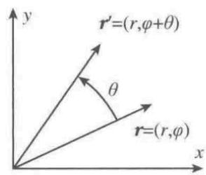

# 第2章 对称性

## 向量空间

满足如下规则

- 数乘的封闭性；
- 加法的封闭性：任意两个数的和仍然是原集合中的数；
- 满足加法交换律（$\ket x + \ket y = \ket y+ \ket x$）、加法结合律（$(\ket x + \ket y) + \ket z = \ket x+(\ket y + \ket z)$）、乘法结合律、乘法分配律。
- 存在零元素$\ket 0$，满足$\ket x +  \ket 0 = \ket x$。

如果存在系数 $a_i$ 令
$$
\sum_{i = 1}^N a_i \ket i = 0.
$$
 的解为 $a_i=0, \ \text{for all} \ i$，则称为这 $i$ 个向量相互线性无关；反之则相关。

在 $n$ 维向量空间中，任意 $n$ 个线性无关向量可以表示为空间的基，任意矢量可以表示为基的线性叠加。

#### 标积/内积

定义$\braket{x}{y} = x^*_iy_j \braket{e_i}{e_j} \rightarrow x^*_iy_i \quad \text{正交归一基}$

性质：

- $\braket{x}{y}^T = \braket{y}{x}$
- $\braket{x}{y} > 0 $
- $\braket{x+y}{z} = \braket{x}{z}+\braket{y}{z}$

#### 算符

作用在向量上的一个操作。

如果算符满足
$$
\hat O (a\ket x + b\ket y) =  a\hat O\ket x + b\hat O\ket y,
$$
则称算符是线性的。

如果 $\hat O\ket x = \ket y$ ，则

在向量空间中，算符可以用一个矩阵表示，也就是
$$
\hat O_{ij} = \braket{i}{\hat O j}.
$$

#### 相似变换

在不同的基 $\left\{ \ket{e_j} \right\}$ 与 $\left\{ \ket{e_i'} \right\}$ 中 $e_i' = S_{ij}e_j$ ，同一向量会有不同的表示（ $\ket{x}  = x_j \ket{e_j} = x_i'\ket{e_i'} = x_i' S_{ij}e_j$ ）。

所以有
$$
x_j = x_i'S_{ij}.
$$
如果有$\ket{y'} = \hat O'\ket{x'}$，$\ket{y} = \hat O\ket{x}$，描述的是**同一空间下不同基**的算符作用，那么有如下变换关系
$$
\ket{y'} = U\ket{y} = U\hat O \ket{x} =U\hat O U^{-1}\ket{x'}.
$$
所以可以得到
$$
\hat O' = U\hat O U^{-1}.
$$
如果 $U$ 是**幺正（转置共轭为倒矩阵）**的，那么有
$$
U^\dagger U = 1.
$$

## 群

处在同一个向量空间中的算符，满足特定条件后可以构成一个参数空间，这个参数空间又被称为群。群中元素的数目就是群的维度，群需要满足以下条件：

（1）如果 $\hat { S }$ 和 $\hat { S } ^ { \prime }$ 是同一个群中的不同元素（算符），那么总可以定义一个新的元素（算符）$\hat { T } = \hat { S } \cdot \hat { S } ^ { ' } $。这样 $\hat { T }$ 也是同类型的对称操作（属于相同的群）。一般我们定义这个==乘积是先== $\hat { S } ^ { \prime }$ 后 $\hat { S }$ ==作用于系统==（就是位置决定了先后作用顺序，也可以说是不满足乘法交换律）。

（2）乘法结合律，即对所有的 $\hat { S } , \hat { S } ^ { \prime }$ 和 $\hat { S } ^ { \prime \prime } ,$ 我们有

$$
\hat { S } \cdot ( \hat { S } ^ { \prime } \cdot \hat { S } ^ { \prime \prime } ) = ( \hat { S } \cdot \hat { S } ^ { \prime } ) \cdot \hat { S } ^ { \prime \prime }
$$

（3）存在一个恒等操作1，其具有性质：

$$
1 \cdot \widehat { S } = \widehat { S } , \quad \widehat { S } \cdot 1 = \widehat { S }
$$

​	需要注意在这里不能认为 $1 \cdot \widehat { S } =  \widehat { S } \cdot 1 $ ，因为算符的操作不满足乘法交换律。一般恒等操作通过“什么都不做”的操作实现，例如角度为零的转动。

（4）对每一个 ${ \hat { S } } ,$ 有一个逆 $\hat { S } ^ { - 1 }$ ，即

$$
\hat { S } \cdot \hat { S } ^ { - 1 } = 1 , \quad \hat { S } ^ { - 1 } \cdot \hat { S } = 1
$$

​	同样这里要注意不能认为 $\hat { S } \cdot \hat { S } ^ { - 1 } =  \hat { S } ^ { - 1 }\cdot \hat { S } $ 。

我们感兴趣的群可以划分为两种截然不同的类：一类群的群元素依赖于连续参数，比如平动和转动群，其分别就平移矢量和转动角度而言是参数化的，群参数的个数就是群的维数；另一类群由分立（不连续）操作组成，比如空间或时间反演。

在连续群中，如果群是参数构成有限单连通区域（单连通空间中所有闭曲线都能连续地收缩至一点），就是紧致群；如果**群参数可以微分**，就是李群。

#### 例子： $\text{SO}(2)$ 群

$\text{SO}(2)$ 群的具体形式为
$$
\left(\begin{matrix}
\sin\theta & \cos\theta \\
-\cos\theta & \sin\theta
\end{matrix}\right)
$$
可以看出，虽然这是一个 $2\times 2$ 矩阵，但是其群参量只有一个且是连续的，所以是一维李群。

也可以说：群本身就是一个含参算符。

#### 例子：二维平移群

二维平移群是一个 $2\times 2$ 矩阵，其作用与一个位置矢量 $\vec x$ 的作用是
$$
\hat g(\alpha,\beta) \vec x = \hat g(\alpha,\beta) (x,y) = (\alpha + x,\beta+y).
$$
如果两个平移操作连续作用，会有
$$
\hat g(\alpha,\beta)\hat  g(\gamma,\delta) \vec x =\hat  g(\alpha,\beta)(\gamma + x,\delta+y) = (\alpha+\gamma+x,\beta+\delta+y) =\hat  g(\alpha+\gamma,\beta+\delta)(x,y).
$$
可以看出两个群员的乘积仍然在群中，证明了其封闭性。
$$
\left[\hat  g(\alpha,\beta)\hat  g(\gamma,\delta) \right]\hat  g(\mu,\nu) \vec x= (\alpha+\gamma+\mu+x,\beta+\delta+\nu+y) = \hat g(\alpha,\beta) \left[\hat  g(\gamma,\delta)\hat  g(\mu,\nu) \right] \vec x.
$$
其乘法结合律也被证明。
$$
\hat g(0,0)\vec x = \vec x.
$$
说明单位元也存在。
$$
\hat g(\alpha,\beta)\hat  g(-\alpha,-\beta) \vec x = \vec x
$$
证明了逆元素的存在。

说明二维平移操作是一个群。

---

### 连续群的生成元

需要注意在下面的讨论中， **$N$ 表示矢量 $\vec x$ 的维度， $r$ 表示 $\vec \alpha$ 的维度。**

生成元有两种意思，分别是**某个李群的李代数生成元**以及**李代数元素在函数表示中的生成元**。前者表示一个抽象的生成元；后者表示群作用在某个空间（函数空间或者 Hilbert 空间），李代数生成元通过映射变成一个具体算符。

所谓“生成元”就是指一组能够生成整个李代数的元素，也就是找到李代数这个向量空间中的一组完备基矢（**李代数生成元 = 一组完备基矢**）。

连续群具有生成元（或“产生子”），其数量不止一个。生成元与无穷小变换有关，比如
$$
\vec x \rightarrow \vec x',\vec x' = g(\vec \alpha)\vec x = \vec f(\vec x,\vec \alpha).
$$
其中变换 $f(\vec\alpha,\vec x)$ 可以对 $\vec \alpha$ 在 $\vec \alpha = 0$ 泰勒展开到一阶，为
$$
\vec f(\vec x, \vec\alpha) = \vec f(\vec x,0) +  \mathrm d\vec\alpha \cdot \nabla_\alpha \vec f |_{\vec \alpha = 0}.
$$

对于无穷小变化 $\mathrm d \vec x$ 有
$$
\mathrm d \vec x = \mathrm d \vec \alpha \cdot \nabla_\alpha \vec f |_{\alpha=0} = \sum_{i=1}
^r\mathrm d \alpha_i\frac{\partial}{\partial \alpha_i}\vec f |_{\vec \alpha = 0},\\
\mathrm d x_k = \sum_{i=1}^r\mathrm d \alpha_i U_i^k.
$$
其中 $\boxed{U_i^k = \frac{\partial}{\partial \alpha_i} f_k |_{\vec \alpha = 0} }$ 。变换无穷小地作用在一个标量函数 $F(\vec x)$ ，造成的无穷小变化为
$$
\mathrm d F(\vec x) = \sum_{k = 1}^N \frac{\partial F(\vec x)}{\partial x_k} \mathrm{d}x_k = \sum_{k = 1}^N \frac{\partial F(\vec x)}{\partial x_k} \cdot \sum_{i=1}^rU_i^k\mathrm d \alpha_i  = \sum_{i=1}^r\mathrm d \alpha_i \hat G_iF(\vec x).
$$
其中
$$
\boxed{\hat G_i = \sum_{k=1}^N U_i^k\frac{\partial}{\partial x_k}. \quad i = 1,2,3,...,r}
$$
就是群 $G$ 的生成元，用于产生 $F(\vec x)$ 的无穷小变化。

#### 例子：二维正交变化群（转动群、 $\mathrm{SO}(2)$ 群）

#####  $\mathrm{SO}(n)$ 群

$\mathrm{SO}(n)$ 群，又称转动群，就是满足如下定义的群
$$
\boxed{SO(n) = \left\{ X \in M_n(\mathbb R) | X^T  X = I \quad \text{and} \quad \det(X) = 1 \right\}}
$$
就是这个群中所有元素都是**对称==实==矩阵**且**行列式为 1** 。旋转操作前后波函数归一化不能变，也就是可以计算出
$$
X^{\dagger}X = \left|\det{X} \right|^2 = 1.
$$
由于 $\mathrm{SO}(n)$ 是实数群，因此 $\det{X} = \pm 1$ 。此时如果我们不限制 $\det(X) = 1 $ ，则在转动过后参考系可能从右手系  变为左手系，也就是额外引入了一个反射操作。

这样子的群元自由度为
$$
\text{dim} \ SO(n) = \frac{n(n-1)}{2}.
$$
所有的产生子都是无穷小变换，记
$$
A' = (I+\delta X)A.
$$
于是
$$
A^T(I+\delta X^T)(I+\delta X)A = A^T(I+\delta X^T+\delta X)A = A^TA \rightarrow \delta X^T+\delta X = 0.
$$
可以看出来，这里只有反对称矩阵的限制条件，所以**只有反对称矩阵条件对群元有约束，行列式为1不约束**。

$\mathrm{SO}(2)$ 群只有一个自由度，也就是其生成元只有一个。

##### 生成元

形容转动的时候有两个观点，分别是主动与被动。所谓主动是指**坐标轴保持固定，转动函数**，就是 $(\hat R\psi)(\vec r) = \psi(\hat g^{-1}\vec r)$ ；被动观点就是**转动坐标轴，函数不变**，就是 $\psi'(\vec r') = \psi(\hat g^{-1}\vec r')$ 。需要注意的是，这里的函数不变不是指函数形式不变而是指物理场不变，也就是说一个点在转动前后的位置不同，但是其值是不变的，被动观点我们一般写成 $\psi'(\vec r) = \psi(\hat g^{-1}\vec r)$ 。

首先考虑**被动观点**，也就是矢量 $(x,y)$ 的转动变化 $\phi$ 的结果 $(x',y')$ 有如下关系
$$
\vec r' = \hat{g}(\phi) \vec r.\\
x' = f_x(x,y,\phi) =  x\cos\phi - y\sin\phi,\\
y' = f_y(x,y,\phi) = x\sin\phi + y\cos\phi.
$$
类比之前的讨论，可以发现 $r = 1$ ，于是转动群的生成元可以表示为
$$
U_1^x = \frac{\partial }{\partial \phi}f_x|_{\phi=0} = -y,\\
U_1^y = x.\\
\hat G_\phi = U_\phi^x\frac{\partial}{\partial x} + U_\phi^y\frac{\partial}{\partial y} = -y\frac{\partial}{\partial x} + x\frac{\partial}{\partial y}.
$$
其中 $\hat G_\phi = -y\frac{\partial}{\partial x} + x\frac{\partial}{\partial y}$ 是 $SO(2)$ 群**在函数空间上微分算子表示**。

==或者==

无穷小的作用，也就是对算符做展开。所以可以直接对无穷小角度 $\delta \theta$ 转动矩阵展开，只保留一阶有
$$
\hat g(\theta) =
{ \left( 
\begin{matrix}
{ \cos \ \theta } & { - \sin \ \theta }   \\
{ \sin \ \theta  } & { \ \cos \ \theta } 
\end{matrix} 
\right) } \rightarrow
\hat g(\delta\theta) = 
{ \left( 
\begin{matrix}
1 & -\delta\theta   \\
\delta\theta & 1 
\end{matrix} 
\right) }
= 
I + \delta \theta
{ \left( 
\begin{matrix}
0 & -1   \\
1 & 0
\end{matrix} 
\right) }
= I+\delta\theta X .
$$
其中 $X=\left( 
\begin{matrix}
0 & -1   \\
1 & 0
\end{matrix} 
\right)$ 是 $SO(2)$ 群在矢量空间 $\mathbb R^2$ 上矩阵表示的**李代数生成元**。

==或者==

仍然考虑标量函数 $\psi( \vec r )$ ，对其**主动转动变化**，于是会有
$$
\hat R\psi(\vec r ) = \psi'( \vec r ) = \psi( \hat g^{-1}\vec r ).
$$
其中 $\hat g^{-1} = \left( 
\begin{matrix}
{ \cos \alpha  } & {  \sin \alpha  }   \\
{ - \sin \alpha  } & { \ \cos \alpha  } 
\end{matrix} 
\right)$ ，对其中的 $\alpha = 0$ 做展开，有
$$
\hat R\psi( \vec r ) = \psi'( \vec r' ) = \psi\left[ \hat g^{-1}(\alpha)\vec r \right] = \psi(x\cos\alpha+y\sin\alpha , -x\sin \alpha+y\cos\alpha)\\
= \psi(x,y) + \frac{\partial \psi}{\partial \alpha}|_{\alpha = 0}\mathrm d \alpha \\
= \psi(x,y) + \\
\left[ \frac{\partial\psi}{\partial (x\cos\alpha+y\sin\alpha)}\frac{\partial (x\cos\alpha+y\sin\alpha)}{\partial \alpha} + \frac{\partial\psi}{\partial (-x\sin \alpha+y\cos\alpha)}\frac{\partial (-x\sin \alpha+y\cos\alpha)}{\partial \alpha} \right]|_{\alpha = 0}\mathrm d \alpha\\
$$
考虑无穷小转动的作用
$$
\hat R(\mathrm d\alpha)\psi( \vec r ) = \left[I - \frac{i}{\hbar}\hat L_z\mathrm d \alpha\right] \psi( \vec r ),\\
\hat R(\mathrm d\alpha) = \left[I - \frac{i}{\hbar}\hat L_z\mathrm d \alpha\right].
$$

导致无穷小变化的程度就是 $- \frac{i}{\hbar}\hat L_z$ ，所以此时 $SO(2)$ **在 Hilbert 空间上的幺正表示**是
$$
\hat G_\phi  = - \frac{i}{\hbar}\hat L_z.
$$
首先我们关注一下主动和被动观点计算出来的结果相差一个负号。其实这个很好理解，就是主动观点下函数转动的方向与被动观点下的坐标轴转动方向正好相反，所以正好有一个负号的差异。

---

### 李代数

**李代数** $\mathfrak g$ 就是一个定义在复数域上的向量空间。这个向量空间中的元素一定要满足的运算法则为
$$
\boxed{\left[G_\mu,G_\nu \right] = -\left[G_\nu,G_\mu \right]},\\
\boxed{\left[\left[G_\mu,G_\nu \right],G_\tau \right] + \left[\left[G_\nu,G_\tau \right],G_\mu \right] + \left[\left[G_\tau,G_\mu \right] ,G_\nu \right] =0}.
$$
定义对易关系
$$
\left[G_\mu,G_\nu \right] = G_\mu G_\nu - G_\nu G_\mu,
$$
李群生成元（李代数基矢）的对易关系为
$$
\boxed{\left[G_\mu,G_\nu \right] = \sum_{\lambda = 1}^r C_{\mu\nu}^{\lambda}G_\lambda},
$$
其中 $C_{\mu\nu}^\lambda$ 是李代数结构常数，上面的操作相当于将对易结果展开到完备基 $\left\{G_\lambda\right\}$ 上，这个关系又可以称为**李代数关系**或者**李代数结构**。结构常数满足
$$
C_{\mu\nu}^{\lambda} = -C_{\nu\mu}^{\lambda}.
$$
考虑有雅可比恒等式
$$
\left[\left[G_\mu,G_\nu \right],G_\tau \right] + \left[\left[G_\nu,G_\tau \right],G_\mu \right] + \left[\left[G_\tau,G_\mu \right] ,G_\nu \right] =0,
$$
于是有
$$
\sum_\lambda C_{\mu\nu}^\lambda C_{\lambda\tau}^{\delta} + C_{\tau\mu}^\lambda C_{\lambda\nu}^{\delta} + C_{\nu\tau}^\lambda C_{\lambda\mu}^{\delta}  = 0,
$$

使用**爱因斯坦求和约定**可以写成
$$
\boxed{C_{\mu\nu}^\lambda C_{\lambda\tau}^{\delta} + C_{\tau\mu}^\lambda C_{\lambda\nu}^{\delta} + C_{\nu\tau}^\lambda C_{\lambda\mu}^{\delta}  = 0}.
$$

可以通过李代数获得对应的李群。在实践中，相比于构造具有正确对易性质的群（矩阵），构造李代数的表示通常要容易得多（因为构造李代数只用考虑构造出合适的满足李括号的生成元而不必考虑构造满足矩阵乘法的群），一旦有了李代数生成元（比如 $\hat J_n$ ）的矩阵表示，可以通过一个称为“指数映射”的过程，来恢复出**李群元素**的矩阵表示（即 $\hat R(\theta) = \mathrm e ^{ - \mathrm{i}\theta \hat J_n}$ ）。

#### 例如：角动量算符的李代数

角动量算符构成一个 $\mathrm{so}(3)$ 的李代数。考虑角动量算符的对易关系
$$
\left[\hat L_i, \hat L_j\right] = i\hbar\varepsilon_{ijk}\hat L_k,
$$

如果我们定义李代数基矢（李群生成元）$J_i = \frac{1}{i\hbar}\hat L_i$，显然李代数结构（李代数关系）可以写为
$$
\left[ J_i,J_j \right] = \varepsilon_{ijk}J_k.
$$
所以可以直观的看出结构常数
$$
C_{ij}^k = \varepsilon_{ijk},
$$

李代数的结构常数满足的雅可比恒等式为，其中使用了**爱因斯坦求和约定**
$$
\varepsilon_{ijl}\varepsilon_{lkp} + \varepsilon_{kil}\varepsilon_{ljp} + \varepsilon_{jkl}\varepsilon_{lip} = 0.
$$
注意如下常用关系

- $ \varepsilon_{ijk}\delta_{ij} = 0 $
- $\delta_{ij}\delta_{ij}=3$
- $\delta_{ij}\delta_{jk} = \delta_{ik}$
- $\varepsilon_{ijk}\varepsilon_{ijk} = 6$
- $\varepsilon_{ijk}\varepsilon_{ijl} = 2\delta_{kl}$
- $\varepsilon_{ijl} \varepsilon_{lkp} = \delta_{ik} \delta_{jp} - \delta_{ip} \delta_{jk}$

---

### 卡西米尔算符

所谓卡西米尔算符，就是与群的**任意**生成元 $\hat G_i$ 对易的算符。
$$
\left[\hat C_\lambda,\hat G_i\right] = 0
$$
如果 $\hat C_\lambda,\hat C_\sigma$ 是卡西米尔算符，那么 $\hat C_\lambda\hat C_\sigma$ 以及 $\hat C_\lambda+\hat C_\sigma$ 都是卡西米尔算符。

卡西米尔算符可以通过群的生成元构造
$$
\boxed{\hat C_\lambda = \sum_{\mu\nu} g_{\mu\nu}\hat G_\mu \hat G_\nu}.
$$
其中 $ g_{\mu\nu} = \sum_{\tau\rho}C_{\mu\tau}^\rho C_{\nu\rho}^\tau$ ，$C_{\mu\tau}^\rho$ 是李代数结构常数。需要注意的是，卡西米尔算符不唯一，只能说能找到一个卡西米尔算符。

#### 例如 $\mathrm{SO}(3)$ 群的角动量代数卡西米尔算符

根据之前的知识，其李代数结构常数为
$$
C_{ij}^k = \varepsilon_{ijk}.
$$
其生成元为 $\hat L_x, \hat L_y, \hat L_z$ ，于是可以计算出卡西米尔算符为
$$
g_{\mu\nu} = \sum_{\tau\rho}\varepsilon_{\mu\tau\rho} \varepsilon_{\nu\rho\tau} = -\sum_{\tau\rho}\varepsilon_{\mu\tau\rho} \varepsilon_{\nu\tau\rho} = -2\delta_{\mu\nu}\\
\rightarrow \hat C_\lambda = \sum_{\mu\nu} -2\delta_{\mu\nu}\hat L_\mu \hat L_\nu = -2\hat L^2.
$$

注意，在这里的计算中交换了 $\varepsilon_{ijk}$ 的两个下标，所以需要取负号。

---

### 群的矩阵表示

群 $G$ 的元素 $g_m$ ，如果存在一个映射 $D(g_m)$ 将群元映射成一个矩阵，那么就说 $D(g_m)$ 是群元 $g_m$ 的矩阵表示。

如果 $D(g_m)$ 作用在一个波函数基矢上，则有
$$
\hat g_m \ket{\psi_i} = \sum_{j} D_{ji}^m \ket{\psi_j}.\\
\rightarrow \bra{\psi_k}g_m\ket{\psi_i} = \sum_jD_{ji}^m \bra{\psi_k}\ket{\psi_j} = \sum_jD_{ji}^m \delta_{kj} = D_{ki}^m.
$$
可以得到群的矩阵表示为
$$
\boxed{D_{ij}^m = \bra{\psi_i}g_m\ket{\psi_j}}.
$$
可以通过如下方式验证，群元的封闭性在矩阵表示中也必须严格实现。
$$
D(g_1)D(g_1) = D(g_1g_2)
$$

#### 例子： $\mathrm{SO}(n)$ 的李代数生成元（一般性结论）

  $\mathrm{SO}(n)$ 的群参数有 $r_{ij}, i<j$，其无穷小变换为$\delta X(r_ij) = r_{ij}(E^{ij} - E^{ji})$，其中$E^{ij}$ 是只在第 $i$ 行第 $j$ 列位置为 $1$，其他所有位置都为 $0$ 的矩阵。所以 ** $\mathrm{SO}(n)$ 群李代数生成元为 $E^{ij} - E^{ji}$ **。

---

### 群链

群链就是描述一个群不断破缺对称性之后获得的一堆子群。

---

### 二次量子化中的李代数

==就是利用升降算符，计算对易关系获得结构常数，最后通过验证 Jacobi 恒等式是否成立来验证李代数有没有被构造。==

李代数的生成元往往以二次量子化的形式出现。数学上的原因很简单：如果粒子是在 $n$ 个单粒子波函数空间中产生的，它可以用这些波函数的一些线性组合来描述。将波函数改变为另一个这样的线性组合的变换对应于 $\mathrm{U} ( n )$ 群的一个元素。或者，这种再分布可以通过产生和湮没算符的一些结合 $\hat { a } _ { j } ^ { \dagger } \hat { a } _ { k }$ 来实现，其作用是把粒子从原来的态中除去，然后把它放入新的态。最简单的例子又是由无处不在的转动群提供的，在这种情况下，它化身为 $\mathrm{SU} ( 2 )$ 。

考虑一个能存在于两种不同态的费米子。考虑同位旋作为最简单的例子，把它们记为$\ket{p}$和 $\ket{n}$ ，它们将通过使用算符 $\hat { a } _ { p } ^ { \dagger }$ 和 $\hat { a } _ { n } ^ { \dagger }$ 产生，这样

$$
\ket{p} = \hat { a } _ { p } ^ { \dagger } \ket{0} , \quad \ket{n} = \hat { a } _ { n } ^ { \dagger } \ket{0}
$$

于是粒子的状态改变可以由算符 $\hat { a } _ { n } ^ { \dagger } \hat { a } _ { p }$ 和 $\hat { a } _ { p } ^ { \dagger } \hat { a } _ { n }$ 分别促成。这可能与角动量理论的移位算符相对应。如果将 $1/2$ 的投影赋值给态$\ket{p}$，将 $- 1 / 2$ 的投影赋值给态$\ket{n}$，我们就可以定义角动量算符：

$$
\hat { J } _ { + } = \hat { a } _ { p } ^ { \dagger } \hat { a } _ { n } , \quad \hat { J } _ { - } = \hat { a } _ { n } ^ { \dagger } \hat { a } _ { p }
$$

此外，可以推测角动量算符的 $z$ 分量为

$$
\hat { J } _ { z } = \frac { 1 } { 2 } ( \hat { a } _ { p } ^ { \dagger } \hat { a } _ { p } - \hat { a } _ { n } ^ { \dagger } \hat { a } _ { n } )
$$

这清楚地产生了两个态所希望的本征值 $\pm 1 / 2$

这**是否产生李代数可以通过求对易关系来检验**。由于算符 $\hat { a } _ { n }$ 能反对易到后面，我们有

$$
[ \hat { a } _ { p } ^ { \dagger } \hat { a } _ { p } , \hat { a } _ { p } ^ { \dagger } \hat { a } _ { n } ] = [ \hat { a } _ { p } ^ { \dagger } \hat { a } _ { p } , \hat { a } _ { p } ^ { \dagger } ] \hat { a } _ { n } = \hat { a } _ { p } ^ { \dagger } \hat { a } _ { n }
$$

使用算符 $\hat { a } _ { n } ^ { \dagger } \hat { a } _ { n }$ 的类似结果，我们得到

$$
\left[ \frac { 1 } { 2 } ( \hat { a } _ { p } ^ { \dagger } \hat { a } _ { p } - \hat { a } _ { n } ^ { \dagger } \hat { a } _ { n } ) , \hat { a } _ { p } ^ { \dagger } \hat { a } _ { n } \right] = \hat { a } _ { p } ^ { \dagger } \hat { a } _ { n }
$$

或

$$
[ \hat { J } _ { z } , \hat { J } _ { + } ] = \hat { J } _ { + }
$$

正如角动量移位算符一样。**类似地，所有其他的角动量对易规则都可以得到确认（这样就可以获得李代数的结构常数了，如果结构常数满足 Jacobi 恒等式，那么证明了可以构成李代数）**。这样，我们用二次量子化算符形式实现了 $\mathrm{SU}( 2 )$ 群的全李代数。

类似地， $\mathrm{SO} ( n )$ 的生成元可以简单看出。每个矩阵 $E ^ { ( i j ) }$ 对应于一个算符对 $\hat { a } _ { i } ^ { \dagger } \hat { a } _ { j }$ ，这样二次量子化形式变为

$$
\hat { G } _ { i j } = \hat { a } _ { i } ^ { \dagger } \hat { a _ { j } } - \hat { a } _ { j } ^ { \dagger } \hat { a _ { i } }
$$

该方法将被应用到一个六维空间的更复杂的相互作用玻色子近似情况（6.8节）。

然而，也有一个角动量代数应用的例子，在这种情况下，与 $\mathrm{SU} ( 2 )$ 群的连接不是那么平凡，这个例子是7.5.3小节解释的准自旋模型。

对易关系就是
$$
\left[\alpha^\dagger_p\alpha_p,\alpha_p^\dagger\alpha_n \right] = \alpha_p^\dagger\alpha_n\\
\left[\alpha_i,\alpha_j^\dagger \right] = \delta_{ij},\\
\left[J_z,\alpha_p^\dagger\alpha_n \right] = \alpha_p^\dagger\alpha_n.
$$

###  $\mathrm{SU} ( n )$ 群

$\mathrm{SU} ( n )$ 群，又称“ **特殊幺正群**”，定义为幺正群 $U(n)$ $+$ 行列式为 $1$ （特殊条件），与 $\mathrm{SO} ( n )$ 类似，只是将转置变为厄密共轭
$$
\boxed{SU(n) = \left\{ X \in M_n(\mathbb C) | X^\dagger  X = I \quad \text{and} \quad \det(X) = 1 \right\}}.
$$
其中幺正群的要求来源于量子力学中要求波函数变换之后归一化不变的要求
$$
\bra\psi\ket{\psi} = 1 \rightarrow \bra{\psi} X^\dagger X \ket{\psi} = 1 \rightarrow X^\dagger X = 1.
$$
 $\det(X) = 1 $ 来源于相位的要求，首先考虑 $X^\dagger X$ 的行列式
$$
\det(X^\dagger X) = \det (X^{\dagger}) \det(X) = 1 \rightarrow \det(X) = \mathrm e^{i\phi}.
$$
也就是说，群有一个相位不确定性，但是不同相位波函数反应的是一个量子态，所以这种相位不确定性最好还是消除，所以我们定义 $\det(X) = 1 $ 。

由于 $\mathrm{SU} ( n )$ 群元素是复数，所有其是 $n \times n$ 的复矩阵，每个复元素贡献两个自由度（实部和虚部），共有自由度 $2n^2$ 。由于 $X$ 应该是一个厄密矩阵，就是说 $X^{\dagger} = X^{-1}$ ，所以说其中**对角线元素一定是实数**，此时自由度变为上三角的 $(n^2 -n )/2$ 个复数以及主对角线的 $n$ 个，总共 $n^2 - n + n = n^2$ 自由度。

 $\det(X) = 1 $ 确定了相位，丧失一个相位的自由度，所以总自由度是 $n^2 - 1$ 。

####  $\mathrm{SU} ( 2 )$ 群的李代数生成元

由于我们已经得到的结果，可以知道 $\mathrm{SU} ( 2 )$ 的形状可以写成
$$
A = \left( \begin{matrix}
a & b+\mathrm ic\\
b-\mathrm ic & -a \\
\end{matrix} \right) \\ \rightarrow \delta A = \left( \begin{matrix}
\delta a & \delta b+\mathrm i\delta c\\
\delta b-\mathrm i\delta c & -\delta a \\
\end{matrix} \right)= \delta a\left( \begin{matrix}
1 & 0\\
0 & -1 \\
\end{matrix} \right)+\delta  b \left( \begin{matrix}
0 & 1\\
1 & 0 \\
\end{matrix} \right)+\delta  c \left( \begin{matrix}
0 & \mathrm i\\
\mathrm i & 0 \\
\end{matrix} \right).
$$
于是可以发现 Pauli 矩阵就是 $\mathrm{SU} ( 2 )$ 的李代数生成元。

###  $\mathrm{SU}( 3 )$ 群

 $\mathrm{SU}( 3 )$ 群的生成元有 8 个，分别是
$$
\lambda_\tau = \left(\begin{matrix}
\sigma_i & & 0\\
& & 0\\
0&0&0
\end{matrix}\right), \tau = 1,2,3,\\
\lambda_4 = \left(\begin{matrix}
0 & 0 & 1\\
0 & 0 & 0\\
1&0&0
\end{matrix}\right),
\lambda_5 = \left(\begin{matrix}
0 & 0 & -\mathrm i \\
0 & 0 & 0\\
\mathrm i&0&0
\end{matrix}\right),
\lambda_6 = \left(\begin{matrix}
0 & 0 & 0 \\
0 & 0 & 1\\
0 & 1 & 0
\end{matrix}\right)\\
\lambda_7 = \left(\begin{matrix}
0 & 0 &0 \\
0 & 0 &  -\mathrm i\\
0&\mathrm i&0
\end{matrix}\right),
\lambda_8 = \frac{1}{\sqrt3}\left(\begin{matrix}
1 & 0 & 0 \\
0 & 1 & 0\\
0&0&-2
\end{matrix}\right)\\
$$
李代数
$$
\left[\lambda_a,\lambda_b\right] = 2\mathrm if_{abc}\lambda_c,\\
\left\{ \lambda_a,\lambda_b \right\} = \frac{4}{3}\delta_{ab}I+2d_{abc}\lambda_c,\\
\rightarrow \Tr(\lambda_a,\lambda_b) = 2\delta_{ab}.
$$
其中，$f_{abc} = \Tr(\lambda_a\left[\lambda_b,\lambda_c\right])$，$d_{abc} = \Tr(\lambda_a\left\{ \lambda_b,\lambda_c \right\})$

---

## 2.2 平移

### 2.2.1 平移算符

以下计算了平移算符的形式、微分形式、生成算符以及对算符的作用

平移不变性提供了一种对称性，然而这在核物理中并不太有用，但其作为一个很简单的例子可用于说明许多方法，这些方法将被用于更复杂的转动情况。平移不变性通常可以很简单地被考虑，但是在核物理的一些情况中它扮演了更微妙的角色。例如一个带有规定势的唯象单粒子模型不满足平移不变性，因为势必须在空间处于固定位置，必须特别考虑以纠正这个问题。

一个带有动量 $p$ 和自旋 $s$ 位于 $r$ 的点粒子的平移由以下操作定义：

$$
r \rightarrow r ^ { \prime } = r + a , \quad p \rightarrow p ^ { \prime } = p , \quad s \rightarrow s ^ { \prime } = s
$$

矢量 $a$ 是表示粒子所作移动的常矢量。这是变换的主动视角。被动视角可以通过移动坐标系统来实现，其对应于移动粒子 $- \vec a$ 。这两种变换表述是等价的，但是可能导致公式中的符号不同。本书**自始至终使用主动视角**。

如果粒子用波函数 $\psi ( r , p , s )$ 描述，平移的波函数被简单地定义为让波函数值随粒子一起移动，即新位置 $\boldsymbol { r } ^ { \prime }$ 的值与在位置 $r$ 的原波函数值相同：

$$
\psi ^ { \prime } ( r ^ { \prime } ) = \psi ^ { \prime } ( r + a ) = \psi ( r )
$$

而在点 $r$ 处的值通过将这两点移动 $- a$ 给出：

$$
\psi ^ { \prime } ( r ) = \psi ( r - a )
$$

量子力学中将 $\psi ( r )$ 变换到 $\psi ^ { \prime } ( r )$ 的行为由算符 $\hat { U } ( a )$ 表示。将上式用泰勒级数在 $\vec a=0$ 处展开做到：

$$
{ \begin{array} { l } { \displaystyle \psi ^ { \prime } ( \pmb { r } ) = \psi ( \pmb { r } ) - \pmb { a } \bullet \nabla \psi ( \pmb { r } ) + { \frac { 1 } { 2 ! } } ( - \pmb { a } \bullet \nabla ) ^ { 2 } \psi ( \pmb { r } ) - \cdots } \\ { \displaystyle = \sum _ { n = 0 } ^ { \infty } { \frac { ( - \pmb { a } \bullet \nabla ) ^ { n } } { n ! } } \psi ( \pmb { r } ) } \end{array} }
$$

形式上求和可以写成指数函数，算符 $\nabla$ 可以用动量算符 $\hat { p } = - \mathrm { i } \hbar \nabla$ 表示，这样

$$
\psi ^ { \prime } ( r ) = \exp ( - { \bf \lambda } { \bf a } \cdot \nabla ) \psi ( r ) = \exp \Bigl ( - \frac { \mathrm { \Large ~ i } } { \hbar } { \bf a } \cdot \hat { p } \Bigr ) \psi ( r )
$$

这样动量算符直接与平动联系在一起；**实际上，关于小位移 $a$ 的展开**导致

$$
\psi ^ { \prime } ( r ) \approx \Big ( 1 - \frac { \mathrm { ~ i ~ } } { \hbar } a \cdot \hat { p } \Big ) \psi ( r )
$$

所以 $\hat { p }$ 可以称为算符，或者称为无限小平移的生成元。

这样我们得到了平移算符

$$
\hat { U } (  { \bf } { a } ) = \exp \left( - \frac { \mathrm { ~ i ~ } } { \hbar } { a } \cdot \hat { p } \right)
$$

波函数按下式变换：

$$
 \hat { U } ( a ) \psi ( r ) = \psi ^ { \prime } ( r ) = \psi ( r - a )
$$

为找出位置依赖算符 $\hat { A } ( \boldsymbol { r } )$ 如何转换，只要记住 $\hat { A } \left( \boldsymbol { r } \right) \psi ( \boldsymbol { r } )$ 必须像一个波函数那样变换，这样

$$
\begin{array} { r l } & { \hat { A } ^ { \prime } ( r ) \psi ^ { \prime } ( r ) = \hat { A } ( r - a ) \psi ( r - a ) } \\ & { \qquad = \hat { U } ( \pmb { a } ) ( \hat { A } ( r ) \psi ( \pmb { r } ) ) } \\ & { \qquad = \hat { U } ( \pmb { a } ) \hat { A } ( r ) \hat { U } ^ { - 1 } ( \pmb { a } ) \hat { U } ( \pmb { a } ) \psi ( r ) } \end{array}
$$

所以算符按照下式变换：

$$
\hat { A } ^ { \prime } = \hat { U } \hat { A } \hat { U } ^ { - 1 }
$$

显然这是一般的结果，对任何变换群类似。

如果我们采用幂级数展开，立即可以看到对于算符的指数有

$$
\begin{array} { r } { \exp ( \hat { T } ) ^ { \dagger } = \exp ( \hat { T } ^ { \dagger } ) , \exp ( \hat { T } ) ^ { - 1 } = \exp ( - \hat { T } ) } \end{array}
$$

由于 $\hat { p }$ 是一个厄米算符，它与一个虚数的乘积在厄米共轭下改变符号，我们有

$$
\hat { U } ^ { \dagger } ( a ) = \hat { U } ^ { - 1 } ( a ) = \hat { U } ( - a )
$$

这样算符 $\hat { U } ( a )$ 是幺正的，于是它既使波函数的范数守恒也使它们之间的矩阵元守恒。反向平移和平移 $-a$ 一样，这只是正式地表述直觉上显而易见的东西。

### 2.2.2 平移不变性

这些讨论仍然适用于任意单粒子系统。推导的公式简单地表达了平动对波函数的作用而没有假定任何不变性质。如果**哈密顿量在平移下不变**（注意，这里的平移不变性是指 Hamiltonian 在平移后不变）的话，一个物理系统是平移不变的（注意 $\hat { H }$ 的所有其他自变量如自旋和动量为简洁起见都省略了）。对一个任意的a，一定有

$$
\hat { H } ^ { \prime } ( r ) = \hat { H } ( r - a ) = \hat { H } ( r )
$$

这意味着

$$
\hat { H' } ( r ) = \hat { U } ( { \pmb a } ) \hat { H } ( { \pmb r } ) \hat { U } ^ { - 1 } ( { \pmb a } ) = \hat { H } ( r )
$$

或通过右乘以 $\hat { U } ( a )$ ，得

$$
 \hat { U } ( a ) \hat { H } ( r ) = \hat { H } ( r ) \hat { U } ( a ) 
$$

即

$$
\left[ \hat { H } ( r ) , \hat { U } ( a ) \right] = 0
$$

这样哈密顿量与任意平移量为 $a$ 的平移算符对易。在这一点上使用式(2.10)变得有利：假如动量算符与 $\hat { H }$ 对易，很显然 $\hat { U } ( a )$ 与 $\hat { H }$ 对易不受特定位移a的影响。这导致一个比较简单的情况：

$$
[ { \hat { H } } , { \hat { p } } ] = 0
$$

综上所述，我们可以得出这样的结论：物理系统关于平动的性质都可以用动量算符表示。

### 2.2.3 多粒子系统

以下计算了多例子系统的平移算符，并且计算量质心矢量不同分量的对易关系。

一个多粒子系统的平动自然导致总动量的概念，再次给出一个对角动量来说将会更复杂的概念的简单介绍。 $N$ 个粒子组成的系统平移一个位移a表示为

$$
( r _ { 1 } , r _ { 2 } , \cdots , r _ { N } ) \rightarrow ( r _ { 1 } + a , r _ { 2 } + a , \cdots , r _ { N } + a )
$$

（就像此前一样，动量和自旋不受影响。）对于多体波函数，变换由下式给出：

$$
\phi ^ { \prime } ( r _ { 1 } , r _ { 2 } , \cdots , r _ { N } ) = \phi ( r _ { 1 } - a , r _ { 2 } - a , \cdots , r _ { N } - a )
$$

可以对每个坐标单独运用平移算符。因为这些算符指的是不同的自由度，它们对易，所以我们可以选择任意次序。

$$
\psi ^ { \prime } ( r _ { 1 } , r _ { 2 } , \cdots , r _ { N } ) = \hat { U } _ { 1 } ( { \pmb a } ) \hat { U } _ { 2 } ( { \pmb a } ) \cdots \hat { U } _ { N } ( { \pmb a } ) \psi ( r _ { 1 } , r _ { 2 } , \cdots , r _ { N } )
$$

这里 $\hat { U } _ { i } ( a )$ 对 $i$ 号坐标起作用：

$$
\hat { U } _ { i } ( \pmb { a } ) = \exp ( - \pmb { a } \cdot \nabla _ { i } ) = \exp \bigg ( - \frac { \mathrm { ~ i ~ } } { \hbar } \pmb { a } \cdot \hat { p } _ { i } \bigg )
$$

又由于 $\hat { p } _ { i }$ 对易，指数可以结合在一起而得出：

$$
\psi ^ { \prime } ( r _ { 1 } , r _ { 2 } , \cdots , r _ { N } ) = \exp \Big ( - \frac { \mathrm { i } } { \hbar } a \cdot \hat { P } \Big ) \psi ( r _ { 1 } , r _ { 2 } , \cdots , r _ { N } )
$$

其中 $\hat { P }$ 是总动量算符：

$$
\hat { P } = \sum _ { i = 1 } ^ { N } \hat { p } _ { i }
$$

所以**总动量算符表现为所有粒子同时作无穷小平移的算符**。

这也使得我们很容易明白多粒子系统的平移不变性实际上意味着什么：哈密顿量在所有粒子同时平移时应该是不变的。例如，对于二体相互作用，如果势能仅依赖于相对位置 $\boldsymbol { r } _ { i } - \boldsymbol { r } _ { j }$ （ $V(\vec r_i,\vec r_j),\ i \neq j $ 是一个互相互作用势能），一个标准形式的哈密顿量

$$
{ \hat { H } } = \sum _ { i = 1 } ^ { N } { \frac { { \hat { p } } _ { i } ^ { 2 } } { 2 m _ { i } } } + { \frac { 1 } { 2 } } \sum _ { \stackrel { i , j = 1 } { i \neq j } } ^ { N } V ( \boldsymbol { r } _ { i } , \boldsymbol { r } _ { j } )
$$

将是不变的。

总动量的正则共轭坐标是质心矢量：

$$
R = \frac { \displaystyle \sum _ { i = 1 } ^ { N } m _ { i } { r _ { i } } } { \displaystyle \sum _ { i = 1 } ^ { N } m _ { i } }
$$

通过验证，笛卡儿分量 $\hat { R } _ { { \scriptscriptstyle k } }$ 和 $\hat { P } _ { k ^ { \prime } }$ 满足（就是不同的位置分量的对易关系）

$$
[ \hat { R } _ { k } , \hat { P } _ { k ^ { \prime } } ] = \mathrm { i } \hbar \delta _ { k k ^ { \prime } }
$$

可以很容易地证明这一点。

---

## 2.3 转动

### 2.3.1 角动量算符

为了简化初步结论，首先考虑在极坐标系中的二维转动（图2.1）。点 $r =$ $( r , \varphi )$ 通过转动一个角度 $\theta$ 变为 $\boldsymbol { r } ^ { \prime } = ( r , \varphi + \theta )$ 。这个转动将用 ${ \mathcal { R } } ( \theta )$ 表示。与平移情况相似，我们能够定义转动后的波函数 $\psi ^ { \prime }$

$$
\psi ^ { \prime } ( r ^ { \prime } ) = \psi ( r )
$$

它在 $r$ 处的值由 $\psi$ 在那点的值决定，后者由转动带到 $r$

$\mathcal { R } ( \theta ) \psi ( r , \varphi ) = \psi ^ { \prime } ( r , \varphi ) = \psi ( r , \varphi - \theta )$ (2.31）角度 $\theta$ 的变动也可用泰勒级数展开表示：

$$
\begin{array} { l } { \displaystyle \psi ^ { \prime } ( \boldsymbol { r } , \varphi ) = \sum _ { n = 0 } ^ { \infty } \frac { ( - \theta ) ^ { n } } { n ! } \frac { \partial ^ { n } } { \partial \varphi ^ { n } } \psi ( \boldsymbol { r } , \varphi ) } \\ { = \exp \Big ( - \theta \frac { \partial } { \partial \varphi } \Big ) \psi ( \boldsymbol { r } , \varphi ) } \end{array}
$$

$$
\mathbf { \Pi } = \exp \Big ( - \frac { \mathrm { i } } { \hbar } \theta \hat { J } _ { z } \Big ) \psi ( r , \varphi )
$$

无穷小转动算符 $\hat { J } _ { z }$ 也可以在直角坐标系中写为

$$
{ \hat { J } } _ { z } \ = - \ { \mathrm { i } } \hbar \ { \frac { \partial } { \partial \varphi } } = - \ { \mathrm { i } } \hbar \left( x \ { \frac { \partial } { \partial y } } - y \ { \frac { \partial } { \partial x } } \right)
$$

因而与角动量算符是同一的。

#### 练习 2.1 角动量算符 $\hat { J } _ { z }$ 的笛卡儿形式

问题：推导角动量算符 $\hat{J}_{z}$ 的笛卡儿形式。

解答一种方法是简单地把柱坐标系中的表达式转换到笛卡儿坐标系中。然而，回到转动波函数的定义更具启发性。转动一个角度 $- \theta$ 由 $x \to x \cos \theta + y \sin \theta$ 和 $y \to y \cos \theta - x \sin \theta$ 给出，这样

$$
\mathcal{A}(\theta) \phi(x, y) = \phi(x \cos \theta + y \sin \theta, y \cos \theta - x \sin \theta)
$$

对于小角度 $\theta$，上式简化为（这里还是直接展开了）

$$
\begin{aligned}
\mathcal{R}(\theta) \psi(x, y) &\approx \psi(x + y \theta, y - x \theta) \\
&= \left( 1 + \theta \left( y \frac{\partial}{\partial x} - x \frac{\partial}{\partial y} \right) \right) \psi(x, y)
\end{aligned}
$$

比较对应的小角结果：

$$
\mathcal{R}(\theta) = \exp \left( - \frac{\mathrm{i}}{\hbar} \theta \hat{J}_{z} \right) \approx 1 - \frac{\mathrm{i}}{\hbar} \theta \hat{J}_{z}
$$

立即得到上面有关 $\hat{J}_{z}$ 的结果。

在笛卡儿坐标系中矢量 $\vec{r}$ 的转动本身可以写成矩阵形式：

$$
\begin{pmatrix} x' \\ y' \end{pmatrix} = \begin{pmatrix} \cos \theta & -\sin \theta \\ \sin \theta & \cos \theta \end{pmatrix} \begin{pmatrix} x \\ y \end{pmatrix}
$$

如果转动矩阵对小角度 $\theta$ 展开到一阶，我们也能够得到 $\hat{J}_{z}$ 的矩阵表示：

$$
\begin{pmatrix} x' \\ y' \end{pmatrix} = \begin{pmatrix} \cos \theta & -\sin \theta \\ \sin \theta & \cos \theta \end{pmatrix} \begin{pmatrix} x \\ y \end{pmatrix}
$$

这样

$$
J_{z} = - \mathrm{i} \hbar \begin{pmatrix} 0 & 1 \\ -1 & 0 \end{pmatrix}
$$

我们现在来展示**有限转动可以从这个矩阵复原**。对一个矩阵的指数函数的这个评估本身是很有启发性的，因为在这种情况下，使用的技巧总是重复出现：如果指数中矩阵的某个幂与单位矩阵成比例，就可以应用它。在现在这个情况下，我们有

$$
\exp \left( - \frac{\mathrm{i}}{\hbar} \theta J_{z} \right) = \sum_{n=0}^{\infty} \frac{ (-\theta)^{n} }{n!} \begin{pmatrix} 0 & 1 \\ -1 & 0 \end{pmatrix}^{n}
$$

$$
\begin{aligned}
&= \sum_{n=0}^{\infty} \frac{ (-\theta)^{2n} }{ (2n)! } \begin{pmatrix} 0 & 1 \\ -1 & 0 \end{pmatrix}^{2n} + \sum_{n=0}^{\infty} \frac{ (-\theta)^{2n+1} }{ (2n+1)! } \begin{pmatrix} 0 & 1 \\ -1 & 0 \end{pmatrix}^{2n+1} \\
&= \begin{pmatrix} 1 & 0 \\ 0 & 1 \end{pmatrix} \sum_{n=0}^{\infty} \frac{ (-1)^{n} \theta^{2n} }{ (2n)! } - \begin{pmatrix} 0 & 1 \\ -1 & 0 \end{pmatrix} \sum_{n=0}^{\infty} \frac{ (-1)^{n} \theta^{2n+1} }{ (2n+1)! } \\
&= \cos \theta \begin{pmatrix} 1 & 0 \\ 0 & 1 \end{pmatrix} - \sin \theta \begin{pmatrix} 0 & 1 \\ -1 & 0 \end{pmatrix} \\
&= \begin{pmatrix} \cos \theta & -\sin \theta \\ \sin \theta & \cos \theta \end{pmatrix}
\end{aligned}
$$

这里我们利用了

$$
\begin{pmatrix} 0 & 1 \\ -1 & 0 \end{pmatrix}^{2} = - \begin{pmatrix} 1 & 0 \\ 0 & 1 \end{pmatrix}
$$

这样，对于偶次幂一般有

$$
\begin{pmatrix} 0 & 1 \\ -1 & 0 \end{pmatrix}^{2n} = (-1)^{n} \begin{pmatrix} 1 & 0 \\ 0 & 1 \end{pmatrix}
$$

而对于奇次幂一般有

$$
\begin{pmatrix} 0 & 1 \\ -1 & 0 \end{pmatrix}^{2n+1} = (-1)^{n} \begin{pmatrix} 0 & 1 \\ -1 & 0 \end{pmatrix}
$$

这允许从连加号中取出矩阵而连加被三角函数取代。

通过无穷小变换算符的指数函数给出的有限变换的表示（前者反过来也可以表示为微分算符或矩阵）称为指数表示。

推导角动量算符的另一种可供选择的方法是**用有限转动的导数**。对于矩阵和微分算符形式，我们可以写出

$$
\hat{J}_{z} = \mathrm{i} \hbar \left. \frac{ \partial \mathcal{R}(\theta) }{ \partial \theta } \right|_{\theta=0}
$$

这仅仅是由于它被定义为泰勒级数中的一阶系数。

在三维的情况下转动有三个自由度，检查绕三个笛卡儿坐标轴的转动导致对二维结果的一个简单推广。对于绕 $z$ 轴的转动，有

$$
\begin{bmatrix} x' \\ y' \\ z' \end{bmatrix} = \begin{bmatrix} \cos \theta_{z} & -\sin \theta_{z} & 0 \\ \sin \theta_{z} & \cos \theta_{z} & 0 \\ 0 & 0 & 1 \end{bmatrix} \begin{bmatrix} x \\ y \\ z \end{bmatrix}
$$

这样根据，角动量矩阵为

$$
J_{z} = - \mathrm{i} \hbar \begin{bmatrix} 0 & 1 & 0 \\ -1 & 0 & 0 \\ 0 & 0 & 0 \end{bmatrix}
$$

类似地，对于绕 $y$ 轴的转动，有

$$
\begin{bmatrix} x' \\ y' \\ z' \end{bmatrix} = \begin{bmatrix} \cos \theta_{y} & 0 & \sin \theta_{y} \\ 0 & 1 & 0 \\ -\sin \theta_{y} & 0 & \cos \theta_{y} \end{bmatrix} \begin{bmatrix} x \\ y \\ z \end{bmatrix}
$$

对于矩阵中的==负号==，考虑了绕 $y$ 轴的正向转动把 $x$ 轴转到 $z$ 轴负方向这一事实（也就是旋转前后右手螺旋法则不变）。 相关的角动量矩阵是

$$
J_{y} = -\mathrm{i} \hbar \begin{bmatrix} 0 & 0 & -1 \\ 0 & 0 & 0 \\ 1 & 0 & 0 \end{bmatrix}
$$

最后，对于绕 $x$ 轴的转动，有

$$
\begin{bmatrix} x' \\ y' \\ z' \end{bmatrix} = \begin{bmatrix} 1 & 0 & 0 \\ 0 & \cos \theta_{x} & -\sin \theta_{x} \\ 0 & \sin \theta_{x} & \cos \theta_{x} \end{bmatrix} \begin{bmatrix} x \\ y \\ z \end{bmatrix}
$$

和

$$
J_{x} = - \mathrm{i} \hbar \begin{bmatrix} 0 & 0 & 0 \\ 0 & 0 & 1 \\ 0 & -1 & 0 \end{bmatrix}
$$

角动量矩阵满足大家熟悉的关于角动量的对易关系：

$$
\left[ J_{x} , J_{y} \right] = \mathrm{i} \hbar J_{z} , \quad \left[ J_{y} , J_{z} \right] = \mathrm{i} \hbar J_{x} , \quad \left[ J_{z} , J_{x} \right] = \mathrm{i} \hbar J_{y}
$$

角动量微分算符表示保持相同的对易关系：

$$
\begin{aligned}
\hat{J}_{x} &= - \mathrm{i} \hbar \left( y \frac{\partial}{\partial z} - z \frac{\partial}{\partial y} \right) \\
\hat{J}_{y} &= - \mathrm{i} \hbar \left( z \frac{\partial}{\partial x} - x \frac{\partial}{\partial z} \right) \\
\hat{J}_{z} &= - \mathrm{i} \hbar \left( x \frac{\partial}{\partial y} - y \frac{\partial}{\partial x} \right)
\end{aligned}
$$

角动量算符形成一个李代数，其性质由对易关系决定。我们将看到，这些对易关系本身很大程度上决定了有限转动的性质，通常在数学上研究李代数比研究转动群本身要简单得多。形式上李代数是一组在线性组合和对易关系下封闭的算符。李代数的两个元素的对易子必须可以表示为代数元素的线性组合。角动量代数的对易关系显然有这个性质。

绕任意轴的有限转动可以用指数表示为

$$
\mathcal{R}(\theta_{k}) = \exp \left( - \frac{\mathrm{i}}{\hbar} \theta_{k} \hat{J}_{k} \right) \quad ( k \in \{ x, y, z \} )
$$

然而，在表示任意转动时有一个问题，因为绕不同轴的转动不对易。如果有一个复合转动由 $\vec{\theta} = ( \theta_{x} , \theta_{y} , \theta_{z} )$ 正式表示，应该精确地指定绕三个坐标轴的转动按什么顺序进行。此外，尚不清楚给定的有限转动是否能被 $\vec{\theta}$ 唯一地参数化以及这样的参数化在实践中如何决定。我们稍后会看到，为了这个目的，最好使用欧拉角而不是绕三轴的转动。为了正式展开本章，我们仅仅假设有限转动 $\mathcal{R}(\vec{\theta})$ 可以以某种方式被唯一地定义。

关于群的术语，最后再说一句：三维转动用实 $3 \times 3$ 矩阵表示，并保持矢量之间的标量积守恒。条件

$$
\vec{a} \cdot \vec{b} = \vec{a}' \cdot \vec{b}' = ( \mathcal{R}(\vec{\theta}) \vec{a} ) \cdot ( \mathcal{R}(\vec{\theta}) \vec{b} )
$$

能够用矩阵符号重写为

$$
\vec{a}^{\mathrm{T}} \vec{b} = ( \mathcal{R}(\vec{\theta}) \vec{a} )^{\mathrm{T}} \mathcal{R}(\vec{\theta}) \vec{b} = \vec{a}^{\mathrm{T}} \mathcal{R}^{\mathrm{T}}(\vec{\theta}) \mathcal{R}(\vec{\theta}) \vec{b}
$$

这样 $\mathcal{R}(\vec{\theta})$ 的矩阵必须满足正交性条件

$$
\mathcal{R}^{\mathrm{T}}(\vec{\theta}) \mathcal{R}(\vec{\theta}) = 1
$$

因为

$$
\det \mathcal{R}^{\mathrm{T}}(\vec{\theta}) = \det \mathcal{R}(\vec{\theta})
$$

所以正交矩阵可以有值为 $+ 1$ 或 $-1$ 的行列式。那些负值行列式不应该包括在内，因为它们改变了坐标系的左右手性，所以不是真的转动（它们是转动和空间反演的结合）。

因此，我们可以得出结论：三维转动由属于特殊正交群 $\mathrm{SO}(3)$ 的矩阵来表示，即群由所有 $3 \times 3$ 矩阵 $\mathcal{R}$ 组成，而 $\mathcal{R}$ 满足

$$
\mathcal{R}^{\mathrm{T}} \mathcal{R} = 1, \quad \det \mathcal{R} = 1
$$

### 2.3.2 转动群的表示

#### 可约与不可约表示

如果存在一个群表示 $\mathcal{R}^m$，作用在一个选取了合适的基的向量空间 $W$ 上之后，可能会发现 $W$ 的某个真子空间 $V$ 中的向量在 $\mathcal{R}^m$ 作用之后仍然处在这个真子空间中，这个真子空间就被称为"不变子空间"，这个群表示也就是可约表示。可约表示的最重要的特征就是其是块对角化的。

我们已经看到，角动量算符可以用矩阵表示。用同样的方法，任何抽象的转动 $\mathcal{R}(\vec{\theta})$ 作用到波函数上通过一个基展开可以用矩阵表示。在一个完整的正交基 $\varphi_{i}(\vec{r})$ 下展开

$$
\psi^{\prime}(\vec{r}) = \mathcal{R}(\vec{\theta}) \psi(\vec{r})
$$

在两边考虑与 $\varphi_{i}$ 的重叠，得出

$$
\braket{\varphi_{i}}{\psi^{\prime}} = \bra{\varphi_{i}} \mathcal{R}(\vec{\theta}) \ket{\psi} = \sum_{j} \bra{\varphi_{i}} \mathcal{R}(\vec{\theta}) \ket{\varphi_{j}} \braket{\varphi_{j}}{\psi}
$$

这样抽象的转动 $\mathcal{R}(\vec{\theta})$ 就用矩阵表示，其矩阵元为

$$
R_{ij}(\vec{\theta}) = \bra{\varphi_{i}} \mathcal{R}(\vec{\theta}) \ket{\varphi_{j}}
$$

从群里的乘积和逆用矩阵的乘积和逆表示这个意义上来说，显然**这个表示必须重现群结构**：

$$
\mathcal{R}(\vec{\theta}^{\prime\prime}) = \mathcal{R}(\vec{\theta}) \mathcal{R}(\vec{\theta}^{\prime}) \quad \Rightarrow \quad R_{ij}(\vec{\theta}^{\prime\prime}) = \sum_{k} R_{ik}(\vec{\theta}) R_{kj}(\vec{\theta}^{\prime})
$$

$$
\mathcal{R}(\vec{\theta}^{\prime}) = \mathcal{R}^{-1}(\vec{\theta}) \quad \Rightarrow \quad R_{ij}(\vec{\theta}^{\prime}) = R_{ij}^{-1}(\vec{\theta})
$$

一个矩阵集叫做转动群的一个表示。它不需要是忠实的，也就是说，**不同的转动可以用同一个矩阵来表示**。一个简单的例子是标量波函数，它的所有转动对应于恒等变换。基本函数 $\varphi_{i}$ 的数目也是矩阵的维数，叫做表示的维数。

在许多情况下，表示可以被约化为比较简单的形式。比如，波函数的总空间可分解为两个不变子空间，仅在转动下每个子空间的波函数自己相互混合。选择合适的基，表示的矩阵就都取形式

$$
R_{ij}(\vec{\theta}) = \begin{pmatrix}
R_{ij}^{(1)}(\vec{\theta}) & 0 \\
0 & R_{ij}^{(2)}(\vec{\theta})
\end{pmatrix}
$$

这里 $R_{ij}^{(1)}$ 和 $R_{ij}^{(2)}$ 都是较低维的表示。特别令人感兴趣的是不可约表示，其在这个意义上不能分解。对于**转动群**，可以证明**所有表示能够由有限维不可约表示来建立**。

对于转动群，这意味着我们只需要确定表示三个算符 $\hat{J}_{x}, \hat{J}_{y}$ 和 $\hat{J}_{z}$ 的矩阵。因为所有这些算符与 $\hat{J}^{2}$ 对易（**所以 $\hat{J}^{2}$ 就是卡西米尔算符**），任何转动都不能改变 $\hat{J}^{2}$ 的本征值，且在一个不可约表示中它必须是一样的。因为角动量矢量的各分量彼此不对易，所以除了 $\hat{J}^{2}$，它们中只有一个可被选择是对角的（根据量子力学原理，**不对易的算符不能同时被对角化**，即它们没有共同的一套完整的本征矢，一般我们都选择让 $\hat J_z$ 与卡西米尔算符对易）。

现在我们试着用一个在 $\hat{J}^{2}$ 和 $\hat{J}_{z}$ 中都对角的基：

$$
\hat{J}^{2} \ket{j m} = \hbar^{2} \Lambda_{j} \ket{j m}, \quad \hat{J}_{z} \ket{j m} = \hbar m \ket{j m}
$$

$j$ 为常数，$m$ 在一定范围内变化，这个范围有待确定（初等量子力学表明虽然 $\hat{J}_{z}$ 的本征值将会是 $\hbar m$，但 $\hat{J}^{2}$ 的本征值不会那么简单，所以我们姑且写为 $\Lambda_{j}$）。因为 $\hat{J}_{x}$ 和 $\hat{J}_{y}$ 与 $\hat{J}_{z}$ 不对易，它们不能同时被选择为对角的。相较于研究 $\hat{J}_{x}$ 和 $\hat{J}_{y}$ 对这些波函数的作用，研究移位算符比较简单：

$$
\hat{J}_{+} = \hat{J}_{x} + \mathrm{i} \hat{J}_{y}, \quad \hat{J}_{-} = \hat{J}_{x} - \mathrm{i} \hat{J}_{y}
$$

通过对易关系

$$
\left[ \hat{J}_{z}, \hat{J}_{\pm} \right] = \pm \hbar \hat{J}_{\pm}
$$

术语"移位算符"的含义变得清晰。这允许我们计算对应于 $\hat{J}_{\pm} \ket{j m}$ 的本征值：

$$
\begin{aligned}
\hat{J}_{z} (\hat{J}_{\pm} \ket{j m}) &= \hat{J}_{\pm} \hat{J}_{z} \ket{j m} + \left[ \hat{J}_{\pm}, \hat{J}_{z} \right] \ket{j m} \\
&= \hbar m \hat{J}_{\pm} \ket{j m} \mp \hbar \hat{J}_{\pm} \ket{j m} \\
&= \hbar (m \pm 1) \hat{J}_{\pm} \ket{j m}
\end{aligned}
$$

**这说明 $\hat{J}_{\pm}$ 使 $\hat{J}_{z}$ 的本征值改变 $\pm \hbar$，或者说使 $m$ 的值改变 $\pm 1$。**

>本书将要多次使用的基本思想是，如果两个算符 $A$ 和 $B$ 有如下形式的对易关系：
>
>$$
>\left[ A, B \right] = \beta B
>$$
>
>其中 $\beta$ 是某个数，那么和上述一样的计算显示 $B$ 使 $A$ 的本征值改变 $\beta$。

给定一个特定的基态 $\ket{j m}$，通过使用算符 $\hat{J}_{\pm}$，我们可以依次构造态 $\ket{j m \pm 1}$，$\ket{j m \pm 2}$ 等。因为我们在寻找有限维的表示，这个过程必须在某处结束（事实上，可以证明"一个连通单紧群的所有不可约酉表示"是有限维的，详情见群理论的教科书。我们只说这个定理适用于转动群）。用 $\mu$ 表示 $m$ 所能达到的最大值，则我们一定有

$$
\hat{J}_{+} \ket{j \mu} = 0
$$

因为任何其他结果都暗示一个具有本征值 $\mu + 1$ 的矢量的存在。现在用

$$
\hat{J}^{2} = \frac{1}{2} (\hat{J}_{+} \hat{J}_{-} + \hat{J}_{-} \hat{J}_{+}) + \hat{J}_{z}^{2}
$$

计算 $\hat{J}^{2}$ 对 $\ket{j \mu}$ 的作用。由对易关系

$$
\left[ \hat{J}_{+}, \hat{J}_{-} \right] = 2 \hbar \hat{J}_{z}
$$

上式能被改写为

$$
\hat{J}^{2} = \hat{J}_{-} \hat{J}_{+} + \hat{J}_{z}^{2} + \hbar \hat{J}_{z}
$$

右边第一项作用到 $\ket{j \mu}$ 上产生 $0$，而 $\hat{J}_{z}$ 有本征值 $\hbar \mu$，所以我们得到 $\hat{J}^{2}$ 的本征值：

$$
\hat{J}^{2} \ket{j \mu} = \hbar^{2} \mu (\mu + 1) \ket{j \mu}
$$

这样

$$
\Lambda_{j} = \mu (\mu + 1)
$$

到目前为止**变量 $j$ 没有直接的物理意义，只是列举了 $j$ 的本征值**。前面的公式建议我们用 $\hat{J}_{z}$ 的最大本征值来代替。这样我们**将 $j$ 与 $\mu$ 等同起来，并保留字母 $j$** 于是表示的态满足

$$
\hat{J}^{2} \ket{j m} = \hbar^{2} j (j + 1) \ket{j m}, \quad \hat{J}_{z} \ket{j m} = \hbar m \ket{j m}
$$

$\hat{J}_{z}$ 具有最大本征值的态是 $\ket{j j}$。

现在同样的讨论可以应用于 **$m$ 的最小可能值**。假设对某个正数 $n$ 有

$$
\hat{J}_{-} \ket{j, j - n} = 0
$$

以终止在低端的态的产生。角动量平方也可以表示为

$$
\hat{J}^{2} = \hat{J}_{+} \hat{J}_{-} + \hat{J}_{z}^{2} - \hbar \hat{J}_{z}
$$

第一项再次产生 $0$，所以

$$
\hat{J}^{2} \ket{j, j - n} = \hbar^{2} \left[ (j - n)^{2} - (j - n) \right] \ket{j, j - n}
$$

因为 $\hat{J}^{2}$ 的本征值必须仍然相同，所以一定有

$$
j (j + 1) = (j - n)^{2} - (j - n)
$$

这是 $n$ 的二次方程，具有**唯一正解 $n = 2j$**。这使得**最小投影等于 $-j$。**

这样我们构建的表示具有基态

$$
\ket{j m} \quad (m = -j, -j + 1, \cdots, j)
$$

共有 $2j + 1$ 个，按照

$$
\hat{J}^{2} \ket{j m} = \hbar^{2} j (j + 1) \ket{j m}, \quad \hat{J}_{z} \ket{j m} = \hbar m \ket{j m}
$$

它们是角动量平方和 $z$ 轴投影的本征态。用**移位算符作基的构建并没有使态显式地归一化**，但是如果我们注意到 $\hat{J}_{+}$ 正好是 $\hat{J}_{-}$ 的厄米共轭，就可以很容易地做到这一点，因此态 $\hat{J}_{\pm} \ket{j m}$ 的范数（或者说**归一化系数的倒数**）由下式给出：

$$
\begin{aligned}
\bra{jm+1}\ket{jm+1} = \bra{j m} \hat{J}_{\mp} \hat{J}_{\pm} \ket{j m} &= \bra{j m} \hat{J}^{2} - \hat{J}_{z}^{2} \mp \hbar \hat{J}_{z} \ket{j m} \\
&= \hbar^{2} \left[ j (j + 1) - m^{2} \mp m \right] \\
&= \hbar^{2} (j \pm m + 1) (j \mp m)
\end{aligned}
$$

态 $\mid j m \pm 1 \rangle$ 的归一化因子是 $\left[\hbar^{2} (j \pm m + 1) (j \mp m)\right]^{-1/2}$ ，移位算符的矩阵元也会导致，移位算符的矩阵元也会导致

$$
\bra{j m \pm 1} \hat{J}_{\pm} \ket{j m} = \hbar \sqrt{ (j \pm m + 1) (j \mp m) }
$$

>在这里我要补充一点，必须辨析如下式子
>$$
>J_\pm \ket{jm} = \hbar \sqrt{ (j \pm m + 1) (j \mp m) } \ket{jm\pm 1}.
>$$
>算符 $J_\pm$ 的没有本征值，也就是 $J_\pm \ket{jm}\neq C\ket{jm}$ 。 

这些矩阵元定义移位算符的矩阵表示，可以看出来位移算符的矩阵表示一定是一个非对角阵。通过
$$
\hat{J}_{x} = \frac{1}{2} (\hat{J}_{+} + \hat{J}_{-}), \quad \hat{J}_{y} = -\frac{\mathrm{i}}{2} (\hat{J}_{+} - \hat{J}_{-})
$$

定义算符 $\hat{J}_{x}$ 和 $\hat{J}_{y}$，得到

$$
\bra{j m^{\prime}} \hat{J}_{x} \ket{j m} = \frac{\hbar}{2} \left( \sqrt{ (j + m + 1) (j - m) } \delta_{m^{\prime}, m + 1} + \sqrt{ (j - m + 1) (j + m) } \delta_{m^{\prime}, m - 1} \right)
$$

$$
\bra{j m^{\prime}} \hat{J}_{y} \ket{j m} = -\frac{\mathrm{i} \hbar}{2} \left( \sqrt{ (j + m + 1) (j - m) } \delta_{m^{\prime}, m + 1} - \sqrt{ (j - m + 1) (j + m) } \delta_{m^{\prime}, m - 1} \right)
$$

$$
\bra{j m^{\prime}} \hat{J}_{z} \ket{j m} = \hbar m \delta_{m^{\prime} m}
$$

这里为了完整起见也给出了 $\hat{J}_{z}$ 的矩阵元。这样用 $3$ 个 $(2j + 1) \times (2j + 1)$ 维矩阵表示了完整的李代数。矩阵元的相位可自由选择，因为将它们乘以任意相位不会改变归一化讨论。这里选择的相位是康登-肖特利相位，这是通常的选择。另一种相位选择将用于处理配对的 BCS 模型（7.5节）。

---

### 2.3.3 转动矩阵

有限转动有点复杂。就按指定的次序绕一定的轴转动而言，重要的是要找到这些转动的唯一的参数化。**转动次序是重要的，因为绕不同轴的转动一般不对易。**最熟悉的一套角是欧拉角 $\vec{\theta} = (\theta_1, \theta_2, \theta_3)$，其定义如下（所有**转动都为逆时针转动**）：

1. 系统绕 $z$ 轴转一角度 $\theta_1$，产生新的轴 $x^{\prime}, y^{\prime}$ 和 $z^{\prime}$  
2. 第二个转动是绕新的 $y^{\prime}$ 轴转一角度 $\theta_2$，这产生 $(x^{\prime\prime}, y^{\prime\prime}, z^{\prime\prime})$
3. 最后绕在前两个步骤中产生的 $z^{\prime\prime}$ 轴转一角度 $\theta_3$

比起绕我们迄今为止一直在使用的三个笛卡儿坐标轴转动，使用欧拉角的优点是什么？要在空间中唯一地定位一个物体，确定欧拉角要容易得多：通过使用前两个角度正确地定位体固定 $z$ 轴（固定在物体上的坐标轴，记为 $z$ 轴），然后绕这个轴转到正确的位置。对于欧拉角，转动的两个角也涉及一个对角的 $\hat{J}_z$。另一方面，对于无穷小转动，欧拉角是无用的，因为对于 $\theta_2 \approx 0, \theta_1$ 和 $\theta_3$ 绕同一轴转动，不导致独立的角动量算符。

> [!note]
>
> **仔细理解，算符作用顺序从右到左！**
>
> 为了用角动量算符写出这些转动，对转动角度 $\theta_2$，我们需定义 $\hat{J}_y$ 为绕转动轴 $y^{\prime}$ 的无穷小转动的算符；对转动角度 $\theta_3$，我们需定义 $\hat{J}_{z^{\prime}}$ 为绕最后的 $z^{\prime\prime}$ 轴无穷小转动的算符。于是转动算符由下式给出：
>
> $$
> \mathcal{R}(\vec{\theta}) = \exp \left( -\frac{\mathrm{i}}{\hbar} \theta_3 \hat{J}_{z^{\prime}} \right) \exp \left( -\frac{\mathrm{i}}{\hbar} \theta_2 \hat{J}_{y^{\prime}} \right) \exp \left( -\frac{\mathrm{i}}{\hbar} \theta_1 \hat{J}_z \right)
> $$
>
> 按照现在的情况，它是很难被运用的，但幸运的是，它可以转化成绕固定轴转动的形式。代替系统绕 $y^{\prime}$ 轴的转动，我们可以清楚地**==先回到原坐标轴，绕原来的== $y$ ==轴转动，然后转回到带撇坐标系==**。用算符表示，转动算符的这部分变为
>
> $$
> \exp \left( -\frac{\mathrm{i}}{\hbar} \theta_2 \hat{J}_{y^{\prime}} \right) = \exp \left( -\frac{\mathrm{i}}{\hbar} \theta_1 \hat{J}_z \right) \exp \left( -\frac{\mathrm{i}}{\hbar} \theta_2 \hat{J}_y \right) \exp \left( \frac{\mathrm{i}}{\hbar} \theta_1 \hat{J}_z \right)
> $$
>
> 对 $\theta_3$ 的相似讨论导致
>
> $$
> \exp \left( -\frac{\mathrm{i}}{\hbar} \theta_3 \hat{J}_{z^{\prime}} \right) = \exp \left( -\frac{\mathrm{i}}{\hbar} \theta_2 \hat{J}_{y^{\prime}} \right) \exp \left( -\frac{\mathrm{i}}{\hbar} \theta_1 \hat{J}_z \right) \exp \left( -\frac{\mathrm{i}}{\hbar} \theta_3 \hat{J}_z \right) \exp \left( \frac{\mathrm{i}}{\hbar} \theta_1 \hat{J}_z \right) \exp \left( \frac{\mathrm{i}}{\hbar} \theta_2 \hat{J}_{y^{\prime}} \right)
> $$
>
> 其中其他两个转动是先往相反方向转，然后重新转回来。把该结果代入上式，尽可能地消去算符，最终得到
>
> $$
> \mathcal{R}(\vec{\theta}) = \exp \left( -\frac{\mathrm{i}}{\hbar} \theta_1 \hat{J}_z \right) \exp \left( -\frac{\mathrm{i}}{\hbar} \theta_2 \hat{J}_y \right) \exp \left( -\frac{\mathrm{i}}{\hbar} \theta_3 \hat{J}_z \right)
> $$

可以看出来式 (151) 与 (148) 的作用次序正好相反，即一个有趣的事实是：通过**绕固定的原坐标轴而欧拉角的次序相反的转动产生了相同的转动**。

在角动量 $j$ 的**不可约表示**中，这些转动的矩阵定义为 **Wigner D 矩阵**，具体形式为

$$
\mathcal{D}_{m^{\prime}m}^{(j)}(\vec{\theta}) = \bra{j m^{\prime}} \mathcal{R}(\vec{\theta}) \ket{j m}
$$

这意味着态 $\ket{j m}$ 在被 $\mathcal{R}(\vec{\theta})$ 作用之后转换成

$$
\ket{j m}^{\prime} = \mathcal{R}(\vec{\theta})\ket{j m} = \sum_{m'}\ket{jm'}\bra{jm'}\mathcal{R}(\vec{\theta})\ket{j m} = \sum_{m^{\prime}} \ket{j m^{\prime}} \mathcal{D}_{m^{\prime}m}^{(j)}(\vec{\theta})
$$

我们不需要矩阵 $\mathcal{D}_{m^{\prime}m}^{(j)}$ 的许多显式性质，需要时将提供。然而，注意到式中第一个和最后一个算符在基 $\ket{j m}$ 中是对角的（这是因为 $\ket{j m}$ 是 $J_z$ 的本征态，所以在这个表象下 $J_z$ 是一个对角阵。第一个和第三个算符显然与 $J_z$ 对易，所以也是对角阵，可以直接计算），将矩阵简化为较简单的形式是有用的，这样就可以把矩阵简化为

$$
\mathcal{D}_{m^{\prime}m}^{(j)}(\vec{\theta}) = \exp \left[ -\mathrm{i} (\theta_1 m^{\prime} + \theta_3 m) \right] d_{m^{\prime}m}^{(j)}(\theta_2)
$$

这样一来，对其中两个角度的依赖就变得微不足道了，唯一的复杂函数是约化转动矩阵 $d_{m^{\prime}m}^{(j)}(\theta_2)$。

> 其中 $d_{m^{\prime}m}^{(j)}(\theta_2) = \bra{jm'}\exp \left( -\frac{\mathrm{i}}{\hbar} \theta_2 \hat{J}_y \right)\ket{jm}$ 。==（不会考！）==

### 2.3.4 $\mathrm{SU}(2)$ 和自旋

让我们回到 $j$ 实际取哪些可能值的问题。角动量代数（ $\mathrm{so}(3)$ 代数）表示的结构导致 $2j$ 应该为整数的状况。但是， **$j$ 可能是整数或半整数，后一种情况导致自旋的自然出现**。具有半整数角动量的表示**不能对应于经典物体的正常转动（就是转 $360^o$ 回到初始状态）**。要理解这一点，只需**检查一个角度为 $2\pi$ 的转动**。例如对于 $z$ 轴，这由下式给出：

$$
\mathcal{R}(\theta_z = 2\pi) = \exp \left( -2\pi \frac{\mathrm{i}}{\hbar} \hat{J}_z \right)
$$

对于角动量投影为 $\frac{1}{2}$ 的态有 $j_z = \frac{1}{2} \hbar$ ，也就是最终的结果将乘以一个因子 $\exp(-\mathrm{i}\pi ) = -1$ 而不是 $\mathrm{exp}(-\mathrm{i}2\pi)$。对于波函数，这没有什么不对，因为所有可测量的量导致的矩阵元包含此因子的模方（波函数拥有相位自由度）。 $\mathrm{SO}(3)$ 群具有转动 $2\pi$ 角返回到恒等矩阵的特性，所以半整数表示不是 $\mathrm{SO}(3)$ 表示而是 $\mathrm{SU}(2)$ 表示。

使用角动量表象。这些算符连同它们的对易关系一起形成与转动的李群相关的李代数，它们决定无穷小的转动。现在的结果是**李代数并不能完全决定相联系的李群**（在下面的计算中可以看出 $\mathrm{SO}(3)$ 和 $\mathrm{SU}(2)$ 具有相同的李代数）。

$\mathrm{SU}(2)$ 群是特殊幺正群，其所有 $2 \times 2$ 幺正矩阵的行列式为 $1$，即矩阵 $U$ 满足

$$
U^{\dagger} U = I, \quad \det U = 1
$$

> [!note]
>
> 凯莱-克莱因参数
>
> 1. 核心问题：如何描述三维旋转？
>
> 在经典力学中，描述一个刚体（例如陀螺或卫星）在三维空间中的**取向（姿态）**是一个基本问题。最直观的方式是使用**欧拉角**（例如偏航、俯仰、翻滚）来描述旋转。
>
> 然而，欧拉角在数学和计算上存在一些问题：
>
> - **万向节死锁（Gimbal Lock）**：在某些特定角度下，会失去一个自由度，导致系统出现奇异性。  
> - **运动方程复杂**：用欧拉角写出的动力学方程包含大量三角函数，形式复杂且难以求解。
>
> 因此，科学家们寻找一种更优雅、计算上更方便的方式来描述旋转。
>
> ---
>
> 2. 解决方案之一：四元数与凯莱-克莱因参数
>
> 19 世纪，数学家 **哈密顿（Hamilton）** 发现了 **四元数（Quaternion）**。四元数可以看作是复数的扩展，一个四元数由一个实部和三个虚部构成：
> $$
> q = a + b\mathrm i + c\mathrm j + d\mathrm k
> $$
>
> 其中 $\mathrm i, \mathrm j, \mathrm k$ 是满足特定乘法规则的虚数单位。
>
> 四元数非常适合描述三维旋转，因为它具有以下优点：
>
> - **没有奇异性**（避免万向节死锁）；  
> - **旋转组合方便**：两个旋转只需通过四元数乘法即可实现；  
> - **计算效率高**，适合计算机实时运算。
>
> **凯莱-克莱因参数（Cayley–Klein parameters）** 正是四元数的一种“复数化”表示。
>
> ---
>
> 3. 什么是凯莱-克莱因参数？
>
> 凯莱（Cayley）和克莱因（Klein）发现，可以用两个复数 $(\alpha, \beta)$ 来等价地表示一个描述旋转的单位四元数。
>
> 它们满足归一化条件：
>
> $$
> |\alpha|^2 + |\beta|^2 = 1
> $$
>
> 如果我们有一个单位四元数：
>
> $$
> q = a + b\mathrm i + c\mathrm j + d\mathrm k
> $$
>
> 则凯莱-克莱因参数定义为：
>
> $$
> \alpha = a + b\mathrm i \\
> \beta = c + d\mathrm i
> $$
>
> ---
>
> 4. 与欧拉角的关系
>
> 对于一个由欧拉角 $(\phi, \theta, \psi)$ 定义的旋转，凯莱-克莱因参数可以表示为：
>
> $$
> \alpha = \mathrm e^{\mathrm i(\phi + \psi)/2} \cos\left(\frac{\theta}{2}\right)
> $$
>
> $$
> \beta = \mathrm i\mathrm e^{\mathrm i(\phi - \psi)/2} \sin\left(\frac{\theta}{2}\right)
> $$
>
> 由此可以看出，凯莱-克莱因参数以一种**对称且简洁**的方式，将三个欧拉角“打包”为两个复数参数，实现了旋转的优雅表示。

  $U$ 与转动的关系已经用于与凯莱-克莱因（Cayley-Klein）参数有关的经典力学，这里我们简述推导。考虑一个 $2 \times 2$ 复数矩阵
$$
U = \begin{pmatrix} a & b \\ c & d \end{pmatrix}
$$

由要求行列式为 $1$ 得到条件

$$
a d - b c = 1
$$

而幺正性条件为

$$
\begin{pmatrix} a^{*} & c^{*} \\ b^{*} & d^{*} \end{pmatrix} \begin{pmatrix} a & b \\ c & d \end{pmatrix} = \begin{pmatrix} 1 & 0 \\ 0 & 1 \end{pmatrix}
$$

或者明确地表示如下：

$$
\begin{aligned}
a^{*} a + c^{*} c &= 1 \\
b^{*} b + d^{*} d &= 1 \\
a^{*} b + c^{*} d &= 0
\end{aligned}
$$

最后一个方程只是前一个的复共轭，所以可以省略。这些条件允许人们减少矩阵自由度的数目。从 (165) 式有

$$
d = -\frac{a^{*} b}{c^{*}}
$$

把上式代入式（163）得到

$$
1 = -\frac{a^{*} a b}{c^{*}} - c b = -(a^{*} a + c^{*} c) \frac{b}{c^{*}} = -\frac{b}{c^{*}}
$$

这里因为式 (165) ，括号中的项等于 $1$ 。所以必须有 $b = -c^{*}$，把此式再代入式，得到 $d = a^{*}$。于是式自动得到满足，这样矩阵可以写成更具体的形式：

$$
U = \begin{pmatrix} a & b \\ -b^{*} & a^{*} \end{pmatrix}
$$

这里有四个实自由度，分别是 $a$ 以及 $b$ 的实部和虚部。它具有附加条件

$$
a^{*} a + b^{*} b = 1
$$

这里 $a$ 和 $b$ 就是凯莱-克莱因参数，这种表述转动矩阵的表示被称为**凯莱-克莱因表示**。最终剩下**三个实的自由度**，在数量上与三维空间中转动的三个自由度同一。

> [!note]
>
> 为了看出这些转动的关系，考虑一个矢量 $\vec{r} = (x, y, z)$ 和一个矩阵
> $$
> P(\vec{r}) = \begin{pmatrix} z & x - \mathrm{i} y \\ x + \mathrm{i} y & -z \end{pmatrix}
> $$
>
> 这个矩阵是厄米的，其迹为 $0$。反过来，任何一个迹为 $0$ 的 $2 \times 2$ 厄米矩阵在三维空间中定义一个矢量，这可以通过读取矩阵元的实部和虚部来简单地获得。现在研究如下形式的转换：
>
> $$
> P^{\prime} = U P U^{\dagger}
> $$
>
> 这里 $U$ 是 $\mathrm{SU}(2)$ 中的任意矩阵。上式描述了关联矢量的一个转动，矩阵 $P^{\prime}$ 也是厄米的，因为
>
> $$
> P^{\prime\dagger} = (U P U^{\dagger})^{\dagger} = U P^{\dagger} U^{\dagger} = U P U^{\dagger} = P^{\prime}
> $$
>
> 它的迹也为 $0$ 。为了明白后者，我们用分量形式写出矩阵乘积的迹，乘积中矩阵的顺序可以轮换而不改变迹，就是说如果有矩阵 $A,B,...$ ，其乘积的迹满足如下关系
>
> $$
> \begin{aligned}
> \mathrm{tr}\{A B C \cdots Z\} &= \sum_{i j k l \cdots n} A_{i j} B_{j k} C_{k l} \cdots Z_{n i} \\
> &= \sum_{j k l \cdots n i} B_{j k} C_{k l} \cdots Z_{n i} A_{i j} \\
> &= \mathrm{tr}\{B C \cdots Z A\}
> \end{aligned}
> $$
>
> 将其应用于我们的转换公式中，得到
>
> $$
> \mathrm{tr}\{P^{\prime}\} = \mathrm{tr}\{U P U^{\dagger}\} = \mathrm{tr}\{P U^{\dagger} U\} = \mathrm{tr}\{P\} = 0
> $$
>
> 因为 $U^{\dagger} U = 1$。
>
> 这样 $P^{\prime}$ 也定义了一个矢量 $\vec{r}^{\prime}$。要证明 $\vec{r}^{\prime}$ 是通过 $\vec{r}$ 转动得到的，只需证明这个线性变换前后所有矢量长度不变且变换是连续的（或行列式为 +1 ）（满足这个条件的只有转动），由行列式给出
> $$
> \det P = -z^2 - (x - \mathrm{i} y)(x + \mathrm{i} y) = -(x^2 + y^2 + z^2) = -r^2
> $$
>
> 矩阵乘积的行列式等于行列式的乘积，所以
>
> $$
> \det P^{\prime} = \det(U P U^{\dagger}) = \det U \det P \det U^{\dagger} = \det P \Rightarrow r^{\prime 2} = r^2
> $$
>

绕三个坐标轴的转动必须在这个表示中来构建。

> 在这里展示一下绕 $z$ 轴转动变化矩阵的构造过程
>
> 我们必须将通常的变换
>
> $$
> \begin{aligned}
> x^{\prime} &= x \cos \theta - y \sin \theta \\
> y^{\prime} &= x \sin \theta + y \cos \theta \\
> z^{\prime} &= z
> \end{aligned}
> $$
>
> 与给出的变换进行比较。用形式的矩阵，这导致矩阵方程
>
> $$
> \begin{pmatrix} z^{\prime} & x^{\prime} - \mathrm{i} y^{\prime} \\ x^{\prime} + \mathrm{i} y^{\prime} & -z^{\prime} \end{pmatrix} = \begin{pmatrix} a & b \\ -b^{*} & a^{*} \end{pmatrix} \begin{pmatrix} z & x - \mathrm{i} y \\ x + \mathrm{i} y & -z \end{pmatrix} \begin{pmatrix} a^{*} & -b \\ b^{*} & a \end{pmatrix}
> $$
>
> 进行矩阵乘法，插入带撇坐标的表达式，得到四个复数方程，在那里 $x, y$ 和 $z$ 的系数可以分别比较。**在对角线上，$x$ 和 $y$ 的系数必须为 $0$**，而 $z$ 的系数必须为 $1$ 或 $-1$，导致
>
> $$
> a b^{*} = a^{*} b = 0, \quad a^{*} a - b^{*} b = 1
> $$
>
> **非对角项中 $z$ 的系数必须消失**，这要求 $a b = 0$。现在将低阶非对角方程分解为实部和虚部。定义 $a = a_r + \mathrm{i} a_i$ 和 $b = b_r + \mathrm{i} b_i$，得到
> $$
> \begin{aligned}
> \cos \theta &= -a_i^2 + a_r^2 + b_i^2 - b_r^2, \quad -\sin \theta = 2 a_i a_r + 2 b_i b_r \\
> \cos \theta &= -a_i^2 + a_r^2 + b_i^2 - b_r^2, \quad \sin \theta = -2 a_i a_r + 2 b_i b_r
> \end{aligned}
> $$
>
> 从上面得出 $b_i = b_r = 0$（即 $b = 0$）和
>
> $$
> 2 a_i a_r = -\sin \theta, \quad a_r^2 - a_i^2 = \cos \theta
> $$
>
> 接着，上面的 $a_r$ 和 $a_i$ 可以解出，得到
>
> $$
> a_r = \cos \frac{\theta}{2}, \quad a_i = \sin \frac{\theta}{2}, \quad a = \exp \left( -\mathrm{i} \frac{\theta}{2} \right)
> $$
>
> 这样完成了矩阵的构建。

绕 $z$ 轴转动的结果是
$$
U(\theta_z) = \begin{pmatrix} \mathrm{e}^{-\mathrm{i} \theta_z / 2} & 0 \\ 0 & \mathrm{e}^{\mathrm{i} \theta_z / 2} \end{pmatrix} \Rightarrow U(\delta\theta_z) = \begin{pmatrix} 1 - \frac{\mathrm i}{2}\delta\theta_z & 0 \\ 0 & 1 + \frac{\mathrm i}{2}\delta\theta_z\end{pmatrix} = I_{2\times 2} - \frac{\mathrm i}{2}\delta\theta_z\begin{pmatrix} 1 & 0 \\ 0 & -1 \end{pmatrix}
$$

而绕 $x$ 轴转动的结果是

$$
U(\theta_x) = \begin{pmatrix} \cos(\theta_x / 2) & -\sin(\theta_x / 2) \\ \sin(\theta_x / 2) & \cos(\theta_x / 2) \end{pmatrix}
$$

最后绕 $y$ 轴转动的结果是（注意这里也是在反对角线的 $\sin$ 上取反了，也是为了保证右手螺旋定则的不改变）

$$
U(\theta_y) = \begin{pmatrix} \cos(\theta_y / 2) & \sin(\theta_y / 2) \\ -\sin(\theta_y / 2) & \cos(\theta_y / 2) \end{pmatrix}
$$

由这些表达式的形式得到两个重要的结论：

首先，三角函数中的角度减半，且所有这些矩阵对 $2\pi$ 角化为负单位矩阵。在这种情况下这不会造成问题，因为在转动规律中 $U$ 出现两次，符号消去了。

其次，对**小角度展开**转动矩阵产生角动量算符：
$$
\hat{J}_x = \frac{1}{2} \begin{pmatrix} 0 & 1 \\ 1 & 0 \end{pmatrix}, \quad \hat{J}_y = \frac{1}{2} \begin{pmatrix} 0 & -\mathrm{i} \\ \mathrm{i} & 0 \end{pmatrix}, \quad \hat{J}_z = \frac{1}{2} \begin{pmatrix} 1 & 0 \\ 0 & -1 \end{pmatrix}
$$

它们也可以用泡利矩阵表示：

$$
\hat{J} = \frac{1}{2} \vec{\sigma}
$$

其中

$$
\sigma_x = \begin{pmatrix} 0 & 1 \\ 1 & 0 \end{pmatrix}, \quad \sigma_y = \begin{pmatrix} 0 & -\mathrm{i} \\ \mathrm{i} & 0 \end{pmatrix}, \quad \sigma_z = \begin{pmatrix} 1 & 0 \\ 0 & -1 \end{pmatrix}
$$

它们满足通常的角动量对易关系。这显示 $\mathrm{SU}(2)$ 和 $\mathrm{SO}(3)$ 有相同的李代数。

虽然如上所述的凯莱-克莱因公式化表示在本书中将不会进一步使用，但这一讨论应该使转动与 $\mathrm{SU}(2)$ 群之间的密切联系变得清晰。因为 $\mathrm{SU}(2)$ 描述波函数在二维空间中行列式为 $1$ 的任意幺正变换，每当人们处理这样的空间中的对称性时，可以通过数学类比用角动量方法。同位旋是这一思想的主要应用。

### 2.3.5 角动量耦合

在两粒子系统中，每个粒子都有一个角动量算符，定义该粒子绕坐标原点的无穷小转动，我们用 $\hat{\vec{J}}_1$ 和 $\hat{\vec{J}}_2$ 表示这些算符。如果粒子相互作用，若只有一个粒子转动，系统的能量就是变的；但是如果两者同时转动，它们的相对位置、相对自旋取向等将不会改变，物理应该保持不变。因此需要研究这两个粒子的一个**共同无穷小转动算符（总角动量算符）**，总角动量算符可以表示如下

$$
\hat{\vec{J}} = \hat{\vec{J}}_1 + \hat{\vec{J}}_2
$$

对于二粒子系统，必须重新寻求 $\hat{J}^2$ 和 $\hat{J}_z$ 的本征函数，通常它们通过角动量耦合得到。

给出两套本征函数 $\ket{j_1 m_1}$ 和 $\ket{j_2 m_2}$，这样

$$
\begin{aligned}
\hat{J}_1^2 \ket{j_1 m_1} &= \hbar^2 j_1 (j_1 + 1) \ket{j_1 m_1}, \quad \hat{J}_{1z} \ket{j_1 m_1} = \hbar m_1 \ket{j_1 m_1} \\
\hat{J}_2^2 \ket{j_2 m_2} &= \hbar^2 j_2 (j_2 + 1) \ket{j_2 m_2}, \quad \hat{J}_{2z} \ket{j_2 m_2} = \hbar m_2 \ket{j_2 m_2}
\end{aligned}
$$

可以由这些态的乘积建立两粒子系统的基，形成所谓的**非耦合基**：

$$
\ket{j_1 m_1 j_2 m_2} = \ket{j_1 m_1} \ket{j_2 m_2}
$$

马上可以看出这样的态 $\hat{J}_z$ 的一个本征态，其本征值为 $m_1 + m_2$，这是因为

$$
\begin{aligned}
\hat{J}_z \ket{j_1 m_1 j_2 m_2} &= (\hat{J}_{1z} + \hat{J}_{2z}) \ket{j_1 m_1 j_2 m_2} \\
&= \hbar (m_1 + m_2) \ket{j_1 m_1 j_2 m_2}
\end{aligned}
$$

然而，它不可能是 $\hat{J}^2$ 的一个本征态。所以，如果需要的好量子数如果一定要包括 $J^2$ ，就不能选这个态，必须重新选择，具体考虑过程如下

首先注意到 $\hat{\vec{J}}_1$ 的所有分量和 $\hat{\vec{J}}_2$ 的所有分量对易，因为它们指向不同的粒子。这样我们马上得到

$$
\begin{aligned}
\left[ \hat{J}_z, \hat{J}_1^2 \right] &= \left[ \hat{J}_z, \hat{J}_2^2 \right] = \left[ \hat{J}^2, \hat{J}_1^2 \right] = \left[ \hat{J}^2, \hat{J}_2^2 \right] = 0 \\
\left[ \hat{J}_z, \hat{J}_{1z} \right] &= \left[ \hat{J}_z, \hat{J}_{2z} \right] = 0
\end{aligned}
$$

 $\hat{J}^2$ 和单个粒子角动量的 $z$ 轴投影不对易，例如，

$$
\left[ \hat{J}^2, \hat{J}_{1z} \right] = \left[ \hat{J}_1^2, \hat{J}_{1z} \right] + \left[ \hat{J}_2^2, \hat{J}_{1z} \right] + \left[ 2 \hat{\vec{J}}_1 \cdot \hat{\vec{J}}_2, \hat{J}_{1z} \right]
$$

虽然右边的前两个对易式消失，但第三个保留，结果变为

$$
\left[ \hat{J}^2, \hat{J}_{1z} \right] = 2 \mathrm{i} \hbar (\hat{J}_{2y} \hat{J}_{1x} - \hat{J}_{2x} \hat{J}_{1y})
$$

**由此 $\hat{J}^2, \hat{J}_z, \hat{J}_1^2$ 和 $\hat{J}_2^2$ 给出算符的一个完全对易集**，角动量耦合本质上在于用 $j$ 和 $m$ 代替量子数 $m_1$ 和 $m_2$。新的基矢量（被称为**耦合基**）可以表示为
$$
\ket{j m j_1 j_2}
$$

将耦合基 $\ket{j m j_1 j_2}$ 在非耦合基 $\ket{j_1 m_1 j_2 m_2}$ 下展开

$$
\ket{j m j_1 j_2} = \sum_{m_1 m_2} \ket{j_1 m_1 j_2 m_2} \braket{j_1 m_1 j_2 m_2}{j m j_1 j_2}
$$

将**展开系数**更简洁地定义为

$$
\braket{j_1 m_1 j_2 m_2}{j m j_1 j_2} \coloneqq (j_1 j_2 j \mid m_1 m_2 m)
$$

这是**克莱布希-戈尔登系数（ CG 系数）**。现在变换写为

$$
\ket{j m j_1 j_2} = \sum_{m_1 m_2} \ket{j_1 m_1 j_2 m_2} (j_1 j_2 j \mid m_1 m_2 m)\\
= \sum_{m_1 m_2}(j_1 j_2 j \mid m_1 m_2 m) \ket{j_1 m_1}\ket{j_2 m_2}.
$$

可以看出来，两个角动量 $\ket{j_1m_1},\ket{j_2m_2}$ 就是通过 CG 系数耦合成总角动量。

 CG 系数的如下性质：

1. 选择定则：要令 CG 系数非 $0$ ，量子数需要满足
   $$
   m_1 + m_2 = m
   $$

   和
   $$
   j_1 - j_2 \leq j \leq j_1 + j_2
   $$

   这两个条件。前一个条件只是重复我们在上面说的关于 $\hat{J}_z$ 的本征值的内容，后一个条件被称为"三角条件"：总角动量的大小被限制于那些矢量相加法则允许的值，在那里矢量 $\hat{\vec{J}}_1, \hat{\vec{J}}_2$ 和 $\hat{\vec{J}}$ 形成一个三角形。

2. 约定 CG 系数为实数。我们计算 CG 系数的时候一般使用康登和肖特利的相位规定。这种约定将导致 CG 系数是一个实矩阵（正交矩阵，转置等于逆）。
   $$
   \braket{j_1 m_1 j_2 m_2}{j m j_1 j_2} = \braket{j m j_1 j_2}{j_1 m_1 j_2 m_2} = (j_1 j_2 j \mid m_1 m_2 m)
   $$

   **回到非耦合基的变换使用相同的系数，但是对不同的指标求和**：
   $$
   \ket{j_1 m_1 j_2 m_2} = \sum_{j m} \ket{j m j_1 j_2} (j_1 j_2 j \mid m_1 m_2 m)
   $$

   所以这里需要注意：非耦合基到耦合基是对 $m',m$ 指标求和；由耦合基到非耦合基是对 $j,m$ 指标求和。

3. 在群表示语言中，角动量耦合的群表示 Wigner D 矩阵（$\mathcal{D}^{(j_1)} \times \mathcal{D}^{(j_2)}$）可以分解为不可约表示 Wigner D 矩阵的直和：
   $$
   \mathcal{D}^{(j_1)} \times \mathcal{D}^{(j_2)} = \mathcal{D}^{(j_1 + j_2)} + \mathcal{D}^{(j_1 + j_2 - 1)} + \dots + \mathcal{D}^{(|j_1 - j_2|)} = 
   \begin{pmatrix}
   \mathcal{D}^{(j_1 + j_2)} & 0 & 0 & \cdots & 0 \\
   0 & \mathcal{D}^{(j_1 + j_2 - 1)} & 0 & \cdots & 0 \\
   \vdots & \vdots & \vdots & \ddots & \vdots \\
   0 & 0 & 0 & \cdots & \mathcal{D}^{(|j_1 - j_2|)}
   \end{pmatrix}
   .
   $$
   
   这说明了角动量耦合的群表示是一个块对角矩阵（耦合基表象下）。
          **两边包含的基的维数相符**，即
$$
(2 j_1 + 1)(2 j_2 + 1) = \sum_{j = |j_1 - j_2|}^{j_1 + j_2} (2 j + 1)
$$

   通过直接计算可以容易地验证。

4.  CG 系数的专门公式可以在有关角动量的教科书和专门的表中找到。本书所需的少数公式将总是被明确地引用。

5.  **==CG 系数的求和结果==**
    $$
    \sum_{m_1,m_2} \bra{m_1,m_2,j_1,j_2}\ket{j,m}^2 = 1\\
    \sum_{j,m} \bra{m_1,m_2,j_1,j_2}\ket{j,m}^2 = 1\\
    $$
    

### 2.3.6 内禀角动量

到目前为止，就波函数对空间坐标的依赖性，我们研究了它们的转动不变性（$\psi^{\prime}(r^{\prime}) = \psi(r)$），得到轨道角动量。也有一些具有内禀角动量的场，例如矢量场。图 2.2 显示这种情况。转动不仅将场移动到空间中的不同点 $\vec{r}^{\prime}$，而且转动矢量本身。所以我们必须有

$$
\vec{A}^{\prime}(\vec{r}^{\prime}) = \mathcal{R} \vec{A}(\vec{r})
$$

其中 $\mathcal{R}$ 是三维空间中一个矢量的适当转动矩阵，例如绕 $z$ 轴的转动：

$$
\mathcal{R}(\theta_z) = \begin{pmatrix} \cos \theta_z & -\sin \theta_z & 0 \\ \sin \theta_z & \cos \theta_z & 0 \\ 0 & 0 & 1 \end{pmatrix}
$$

于是 $\vec{r}$ 处的转动场由下式给出：

$$
\vec{A}^{\prime}(\vec{r}^{\prime}) = \mathcal{R} \vec{A}(\mathcal{R}^{-1} \vec{r}^{\prime}) \Rightarrow \vec{A}^{\prime}(\vec{r}) = \mathcal{R} \vec{A}(\mathcal{R}^{-1} \vec{r})
$$

无穷小转动很容易从这个表达式导出：对于对坐标的依赖，我们得到通常的角动量算符；对于矢量本身的转动，矩阵 $\mathcal{R}$ 必须按角度展开。对于绕 $z$ 轴的转动，有

$$
\mathcal{R}(\theta_z) \approx \begin{pmatrix} 1 & -\theta_z & 0 \\ \theta_z & 1 & 0 \\ 0 & 0 & 1 \end{pmatrix} = 1 - \frac{\mathrm{i}}{\hbar} \theta_z \hat{S}_z
$$

其中 $\hat{S}_z$ 是一个矩阵：

$$
\hat{S}_z = \hbar \begin{pmatrix} 0 & -\mathrm{i} & 0 \\ \mathrm{i} & 0 & 0 \\ 0 & 0 & 0 \end{pmatrix}
$$

这是内禀角动量（通常称为自旋）算符的一个分量，即使它不涉及半整数角动量。在这种情况下，对于矢量场，角动量是一个单位，对应于 $j = 1$ 的三维表示。这种类型的场的一个例子是光子。

用同样的方法得到其他的角动量分量，它们是

$$
\hat{S}_y = \hbar \begin{pmatrix} 0 & 0 & \mathrm{i} \\ 0 & 0 & 0 \\ -\mathrm{i} & 0 & 0 \end{pmatrix}, \quad \hat{S}_x = \hbar \begin{pmatrix} 0 & 0 & 0 \\ 0 & 0 & -\mathrm{i} \\ 0 & \mathrm{i} & 0 \end{pmatrix}
$$

这些矩阵满足角动量所需满足的对易关系，事实上它们必须满足。

对于场 $\vec{A}(\vec{r})$，无穷小转动由下式给出：

$$
\vec{A}^{\prime}(\vec{r}) = \left[ 1 - \frac{\mathrm{i}}{\hbar} \theta_z (\hat{L}_z + \hat{S}_z) \right] \vec{A}(\vec{r})
$$

这里轨道角动量用 $\hat{\vec{L}}$ 表示，保留字母 $\hat{\vec{J}}$ 为总角动量，$\hat{\vec{J}}$ 由下式给出：

$$
\hat{\vec{J}} = \hat{\vec{L}} + \hat{\vec{S}}
$$

显然 $\hat{\vec{J}}$ 对矢量场产生转动，$\hat{J}^2$ 和 $\hat{J}_z$ 的本征态必须由角动量耦合构建。

然而，对于这种耦合，用于矢量的坐标系是不恰当的。从矩阵 $\hat{S}_z$ 的形式可以看得很清楚，它在直角坐标中不是对角的，必须转到球坐标来得到自旋本征态。形式上我们需要构建满足 $\hat{S}_z \vec{e}_{\mu} = \hbar \mu \vec{e}_{\mu}$ 的矢量，或者如果我们设未知的本征矢量有分量 $a, b, c$，则

$$
\begin{pmatrix} 0 & -\mathrm{i} & 0 \\ \mathrm{i} & 0 & 0 \\ 0 & 0 & 0 \end{pmatrix} \begin{pmatrix} a \\ b \\ c \end{pmatrix} = \hbar \mu \begin{pmatrix} a \\ b \\ c \end{pmatrix}\\
\Rightarrow \begin{pmatrix} -\hbar \mu & -\mathrm{i} & 0 \\ \mathrm{i} & -\hbar \mu & 0 \\ 0 & 0 & -\hbar \mu \end{pmatrix} \begin{pmatrix} a \\ b \\ c \end{pmatrix} =  0
$$

只有当行列式 $\det(\hat{S}_z - \hbar \mu I_{3\times 3})$ 消失时，这个方程才有非平庸解，因此有

$$
\mu (\mu^2 - 1) = 0
$$

得到解 $\mu = -1, 0, 1$，正如对单位角动量的三个投影所预期的。在方程中代入这些本征值，找到 $a, b$ 和 $c$ 之间所需满足的关系，对得到的矢量进行归一化处理，得到

$$
\vec{e}_{+1} = -\frac{1}{\sqrt{2}} (\vec{e}_x + \mathrm{i} \vec{e}_y)=\begin{bmatrix}-\frac{1}{\sqrt{2}}\\-\frac{\mathrm{i}}{\sqrt{2}}\\0\end{bmatrix}, \quad \vec{e}_0 = \vec{e}_z=\begin{bmatrix}0\\0\\1\end{bmatrix}, \quad \vec{e}_{-1} = \frac{1}{\sqrt{2}} (\vec{e}_x - \mathrm{i} \vec{e}_y)=\begin{bmatrix}-\frac{1}{\sqrt{2}}\\\frac{\mathrm{i}}{\sqrt{2}}\\0\end{bmatrix}
$$

这些复矢量原则上能够乘以一个任意相位而不改变自身的本征矢性质，这里作的特殊选择部分是基于习惯，也是为了使一般性质

$$
\vec{e}_{\mu}^{*} = (-1)^{\mu} \vec{e}_{-\mu}
$$

得到满足。这类似于球谐函数，且对应于角动量本征态的康登-肖特利相位选择。

我们列出球坐标的几个性质。

- 基矢量是正交的：

$$
\vec{e}_{\mu}^{*} \cdot \vec{e}_{\mu^{\prime}} = \delta_{\mu \mu^{\prime}}
$$

- 一个矢量 $\vec{a}$ 的球分量 $a_{\mu} (\mu = -1, 0, 1)$ 通过下式定义：
  $$
  \sum_{\mu} a_{\mu} \vec{e}_{\mu} = \vec{a}
  $$

  注意！这里的球分量不是球坐标分量！

  > [!tip]
  >
  > 所谓球分量，就是将矢量在球谐函数基下展开的系数。

  球分量与笛卡儿分量的关系如下：
  $$
  a_{\pm 1} = \mp \frac{1}{\sqrt{2}} (a_x \pm \mathrm{i} a_y), \quad a_0 = a_z
  $$

> 为了了解球分量的物理意义，考虑平面波电磁场的情况，用球基矢量之一给出一个极化矢量：
>
> $$
> \begin{aligned}
> \vec{A}(\vec{r}, t) &= \vec{e}_1 \exp(\mathrm{i} \vec{k} \cdot \vec{r} - \mathrm{i} \omega t) \\
> &= -\frac{1}{\sqrt{2}} \left[ \vec{e}_x \cos(\vec{k} \cdot \vec{r} - \omega t) - \vec{e}_y \sin(\vec{k} \cdot \vec{r} - \omega t) \right] \\
> &\quad - \frac{\mathrm{i}}{\sqrt{2}} \left[ \vec{e}_x \sin(\vec{k} \cdot \vec{r} - \omega t) + \vec{e}_y \cos(\vec{k} \cdot \vec{r} - \omega t) \right]
> \end{aligned}
> $$
>
> 注意，这里是利用了上式中
> $$
> a_{+1} = -\frac{1}{\sqrt 2}(a_x + \mathrm{i}a_y)
> $$
> 其中 $a_{+1} = \exp(\mathrm{i} \vec{k} \cdot \vec{r} - \mathrm{i} \omega t)$ ==研究一下这里的推导==
>
> 其对应于物理场的实部是（为简单起见求 $\vec{r} = 0$ 处的值）
> $$
> \mathrm{Re} \langle \vec{A}(0, t) \rangle = -\frac{1}{\sqrt{2}} \left[ \vec{e}_x \cos(\omega t) + \vec{e}_y \sin(\omega t) \right]
> $$
>
> 它描述一个从数学角度来说绕 $z$ 轴正向转动的场（圆偏振光），这样很好地符合绕该轴有正内禀角动量这个想法。

内禀角动量的第二个重要事例是自旋场。在这种情况下，波函数在空间的每一点上都有两个分量，其根据具有角动量 $j = 1/2$ 的转动群的表示在转动下进行变换。这没有经典的类比，在这种情况下我们也不必担心基的选取：因为没有预定义的物理基，所以可以直接用角动量 $\hat{s}_z$ 的本征态。这两个状态可以称为 $\ket{\frac{1}{2}}$ 和 $\ket{-\frac{1}{2}}$，且

$$
\hat{s}_z \ket{\pm \frac{1}{2}} = \pm \frac{1}{2} \hbar \ket{\pm \frac{1}{2}}
$$

自旋算符用小写字母 $\hat{\vec{s}}$ 表示，以把它与单位内禀角动量的情况区别开来，在那里通常使用 $\hat{\vec{S}}$。它的分量由

$$
\hat{\vec{s}} = \frac{1}{2} \hbar \hat{\vec{\sigma}}
$$

决定，其中是式定义的泡利矩阵。对于算符 $\hat{\vec{S}}$ 和 $\hat{\vec{s}}$，这都与在小节中构建的表示一致，因为可以通过计算这些特殊情况下那里给出的 $\hat{J}_z$ 和 $\hat{J}_{\pm}$ 的矩阵元来验证，然后从它们得到 $\hat{J}_x$ 和 $\hat{J}_y$。

### 2.3.7 张量算符

到目前为止，只研究了转动下波函数的变换。在详细考虑算符之前，我们首先介绍变换性质的各种类型。**标量是转动时不改变的量，而矢量或一阶张量是具有三个分量的客体，它们像位置矢量 $\vec{r}$ 一样变换。**正如上一小节所讨论的，这对应于单位角动量。

高阶张量能够用两种方法构建，即**笛卡尔张量**以及**球张量**，使人联想起可供选择的角动量耦合或非耦合基。

#### 2.3.7.1 笛卡尔张量

记 $n$ 阶笛卡儿张量 $A$ ，其分量为 $a_{m_1 m_2 \cdots m_n}$ 具有 $n$ 个指标，每个指标的取值范围对应空间维数 $d$ ，总元素数目为 $d^n$ 。

每个指标都独立地像一个矢量（即 $j=1$ 的对象）一样变换：
$$
a_{m_1 m_2 \cdots m_n}^{\prime} = \sum_{m_1^{\prime} m_2^{\prime} \cdots m_n^{\prime}} a_{m_1^{\prime} m_2^{\prime} \cdots m_n^{\prime}} \mathcal{D}_{m_1^{\prime} m_1}^{(1)} \mathcal{D}_{m_2^{\prime} m_2}^{(1)} \cdots \mathcal{D}_{m_n^{\prime} m_n}^{(1)}
$$

对于最简单的二阶张量（此时就是一个简单的矩阵）的情况，即为

$$
a_{i j}^{\prime} = \sum_{i^{\prime} j^{\prime}} a_{i^{\prime} j^{\prime}} \mathcal{D}_{i^{\prime} i}^{(1)} \mathcal{D}_{j^{\prime} j}^{(1)}
$$

这可以理解为 $n$ 个独立的角动量通过直和变成一个大的角动量矩阵，这个矩阵显然是可约矩阵，只要**对其最小的不可约子阵分别独立地做变换**就可以得到变换之后的角动量矩阵。这也正好对应了非耦合基。

上式本质上是和给出了由两个大小为 $1$ 的角动量（因为 Winger D 矩阵中说明了其 $j = 1$ ）建立的非耦合基的转动公式相同的公式。这样一个笛卡儿张量有 $3^n$ 个分量。

#### 2.3.7.1 球张量

一个 $k$ 阶球张量 $T^k$ ，有 $(2k+1)$ 个分量（元素） $T^k_q,\ q = -k,...,k$ ，这些分量都是一个复数（标量）。

球张量算符的好处是**可以将球张量算符也视作一个矢量**，所以与态矢**不再是作用的关系**（矩阵乘矢量，变换矢量）而是**耦合**的关系（类似角动量非耦合基耦合成耦合基。）

等价地，可以使用球张量（更确切地说，是不可约球张量），这通常在核结构中更有用，它们是在转动下变换的客体，就像**一个具有好角动量的波函数（就是耦合基，耦合基是一组好量子数的本征值）**。这样，具有角动量 $k$ 的一个不可约张量包括分量 $\hat{T}_q^k (q = -k, \cdots, +k)$，其在**转动下**按照下式变换：

$$
\boxed{\hat{T}_q^{\prime k} = \sum_{q^{\prime} = -k}^{k} \hat{T}_{q^{\prime}}^k \mathcal{D}_{q^{\prime} q}^{(k)}(\vec{\theta})}
$$

> [!tip]
>
> 上式是球张量算符的判据，只要一个与角动量有关的算符满足如上变换，就可以认为其是一个球张量算符。

当然，最有用的应用是这种张量的耦合，其中对波函数的所有考虑仍然适用。两个角动量分别为 $k$ 和 $k^{\prime}$ 的张量 $\hat{R}^k$ 和 $\hat{S}^{k^{\prime}}$ 可采用下式耦合成总角动量 $K$ 
$$
\hat{T}_Q^K = \sum_{q q^{\prime}} (k k^{\prime} K \mid q q^{\prime} Q) \hat{R}_q^k \hat{S}_{q^{\prime}}^{k^{\prime}} \quad (Q = -K, \cdots, K)
$$

$(k k^{\prime} K \mid q q^{\prime} Q)$ 就是 CG 系数，所以这种张量就是不可约表示，对应于耦合基。我们引入一个更简洁的记号：

$$
\hat{T}_Q^K = [\hat{R}^k \times \hat{S}^{k^{\prime}}]_Q^K \quad \text{或} \quad \hat{T}^K = [\hat{R}^k \times \hat{S}^{k^{\prime}}]^K
$$

当人们对投影不感兴趣时，后一版本是有用的。

> [!note]
>
> 问题：两个矢量（一阶张量） $\vec{a}$ 和 $\vec{b}$ 耦合成**好总角动量**的可能耦合是什么？
>
> 解答：首先要是好总角动量，那么就一定要是球张量，所以先要将矢量分解为球分量，即
> $$
> \vec{a} = a_{-1}\hat{e}_{-1} + a_{0}\hat{e}_{0} + a_{+1}\hat{e}_{+1},\\
> \vec{b} = b_{-1}\hat{e}_{-1} + b_{0}\hat{e}_{0} + b_{+1}\hat{e}_{+1},\\
> $$
> 根据三角形法则，矢量耦合是指具有单位角动量的两个张量耦合成角动量 $K = 0, 1, 2$。一般公式是
> $$
> T_Q^K = \sum_q (1 1\ K \mid q \ Q - q \ Q) a_q b_{Q - q}
> $$
>
> 其中 CG 系数为 $(k k' K \mid q q' \ Q) = (1 1\ K \mid q \ Q - q \ Q)$ ， $a_q,b_{Q-q}$ 是矢量 $\vec{a}$ 和 $\vec{b}$ 的球分量。对于 $K = 0$，显然 $Q = 0$ ，我们利用 $(1 1 0 \mid q - q 0) = -(-1)^q / \sqrt{3}$ 得到
>
> $$
> \begin{aligned}
> T_0^0 &= -\frac{1}{\sqrt{3}} (a_0 b_0 - a_1 b_{-1} - a_{-1} b_1) \\
> &= -\frac{1}{\sqrt{3}} \left[ a_z b_z + \frac{1}{2} (a_x + \mathrm{i} a_y)(b_x - \mathrm{i} b_y) + \frac{1}{2} (a_x - \mathrm{i} a_y)(b_x + \mathrm{i} b_y) \right] \\
> &= -\frac{1}{\sqrt{3}} (a_x b_x + a_y b_y + a_z b_z) = -\frac{1}{\sqrt{3}} \vec{a} \cdot \vec{b}
> \end{aligned}
> $$
>
> 一个并不那么令人惊讶的结果是，除了一个常数因子之外，由两个矢量构成的标量只是标量积。
>
> 对于 $K = 1$，我们只明确地处理一个分量： $Q = 1$。按道理来说，此时参与累加过程的 CG 系数一共有三个，分别是 $(1 1 1 \mid 0 1 1),\ (1 1 1 \mid 1 0 1),\ (1 1 1 \mid -1 2 1)$ ，但是需要注意到最后一个 CG 系数中出现了 $Q-q=2$ ，这个显然不是 $q'$ 的取值，所以在这里实际上只有前两个 CG 系数参与连加。
>
> 这里我们有 $(1 1 1 \mid 0 1 1) = -(1 1 1 \mid 1 0 1) = 1 / \sqrt{2}$，且
> $$
> \begin{aligned}
> T_1^1 &= \frac{1}{\sqrt{2}} (-a_0 b_1 + a_1 b_0) \\
> &= \frac{1}{2} \left[ a_z (b_x + \mathrm{i} b_y) - b_z (a_x + \mathrm{i} a_y) \right] \\
> &= -\frac{\mathrm{i}}{2} \left[ (a_y b_z - a_z b_y) + \mathrm{i} (a_z b_x - a_x b_z) \right] \\
> &= \frac{\mathrm{i}}{\sqrt{2}} (\vec{a} \times \vec{b})_{+1}
> \end{aligned}
> $$
>
> 这是矢量积的球分量。其他的分量可以类似求出，一般地，我们有
>
> $$
> T^1_Q = [\vec{a} \times \vec{b}]_Q^1 = \frac{\mathrm{i}}{\sqrt{2}} (\vec{a} \times \vec{b})_Q
> $$
>
> 一般我们将角动量量子数 $K = 1$ 的不可约球张量 $T^1_{Q}$ 称为**单位角动量的不可约球张量**。
>
> 同样，这个结果直观明了。最后，对于 $K = 2$，我们明确地写出前三个分量：
> $$
> \begin{aligned}
> T_2^2 &= a_1 b_1 = \frac{1}{2} (a_x b_x - a_y b_y + 2 \mathrm{i} a_x b_y) \\
> T_1^2 &= \frac{1}{\sqrt{2}} (a_1 b_0 + a_0 b_1) = -\frac{1}{2} [a_x b_z + a_z b_x + \mathrm{i} (a_y b_z + a_z b_y)] \\
> T_0^2 &= \frac{1}{\sqrt{6}} (a_1 b_{-1} + a_{-1} b_1) + \sqrt{\frac{2}{3}} a_0 b_0 = -\frac{1}{\sqrt{6}} (a_x b_x + a_y b_y) + \sqrt{\frac{2}{3}} a_z b_z
> \end{aligned}
> $$
>
> 负 $Q$ 分量可以由法则 $T_{-Q}^K = (-1)^Q T_Q^{K*}$ 获得。

人们也可以根据笛卡儿张量积

$$
\begin{pmatrix}
a_x b_x & a_x b_y & a_x b_z \\
a_y b_x & a_y b_y & a_y b_z \\
a_z b_x & a_z b_y & a_z b_z
\end{pmatrix}
$$

分解成标量 $\vec{a} \cdot \vec{b}$、矢量 $\vec{a} \times \vec{b}$ 和有 $a_x b_y + a_y b_x$ 这样的分量的对称张量 $T_Q^2$ 来得到这些结果。

我们之前讨论的不可约球张量的分量都是一个数。如果现在不可约球张量的分量是算符，那么就称为**不可约球张量算符**，其分量 $\hat{T}_q^k$ 通过下面的一般公式来进行旋转变换：

$$
\hat{T}_q^{\prime k} = \mathcal{D}(\vec{\theta}) \hat{T}_q^k \mathcal{D}^{-1}(\vec{\theta}) = \sum_{q'}\hat{T}^k_{q'}D^k_{q'q}(\theta)
$$

其中 $\mathcal{D}(\vec{\theta})$ 是**转动波函数**的适当算符（它对于好角动量的波函数来说可能又是转动矩阵，虽然可能仅适于除 $k$ 以外的角动量）。

这两种不同的变换规律暗示着什么？虽然式对任何算符都成立，从本质上说，可以通过首先往回转动波函数，然后应用原始算符，最后将结果向前转动到期望的位置来应用转动算符。式仅适用于不可约球张量算符。它要求与球张量算符的分量对应的一组算符按照式规定的方式在转动下像一组球分量一样进行变换。

#### 例 2.1 位置算符作为一个不可约球张量

三个算符 $x, y$ 和 $z$ 可组合成单位角动量的不可约球张量算符 $r_q$，分量遵循通常的球分量定义：

$$
r_0 = z, \quad r_{+1} = -\frac{1}{\sqrt{2}} (x + \mathrm{i} y), \quad r_{-1} = \frac{1}{\sqrt{2}} (x - \mathrm{i} y)
$$

根据对矢量场的讨论，应该明确地说，$r_q$ 确实是按照 $k = 1$ 时的式变换的。

比较变换不可约球张量算符的两种方法，人们会预期，如果考虑无穷小转动，$\hat{T}^k$ 和角动量算符的对易关系的一些条件应该被遵循。如果我们假定**绕 $\alpha$ 轴的一个无穷小转动**，(233) 式可以展开到二阶：

$$
\begin{aligned}
\hat{T}_q^{\prime k} &\approx \left( 1 - \frac{\mathrm{i}}{\hbar} \theta_{\alpha} \hat{J}_{\alpha} \right) \hat{T}_q^k \left( 1 + \frac{\mathrm{i}}{\hbar} \theta_{\alpha} \hat{J}_{\alpha} \right) \\
&\approx \hat{T}_q^k - \frac{\mathrm{i}}{\hbar} \theta_{\alpha} \left[ \hat{J}_{\alpha}, \hat{T}_q^k \right]
\end{aligned}
$$

另一方面，转动矩阵元对于无穷小转动也可以简化：

$$
\mathcal{D}_{q^{\prime} q}^{(k)}(\theta_{\alpha}) \approx \bra{k q^{\prime}} 1 - \frac{\mathrm{i}}{\hbar} \theta_{\alpha} \hat{J}_{\alpha} \ket{k q} = \delta_{q q^{\prime}} - \frac{\mathrm{i}}{\hbar} \theta_{\alpha} \bra{k q^{\prime}} \hat{J}_{\alpha} \ket{k q}\\
\Rightarrow \hat T_q'^k = \sum_{q'}\hat{T}^k_{q'}D^k_{q'q}(\theta) = \sum_{q'}\hat{T}^k_{q'}\left(\delta_{q q^{\prime}} - \frac{\mathrm{i}}{\hbar} \theta_{\alpha} \bra{k q^{\prime}} \hat{J}_{\alpha} \ket{k q}\right)
$$

这样，比较转动的两种方式得出

$$
\left[ \hat{J}_{\alpha}, \hat{T}_q^k \right] = \sum_{q^{\prime}} \hat{T}_{q^{\prime}}^k \bra{k q^{\prime}} \hat{J}_{\alpha} \ket{k q}
$$

使用 2.3.2 小节末尾给出的角动量算符的矩阵元，我们得到

$$
\begin{aligned}
\left[ \hat{J}_z, \hat{T}_q^k \right] &= \hbar q \hat{T}_q^k \\
\left[ \hat{J}_{\pm}, \hat{T}_q^k \right] &= \hbar \sqrt{(k \pm q + 1)(k \mp q)} \hat{T}_{q \pm 1}^k
\end{aligned}
$$

注意这个结果本质上意味着**角动量算符作用在不可约球张量算符的分量上的方式与它们作用在波函数上的方式相同**。**对于算符来说，乘积只需要用对易式来代替**，因为 $\hat{\vec{J}}$ 也需要"被通过"而作用于波函数。

---

#### 例 2.2 位置算符的对易关系

利用上面的结论，可以很轻易地证明位置矢量算符 $\hat{\vec{r}}$ 应该满足如下对易关系

$$
\left[ \hat{J}_z, \hat{r}^1_0 \right] = \hbar0\hat{r}^1_0 = 0, \quad \left[ \hat{J}_z, \hat{r}_{\pm 1} \right] = \pm \hbar \hat{r}_{\pm 1} \\
\left[ \hat{J}_{\pm}, \hat{r}_0 \right] = \sqrt{2} \hbar \hat{r}_{\pm 1}, \quad \left[ \hat{J}_{+}, \hat{r}_{+1} \right] = 0, \quad \left[ \hat{J}_{-}, \hat{r}_{-1} \right] = 0 \\
\left[ \hat{J}_{+}, \hat{r}_{-1} \right] = \sqrt{2} \hbar \hat{r}_0, \quad \left[ \hat{J}_{-}, \hat{r}_{+1} \right] = \sqrt{2} \hbar \hat{r}_0
$$

角动量算符本身也是具有单位角动量的球张量，其分量与移位算符只相差一个常数。球分量用下标 $+1$ 和 $-1$ 表示，由下式给出：

$$
\hat{J}_0 = \hat{J}_z \\
\hat{J}_{+1} = -\frac{1}{\sqrt{2}} (\hat{J}_x + \mathrm{i} \hat{J}_y) = -\frac{1}{\sqrt{2}} \hat{J}_{+} \\
\hat{J}_{-1} = \frac{1}{\sqrt{2}} (\hat{J}_x - \mathrm{i} \hat{J}_y) = \frac{1}{\sqrt{2}} \hat{J}_{-}
$$

在一般情况下，**==任何矢量算符==都可以通过使用球分量写成具有单位角动量的球张量算符**。

注意，所谓的矢量算符就是指一个**拥有三个分量一阶张量算符**，它一定满足与角动量的如下对易关系
$$
\left[J_i, V_j\right] = \mathrm{i}\hbar\varepsilon_{ijk}V_k.
$$
张量算符的应用主要式**它们与波函数或者其它算符耦合**：

- 波函数：一个**具有好角动量的新波函数**可以通过下式构建：

$$
\ket{\beta K M} = \sum_{q m} (j k K \mid m q M) \hat{T}_q^k \ket{\alpha j m}
$$

​	这里 $\alpha$ 和 $\beta$ 是指受算符影响的任何其他量子数（例如能级，不同粒子的标记等等。反正就是与角动量无关的、决定粒子其它物理属性的量子数）。由此产生的角动量由隐含在 CG 系数中的选择规则确定。

---

### 2.3.8 维格纳-埃卡特定理

取形式为 $\ket{\alpha j m}$ 的两个角动量态之间的一个不可约球张量算符 $\hat{T}_q^k$ 的矩阵元。由于算符也可以改变非转动量子数，故它们显式地用 $\alpha$ 和 $\beta$ 表示。我们感兴趣的矩阵元是

$$
\bra{\beta j^{\prime} m^{\prime}} \hat{T}_q^k \ket{\alpha j m}
$$

现在的想法是将右边的态和张量算符（ $\hat{T}_q^k \ket{\alpha j m}$ ）耦合到好角动量，然后利用与左边的态（ $\bra{\beta j^{\prime} m^{\prime}}$ ）的正交性。

$$
\ket{\gamma j^{\prime\prime} m^{\prime\prime}} = \sum_{m q} (j k j^{\prime\prime} \mid m q m^{\prime\prime}) \hat{T}_q^k \ket{\alpha j m}
$$

$j^{\prime\prime}$ 和 $m^{\prime\prime}$ 取所有允许的值。根据 2.3.5 小节，这个耦合可以倒过来（改变求和参数），得到

$$
\hat{T}_q^k \ket{\alpha j m} = \sum_{j^{\prime\prime} m^{\prime\prime}} (j k j^{\prime\prime} \mid m q m^{\prime\prime}) \ket{\gamma j^{\prime\prime} m^{\prime\prime}}
$$

取与 $\ket{\beta j^{\prime} m^{\prime}}$ 的内积，得出

$$
\begin{aligned}
\bra{\beta j^{\prime} m^{\prime}} \hat{T}_q^k \ket{\alpha j m} &= \sum_{j^{\prime\prime} m^{\prime\prime}} (j k j^{\prime\prime} \mid m q m^{\prime\prime}) \braket{\beta j^{\prime} m^{\prime}}{\gamma j^{\prime\prime} m^{\prime\prime}} \\
&= \sum_{j^{\prime\prime} m^{\prime\prime}} (j k j^{\prime\prime} \mid m q m^{\prime\prime}) \delta_{j^{\prime}j^{\prime\prime}}\delta_{m^{\prime}m^{\prime\prime}} \braket{\beta j^{\prime} 
m^{\prime}}{\gamma j^{\prime\prime} m^{\prime\prime}} \\
&= (j k j^{\prime} \mid m q m^{\prime}) \braket{\beta j^{\prime} 
m^{\prime}}{\gamma j^{\prime} m^{\prime}} \\
&\eqqcolon (j k j^{\prime} \mid m q m^{\prime}) \bra{\beta j^{\prime}} \hat{T}^k \ket{\alpha j}
\end{aligned}
$$

注意！ $\braket{\beta j^{\prime} m^{\prime}}{\gamma j^{\prime} m^{\prime}} \eqqcolon \bra{\beta j^{\prime}} \hat{T}^k \ket{\alpha j}$ 定义为约化矩阵元。约化矩阵元不依赖于磁量子数 $m^{\prime}$ ，这可以通过如下计算看出：
$$
\begin{aligned}
\braket{\beta j m + 1}{\gamma j m + 1} &= \frac{\bra{\beta j m} \hat{J}_{-} \hat{J}_{+} \ket{\gamma j m}}{\sqrt{\bra{\beta j m} \hat{J}_{-} \hat{J}_{+} \ket{\beta j m} \bra{\gamma j m} \hat{J}_{-} \hat{J}_{+} \ket{\gamma j m}}} \\
&= \braket{\beta j m}{\gamma j m}
\end{aligned}
$$

其中算符组合 $\hat{J}_{-} \hat{J}_{+} = (\hat{j_x} - \mathrm{i}\hat{J}_y)(\hat{j_x} + \mathrm{i}\hat{J}_y) = \hat{j}^2 - \hat{J}^2_z$ 是对角的，它的本征值与任何附加量子数（$\alpha,\beta,\gamma$）无关。

结论是矩阵元可以被拆分成**一个克莱布希-戈尔登系数**和**一个到现在为止还==未知的约化矩阵元==**$\bra{\beta j^{\prime}} \hat{T}^k \ket{\alpha j}$，即

$$
\bra{\beta j^{\prime} m^{\prime}} \hat{T}_q^k \ket{\alpha j m} = (-1)^{2k} \bra{\beta j^{\prime}} \hat{T}^k \ket{\alpha j} (j k j^{\prime} \mid m q m^{\prime})
$$

因子 $(-1)^{2k}$ 是**传统的相位因子（约定）**，不同的作者对约化矩阵元使用不同的定义。

### 2.3.9 6j 和 9j 符号

由**三个或四个角动量的耦合**得到 6j 和 9j 符号的定义。它们最重要的应用是约化矩阵元的分解。因为本书很少用到它们，故我们只作简短的讨论，请读者参阅有关角动量理论的书籍，了解它们的性质和评价。

假设由单个角动量量子数给出的一个非耦合基为 $\ket{j_1 m_1, j_2 m_2, j_3 m_3}$。总的角动量由 $\hat{\vec{J}} = \hat{\vec{j}}_1 + \hat{\vec{j}}_2 + \hat{\vec{j}}_3$ 给出，**它的平方和 $z$ 分量是好量子数**。附加量子数由**单个角动量的平方**提供，所有这些算符与两角动量之和的平方（例如 $\hat{J}_{12}^2 = (\hat{\vec{j}}_1 + \hat{\vec{j}}_2)^2$）也对易。但显然我们有 $[\hat{J}_{12}^2, \hat{J}_{23}^2] \neq 0$ ，所以这些**中间耦合算符至多有一个是对角的**。如果选择 $\hat{J}_{12}^2$ 对角，构建过程是首先耦合 $\hat{\vec{j}}_1$ 和 $\hat{\vec{j}}_2$ ：

$$
\ket{j_1 j_2 J_{12} M_{12}} = \sum_{m_1 m_2} (j_1 j_2 J_{12} \mid m_1 m_2 M_{12}) \ket{j_1 m_1} \ket{j_2 m_2}
$$

然后执行附加耦合 $\hat{J}_{12}^2$ 和 $\hat{\vec{j}}_3$ ：

$$
\ket{J M, (j_1 j_2) J_{12} j_3} = \sum_{M_{12} m_3} (J_{12} j_3 J \mid M_{12} m_3 M) \ket{j_1 j_2 J_{12} M_{12}} \ket{j_3 m_3}
$$

另一种选择是先耦合 $\hat{\vec{j}}_2$ 和 $\hat{\vec{j}}_3$，得到如下的构建：

$$
\ket{j_2 j_3 J_{23} M_{23}} = \sum_{m_2 m_3} (j_2 j_3 J_{23} \mid m_2 m_3 M_{23}) \ket{j_2 m_2} \ket{j_3 m_3}
$$

$$
\ket{J M, j_1 (j_2 j_3) J_{23}} = \sum_{M_{23} m_1} (j_1 J_{23} J \mid m_1 M_{23} M) \ket{j_1 m_1} \ket{j_2 j_3 J_{23} M_{23}}
$$

这样，**对于三个耦合角动量的系统，我们有两组可供选择的基态，它们描述的是同一个希尔伯特空间**，其**必然通过幺正变换联系**。

按照惯例，将使用下面两个定义（拉卡系数或 6j 符号）。

- 一个是拉卡（Racah）系数 $W$，由下式给出：

$$
\braket{J, (j_1 j_2) J_{12} j_3}{J, j_1 (j_2 j_3) J_{23}} = \sqrt{(2 J_{12} + 1)(2 J_{23} + 1)}W(j_1 j_2 J j_3; J_{12} J_{23})
$$

​	注意 $M$ 在波函数中被省略，因为结果表明 $W$ 与 $M$ 无关。归一化因子有助于使 $W$ 更对称。两个基态（表象）之间变换此时可以通过拉卡系数表示为

$$
\begin{aligned}
\ket{J M, (j_1 j_2) J_{12} j_3} = \sum_{J_{23}} &\sqrt{(2 J_{12} + 1)(2 J_{23} + 1)} \\
&\times W(j_1 j_2 J j_3; J_{12} J_{23}) \ket{J M, j_1 (j_2 j_3) J_{23}}
\end{aligned}
$$

- 6j 符号拥有更高程度的对称性，其定义为

$$
\left\{ \begin{array}{ccc} j_1 & j_2 & J_{12} \\ j_3 & J & J_{23} \end{array} \right\} = (-1)^{j_1 + j_2 + J + j_3} W(j_1 j_2 J j_3; J_{12} J_{23})
$$

在四个角动量的情况下，做法是非常相似的。例如可以把 $j_1$ 和 $j_2$ 耦合成 $J_{12}$ 以及 $j_3$ 和 $j_4$ 耦合成 $J_{34}$，然后把它们结合成总的 $J$，或把 $J_{13}$ 和 $J_{24}$ 耦合成 $J$ （这里也可以是 $j_1$ 和 $j_4$ 耦合成 $J_{14}$ 以及 $j_2$ 和 $j_3$ 耦合成 $J_{23}$ ，但是这样的定义导出的 9j 系数没有数学美，所以我们经常只考虑这里的两种耦合方式。）。变换由 9j 符号给出，通过下式定义：

$$
\begin{aligned}
&\braket{J, (j_1 j_2) J_{12} (j_3 j_4) J_{34}}{J, (j_1 j_3) J_{13} (j_2 j_4) J_{24}} \\
&= \sqrt{(2 J_{12} + 1)(2 J_{34} + 1)(2 J_{13} + 1)(2 J_{24} + 1)} \left\{ \begin{array}{ccc} j_1 & j_2 & J_{12} \\ j_3 & j_4 & J_{34} \\ J_{13} & J_{24} & J \end{array} \right\}
\end{aligned}
$$

注意**==每一列或每一行描述一个角动量耦合==**。9j 符号又叫**法诺 (Fano) $X$ 系数**，用 $X(j_1 j_2 J_{12}, j_3 j_4 J_{34}, J_{13} J_{24} J)$ 表示。

> 如上所述，这些符号对张量算符矩阵元的分解非常有用，现在简要讨论一下。
>
> 考虑两个粒子结合，它们的角动量和一个算符（由两个算符的乘积组成，这两个算符中的每一个只作用于其中一个粒子）。于是我们不得不考虑类型为 $\bra{j_1 j_2 J} \hat{T}^k \ket{j_1^{\prime} j_2^{\prime} J^{\prime}}$ 的矩阵元，这里
>
> $$
> \hat{T}^k = [\hat{R}^{k_1} \times \hat{S}^{k_2}]^k
> $$
>
> $\hat{R}$ 作用在以 $j_1$ 和 $j_1^{\prime}$ 表征的粒子 1 上，而 $\hat{S}$ 仅作用在以 $j_2$ 和 $j_2^{\prime}$ 表征的粒子 2 上。如下的通式允许以子系统的矩阵元的乘积表达总矩阵元：
>
> $$
> \bra{j_1 j_2 J} \hat{T}^k \ket{j_1^{\prime} j_2^{\prime} J^{\prime}} = \sqrt{(2 J^{\prime} + 1)(2 k + 1)(2 j_1 + 1)(2 j_2 + 1)}
> \left\{ \begin{array}{ccc} J & J^{\prime} & k \\ j_1 & j_1^{\prime} & k_1 \\ j_2 & j_2^{\prime} & k_2 \end{array} \right\} \bra{j_1} \hat{R}^{k_1} \ket{j_1^{\prime}} \bra{j_2}\hat{S}^{k_2}\ket{j_2^{\prime}}
> $$
>
> 在其中一个算符是恒等式的特殊情况下，例如 $\hat{T} = \hat{S}$，矩阵元对粒子 2 必须是对角的，但结果仍然依赖于出现在波函数中的角动量耦合，公式是
>
> $$
> \begin{aligned}
> &\bra{j_1 j_2 J} \hat{R}^k \ket{j_1^{\prime} j_2^{\prime} J^{\prime}} = (-1)^{J + j_1^{\prime} + k + j_2} \sqrt{(2 J^{\prime} + 1)(2 j_1 + 1)} \\
> &\quad \cdot W(j_1 j_1^{\prime} J J^{\prime}; k j_2) \bra{j_1} \hat{R}^k \ket{j_1^{\prime}} \delta_{j_2 j_2^{\prime}}
> \end{aligned}
> $$
>

---

## 同位旋

核物理中令人感兴趣的应用是同位旋。**质子和中子似乎是同一粒子的两种状态**，不考虑质子带正电而中子不带电这一区别，其**在强相互作用下难以分辨**。如果在一阶近似中**库仑力被忽略**，那么原子核的物理在质子和中子状态相互转化的变换下是不变（就是说可以将质子和中子认为是一种粒子的不同自旋状态）的。在数学上，如果我们指定质子基态 $\ket{p}$ 和中子基态 $\ket{n}$ 为二维空间中的单位基：

$$
\ket{p} = \begin{bmatrix} 1 \\ 0 \end{bmatrix}, \quad \ket{n} = \begin{bmatrix} 0 \\ 1 \end{bmatrix}
$$

那么 $\mathrm{SU}(2)$ 中的变换将混合质子和中子态，由于群结构相同，我们可以照搬角动量理论的所有结果。选择“同位旋”这个名称是为了显示**数学的相似性和物理含义的不同**。

群的生成元是同位旋算符 $\hat{t} = (1/2) \hat{\tau}$，其中 $\hat{\tau}$ 是一个矩阵矢量，和泡利矢量 $\hat{\sigma}$ 数学形式完全相同，只是用不同的记号来表明它指的是不同的物理自由度（就是有 $\hat{\tau} = \tau_1 + \tau_2 + \tau_3 = \hat{\sigma}$）。质子和中子在对应于同位旋 $1/2$，在本书以及大多数有关核物理学的出版物中，**质子得到正的同位旋投影**，这样

$$
\hat{t}_z \ket{p} = \frac{1}{2} \ket{p}, \quad \hat{t}_z \ket{n} = -\frac{1}{2} \ket{n}
$$

算符 $\hat{t}^2$ 有本征值 $(1/2)(1/2 + 1) = 3/4$，$\hat{t}_x$ 和 $\hat{t}_y$ 分别把质子转化成中子及反过来。例如

$$
\hat{t}_x \ket{p} = \frac{1}{2} \begin{bmatrix} 0 & 1 \\ 1 & 0 \end{bmatrix} \begin{bmatrix} 1 \\ 0 \end{bmatrix} = \frac{1}{2} \begin{bmatrix} 0 \\ 1 \end{bmatrix} = \frac{1}{2} \ket{n}
$$

如果一个哈密顿量与算符 $\hat{t}$ 对易，则它具有**同位旋不变性**。这实际上比一开始的考虑要稍微一般一些：哈密顿量将在同位旋任何有限转动（即质子和中子态的任何混合）下保持不变，而自然界中只有 $\hat{t}_z$ 的本征态（质子和中子）能实现。

当然，如果仅考虑同位旋 $1/2$ 的单态表示，那么同位旋形式是相当无用的。然而，可把角动量耦合的概念有用地扩展到同位旋。在数学上，这完全一样，使用相同的 CG 系数。如果一个系统由 $A$ 个核子组成，其总同位旋的定义是

$$
\hat{T} = \sum_{i=1}^{A} \hat{t}_i
$$

哈密顿量的同位旋不变性意味着它与 $\hat{T}$ 对易，所以它的本征态也可以用类似于 $\mathcal{D}^j$ 的表示来分类，其中 $j$ 被 $T$ 所取代。用 $\lambda$ 表示核的所有其他量子数，本征态将满足

$$
\hat{T}^2 \ket{T, T_z, \lambda} = T(T + 1) \ket{T, T_z, \lambda}, \quad \hat{T}_z \ket{T, T_z, \lambda} = T_z \ket{T, T_z, \lambda}
$$

由于每一个质子都贡献 $+1/2$，每一个中子都贡献 $-1/2$，因此它由下式给出：

$$
T_z = \frac{1}{2}(Z - N)
$$

 $\hat{T}$ 的本征值相同， $T_z$ 不同的本征态对应于**核子数相同但是质子中子比不同的核**。**如果哈密顿量是同位旋不变的，这些核都必须具有相同的能量**，因为同位旋移位算子与 $\hat{H}$ 对易，我们还得到一个预测，即在具有相同内部结构的**同量异位核链中（具有相同质量数 A ，但质子数 Z 和中子数 N 不同的一系列原子核）**应该存在相似态。事实上这种态存在于**轻核**中，在那里**库仑效应可以忽略不计**。这些都是众所周知的**同位旋相似态**。

这样的态可能是什么样的多重态的成员取决于核的 $Z$ 和 $N$。例如，对称核有一个为零的同位旋投影，因此可以是任何同位旋多重态的成员。最简单的是同位旋为零的单态，在此情况下在相邻的同量异位素中没有相似态。一般而言，核 $(Z, N)$ 的一个态要求同位旋

$$
T \geq |T_z| = \frac{1}{2} |Z - N|
$$

同位旋的另一个优势是所有核子可以用同样的方式处理。如果质子和中子保持不同，人们必须分别对每种类型的粒子波函数反对称化，没有反对称化被强加在质子和中子的交换上，因为它们是不同的粒子。如果添加了包含同位旋依赖的波函数是反对称的这一要求，同位旋允许我们把它们看成相同的粒子。

> 对波函数的同位旋部分，我们有四个态组成的非耦合基（指标 $1$ 和 $2$ 指的是两个粒子）：
>
> $$
> \ket{p_1} \ket{p_2}, \quad \ket{p_1} \ket{n_2}, \quad \ket{n_1} \ket{p_2}, \quad \ket{n_1} \ket{n_2}
> $$
>
> 把角动量结果应用到耦合基上，得
>
> $$
> \ket{T = 0, T_z = 0} = \frac{1}{\sqrt{2}} \left( \ket{p_1} \ket{n_2} - \ket{n_1} \ket{p_2} \right)
> $$
>
> $$
> \ket{T = 1, T_z = 0} = \frac{1}{\sqrt{2}} \left( \ket{p_1} \ket{n_2} + \ket{n_1} \ket{p_2} \right)
> $$
>
> $$
> \ket{T = 1, T_z = 1} = \ket{p_1} \ket{p_2}
> $$
>
> $$
> \ket{T = 1, T_z = -1} = \ket{n_1} \ket{n_2}
> $$
>
> 总同位旋 $T = 1$ 的态在两粒子的交换下是明显地对称的，而同位旋为 $0$ 的态是反对称的。因此，为了使总波函数反对称，波函数的自旋和轨道部分必须具有相反的对称性。强相互作用的同位旋不变性意味着它不应该依赖于同位旋投影，从而 p-p 系统和 n-n 系统应该具有相似的散射行为。对于 p-n 系统，只有同位旋为 $1$ 的对称分量表现出相同的行为，而同位旋为 $0$ 的反对称分量可能具有完全不同的散射特性。因此，同位旋不变性并不预测 p-n 系统和 p-p 系统及 n-n 系统有相同的行为（由于库仑效应而引起的修正在本次讨论中均被忽略）。

---

## 2.5 宇 称

### 2.5.1 定义

空间反射的操作定义如下：

$$
r \to - r , \quad p \to - p , \quad s \to s , \quad t \to t
$$

自旋矢量不反向的原因是作为角动量它对应于叉乘。如果形成一个叉乘的两个矢量反向，叉乘的右手约定使得得到的矢量指向同一方向（图2.3）。

​				图2.3 空间反射下轴矢量的行为：如果 $r$ 和 $p$ 都反向，叉乘 $r \times p$ 不改变方向

这样有两种类型的矢量：像 $r$ 和 $p$ 这种基本矢量，称为极矢量；像角动量这种轴矢量，其根据转动或叉乘定义，在空间反射时不改变符号。

引入空间反射算符 ${ \hat { P } } $ ， 我们也可以把式(2.189)写为

$$
\hat { P } r = - r , \quad \hat { P } p = - p , \quad \hat { P } s = s , \quad \hat { P } t = t
$$

算符 $\hat { P }$ 以类似于前几节的连续变换的精神作用到波函数上：新点处变换后的波函数取旧点处旧波函数的值：

$$
( \hat { P } \psi ) ( \hat { P } r ) = \psi ( r )
$$

既然 $\hat { P }$ 必须是它自己的反射（平凡地写为 ${ \hat { P } } ^ { 2 } = 1 )$ ，我们还有

$$
\hat { P } \psi ( r ) = \psi ( - r )
$$

又一次，就像平动和转动，如果哈密顿量在空间反射下不变，则它一定与 $\hat { P }$ 对易，波函数可以被选为 $\hat { H }$ 和 $\hat { P }$ 的共同本征态。如果我们用 $\pi$ 表示 $\hat { P }$ 的本征值，有

$$
\psi ( - r ) = \hat { P } \psi ( r ) = \pi \psi ( r )
$$

然后再次应用 $\hat { P }$

$$
\psi ( r ) = \hat { P } ^ { 2 } \psi ( r ) = \pi ^ { 2 } \psi ( r )
$$

这样宇称量子数只能取 $\pm 1$ 。显然极矢量反向，其内禀宇称为 $-1$ ；轴矢量相反，所以内禀宇称为 $-1$ 。

### 2.5.2 矢量场

类似于角动量的情况，对于矢量场，宇称的定义必须仔细考虑。如果我们处理单个矢量，比如位置或动量矢量，那么很明显，如果它是一个极矢量，则它反向；如果它是轴矢量，则保持不变。对于矢量场，我们必须在每一点都做同样的处理并检验它对坐标的依赖性。

例如，对于有好宇称的**极矢量场 $A ( r )$** ，要求所有分量满足

$$
A _ { x } ( r ) = \pi _ { r } A _ { x } ( - r ) , \quad A _ { y } ( r ) = \pi _ { r } A _ { y } ( - r ) , \quad A _ { z } ( r ) = \pi _ { r } A _ { z } ( - r )
$$

这里 $\pi _ { r }$ 是轨道宇称。对于极矢量。总宇称也包含一个**描述极矢量场内禀宇称的额外因子** $-1$ ，它的**总宇称 $\pi$ 由 $- \ \pi _ { r }$** 给出；而对轴矢量场则总宇称由 $\pi _ { r }$ 给出，所以可以由不同状况来定义。

对于极矢量场，有
$$
PA(r) = -A(-r)
$$

对于轴矢量场，有

$$
PA(r) = A ( - r )
$$

作为例子，考虑位置矢量场 $r$ 。它的分量 $x \left( r \right) , y \left( r \right)$ 和 $z ( r )$ 具有**负轨道宇称**，因矢量 $r$ 的极性特征而附加的负宇称使得总宇称是 $+1$ 。这与场绘制时的反射不变特性是一致的。

这个例子也清楚地表明，**单个矢量和矢量场之间的区别**是非常重要的：极矢量 $r$ 本身仅具有 $-1$ 的内禀宇称。

---

## 2.6  时间反演

虽然库仑作用和强相互作用在时间反演下都保持不变，但这种对称在核结构物理学中只起着次要作用（它对核反应更为重要，在那里自然对时间反演的过程感兴趣）。时间反演由下式定义：

$$
r \to r , \quad p \to - \ p , \quad s \to - \ s , \quad t \to - \ t
$$

它的一个应用是限制哈密顿量的函数形式。比如，不允许有如 $\boldsymbol { r }  \cdot  \boldsymbol { p }$ 这样的项。然而本书中的主要应用将在配对理论（7.3节）中，这样读者可以跳过本节，直到有需要时再阅读。

与其他讨论过的对称性比较，时间反演具有不寻常的特性。使用已定义的属性，位置和动量的对易式应按照下式变换：

$$
[ x , p _ { x } ] = \mathrm { i } \hbar  \quad [ x , - p _ { x } ] = - \mathrm { i } \hbar
$$

这意味着常数 $\mathrm{i}\hbar$ 在时间反演下改变符号！实现这一点的唯一方法是假设时间反演包括复共轭。如果我们考虑时间依赖的薛定谔方程

$$
{ \mathrm { i } } { \hbar }  \frac { \partial } { \partial t } \psi ( \boldsymbol { r } , t ) = \hat { H } \psi ( \boldsymbol { r } , t )
$$

这似乎也是合理的。由于 $\hat { H }$ 不应在时间反演下改变，如果 $t$ 的符号改变被 $\mathrm{i}$ 的符号改变平衡，则这个等式就保持它的形式不变。

其结果是时间反演算符 $\hat T$ 不能是幺正的，因为**它是反线性算符**。

> 线性算符与任意常数 $c$ 对易，所以应该有
> $$
> \hat T \mathrm { i } \hbar \hat T ^ { - 1 } = \mathrm { i } \hbar \hat T\hat T ^ { - 1 } = \mathrm { i } \hbar
> $$
>
> 这就不允许所需要的复共轭。
>
> 具有 $\hat{T} (\alpha \ket \psi) = \alpha^* \hat{T} \ket\psi$ 性质的算符叫反线性算符。

当构建 \(\hat{T}\) 的本征态时必须非常小心，因为许多通常的算符属性不成立。假定 \(\ket{A}\) 是 \(\hat{T}\) 的一个本征态，其本征值为 \(A\)。应用 \(\hat{T}^2\)，得到

\[
\hat{T}^2 \ket{A} = \hat{T} A \ket{A} = A^* \hat{T} \ket{A} = |A|^2 \ket{A}
\]

因为时间反演的定义表明它仍然满足 \(\hat{T}^2 = 1\)，所以一定有

\[
A = \mathrm{e}^{\mathrm{i}\varphi_A}
\]

带有某一角度 \(\varphi_A\) 。角度取决于对本征态相位的选择。如果 \(\ket{A}\) 被一个新态所代替：

\[
\ket{A'} = \mathrm{e}^{\frac{1}{2}\mathrm{i}\varphi_A} \ket{A}
\]

本征值也随之改变：

\[
\begin{aligned}
\hat{T} \ket{A'} &= \hat{T} \mathrm{e}^{\frac{1}{2}\mathrm{i}\varphi_A} \ket{A} = \mathrm{e}^{-\frac{1}{2}\mathrm{i}\varphi_A} \hat{T} \ket{A} \\
&= \mathrm{e}^{-\frac{1}{2}\mathrm{i}\varphi_A} \mathrm{e}^{\mathrm{i}\varphi_A} \ket{A} = \ket{A'}
\end{aligned}
\]

这样，可以通过相位的改变使 \(\hat{T}\) 的本征值等于 1。读者应该记住，**==时间反演的性质与波函数的相位密切相关==**。

对于核物理学来说，角动量和时间反演之间的相互作用是有趣的。因 \(\hat{T}\) 改变 \(\hat{\boldsymbol{J}}\) 的符号，它与 \(\hat{\boldsymbol{J}}^2\) 对易但不与 \(\hat{J}_z\) 对易。如果它与使 \(z\) 轴方向反向的转动 \(\mathcal{R}\) 相结合，它应该与两者都对易：

\[
[\mathcal{R}\hat{T}, \hat{J}^2] = 0, \quad [\mathcal{R}\hat{T}, \hat{J}_z] = 0
\]

\(\mathcal{R}\hat{T}\) 可以在通常的角动量基上对角化。和 \(\hat{T}\) 同样的道理，可能的本征值一定具有形式 \(\exp(\mathrm{i}\varphi_A)\) ，并且通过波函数相位的变化可以再次等于 $1$ 。我们可以假设一个本征函数为 \(\ket{\alpha J M}\) 的系统，用 \(\alpha\) 表示任何额外的量子数，这样

\[
\mathcal{R}\hat{T} \ket{\alpha J M} = \ket{\alpha J M}
\]

这就需要对基本函数进行特殊的相位选择。

除了使 \(z\) 轴方向反向的条件外，转动 \(\mathcal{R}\) 是任意的。**习惯上选择绕 \(y\) 轴转动 \(\pi\) 角**，\(\mathcal{R} = R_y(\pi)\)。

\(R_y(\pi)\) 对波函数的作用可以用转动矩阵来计算：

\[
\bra{\alpha J M'} R_y(\pi) \ket{\alpha' J M} = d_{MM'}^J(\pi) \delta_{\alpha\alpha'} = (-1)^{J-M} \delta_{M,-M'} \delta_{\alpha\alpha'}
\]

这样

\[
\boxed{R_y^{-1}(\pi) \ket{\alpha J M} = (-1)^{J-M} \ket{\alpha, J, -M}}
\]

因为 \(\mathcal{R}\hat{T}\) 的本征值是 $1$ ，这意味着

\[
\boxed{\hat{T} \ket{\alpha J M} = R_y^{-1}(\pi) (\mathcal{R}\hat{T} \ket{\alpha J M}) = (-1)^{J-M} \ket{\alpha, J, -M}}
\]

现在我们来看看 \((\mathcal{R}\hat{T})^2\) 的作用。一方面，由于它的本征值是 $1$ ，因此有

\[
(\mathcal{R}\hat{T})^2 \ket{\alpha J M} = \ket{\alpha J M}
\]

另一方面，\(\mathcal{R}\) 与 \(\hat{T}\) 对易，因为有限转动 \(R_y(\pi)\) 由 \(\exp(\mathrm{i}\pi \hat{J}_y)\) 给出，\(\hat{T}\) 改变 \(\hat{J}_y\) 和虚数因子 \(\mathrm{i}\pi\) 的符号。这样我们也可以写出

\[
(\mathcal{R}\hat{T})^2 \ket{\alpha J M} = \mathcal{R}^2 \hat{T}^2 \ket{\alpha J M} = R_y(2\pi) \hat{T}^2 \ket{\alpha J M}
\]

注意 \(R_y(2\pi)\) 的本征值是 $(-1)^{2J}$ 。若粒子整数自旋， \(R_y(2\pi)\) 本征值是 \(+1\) ；若粒子半整数自旋， \(R_y(2\pi)\) 本征值是 \(-1\) 。我们必有

\[
\boxed{\hat{T}^2 = \begin{cases}
+1 & (\text{整数自旋}) \\
-1 & (\text{半整数自旋})
\end{cases}}
\]

而 \(\hat{T}^2\) 只能具有 \(+1\) 的本征值。对于 \(\hat{T}\) 的本征矢，\(\hat{T}^2\) 的本征值为 \(+1\) ；而对于半整数自旋，在符号上有一个冲突。解决的办法是： \(\hat{T}\) 可以作用在本整数自旋情况下，但是**在半整数自旋情况下 \(\hat{T}\) 没有本征矢量**。由于哈密顿量在时间反演下是不变的，因此和 \(\hat{T}\) 对易，**\(\ket{A}\) ==和== \(\hat{T} \ket{A}\) ==是哈密顿量的两个线性独立但简并的本征态==**。

这个一般结果可以重述如下：==**如果一个由奇数个费米子组成（半整数自旋）的系统的哈密顿量在时间反演下是不变的，它的本征态将总是显示二重简并，这两个态彼此互为时间反演。这叫做克拉默斯（Kramers）简并**==， Kramers 不在整数自旋体系中存在是因为整数自旋体系中 \(\hat{T} \ket{A}\) 与 \(\ket{A}\) 只相差一个相位，实际上是同一个态。

> 一个典型的应用是在微观核模型里，在那里具有角动量投影相反值的单粒子波函数总是简并的。

#### 练习 2.4 自旋为 \(1/2\) 的旋量的时间反演算符

问题：给出自旋为 \(1/2\) 的旋量的时间反演算符的明确形式。

解答：时间反演按照下式作用到 \(\sigma = \pm 1/2\) 的旋量 \(\ket{\sigma}\) 上：

\[
\hat{T} \ket{\sigma} = (-1)^{\frac{1}{2}-\sigma} \ket{-\sigma}
\]

或

\[
\hat{T} \ket{\frac{1}{2}} = \ket{-\frac{1}{2}}, \quad \hat{T} \ket{-\frac{1}{2}} = -\ket{\frac{1}{2}}
\]

这可以很容易地重新构造成为一个矩阵算符：

\[
\hat{T} = \begin{bmatrix}
0 & -1 \\
1 & 0
\end{bmatrix} = -\mathrm{i} \sigma_y
\]

鉴于使用绕 \(y\) 轴的转动时的相位的定义，泡利矩阵 \(\sigma_y\) 出现在这个结果里并不奇怪。