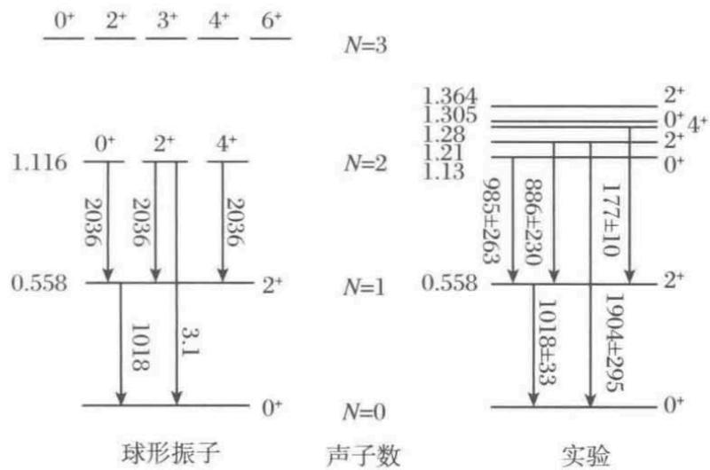
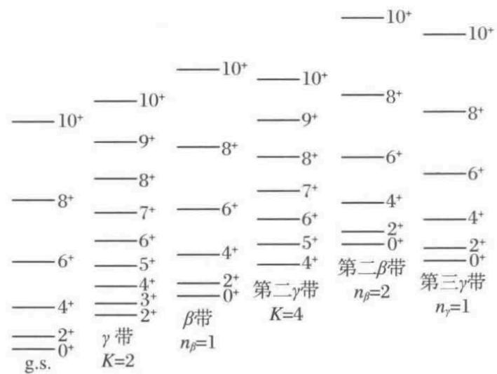
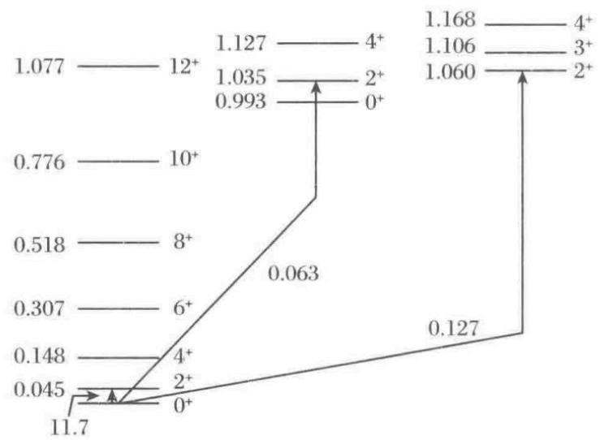
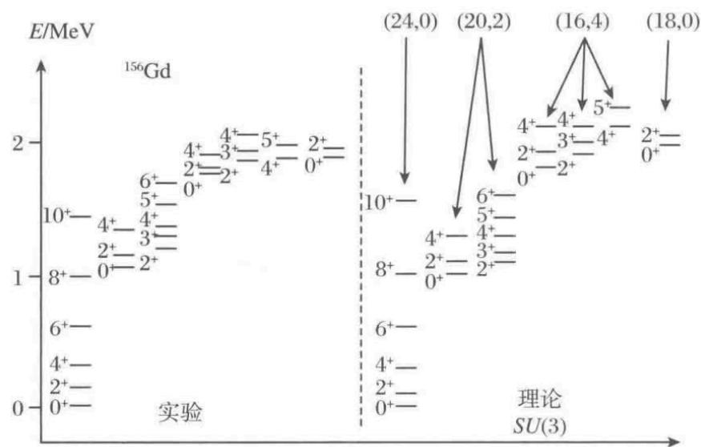
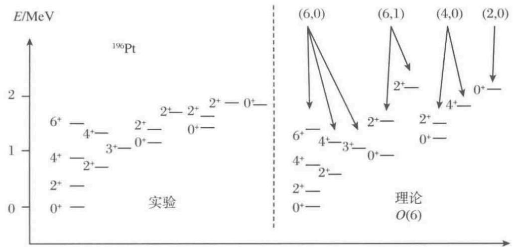
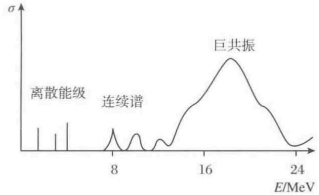
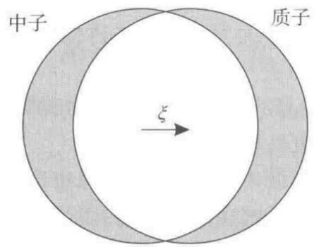
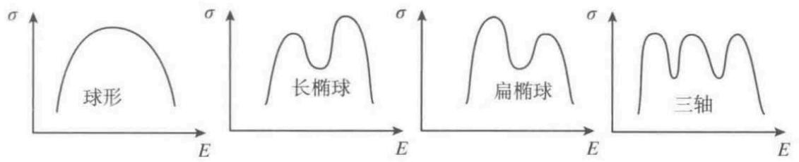

# 第 6 章 集体模型

## 6.1 核物质

### 6.1.1 质量公式

在许多核模型中，核物质的性质作为限制条件加入。**核物质是一个虚构的概念**，它是基于重核中心几乎均匀的条件这一思想，无限几何的外推的结果（由质子和中子组成的、**无限大**且**密度均匀**的系统）。虚构意味着由于如下原因而不现实：

- 假设质子与中子的固定比率接近 $1$ 。这意味着无限的库仑能，所以**核模型了忽略库仑相互作用**。事实上，$\beta$ 衰变会产生一个质子和中子的平衡比。注意，在中子星物质的相关情况下，质子的数量非常少，而核物质的研究当然是对中子星理论感兴趣的。

- 由于库伦相互作用的原因，重核内部的**密度实际上是从中心到边缘逐渐降低的**。

- 质子和中子的**均质系统并不总是最低的态**。在较低的密度下，它会分裂成更小的碎片；而在非常高的密度下，核子会溶解并形成夸克胶子等离子体。

核物质不是一个物理可测量的系统，但它提供了一个简单的理论极限情况，可以对理论进行检验和定义有趣的参数。

有关核物质的基本信息来自**半经验的质量公式**（计算原子核质量/结合能的公式），它根据核物质贡献和有限核的各种修正来**确定原子核的结合能**。这些公式当中最古老、最著名且仍然有用的是贝特-魏茨泽克（Bethe-Weizsacker）公式：

$$
\begin{array}
B(A) = a_{\mathrm{vol}}A + a_{\mathrm{surf}}A^{2/3} + a_{\mathrm{coul}}Z^{2}A^{-1/3} + a_{\mathrm{sym}}\frac{(N-Z)^{2}}{A} \\
a_{\mathrm{vol}} \approx -16~\mathrm{MeV}, \quad a_{\mathrm{surf}} \approx 20~\mathrm{MeV} \\
a_{\mathrm{coul}} \approx 0.751~\mathrm{MeV}, \quad a_{\mathrm{sym}} \approx 21.4~\mathrm{MeV}
\end{array}
$$

这里第一项是体积项，表示在质子和中子等密度时每个核子的恒定结合能，因此提供了核物质的重要参数之一。第二项与核半径的平方成正比，因此它描述了由于核子在表面上而使结合能的减少——表面能。第三项描述了库仑能，对于均匀带电的球体，它与 $Z^{2}/R$ 成正比，所以与 $Z^{2}/A^{1/3}$ 成正比。最后一项是对称能，表示质子和中子的不等量而引起的结合能减少。

表面能和库仑能将用于推导能量对表面形状的依赖性，而体积能和对称能与核物质的性质直接相关。

西格(Seeger)给出了一个更现代的质量公式。它定义为

$$
B(A) = W_{0}A - \gamma A^{2/3} \\
\quad = 0.86r_{0}^{-1}Z^{2}A^{-1/3}(1 - 0.76361Z^{-1/3} - 2.543r_{0}^{-2}A^{-2/3}) \\
\quad - (7A^{-4/3} - \beta A^{-1})(N-Z)^{2} + \delta A^{-1/2}(0, \pm 1) \\
\quad + 7\mathrm{e}^{-6|N-Z|/A} + 14.33 \times 10^{-6}Z^{2.39}
$$

这里，第一项再次描述了体积贡献，第二项描述了表面能，而第三项通过交换和表面弥散校正来校正库仑能（括号中的第二和第三项）。第四项是对称能，现在由于表面效应而具有对 $A$ 的依赖性。此外，还有一个配对项（与 $\delta$ 成正比），括号内的表达式对奇-偶核为零，对偶-偶核为正，对奇-奇核为负。这一项代表了核子成对时束缚更紧密的事实，详情见7.5节。最后两项不太具有明显的物理意义，但增加了质量预测的准确性。未显式给出的系数的标准值为 $W_{0} = 15.645~\mathrm{MeV}$, $\gamma = 19.655~\mathrm{MeV}$, $\beta = 30.586~\mathrm{MeV}$, $\eta = 53.767~\mathrm{MeV}$, $\delta = 10.609~\mathrm{MeV}$, $r_{0} = 1.2025~\mathrm{fm}$。

这种类型的质量公式计算出的**结合能是实验测量的约 $\pm 10~\mathrm{MeV}$ 内，足以描述整个周期表中的核的体性**质，包括 $\beta$ 稳定谷的位置。此外，由于主要项的物理背景，它有助于导出直到和包括裂变势垒在内的变形性质。虽然对裂变的定量分析和对变形基态的描述来说壳效应（见9.2节）是必要的，但应该记住，这些是对大结合能的小扰动，结合能用这种简单的公式描述得相当好。

最近有更多的增强的质量公式，其中**液滴模型**可能是最重要的一个。它包含大量的项来更详细地描述所有物理贡献的表面依赖性。

液滴模型的假设包括 

1. **核被近似为均匀的、不可压缩的流体（液滴）**：密度在核内部是常数，不随位置变化（ $ \rho = \text{const} $ ）。
2. **表面是锐利的（sharp surface）**：即核物质密度在内部分布均匀，**在表面突然下降到零**。
3. **核子内部结构被忽略（忽略单个核子自由度）**：这意味着模型不考虑壳效应、单个核子的量子态结构，而是采用纯粹的宏观集体模型。
4. **低能激发下核物质不可压缩**：体积和密度不变，形状可变。模型关注的是表面形变振动与整体转动，而不是密度波动（即不考虑巨单极共振之类的高压缩模）。
5. **核子大小相对于整个核尺寸可忽略**：这本质上是说核足够大（核半径 \(R \propto A^{1/3}\) 远大于核子半径）。
6. **模型在重核中效果最好**：因为对轻核，表面厚度与核半径之比太大，壳效应显著，液滴模型偏差较大。

### 6.1.2 费米气体模型

费米气体**把核处理成无相互作用费米子气体**。在这个模型中，核子像自由粒子一样运动（但实际上应该被束缚在一个非常大的均匀势阱中，这贡献一个负势能，这个负势能没有被考虑）。

**无限体积中的自由粒子**由下式给出的波函数和本征能量来描述：
$$
\ket{\psi_{\vec{k}}(\vec{r})} = \sin(\vec{k} \cdot \vec{r}), \quad \varepsilon_{\vec{k}} = \frac{\hbar^{2}k^{2}}{2m}
$$

**将波函数限制在边长为 $a$ 的立方体**里面，$x, y, z \in [0, a]$ 。由驻波条件立即得
$$
k_{x} = \frac{\pi}{a}n_{x}, \quad k_{y} = \frac{\pi}{a}n_{y}, \quad k_{z} = \frac{\pi}{a}n_{z} \quad (n_{x}, n_{y}, n_{z} = 1, 2, \cdots)
$$

那么能量本征值为

$$
\varepsilon_{n_{x}n_{y}n_{z}} = \frac{\hbar^{2}}{2m}\frac{\pi^{2}}{a^{2}}(n_{x}^{2} + n_{y}^{2} + n_{z}^{2})
$$

下面的讨论与6.4.1小节结尾对光子给出的非常相似：在大 $a$ 极限下，三元组 $(n_{x}, n_{y}, n_{z})$ 的数 $N$ 可以通过转到微分中的球坐标 $(n, \Omega)$ 来确定：

$$
\mathrm{d}N = \mathrm{d}n_{x}\mathrm{d}n_{y}\mathrm{d}n_{z} = n^{2}\mathrm{d}n\mathrm{d}\Omega
$$

其中 $n = \sqrt{n_x^2 + n_y^2+ n_z^2}$ 。利用球对称，我们可以用因子 $4\pi/8$ 代替对 $\Omega$ 的积分。

> [!tip]
>
> 这个 $8$ 是因为只有 $n$ 的正值是允许的。在三维笛卡尔坐标中，共有 $8$ 个象限，但是其中只有一个是满足 $n$ 的要求的，也就是
> $$
> \int_\Omega\mathrm{d}N\mathrm  = \frac{\pi}{2} n^{2}\mathrm{d}n.
> $$

另一方面，因为式（6.5），我们有
$$
\varepsilon_{n} = \frac{\hbar^{2}}{2m}\frac{\pi^{2}}{a^{2}}n^{2} \quad \Rightarrow \quad \mathrm{d}\varepsilon_{n} = \frac{\hbar^{2}}{m}\frac{\pi^{2}}{a^{2}}n\mathrm{d}n \quad \text{and}\quad n = \sqrt{\frac{2m\varepsilon_na^2}{\hbar^2\pi^2}}
$$

它可以用来替换式(6.6)右边的 $n$

$$
\mathrm{d}N = \frac{a^{3}}{\pi^{2}\sqrt{2}}\left(\frac{m}{\hbar^{2}}\right)^{3/2}\sqrt{\varepsilon_{n}}\mathrm{d}\varepsilon_{n}
$$

在推导中，假定**能量 $\varepsilon < \varepsilon_{n}$ 对应的球形区域中的所有态都被填满**（体系处于基态）。态密度必须积分到费米能 $\varepsilon_{\mathrm{F}}$，并除以体积 $a^{3}$，得到**粒子密度** $\rho$

$$
\rho = \frac{N}{a^{3}} = \frac{1}{\pi^{2}\sqrt{2}}\left(\frac{m}{\hbar^{2}}\right)^{3/2}\int_{0}^{\varepsilon_{\mathrm{F}}}\sqrt{\varepsilon}\mathrm{d}\varepsilon
$$

于是可以得到得到费米能级：

$$
\varepsilon_{\mathrm{F}} = \frac{\hbar^{2}}{2m}\left(6\pi^{2}\rho\right)^{2/3}
$$

在应用这个结果之前，我们必须添加一个关键成分——简并性。因为核子自旋有上下两种状态，所有**构造的态实际上可以填充两次**；质子和中子是广义全同粒子，因此有一个来自同位旋的占有因子 $2$ 。定义简并因子 $g = 4$ ，把这个因子插入推导中，于是得到

$$
\boxed{\varepsilon_{\mathrm{F}} = \frac{\hbar^{2}}{2m}\left(\frac{6\pi^{2}\rho}{g}\right)^{2/3}}
$$

一个相关且重要的附加量是**费米动量**，它常常代替密度在核理论中给出：

$$
\boxed{k_{\mathrm{F}} = \left(\frac{6\pi^{2}\rho}{g}\right)^{1/3}}
$$

**总动能密度**是占据态能量的总和并除以体积，也就是能量乘以态密度，之后再对能量积分：
$$
E_{\text{kin}} = \int_0^{\varepsilon_\text{F}} g\varepsilon\mathrm{d}\rho  =  g\frac{1}{\pi^{2}\sqrt{2}}\left(\frac{m}{\hbar^{2}}\right)^{3/2}\int_{0}^{\varepsilon_{\mathrm{F}}}\varepsilon\sqrt{\varepsilon}\mathrm{d}\varepsilon = \frac{1}{5}\frac{gm^{3/2}\sqrt{2}}{\pi^{2}\hbar^{3}}\varepsilon_{\mathrm{F}}^{5/2}
$$

它被称为动能密度，因为它不以任何方式包括结合势。每个质子或者中子的平均能量由简单关系给出：

$$
\bar{\varepsilon} = \frac{E_{\mathrm{kin}}}{\rho} = \frac{3}{5}\varepsilon_{\mathrm{F}}
$$

它随 $\rho^{2/3}$ 增加，因此是核物质能量公式中的一个密度相关项。

请注意，所考虑的情况只是费米气体的最低态，对应于基态的核物质，或在温度为零的统计极限情况下。

费米气体模型的一个重要结果是**核对称能（质子数和中子数不对称导致的能量）的起源的解释**。对于质子数 $Z$ 和中子数 $N$ 不同的情况，总有 $Z + N = A$ ，质子和中子的密度 $\rho_{\mathrm{p}} \neq \rho_{\mathrm{n}}$ ，总密度：

$$
\rho_{\mathrm{p}} + \rho_{\mathrm{n}} = \rho_{0}
$$

由于数的不同，费米能也将不同，上面的所有公式都必须适应这样的混合。比较总动能的积分和粒子数得到平均动能的适当平均值：

$$
\bar{\varepsilon} = \frac{3}{5}\frac{N\varepsilon_{\mathrm{F}}^{\mathrm{n}} + Z\varepsilon_{\mathrm{F}}^{\mathrm{p}}}{A}
$$

按照式（6.11），由密度给出费米能，因此只有密度需要用 $Z, N, A$ 来表示，总密度也是如此。记住对称能对 $(Z - N)/A$ 的依赖性，我们能写出

$$
\rho_{\mathrm{p}} = \frac{Z}{A}\rho_{0} = \frac{\rho_{0}}{2}\left(1 + \frac{Z - N}{A}\right) \\
\rho_{\mathrm{n}} = \frac{N}{A}\rho_{0} = \frac{\rho_{0}}{2}\left(1 - \frac{Z - N}{A}\right)
$$

将此插入费米能，然后代入平均动能，最后展开幂到 $(Z - N)/A$ 的最低阶，得

$$
\Delta\bar{\varepsilon} \approx \tilde{t}_{N}\left[1 + \frac{5}{9}\frac{(Z - N)^{2}}{A^{2}}\right]
$$

其中常系数由下式给出：

$$
\tilde{t}_{N} = \frac{3}{5}\frac{\hbar^{2}}{2m}\left(\frac{3\pi^{2}\rho_{0}}{2}\right)^{2/3} \approx 21~\mathrm{MeV}
$$

这一结果显示了正确的行为，从而解释了至少一种可以导致对称能的简单机制。定量比较表明，它太小了。

### 6.1.3 密度泛函模型（==不重要==）

费米气体模型的自然推广是由托马斯-费米理论提供的，在那里真实的**单粒子波函数被局部平面波替换**，因此在每个点上都有与局部费米动量适当联系的核子密度。动量和位置都固定显然违反量子力学，但这种也称为局域密度近似（LDA）的方法在例如原子物理学中仍然是相当成功的。对于原子核中的现代应用，必须增加许多校正和高阶项，从而得出所谓的能量密度公式。它可以用变分原理来概括：

$$
\delta\int\mathrm{d}^{3}r\left(E[\rho(\vec{r})] - \lambda\rho(\vec{r})\right) = 0
$$

这里 $\rho(\vec{r})$ 是核内的密度，它一直变化，直到找到积分的极小值，$E[\rho]$ 是能量泛函，它用局域密度表示核能量。积分中的第二项表示核子总数必须是常数的附加条件。

这种方法的主要问题当然是找到合适的泛函 $E[\rho]$ 。这个密度泛函仅包含最基本的成分，但已经足以描述核内的密度分布。它由下式给出：

$$
E[\rho] = \int\mathrm{d}^{3}r\rho W(\rho) + \frac{e^{2}}{2}\int\mathrm{d}^{3}r^{\prime}\int\mathrm{d}^{3}r\frac{\rho_{\mathrm{p}}(\vec{r})\rho_{\mathrm{p}}(\vec{r}^{\prime})}{|\vec{r} - \vec{r}^{\prime}|} \\
+ C_{\mathrm{ex}}\int\mathrm{d}^{3}r\rho_{\mathrm{p}}^{4/3} + C_{\mathrm{sym}}\int\mathrm{d}^{3}r(\rho_{\mathrm{p}} - \rho_{\mathrm{n}})^{2}\rho^{\nu} \\
+ \frac{V_{0}}{4\pi}\int\mathrm{d}^{3}r^{\prime}\int\mathrm{d}^{3}r\rho(\vec{r})\frac{\mathrm{e}^{-|\vec{r} - \vec{r}^{\prime}|/\mu}}{|\vec{r} - \vec{r}^{\prime}|}(\rho(\vec{r}^{\prime}) - \rho(\vec{r}))
$$

大多数项在质量公式的背景下是容易理解的。第一项是体积能贡献，带有新的扭曲，即每核子体积能 $W(\rho)$ 的密度依赖是允许的。在这种形式下，它通常被称为核物质的状态方程，虽然严格地说，状态方程也应该描述热性质。

在正常核中，大部分物质接近平衡密度 $\rho_{0} \approx 0.17~\mathrm{fm}^{-3}$，具有结合能 $W_{0} = W(\rho_{0}) \approx -16~\mathrm{MeV}$。鲜为人知的是它远离平衡的行为。图6.1预示了该函数可能是什么样子。在 $(\rho_{0}, W_{0})$ 处有一极小值，两边都有抛物线上升段。在零密度下，应该达到零能量的适当极限；对于非常小的密度（此时核子还没有感受到足够的吸引力），由于费米气体动能，能量必须是正的。原则上，这两个点之间的行为应该在核表面的结构中被感觉到，但是在这个密度迅速变化的区域，这样的简单能量泛函当然不足以让我们得出确凿的结论。

近年来，在高密度下将会发生什么的问题已成为人们关注的焦点，因为在高能核碰撞时，有可能产生高密度和高温核物质。许多奇异的效应，如核物质的第二亚稳态、密度同核异能态或到夸克胶子等离子体的相变得到了讨论，但目前情况仍然是开放的。

图6.1 核状态方程 $W(\rho)$ 的示意图。注意由于费米气体的限制，有一个零密度以上的正的小区域。在平衡密度以上，几乎没有实验信息可获得，奇异效应可以推测。这里展示了两个具有不同硬度的状态方程和一个具有同核异能极小值的状态方程

核模型的一个重要量是核物质的不可压缩性，它与 $W(\rho)$ 在极小值处的曲率有关，并且按照惯例被定义为

$$
K = 9\rho_{0}^{2}\left.\frac{\mathrm{d}^{2}W}{\mathrm{d}\rho^{2}}\right|_{\rho = \rho_{0}}
$$

$K$ 不能直接测量，必须从密度振动（即所谓的巨单极共振）推导出来，可惜的是，后者需要一个有关表面行为的详细模型。这样人们对 $K$ 的适当值仍然没有达成一致，但 $K \approx 210~\mathrm{MeV}$ 似乎被广泛接受。用抛物线展开法给出了一个具有合适的不可压缩性的简单状态方程：

$$
W(\rho) = \frac{K}{18\rho_{0}^{2}}(\rho - \rho_{0})^{2}
$$

但是请注意，尽管它对于平衡密度附近的小振荡应该是有效的，但它不能正确地产生真空极限，并且还不清楚抛物线的行为可以在更高的密度下推广到多远。类似简单的状态方程的各种参数化被应用于高能重离子反应的模拟中。

我们现在回到式（6.21）的讨论。第二项是人们熟知的由质子产生的电荷分布为 $e\rho_{\mathrm{p}}(\vec{r})$ 的库仑能。注意，这意味着质子和中子的密度是不同的，必须独立地变化，以确定核密度分布。第三项是对库仑交换能的一个近似。我们将结合哈特里-福克方法讨论这种交换效应（7.2节）。

下一项是对称能，现在被写为中子和质子密度之间局部偏离的积分。这完全是局部密度近似的思想，它在每个点产生一个局部费米气体模型，从而是式（6.18）的一个简单概括。附加密度因子的指数 $\nu$ 不是很清楚。费米气体模型建议 $\nu = -1/3$，但正如我们所看到的，它在定量上不可靠，所以我们尝试把它与实验数据相拟合；在实践中，-1到1/3之间的值有效。

最后一项是表面能的密度泛函版本。它基本上是由汤川（Yukawa）相互作用所产生的能量，但是均匀分布的能量已经被减去（这就是为什么 $\rho(\vec{r}^{\prime}) - \rho(\vec{r})$ 出现），所以它只在表面上起作用。

## 6.2 核表面形变

### 6.2.1 一般参数化

在接下来的讨论中，采用前文中的[液滴模型假设](#yedimoxing)。

有了这些假设，**运动的核表面**（不同时刻核形状的描述）可以用时间依赖的形状参数作为系数的球谐函数的展开：
$$
R(\theta, \varphi, t) = R_{0}\left(1 + \sum_{\lambda = 0}^{\infty}\sum_{\mu = -\lambda}^{\lambda}\alpha_{\lambda\mu}^{*}(t)Y_{\lambda\mu}(\theta, \varphi)\right)
$$

==其中 $R(\theta, \varphi, t)$ 表示 $t$ 时刻在 $(\theta, \varphi)$ 方向上的核半径，$R_{0}$ 是球形核的半径==。

在以下所有公式中，如果没有另外指出，则意味着求和的范围为 $\lambda = 0, \cdots, \infty$ 和 $\mu = -\lambda, \cdots, \lambda$ 。

时间依赖的振幅 $\alpha_{\lambda\mu}(t)$ 描述核的振动，从而作为集体坐标

[^集体坐标]:是指用来描述一个多体系统中所有粒子**集体协同运动**的宏观变量，而不是描述单个粒子运动的坐标。

系数 $\alpha_{\lambda\mu}$ 具有如下一些性质。

- 复共轭：**核半径必须是实的**，即 $R(\theta, \varphi, t) = R^{*}(\theta, \varphi, t)$ ，并利用球谐函数的如下性质：
  $$
  Y_{\lambda\mu}^{*}(\theta, \varphi) = (-1)^{\mu}Y_{\lambda-\mu}(\theta, \varphi)
  $$

  显然 $\alpha_{\lambda\mu}$ 必须满足
  $$
  \boxed{\alpha_{\lambda\mu}^{*} = (-1)^{\mu}\alpha_{\lambda-\mu}}
  $$
  
- 宇称：同样的讨论适用于宇称变换。如果球谐函数被反射，张量 $\alpha_{\lambda\mu}$ 必须经历相同的符号变化，以保持表面定义的不变性。由于球谐函数如下性质
  $$
  \hat{P}Y_{lm}(\theta,\varphi) = Y_{lm}(\pi - \theta,\varphi -\pi) = (-)^lY_{lm}(\theta,\varphi),
  $$
  因此 $\alpha_{\lambda\mu}$ 也必须如此，也就是
  $$
  \boxed{\hat{P}\alpha_{\lambda\mu} = (-1)^{\lambda}\alpha_{\lambda\mu}}
  $$
  
- 球张量特征：$\alpha_{\lambda\mu}$ **在转动下的行为遵循函数 $R(\theta, \varphi)$ 的不变性**，后者在转动下必须是一个标量。一开始，这一陈述可能看起来令人惊讶，因为所描述的核形状显然不显示转动对称性。因此，为了解释这一点，我们仔细检查当转动系统时会发生什么

  原始核形状由函数 $R(\theta, \varphi)$ 描述。采用**主动旋转**的观点（也就是将 $R(\Omega)$ 展开之后的球谐函数形式不会发生变换），也就是
  $$
  R^{\prime}(\Omega) = R(\hat{g}^{-1}\Omega)
  $$
  核表面是转动不变的，这可以由下式决定：
  $$
  \sum_{\lambda\mu}\alpha_{\lambda\mu}^{\prime*}Y_{\lambda\mu}(\Omega) = \sum_{\lambda\mu}\alpha_{\lambda\mu}^{*}Y_{\lambda\mu}(\hat{g}^{-1}\Omega)
  $$
  其中 $Y_{\lambda\mu}(\hat{g}^{-1}\Omega)$ 满足的关系在[前文](#qiuxiehanshuwignerD)有过仔细论述，所以可以进一步写成
  $$
  \sum_{\lambda\mu}\alpha_{\lambda\mu}^{\prime*}Y_{\lambda\mu}(\Omega) = \sum_{\lambda\mu}\alpha_{\lambda\mu}^{*}\sum_{\mu^\prime}\mathcal{D}_{\mu^\prime\mu}^{(\lambda)}Y_{\lambda\mu^\prime}(\Omega)
  $$
  从这里很容易看出 $\alpha_{\lambda\mu}$ 是如何变换的：
  $$
  \boxed{\alpha_{\lambda\mu}^{\prime*} = \sum_{\mu^{\prime}}\mathcal{D}_{\mu\mu^{\prime}}^{(\lambda)}\alpha^{*}_{\lambda\mu^{\prime}}}
  $$
  取复共轭：
  $$
  \alpha_{\lambda\mu}^{\prime} = \sum_{\mu^{\prime}}\mathcal{D}_{\mu\mu^{\prime}}^{(\lambda)*}\alpha_{\lambda\mu^{\prime}}
  $$
  根据之前的讨论，可以写出等价的变换为
  $$
  \alpha_{\lambda\mu}^{\prime} = \sum_{\mu^{\prime}}\mathcal{D}_{\mu^{\prime}\mu}^{(\lambda)}\alpha_{\lambda\mu^{\prime}}
  $$
  这个就是球张量的变换，所以就是球张量。

### 6.2.2 多极形变的类型

核表面的一般展开允许任意畸变。在本小节中，对于 $\lambda$ 值的增加，将展示各种多极阶的物理意义及其应用。

- 单极模式，$\lambda = 0$。

  球谐函数 $Y_{00}(\Omega)$ 是常数，因此 **$\alpha_{00}$ 的非零值对应于球半径的变化**。相关的激发是所谓的**核呼吸模式**。然而，因为压缩核物质所需的大量能量，**这种模式的能量太高**，对这里讨论的低能谱不重要。形变参数 $\alpha_{00}$ 可以用来抵消在其他多极形变中作为副作用存在的整体密度变化。核体积的计算（见练习6.1）显示这要求
  $$
  \alpha_{00} = -\frac{1}{\sqrt{4\pi}}\sum_{\lambda\mu}|\alpha_{\lambda\mu}|^{2}
  $$
  到二阶。同时，这也不可能保证核的体积不变。

- 偶极形变，$\lambda = 1$ 至最低阶。实际上**不对应于原子核的形变，而是对应于质心的位移**（见练习6.1），在**==核激发中不予考虑==**。

- **==四极形变==**：$\lambda = 2$ 的模式被证明是**==核最重要的集体激发==**。下面的大多数集体模型的讨论将致力于这种情况，因此在下一小节中给出更详细的处理。

- 八极形变，$\lambda = 3$，与==**负宇称带有关的核的主要不对称模式**==。八极变形的形状有点像梨。

- 十六极形变，$\lambda = 4$，这是在核理论中已经很重要的最高的角动量。虽然没有纯十六极激发谱的证据，但作为四极激发的混合物和重核的基态形状，它似乎起到了重要的作用。

- 具有较高角动量的模式是没有实际意义的。然而，应该提到的是， $\lambda$ 也有一个根本性的限制，这是由于 $Y_{\lambda\mu}(\theta, \varphi)$ 所描述的核表面上的单个"隆起物"的范围随着 $\lambda$ 的增加而减小，但它显然不应小于核子直径。对于粗略的估计，足以注意到 $Y_{\lambda\mu}(\Omega)$ 的极值的数目大致由 $\lambda^{2}$ 给出（在 $\sin\varphi$ 或 $\cos\varphi$ 的 $\theta$ 倍内连带勒让德函数的零的个数）。由于表面上的核子数是 $A^{2/3}$，所以有 
  $$
  \boxed{\lambda < A^{1/3}}
  $$
   这表明 **$A < 64$ 时，十六极形变也变得边缘化**。

图6.2 中给出了最低四个角动量的多极形变的图解。

图6.2 $\lambda = 1, \cdots, 4$ 的多极形变图解。

在每种情况下，绘制 $\alpha_{\lambda 0} = n a_{\lambda}$ 的形状，其中 $n = 0, \cdots, 3$, $a_{1} = 0.15$, $a_{2} = 0.25$, $a_{3} = a_{4} = 0.15$。这些图形的缩放彼此不同，并且体积也没有随着形变的增加保持恒定。注意随着形变增加的复杂的形状常数。注意较大形变的复杂形状

> [!note]
>
> **问题**：计算形变核的体积（到 $\alpha_{2\mu}$ 的二阶， $\alpha_{2\mu}^2$ ）和质心位矢（到一阶）。
>
> **解答**：核的体积由下式给出：
> $$
> V = \int\mathrm{d}\Omega\int_{0}^{R(\Omega)}r^{2}\mathrm{d}r 
> $$
>
> 对 $r$ 积分，得到
>
> $$
> V = \frac{1}{3}R_{0}^{3}\int\left(1 + \sum_{\lambda\mu}\alpha_{\lambda\mu}^{*}Y_{\lambda\mu}(\Omega)\right)^{3} \mathrm{d}\Omega\\
> \approx \frac{1}{3}R_{0}^{3}\int\mathrm{d}\Omega\left(1 + 3\sum_{\lambda\mu}\alpha_{\lambda\mu}^{*}Y_{\lambda\mu}(\Omega) + 3\sum_{\lambda\mu}\sum_{\lambda^{\prime}\mu^{\prime}}\alpha_{\lambda\mu}^{*}\alpha_{\lambda^{\prime}\mu^{\prime}}^{*}Y_{\lambda\mu}(\Omega)Y_{\lambda^{\prime}\mu^{\prime}}(\Omega)\right) \\
> = \frac{1}{3}R_{0}^{3}\left(4\pi + 3\sqrt{4\pi}\alpha_{00} + 3\sum_{\lambda\mu}|\alpha_{\lambda\mu}|^{2}\right)
> $$
>
> **其中保留到形变参数的二阶项**，然后使用球谐函数的正交性。注意，在这样的单个函数上的积分可以使用
> $$
> \int\mathrm{d}\Omega Y_{\lambda\mu}(\Omega) = \sqrt{4\pi}\int\mathrm{d}\Omega\frac{1}{\sqrt{4\pi}}Y_{\lambda\mu}(\Omega) = \sqrt{4\pi}\int\mathrm{d}\Omega Y_{00}Y_{\lambda\mu}(\Omega)\sqrt{4\pi}\delta_{\lambda 0}\delta_{\mu 0} \\
> $$
>
> 其中有 $\int\mathrm{d}\Omega Y_{00}(\Omega)Y_{\lambda\mu}(\Omega) = \delta_{\lambda 0}\delta_{\mu 0}$ 。
>
> 括号中的第一个项刚好是未变形核的体积。这样，如果
> $$
> \boxed{\sqrt{4\pi}\alpha_{00} + \sum_{\lambda\mu}|\alpha_{\lambda\mu}|^{2} = 0}
> $$
>
> 体积将不受形变的影响。对于**质心矢量**，我们必须求下式的值：
>
> $$
> \boxed{\vec{R}_{\mathrm{cm}} = \frac{\displaystyle\int \vec{r} \rho(\vec{r})\mathrm{d}^{3}r}{\displaystyle\int \rho(\vec{r})\mathrm{d}^{3}r}}
> $$
>
> 由于体积内恒定密度（即 $\rho(\vec{r}) = \rho_0$ ）的情况和球坐标符号，这里 $r_{\mu} = \sqrt{4\pi/3} \times r Y_{1\mu}$，
>
> $$
> R_{\mathrm{cm},\mu} = \frac{1}{V}\sqrt{\frac{4\pi}{3}}\int\mathrm{d}\Omega\int_{0}^{R(\Omega)} r^{2} r Y_{1\mu}\mathrm{d}r
> $$
>
> > [!tip]
> >
> > 注意，这里是将质心矢量转换到球谐分量。一个矢量的球谐分量是
> > $$
> > V_\mu = \frac{4\pi}{3}VY_{1\mu}.
> > $$
> > 其中 $\mu = \pm,0$ 。这个操作其实和球分量是一样的
>
> 以与我们获得体积相同的方式进行，我们得到
> $$
> R_{\mathrm{cm},\mu} = \frac{1}{V}\sqrt{\frac{4\pi}{3}}\int\mathrm{d}\Omega\frac{R_{0}^{4}}{4}\left(1 + \sum_{\lambda\mu}\alpha_{\lambda\mu}Y_{\lambda\mu}^{*}\right)^{4}Y_{1\mu} \\
> \approx \frac{1}{V}\sqrt{\frac{4\pi}{3}}\int\mathrm{d}\Omega\frac{R_{0}^{4}}{4}\left(1 + 4\sum_{\lambda\mu}\alpha_{\lambda\mu}Y_{\lambda\mu}^{*}\right)Y_{1\mu} \\
> = \frac{1}{V}\sqrt{\frac{4\pi}{3}}R_{0}^{4}\alpha_{1\mu}= \boxed{\sqrt{\frac{3}{4\pi}}R_{0}\alpha_{1\mu}}
> $$
>
> 也就是只有偶极形变是改变质心的。

### 6.2.3 四极形变

对于纯四极形变 $\lambda = 2$ 的情况，核表面由下式给出：
$$
R(\theta, \varphi) = R_{0}\left(1 + \sum_{\mu}\alpha_{2\mu}^{*}Y_{2\mu}(\theta, \varphi)\right)
$$

在[上面的讨论](#xishuguanxi)中可以看出体积守恒项 $\alpha_{00}$ 是 $\alpha_{2\mu}$ 二阶小量，因此省略，而 $\alpha_{1\mu}$ 不参与核激发的讨论。参数 $\alpha_{2\mu}$ 不是独立的，因为有 $\alpha^{*}_{2\mu} = (-1)^{\mu}\alpha_{2-\mu}$ 。所以 $\alpha_{20}$ 是实数，剩下五个独立的实数自由度：$\alpha_{20}$ 及 $\alpha_{21}$ 和 $\alpha_{22}$ 的实部和虚部。

将球坐标系中方向 $(\theta, \varphi)$ 上的单位矢量**重写为直角坐标下的单位矢量**：

$$
\xi = \sin\theta\cos\varphi, \quad \eta = \sin\theta\sin\varphi, \quad \zeta = \cos\theta
$$

上式满足辅助条件 $\xi^{2} + \eta^{2} + \zeta^{2} = 1$

$$
Y_{20}(\theta, \varphi) = \sqrt{\frac{5}{16\pi}}(3\cos^{2}\theta - 1) = \sqrt{\frac{5}{16\pi}}(2\zeta^{2} - \xi^{2} - \eta^{2}) \\
Y_{2\pm1}(\theta, \varphi) = \mp\sqrt{\frac{15}{8\pi}}\sin\theta\cos\theta\mathrm{e}^{\pm\mathrm{i}\varphi} = \mp\sqrt{\frac{15}{8\pi}}(\xi\zeta \pm \mathrm{i}\eta\zeta) \\
Y_{2\pm2}(\theta, \varphi) = \sqrt{\frac{15}{32\pi}}\sin^{2}\theta\mathrm{e}^{\pm 2\mathrm{i}\varphi} = \sqrt{\frac{15}{32\pi}}(\xi^{2} - \eta^{2} \pm 2\mathrm{i}\xi\eta)
$$

代入有

$$
R(\xi, \eta, \zeta) = R_{0}(1 + \alpha_{\xi\xi}\xi^{2} + \alpha_{\eta\eta}\eta^{2} + \alpha_{\zeta\zeta}\zeta^{2} 
+ 2\alpha_{\xi\eta}\xi\eta + 2\alpha_{\xi\zeta}\xi\zeta + 2\alpha_{\eta\zeta}\eta\zeta)
$$

其中形变的**笛卡儿分量与以下球分量**有关：

$$
\alpha_{2\pm2} = \frac{1}{2}\sqrt{\frac{8\pi}{15}}(\alpha_{\xi\xi} - \alpha_{\eta\eta} \pm 2\mathrm{i}\alpha_{\xi\eta}) \\
\alpha_{2\pm1} = \sqrt{\frac{8\pi}{15}}(\alpha_{\xi\zeta} \pm \mathrm{i}\alpha_{\eta\zeta}) \\
\alpha_{20} = \sqrt{\frac{8\pi}{15}}\frac{1}{\sqrt{6}}(2\alpha_{\zeta\zeta} - \alpha_{\xi\xi} - \alpha_{\eta\eta})
$$

与包含在球分量中的五个自由度相比，出现了六个独立的笛卡儿分量（全部为实数）。但是这里应该存在一个限制：

$$
\int R(\Omega)\mathrm{d}\Omega = \int R_{0}\left(1 + \sum_{\mu}\alpha_{2\mu}^{*}Y_{2\mu}(\theta, \varphi)\right)\mathrm{d}\Omega = 4\pi R_{0}
$$

因为总是有 $\int Y_{2\mu} \, d\Omega = 0$ ，所以上式中对 $Y_{2\mu}(\Omega)$ 的积分消失了（这个式子也可以理解为**==四极形变下质心不变==**）。在笛卡儿形式中做同样的积分是很容易的：**由于对称（ $z$ 是对称轴 ）的缘故，混合分量没有任何贡献；而由对称性，对角线分量应该给出**，假设

$$
\int \xi^{2}\mathrm{d}\Omega = \int \eta^{2}\mathrm{d}\Omega = \int \zeta^{2}\mathrm{d}\Omega = a
$$

我们有

$$
\int R(\Omega)\mathrm{d}\Omega = \int R_{0}(1 + \alpha_{\xi\xi}\xi^{2} + \alpha_{\eta\eta}\eta^{2} + \alpha_{\zeta\zeta}\zeta^{2} 
+ 2\alpha_{\xi\eta}\xi\eta + 2\alpha_{\xi\zeta}\xi\zeta + 2\alpha_{\eta\zeta}\eta\zeta)\mathrm{d}\Omega = 4\pi R_{0} + a(\alpha_{\xi\xi} + \alpha_{\eta\eta} + \alpha_{\zeta\zeta})
$$

因此笛卡儿分量必须满足辅助条件

$$
\boxed{\alpha_{\xi\xi} + \alpha_{\eta\eta} + \alpha_{\zeta\zeta} = 0}
$$

由于笛卡儿变形与核在适当方向上的伸展（或收缩）直接相关，我们可以得出：

- $\alpha_{20}$ 描述 $z$ 轴相对于 $y$ 轴和 $x$ 轴的拉伸；
- $\alpha_{2\pm1}$ 表示 $z$ 轴的倾斜形变，实数部分表示 $z$ 向 $x$ 方向倾斜，虚数部分表示 $z$ 向 $y$ 方向倾斜；
- $\alpha_{2\pm2}$ 描述了 $x$ 轴相对于 $y$ 轴的相对长度（实数部分）以及 $xy$ 平面上的倾斜形变（虚数部分）。

这些参数的一个问题是：核的对称轴不一定总是实验室系下的 $z$ 轴， $\alpha_{2\mu}$ 的值既依赖于形状（长轴多长、扁率多大），又依赖于取向（长轴指向哪里）。

将对称轴固定为 $z$ 轴，这就是主轴坐标系。用带撇号的量表示主轴坐标系下的量，**此时形变张量一定是对角的**，于是
$$
R(\xi^{\prime}, \eta^{\prime}, \zeta^{\prime}) = R_{0}(1 + \alpha_{\xi^{\prime}\xi^{\prime}}^{\prime}\xi^{\prime 2} + \alpha_{\eta^{\prime}\eta^{\prime}}^{\prime}\eta^{\prime 2} + \alpha_{\zeta^{\prime}\zeta^{\prime}}^{\prime}\zeta^{\prime 2})
$$

条件 $\alpha_{\xi^{\prime}\eta^{\prime}}^{\prime} = \alpha_{\xi^{\prime}\zeta^{\prime}}^{\prime} = \alpha_{\eta^{\prime}\zeta^{\prime}}^{\prime} = 0$ 意味着对于球分量，

$$
\alpha_{2\pm1}^{\prime} = 0\\
\alpha_{2\pm2}^{\prime} = \sqrt{\frac{2\pi}{15}}(\alpha_{\xi^{\prime}\xi^{\prime}}^{\prime} - \alpha_{\eta^{\prime}\eta^{\prime}}^{\prime}) \equiv a_{2}\\
\alpha_{20}^{\prime} = \sqrt{\frac{8\pi}{15}}\frac{1}{\sqrt{6}}(2\alpha_{\zeta^{\prime}\zeta^{\prime}}^{\prime} - \alpha_{\xi^{\prime}\xi^{\prime}}^{\prime} - \alpha_{\eta^{\prime}\eta^{\prime}}^{\prime}) \equiv a_{0}
$$

仍然有五个独立的实参数，但现在具有更清晰的几何意义：

- $a_{0}$ 表示 $z^{\prime}$ 轴相对于 $x^{\prime}$ 轴和 $y^{\prime}$ 轴的拉伸；
- $a_{2}$ 决定 $x^{\prime}$ 轴和 $y^{\prime}$ 轴之间的长度差异；
- 三个欧拉角 $\vec{\theta} = (\theta_{1}, \theta_{2}, \theta_{3})$ 决定**主轴系统 $(x^{\prime}, y^{\prime}, z^{\prime})$ 相对于实验室固定参考系 $(x, y, z)$ 的取向**（整体的转动）。

主轴系统的优点是**转动和形状振动被清晰地分离**；**欧拉角的变化表示核的纯转动，而不包含形状的任何变化，形状只由 $a_{0}$ 和 $a_{2}$ 决定**。还要注意，$a_{2} = 0$ 描述在 $x$ 轴和 $y$ 轴方向上具有相等轴长的形状，即围绕 $z$ 轴具有轴对称的形状。

玻尔引入了另一组参数。它对应于 $(a_{0}, a_{2})$ 空间中的极坐标，并通过下式定义：

$$
a_{0} = \beta\cos\gamma, \quad a_{2} = \frac{1}{\sqrt{2}}\beta\sin\gamma
$$

这里选择因子 $1/\sqrt{2}$ ，因为 $a_2$ 对应 $a_{2,\pm2}$ ，实际上是两个参数，这样

$$
\sum_{\mu}\abs{\alpha_{2\mu}}^{2} = \sum_{\mu}\abs{\alpha_{2\mu}^{\prime}}^{2} = a_{0}^{2} + 2a_{2}^{2} = \beta^{2}
$$

这个求和结果在不同坐标系中的不变量，所以可以认为 $\beta^2$ **是四极形变的总体大小**，不依赖于核的取向与坐标系的选择。

> [!note]
>
> **问题**：在主轴系统中，讨论 $\beta$ 固定时核形状与 $\gamma$ 的对应关系。
>
> **解答**：为了看出核的形状，用 $\beta$ 和 $\gamma$ 计算笛卡儿分量。首先，对于带撇分量，总是有
> $$
> \alpha_{\zeta^{\prime}\zeta^{\prime}}^{\prime} = -\alpha_{\xi^{\prime}\xi^{\prime}}^{\prime} - \alpha_{\eta^{\prime}\eta^{\prime}}^{\prime}
> $$
>
> 当此式代入 $a_{0}$ 的定义，使用式（6.43）得
>
> $$
> \boxed{\alpha_{\zeta^{\prime}\zeta^{\prime}}^{\prime} = \frac{\sqrt{6}}{3}\sqrt{\frac{15}{8\pi}}a_{0} = \sqrt{\frac{5}{4\pi}}\beta\cos\gamma}
> $$
>
> 再考虑
>
> $$
> \alpha_{\xi^{\prime}\xi^{\prime}}^{\prime} - \alpha_{\eta^{\prime}\eta^{\prime}}^{\prime} = 2\alpha_{\xi^{\prime}\xi^{\prime}}^{\prime} + \alpha_{\zeta^{\prime}\zeta^{\prime}}^{\prime}
> $$
>
> 这可以用于式（6.42）的 $a_{2}$ 定义中，得到
>
> $$
> \alpha_{\xi^{\prime}\xi^{\prime}}^{\prime} = \sqrt{\frac{15}{8\pi}}\left(a_{2} - \frac{1}{\sqrt{6}}a_{0}\right) = \sqrt{\frac{5}{4\pi}}\beta\left(\frac{1}{2}\sqrt{3}\sin\gamma - \frac{1}{2}\cos\gamma\right)
> $$
>
> 圆括号中的项可以用余弦加法定理组合起来：
>
> $$
> \boxed{\alpha_{\xi^{\prime}\xi^{\prime}}^{\prime} = \sqrt{\frac{5}{4\pi}}\beta\cos\left(\gamma - \frac{2\pi}{3}\right)}
> $$
>
> 按相似的方式有
>
> $$
> \boxed{\alpha_{\eta^{\prime}\eta^{\prime}}^{\prime} = -\sqrt{\frac{5}{4\pi}}\beta\left(\frac{1}{2}\sqrt{3}\sin\gamma + \frac{1}{2}\cos\gamma\right) = \sqrt{\frac{5}{4\pi}}\beta\cos\left(\gamma - \frac{4\pi}{3}\right)}
> $$
>
> 笛卡儿形变分量表示核的轴在该方向上的拉伸（变化量）。对它们使用新的符号 $\delta R_{k}$ ，其中$k = 1, 2, 3$ 分别对应于 $x^{\prime}, y^{\prime}, z^{\prime}$，可以将这些结果组合成一个方程：
>
> $$
> \boxed{\delta R_{k} = \sqrt{\frac{5}{4\pi}}\beta\cos\left(\gamma - \frac{2\pi k}{3}\right)}
> $$
>
> 也就是有
> $$
> R_k = R_0 + \delta R_k = R_0 + \sqrt{\frac{5}{4\pi}}\beta\cos\left(\gamma - \frac{2\pi k}{3}\right)
> $$
> 由图6.3很容易理解三个轴随 $\gamma$ 的变化。在 $\gamma = 0^{\circ}$ 时，核沿 $z^{\prime}$ 轴伸长，但 $x^{\prime}$ 轴和 $y^{\prime}$ 轴相等。这种轴向对称的形状有点让人联想到雪茄，称为长椭球。当我们增加 $\gamma$ 时， $x^{\prime}$ 轴以 $y^{\prime}$ 轴和 $z^{\prime}$ 轴为代价延长，通过三个轴不等的三轴形状区域，直到 $\gamma = 60^{\circ}$，再次实现轴对称（关于 $y^{\prime}$ 轴）。但是现在 $z^{\prime}$ 轴和 $x^{\prime}$ 轴的长度相等，这两个轴比 $y^{\prime}$ 轴长。核具有扁平的像煎饼一样的形状，称为扁椭球。**这种模式是重复的：每 $60^{\circ}$ 轴对称重现，且长椭球和扁椭球形状交替出现，但是轴的相对长度被置换了**。
>
> 
>
> 图6.3 $k = 1, 2$ 和 $3$ 的函数 $\cos(\gamma - 2\pi k/3)$ 的图像，分别对应于 $x, y$ 和 $z$ 方向上的轴长的变化
>
> 练习6.2的结果再次总结在图6.4中，它显示了在 $(\beta, \gamma)$ 平面上各种核形状以及它们是如何每 $60^{\circ}$ 重复出现的。
>
> 
>
> 图6.4 由对称性，$(\beta, \gamma)$ 平面被划分为六个相等部分。**$0\degree$ 和 $60\degree$ 之间的扇区包含所有形状**，可以作为代表性扇区。沿轴线遇到的形状的类型照字面表示。例如，长椭球 $x = y$ 意味着长椭球形状，$z$ 轴为长轴，而其他两个轴相等
>
> 由图6.4可以看出的一个问题是，相同的核形状在平面内反复出现。例如，$60^{\circ}$、$180^{\circ}$ 和 $300^{\circ}$ 处的扁椭球对称形状是相同的，只有轴的取名是不同的。三轴形状甚至在平面上出现六次。这在图6.3中能更清楚地看到，例如，在 $\gamma = 60^{\circ}$ 的两侧出现相同的形状，并在 $\gamma = 180^{\circ}$ 和 $\gamma = 300^{\circ}$ 处重复。因为轴趋向不同，相关的欧拉角也不同。**总之，相同的物理形状（包括它在空间中的取向）可以用不同的形变参数 $(\beta, \gamma)$ 和欧拉角表示**。

### 6.2.4 集体空间中的对称性

在前一小节中，提出了发展集体模型的两种备选方法：四极形变可以**在实验室固定参考系中通过球张量 $\alpha_{2\mu}$ 来描述**，或者使**用参数 $(a_{0}, a_{2})$ 或 $(\beta, \gamma)$ 和指出与固定坐标参考系瞬间取向的欧拉角 $(\theta_{1}, \theta_{2}, \theta_{3})$ 来给出相对于主轴参考系的核的形变**。这两种情况需要转动对称的不同处理。

~~在实验室参考系中，核的动能和势能一定是 $\alpha_{\lambda\mu}$ 和速度 $\dot{\alpha}_{\lambda\mu}$ 的函数。它们应该是转动不变的，这可以通过以一种明显不变的方式构造它们来实现。例如，一个形变依赖势可能包含耦合到零总角动量的 $\alpha_{\lambda\mu}$ 的幂：~~
$$
V(\alpha_{\lambda\mu}) = C[\alpha_{2} \times \alpha_{2}]^{0} + D[\alpha_{2} \times [\alpha_{2} \times \alpha_{2}]^{2}]^{0} + \cdots
$$

~~而且还有更复杂的标量函数，比如~~
$$
\sqrt{[\alpha_{2} \times \alpha_{2}]^{0}} \sim \beta
$$

~~动能应该以类似的方式构造。于是波函数也必须构造成具有好角动量的函数$\psi_{IM}(\alpha_{\lambda\mu})$。如稍后将在关于四极谐振子的章节中所述，这在二次量子化中是最容易做到的。~~

在主轴参考系中，转动不变性更容易得到保证：能量必须与欧拉角无关，但是转动动能取决于角的时间导数，形变能只依赖于 $\beta$ 和 $\gamma$ 。因此，我们期望如下形式的能量表达式：
$$
T(\beta, \gamma, \dot{\beta}, \dot{\gamma}, \dot{\theta}_{1}, \dot{\theta}_{2}, \dot{\theta}_{3}) + V(\beta, \gamma)
$$

然而，对于波函数，由于在前一小节中所述的坐标值的非唯一性，如果我们不加以处理，**多个不同的数学点 $(\beta, \gamma, \theta_1, \theta_2, \theta_3)$ 将描述完全相同的物理状态**。这在量子力学中是致命的，因为它会导致一个物理态对应多个波函数值。

通常**在 $(\beta, \gamma)$ 平面上有六个不同的点描述核的相同物理形状**，加上欧拉角的一个额外模糊性。因此有必要更仔细地研究这个问题。

选择一个核的主轴沿着**轴的内禀坐标系**需要三个步骤：

- 沿着三个主轴中的任何一个选择 $z^{\prime}$ 轴，指出 $z^{\prime}$ 轴沿着该轴的正方向或负方向，有**六种可能**。
- 现在，选择剩下的两个轴中的一个，定为 $y^{\prime}$ 轴，并再次确定正方向或负方向，有**四种可能**。
- 现在，$x$ 轴完全**由右手坐标系的要求决定**。

这样，不同内禀坐标系的总数是 $24$ 。从数学上讲，它们可以被系统地列举出来：将其中之一作为"标准"系统，通过变换（完成轴的适当置换）和集体坐标的相关变换来构造其他的。所有这 $24$ 个变换可以由三个基本的 $\hat{R}_{k} (k = 1, 2, 3)$ （生成元）组合而成，其通常选择如下：

- $\hat{R}_{1} : \hat{R}_{1}(x^{\prime}, y^{\prime}, z^{\prime}) = (x^{\prime}, -y^{\prime}, -z^{\prime})$ ，**对应于绕 $x^{\prime}$ 轴转动 $\pi$ 角**。它不改变 $\beta$ 和 $\gamma$ ，因为核沿每个轴的拉伸不会随反射那个轴而改变。然而，欧拉角受到影响：$\hat{R}_{1}(\theta_{1}, \theta_{2}, \theta_{3}) = (\theta_{1} + \pi, \pi - \theta_{2}, -\theta_{3})$。注意 $\boxed{\hat{R}_{1}^{2} = 1}$ 。

- $\hat{R}_{2} : \hat{R}_{2}(x^{\prime}, y^{\prime}, z^{\prime}) = (y^{\prime}, -x^{\prime}, z^{\prime})$ ，即**绕 $z^{\prime}$ 轴转 $\pi/2$** ，所以 $\boxed{\hat{R}_{2}^{4} = 1}$ 。检查图6.3中轴的相应互换 $x^{\prime} \leftrightarrow y^{\prime}$ ，显示对形变参数的影响是 $\hat{R}_{2}(\beta, \gamma) = (\beta, -\gamma)$ 。欧拉角显然只显示绕 $z^{\prime}$ 轴的转动：$\hat{R}_{2}(\theta_{1}, \theta_{2}, \theta_{3}) = (\theta_{1}, \theta_{2}, \theta_{3} + \pi/2)$ 。

- $\hat{R}_{3} : \hat{R}_{3}(x^{\prime}, y^{\prime}, z^{\prime}) = (y^{\prime}, z^{\prime}, x^{\prime})$ ，即**轴的循环置换**，这意味着 $\boxed{\hat{R}_{3}^{3} = 1}$ 。在图6.3中这对应于 $\hat{R}_{3}(\beta, \gamma) = (\beta, \gamma + 2\pi/3)$ 。同样，就像对于 $\hat{R}_{1}$ ，推导欧拉角的变化并不平常：$\hat{R}_{3}(\theta_{1}, \theta_{2}, \theta_{3}) = (\theta_{1}, \theta_{2} + \pi/2, \theta_{3} + \pi/2)$ 。

这些变换的存在现在对集体波函数产生重要的结果：**一个集体波函数必须是这 $24$ 种坐标变换下的不变量（标量）**。用基本变换叙述，集体波函数必须满足：
$$
\hat{R}_{1}\psi(\beta, \gamma, \theta_{1}, \theta_{2}, \theta_{3}) = \psi\left(\beta, \gamma, \theta_{1} + \pi, \pi - \theta_{2}, -\theta_{3}\right) \\
\hat{R}_{2}\psi(\beta, \gamma, \theta_{1}, \theta_{2}, \theta_{3}) = \psi\left(\beta, -\gamma, \theta_{1}, \theta_{2}, \theta_{3} + \frac{\pi}{2}\right) \\
\hat{R}_{3}\psi(\beta, \gamma, \theta_{1}, \theta_{2}, \theta_{3}) = \psi\left(\beta, \gamma + \frac{2\pi}{3}, \theta_{1}, \theta_{2} + \frac{\pi}{2}, \theta_{3} + \frac{\pi}{2}\right)
$$

理解这与物理对称性（例如宇称）无关是很重要的。在那种情况下，空间中有两个物理上不同的点 $\vec{r}$ 和 $-\vec{r}$ ，如果哈密顿量是宇称不变的，我们可以选择满足 $\psi(\vec{r}) = \pi\psi(-\vec{r})$ 的波函数，它具有宇称量子数 $\pi$ 。

与此相反，即使对于 $\hat{R}_{1}$（它非常类似于宇称，因为它也满足 $\hat{R}_{1}^{2} = 1$ ），它也没有像宇称这样的量子数。不同之处在于， $24$ 组不同的坐标不像 $\vec{r}$ 和 $-\vec{r}$ 那样描述物理相关但不同的情况，而是描述一个相同的物理组态。集体坐标空间中的不同点只对应于一个物理情况，并且与它们都相关的波函数只有一个唯一的值。所以**"对称"这个词不是指在第2章中的物理对称性，而是指坐标的简并性**。

## 6.3 表面振动

### 6.3.1 经典液滴的振动

具有[锐表面](#ruibiaomian)的带电液滴的总能量可分为动能、库仑能和表面能：

$$
E = T+V = T + E_{\mathrm{C}} + E_{\mathrm{S}}
$$

这些项**围绕球形平衡态展开到二阶**进行计算。

电荷密度分布 $\rho(\vec{r})$ 的质子的库仑能一般由下式给出：

$$
E_{\mathrm{C}} = \frac{1}{2}\int\mathrm{d}^{3}r\int\mathrm{d}^{3}r^{\prime}\frac{\rho(\vec{r})\rho(\vec{r}^{\prime})}{|\vec{r} - \vec{r}^{\prime}|}
$$

对于**核外为零、核内为 $\rho(\vec{r}) = \rho_{q}$ 的恒定电荷密度**的原子核，可以将其重写为

$$
E_{\mathrm{C}} = \frac{1}{2}\rho_{q}^{2}\int_{V}\mathrm{d}^{3}r\int_{V}\mathrm{d}^{3}r^{\prime}\frac{1}{|\vec{r} - \vec{r}^{\prime}|}
$$

或在球坐标下

$$
E_{\mathrm{C}} = \frac{1}{2}\rho_{q}^{2}\int\mathrm{d}\Omega\int\mathrm{d}\Omega^{\prime}\int_{0}^{R(\Omega)}\mathrm{d}r r^{2}\int_{0}^{R(\Omega^{\prime})}\mathrm{d}r^{\prime} r^{\prime 2}\frac{1}{|\vec{r} - \vec{r}^{\prime}|}
$$

==**老师说了上面这个积分是不会考，下面的论述仅仅作为一个讨论，有兴趣可以看看**==

> [!note]
>
> 将积分分解成无扰动球的能量（通过积分到一个恒定半径 $R_{0}$ 给出）和变化的部分是有用的。形式上这可以通过如下形式来实现：
> $$
> \int_{0}^{R(\Omega)}\mathrm{d}r\int_{0}^{R(\Omega^{\prime})}\mathrm{d}r^{\prime} = \left(\int_{0}^{R_{0}}\mathrm{d}r + \int_{R_{0}}^{R(\Omega)}\mathrm{d}r\right)\left(\int_{0}^{R_{0}}\mathrm{d}r^{\prime} + \int_{R_{0}}^{R(\Omega^{\prime})}\mathrm{d}r^{\prime}\right) \\
> = \int_{0}^{R_{0}}\mathrm{d}r\int_{0}^{R_{0}}\mathrm{d}r^{\prime} + \int_{0}^{R_{0}}\mathrm{d}r\int_{R_{0}}^{R(\Omega^{\prime})}\mathrm{d}r^{\prime} + \int_{R_{0}}^{R(\Omega)}\mathrm{d}r\int_{0}^{R_{0}}\mathrm{d}r^{\prime} + \int_{R_{0}}^{R(\Omega)}\mathrm{d}r\int_{R_{0}}^{R(\Omega^{\prime})}\mathrm{d}r^{\prime} \\
> = \boxed{\int_{0}^{R_{0}}\mathrm{d}r\int_{0}^{R_{0}}\mathrm{d}r^{\prime}} + \boxed{2\int_{R_{0}}^{R(\Omega)}\mathrm{d}r\int_{0}^{R_{0}}\mathrm{d}r^{\prime}} + \boxed{\int_{R_{0}}^{R(\Omega)}\mathrm{d}r\int_{R_{0}}^{R(\Omega^{\prime})}\mathrm{d}r^{\prime}}
> $$
>
> 最后一步利用哑变量 $r$ 和 $r^{\prime}$ 的可互换性。于是可以得到
>
> $$
> E_{\mathrm{C}} = \boxed{E_{\mathrm{C}}^{(0)}} + \boxed{\rho_{q}^{2}\int\mathrm{d}\Omega\int\mathrm{d}\Omega^{\prime}\int_{R_{0}}^{R(\Omega)}\mathrm{d}r r^{2}\int_{0}^{R_{0}}\mathrm{d}r^{\prime} r^{\prime 2}\frac{1}{|\vec{r} - \vec{r}^{\prime}|}}
> + \boxed{\frac{1}{2}\rho_{q}^{2}\int\mathrm{d}\Omega\int\mathrm{d}\Omega^{\prime}\int_{R_{0}}^{R(\Omega)}\mathrm{d}r r^{2}\int_{R_{0}}^{R(\Omega^{\prime})}\mathrm{d}r^{\prime} r^{\prime 2}\frac{1}{|\vec{r} - \vec{r}^{\prime}|}}
> $$
>
> 未变形球体的库仑能简写为
>
> $$
> \boxed{E_{\mathrm{C}}^{(0)} = \frac{1}{2}\rho_{q}^{2}\int\mathrm{d}\Omega\int\mathrm{d}\Omega^{\prime}\int_{0}^{R_{0}}\mathrm{d}r r^{2}\int_{0}^{R_{0}}\mathrm{d}r^{\prime} r^{\prime 2}\frac{1}{|\vec{r} - \vec{r}^{\prime}|} = \frac{3}{5}\frac{Z^{2}e^{2}}{R_{0}}}
> $$
>
> $Z$ 是核的电荷数，与 $\rho_{q}$ 通过下式联系：
>
> $$
> Ze = \rho_{q}\frac{4\pi}{3}R_{0}^{3}
> $$
>
> 为了进一步研究，应用球谐函数的加法定理：
>
> $$
> \frac{1}{|\vec{r} - \vec{r}^{\prime}|} = 4\pi\sum_{\lambda = 0}^{\infty}\sum_{\mu = -\lambda}^{\lambda}\frac{1}{2\lambda + 1}\frac{r_{<}^{\lambda}}{r_{>}^{\lambda + 1}}Y_{\lambda\mu}^{*}(\theta, \varphi)Y_{\lambda\mu}(\theta^{\prime}, \varphi^{\prime})
> $$
>
> **$r_{<}$ 和 $r_{>}$ 分别代表两个半径 $r$ 和 $r^{\prime}$ 中的较小者和较大者**。现在第一个四重积分变为
> $$
> 4\pi\rho_{q}^{2}\sum_{\lambda\mu}\frac{1}{2\lambda + 1}\int\mathrm{d}\Omega^{\prime}Y_{\lambda\mu}(\Omega^{\prime})\int\mathrm{d}\Omega Y_{\lambda\mu}^{*}(\Omega)\int_{R_{0}}^{R(\Omega)}\mathrm{d}r r^{2}\int_{0}^{R_{0}}\mathrm{d}r^{\prime} r^{\prime 2}\frac{1}{r_{>}}
> $$
>
> 对 $\Omega^{\prime}$ 的积分可以通过使用
>
> $$
> \int\mathrm{d}\Omega^{\prime}Y_{\lambda\mu}(\Omega^{\prime}) = \sqrt{4\pi}\int\mathrm{d}\Omega^{\prime}Y_{00}^{*}Y_{\lambda\mu}(\Omega^{\prime}) = \sqrt{4\pi}\delta_{\lambda,0}\delta_{\mu,0}
> $$
>
> 求得，因为 $Y_{00}(\Omega) = 1/\sqrt{4\pi}$ 和球谐函数的正交归一性。这样对 $\lambda$ 和 $\mu$ 的求和塌缩到 $\lambda = 0$ 和 $\mu = 0$ 的项，剩下的函数 $Y_{00}(\Omega)$ 只产生一个因子 $1/\sqrt{4\pi}$，积分简化为
>
> $$
> 4\pi\rho_{q}^{2}\int\mathrm{d}\Omega\int_{R_{0}}^{R(\Omega)}\mathrm{d}r r^{2}\int_{0}^{R_{0}}\mathrm{d}r^{\prime} r^{\prime 2}\frac{1}{r_{>}}
> $$
>
> 为了完成对 $r^{\prime}$ 的积分，因为 $r_{<}$ 的定义，我们必须将积分分解成两个部分：
>
> $$
> \int_{0}^{R_{0}}\mathrm{d}r^{\prime} r^{\prime 2}\frac{1}{r_{>}} = \int_{0}^{r}\mathrm{d}r^{\prime} r^{\prime 2}\frac{1}{r} + \int_{r}^{R_{0}}\mathrm{d}r^{\prime} r^{\prime 2}\frac{1}{r^{\prime}} \\
> = \frac{1}{3}r^{2} + \frac{1}{2}R_{0}^{2} - \frac{1}{2}r^{2} = \frac{1}{2}\left(R_{0}^{2} - \frac{1}{3}r^{2}\right)
> $$
>
> 对 $r$ 的积分现在也变得简单了：
>
> $$
> \int_{R_{0}}^{R(\Omega)}\mathrm{d}r r^{2} \frac{1}{2}\left(R_{0}^{2} - \frac{1}{3}r^{2}\right) = \frac{1}{6}\left(R_{0}^{2}R^{3}(\Omega) - R_{0}^{5} - \frac{1}{5}R^{5}(\Omega) + \frac{1}{5}R_{0}^{5}\right)
> $$
>
> 当我们把 $R_{0}$ 和 $R(\Omega)$ 的差在 $\alpha_{\lambda\mu}$ 中展开到二阶时，全积分将变成
>
> $$
> 4\pi\rho_{q}^{2}\int\mathrm{d}\Omega\int_{R_{0}}^{R(\Omega)}\mathrm{d}r r^{2}\int_{0}^{R_{0}}\mathrm{d}r^{\prime} r^{\prime 2}\frac{1}{r_{>}} \\
> \approx \frac{2}{3}\pi R_{0}^{5}\rho_{q}^{2}\int\mathrm{d}\Omega\left(2\sum_{\lambda\mu}\alpha_{\lambda\mu}^{*}Y_{\lambda\mu}(\Omega) + \sum_{\lambda\mu}\sum_{\lambda^{\prime}\mu^{\prime}}\alpha_{\lambda\mu}^{*}Y_{\lambda\mu}(\Omega)\alpha_{\lambda^{\prime}\mu^{\prime}}Y_{\lambda^{\prime}\mu^{\prime}}(\Omega)\right) \\
> = \frac{2}{3}\pi R_{0}^{5}\rho_{q}^{2}\left(2\sqrt{4\pi}\alpha_{00} + \sum_{\lambda\mu}|\alpha_{\lambda\mu}|^{2}\right) \\
> = -\frac{2}{3}\pi R_{0}^{5}\rho_{q}^{2}\sum_{\lambda\mu}|\alpha_{\lambda\mu}|^{2}
> $$
>
> 这里，积分的上限是将式（6.32）代入，然后再次使用球谐函数的正交归一性。最后，将练习6.1中推导出的关系 $\sqrt{4\pi}\alpha_{00} + \sum_{\lambda\mu}|\alpha_{\lambda\mu}|^{2} = 0$ 代入。
>
> 式（6.56）中的第二个积分可以相当类似地进行求值。只保留到 $\alpha_{\lambda\mu}$ 的二阶项，得到
>
> $$
> \frac{1}{2}\rho_{q}^{2}\int\mathrm{d}\Omega\int\mathrm{d}\Omega^{\prime}\int_{R_{0}}^{R(\Omega)}\mathrm{d}r r^{2}\int_{R_{0}}^{R(\Omega^{\prime})}\mathrm{d}r^{\prime} r^{\prime 2}\frac{1}{|\vec{r} - \vec{r}^{\prime}|} = 2\pi R_{0}^{5}\rho_{q}^{2}\sum_{\lambda\mu}\frac{\lambda}{2\lambda + 1}|\alpha_{\lambda\mu}|^{2}
> $$
>

==最终得到**展开到二阶的库仑能**为==
$$
\boxed{E_{\mathrm{C}} = E_{\mathrm{C}}^{(0)}\left(1 - \frac{5}{4\pi}\sum_{\lambda\mu}\frac{\lambda - 1}{2\lambda + 1}|\alpha_{\lambda\mu}|^{2}\right)}
$$

可以看出**球体的任何微小形变都降低核的静电能**（**无需理会 $\lambda = 1$ 的平凡情况**，它在此阶对应于平移，因此不影响势能）。

> [!note]
>
> 核的表面能 $E_{\mathrm{S}}$ 由下式给出：
>
> $$
> E_{\mathrm{S}} = \sigma\int_{\mathrm{表面}}\mathrm{d}S
> $$
>
> $\sigma$ 为表面张力，$\mathrm{d}S$ 为表面元，在球坐标中等于
>
> $$
> \mathrm{d}S = \sqrt{1 + \frac{1}{R^{2}}\left(\frac{\partial R}{\partial\theta}\right)^{2} + \frac{1}{R^{2}\sin^{2}\theta}\left(\frac{\partial R}{\partial\varphi}\right)^{2}} R^{2}\sin\theta\mathrm{d}\theta\mathrm{d}\varphi
> $$
>
> 如果多极阶不是太大，则导数也应该是小的，我们可以展开到一阶，得到
>
> $$
> \mathrm{d}S \approx \left[R^{2} + \frac{1}{2}\left(\frac{\partial R}{\partial\theta}\right)^{2} + \frac{1}{2\sin^{2}\theta}\left(\frac{\partial R}{\partial\varphi}\right)^{2}\right]\sin\theta\mathrm{d}\theta\mathrm{d}\varphi
> $$
>
> 这里还必须代入核表面的定义。为了简化所得公式，我们使用记号
>
> $$
> \eta = R_{0}\sum_{\lambda\mu}\alpha_{\lambda\mu}^{*}Y_{\lambda\mu}(\Omega)
> $$
>
> 利用这个记号，表面元变成
>
> $$
> \mathrm{d}S = \left\{1 + 2\eta + \eta^{2} + \frac{1}{2}R_{0}^{2}\left[\left(\frac{\partial\eta}{\partial\theta}\right)^{2} + \frac{1}{\sin^{2}\theta}\left(\frac{\partial\eta}{\partial\varphi}\right)^{2}\right]\right\}\sin\theta\mathrm{d}\theta\mathrm{d}\varphi
> $$
>
> 与库仑能类似，我们分离出无扰动球的表面能：
>
> $$
> \boxed{E_{\mathrm{S}}^{(0)} = 4\pi\sigma R_{0}^{2}}
> $$
>
> 将表面能重写为
>
> $$
> E_{\mathrm{S}} = E_{\mathrm{S}}^{(0)} + \frac{1}{2}\sigma\int\sin\theta\mathrm{d}\theta\mathrm{d}\varphi\left\{-2\eta^{2} + R_{0}^{2}\left[\left(\frac{\partial\eta}{\partial\theta}\right)^{2} + \frac{1}{\sin^{2}\theta}\left(\frac{\partial\eta}{\partial\varphi}\right)^{2}\right]\right\} \\
> = E_{\mathrm{S}}^{(0)} + \frac{1}{2}\sigma\int\sin\theta\mathrm{d}\theta\mathrm{d}\varphi\left[-2\eta^{2} + R_{0}^{2}\sum_{\lambda\mu}\sum_{\lambda^{\prime}\mu^{\prime}}\alpha_{\lambda\mu}^{*}\alpha_{\lambda^{\prime}\mu^{\prime}} \cdot \left(\frac{\partial Y_{\lambda\mu}}{\partial\theta}\frac{\partial Y_{\lambda^{\prime}\mu^{\prime}}}{\partial\theta} + \frac{1}{\sin^{2}\theta}\frac{\partial Y_{\lambda\mu}}{\partial\varphi}\frac{\partial Y_{\lambda^{\prime}\mu^{\prime}}}{\partial\varphi}\right)\right]
> $$
>
> 其中球谐函数的自变量 $\Omega$ 为简洁而省略。
>
> 现在的目的是重写球谐函数的导数，以利用一些众所周知的简化关系。事实上，这可以通过部分积分来实现。例如，在第一项中的 $\theta$ 积分可以重写为
>
> $$
> \int_{0}^{\pi}\mathrm{d}\theta\left(\frac{\partial Y_{\lambda\mu}}{\partial\theta}\sin\theta\right)\frac{\partial Y_{\lambda^{\prime}\mu^{\prime}}}{\partial\theta} \\
> = -\int_{0}^{\pi}\mathrm{d}\theta\frac{\partial}{\partial\theta}\left(\frac{\partial Y_{\lambda\mu}}{\partial\theta}\sin\theta\right)Y_{\lambda^{\prime}\mu^{\prime}} + \left.\left(\frac{\partial Y_{\lambda\mu}}{\partial\theta}\right)^{2}\sin\theta\right|_{0}^{\pi} \\
> = -\int_{0}^{\pi}\mathrm{d}\theta\left(\frac{\partial^{2}Y_{\lambda\mu}}{\partial\theta^{2}}Y_{\lambda^{\prime}\mu^{\prime}}^{*}\sin\theta + \frac{\partial Y_{\lambda\mu}}{\partial\theta}Y_{\lambda^{\prime}\mu^{\prime}}^{*}\cos\theta\right)
> $$
>
> 对包括 $\varphi$ 导数的项作类似的操作最终得到
>
> $$
> E_{\mathrm{S}} = E_{\mathrm{S}}^{(0)} + \frac{1}{2}\sigma R_{0}^{2}\sum_{\lambda\mu}\sum_{\lambda^{\prime}\mu^{\prime}}\alpha_{\lambda\mu}^{*}\alpha_{\lambda^{\prime}\mu^{\prime}}\int\mathrm{d}\Omega \\
> \cdot \left[-2Y_{\lambda\mu}Y_{\lambda^{\prime}\mu^{\prime}}^{*} - Y_{\lambda^{\prime}\mu^{\prime}}^{*}\left(\frac{\partial^{2}}{\partial\theta^{2}} + \cos\theta\frac{\partial}{\partial\theta} + \frac{1}{\sin^{2}\theta}\frac{\partial^{2}}{\partial\varphi^{2}}\right)Y_{\lambda\mu}\right]
> $$
>
> 以这种形式出现的微分算符与角动量算符几乎相同（缺少一个因子 $-\hbar^{2}$ ），因此我们可以利用本征值方程
>
> $$
> \left(\frac{\partial^{2}}{\partial\theta^{2}} + \cos\theta\frac{\partial}{\partial\theta} + \frac{1}{\sin^{2}\theta}\frac{\partial^{2}}{\partial\varphi^{2}}\right)Y_{\lambda\mu}(\Omega) = -\lambda(\lambda + 1)Y_{\lambda\mu}(\Omega)
> $$
>

==得到**表面能的最终结果**==：
$$
\boxed{E_{\mathrm{S}} = E_{\mathrm{S}}^{(0)}\left[1 + \frac{1}{8\pi}\sum_{\lambda\mu}(\lambda - 1)(\lambda + 2)|\alpha_{\lambda\mu}|^{2}\right]}
$$

可以看出**表面能随形变呈二次上升，它随角动量的增加而强烈增加**。这是自然的，因为对于更高的角动量，表面上的许多较小的结构应该引起表面区域更强的形变。这里也**无需考虑 $\lambda = 1$ 的情况**，对纯平移的限制导致表面没有变化。

最后，需要确定动能。这就需要对核物质运动与表面运动存在联系有某种附加的假设。保持流体模型的精髓，我们假设物质会有一个局部速度场 $\vec{v}(\vec{r}, t)$，流体的动能由

$$
T = \int\mathrm{d}^{3}r \frac{1}{2}\rho_{m}v^{2}(\vec{r}, t)
$$

给出。其中 $\rho_{m}$ 是核内的质量密度。速度场必须服从边界条件，在核表面它应该与表面的速度一致。可惜的是，这不足以确定该场，关于动力学的一个附加假设是必要的。在流体力学中，最简单的自然情况是理想的（即非黏性）流体，其流动是无旋的：

$$
\nabla \times \vec{v} = 0
$$

这种无旋流模型在核物理中经常使用。虽然在定量上它肯定不合理（在低激发能下，核物质的黏度应该相当大，壳效应也会强烈地扭曲动力学行为），但它提供了一个方便的极限情况，可以与更详细的核动力学图像进行比较。

对于无旋流，速度场可以用一个势来表示：

$$
\vec{v}(\vec{r}, t) = \nabla\Phi(\vec{r}, t)
$$

假定的核物质的不可压缩性也要求

$$
\nabla \cdot \vec{v}(\vec{r}, t) = 0
$$

结合这两个条件，我们找到关于这个势的一个拉普拉斯方程：

$$
\Delta\Phi(\vec{r}, t) = 0
$$

在球坐标下通解（在原点处是规则的）由下式给出：

$$
\Phi(r, \theta, \varphi, t) = \sum_{\lambda\mu}A_{\lambda\mu}(t)r^{\lambda}Y_{\lambda\mu}(\theta, \varphi)
$$

系数 $A_{\lambda\mu}(t)$ 必须由边界条件来确定：

$$
\frac{\partial}{\partial t}R(\theta, \varphi, t) = \left.v_{r}\right|_{r = R(\theta, \varphi, t)} = \left.\frac{\partial}{\partial r}\Phi(r, \theta, \varphi)\right|_{r = R(\theta, \varphi, t)}
$$

它表示在表面上速度的径向分量与时间依赖的表面本身的速度相等（原则上，分量应该沿表面法线求值。然而，对于小的振动，它只稍微偏离径向方向）。将式(6.24）的表面的定义和式（6.84）代入，得到

$$
R_{0}\sum_{\lambda\mu}\dot{\alpha}_{\lambda\mu}^{*}Y_{\lambda\mu}(\theta, \varphi) = \sum_{\lambda\mu}A_{\lambda\mu}\lambda R^{\lambda - 1}(\theta, \varphi, t)Y_{\lambda\mu}(\theta, \varphi)
$$

对于小振动，上式右边可以用 $R_{0}$ 代替 $R(\theta, \varphi, t)$，然后求解系数

$$
A_{\lambda\mu} = \frac{1}{\lambda}R_{0}^{2 - \lambda}\dot{\alpha}_{\lambda\mu}^{*}
$$

现在可以将这些式子代入动能中，它在球坐标中由下式给出：

$$
T = \frac{1}{2}\rho_{m}\int\mathrm{d}^{3}r |\nabla\Phi|^{2} \\
= \frac{1}{2}\rho_{m}\int\sin\theta\mathrm{d}\theta\mathrm{d}\varphi\mathrm{d}r r^{2}\left[\left(\frac{\partial\Phi}{\partial r}\right)^{2} + \frac{1}{r^{2}}\left(\frac{\partial\Phi}{\partial\theta}\right)^{2} + \frac{1}{r^{2}\sin^{2}\theta}\left(\frac{\partial\Phi}{\partial\varphi}\right)^{2}\right]
$$

得出

$$
T = \frac{1}{2}\rho_{m}\sum_{\lambda\mu}\sum_{\lambda^{\prime}\mu^{\prime}}A_{\lambda\mu}A_{\lambda^{\prime}\mu^{\prime}}^{*}\int_{0}^{R(\Omega)}\mathrm{d}r r^{\lambda + \lambda^{\prime}}\int\mathrm{d}\Omega\cdot \left(\lambda\lambda^{\prime}Y_{\lambda\mu}Y_{\lambda^{\prime}\mu^{\prime}} + \frac{\partial Y_{\lambda\mu}^{*}}{\partial\theta}\frac{\partial Y_{\lambda^{\prime}\mu^{\prime}}}{\partial\theta} + \frac{1}{\sin^{2}\theta}\frac{\partial Y_{\lambda\mu}^{*}}{\partial\varphi}\frac{\partial Y_{\lambda^{\prime}\mu^{\prime}}}{\partial\varphi}\right)
$$

再次，由于小振动，积分的上界被设置为 $R_{0}$。就像表面能的情况一样，利用部分积分得到角动量算符的本征值关系。最终结果是

$$
T = \frac{1}{2}\rho_{m}\sum_{\lambda\mu}|A_{\lambda\mu}|^{2}\lambda R_{0}^{2\lambda + 1} = \frac{1}{2}\rho_{m}R_{0}^{5}\sum_{\lambda\mu}\frac{1}{\lambda}|\dot{\alpha}_{\lambda\mu}|^{2}
$$

上式可以用熟悉的形式写出来：

$$
\boxed{T = \frac{1}{2}\sum_{\lambda\mu}B_{\lambda}|\dot{\alpha}_{\lambda\mu}|^{2}}
$$

 

其中集体质量参数
$$
\boxed{B_{\lambda} = \frac{\rho_{m}R_{0}^{5}}{\lambda}}
$$
其中 $\rho_{m}$ 是质量密度。

如果我们对势定义刚度系数
$$
\boxed{C_{\lambda} = (\lambda - 1)\left[(\lambda + 2)R_{0}^{2}\sigma - \frac{3e^{2}Z^{2}}{2\pi(2\lambda + 1)R_{0}}\right]}
$$

**其中 $\sigma$ 是表面张力，$e^2$ 实际上是 $e^2/4\pi\varepsilon_0$ 在高斯单位制下的表示，其值为 $1.44 \ \mathrm{MeV \cdot fm}$ 。**

则振动核的动能和势能取如下形式：
$$
\boxed{T = \sum_{\lambda\mu}\frac{1}{2}B_{\lambda}|\dot{\alpha}_{\lambda\mu}|^{2} = \sum_{\lambda}\frac{\sqrt{2\lambda + 1}}{2}B_{\lambda}[\dot{\alpha}_{\lambda} \times \dot{\alpha}_{\lambda}]^{0}}\\
\boxed{V = \sum_{\lambda\mu}\frac{1}{2}C_{\lambda}|\alpha_{\lambda\mu}|^{2} = \sum_{\lambda}\frac{\sqrt{2\lambda + 1}}{2}C_{\lambda}[\alpha_{\lambda} \times \alpha_{\lambda}]^{0}}
$$

> [!tip]
>
> 1. 记号 $[\alpha_{\lambda} \times \alpha_{\lambda}]^0$ 代表角动量张量耦合，就是将两个角动量量子数为 $\lambda$ 的球张量，用 CG 系数耦合成总角动量量子数为 $0$ 的标量。用式子做一般性的表述就是
>    $$
>    [A_\lambda \times B_\lambda]^{LM} = \sum_{\mu_1,\mu_2}(\lambda \mu_1 \; \lambda \mu_2 \mid L M)A_{\lambda\mu_1}\, B_{\lambda\mu_2}
>    $$
>    利用 $(\lambda \mu  \lambda -\mu \mid 00)
>    =
>    \frac{(-1)^{\lambda-\mu}}{\sqrt{2\lambda+1}}$ 马上可以把这种标量耦合形式还原成通常的平方和表达式
>    $$
>    \sum_{\mu}\left|\alpha_{\lambda\mu}\right|^{2},
>    $$
>
>    由此上述论述中给出的两种写法完全等价。
>
>   ==这里其实在第二部分中有被仔细讨论，需要回去看[之前的内容](#jiaodongliangouhejihao)。==
>
> 2. 一维谐振子的动能和势能可以写为
>    $$
>       T = \frac{1}{2}m\dot{q}^2, \quad V = \frac{1}{2}kq^2.
>    $$
>    可以看出，每个 $(\lambda,\mu)$ 的振动模式的动能和势能形式与一维谐振子完全一样。对给定的 $\lambda$ ，所有 $2\lambda+1$ 个分量都是简并的谐振模，其质量参数 $B_\lambda$ 和劲度 $C_\lambda$ 只取决于角动量数 $\lambda$ 。

### 6.3.2 谐四极振子

在表面振动模型的公式化中，下一个步骤是量子化。该方法概括为：

1. 定义广义坐标和广义动量；
2. 用算符和正则对易关系的假设替换它们；
3. 引入产生和湮没算符。

严格来说最后一步不是量子化的一部分，而是一种优美的解决方法。

**讨论对象限制为四极形变** $\lambda = 2$ ，此时的拉格朗日量为：
$$
\mathcal{L} = T - V = \frac{\sqrt{5}}{2}B_{2}\boxed{[\dot{\vec{\alpha}}_{2} \times \dot{\vec{\alpha}}_{2}]^{0}} - \frac{\sqrt{5}}{2}C_{2}[\vec{\alpha}_{2} \times \vec{\alpha}_{2}]^{0}
$$

遵循给出的方法概括，我们首先导出 $\alpha_{2\mu}$ 的广义动量：

$$
\pi_{2\mu} = \frac{\partial\mathcal{L}}{\partial\dot{\alpha}_{2\mu}} = \frac{\partial}{\partial\dot{\alpha}_{2\mu}}\frac{1}{2}B_{2}\boxed{\sum_{\mu^{\prime}=-2}^{2}(-1)^{\mu^{\prime}}\dot{\alpha}_{2\mu^{\prime}}\dot{\alpha}_{2-\mu^{\prime}}} = B_{2}(-1)^{\mu}\dot{\alpha}_{2-\mu}
$$

==在前文讨论过[球张量的旋转变换规律](#qiuzhangliangwignerD)==，但是可以发现 $\pi_{2\mu}$ 的旋转变化服从
$$
\pi_{2\mu}^{\prime} = B_{2}(-1)^{\mu}\dot{\alpha}_{2-\mu}^\prime = (-1)^{\mu-\mu^\prime}\sum_{\mu^\prime} \mathcal{D}^{(2)}_{\mu^\prime-\mu}B_{2}(-1)^{\mu^\prime}\dot{\alpha}_{2\mu^\prime} = (-1)^{\mu-\mu^\prime}\sum_{\mu^{\prime}}\mathcal{D}_{\mu^\prime-\mu}^{(2)}(\vec{\theta})\pi_{2-\mu^{\prime}}
$$
与球张量应该服从的变换关系不同，也就是说 **$\pi_{2\mu}$ 不是球张量**。然而观察 $\pi_{2\mu}^{\dagger} = -(-1)^{\mu}\pi_{2-\mu} = \alpha_{2\mu}$ 可以发现它是一个球张量。

当我们需要构造同时包含坐标和动量的项时，**必须使用球张量算符进行耦合**，以保证所得算符具有确定的角动量性质，因此交叉项中不能出现 $\pi_{2\mu}$ 。为了简单，我们并不希望出现同时具有坐标和动量的交叉项。

动能可以用动量重写如下：
$$
\boxed{T = \frac{\sqrt{5}}{2B_{2}}[\vec{\pi} \times \vec{\pi}]^{0} = \frac{1}{2B_{2}}\sum_{\mu=-2}^{2}(-1)^{\mu}\pi_{2\mu}\pi_{2-\mu}}
$$

量子化现在很容易进行。$\alpha_{2\mu}$ 和 $\pi_{2\mu}$ 分别用算符 $\hat{\alpha}_{2\mu}$ 和 $\hat{\pi}_{2\mu}$ 代替。这些算符必须具有普遍的性质：

$$
\boxed{\hat{\alpha}_{2\mu}^{\dagger} = (-1)^{\mu}\hat{\alpha}_{2-\mu}, \quad \hat{\pi}_{2\mu}^{\dagger} = -(-1)^{\mu}\hat{\pi}_{2-\mu}}
$$

其中 $\alpha_{2\mu}$ 和 $\pi_{2\mu}^{\dagger}$ 是球张量。

注意，与动量算符的时间反演性质相关联的 **$\pi_{2\mu}^{\dagger}$ 有一个额外的负号，这是一个纯粹的量子力学性质**，在经典力学中没有类似物。比较经典动量（它是一个实数量）与量子算符 $-\mathrm{i}\hbar\nabla$ 之间的类似差异。此附加符号不影响转动下的变换性质。

量子化现在可以通过施加对易关系来完成，坐标和动量的对易关系必须满足如下对易关系：

$$
[\hat{\alpha}_{2\mu}, \hat{\alpha}_{2\mu^{\prime}}] = 0, \quad [\hat{\pi}_{2\mu}, \hat{\pi}_{2\mu^{\prime}}] = 0, \quad [\hat{\alpha}_{2\mu}, \hat{\pi}_{2\mu^{\prime}}] = \mathrm{i}\hbar\delta_{\mu\mu^{\prime}}
$$

可以通过设置下式来实现对易关系：

$$
\boxed{\hat{\pi}_{2\mu} = -\mathrm{i}\hbar\frac{\partial}{\partial\alpha_{2\mu}}}
$$

并且可以引入产生算符 $\hat{\beta}_{2\mu}^{\dagger}$ 和湮灭算符 $\hat{\beta}_{2\mu}$

$$
\hat{\beta}_{2\mu}^{\dagger} = \sqrt{\frac{B_{2}\omega_{2}}{2\hbar}}\hat{\alpha}_{2\mu} - \mathrm{i}\sqrt{\frac{1}{2B_{2}\hbar\omega_{2}}}(-1)^{\mu}\hat{\pi}_{2-\mu} = \sqrt{\frac{B_{2}\omega_{2}}{2\hbar}}\hat{\alpha}_{2\mu} + \mathrm{i}\sqrt{\frac{1}{2B_{2}\hbar\omega_{2}}}\hat{\pi}^\dagger_{2\mu} \\
\hat{\beta}_{2\mu} = \left(\hat{\beta}_{2\mu}^{\dagger}\right)^\dagger = \sqrt{\frac{B_{2}\omega_{2}}{2\hbar}}(-1)^{\mu}\hat{\alpha}_{2-\mu} - \mathrm{i}\sqrt{\frac{1}{2B_{2}\hbar\omega_{2}}}\hat{\pi}_{2\mu}
$$

> [!important]
>
> 在前面我们提到过，每个 $(\lambda,\mu)$ 的振动模式的动能和势能形式与一维谐振子完全一样。所以可以利用谐振子的产生湮灭算符推导出核振动的产生湮灭算符。
>
> 谐振子哈密顿量为：
> $$
> \hat{H} = \frac{\hat{p}^2}{2m} + \frac{1}{2} m \omega^2 \hat{x}^2,
> $$
> 其中 $m$ 是质量，$\omega$ 是角频率，$\hat{x}$ 和 $\hat{p}$ 分别是位置和动量算符，满足对易关系 $[\hat{x}, \hat{p}] = i\hbar$ 。
>
> 定义湮灭算符 $\hat{a}$ 和产生算符 $\hat{a}^\dagger$ ：
> $$
> \hat{a}^\dagger = \sqrt{\frac{m\omega}{2\hbar}} \left( \hat{x} - \frac{i}{m\omega} \hat{p} \right), \quad \hat{a} = \sqrt{\frac{m\omega}{2\hbar}} \left( \hat{x} + \frac{i}{m\omega} \hat{p} \right)
> $$
> 然后操作步骤如下：
>
> 1. 对比谐振子的产生算符，写出核振动的产生算符；
>
> 2. 通过对核振动的产生算符厄米共轭求出核振动的湮灭算符；
>
> 3. 由于取厄米共轭的时候，虚数贡献一个负号， $\hat{\pi}_{2\mu}^{\dagger} = -(-1)^{\mu}\hat{\pi}_{2-\mu}$ 也贡献一个负号，所以符号不变。
>    $$
>    \hat{a} = \sqrt{\frac{m\omega}{2\hbar}} \left( \hat{x} \boxed{+} \frac{i}{m\omega} \hat{p} \right) \quad\text{and}\quad \hat{\beta}_{2\mu} = \sqrt{\frac{B_{2}\omega_{2}}{2\hbar}}(-1)^{\mu}\hat{\alpha}_{2-\mu} \boxed{-} \mathrm{i}\sqrt{\frac{1}{2B_{2}\hbar\omega_{2}}}\hat{\pi}_{2\mu}
>    $$
>    这样的操作步骤会导致两个湮灭算符后面的正负号取反。
>
> 当然，**选择产生算符作为球张量算符完全是物理约定**，后面的计算中可以看出也只有产生算符会用在计算中。

由这些算符产生和湮没的赝粒子称为声子，它类似于固体中的振动量子。

频率被定义为 $\omega_{2} = \sqrt{C_{2}/B_{2}}$ 。需要注意 $\hat{\beta}_{\mu}^{\dagger}$ 是一个球张量算符 $\hat{\alpha}_{2\mu} , \hat{\pi}^\dagger_{2\mu}$ 的线性组合，也是球张量算符；而 $\hat{\beta}_{2\mu}$ 不是球张量算符，像 $\pi_{2\mu}$ 一样变换。

算符之间的对易关系**取玻色子的通常形式**（声子是玻色子）：

$$
[\hat{\beta}_{2\mu}^{\dagger}, \hat{\beta}_{2\mu^{\prime}}^{\dagger}] = 0, \quad [\hat{\beta}_{2\mu}, \hat{\beta}_{2\mu^{\prime}}] = 0, \quad [\hat{\beta}_{2\mu}, \hat{\beta}_{2\mu^{\prime}}^{\dagger}] = \delta_{\mu\mu^{\prime}}
$$

哈密顿量变成

$$
\boxed{\hat{H} = \hbar\omega_{2}\left(\sum_{\mu=-2}^{2}\hat{\beta}_{2\mu}^{\dagger}\hat{\beta}_{2\mu} + \frac{5}{2}\right)}
$$

算符 $\hat{\beta}_{2\mu}^{\dagger}$ 产生具有磁量子数 $\mu$ 的四极声子，我们可以立即列举这个模型中原子核的最低态。因为 $\alpha_{2\mu}$ 的宇称，所有的态都将具有正宇称（看[前文](#yuchengo)， $l=2$ 就一定有正宇称）。

如果我们引入具有本征值 $N$ 的**声子数算符**

$$
\hat{N} = \sum_{\mu=-2}^{2}\hat{\beta}_{2\mu}^{\dagger}\hat{\beta}_{2\mu}
$$

态的能量将由下式给出：

$$
E_{N} = \hbar\omega_{2}\left(N + \frac{5}{2}\right)
$$

这是由于我们有效地处理了**五个对应于不同磁量子数的振子**，它们可以独立地激发并且每个具有零点能量 $\frac{1}{2}\hbar\omega_{2}$ 。

核态可以记为 $\ket{N\lambda\mu}$ 。最低能态如下：

1. 核基态是声子真空 $\ket{N=0, \lambda=0, \mu=0}$ 。它的能量是零点能：
   $$
   \hat{H}\ket{0} = \frac{5}{2}\hbar\omega_{2}\ket{0}
   $$

2. 第一激发态是多重态（单声子态）
   $$
   \ket{N=1, \lambda=2, \mu} = \hat{\beta}_{2\mu}^{\dagger}\ket{0} \quad (\mu=-2, \cdots, +2)
   $$
   角动量为 $2$ 。基态以上的激发能为 $\hbar\omega_{2}$ 。

3. 第二激发态由二声子态给出，激发能量为 $2\hbar\omega_{2}$ 。当然，仅仅用 $\hat{\beta}_{2\mu}^{\dagger}\hat{\beta}_{2\mu}^{\dagger}$ 构造它们是不够的，它们**必须耦合到好的总角动量**。这样，这些态是
   $$
   \ket{N=2, \lambda\mu} = \sum_{\mu^{\prime}\mu^{\prime\prime}}\bra{2\mu^\prime2\mu^{\prime\prime}}\ket{\lambda\mu}\hat{\beta}_{2\mu^{\prime}}^{\dagger}\hat{\beta}_{2\mu^{\prime\prime}}^{\dagger}\ket{0}
   $$

   > [!note]
   >
   > 在前文提到过，[球张量算符不能视作一个算符而是要视作一个态](#qiuzhangliangdezuoyong)。它和态的关系不是作用而是耦合。
   >
   
   角动量选择定则允许 $\lambda=0,1,2,3,4$ 。然而，事实证明并不是所有这些值都是可能的。在 CG 系数中交换 $\mu^{\prime}$ 和 $\mu^{\prime\prime}$，并用 CG 系数的对称性
   $$
   \bra{j_{1}m_{1}j_{2}m_{2}}\ket{JM} = (-1)^{j_{1}+j_{2}-J}\bra{j_{2}m_{2}j_{1}m_{1}}\ket{JM}
   $$
   
   由于是玻色子，粒子交换对称性要求 $(-)^{4-\lambda} = +$ ，这样，二声子态被限制为角动量等于 $0$ ，$2$ 和 $4$ ，形成**二声子三重态**。我们得到

$$
\ket{N=2, \lambda\mu} = \frac{1}{2} \sum_{\mu^{\prime}, \mu^{\prime\prime}} \left[ 1 + (-1)^{\lambda} \right] \langle 2\mu^{\prime}, 2\mu^{\prime\prime} | \lambda\mu \rangle \, \hat{\beta}_{2\mu^{\prime}}^{\dagger} \hat{\beta}_{2\mu^{\prime\prime}}^{\dagger} \ket{0}.
$$
很有趣的是谐振子模型的对称群。当我们写出哈密顿量如下：

$$
\hat{H} = \frac{1}{2B_{2}}\sum_{\mu=-2}^{2}|\pi_{2\mu}|^{2} + \frac{C_{2}}{2}\sum_{\mu=-2}^{2}|\alpha_{2\mu}|^{2} = \frac{1}{2B_{2}}|\vec\pi|^{2} + \frac{C_{2}}{2}|\vec\alpha|^{2}
$$

这两项都表现为**五维复矢量的模方**，这样的量**在五维的酉变换即 $U(5)$ 群下是不变的**。这个相同的群将出现在相互作用玻色子近似模型的振动极限中。

### 6.3.3 集体角动量算符

集体坐标 $\alpha_{\lambda\mu}$ 以高度抽象的方式被定义。为了构造总角动量的适当本征态，还需要一个**集体角动量算符**，它作用在这些坐标上。它必须满足以下关键性质，这在第2章的角动量的一般讨论中都是显而易见的。

1. 它应该是**由 $\hat{\alpha}_{\lambda\mu}$ 和 $\hat{\pi}_{\lambda\mu}$ 构造的**一个一阶球张量算符 $\hat{L}_{\mu} (\mu=-1,0,1)$ 。

2. 它必须满足通常的角动量对易规则。

3. 更具体地说，对于无穷小转动它必须以正确的方式作用于集体坐标算符。正如在2.3.7小节中所看到的，对于**任何由集体坐标 $\hat{\alpha}_{\lambda\mu}$ 和广义动量算符 $\hat{\pi}_{\lambda\mu}$ 构成的张量算符 $\hat{T}_{q}^{k}$** ，要求
   $$
   [\hat{L}_{z}, \hat{T}_{q}^{k}] = \hbar q\hat{T}_{q}^{k}, \quad [\hat{L}_{\pm}, \hat{T}_{q}^{k}] = \hbar\sqrt{(k \pm q + 1)(k \mp q)}\hat{T}_{q\pm1}^{k}
   $$
   由于**任何**复杂的球张量算符 $\hat{T}_{q}^{k}$ 都可以看作是基本的 $\hat{\alpha}_{\lambda\mu}$ 和 $\hat{\pi}_{\lambda\mu}$ 通过角动量耦合（类似于组合）构建出来的。那么，只要我们构造的 $\hat{L}_{\mu}$ 能够以正确的方式作用于这些**最基本的构件**——即对 $\hat{\alpha}_{\lambda\mu}$ 和 $\hat{\pi}_{\lambda\mu}$ 本身满足上述对易关系——那么，根据角动量耦合的代数和莱布尼茨法则（对于对易子），这个正确的变换性质就会自动“遗传”给所有由它们耦合而成的更复杂的张量算符。因此，要构造出正确的 $\hat{L}_{\mu}$ ，我们不需要去考虑所有可能的张量，只需要：

   1. 为 $\hat{L}_{\mu}$ 假设一个由 $\hat{\alpha}_{\lambda\mu}$ 和 $\hat{\pi}_{\lambda\mu}^{\dagger}$ 构成的一般形式（通常是一个类似于轨道角动量的形式，如 $\hat{L}_{\mu} \propto [\hat{\alpha} \times \hat{\pi}^{\dagger}]^{1}_{\mu}$ ，即它们的矢积）。
   2. 用这个一般形式，去计算它与 $\hat{\alpha}_{\lambda\mu}$ 的对易子，检查结果是否恰好等于 $\hbar \mu \hat{\alpha}_{\lambda\mu}$ （对于 $\hat{L}_{z}$ ）以及相应的阶梯关系（对于 $\hat{L}_{\pm}$ ）。
   3. 同样地，去检查它与 $\hat{\pi}_{\lambda\mu}^{\dagger}$ 的对易关系。
   4. 如果对这两个基本算符的检查都通过了，那么这个 $\hat{L}_{\mu}$ 的形式就是正确的。
   5. 这个检查过程也足以确定算符前面的归一化系数。

对于笛卡儿坐标的熟悉情形，角动量算符由 $\hat{\vec{L}} = \vec{r} \times \hat{\vec{p}}$ 给出，它也可以写成两个球张量算符的角动量耦合的形式，结果是为 $1$ 的角动量，则得到推测的表达式
$$
\hat{L}_{\mu} = C[\hat{\alpha} \times \hat{\pi}^{\dagger}]^{1}_{\mu} = C\sum_{\mu^{\prime}\mu^{\prime\prime}} \bra{\lambda \mu^{\prime} \lambda \mu^{\prime\prime}} \ket{1 \mu} \hat{\alpha}_{\lambda\mu^{\prime}}\hat{\pi}_{\lambda\mu^{\prime\prime}}^{\dagger}
$$

其中有一个尚未指定的常数因子 $C$ 。注意，我们使用了 $\pi^{\dagger}$ ，这是因为提到的共轭动量的变换性质。

将

$$
\hat{\pi}_{\lambda\mu^{\prime\prime}}^{\dagger} = -(-1)^{\mu^{\prime\prime}}\hat{\pi}_{\lambda-\mu^{\prime\prime}} = \mathrm{i}\hbar(-1)^{\mu^{\prime\prime}}\frac{\partial}{\partial\alpha_{\lambda-\mu^{\prime\prime}}}
$$

代入，我们得到角动量的 $z$ 分量（ $\mu=0$ ）

$$
\left[L_z, \alpha_{\lambda\mu}\right]  = \left[C\sum_{\mu^{\prime}} \bra{\lambda \mu^{\prime} \lambda -\mu^{\prime}} \ket{1 0} \mathrm{i}\hbar(-1)^{\mu^{\prime}}\alpha_{\lambda\mu^{\prime}}\frac{\partial}{\partial\alpha_{\lambda\mu^{\prime}}}, \alpha_{\lambda\mu}\right] = \mathrm{i}\hbar(-1)^{\mu}C \bra{\lambda \mu \lambda -\mu} \ket{1 0} \alpha_{\lambda\mu} = \hbar\mu\alpha_{\lambda\mu}
$$

所以我们应该要求

$$
C = -\mathrm{i}(-1)^{\mu}\frac{\mu}{\bra{\lambda \mu \lambda -\mu} \ket{1 0}}
$$

当然，要明白 $C$ 必须独立于 $\mu$ 。这里出现的特殊的 CG 系数的值是

$$
\bra{\lambda \mu \lambda -\mu} \ket{1 0} = \sqrt{3}(-1)^{\lambda-\mu}\frac{\mu}{\sqrt{(2\lambda+1)(\lambda+1)\lambda}}
$$

这样

$$
\boxed{C = -\mathrm{i}\frac{(-1)^{\lambda}}{\sqrt{3}}\sqrt{(2\lambda+1)(\lambda+1)\lambda}}
$$

特别地，对于四级谐振子 $\lambda = 2$ ，我们发现 $C = -\mathrm{i}\sqrt{10}$ ，角动量算符变为

$$
\boxed{\hat{L}_{\mu} = -\mathrm{i}\sqrt{10}[\vec{\alpha} \times \hat{\vec{\pi}}^{\dagger}]_{\mu}^{1}}
$$

检查算符是否满足剩余要求是直接了当而费力的，本质上需要对 CG 系数及其特殊表达的大量操作。

现在还剩下用二次量子化形式写出这个算符，这是在下面的练习中要做的。

> [!note]
>
> **问题** 用二次量子化形式写出四极声子的角动量算符。
>
> **解答** 从前一小节给出的产生和湮没算符的定义，我们可以**反过来求解坐标和动量**（我们专注于 $\lambda=2$ 的特殊情况）：
>
> 
> $$
> \hat{\alpha}_{2\mu} = \sqrt{\frac{\hbar}{2B_{2}\omega_{2}}}\left[\hat{\beta}_{2\mu}^{\dagger} + (-1)^{\mu}\hat{\beta}_{2-\mu}\right] \\
> \hat{\pi}_{2\mu} = \mathrm{i}\sqrt{\frac{1}{2}\hbar B_{2}\omega_{2}}\left[(-1)^{\mu}\hat{\beta}_{2-\mu}^{\dagger} - \hat{\beta}_{2\mu}\right]
> $$
>
> 角动量算符的表达式现在变成
>
> $$
> \hat{L}_{\mu} = -\sqrt{10}\frac{\hbar}{2}\sum_{\mu^{\prime}\mu^{\prime\prime}} \bra{2 \mu^{\prime} 2 \mu^{\prime\prime}} \ket{1 \mu} \left[\hat{\beta}_{2\mu^{\prime}}^{\dagger} + (-1)^{\mu^{\prime}}\hat{\beta}_{2-\mu^{\prime}}\right]\left[\hat{\beta}_{2\mu^{\prime\prime}}^{\dagger} - (-1)^{\mu^{\prime\prime}}\hat{\beta}_{2-\mu^{\prime\prime}}\right]\\
> = -\sqrt{10}\frac{\hbar}{2}\sum_{\mu^{\prime}\mu^{\prime\prime}} \bra{2 \mu^{\prime} 2 \mu^{\prime\prime}} \ket{1 \mu} \left[\hat{\beta}_{2\mu^{\prime}}^{\dagger}\hat{\beta}_{2\mu^{\prime\prime}}^{\dagger} - (-1)^{\mu^{\prime}+\mu^{\prime\prime}}\hat{\beta}_{2-\mu^{\prime}}\hat{\beta}_{2-\mu^{\prime\prime}}+ (-1)^{\mu^{\prime}}\hat{\beta}_{2-\mu^{\prime}}\hat{\beta}_{2\mu^{\prime\prime}}^{\dagger} - (-1)^{\mu^{\prime\prime}}\hat{\beta}_{2\mu^{\prime}}^{\dagger}\hat{\beta}_{2-\mu^{\prime\prime}}\right]
> $$
>
> 括号中的前两项对 CG 系数求和时分别消失了，因为算符对易，交换求和指标时会导致符号变化从而正好抵消；另一方面，后面两项可以通过使用玻色子对易关系结合起来，得到
>
> $$
> \hat{L}_{\mu} = -\sqrt{10}\frac{\hbar}{2}\sum_{\mu^{\prime}\mu^{\prime\prime}} \bra{2 \mu^{\prime} 2 \mu^{\prime\prime}} \ket{1 \mu} \left[(-1)^{\mu^{\prime}}\hat{\beta}_{2\mu^{\prime\prime}}^{\dagger}\hat{\beta}_{2-\mu^{\prime}} - (-1)^{\mu^{\prime\prime}}\hat{\beta}_{2\mu^{\prime}}^{\dagger}\hat{\beta}_{2-\mu^{\prime}}\right]+ \sqrt{10}\frac{\hbar}{2}\sum_{\mu^{\prime}}(-1)^{\mu^{\prime}} \bra{2 \mu^{\prime} 2 -\mu^{\prime}} \ket{1 0}
> $$
>
> 最后一项由于式（6.109）而再次消失，而在其他两项中使用这个相同的关系式求和时指标 $\mu^{\prime}$ 和 $\mu^{\prime\prime}$ 可以互换：
>
> $$
> \hat{L}_{\mu} = \sqrt{10}\hbar\sum_{\mu^{\prime}\mu^{\prime\prime}} \bra{2 \mu^{\prime} 2 \mu^{\prime\prime}} \ket{1 \mu} (-1)^{\mu^{\prime}}\hat{\beta}_{2\mu^{\prime\prime}}^{\dagger}\hat{\beta}_{2-\mu^{\prime}}
> $$
>
> 一个有趣的特殊情况是 $\mu=0$ ，此时
>
> $$
> \bra{2 \mu^{\prime} 2 -\mu^{\prime}} \ket{1 0} = (-1)^{\mu^{\prime}}\frac{\mu^{\prime}}{\sqrt{10}}
> $$
>
> 给出结果
>
> $$
> \hat{L}_{0} = \hbar\sum_{\mu}\mu\hat{\beta}_{2-\mu}^{\dagger}\hat{\beta}_{2-\mu}
> $$
>
> 这个公式仅计算每个具有投影 $\mu$ 的振子态中的声子数及它们对总投影贡献的求和。显然，在 $\hat{\beta}_{\mu}^{\dagger}$ 产生一个角动量投影为 $\mu$ 的声子上公式是一致的。

### 6.3.4 集体四极算符

该模型的另一个重要组成部分是在坐标 $\alpha_{2\mu}$ 中表示的电四极算符。事实上，可以**只用对称性参数来构造哈密顿量**，而无需参考任何所考虑的形变的确切性质。

设置四极算符**需要核形状和电荷分布的一个说明**。我们首先导出**经典的四极张量 $Q_{2\mu}$** ，然后用算符代替 $\alpha_{2\mu}(t)$ 。我们自然会用最简单的关于电荷分布的假设，即电荷密度在由 $\alpha_{2\mu}(t)$ 给出的时间依赖的核形状内是均匀的。使用在练习6.1中发展的方法给出四极张量：

$$
Q_{2\mu} = \rho_{0}\int_{\text{核}}\mathrm{d}^{3}r r^{2}Y_{2\mu}(\Omega)= \rho_{0}\int\mathrm{d}\Omega Y_{2\mu}(\Omega)\int_{0}^{R(\Omega)}\mathrm{d}r r^{4} \\
= \frac{\rho_{0}}{5}\int\mathrm{d}\Omega Y_{2\mu}(\Omega)R^{5}(\Omega) \\
= \frac{\rho_{0}}{5}R_{0}^{5}\int\mathrm{d}\Omega Y_{2\mu}(\Omega)\left[1 + 5\left(\alpha_{00} + \sum_{\mu^{\prime}}\alpha_{2\mu^{\prime}}Y_{2\mu^{\prime}}^{*}(\Omega)\right) + 10\sum_{\mu^{\prime}\mu^{\prime\prime}}\alpha_{2\mu^{\prime}}\alpha_{2\mu^{\prime\prime}}Y_{2\mu^{\prime}}^{*}(\Omega)Y_{2\mu^{\prime\prime}}^{*}(\Omega)\right]
$$

这里所做的是代入形变表面的定义，然后将核半径的五次幂展按小形变参数展开到二阶。根据练习6.1，$\alpha_{00}$ 本身在 $\alpha_{2\mu}$ 中是二阶的，并且在忽略高阶项时考虑了这一点。现在剩下的是要计算 $1\sim3$ 个球谐函数的积分。在式（6.61）中确定了单个球谐函数的积分。通过正交归一关系可以直接给出两个球谐函数的积分，这样式（6.120）可以重写为

$$
Q_{2\mu} = \frac{\rho_{0}}{5}R_{0}^{5}\left[5\alpha_{2\mu} + 10\sum_{\mu^{\prime}\mu^{\prime\prime}}\alpha_{2\mu^{\prime}}\alpha_{2\mu^{\prime\prime}}\int\mathrm{d}\Omega Y_{2\mu}(\Omega)Y_{2\mu^{\prime}}^{*}(\Omega)Y_{2\mu^{\prime\prime}}^{*}(\Omega)\right]
$$

为了更进一步，我们需要一个对三个球谐函数求积分的公式。这很容易从附录给出的约化矩阵元得到：

$$
\int\mathrm{d}\Omega Y_{l_{1}m_{1}}(\Omega)Y_{l_{2}m_{2}}(\Omega)Y_{l_{3}m_{3}}^{*}(\Omega) = \bra{Y_{l_{3}m_{3}}}Y_{l_{2}m_{2}}\ket{Y_{l_{1}m_{1}}} = \frac{1}{\sqrt{2l_3+1}}\bra{l_{3}}Y_{l_{2}}\ket{l_{1}} \bra{l_{1} l_{2} l_{3}} \ket{m_{1} m_{2} m_{3}} \\
= \sqrt{\frac{(2l_{1}+1)(2l_{2}+1)}{4\pi(2l_{3}+1)}} \bra{l_{1} m_{1} l_{2} m_{2}} \ket{l_{3} m_{3}} \bra{l_{1} 0 l_{2} 0} \ket{l_{3} 0}
$$

由于右边是一个实数，我们也可以应用这个方程的复共轭：

$$
\int\mathrm{d}\Omega Y_{2\mu}^{*}(\Omega)Y_{2\mu^{\prime}}^{*}(\Omega)Y_{2\mu^{\prime\prime}}^{*}(\Omega) = \sqrt{\frac{5}{4\pi}} \bra{2 \mu^{\prime} 2 \mu^{\prime\prime}} \ket{2 \mu} \bra{2 0 2 0} \ket{2 0}
$$

$\mu$ 依赖的 CG 系数可用于将 $\alpha_{2\mu}$ 耦合到总角动量 $2$ ，而常数则由下式给出：

$$
\bra{2 0 2 0} \ket{2 0} = -\sqrt{\frac{2}{7}}
$$

这样四极张量变为

$$
\boxed{Q_{2\mu} = \rho_{0}R_{0}^{5}\left(\alpha_{2\mu} - \frac{10}{\sqrt{70\pi}}[\vec{\alpha} \times \vec{\alpha}]_{\mu}^{2}\right)}
$$

它可以简单地用算符 $\hat{\alpha}_{2\mu}$ 代替经典形变来量子化。

用质子数和核体积来表示电荷密度 $\rho_{0}$ ，因为四极算符最终可以写成

$$
\boxed{\hat{Q}_{2\mu} = \frac{3Ze}{4\pi}R_{0}^{2}\left(\hat{\alpha}_{2\mu} - \frac{10}{\sqrt{70\pi}}[\hat{\vec{\alpha}} \times \hat{\vec{\alpha}}]_{\mu}^{2}\right)}
$$

请注意，如果代入该算符的二次量子化版本，它显示算符**允许声子数改变 $1$（到 $\alpha_{2\mu}$ 的一阶）或 $2$（到二阶）**，这样典型的 $\mathrm{E}2$ 跃迁将**强烈地连接相差一个声子的态，但是也以更小的概率引起二声子跃迁**。

### 6.3.5 四极振动谱

在6.3.2小节中已经给出了最初几个激发态的角动量和能量，将在练习6.4中作说明。在这里，我们将导出这些态的更多性质，然后讨论它们在自然界中的实现。请记住，态由 $\ket{N\lambda\mu}$ 表示，具有声子数 $N$ 与角动量量子数 $\lambda$ 和 $\mu$ 。

对跃迁率预测的研究也是非常重要的，但即使在这之前，模型的参数也必须固定。这些参数有两个：刚度 $C_{2}$ 和质量参数 $B_{2}$ 。

它们的组合 $\hbar\omega_{2} = \hbar\sqrt{C_{2}/B_{2}}$ 可以立即从能谱中基态和第一激发态之间的间距读出，从而确定 $C_2/B_2$ 。为了确定第二个独立参数，必须引入**另一个可观测的物理量**，通常是**电磁跃迁概率** $B(\mathrm{E}2)$ 。在电磁特性中，核半径作为已知量出现。假定它是由标准实验结果 $R_{0} = r_{0}A^{1/3}$ 给出的。

这里给出了一些容易导出的量。

- 平均形变：

  $$
  \bra{N\lambda^{\prime}\mu^{\prime}}\hat{\alpha}_{\lambda\mu}\ket{N\lambda^{\prime}\mu^{\prime}} = 0
  $$

  这个量必须消失可从数学上清楚地看出：算符 $\hat{\alpha}_{\lambda\mu}$ 将声子数改变 $\pm1$ （[之前提到过 $\hat{\alpha}_{\lambda\mu}$ 可以用产生湮灭算符表示](#weizhisuanfudechanshengyanmie)），因此在好声子数的态中不能有非零期望值。直观地说，这是核表面花费在正形变中的时间与负形变中的时间一样多，类似于对于一维振子平均值 $\bra{0}x\ket{0}$ 的消失。

- 均方形变

  $$
  \bra{N\lambda\mu}\sum_{\mu}|\alpha_{2\mu}|^{2}\ket{N\lambda\mu}
  $$

  更为有用。对于**经典和量子力学态中的谐振子来说，自由粒子的平均动能和平均势能是相等的**，也就是 $E_N = 2 \bar{V}$ 。在上述情形中，这种方法也应该适用，因为每个 $\mu$ 分量都像一个谐振子，所以对于一个具有 $N$ 个声子的态有

  $$
  E_{N} = 2\bra{N\lambda\mu}V\ket{N\lambda\mu} = C_{2}\bra{N\lambda\mu}\sum_{\mu}|\alpha_{2\mu}|^{2}\ket{N\lambda\mu} = C_{2}\bra{N\lambda\mu}\beta^{2}\ket{N\lambda\mu} = \hbar\omega_{2}\left(N + \frac{5}{2}\right)
  $$

  由此得出

  $$
  \boxed{\bra{N\lambda\mu}\beta^{2}\ket{N\lambda\mu} \eqqcolon \beta^2_N = \frac{\hbar}{B_{2}\omega_{2}}\left(N + \frac{5}{2}\right)}
  $$

  量 $\bra{N\lambda\mu}\beta^{2}\ket{N\lambda\mu}$ 表示**由振动引起的核表面的软化**。基态的均方形变是一个有用的参数，记为：

  $$
  \beta_{0}^{2} = \frac{5\hbar}{2B_{2}\omega_{2}}
  $$

- 均方电荷半径。它定义为 $r^{2}$ 在电荷分布上的平均值。在该模型中，电荷均匀分布但表面是时间依赖的：

  $$
  \bra{0}r^{2}\ket{0} = \frac{\rho_{0}\int\mathrm{d}^{3}r r^{2}}{\rho_{0}\int\mathrm{d}^{3}r} = \frac{3}{4\pi R_{0}^{3}}\int\mathrm{d}r\mathrm{d}\Omega r^{4} \\
  = \frac{3R_{0}^{2}}{20\pi}\int\mathrm{d}\Omega\left(1 + \alpha_{00}Y_{00}(\Omega) + \sum_{\mu}\alpha_{2\mu}Y_{2\mu}^{*}(\Omega)\right)^{5}
  $$

  使用与四极张量相同的方法，积分可以约化到

  $$
  \bra{0}r^{2}\ket{0} = \frac{3}{5}R_{0}^{2} + \frac{3}{4\pi}R_{0}^{2}\bra{0}\beta^{2}\ket{0}
  $$

  **核的激发导致电子感受到库仑场的一个变化，所以这些结果显示出轻微但可测量的能量移动。**

- 如果忽略四极算符中的二次项，则相对容易获得 $B(\mathrm{E}2)$ 值。在这种情况下，

  $$
  \hat{Q}_{2\mu} = \rho_{0}R_{0}^{5}\sqrt{\frac{\hbar}{2B_{2}\omega_{2}}}[\hat{\beta}_{\mu}^{\dagger} + (-1)^{\mu}\hat{\beta}_{-\mu}]
  $$

  因此只允许单声子跃迁。在基态和第一激发态 $\ket{2_{1}^{+}m} = \ket{N=1, 2m} = \hat{\beta}_{m}^{\dagger}\ket{0}$ 之间跃迁的情况下，算符的矩阵元是平凡的：

  $$
  \bra{2_{1}^{+}m}\hat{Q}_{2\mu}\ket{0} = \rho_{0}R_{0}^{5}\sqrt{\frac{\hbar}{2B_{2}\omega_{2}}} \bra{0}\hat{\beta}_{m}\hat{\beta}_{\mu}^{\dagger}\ket{0} \\
  = \rho_{0}R_{0}^{5}\sqrt{\frac{\hbar}{2B_{2}\omega_{2}}}\delta_{m\mu}
  $$

  维格纳-埃卡特定理表明

  $$
  \bra{2_{1}^{+}m}\hat{Q}_{2\mu}\ket{0} = \bra{2_{1}^{+}}\hat{Q}_{2}\ket{0} \bra{0 2 2} \ket{0 \mu m} = \bra{2_{1}^{+}}\hat{Q}_{2}\ket{0}\delta_{m\mu}
  $$
  
  其中 $2^+_1$ 表示**自旋为 $2$ 、正宇称组合中能量最低的态**。注意这里的 $2$ 并不是声子数目。因此，在这个简单情况下，**约化矩阵元与标准矩阵元仅差一个克罗内克符号**。使用 $J_{i}=0$ 和 $J_{f}=2$ ，$B(\mathrm{E}2)$ 值约化到
  
  $$
  \boxed{B(\mathrm{E}2, 0_{1}^{+} \to 2_{1}^{+}) = \frac{2J_{f}+1}{2J_{i}+1}\abs{\bra{2_{1}^{+}}\hat{Q}_{2}\ket{0}}^{2} = (\rho_{0}R_{0}^{5})^{2}\frac{5\hbar}{2B_{2}\omega_{2}} = \left(\frac{3Ze}{4\pi}R_{0}^{2}\right)^{2}\frac{5\hbar}{2B_{2}\omega_{2}}}
  $$
  
  因此，$B(\mathrm{E}2)$ 值直接决定均方形变，并且**==和激发能一起足以确定模型的所有参数==**。
  
- 一个激发态的四极矩由下式给出：

  $$
  Q = \sqrt{\frac{16\pi}{5}}\bra{N\lambda\mu=\lambda}\hat{Q}_{20}\ket{N\lambda\mu=\lambda}
  $$
  在这种情况下，线性项没有贡献，因为声子数在矩阵元的两侧是相同的。二次项只需要考虑一个产生算符和一个湮没算符的组合，这样我们可以作以下替换：
  
  $$
  \hat{Q}_{20} \approx -\frac{10}{\sqrt{70\pi}}\rho_{0}R_{0}^{5}\frac{\hbar}{2B_{2}\omega_{2}} \cdot \sum_{\mu}(-1)^{\mu} \bra{2 \mu 2 -\mu} \ket{2 0} (\hat{\beta}_{\mu}^{\dagger}\hat{\beta}_{\mu} + \hat{\beta}_{\mu}\hat{\beta}_{\mu}^{\dagger})
  $$
  
  算符可根据下式对易：
  
  $$
  \hat{\beta}_{\mu}^{\dagger}\hat{\beta}_{\mu} + \hat{\beta}_{\mu}\hat{\beta}_{\mu}^{\dagger} = 2\hat{\beta}_{\mu}^{\dagger}\hat{\beta}_{\mu} + 1
  $$
  
  并且这里的常数项没有贡献，因为
  
  $$
  \sum_{\mu}(-1)^{\mu} \bra{2 \mu 2 -\mu} \ket{2 0} = 0
  $$
  
  所以剩下下式：
  
  $$
  Q = -\frac{8}{\sqrt{14}}\rho_{0}R_{0}^{5}\frac{\hbar}{B_{2}\omega_{2}}\sum_{\mu}(-1)^{\mu} \bra{2 \mu 2 -\mu} \ket{2 0} \bra{N\lambda\mu=\lambda}\hat{\beta}_{\mu}^{\dagger}\hat{\beta}_{\mu}\ket{N\lambda\mu=\lambda}
  $$
  
  求和可以仅针对特定的情况进行。在基态中矩阵元为零，但对于第一激发态，我们得到
  
  $$
  \bra{2_{1}^{+}m=2}\hat{\beta}_{\mu}^{\dagger}\hat{\beta}_{\mu}\ket{2_{1}^{+}m=2} = \delta_{\mu2}
  $$
  
  并且因为 $\bra{2 2 2 -2} \ket{2 0} = \sqrt{2/7}$，所以最终的结果是
  
  $$
  \boxed{Q = -\frac{12}{35\pi}\beta_{0}^{2}ZeR_{0}^{2}}
  $$
  
  在练习中，我们建议把这个模型应用到一个特定的核。所获得的描述的品质对于其他核也是典型的，我们可以用下列方法总结实验情况。
  
  在原子核集体模型中，尤其是在四极振动模型（如简谐振动近似）中，原子核的低能激发可以通过四极声子（$\lambda=2$）来描述。第一激发态（单声子态）的自旋宇称为 $2^+$ ，能量为 $E(2_1^+) = \hbar\omega$ ，其中 $\omega = \sqrt{C_2/B_2}$ 是振动频率。
  
  当激发两个四极声子时，它们耦合成总角动量 $L = 0, 2, 4$ 的态（不能取 $1,3$ 是因为波函数交换对称性的要求），其宇称均为正（因为声子数是偶数）。在简谐近似下，这些两声子态的能量应为 $2\hbar\omega$，即大约是第一激发态 $2^+$ 能量的两倍。因此，$0^+$、$2^+$ 和 $4^+$ 这三个态被称为“三重态”，它们来源于同一个两声子激发组态。
  
  然而，实际原子核中声子之间存在相互作用（如四极-四极相互作用、非简谐项等），导致这三个态的能量发生分裂，因此它们并不是严格简并的，只是能量相近。这种三重态结构在振动核的能谱中常见，是集体激发模式的重要特征。
  
  另外，关于态符号 $2_{1}^{+}$ 的上下标含义：下标 $1$ 表示该自旋宇称态中能量最低的（即第一个）$2^+$ 态，上标 $+$ 表示正宇称。这是核物理中标记原子核能级的常用方式，即 $J_n^\pi$，其中 $J$ 为自旋，$n$ 为序号（按能量从低到高排列），$\pi$ 为宇称。
  
  四极矩和 $B(\mathrm{E}2)$ 值不能很好地被模型所描述，这是容易理解的。三重态的非简并性表明存在着与简谐运动的偏差，这意味着原子核的真实状态不具有好的声子数。但是，例如对于四极矩，即使在对角矩阵元中，线性项也有贡献，而且即使不同声子数的混合很小，它仍然可以产生与二阶项相当的贡献，这完全改变了模型中预期的结果。具有高度数学对称性的谐振子太过于理想化，不能使其性质相对于扰动是稳健的。它的主要优点是可作为更复杂的近似的起点。

### 练习6.4 $^{114}\mathrm{Cd}$ 作为一个球形振子

**问题** 将球形振子模型应用于核 $^{114}\mathrm{Cd}$ 。

**解答** 首先，我们使用第一激发态 $2^{+}_1$ 的能量和跃迁到基态 $0_1^+$ 的 $B(\mathrm{E}2)$ 值，利用如下关系计算 $C_{2}$ 和 $B_{2}$
$$
E(2_{1}^{+}) = \hbar\sqrt{\frac{C_{2}}{B_{2}}} = 0.558~\mathrm{MeV}\\
B(\mathrm{E}2; 2_{1}^{+} \to 0_{1}^{+}) = \left(\frac{3Ze}{4\pi}R_{0}^{2}\right)^{2}\frac{\hbar}{2\sqrt{C_{2}B_{2}}} = 1018e^{2}~\mathrm{fm^{4}}
$$

结合

$$
Z = 48, \quad A = 114, \quad R_{0} = 1.2A^{1/3}
$$

得到

$$
C_{2} = 41.3 \ \mathrm{MeV}, \quad B_{2} = 132\hbar^{2}\ \mathrm{MeV^{-1}}
$$

该谱显示**二声子三重态 $(0_{2}^{+}, 2_{2}^{+}, 4_{1}^{+})$ 在理论能量附近几乎简并**，但是如果也被解释为集体表面模式，在近旁附加的 $0^{+}$ 和 $2^{+}$ 态的存在已经表明强烈的非谐振效应。

现在我们将这些结果与[液滴模型的预言](#yedimoxinyuyan)进行比较。[液滴质量公式](#zhilianggongshi)包含一个表面项 $a_{\mathrm{surf}}A^{2/3}$ ，其中 $a_{\mathrm{surf}} \approx 13\ \mathrm{MeV}$ ，得到表面张力

$$
\sigma = \frac{a_{\mathrm{surf}}A^{2/3}}{4\pi r_{0}^{2}A^{2/3}} \approx 0.72\mathrm{MeV/fm^{2}}
$$

结合 $e^{2} \approx 1.44~\mathrm{MeV}\cdot\mathrm{fm}$ ，就会得到

$$
C_{2}^{\mathrm{液滴}} \approx 42.4~\mathrm{MeV}, \quad B_{2}^{\mathrm{液滴}} \approx 11.09\hbar^{2}/\mathrm{MeV}
$$

可以看出**刚度系数被描述得很好，而质量参数则偏离一个数量级**。这并不奇怪，因为对于质量参数，可能作了一个不切实际的无旋流体动力学流动假设。

从三重态到单声子态和从单声子态到基态跃迁的 $B(\mathrm{E}2)$ 值是

$$
B(\mathrm{E}2; 0_{2}^{+}, 2_{2}^{+}, 4_{1}^{+} \to 2_{1}^{+}) = 2B(\mathrm{E}2; 2_{1}^{+} \to 0_{1}^{+}) = 2036e^{2}\mathrm{fm}^{4}
$$

而实验值仅为其 $1/10 \sim 1/2$。从二声子态 $2_{2}^{+}$ 到基态的跃迁应该很小，因为它是一个二阶效应。事实上，我们发现

$$
B(\mathrm{E}2; 2_{2}^{+} \to 0_{1}^{+}) = \left(\frac{3Ze}{4\pi}R_{0}^{2}\frac{10}{\sqrt{70\pi}}\right)^{2}\frac{\hbar^{2}}{4C_{2}B_{2}} = 3.1e^{2}\mathrm{fm}^{4}
$$

与实验值 $1904e^{2} \ \mathrm{fm}$ 相比，这是非常小的。这又一次表明非谐振效应：如果波函数包含其他声子数的混合，四极算符中的第一项和大得多的项可能对这种跃迁有贡献。

态 $2_{1}^{+}$ 的均方形变是

$$
\bra{\beta^{2}}(2_{1}^{+}) = \frac{\hbar}{\sqrt{C_{2}B_{2}}}\left(1 + \frac{5}{2}\right) = 0.047
$$

这与实验值 $0.193$ 相比也明显不符。

态 $2_{1}^{+}$ 的四极矩由下式给出：
$$
Q(2_{1}^{+}) = -\frac{15}{7}\frac{ZeR_{0}^{2}\hbar^{2}}{B_{2}C_{2}} = -0.6e^{2}~\mathrm{fm^{4}}
$$

请注意，这里也只有二阶项有贡献，因此，实验值 $-3600e^{2}~\mathrm{fm^{4}}$（大 $10^{4}$ 倍）是不足为奇的。

最后，可以**从基态的均方形变获得表面弥散性**：

$$
\beta_{0}^{2} = \frac{\hbar}{B_{2}\omega_{2}}\left(N + \frac{5}{2}\right) = 0.034
$$

这出人意料地可以接受。

图6.5 对于 $^{114}\mathrm{Cd}$ ，球形振子模型与实验数据的比较。能级以 $\mathrm{MeV}$ 为单位，而 $B(\mathrm{E}2)$ 值在跃迁箭头旁边标出，以 $e^{2}~\mathrm{fm}^{4}$ 为单位。

## 6.4 转动核

### 6.4.1 刚性转子

能很好地描述激发态的一些特征的核的另一个简单概念是刚性转子模型。正如从经典力学所熟知的那样，刚性转子的自由度是三个欧拉角，它们描述了体固定轴在空间中的方向（平移自由度可以忽略不计，因为它们不会导致核的内部激发）。

自然地，如果选择核的主轴来确定体固定系统，将实现最简单的描述。由此惯性张量是对角的（也可参阅6.2.4小节的讨论，现在的情形对应于 $\beta$ 和 $\gamma$ 的恒定值）。这种转动刚体的经典动能是

$$
E = \sum_{i=1}^{3}\frac{J_{i}^{\prime2}}{2\Theta_{i}}
$$

其中 $\Theta_{i}$ 是核相对于第 $i$ 主轴的转动惯量。一般来说，三个转动惯量是不同的，在主轴坐标系下，转动惯量张量是对角的。虽然这看起来是一个非常简单的公式，它可以通过用 $\hat{\vec{J}}^{\prime}$ 代替 $\vec{J}^{\prime}$ 来量子化，但实际上有两个复杂的因子。

- 需要注意 $\hat{J}_{i}^{\prime}$ 是**沿着原子核自身的主轴定义的**，而一般讨论的 $\hat{J}$ 是**相对于空间固定轴定义的**。

- $\hat{J}_{i}^{\prime}$ 的对易关系看起来**类似于**空间固定算符，但符号发生了至关重要的变化。
  $$
  [\hat{J}_{x}^{\prime}, \hat{J}_{y}^{\prime}] = -\mathrm{i}\hbar\hat{J}_{z}^{\prime}, \quad [\hat{J}_{y}^{\prime}, \hat{J}_{z}^{\prime}] = -\mathrm{i}\hbar\hat{J}_{x}^{\prime}, \quad [\hat{J}_{z}^{\prime}, \hat{J}_{x}^{\prime}] = -\mathrm{i}\hbar\hat{J}_{y}^{\prime}
  $$

  这是由第二次转动的不同定义引起的。对于空间固定算符，例如，$\hat{J}_{x}\hat{J}_{y}$ 描述了先绕 $y$ 轴作无穷小转动，接着绕 $x$ 轴作无穷小转动。然而，在体固定的情况下，第二次转动将是绕已经由第一个算符转动到的 $x^{\prime}$ 轴转动。差异在图6.6和图6.7中展示出，练习6.5对矩阵元的结果作了探讨。

### 练习6.5 内禀系统中的角动量算符

**问题** 推导出在内禀系统中**体固定角动量算符的表达式**。

**解答** 因为只有对易关系中的符号不同，我们可以完全重复2.3.2小节的推导，当我们沿着这个思路推导时只需注意相关差异。选择在 $\hat{J}^{\prime2}$ 和 $\hat{J}_{z}^{\prime}$ 中都对角的基：
$$
\hat{J}^{\prime2}\ket{jm} = \hbar^{2}j(j+1)\ket{jm}, \quad \hat{J}_{z}^{\prime}\ket{jm} = \hbar m\ket{jm}
$$

移位算符也被定义为

$$
\hat{J}_{+}^{\prime} = \hat{J}_{x}^{\prime} + \mathrm{i}\hat{J}_{y}^{\prime}, \quad \hat{J}_{-}^{\prime} = \hat{J}_{x}^{\prime} - \mathrm{i}\hat{J}_{y}^{\prime}
$$

但现在的对易关系是

$$
[\hat{J}_{z}^{\prime}, \hat{J}_{\pm}^{\prime}] = \mp\hbar\hat{J}_{\pm}^{\prime}
$$

我们得到与 $\hat{J}_{\pm}^{\prime}\ket{jm}$ 对应的本征值：

$$
\hat{J}_{z}^{\prime}(\hat{J}_{\pm}^{\prime}\ket{jm}) = \hbar(m \mp 1)\hat{J}_{\pm}^{\prime}\ket{jm}
$$

显示移位的方向是互换的。再次使用 $\mu$ 作为最大本征值，必须有

$$
\hat{J}_{-}^{\prime}\ket{j\mu} = 0
$$

且

$$
\hat{J}^{\prime2} = \frac{1}{2}(\hat{J}_{+}^{\prime}\hat{J}_{-}^{\prime} + \hat{J}_{-}^{\prime}\hat{J}_{+}^{\prime}) + \hat{J}_{z}^{\prime2}
$$

现在可以使用对易关系

$$
[\hat{J}_{+}^{\prime}, \hat{J}_{-}^{\prime}] = -2\hbar\hat{J}_{z}^{\prime}
$$

来重写成

$$
\hat{J}^{\prime2} = \hat{J}_{+}^{\prime}\hat{J}_{-}^{\prime} - \hat{J}_{z}^{\prime2} + \hbar\hat{J}_{z}^{\prime}
$$

它与旧公式一致，除了作替代 $\hat{J}_{-}^{\prime}\hat{J}_{+}^{\prime}$，这样对 $\mu$ 的大小所作的所有进一步计算是相同的。

出现差异的下一个地方是由下式给出的态 $\hat{J}_{\pm}^{\prime}\ket{jm}$ 的范数：

$$
\bra{jm} \hat{J}_{\mp}^{\prime}\hat{J}_{\pm}^{\prime} \ket{jm} = \bra{jm} \hat{J}^{\prime2} - \hat{J}_{z}^{\prime2} \pm \hat{J}_{z}^{\prime} \ket{jm} \\
= \hbar^{2}[j(j+1) - m^{2} \pm m] \\
= \hbar^{2}(j \mp m + 1)(j \pm m)
$$

移位算符的非零矩阵元是

$$
\bra{jm \mp 1} \hat{J}_{\pm}^{\prime} \ket{jm} = \hbar\sqrt{(j \mp m + 1)(j \pm m)}
$$

笛卡儿分量的矩阵元现在给出如下：

$$
\boxed{\bra{jm^{\prime}} \hat{J}_{x}^{\prime} \ket{jm} = \frac{\hbar}{2}[\sqrt{(j + m + 1)(j - m)}\delta_{m^{\prime},m+1}+ \sqrt{(j - m + 1)(j + m)}\delta_{m^{\prime},m-1}]}\\
\boxed{\bra{jm^{\prime}} \hat{J}_{y}^{\prime} \ket{jm} = -\frac{\mathrm{i}\hbar}{2}[\sqrt{(j - m + 1)(j + m)}\delta_{m^{\prime},m-1}- \sqrt{(j + m + 1)(j - m)}\delta_{m^{\prime},m+1}]}\\
\boxed{\bra{jm^{\prime}} \hat{J}_{z}^{\prime} \ket{jm} = \hbar m\delta_{m^{\prime}m}}
$$

**与空间固定情况相比，$\hat{J}_{x}^{\prime}$ 的矩阵元不变，而 $\hat{J}_{y}^{\prime}$ 的矩阵元整体仅相差一个减号**。

最后，注意

$$
\boxed{\hat{J}^{2} = \hat{J}^{\prime2}}
$$

这一点是有用的，这似乎是有理的，因为这个量本身是标量，因此不依赖于定义 $\hat{J}^{\prime}$ 分量的特定轴。

第二个问题涉及实际中哪些转动是允许的。**经典的转子可以绕它的任意轴转动**。然而，在量子力学中，**如果原子核具有转动对称性且没有内部结构**，就有一个特殊情况。例如，**球形核不能转动，因为任何转动都会使表面保持不变，因此根据定义不改变量子力学态**。这起初令人难以接受，但是请记住，在这个极限下，在转动过程中"在核内"没有任何东西来改变核的位置，并且在表面上没有任何标记来定义取向！因此，我们可以得出这样的结论：

- **球形核根本没有转动激发**；
- **轴对称的核不能绕对称轴转动**。

当然，这些陈述的有效性的最终判定必须来自实验，这将取决于是否涉及其他自由度。我们将看到，**绕对称轴转动同时动态偏离轴对称是可能的**。

这样，刚性转子的哈密顿量有两种变体：

- 对于具有**三个不同转动惯量的三轴核**为
  $$
  \hat{H} = \sum_{i=1}^{3}\frac{\hat{J}_{i}^{\prime2}}{2\Theta_{i}}
  $$

- 对于 **$z$ 轴为对称轴的核**为

  $$
  \hat{H} = \frac{1}{2\Theta}(\hat{J}_{x}^{\prime2} + \hat{J}_{y}^{\prime2})
  $$

转子的量子数将由空间固定算符 $\hat{J}^{2}$ 和 $\hat{J}_{z}$ 产生，因为原子核的能量不取决于它在空间中的取向（ $\hat{J}^{\prime}$ 算符是随着核的取向变换的，所以不能用它的量子数）。相应的量子数通常分别称为 $I$ 和 $M$。故本征值是 $\hbar^{2}I(I+1)$ 和 $\hbar M$ 。此外，**如果核是关于体固定 $z$ 轴对称的，则 $\hat{J}_{z}^{\prime}$ 也将产生一个好量子数，这由 $K$ 来表示**（实际上，对于刚性转子，$K$ 将被限制为零）。

在讨论由这些哈密顿量引起的谱之前，我们先推导出波函数。原则上，人们可以用欧拉角写出体固定角动量算符的显式表达式，然后求解所得到的非常复杂的微分方程。但是有一种更简单的方法，它基于波函数依赖于特有坐标的事实，这些坐标也描述了系统的对称性。为了解释这种推导，首先检查一个比较简单的情况（即自由粒子的情况）可能是有帮助的。

对于一维自由粒子，唯一的自由度是 $x$ 坐标，哈密顿量

$$
\hat{H} = \frac{\hat{p}_{x}^{2}}{2m}
$$

具有平移不变性，这样它与动量算符对易，$\hat{H}$ 的本征态也是 $\hat{p}_{x}$ 的本征态，具有本征值，例如 $k$ 。令波函数为 $\psi_{k}(x)$ 。应用2.2节的平移算符，从 $x_{0}$ 变换到 $x_{0}+x$。我们有

$$
\psi_{k}^{\prime}(x_{0}) = \psi(x_{0} - x) = \exp\left(-\frac{\mathrm{i}}{\hbar}x\hat{p}_{x}\right)\psi(x_{0}) = \mathrm{e}^{-\mathrm{i}kx}\psi(x_{0})
$$

但是这意味着**如果 $\psi(x_{0})$ 是已知的，那么在所有的空间中波函数被确定**（就是说，如果波函数是某种对称变换的本征值，只要知道一点处波函数的值就可以完全知道整个空间的波函数）。利用 $x_{0}=0$ 。作替换 $x \to -x$，$\psi(0)$ 写为 $\psi_{0}$，我们有

$$
\psi(x) = \psi_{0}\mathrm{e}^{\mathrm{i}kx}
$$

这是标准平面波解，但纯粹是从对称性考虑和在这种对称性下有限变换的一般表达式得到的。

现在把这些想法应用于转动。我们再次知道如何转动一个波函数，并且这将根据特定点上的那些值来决定在任意欧拉角处的值。我们首先处理三轴情况，此时波函数将具有量子数 $I$ 和 $M$ 。用 $\varphi_{IM}(\vec{\theta})$ 表示波函数。它可以按照下式通过另一组欧拉角 $\vec{\theta}_{1}$ 转动：

$$
\varphi_{IM}^{\prime}(\vec{\theta}) = \sum_{M^{\prime}}\mathcal{D}_{M^{\prime}M}^{(I)}(\vec{\theta}_{1})\varphi_{IM^{\prime}}(\vec{\theta})
$$

但是根据定义

$$
\varphi_{IM}^{\prime}(\vec{\theta}) = \varphi_{IM}(\vec{\theta}^{\prime})
$$

其中 $\vec{\theta}^{\prime}$ 是通过转动 $\vec{\theta}_{1}$ 到 $\vec{\theta}$ 的那个方向（与平移实例相比，对应关系是 $x_{0}+x \sim \vec{\theta}$，$x \sim \vec{\theta}_{1}$ 和 $x_{0} \sim \vec{\theta}^{\prime}$）。将这两个方程结合起来得到

$$
\varphi_{IM}(\vec{\theta}^{\prime}) = \sum_{M^{\prime}}\mathcal{D}_{M^{\prime}M}^{(I)}(\vec{\theta}_{1})\varphi_{IM^{\prime}}(\vec{\theta})
$$

至于平移的情况，我们只需要在所讨论的特定点处的波函数，例如在点 $\vec{\theta}^{\prime}=0$ 处（即全部欧拉角等于零）。然后必须假定 $\vec{\theta} = \vec{\theta}_{1}$ ，利用转动矩阵的幺正性，可以将关系（6.155）反转，得到

$$
\varphi_{IM}(\vec{\theta}) = \sum_{M^{\prime}}\mathcal{D}_{MM^{\prime}}^{(I)*}(\vec{\theta})\varphi_{IM^{\prime}}(0)
$$

这样，**波函数完全由 $\varphi_{IM^{\prime}}(0)$ 值决定**。当然，它们可以被归一化。

### 6.4.2 对称转子

对于轴对称的核，波函数可以进一步简化。在 $\theta_{3}$ 给出的转动下，原子核不改变其取向，当我们观察 2.3.3 小节中给出的转动矩阵的分解时，这意味着 $M^{\prime}$ 也是一个好量子数，因此式 (6.156) 中的求和必须去掉。事实上，由于 $\theta_{3}$ 定义为绕体固定 $z$ 轴转动的一个角度，$\hbar M^{\prime}$ 一定是 $\hat{J}_{z}^{\prime}$ 的本征值，应该用 $K$ 来表示。因此，对称转子的本征函数本质上是这样的：

$$
\varphi_{IM K}(\vec{\theta}) = \mathcal{D}_{M K}^{(I)*}(\vec{\theta})
$$

这个波函数仍然需要归一化，我们将很快展示在 6.2.4 小节中讨论的对称性也会引起一个修改。

轴对称转动核的能量式 (6.149) 现在可以用量子数来写出：

$$
E = \frac{\hbar^{2} \big[ I(I+1) - K^{2} \big]}{2\Theta}
$$

其中使用了 $\hat{J}_{x}^{\prime 2} + \hat{J}_{y}^{\prime 2} = \hat{J}^{2} - \hat{J}_{z}^{\prime 2}$。

在 6.2.4 小节中所要求的对称性的应用是直截了当的，但必须稍加修改。6.2.4 小节中内禀轴可任意选择沿由核形状定义的三个主轴。在这里，相反，在它是核的对称轴的条件下，$z^{\prime}$ 轴是固定的，但它仍然可以选择两个相反的方向。由于轴对称，$x^{\prime}$ 轴和 $y^{\prime}$ 轴可以绕 $z^{\prime}$ 轴任意转动，这使得垂直于 $z^{\prime}$ 轴的任何方向都是一个主轴。这第二个不确定性类似于 $\hat{R}_{2}$，但是具有任意的转动角 $\eta$

$$
\hat{R}_{2}^{\prime}(\theta_{1}, \theta_{2}, \theta_{3}) = (\theta_{1}, \theta_{2}, \theta_{3} + \eta)
$$

由在 2.3.3 小节结尾给出的转动矩阵的半显式形式足以导出

$$
\varphi_{I M K}(\theta_{1}, \theta_{2}, \theta_{3} + \eta) = \mathrm{e}^{\mathrm{i}\eta K} \varphi(\theta_{1}, \theta_{2}, \theta_{3})
$$

由于[上面的讨论](#duichengzhoubohanshu)要求过，绕对称轴旋转波函数是不变的，因此 $K = 0$ （或者说，不能绕对称轴转动，所以 $z^\prime$ 没有角动量，因此 $K$ 只能取 $0$ ）。这是上述绕对称轴转动不可能的一个更正式的推导。

$\hat{R}_{3}$ 应去掉，因为它改变 $z^{\prime}$ 轴。

应该应用的另一个基本变换是对应于 6.2.4 小节 $\hat{R}_{1}$ 的 $z^{\prime}$ 轴的反转。它作用于欧拉角如下：
$$
\hat{R}_{1}(\theta_{1}, \theta_{2}, \theta_{3}) = (\theta_{1} + \pi, \pi - \theta_{2}, -\theta_{3})
$$

由于 $K = 0$ ，$\theta_{3}$ 符号的改变不改变波函数，而 $\theta_{1}$ 的增量产生一个相因子 $\exp(\mathrm{i} M \pi)$。由 $\theta_{2}$ 导致的剩余变化可以从对称关系

$$
d_{m m^{\prime}}^{(j)}(\theta_{2}) = (-1)^{j-m} d_{m -m^{\prime}}^{(j)}(\pi - \theta_{2})
$$

中导出。它们合在一起得出

$$
\boxed{\hat{R}_{1} \varphi_{I M K}(\vec{\theta}) = (-1)^{I} \varphi_{I M K}(\vec{\theta})}
$$

其含义是**==总角动量必须为偶数==**。

这样，我们可以总结一下刚性转子的本征态。这些态

$$
\ket{I M} \quad (I = 0, 2, 4, \cdots, M = -I, \cdots, +I)
$$

**仅对于实验室系投影 $M$ 简并。**本征值是
$$
\boxed{E_{I} = \frac{\hbar^{2} I(I+1)}{2\Theta}}
$$

相应的谱是如图 6.8 所示的典型转动带。虽然这种带出现在非常多的核中，但目前的情况下只有一个这样的带不是很现实，因为任何额外的自由度将导致基于那些自由度激发的其他带。一个这样的例子（耦合到 $\beta$ 和 $\gamma$ 坐标中的振动）将很快得到处理。

现在还剩下计算本征态的归一化。转动矩阵的归一化积分由下式给出：

$$
\int \mathrm{d}^{3}\theta \mathcal{D}_{M_{1} K_{1}}^{(I_{1})*}(\vec{\theta}_{1}) \mathcal{D}_{M_{2} K_{2}}^{(I_{2})}(\vec{\theta}_{2}) = \frac{8\pi^{2}}{2I_{1}+1} \delta_{I_{1} I_{2}} \delta_{M_{1} M_{2}} \delta_{K_{1} K_{2}}
$$

所以归一化波函数由下式给出：

$$
\boxed{\varphi_{I M K}(\vec{\theta}) = \sqrt{\frac{2I+1}{8\pi^{2}}} \mathcal{D}_{M K}^{(I)}(\vec{\theta})}
$$

图 6.8 刚性对称转子的谱，显示了典型的能 $I(I+1)$ 的依赖性。只出现偶数角动量

跃迁概率的计算将被推迟到更一般的转动-振动模型的讨论中。这里我们只引用**该模型中存在的唯一跃迁**的结果：

$$
\boxed{B(\mathrm{E}2; I_{i} \to I_{f}) = \biggl( \frac{3 Z R_{0}^{2}}{4\pi} \biggr)^{2} \beta_{0}^{2} \biggl( 1 + \frac{2}{7} \sqrt{\frac{5}{\pi}} \beta_{0} \biggr)^{2}}
$$

这个结果包含了核的形变 $\beta_{0}$ ，而不是它的转动惯量，因为前者出现在四极算符中。

我们稍后会发现转动惯量与形变之间的联系（见 6.5.1 小节），但是这包含（未知的）质量参数，所以也可以接受一个 $\beta_{0}$ 形式的新参数。显然，$\beta_{0}$ 由单个跃迁概率直接确定，而单个能级间隔可确定转动惯量，于是这两个值完全确定模型。当然，在实践中模型的简单的角动量依赖将只对最低的那些态是近似的，较高角动量的偏离表明形变和/或转动惯量随着转动而变化。

### 6.4.3 非对称转子

一个更有趣的谱由非对称转子展示。该模型假设如式 (6.148) 的具有三个不同转动惯量的转动哈密顿量。前两章中构造的本征函数仅适用于轴对称情况，得到 $K$ 是一个好的量子数。

在非轴对称情况下，**$K$ 不是一个好的量子数**，必须使用如式 (6.156) 的更一般的解，但最好**用适当对称的基函数代替**。我们必须再次仔细考虑哪个对称性适用。

因为所有三个内禀轴现在被分配给特定的不同转动惯量，它们在物理上是不同的，**只有那些反转单个轴的对称性应该被考虑**（在这种情况下，不能通过调整形变来补偿轴选择的变化）。

观察它们的定义，很明显其中一个是 $\hat{R}_{2}$ ，它对应于 $(x^{\prime}, y^{\prime}, z^{\prime}) \to (-x^{\prime}, -y^{\prime}, z^{\prime})$ 和将欧拉角变换到 $(\theta_{1}, \theta_{2}, \theta_{3} + \pi)$ 。将其应用于转动矩阵，产生一个因子 $\exp(\mathrm{i} K \pi)$，所以 **$K$ 必须是偶数**。

另一个变换仍然是 $\hat{R}_{1}$ ，它将 $\mathcal{D}_{M K}^{(I)*}(\vec{\theta})$ 变换成 $(-1)^{I} \mathcal{D}_{M -K}^{(I)}(\vec{\theta})$ 。因为在这种情况下，结果是差别并不只是一个因子的波函数，这并不简单地如先前的情况那样导致量子数的限制。相反，对称性必须通过波函数的对称化来满足。

因此，被用作基函数的对称组合定义为

$$
\bra{\vec{\theta} }\ket{ I M K} = \sqrt{\frac{2I+1}{(1+\delta_{K 0}) 16\pi^{2}}} \big[ \mathcal{D}_{M K}^{(I)*}(\vec{\theta}) + (-1)^{I} \mathcal{D}_{M -K}^{(I)*}(\vec{\theta}) \big]
$$

所以 **$K$ 的正负值不能独立使用**。因子 **$1 + \delta_{K 0}$ 考虑了 $K = 0$ 和其他态之间的归一化的差异**。非对称转子的本征函数现在可以展开为

$$
\ket{I M i} = \sum_{K} a_{K}^{I i} \ket{I M K}
$$

下标 $i$ 列举了具有展开系数 $a_{K}^{I i}$ 的同一个 $I$ 的不同本征态。**下标 $K$ 遍历所有非负偶数，$\boxed{0 \leqslant K \leqslant I}$** 。

> [!tip]
>
> - 若 $I$ 为奇数，$K = 0$ 的函数消失：因为当 $K = 0$ 时括号变为 $(1 + (-1)^I)\,\mathcal{D}_{M0}$ 。若 $I$ 为奇数，则
>   $$
>   1 + (-1)^I = 0,
>   $$
>   所以该组合恒为零，表明没有 $K = 0$ 的态存在（在满足这些对称性要求的模型中）。
>
> - $I = 1$ 时没有允许态：对于 $I = 1$，允许的非负偶数 $K$ 只有
>   $$
>   K = 0 \quad (\text{因为 } K \le I)，
>   $$
>   但上一步已知 $K = 0$ 因 $I$ 为奇数而被禁止；同时 $K = 1$ 若取则为奇数，也被对称性排除（模型中只允许偶数 $K$）。因此 $I = 1$ 没有任何允许的 $K$ ，该模型中不出现 $I = 1$ 态。
>
> - $I = 0$ 只有一个态（基态）：当 $I = 0$ 时仅有
>   $$
>   K = 0
>   $$
>   可取，并且 $I$ 为偶数，因此对称化组合不为零，得到唯一的基态。
>
> - $I = 3$ 时只有 $K = 2$ 允许：对 $I = 3$，允许的非负偶数 $K$ 为
>   $$
>   K = 0, 2.
>   $$
>   但其中 $K = 0$ 因 $I$ 为奇数被禁止，因此只剩下 $K = 2$ 。即 $I = 3$ 仅存在一个态（由 $K = 2$ 生成）。

在一般情况下，波函数在一套基函数中展开，通过取 $x^{\prime}$ 和 $y^{\prime}$ 转动能量的平均值，哈密顿量可以拆分成对角部分和剩余部分：

$$
\hat{H} = \frac{1}{4} \Bigl( \frac{1}{\Theta_{1}} + \frac{1}{\Theta_{2}} \Bigr) (\hat{J}_{1}^{\prime 2} + \hat{J}_{2}^{\prime 2}) + \frac{\hat{J}_{3}^{\prime 2}}{2\Theta_{3}} + \frac{1}{4} \Bigl( \frac{1}{\Theta_{1}} - \frac{1}{\Theta_{2}} \Bigr) (\hat{J}_{1}^{\prime 2} - \hat{J}_{2}^{\prime 2})
$$

$$
= \frac{1}{4} \Big( \frac{1}{\Theta_{1}} + \frac{1}{\Theta_{2}} \Big) (\hat{J}^{\prime 2} - \hat{J}_{3}^{\prime 2}) + \frac{\hat{J}_{3}^{\prime 2}}{2\Theta_{3}} + \frac{1}{2} \Big( \frac{1}{\Theta_{1}} - \frac{1}{\Theta_{2}} \Big) (\hat{J}_{+}^{\prime 2} + \hat{J}_{-}^{\prime 2})
$$

剩余部分不能被明确地对角化，并且没有一般的有用结果可以被写下来。然而，对于 $I = 2$ 和 $I = 3$ ，有一些有趣的特殊情况。在后一种情况中，就像提到过的，只有一个波函数 $\ket{3 M} = \ket{3 M K = 2}$ ，本征值可以直接求得。结果是

$$
E(3^{+}) = 2\hbar^{2} \bigg( \frac{1}{\Theta_{1}} + \frac{1}{\Theta_{2}} + \frac{1}{\Theta_{3}} \bigg)
$$

对于 $I = 2$ 的两个态，计算有更多的牵涉，留给练习 6.6。结果是

$$
\begin{aligned}
E(2_{1,2}^{+}) &= \hbar^{2} \Big( \frac{1}{\Theta_{1}} + \frac{1}{\Theta_{2}} + \frac{1}{\Theta_{3}} \Big) \\
&\quad \pm \Big[ \Big( \frac{1}{\Theta_{1}} + \frac{1}{\Theta_{2}} + \frac{1}{\Theta_{3}} \Big)^{2} - \frac{3(\Theta_{1} - \Theta_{2})^{2}}{8\Theta_{1}^{2} \Theta_{2}^{2}} \\
&\quad - 3 \Big( \frac{1}{\Theta_{1}\Theta_{2}} + \frac{1}{\Theta_{1}\Theta_{3}} + \frac{1}{\Theta_{2}\Theta_{3}} \Big) \Big]^{1/2}
\end{aligned}
$$

这一结果一开始看起来并不是很有启发性，但是如果我们将它与 $3^{+}$ 态的能量进行比较，有趣的特性

$$
\boxed{E(2_{1}^{+}) + E(2_{2}^{+}) = E(3^{+})}
$$

立即显现出来。这是模型的一个清晰的预测，通过实验可以很容易核实。

#### 练习 6.6 在非对称转子模型中角动量为 $2$ 的态

**问题** 在非对称转子模型中计算角动量为 $2$ 的态。

**解答** 角动量为 $2$ 有两个基态，即 $K = 0$ 和 $K = 2$ 的两个态，我们分别用 $\ket{20}$ 和 $\ket{22}$ 表示，哈密顿量式 (6.171) 的对角部分产生矩阵元：
$$
\bra{20} \hat{H} \ket{20} = \frac{3\hbar^{2}}{2} \Big( \frac{1}{\Theta_{1}} + \frac{1}{\Theta_{2}} \Big)
$$

$$
\bra{22} \hat{H} \ket{22} = \frac{\hbar^{2}}{2} \Big( \frac{1}{\Theta_{1}} + \frac{1}{\Theta_{2}} \Big) + \frac{2\hbar^{2}}{\Theta_{3}}
$$

对于非对角矩阵元，我们注意到，由练习 6.5 中给出的移位算符的矩阵元，我们有

$$
\hat{J}^{\prime 2} \ket{20} = 2\hbar^{2} \sqrt{6} \ket{22}
$$

所以

$$
\bra{22} \hat{H} \ket{20} = \bra{20} \hat{H} \ket{22} = \hbar^{2} \sqrt{6} \Big( \frac{1}{\Theta_{1}} - \frac{1}{\Theta_{2}} \Big)
$$

这完全确定了 $2 \times 2$ 矩阵，它的本征值 $\lambda$ 可以从以下久期方程的解中得到：

$$
\det \abs{\begin{matrix}
\displaystyle \frac{3\hbar^{2}}{2} \left( \frac{1}{\Theta_{1}} + \frac{1}{\Theta_{2}} \right) - \lambda & \hbar^{2} \sqrt{6} \left( \frac{1}{\Theta_{1}} - \frac{1}{\Theta_{2}} \right) \\
\displaystyle \hbar^{2} \sqrt{6} \left( \frac{1}{\Theta_{1}} - \frac{1}{\Theta_{2}} \right) & \displaystyle \frac{\hbar^{2}}{2} \left( \frac{1}{\Theta_{1}} + \frac{1}{\Theta_{2}} \right) + \frac{2\hbar^{2}}{\Theta_{3}} - \lambda
\end{matrix}} = 0
$$

现在一个冗长但平凡的计算产生了式 (6.173) 给出的结果。

## 6.5 转动-振动模型

### 6.5.1 经典能量

集体表面运动最重要的特殊情况是**大形变核**（well-deformed nuclei），其能量有一个深深的极小轴向变形，就像在 6.4 节中处理的简单的转子模型，但是在极小值附近在 $\beta$ 和 $\gamma$ 自由度上有小振荡的附加特征。**由于在笛卡儿坐标系中谐振较容易处理，我们不在 $(\beta, \gamma)$ 上，而在 $(a_{0}, a_{2})$ 上建立势能**。假设势能极小值在 $a_{0} = \beta_{0}$ 和 $a_{2} = 0$ 处，我们引入平衡变形的偏离：

$$
\xi = a_{0} - \beta_{0}, \quad \eta = a_{2} = a_{-2}
$$

在极小点附近，展开势能并只保留**二次项（谐振动近似）**：

$$
V(\xi, \eta) = \frac{1}{2} C_{0} \xi^{2} + C_{2} \eta^{2}
$$

注意 $\eta$ 依赖部分中的附加因子 $2$ ，它考虑到 $\eta$ 事实上代表两个坐标 $a_{2}$ 和 $a_{-2}$ 。**假设极小值处的势能消失**。这是允许的，因为在这个模型中只有能量差是有意义的。

动能的构造涉及更多。振动模型的谐振动能

$$
T = \frac{1}{2} B_{2} \sum_{\mu} \mid \dot{\alpha}_{2\mu} \mid^{2}
$$

必须变换到新的坐标系 $(\xi, \eta)$ 和方位角中，然后必须量子化。就如在 6.4.1 小节中刚性转子的情况，动能应以对于体固定坐标轴的角动量表示，因为只有这样，在转动期间转动惯量才是恒定的。这意味着，为了写出经典动能，**应该使用对于内禀坐标轴的角速度 $\omega_{i}^{\prime} (i = 1, 2, 3)$** 。

因为动能不依赖于原子核的取向，只依赖于它的变化率，我们可以就特别选择的方向自由求它的值，对此使用体固定坐标轴等于空间固定坐标轴的想法是很自然的。在这种情况下，我们简单地有

$$
\alpha_{0} = \beta_{0} + \xi, \quad \alpha_{1} = \alpha_{-1} = 0, \quad \alpha_{2} = \alpha_{-2} = \eta
$$

期望的变换现在由微分的链式法则给出：

$$
\dot{\alpha}_{2\mu} = \sum_{k} \frac{\partial \alpha_{2\mu}}{\partial \theta_{k}^{\prime}} \omega_{k}^{\prime} + \frac{\partial \alpha_{2\mu}}{\partial \xi} \dot{\xi} + \frac{\partial \alpha_{2\mu}}{\partial \eta} \dot{\eta}
$$

唯一非平凡的导数是体固定坐标轴中对转动角 $\theta_{k}^{\prime}$ 的导数。练习 6.7 的结果用 $\xi$ 和 $\eta$ 重写为

$$
\begin{aligned}
\dot{\alpha}_{20} &= \dot{\xi} \\
\dot{\alpha}_{2\pm 1} &= -\frac{\mathrm{i}}{2} [ \sqrt{6} (\beta_{0} + \xi) + 2\eta ] \omega_{1}^{\prime} \pm \frac{1}{2} [ \sqrt{6} (\beta_{0} + \xi) - 2\eta ] \omega_{2}^{\prime} \\
\dot{\alpha}_{2\pm 2} &= \dot{\eta} \mp 2\mathrm{i}\eta \omega_{3}^{\prime}
\end{aligned}
$$

将这些代入式 (6.177)，就速度没有混合项而言，我们得到了一个去耦的表达式：

$$
\begin{aligned}
T &= \frac{1}{2} B (\dot{\xi}^{2} + 2\dot{\eta}^{2}) + 4 B \eta^{2} \omega_{3}^{\prime 2} + \frac{B}{4} [ \sqrt{6} (\beta_{0} + \xi) + 2\eta ]^{2} \omega_{1}^{\prime 2} \\
&\quad + \frac{B}{4} [ \sqrt{6} (\beta_{0} + \xi) - 2\eta ]^{2} \omega_{2}^{\prime 2}
\end{aligned}
$$

这可以更简洁地写为

$$
T = \frac{1}{2} B (\dot{\xi}^{2} + 2\dot{\eta}^{2}) + \frac{1}{2} \sum_{k=1}^{3} \mathcal{J}_{k} \omega_{k}^{\prime 2}
$$

而转动惯量为

$$
\begin{aligned}
\mathcal{J}_{1} &= \frac{B}{2} [ \sqrt{6} (\beta_{0} + \xi) + 2\eta ]^{2} = 4 B \beta^{2} \sin^{2} \left( \gamma - \frac{2}{3}\pi \right) \\
\mathcal{J}_{2} &= \frac{B}{2} [ \sqrt{6} (\beta_{0} + \xi) - 2\eta ]^{2} = 4 B \beta^{2} \sin^{2} \left( \gamma - \frac{4}{3}\pi \right) \\
\mathcal{J}_{3} &= 8 B \eta^{2} = 4 B \beta^{2} \sin^{2} \gamma
\end{aligned}
$$

也给出使用 $(\beta, \gamma)$ 记号的表达式，可以概括为

$$
\boxed{\mathcal{J}_{k} = 4 B \beta^{2} \sin^{2} \left( \gamma - \frac{2}{3}\pi k \right)}
$$

注意，它们包含 $\beta = \beta_{0} + \xi$ 。

因此，动能整洁地分裂成一个振动部分

$$
\boxed{T_{\mathrm{vib}} = \frac{1}{2} B (\dot{\xi}^{2} + 2\dot{\eta}^{2})}
$$

和一个转动部分

$$
\boxed{T_{\mathrm{rot}} = \frac{B}{4} \big[ \sqrt{6} (\beta_{0} + \xi) + 2\eta \big]^{2} \omega_{1}^{\prime 2} + \frac{B}{4} \big[ \sqrt{6} (\beta_{0} + \xi) - 2\eta \big]^{2} \omega_{2}^{\prime 2} + 4 B \eta^{2} \omega_{3}^{\prime 2}}
$$

两者通过转动惯量对形变参数的依赖而耦合，而振动动能对于两个自由度都包含简单的恒定质量参数 $B$ 。注意 $\eta$ 依赖的贡献中的因子 $2$ ，它像往常一样来自 $\eta$ 代表 $a_{2}$ 和 $a_{-2}$ 这个事实。

在这一点上，如果仅考虑 $\xi$ 和 $\eta$ 的最低阶，就把计算简化了。唯一对 $\xi$ 和 $\eta$ 的依赖不是小修正的转动惯量是 $\mathcal{J}_{3}$ ，对于 $\eta = 0$ ，它为零。在物理上这描述了一个事实：对于 $\eta = 0$ ，核围绕 $z^{\prime}$ 轴是轴对称的，正如在 4.3 节中提到的，不能绕这个轴转动。对 $\eta$ 的依赖使得这种转动动态地成为可能，且它们紧密地耦合到由 $\eta$ 描述的对轴对称的动态偏离。

在其他转动惯量中，对 $\xi$ 和 $\eta$ 的依赖指出转动惯量随形变的动态变化并引起转动和振动之间的一个附加耦合。我们将不详细检查这种耦合，因此为了进一步推导，转动惯性由以下最低阶表达式给出：

$$
\mathcal{J} \equiv \mathcal{J}_{1} = \mathcal{J}_{2} = 3 B \beta_{0}^{2}, \quad \mathcal{J}_{3} = 8 B \eta^{2}
$$

其最简单形式的动能可以写成

$$
\boxed{T = \frac{1}{2} B (\dot{\xi}^{2} + 2\dot{\eta}^{2}) + \frac{1}{2} \mathcal{J} (\omega_{1}^{\prime 2} + \omega_{2}^{\prime 2}) + 4 B \eta^{2} \omega_{3}^{\prime 2}}
$$

经典刚体动能具有相当不同的能量依赖性。即使不计算，也可以看到比如 $\mathcal{J}_{3}$ 依赖于 $a_{0}$ 到比 $a_{2}$ 低的阶，因为增加 $a_{0}$ ，通过拉伸原子核，会大大减少核物质到 $z^{\prime}$ 轴的平均距离，而 $a_{2}$ 的变化只重新分配 $x^{\prime}$ 轴和 $y^{\prime}$ 轴之间的核物质，到一阶近似应该保持 $\mathcal{J}_{3}$ 不变。然而，目前的结果是对于 $a_{2} = 0$ ，增加 $a_{0}$ 根本不影响转动惯量，因为核保持轴对称，且 $\mathcal{J}_{3} = 0$ 。

应该记住，这个结果是基于实验室参考系中的简单谐振动能，因此在应用上可能相当有限。虽然这确实导致了绕对称轴转动的正确抑制，但它的主要问题是在同一个立足点上对转动和振动进行处理，这使得振动质量和转动惯量都依赖于单一的参数 $B$。这样，这个模型似乎意味着测量转动惯量也决定振动质量。从微观上看（这将在 9.3 节中变得明显），这不一定成立。然而，在实际应用中，振动质量的可能错误描述能被势中的参数所掩盖。不管怎样，式 (6.188) 的表达是非常成功的。

### 练习 6.7 $\alpha_{2\mu}$ 的时间导数问题

使用式 (6.179) 导出 $\alpha_{2\mu}$ 对时间的导数。

**解答** 在本练习中，我们不会把讨论限制在式 (6.175) 给出的对平衡形变的小偏离，而是用任意的 $a_{0}$ 和 $a_{2}$。由转动的指数表示，对于小角度我们得到
$$
\begin{aligned}
\frac{\partial \alpha_{2\mu}}{\partial \theta_{k}^{\prime}} &= \frac{\partial}{\partial \theta_{k}^{\prime}} \exp \Big( -\frac{\mathrm{i}\theta_{k}^{\prime}}{\hbar} \hat{J}_{k}^{\prime} \Big) \alpha_{2\mu} = -\frac{\mathrm{i}}{\hbar} \hat{J}_{k}^{\prime} \alpha_{2\mu} \\
&= -\frac{\mathrm{i}}{\hbar} \sum_{\nu} \bra{2\mu} \hat{J}_{k}^{\prime} \ket{2\nu} \alpha_{2\nu}
\end{aligned}
$$

其中必须代入 $\hat{J}_{k}^{\prime}$ 的矩阵元。这些矩阵元由练习 6.5 导出，具体如下：

$$
\begin{aligned}
\bra{j m^{\prime}} \hat{J}_{x}^{\prime} \ket{j m} &= \frac{\hbar}{2} [ \sqrt{(j + m + 1)(j - m)} \delta_{m^{\prime}, m+1} \\
&\quad + \sqrt{(j - m + 1)(j + m)} \delta_{m^{\prime}, m-1} ] \\
\bra{j m^{\prime}} \hat{J}_{y}^{\prime} \ket{j m} &= -\frac{\mathrm{i}\hbar}{2} [ \sqrt{(j - m + 1)(j + m)} \delta_{m^{\prime}, m-1} \\
&\quad - \sqrt{(j + m + 1)(j - m)} \delta_{m^{\prime}, m+1} ] \\
\bra{j m^{\prime}} \hat{J}_{z}^{\prime} \ket{j m} &= \hbar m \delta_{m^{\prime} m}
\end{aligned}
$$

对于 $z^{\prime}$ 分量，$\bra{2\mu} \hat{J}_{3}^{\prime} \ket{2\nu} = \hbar \mu \delta_{\mu\nu}$ ，用上面给出的 $\alpha_{2\mu}$ 的特殊表达式，唯一的非零项是

$$
\frac{\partial \alpha_{2\pm 2}}{\partial \theta_{z}^{\prime}} = \mp 2\mathrm{i} a_{2}
$$

对于 $x^{\prime}$ 和 $y^{\prime}$ 分量，我们立刻注意到对 $\alpha_{20}$ 和 $\alpha_{2\pm 2}$ 导数的贡献消失，因为算符只将这些分量耦合到 $\alpha_{2\pm 1}$，它们本身为零。对于剩余的分量，其计算现在是平常的：

$$
\frac{\partial \alpha_{2\pm 1}}{\partial \theta_{x}^{\prime}} = -\frac{\mathrm{i}}{2} ( \sqrt{6} a_{0} + 2 a_{2} ), \quad \frac{\partial \alpha_{2\pm 1}}{\partial \theta_{y}^{\prime}} = \pm \frac{1}{2} ( \sqrt{6} a_{0} - 2 a_{2} )
$$

所有的组成部分都已经收集在一起了，这样最后的结果是

$$
\begin{aligned}
\dot{\alpha}_{20} &= \dot{a}_{0} \\
\dot{\alpha}_{2\pm 1} &= -\frac{\mathrm{i}}{2} (\sqrt{6} a_{0} + 2 a_{2}) \omega_{1}^{\prime} \pm \frac{1}{2} (\sqrt{6} a_{0} - 2 a_{2}) \omega_{2}^{\prime} \\
\dot{\alpha}_{2\pm 2} &= \dot{a}_{2} \mp 2\mathrm{i} a_{2} \omega_{3}^{\prime}
\end{aligned}
$$

### 6.5.2 量子哈密顿量

下一步是量子化。

> [!warning]
>
> 简单地重复在 [6.3.2 小节中遵循的标准过程](#yiciliangzihua)是错误的，以平面上极坐标的为例：
>
> 在经典力学中，笛卡儿坐标系中的拉格朗日量
>
> $$
> L = \frac{m}{2} ( \dot{x}^{2} + \dot{y}^{2} ) - V(x, y)
> $$
>
> 变换到极坐标 $(r, \varphi)$ 时变成
>
> $$
> \mathcal{L} = \frac{m}{2} (\dot{r}^{2} + r^{2} \dot{\varphi}^{2}) - V(r, \varphi)
> $$
>
> 共轭动量是
>
> $$
> p_{r} = \frac{\partial L}{\partial \dot{r}} = m \dot{r}, \quad p_{\varphi} = \frac{\partial L}{\partial \dot{\varphi}} = m r^{2} \dot{\varphi}
> $$
>
> 经典哈密顿量变成
>
> $$
> H = \frac{1}{2m} \Big( p_{r}^{2} + \frac{p_{\varphi}^{2}}{r^{2}} \Big) + V(r, \varphi)
> $$
>
> 通过要求
>
> $$
> [r, \hat{p}_{r}] = \mathrm{i}\hbar, \quad [\varphi, \hat{p}_{\varphi}] = \mathrm{i}\hbar
> $$
>
> 转到动量算符，得到
>
> $$
> \hat{p}_{r} = -\mathrm{i}\hbar \frac{\partial}{\partial r}, \quad \hat{p}_{\varphi} = -\mathrm{i}\hbar \frac{\partial}{\partial \varphi}
> $$
>
> 将此代入到式 (6.192) 中，得到算符
>
> $$
> \hat{H}_{\mathrm{wrong}} = -\frac{\hbar^{2}}{2m} \bigg( \frac{\partial^{2}}{\partial r^{2}} + \frac{\partial^{2}}{\partial \varphi^{2}} \bigg) + V(r, \varphi)
> $$
>

这与**在量子化笛卡儿表达式中执行坐标变换而获得的结果**不一致：
$$
\begin{aligned}
\boxed{\hat{H}} &= -\frac{\hbar^{2}}{2m} \left( \frac{\partial^{2}}{\partial x^{2}} + \frac{\partial^{2}}{\partial y^{2}} \right) + V(x, y) \\
&\boxed{= -\frac{\hbar^{2}}{2m} \left( \frac{1}{r} \frac{\partial}{\partial r} r \frac{\partial}{\partial r} + \frac{1}{r^{2}} \frac{\partial^{2}}{\partial \varphi^{2}} \right) + V(r, \varphi)}
\end{aligned}
$$

在经典表达式中，动能的第一部分可以写成 $p_{r}^{2}$ 或 $(1 / r) p_{r} r p_{r}$，它们在经典上是相同的；但当 $p_{r}$ 是一个不与 $r$ 对易的算符时，会产生两个不同的动能算符。当动能包含坐标相关因子时，可能会出现这种模糊性，曲线坐标是这样的典型情况。从这个简单的例子可以看出：只有**在量子化笛卡儿表达式中执行坐标变换才能选择正确的版本**。

在一般情况下，相关的笛卡儿坐标系甚至可能还不知道，要遵循的程序已由波多尔斯基发展出来，主要在于应用曲线坐标的公式。在我们的情形中，**用 $\alpha_{2\mu}$ 写出的哈密顿量是笛卡儿的**，并已在 6.3.2 小节中进行了量子化，这样我们也可以把

$$
\hat{T} = \frac{1}{2B} \sum_{\mu = -2}^{2} (-1)^{\mu} \hat{\pi}_{2\mu} \hat{\pi}_{2 -\mu} = -\frac{\hbar^{2}}{2B} \sum_{\mu = -2}^{2} \frac{\partial}{\partial \alpha_{2\mu}} \frac{\partial}{\partial \alpha_{2 -\mu}}
$$

给出的动能算符转换到新的坐标 $(\xi, \eta, \vec{\theta}^{\prime})$。

在本书中，只处理最低阶能量的简单情况，这样假设，$\eta \ll \beta_{0}$ 。通过使用微分几何的结果，可以最容易地进行变换计算。在曲线坐标 $\vec{\chi}_{i}$ 中，线元一般由如下表达式给出：

$$
\mathrm{d}s^{2} = \sum_{i j} g_{i j} \mathrm{d}x_{i} \mathrm{d}x_{j}
$$

其中 $g_{i j}$ 是度规张量。于是在这些坐标中**拉普拉斯算子**变为

$$
\nabla^2 = \frac{1}{\sqrt{g}} \sum_{i j} \frac{\partial}{\partial x_{i}} \big( \sqrt{g} g_{i j}^{-1} \frac{\partial}{\partial x_{j}} \big)
$$

其中 $g$ 是度规张量的行列式，$g^{-1}$ 是它的倒数。于是动能算符变为

$$
\boxed{\hat{T} = -\frac{\hbar^{2}}{2B} \nabla^2}
$$

"线元"必须解释为在经典动能中出现的表达式：

$$
T = \frac{1}{2} B \left(\frac{\mathrm{d}s}{\mathrm{d}t}\right)^{2} = \frac{1}{2} B \sum_{\mu = -2}^{2} \frac{\mid \mathrm{d}\alpha_{2\mu} \mid^{2}}{\mathrm{d}t^{2}}
$$

从中我们得出

$$
\mathrm{d}s^{2} = \sum_{\mu = -2}^{2} \mid \mathrm{d}\alpha_{2\mu} \mid^{2} = \mathrm{d}\xi^{2} + 2\mathrm{d}\eta^{2} + \sum_{k} \frac{\mathcal{J}_{k}}{B} \mathrm{d}\theta_{k}^{\prime 2}
$$

因此度规张量是对角的，有

$$
\boxed{g_{\xi\xi} = 1, \quad g_{\eta\eta} = 2, \quad g_{\theta_{k}^{\prime} \theta_{k}^{\prime}} = \frac{\mathcal{J}_{k}}{B} \quad (k = 1, 2, 3)}
$$

它的倒数可以简单地计算出：

$$
g_{\xi\xi}^{-1} = 1, \quad g_{\eta\eta}^{-1} = \frac{1}{2}, \quad g_{\theta_{k}^{\prime} \theta_{k}^{\prime}}^{-1} = \frac{B}{\mathcal{J}_{k}}
$$

行列式为

$$
\boxed{g = 2 B^{-3} \mathcal{J}^{2} \mathcal{J}_{3}}
$$

将这些表达式代入拉普拉斯算子非常简单，因为具有对角线结构，并且它们仅依赖于 $\eta$ 。这样，在所有项里，除了 $\eta$ 依赖项（必须考虑其导数）外 $\sqrt{g}$ 项消去。这使得 $\eta$ 出现一阶导数：

$$
\begin{aligned}
\hat{T} &= -\frac{\hbar^{2}}{2B} \left( \frac{\partial^{2}}{\partial \xi^{2}} + \frac{1}{2} \frac{\partial^{2}}{\partial \eta^{2}} + \frac{1}{2\sqrt{g}} \frac{\partial \sqrt{g}}{\partial \eta} \frac{\partial}{\partial \eta} + \sum_{k} \frac{B}{\mathcal{J}_{k}} \frac{\partial^{2}}{\partial \theta_{k}^{\prime 2}} \right) \\
&= -\frac{\hbar^{2}}{2B} \Big( \frac{\partial^{2}}{\partial \xi^{2}} + \frac{1}{2} \frac{\partial^{2}}{\partial \eta^{2}} + \frac{1}{2\eta} \frac{\partial}{\partial \eta} \Big) + \frac{\hat{J}_{1}^{\prime 2} + \hat{J}_{2}^{\prime 2}}{2\mathcal{J}} + \frac{\hat{J}_{3}^{\prime 2}}{16 B \eta^{2}}
\end{aligned}
$$

一个重要的补充点是体元的确定。根据微分几何，体元是 $\sqrt{|g|}$ 乘以变量微分的产物。在我们这里的情况下，这就得到

$$
\mathrm{d}V = 4 \abs{\eta} B^{-1} \mathcal{J} \mathrm{d}\xi \mathrm{d}\abs{\eta} \mathrm{d}\theta_{1}^{\prime} \mathrm{d}\theta_{2}^{\prime} \mathrm{d}\theta_{3}^{\prime}
$$

注意，这里**必须出现 $\eta$ 的绝对值，因为体元必须是正的**。考虑如下的简化

- **常数因子是不重要的**，因为它将被隐藏在波函数的归一化中；
- 绕**内禀轴的转动角 $\theta_{k}^{\prime}$ 将用欧拉角代替**，所以我们**把角度部分写成缩写形式 $\mathrm{d}^{3}\theta$** 。

最终取体元为
$$
\boxed{\mathrm{d}V = \abs{\eta}\mathrm{d}\xi \mathrm{d}\eta \mathrm{d}^{3}\theta}
$$

这意味着集体薛定谔方程（现在已经采用如下形式：

$$
\hat{H}_{1}(\xi, \eta, \vec{\theta}) \psi(\xi, \eta, \vec{\theta}) = E \psi(\xi, \eta, \vec{\theta})
$$

其中

$$
\begin{aligned}
\hat{H}_{1}(\xi, \eta, \vec{\theta}) = &-\frac{\hbar^{2}}{2B} \Big( \frac{\partial^{2}}{\partial \xi^{2}} + \frac{1}{2} \frac{\partial^{2}}{\partial \eta^{2}} + \frac{1}{2\eta} \frac{\partial}{\partial \eta} \Big) \\
\quad &+ \frac{\hat{J}_{1}^{\prime 2} + \hat{J}_{2}^{\prime 2}}{2\mathcal{J}} + \frac{\hat{J}_{3}^{\prime 2}}{16 B \eta^{2}} + \frac{1}{2} C_{0} \xi^{2} + C_{2} \eta^{2}
\end{aligned}
$$

的解必须按照下式归一化：

$$
\int  \abs{\eta}\psi^{\ast}(\xi, \eta, \vec{\theta}) \psi(\xi, \eta, \vec{\theta})\mathrm{d}\xi  \mathrm{d}\eta \mathrm{d}^{3}\theta = 1
$$

所有矩阵元中都必须使用相同类型的积分。

哈密顿量的**下标 $1$ 表明它只是一种临时形式**，因为有一个技巧来简化体元和薛定谔方程本身。通过下式定义一个新的波函数 $\varphi$

$$
\boxed{\varphi(\xi, \eta, \vec{\theta}) = \sqrt{ \abs{\eta} } \psi(\xi, \eta, \vec{\theta})}
$$

于是归一化条件被简化为

$$
\int  \varphi^{\ast}(\xi, \eta, \vec{\theta}) \varphi(\xi, \eta, \vec{\theta}) \mathrm{d}\xi \mathrm{d}\eta \mathrm{d}^{3}\theta = 1
$$

在薛定谔方程中，附加因子导致仅 $\eta$ 的导数需修改。我们有

$$
\begin{aligned}
\Big( \frac{\partial^{2}}{\partial \eta^{2}} + \frac{1}{\eta} \frac{\partial}{\partial \eta} \Big) \psi &= \Big( \frac{\partial^{2}}{\partial \eta^{2}} + \frac{1}{\eta} \frac{\partial}{\partial \eta} \Big) \frac{\varphi}{\sqrt{\abs{\eta}}} \\
&= \frac{1}{\sqrt{\abs{\eta}}} \Big( \frac{\partial^{2}}{\partial \eta^{2}} + \frac{1}{4\eta^{2}} \Big) \varphi
\end{aligned}
$$

其中符号由于平方根中的绝对值而取消。结果 $\varphi$ 满足一个新的薛定谔方程，这个方程具有对 $\eta$ 的简单二阶导数，但是有一个额外的势，这是由于它对 $\eta^{-2}$ 的依赖性可以与 $\hat{J}_{3}^{\prime 2}$ 项相结合：

$$
\hat{H}(\xi, \eta, \vec{\theta}) \varphi(\xi, \eta, \vec{\theta}) = E \varphi(\xi, \eta, \vec{\theta})
$$

其中

$$
\boxed{\begin{aligned}
\hat{H}(\xi, \eta, \vec{\theta}) &= -\frac{\hbar^{2}}{2B} \left( \frac{\partial^{2}}{\partial \xi^{2}} + \frac{1}{2} \frac{\partial^{2}}{\partial \eta^{2}} \right) \\
&\quad + \frac{\hat{J}_{1}^{\prime 2} + \hat{J}_{2}^{\prime 2}}{2\mathcal{J}} + \frac{\hat{J}_{3}^{\prime 2} - \hbar^{2}}{16 B \eta^{2}} + \frac{1}{2} C_{0} \xi^{2} + C_{2} \eta^{2}
\end{aligned}}
$$

转动-振动模型的哈密顿量的这个版本将是下一小节研究解的起点。

在求解薛定谔方程之前，我们简要说明一下，如果转动惯量中的形变依赖性不被忽略，则更一般的表达式是有效的。推导相当类似于这里已经提出的，但当然要复杂得多。哈密顿量中的附加项是转动-振动相互作用，这由下式给出：

$$
\begin{aligned}
\hat{H}_{\mathrm{vib-rot}} &= \frac{\hat{J}^{\prime 2} - \hat{J}_{3}^{\prime 2}}{2\mathcal{J}} \Big( \frac{2\eta^{2}}{\beta_{0}^{2}} - \frac{2\xi}{\beta_{0}} + \frac{3\xi^{2}}{\beta_{0}^{2}} \Big) \\
&\quad + \frac{\hat{J}_{+}^{\prime 2} + \hat{J}_{-}^{\prime 2}}{4\mathcal{J}} \Big( 2\sqrt{6} \frac{\xi\eta}{\beta_{0}^{2}} - \frac{2\sqrt{6}}{3} \frac{\eta}{\beta_{0}} \Big)
\end{aligned}
$$

所有项都起源于形变依赖的转动惯量的扩展。

最后，我们还给出**用 $\beta$ 和 $\gamma$ 表示的哈密顿量的形式**，正如玻尔最初所做的那样：

$$
\boxed{\begin{aligned}
\hat{H} &= -\frac{\hbar^{2}}{2B} \bigg[ \frac{1}{\beta^{4}} \frac{\partial}{\partial \beta} \beta^{4} \frac{\partial}{\partial \beta} + \frac{1}{\beta^{2}} \frac{1}{\sin(3\gamma)} \frac{\partial}{\partial \gamma} \sin(3\gamma) \frac{\partial}{\partial \gamma} \bigg] \\
&\quad + \sum_{k=1}^{3} \frac{\hat{J}_{k}^{\prime 2}}{2\mathcal{J}_{k}} + V(\beta, \gamma)
\end{aligned}}
$$

这里的转动惯量是以一般形式写出的。可以通过在这组变量中执行量子化来简单地获得哈密顿量的这种变体。**用 $\beta$ 和 $\gamma$ 表示的体元**变为

$$
\boxed{\mathrm{d}V = \beta^{4} \abs{\sin(3\gamma)} \mathrm{d}\beta \mathrm{d}\gamma \mathrm{d}^{3}\theta}
$$

### 6.5.3 谱和本征函数

现在我们可以构造转动-振动模型的本征函数了。如果**忽略了转动-振动相互作用，则本征函数可以被解析地给出**。因此使用式 (6.216) 的哈密顿量。该解决方案通过熟悉的分离变量方法进行。$\eta^{-2}$ 项类似于离心势，可以用与熟悉的问题相同的方式处理。哈密顿量中的转动能将导致刚性转子的本征函数，而 $\xi$ 依赖和 $\eta$ 依赖部分明显可以分离，从而使试验波函数取如下形式：

$$
\psi(\xi, \eta, \vec{\theta}) = \mathcal{D}_{M K}^{(I)*}(\vec{\theta}) g(\xi) \chi(\eta)
$$

额外的量子数将根据需要添加。代入薛定谔方程，得到

$$
\begin{aligned}
\biggl\{ & \frac{\hbar^{2}}{2\mathcal{J}} [I(I+1) - K^{2}] + \frac{\hbar^{2}}{16B} \frac{K^{2} - 1}{\eta^{2}} - \frac{\hbar^{2}}{2B} \Bigl( \frac{\partial^{2}}{\partial \xi^{2}} + \frac{1}{2} \frac{\partial^{2}}{\partial \eta^{2}} \Bigr) \\
& + \frac{1}{2} C_{0} \xi^{2} + C_{2} \eta^{2} \biggr\} g(\xi) \chi(\eta) = E g(\xi) \chi(\eta)
\end{aligned}
$$

注意 $K$ 仍然是一个好量子数，这反映了核绕体固定 $z$ 轴是轴对称的这个事实。下一步是完成 $\xi$ 依赖和 $\eta$ 依赖的分离。使用 $E_{0}$ 作为分离常数，可得

$$
\begin{cases}
E_{0} g(\xi) = \bigg( -\frac{\hbar^{2}}{2B} \frac{\mathrm{d}^{2}}{\mathrm{d}\xi^{2}} + \frac{1}{2} C_{0} \xi^{2} \bigg) g(\xi)\\
(E - E_{0}) \chi(\eta) = \left\{ \frac{\hbar^{2}}{2\mathcal{J}} [I(I+1) - K^{2}] + \frac{\hbar^{2}}{16B} \frac{K^{2} - 1}{\eta^{2}} - \frac{\hbar^{2}}{4B} \frac{\mathrm{d}^{2}}{\mathrm{d}\eta^{2}} + C_{2} \eta^{2} \right\} \chi(\eta)
\end{cases}
$$

解这两个微分方程其实很简单，因为在基本量子力学中，人们对它们应该很熟悉。显然，我们**在 $\xi$ 自由度上有一个纯谐振子**，其本征能量由下式给出：

$$
E_{0, n_{\beta}} = \hbar \omega_{\beta} \Big( n_{\beta} + \frac{1}{2} \Big) \quad (n_{\beta} = 0, 1, \cdots)
$$

其中 $\omega_{\beta} = \sqrt{C_{0}/B}$ 。**关于 $\eta$ 的方程可以由球坐标中的三维谐振子得出**。取 $\psi(r, \theta, \varphi) = \frac{1}{r} u(r) Y_{l m}(\theta, \varphi)$，谐振子的径向方程取如下形式：

$$
\biggl[ -\frac{\hbar^{2}}{2m} \frac{\mathrm{d}^{2}u}{\mathrm{d}r^{2}} + \frac{\hbar^{2} l_{K} (l_{K} + 1)}{2m r^{2}} + \frac{1}{2} m \omega_{\gamma}^{2} r^{2} \biggr] u(r) = E u(r) \tag{6.224}
$$

记号 $l_{K}$ 和 $\omega_{\gamma}$ 的原因现在将变得清楚。该方程具有以径向量子数 $n_{\gamma}$ 为特征的本征值，具体如下：

$$
E_{n_{\gamma}} = \hbar \omega_{\gamma} \Big( 2 n_{\gamma} + l_{K} + \frac{3}{2} \Big) \quad (n_{\gamma} = 0, 1, \cdots)
$$

我们得出如下联系：

$$
m \to 2B, \quad l_{K} (l_{K} + 1) \to \frac{1}{4} (K^{2} - 1), \quad \omega_{\gamma} \to \sqrt{\frac{C_{2}}{B}}\\
E_{n_{\gamma}} \to E - E_{0} - \frac{\hbar^{2}}{2\mathcal{J}} [I(I+1) - K^{2}]
$$

求解关于 $l_{K}$ 的二次方程得出

$$
l_{K} = \frac{1}{2} (-1 \pm K)
$$

**选择任一个符号并不影响 $l_{K} (l_{K} + 1)$ 的值，因此，我们可以选择 $l_{K} = \frac{1}{2} (|K| - 1)$ 以确保 $l_{K}$ 的正值与其角动量的类似物一致**。

在确定相关的波函数之前，我们注意到总能量现在由下式给出：

$$
\boxed{E_{n_{\beta} n_{\gamma} I K} = \hbar \omega_{\beta} \left( n_{\beta} + \frac{1}{2} \right) + \hbar \omega_{\gamma} \left( 2 n_{\gamma} + \frac{1}{2} |K| + 1 \right) + \frac{\hbar^{2}}{2\mathcal{J}} [I(I+1) - K^{2}]}
$$

对于 **$\beta$ 方向上的本征函数，可以直接使用一维谐振子本征函数**。由于通常在二次量子化公式中矩阵元的计算较容易，我们不需要细节，简单地把它们写为 $\bra{\xi} \ket{ n_{\beta}}$ 。在 $\gamma$ 方向上，三维谐振子的结果显示

$$
u_{l_{K} n_{\gamma}}(\eta) = N_{l_{K} n_{\gamma}} \eta^{l_{K}} \mathrm{e}^{-\lambda \eta^{2}/2} {}_{1}F_{1} \biggl( -n_{\gamma}, l_{K} + \frac{3}{2}, \lambda \eta^{2} \biggr)
$$

其中 $\lambda = 2 B \omega_{\gamma} / \hbar$ 对应于振子中的因子 $m \omega / \hbar$ 。使用式 (6.229) 的类似结果，上式转化成

$$
\boxed{\chi_{K n_{\gamma}}(\eta) = N_{K n_{\gamma}} \sqrt{\abs{\eta}} \eta^{\abs{K}/2} \mathrm{e}^{-\lambda \eta^{2}/2} {}_{1}F_{1} \left( -n_{\gamma}, l_{K} + \frac{3}{2}, \lambda \eta^{2} \right)}
$$

为完整起见，我们也给出归一化因子：

$$
N_{K n_{\gamma}} = \frac{ \sqrt{ \lambda^{l_{K} + 3/2} \Gamma \Big( l_{K} + \frac{3}{2} + n_{\gamma} \Big) } }{ \sqrt{ n_{\gamma}! } \Gamma \Big( l_{K} + \frac{3}{2} \Big) }
$$

波函数中唯一令人惊讶的部分是因子 $\sqrt{|\eta|}$ 中的绝对值。这在标准谐振子中没有问题，因为径向坐标总是正的；然而，在这里 $\eta$ 可以是负的，当将波函数对称化时，必须担心这一点。这个地方选择绝对值的论据是：由于式 (6.208) 的体元中的对应因子，这样一个因子必须出现在波函数中。

当加入转动波函数时，总波函数具有结构

$$
\boxed{\psi(\xi, \eta, \vec{\theta}) = \mathcal{D}_{M K}^{(I)}(\vec{\theta}) \chi_{K n_{\gamma}}(\eta) \braket{\xi }{ n_{\beta}}}
$$

但由于内禀轴选择的模糊性，**必须为这个表达式加上对称性**。6.2.4 小节研究的三个基本对称运算中，$\hat{R}_{3}$ 不适用，因为我们已经将 $z^{\prime}$ 轴固定为基态的对称轴，这样就不允许对轴的排列（刚性转子也是如此）。现在 $\hat{R}_{1}$ 不影响 $(\beta, \gamma)$ 坐标，它在转动矩阵上的作用与转子相同：

$$
\hat{R}_{1} \mathcal{D}_{M K}^{(I)*}(\vec{\theta}) = (-1)^{I} \mathcal{D}_{M -K}^{(I)}(\vec{\theta})
$$

注意参数中的 $-K$，它来自函数的 $\mathrm{e}^{\mathrm{i} K \theta_{3}}$ 依赖性（在转子的情况下我们**总是有 $K = 0$** ）。最后，$\hat{R}_{2}$ 反转 $\eta$，并将 $\pi / 2$ 加到 $\theta_{3}$ 上，因此，我们从转动本征函数中提取一个因子 $\mathrm{e}^{\mathrm{i}\pi K/2}$ 。根据式 (6.231)，$\eta$ 的反转产生一个附加因子 $(-1)^{K/2}$ 。总的结果是

$$
\hat{R}_{2} \psi(\xi, \eta, \vec{\theta}) = (-1)^{K} \psi(\xi, \eta, \vec{\theta})
$$

由此立即得 **==$K$ 应该是偶数==**的要求：

$$
K = 0, \pm 2, \pm 4, \cdots
$$

对于刚性转子，$\hat{R}_{1}$ 不立即限制一个量子数。正确的对称性只能通过明确的对称化来实现。波函数的转动部分应该由下式给出：

$$
\mathcal{D}_{M K}^{(I)*} + (-1)^{I} \mathcal{D}_{M -K}^{(I)*}
$$

波函数的其他部分完全不受影响，因为 $\eta$ 依赖的波函数仅包含 $|K|$ 。于是**只考虑 $K$ 的正值就足够了**，即
$$
\boxed{K = 0,2,4,\cdots}
$$
注意，**对于 $K = 0$，由于上述因子的存在，对称的波函数在 $I$ 是奇数的情况下消失，所以在这种情况下只允许 $I$ 是偶数**。

> [!important]
>
> 总结以上结果：
>
> - 能量公式为
>   $$
>   E_{n_{\beta} n_{\gamma} I K} = \hbar \omega_{\beta} \left( n_{\beta} + \frac{1}{2} \right) + \hbar \omega_{\gamma} \left( 2 n_{\gamma} + \frac{1}{2} |K| + 1 \right) + \frac{\hbar^{2}}{2\mathcal{J}} [I(I+1) - K^{2}]
>   $$
>
> - 波函数：
>   $$
>   \begin{aligned}
>   \psi_{I M K n_{\beta} n_{\gamma}}(\xi, \eta, \vec{\theta}) &= \braket{\xi \eta \vec{\theta} }{ I M K n_{\beta} n_{\gamma}} \\
>   &= \sqrt{ \frac{2I+1}{6\pi^{2} (1+\delta_{K 0})} } ( \mathcal{D}_{M K}^{(I)*} + (-1)^{I} \mathcal{D}_{M -K}^{(I)*} ) \chi_{K n_{\gamma}}(\eta) \braket{\xi | n_{\beta}}
>   \end{aligned}
>   $$
>   一个归一化因子加到波函数上（这是由于转动波函数，因为假设其他成分被归一化），得到
>
> - 量子数为
>   $$
>   \begin{aligned}
>   K &= 0, 2, 4, \cdots, \\
>   I &= \begin{cases}
>   K, K+1, K+2, \cdots & (K \ne 0) \\
>   0, 2, 4, \cdots & (K = 0)
>   \end{cases} \\
>   M &= -I, -I+1, \cdots, +I, \\
>   n_{\gamma} &= 0, 1, 2, \cdots, \\
>   n_{\beta} &= 0, 1, 2, \cdots
>   \end{aligned}
>   $$
>   注意，**对于固定的 $K$，角动量 $I$ 必须满足 $I \geq K$，因为 $K$ 是它的投影**。

能谱的结构如图 6.9 所示。这些带的特征由一组 $(K, n_{\beta}, n_{\gamma})$ 给定并且遵循刚性转子的 $I(I+1)$ 规则。主要的带是：

1.  基态带（g.s.），由态 $\ket{I M 0 0 0}$ 组成，其中 $I$ 为偶数（因为 $K=0$ ）。能量由 $\hbar^{2} I(I+1)/(2\mathcal{J})$ 给出。
2.  $\beta$ 带，包含态 $\ket{I M 0 1 0}$，其中在 $\beta$ 方向加了一个振动量子。它开始于高出基态 $\hbar \omega_{\beta}$ 的地方，其中 $I$ 为偶数。
3.  $\gamma$ 带以量子数 $K = 2$ 为主要特征，其态为 $\ket{I M 2 0 0}$（即 $n_\gamma = 0$）。尽管它的名称容易让人误认为其首要特征是 $n_\gamma = 1$ ，但实际在能谱中识别该带的关键是 $K=2$ ：它以一个 $2^+$ 态为带头，且序列中包含奇数角动量态（ $I = K, K+1, K+2, \cdots$，其中 $K=2$ ）。然而，$\gamma$ 振动确实对该带有贡献，这体现在其带头 $\ket{2 M 2 0 0}$ 的激发能公式中：
    $$
    E_{\gamma} = \frac{\hbar^{2}}{4} + \hbar \omega_{\gamma}
    $$
    该式清晰地包含了两部分：一项来自转动（$\hbar^{2}/4$），另一项 $\hbar \omega_{\gamma}$ 则正是 $\gamma$ 振动量子的能量贡献。正是这后一项贡献，导致了“ $\gamma$ 带”这一名称。
4.  之后更高的带。这些带应该是 $K = 4$ 的附加 $\gamma$ 带和 $n_{\gamma} = 1$ 的带。

图 6.9 转动-振动模型的谱结构。带的名称和量子数标示在带下面

为什么 $K = 2$ ，但是 $n_{\gamma} = 0$ 的 $\gamma$ 带从振动中获得能量贡献？这是因为绕核的 $z^{\prime}$ 轴的转动惯量表现为 $8 B \eta^{2}$ ，导致一个项的出现，此项让人联想到哈密顿量式 (6.216) 中的离心势。这引起转动和 $\gamma$ 振动之间的强耦合，并从物理意义的角度表达了**只有在动力学三轴变形存在的情况下，具有非消失 $K$ 的转动才成为可能的事实**。

### 6.5.4 矩和跃迁概率

在 6.3.4 小节中计算了集体四极算符，它由下式给出：

$$
\hat{Q}_{2\mu} = \frac{3Ze}{4\pi} R_{0}^{2} \left( \hat{\alpha}_{2\mu} - \frac{10}{\sqrt{70\pi}} [\hat{\alpha} \times \hat{\alpha}]_{\mu}^{2} \right)
$$

这个表达式必须**转化到内禀系统**（就是用 $\vec{\theta}$, $\xi$ 和 $\eta$ 表示），这将在练习 6.8 中进行。结果是

$$
\hat{Q}_{2\mu} = \frac{3Ze}{4\pi} R_{0}^{2} \left( \mathcal{D}_{\mu 0}^{(2)*}(\vec{\theta}) \left\{ \beta_{0} + \hat{\xi} + \frac{2}{7} \sqrt{\frac{5}{\pi}} [ (\beta_{0} + \hat{\xi})^{2} - 2\eta^{2} ] \right\} \left( \mathcal{D}_{\mu 2}^{(2)*}(\vec{\theta}) + \mathcal{D}_{\mu -2}^{(2)*}(\vec{\theta}) \right) \eta \left[ 1 - \frac{4}{7} \sqrt{\frac{5}{\pi}} (\beta_{0} + \hat{\xi}) \right] \right)
$$

回顾 6.3.5 小节中四极矩的定义，在该模型中，对于一个态我们有

$$
Q_{I K n_{\beta} n_{\gamma}} = \sqrt{\frac{16\pi}{5}} \bra{I M = I K n_{\beta} n_{\gamma}} \hat{Q}_{20} \ket{I M = I K n_{\beta} n_{\gamma}}
$$

结果在练习 6.9 中**计算到最低阶**，即忽略四极算符的 $\xi$ 依赖和 $\eta$ 依赖部分。它与 $n_{\beta}$ 和 $n_{\gamma}$ 无关，由下式给出：

$$
Q_{I K} = Q_{0} \frac{3 K^{2} - I(I+1)}{(I+1)(2I+3)} (1 + \alpha)
$$

这里把

$$
\alpha = \frac{2}{7} \sqrt{\frac{5}{\pi}} \beta_{0}
$$

作为简写引入。**内禀四极矩**为

$$
\boxed{Q_{0} = \frac{3 Z e R_{0}^{2}}{\sqrt{5\pi}} \beta_{0}}
$$

这个方程的物理输入很有趣。在所考虑的极限中，核是转动的静态形变的形状。在其主轴参考系中该形状的四极矩正好由 $Q_{0}$ 给出（请注意，校正因子 $1 + \alpha$ 不包括在内）。角动量依赖因子描述了什么？对于 $I = K = 0$ 的基态，我们得到 $Q = 0$ ，这仅仅表明原子核在所有空间方向上具有等概率取向的态是球对称的，没有表现出明显的形变。对于 $I = 2$ 和 $K = 0$ 的第一激发态，我们得到 $Q = - 2 Q_{0} / 7$ 。如果内禀形变为长椭球，则 $Q_{0} > 0$ ，在实验室参考系中观察到的四极矩变为负的，反映了这样的事实，即当取时间平均时，快速转动的雪茄产生扁椭球形的表观形状。

我们不对四极算符的矩阵元进行详细计算。相反，我们将指出从它的函数形式显而易见的一些一般性质。记住 $\xi$ 和 $\eta$ 被假定为与平衡变形的小偏离，我们发现跃迁概率将随 $\xi$ 和 $\eta$ 的幂迅速下降。

支配项是只包含 $\beta_{0}$ 和无 $\xi$ 或 $\eta$ 的项。由于后者，它不能连接不同 $n_{\beta}$ 或 $n_{\gamma}$ 的态。这必须由一阶和二阶项来完成。可惜的是，在这里给出的模型中计算这些是相对无用的，因为在哈密顿量中被忽略的项是同阶的（它们主要是由转动惯量的形变依赖性引起的）。然而，我们在下面给出结果。它们可以通过积分四极算符的约化矩阵元来直接求值。一般来说，我们有

$$
B(\mathrm{E}2; I_{i} \to I_{f}) = \frac{2I_{f}+1}{2I_{i}+1} \abs{\bra{I_{f}} \hat{Q} \ket{I_{i}}}^{2}
$$

由留给练习 6.9 的计算得出最终的结果：

$$
\begin{aligned}
B(\mathrm{E}2; I_{i} \to I_{f})_{\text{带内}} &= \frac{5 Q_{0}^{2}}{16\pi} \bra{I_{i} K 2 0} \ket{I_{f} K}^{2} (1 + \alpha)^{2} \\
B(\mathrm{E}2; I_{i} \to I_{f})_{\beta} &= \frac{5 Q_{0}^{2}}{16\pi} \bra{I_{i} 0 2 0} \ket{I_{f} 0}^{2} (1 + 2\alpha)^{2} \frac{3\hbar}{2 \omega_{\beta} \mathcal{J}} \\
B(\mathrm{E}2; I_{i} \to I_{f})_{\gamma} &= \frac{5 Q_{0}^{2}}{16\pi} \bra{I_{i} 2 2 -2} \ket{I_{f} 0}^{2} (1 - 2\alpha)^{2} \frac{3\hbar}{\omega_{\gamma} \mathcal{J}}
\end{aligned}
$$

跃迁概率允许确定内禀四极矩，从而确定形变本身，而谱中的能量间隔确定转动惯量。

这里给出的跃迁率公式的一个简单结果是值得提及的：计算从 $\gamma$ 带带头到基态带的 $2^{+}$ 和 $0^{+}$ 的跃迁的 $B(\mathrm{E}2)$ 值的比，人们立即发现它正是由克莱布希-戈尔登系数的比给出的：

$$
\frac{B(\mathrm{E}2; 2_{\gamma}^{+} \to 2_{\mathrm{g.s.}}^{+})}{B(\mathrm{E}2; 2_{\gamma}^{+} \to 0_{\mathrm{g.s.}}^{+})} = \frac{\bra{2 2 2 0} \ket{2 2}^{2}}{\bra{0 0 2 0} \ket{2 2}^{2}} = \frac{10}{7}
$$

这是阿拉加规则（Alaga rules）之一。实验上，它不太好用，除非考虑转动-振动相互作用。至于谐振子模型，其最简单形式的转动-振动模型似乎包含过高的对称度，因此，许多矩阵元消失，轻微的对称破缺对跃迁概率有强烈的影响。一个有趣的例子也是 $\beta$ 和 $\gamma$ 带之间的跃迁，在这个模型中，它必须来自四极张量中的二阶项（需要一个 $\xi$ 和一个 $\eta$ 的乘积来改变两个方向上的声子数），或由哈密顿量（其导致波函数中 $\beta$ 和 $\gamma$ 振动的混合）中的相应项得到。在任何情况下，跃迁都应该是小的，这是与相互作用玻色子近似（IBA）模型的明显区别。这将在 6.8.6 小节中简要讨论。

#### 练习 6.8 四极算符的变换

**问题** 将四极算符变换到坐标 $\vec{\theta}$, $\xi$ 和 $\eta$。

**解答** 根据定义，欧拉角将空间固定变量 $\alpha_{2\mu}$ 变为体固定变量 $\alpha_{2\mu}^{\prime}$ ，其中 $\alpha_{20}^{\prime} = \beta_{0} + \xi$ 和 $\alpha_{2\pm2}^{\prime} = \eta$ 是仅有的非消失分量。要回到空间固定系统，需要变换
$$
\alpha_{2\mu} = \sum_{\nu} \mathcal{D}_{\mu\nu}^{(2)*}(\vec{\theta}) \alpha_{2\nu}^{\prime}
$$

这立即产生式 (6.243) 中的一阶项。对于二阶项，我们注意到，由于两个 $\alpha_{2\mu}$ 耦合成一个球张量，因此只需要一个转动矩阵就可以将它们变换到体固定参考系：

$$
[\vec{\alpha} \times \vec{\alpha}]_{\mu}^{2} = \sum_{\nu} \mathcal{D}_{\mu\nu}^{(2)*}(\vec{\theta}) [\vec{\alpha}^{\prime} \times \vec{\alpha}^{\prime}]_{\nu}^{2}
$$

现在剩下求体固定参考系中的角动量耦合。考虑非零分量，我们首先计算

$$
[\alpha^{\prime} \times \alpha^{\prime}]_{0}^{2} = (\bra{2 -2 2 2} \ket{2 0} + \bra{2 2 2 -2} \ket{2 0}) \eta^{2} + \bra{2 0 2 0} \ket{2 0} (\beta_{0} + \xi)^{2} = 2 \sqrt{\frac{2}{7}}\eta^2 -\sqrt{\frac{2}{7}}(\beta_{0} + \xi)^{2} \\
[\alpha^{\prime} \times \alpha^{\prime}]_{\pm1}^{2} = 0 \\
[\alpha^{\prime} \times \alpha^{\prime}]_{\pm2}^{2} = (\bra{2 0 2 \pm2} \ket{2 \pm2} + \bra{2 \pm2 2 0} \ket{2 \pm2}) (\beta_{0} + \xi) \eta = 2 \sqrt{\frac{2}{7}}(\beta_{0} + \xi) \eta
$$

克莱布希-戈尔登系数由下式给出：

$$
\bra{2 -2 2 2} \ket{2 0} = \bra{2 0 2 \pm2} \ket{2 \pm2} = \bra{2 \pm2 2 0} \ket{2 \pm2} = - \bra{2 0 2 0} \ket{2 0} = \sqrt{\frac{2}{7}}
$$

现在把各项相加以获得式 (2.49) 的结果，这是一件简单的事。

#### 练习 6.9 四极矩和跃迁概率

**问题** 导出四极矩公式式 (6.245)，以及式 (6.249) 前三个公式的矩阵元。

**解答** 要做这一点，我们需要附录中的两个一般公式。第一个给出所有需要的克莱布希-戈尔登系数：
$$
\bra{I M 2 0} \ket{I M} = \frac{3 M^{2} - I(I+1)}{\sqrt{I(I+1)(2I+3)(2I-1)}}
$$

第二个显示对三个转动矩阵积分的结果：

$$
\begin{aligned}
\int \mathrm{d}^{3}\theta & \mathcal{D}_{M_{3} K_{3}}^{(I_{3})}(\vec{\theta}) \mathcal{D}_{M_{2} K_{2}}^{(I_{2})*}(\vec{\theta}) \mathcal{D}_{M_{1} K_{1}}^{(I_{1})*} \\
&= \frac{8\pi^{2}}{2I_{3}+1} \bra{I_{1} M_{1} I_{2} M_{2}} \ket{I_{3} M_{3}} \bra{I_{1} K_{1} I_{2} K_{2}} \ket{I_{3} K_{3}}
\end{aligned}
$$

对于四极矩，我们需要计算

$$
Q_{I K n_{\beta} n_{\gamma}} = \sqrt{\frac{16\pi}{5}} \bra{I M = I K n_{\beta} n_{\gamma}} \hat{Q}_{20} \ket{I M = I K n_{\beta} n_{\gamma}}
$$

在初始和终态的振动量子数相同的情况下，$\xi$ 依赖和 $\eta$ 依赖部分没有贡献，因此四极算子被简化为

$$
\hat{Q}_{20} \to \frac{3Ze}{4\pi} R_{0}^{2} \mathcal{D}_{00}^{(2)} \times \beta_{0} (1 + \alpha)
$$

引入内禀四极矩，我们有

$$
Q = Q_{0} (1 + \alpha) \bra{I M = I K n_{\beta} n_{\gamma}} \mathcal{D}_{00}^{(2)*} \ket{I M = I K n_{\beta} n_{\gamma}}
$$

振动部分由于归一化而退出，因此，在将转动波函数代入之后，矩阵元变为

$$
\begin{aligned}
Q &= Q_{0} (1 + \alpha) \frac{2I+1}{16\pi^{2}(1+\delta_{K0})} \\
&\quad \times \int \mathrm{d}^{3}\theta (\mathcal{D}_{M K}^{(I)} + (-1)^{I} \mathcal{D}_{M -K}^{(I)}) \mathcal{D}_{00}^{(2)*} (\mathcal{D}_{M K}^{(I)*} + (-1)^{I} \mathcal{D}_{M -K}^{(I)*})
\end{aligned}
$$

对于 $K = 0$，积分变为

$$
4 \int \mathrm{d}^{3}\theta \mathcal{D}_{M 0}^{(I)} \mathcal{D}_{00}^{(2)*} \mathcal{D}_{M 0}^{(I)*}
$$

而对于 $K \neq 0$，有四个项包含 $K$ 和 $-K$ 的不同组合。在积分中，混合项由于对称性而消去，另外两项是相等的。如果考虑到因子 $\delta_{K0}$，两种情况的净结果等于

$$
Q = Q_{0} (1 + \alpha) \bra{I I 2 0} \ket{I I} \bra{I K 2 0} \ket{I K}
$$

最后，可以代入克莱布希-戈尔登系数：

$$
\bra{I I 2 0} \ket{I I} \bra{I K 2 0} \ket{I K} = \frac{ [3 I^{2} - I(I+1)] [3 K^{2} - I(I+1)] }{ I(I+1)(2I+3)(2I-1) }
$$

简化这个分数会得到期望的结果。

现在来计算跃迁概率。该过程非常类似于四极矩的计算。首先检查带内跃迁，即再次忽略振动激发。于是其计算实际上与四极矩的计算相同，但初态和终态具有不同的角动量，且我们需要一个约化矩阵元：

$$
\begin{aligned}
\bra{I_{f}} & \mathcal{D}_{0}^{(2)*} \ket{I_{i}} \bra{I_{i} M_{i} 2 \mu} \ket{I_{f} M_{f}} \\
&= \frac{ \sqrt{(2I_{i}+1)(2I_{f}+1)} }{16\pi^{2}} (1+\delta_{K0})\int \mathrm{d}^{3}\theta ( \mathcal{D}_{M_{f} K}^{(I_{f})} + (-1)^{I_{f}} \mathcal{D}_{M -K}^{(I_{f})} ) \mathcal{D}_{\mu 0}^{(2)*} ( \mathcal{D}_{M_{i} K}^{(I_{i})*} + (-1)^{I_{i}} \mathcal{D}_{M -K}^{(I_{i})*} ) \\
&= \frac{ \sqrt{(2I_{i}+1)(2I_{f}+1)} }{2I_{f}+1} \bra{I_{i} K 2 0} \ket{I_{f} K} \bra{I_{i} M_{i} 2 \mu} \ket{I_{f} M_{f}}
\end{aligned}
$$

这里最后的克莱布希-戈尔登系数在约化矩阵元中退出，将上式代入到一般公式中，得到给定的结果。

在 $\beta$ 振动中伴随着单声子变化的跃迁，四极算符的有贡献部分由下式给出：

$$
\begin{aligned}
\hat{Q} &\to \sqrt{\frac{5}{16\pi}} Q_{0} \mathcal{D}_{\mu 0}^{(2)*} \beta_{0}^{-1} \left( \hat{\xi} + \frac{4}{7} \sqrt{\frac{5}{\pi}} \xi \beta_{0} \right) \\
&= \sqrt{\frac{5}{16\pi}} Q_{0} \beta_{0}^{-1} \mathcal{D}_{\mu 0}^{(2)*} (1 + 2\alpha) \xi
\end{aligned}
$$

对欧拉角的积分与以前一样，只是在结果中出现不同的角动量。对于 $\xi$ 振动部分，可以使用二次量子化：

$$
\xi = \sqrt{\frac{\hbar}{2 B \omega_{\beta}}} (\hat{\beta}^{\dagger} + \hat{\beta})
$$

对于**基态带和 $\beta$ 带之间的跃迁**，产生算符贡献一个为 $1$ 的矩阵元，所以上述算符得到下式的贡献：

$$
\sqrt{\frac{\hbar}{2 B \omega_{\beta}}} = \beta_{0} \sqrt{\frac{3\hbar}{2 \mathcal{J} \omega_{\beta}}}
$$

由此得到最后的结果。

对于**从 $\gamma$ 带到基态带**的跃迁，其计算是相似的。因为在这种情况下，波函数式 (6.231) 不能简单地用二次量子化表达式代替。对波函数的积分必须明确地求值。这主要是查阅函数表和积分表的问题。依赖于 $\eta$ 的零点波函数是

$$
\chi_{00}(\eta) = \sqrt{\lambda |\eta|} \mathrm{e}^{-\lambda \eta^{2}/2} {}_{1}F_{1}(0, 1, \lambda \eta^{2})
$$

$\gamma$ 带带头的对应函数是

$$
\chi_{20}(\eta) = \lambda \sqrt{|\eta|} \eta \mathrm{e}^{-\lambda \eta^{2}/2} {}_{1}F_{1}(0, 2, \lambda \eta^{2})
$$

为了求积分，使用拉盖尔多项式：

$$
{}_{1}F_{1}(-n, \alpha+1, x) = (-1)^{n} n! L_{n}^{(\alpha)}(x)
$$

其中 $L_{n}^{(\alpha)}(x)$ 是拉盖尔多项式。现在要求的积分变成

$$
\int_{-\infty}^{\infty} \mathrm{d}\eta \chi_{00}(\eta) \eta \chi_{20}(\eta) = \lambda^{-1/2} \int_{0}^{\infty} \mathrm{d}x x \mathrm{e}^{-x} L_{0}^{(0)}(x) L_{0}^{(1)}(x)
$$

其中 $x = \lambda \eta^{2}$ 被代替，并且使用了被积函数的对称性。在积分表中我们发现

$$
\int_{0}^{\infty} \mathrm{d}x \mathrm{e}^{-x} x^{\alpha+\beta} L_{m}^{(\alpha)}(x) L_{n}^{(\beta)}(x) = (-1)^{m+n} (\alpha+\beta)! \binom{\alpha+m}{n} \binom{\beta+n}{m}
$$

在我们的例子中，它产生单位值和总积分的如下最终值：

$$
\frac{1}{\lambda} = \sqrt{\frac{\hbar}{2 B \omega_{\gamma}}}
$$

考虑到现在四极算符与 $\eta$ 成比例的部分是

$$
\hat{Q} \to \sqrt{\frac{5}{16\pi}} Q_{0} \beta_{0}^{-1} (\mathcal{D}_{\mu 2}^{(2)*} + \mathcal{D}_{\mu -2}^{(2)*}) (1 - 2\alpha) \eta
$$

在将积分代入和因为两个贡献 $\mu = \pm 2$ 而添加因子 2（两个 $\mu$ 的贡献是相同的）后，得到期望的结果。

#### 练习 6.10 转动-振动模型中的 $^{238}\mathrm{U}$

**问题** 用图 6.10 中给出的实验数据，将转动-振动模型应用于核 $^{238}\mathrm{U}$。

**解答** 首先使用带头来确定能量参数。由第一个 $2^{+}$ 态的能量我们得到
$$
\frac{3\hbar^{2}}{\mathcal{J}} = 0.045 ~ \mathrm{MeV} \quad \Rightarrow \quad \mathcal{J} = 865 ~ \mathrm{GeV} \cdot \mathrm{fm}^{2} / c^{2}
$$

通过将这个结果除以核的总质量，可以得到一个更容易理解的数：

$$
\frac{\mathcal{J}}{A m} = 3.88 ~ \mathrm{fm}^{2}
$$

请注意，在这种情况下，$I(I+1)$ 规则可以很好地保持到 $10^{+}$ 态，这里给出的最大值应该是 $0.825 ~ \mathrm{MeV}$，而不是实验中发现的 $0.776 ~ \mathrm{MeV}$。为了给带找到一个更好的整体描述，可以对整个带使用最小二乘拟合来代替。

其他带头给出参数 $\hbar \omega_{\beta} = 0.993 ~ \mathrm{MeV}$（从第二个 $0^{+}$ 态得到）和

$$
\hbar \omega_{\gamma} = E_{\gamma} - \frac{\hbar^{2}}{\mathcal{J}} = 1.018 ~ \mathrm{MeV}
$$

因此 $\beta$ 和 $\gamma$ 振动频率可以比较。

基态形变可以由跃迁概率计算出来：

$$
\mathcal{B} = B(\mathrm{E}2; 0_{\mathrm{g.s.}}^{+} \to 2_{\mathrm{g.s.}}^{+}) \approx \frac{5 Q_{0}^{2}}{16\pi} \bra{0 0 2 0} \ket{2 0}^{2}
$$

记住，你必须当心给出的是哪个跃迁方向： $I_{i} \to I_{f}$ 的 $B(\mathrm{E}2)$ 值是 $I_{f} \to I_{i}$ 的 $B(\mathrm{E}2)$ 值乘以 $(2I_{f}+1)/(2I_{i}+1)$。

省略 $\alpha$ 项（因为它只提供了一个小的修正），并且使用 $\bra{0 0 2 0} \ket{2 0} = 1$（这是一个平凡的克莱布希-戈尔登系数；它说明角动量为 2 的张量乘以一个标量仍然是角动量为 2 的张量），我们得到

$$
Q_{0} = \sqrt{\frac{16\pi}{5}} \sqrt{\mathcal{B}} = 10.84 \ e  \mathrm{b}
$$

并考虑 $Q_{0}$ 的定义，有

$$
\beta_{0} = \frac{4\pi}{3 Z e R_{0}^{2}} \sqrt{B(\mathrm{E2})}
$$

将 $\mathcal{B} = 11.7 ~ e^{2}  \mathrm{b}^{2} = 11.7 \times 10^{4} ~ e^{2}  \mathrm{fm}^{4}$ 和 $R_{0} = 1.2 \times 238^{1/3} ~ \mathrm{fm}$ 代入，得

$$
\beta_{0} = 0.282
$$

这对应于相当大的基态形变，支持该核是强形变转子的观点。

  图 6.10 $^{238}\mathrm{U}$ 核的最低实验带，带有经过选择的跃迁概率。能级旁边的能量以 MeV 为单位， $B(\mathrm{E}2)$ 值（跃迁箭头旁边）以 $e^{2} \mathrm{b}$ 为单位。注意，箭头表示 $B(\mathrm{E}2)$ 值的跃迁方向

既然模型的参数都已经确定，则可以检验其他可观测量的预测值。对于到 $\beta$ 带的跃迁，如果 $\alpha$ 中的校正再次被忽略，则有一个非常简单的因子：

$$
B(\mathrm{E}2; 0_{\mathrm{g.s.}}^{+} \to 2_{\beta}^{+}) = B(\mathrm{E}2; 0_{\mathrm{g.s.}}^{+} \to 2_{\mathrm{g.s.}}^{+}) \frac{3 \hbar}{2 \omega_{\beta} \mathcal{J}} \approx 0.79 ~ e^{2} \mathrm{b}^{2}
$$

到 $\gamma$ 带的跃迁也只包含平凡的克莱布希-戈尔登系数：

$$
B(\mathrm{E}2; 0_{\mathrm{g.s.}}^{+} \to 2_{\gamma}^{+}) = B(\mathrm{E}2; 0_{\mathrm{g.s.}}^{+} \to 2_{\mathrm{g.s.}}^{+}) \frac{3 \hbar}{\omega_{\gamma} \mathcal{J}} \frac{\bra{0 0 2 0} \ket{2 2}^{2}}{\bra{0 0 2 0} \ket{2 0}^{2}} \approx 1.58 ~ e^{2} \mathrm{b}^{2}
$$

这两个值都太大了，大约大了一个数量级，表明该简单模型的波函数应被例如转动-振动相互作用混合。

比较由转动带确定的转动惯量与经典刚体的值是有趣的。绕体固定参考系中 $y$ 轴转动的转动惯量给出如下：

$$
\int_{\mathrm{all\ space}} \mathrm{d}^{3}r \rho_{0} (x^{2} + z^{2})
$$

使用以前发展的用于这种积分的方法（例如，练习 6.1），可以很容易地求值到 $\beta_{0}$ 的一阶。只要注意

$$
x = -\sqrt{\frac{2\pi}{3}} r (Y_{11}(\Omega) - Y_{1-1}(\Omega)), \quad z = \sqrt{\frac{4\pi}{3}} r Y_{20}(\Omega)
$$

虽然在这种情况下，插入球谐函数的显式表达式可能更容易。结果是

$$
\mathcal{J}_{\mathrm{RIB}} = m A R_{0}^{2} \left( \frac{2}{5} + \frac{1}{10} \sqrt{\frac{5}{\pi}} \beta_{0} \right)
$$

圆括号中的第一项对应于一个球的转动惯量，而第二项则表示随形变的增加。对于特殊情况 238U，代入数值，我们得到

$$
\mathcal{J}_{\mathrm{RIB}} \approx m A (15.3 + 1.4) ~ \mathrm{fm}^{2}
$$

将圆括号中的因子与实验值 3.88 进行比较，我们发现球形核的贡献太大，而形变相关的部分也相差两倍。在这个模型中，由球体不能转动的事实已经可以预料到球体的经典结果不可能正确。然而，这一结果还表明，核的转动不像刚体的转动。只有一小部分核子真正参与运动，可能与形状偏离球体的部分有关。

## 6.6 $\gamma$ 不稳定核

还有一种特殊情况，其集体模型的解析解是可能的。这就是所谓的 $\gamma$ 不稳定情况，这是由威利茨（Wilets）和琼（Jean）发现的。在该模型中，势能面在有限 $\beta$ 处具有极小值，该处沿 $\gamma$ 方向完全平坦，有效地在 $(\beta, \gamma)$ 平面上产生环形结构。可以以这种方式解释的核通常在 $Z > 52,\ N < 80$ 区域找到。由于该模型没有被广泛使用，我们只给出一个简述。

势的具体形式是

$$
V(\beta, \gamma) = V(\beta) = \frac{1}{8} C \left( \beta^{2} + \frac{\beta_{0}^{4}}{\beta^{2}} - 2 \beta_{0}^{2} \right) - D
$$

这个势在图 6.11 中加以说明。

图 6.11 威利茨-琼势沿着 $\beta$ 方向的切面。势完全独立于 $\gamma$，因而具有轴对称性。

确定势的三个参数是势在极小值处 $\beta$ 方向上的刚度 $C$、极小值的位置 $\beta_{0}$ 和势深度 $D$ 。（模型的第四个参数是具有通常意义的质量参数 $B$ ）

对于这种势，哈密顿量可以在内禀系统中写成

$$
\hat{H}_{0} = -\frac{1}{2 B \beta^{2}} \left[ \frac{1}{\beta^{2}} \frac{\partial}{\partial \beta} \beta^{4} \frac{\partial}{\partial \beta} + \frac{1}{\sin(3\gamma)} \frac{\partial}{\partial \gamma} \sin(3\gamma) \frac{\partial}{\partial \gamma} - \frac{1}{4} \sum_{k=1}^{3} \frac{\hat{J}_{k}^{\prime 2}}{ \sin^{2} (\gamma - 2\pi k / 3) } \right] + V(\beta)
$$

由于这个问题中没有对称轴，它的本征函数必须设置为在 $K$ 值上的展开，类似于非对称转子的处理，

$$
\Psi_{n_{\beta} \lambda I M} = \sqrt{\frac{2I+1}{8\pi^{2}}} \frac{\varphi_{n_{\beta} \lambda}(\beta)}{\beta^{2}} \sum_{K=-I}^{I} t_{\lambda I K}(\gamma) \mathcal{D}_{M K}^{I*}(\theta_{i})
$$

这使得 $\beta$ 依赖和 $\gamma$ 依赖部分分离。

因为波函数的实际计算相当冗长，所以我们只给出谱的结果。本征值如下：

$$
\epsilon_{n_{\beta} \lambda} = \sqrt{\frac{C}{B}} \left( n_{\beta} + \frac{1}{2} + \frac{1}{2} \alpha_{\lambda} \right) - \frac{1}{4} C \beta_{0}^{2} - D
$$

其中

$$
\alpha_{\lambda} = \sqrt{B C \beta_{0}^{4} + (2\lambda+3)^{2}}
$$

量子数是 $\beta$ 方向上的声子数和高位数量子数 $\lambda$，它们的值分别为 $0, \cdots, \infty$ 。对于给定的组合 $(n_{\beta}, \lambda)$ ，允许的角动量受到 $2\lambda$ 的限制，有些由于对称性的要求而被省略，就像在谐振子的情况下（在数学上，事实上，现在的哈密顿量可以非常密切地与谐振子相联系，唯一的区别是 $\beta^{-2}$ 中存在离心型项）。在图 6.12 中，我们示意性地给出了所得到的能谱：在由固定数目的 $\beta$ 声子给出的每个带头上，都有一系列具有不同高位数 $\lambda$ 的态和一组允许的角动量。

 图 6.12 威利茨-琼势的示意能谱

## 6.7 表面振动的更一般集体模型

### 6.7.1 广义集体模型

迄今为止考虑到的表面运动的类型仅限于三个极限情况：**围绕球形平衡形状的纯谐振**、**基于大形变基态形状的转动和振动**及 **$\gamma$ 不稳定**情况。

虽然转动-振动模型相当好地描述了一大类核及球形振子至少近似于一些近乎幻核，但大多数核不是特别符合这些非常抽象的情况中的某一个。大多数具有球形基态的核在它们的谱中没有显示出对一个纯谐振子所期望的完全简并。这样，必须**考虑在势或动能中的非谐性**。对于形变的原子核，极小值通常不会这么深，以至势可以用以 $\xi$ 和 $\eta$ 为变量的谐振子来近似。此外，在势能面上，原子核拥有不止一个极小值的更奇异的可能性，很明显，需要将集体模型方法扩展到更复杂的哈密顿量上。

这样的扩展必须对哈密顿量中的项允许更大类型的函数形式。从一个未特别指定的形式开始，如

$$
\hat{H} = \hat{H}( \{\alpha_{2\mu}\}, \{\pi_{2\mu}\}; C_{1}, C_{2} \cdots, C_{N} )
$$

其中有 $N$ 个参数 $C_{i}$ ，显然，必须仔细选择特定的形式，以尽量减少不可避免的参数数目。在核物理中，通常没有足够的数据来确定更多的参数，在任何情况下，将一个参数数量过多的模型拟合实验，其结果的价值可疑。

一个附加的、更理论化的考虑是在主轴还是在实验室参考系中构造势。在前一种情况下，转动不变性仅仅意味着势（和质量参数）不应该依赖于欧拉角，这样就可以使用任意函数 $V(\beta, \gamma)$ 。然而，$(\beta, \gamma)$ 平面具有对称性（见 6.2.4 小节），很明显，$V(\beta, \gamma)$ 在如下变换下必须是不变的：

$$
\gamma \to -\gamma, \quad \gamma \to \gamma + \frac{2\pi}{3}
$$

这可以简单地通过使势依赖于 $\cos(3\gamma)$ 而不是 $\gamma$ 本身来实现。这样，势的有用形式可能是

$$
V(\beta, \gamma) = \sum_{i, j = 0}^{\infty} V_{i j} \beta^{i} \cos^{j}(3\gamma)
$$

对于 $j \neq 0, i = 0$ 的项必须被排除，因为它对 $\beta \to 0$ 有一个不明确的极限。

另一方面，在实验室参考系中，一个标量势可以通过显式耦合到零角动量来构造。格诺伊斯（Gneuss）和格雷纳 [86] 使用了一个到第六阶的扩展：

$$
V(\alpha) = C_{2} [\alpha \times \alpha]^{0} + C_{3} [\alpha \times [\alpha \times \alpha]^{2}]^{0} + C_{4} ([\alpha \times \alpha]^{0})^{2}
$$

$$
+ C_{6} ([\alpha \times [\alpha \times \alpha]^{2}]^{0})^{2} + D_{6} ([\alpha \times \alpha]^{0})^{2}
$$

看起来，为构造零总角动量和 $\alpha$ 的规定阶的张量，带有不同中间耦合的更多的项是可能的，但是可以看出，所有这些项都可以被约化为两个基本张量 $[\alpha \times \alpha]^{0}$ 和 $[\alpha \times [\alpha \times \alpha]^{2}]^{0}$ 的幂。

在这两种情况下都使用了多项式展开。原因不是基于任何基本要求，一个任意函数如 $f(\beta)$ 或 $g([\alpha \times \alpha]^{0})$ 是转动不变的。然而，多项式项的矩阵元是最容易求值的。赫斯（Hess）和合作者在 $(\beta, \gamma)$ 表示中使用了查孔（Chacon）和莫辛斯基（Moshinsky）给出的谐振子基函数，而格诺伊斯和格雷纳则使用了通过将 6.3.2 小节给出的实验室系统中的构造继续进行到较高激发态而建立起来的基。

在这两种情况下，人们都必须考虑为势取多少项。我们给出格诺伊斯-格雷纳势的这条推理路线。用 $\beta$ 和 $\gamma$ 写出它们的势：

$$
V(\beta, \gamma) = C_{2}^{\prime} \beta^{2} + C_{3}^{\prime} \beta^{3} \cos(3\gamma) + C_{4}^{\prime} \beta^{4}+ C_{5}^{\prime} \beta^{5} \cos(3\gamma) + C_{6}^{\prime} \beta^{6} \cos^{2}(3\gamma) + D_{6}^{\prime} \beta^{6}
$$

其中常数被重命名为带撇的，以吸收所有从角动量耦合而来的复杂的数值因子。讨论这个表达式固有的灵活性是可能的。确定势能的一个极小值的性质需要五个参数 $\beta$ 和 $\gamma$ 形变的位置、深度和两个方向上（即 $\beta$ 和 $\gamma$ 两边）的曲率），因此，很清楚，上面表达式中的六个参数足以确定一个基态极小值的细节，但是对于两个极小值的描述，确定细节的自由度要小得多。因此，不要期望从这样的描述中得到太多细节。然而，该模型在描述介于球形振子、形变转子和三轴核之间的中间核时是非常有用的。事实上，这些极限情况之间的逐渐转变可以以令人信服的方式显示出来。图 6.13 给出了这样的链的一个例子，在图中可以追踪从振动等间距谱到转动带的逐渐发展。

  图 6.13 势能面从球形振子（左）到大形变核（右)的逐渐转变，沿 $a_{0}$ 轴的势能图显示在上面，由此导致的谱的平滑重组如下图所示。虚线表示一些能级是如何彼此相互联系的

到目前为止，我们只讨论了势能，假设动能就像四极振子的谐振动能一样是平凡的。微观理论表明，这可能与事实相差甚远，即动能可能显示出与势能一样复杂的结构。不过，添加一些项到动能中会造成特殊的问题。具体包括：
1. 更复杂的动能增加了更多的参数，这些参数可能很难从实验数据中提取。
2. 对于什么样的结构应放入动能或势能存在一定的模糊性。例如，变换 $\alpha \leftrightarrow \pi$ 保持哈密顿量的谱不变，但是将具有简单动能和复杂势的哈密顿量变换成具有相反特性的哈密顿量。可以设计更复杂的正则变换，将坐标和动量混合，并保持部分可观测数据不变。以这种方式不能合理地变换的关键量是四极算符，它必须总是包含真正的形变坐标，但 $B(\mathrm{E}2)$ 值和四极矩往往不够具体，以消除所有的歧义。
3. 从实践的角度看，势提供了一个易于理解的核结构描述：极小值被分配给基态或同核异能态、刚度决定振动激发能和势垒阻碍跃迁等。动能起着不那么透明的作用。

由于所有这些原因，大多数使用更复杂的哈密顿量的研究基于简单的动能，这个动能通常是纯粹的谐波类型的，所有更复杂的效应被分配给势能。

这种模型在实际中是如何应用的？一个用模型拟合实验数据的完整计算机代码发表在文献 [203] 上。因为对于核结构物理学中的许多数值解，遵循的一般程序是典型的，仔细研究一下是有用的。计算机代码在以下步骤中解决了这个问题：
1. 生成一组基函数。对这种情况下的基，使用谐波四极振子的本征函数。无穷集通过允许最大声子数被截断，这相当于一个能量截断。一般规律是：谐振子势与要计算的势之间的相似性越小，则需要的基函数越多。这个步骤的结果是一组函数 $\ket{i} (i = 1, \cdots, M)$，其中 $i$ 只作为计算机里的索引来计数波函数和代表一整套量子数 $N(i)$ 等。
2. 计算哈密顿量的矩阵元，即 $\bra{i} \hat{H} \ket{j} (i, j = 1, \cdots, M)$。在势为多项式的情况下可以通过一般公式来进行（例如，通过将动量和坐标扩展到它们的二次量子化表示），但是由于对称性和角动量耦合，要求许多复杂的操作。哈密顿量是标量，这对于实际的数值计算是重要的，从而使不同角动量或投影的态之间的矩阵元消失。通过这种方式，对于固定的角动量，总矩阵分裂成子矩阵，对于每一个子矩阵，只有一个给定的投影需要考虑。在实践中，人们用约化的矩阵元来代替。对于每个角动量，净结果是一个数值矩阵，其维度典型地达到几百个。
3. 现在矩阵对角化的一个数值算法被用来确定本征值和本征矢量。每个能量本征值 $E_{k}$ 与一个系数为 $a_{k i}$ 的矢量相联系，给出在基矢 $\ket{i}$ 中本征矢量的展开。
4. 谱由步骤 3 给出，我们仍然需要计算其他可观测量，如 $B(\mathrm{E}2)$ 值。这现在只是在基态中计算四极算符的矩阵元 $\bra{i} \hat{Q} \ket{j}$ 问题，然后对全哈密顿量的本征态展开进行求和：

   $$
   \bra{k} \hat{Q} \ket{k^{\prime}} = \sum_{i j} a_{k i} a_{k^{\prime} j} \bra{i} \hat{Q} \ket{j}
   $$

5. 对于一组固定的势参数，模型的结果此时是已知的，人们必须将它们与实验进行比较，然后尝试调整参数，以使一致性更好。在文献 [203] 的计算机代码中，这是通过最小化理论和实验之间的 $\chi^{2}$ 偏差的算法来完成的。然而，对 $\chi^{2}$ 值不同数据块的加权以及一组合适的起始参数的选择仍然需要人的判断和经验。

作为该模型可能进行的分析类型的一个例子，我们在图 6.14～图 6.18 中显示了对一些偶-偶汞同位素能级的拟合。这些同位素特别有趣，因为有证据表明有形状同核异能现象，即一个不同的形变中势能面第二极小值的存在，这支持额外的带，这些带不能纳入与主要基态极小值相关的能带结构。结果也说明了这种唯象模型的局限性，在解释拟合的势能面时必须非常小心。

图 6.14 汞同位素链中低能态的系统学。

被解释为属于转动带的态由空心圈表示，而那些属于振动带的态由实心圈表示。注意，被解释为建立在同核异能第二 $0^{+}$ 态上的第二转动带随着中子数的增加能量迅速上升

图 6.15 $^{182}\mathrm{Hg}$ 集体势能面。有关描述参见图 6.18

### 6.7.2 质子-中子振动

对应于**质子和中子之间相对运动的集体态**早已以巨偶极共振（将于 6.9 节讨论）的形式为人们所知。然而，也有低能集体态，可以用图 6.19 所示的所谓**剪刀模式**来解释。推广集体模型处理这种状态的自然方法是**为质子和中子引入单独的形变变量 $\alpha_{2\mu}^{\mathrm{p}}$ 和 $\alpha_{2\mu}^{\mathrm{n}}$ **。它们必须强耦合，因为当两种类型的粒子在空间上分离时，对称能导致能量的强烈增加（定量讨论见 6.9 节）。因此，按照下式引入质心和相对坐标是非常有用的：

$$
\alpha_{2\mu} = \frac{1}{A} \left( Z \alpha_{2\mu}^{\mathrm{p}} + N \alpha_{2\mu}^{\mathrm{n}} \right), \quad \xi_{2\mu} = \alpha_{2\mu}^{\mathrm{p}} - \alpha_{2\mu}^{\mathrm{n}}
$$

 
图 6.19 对应于质子和中子相对振荡的剪刀模型。这里以夸张的幅度显示。

于是可以假设 $\xi_{2\mu}$ 的振动将是小振幅的，并且可以用刚性谐振子来描述。总哈密顿量被构造为

$$
\hat{H} = \hat{H}_{\mathrm{c.m.}}(\alpha) + \hat{H}_{\mathrm{h.o.}}(\xi) + \hat{H}_{\mathrm{int}}(\alpha, \xi)
$$

这个总哈密顿量的谱是由 $\hat{H}_{\mathrm{c.m.}}$ 的谱构成的，它只包含通常的集体态，并耦合到 $\xi$ 的 $0^{+}$ 基态。在其上 $\hbar \omega_{\xi}$ 能量处，谱发生重复，但是由于耦合到 $\xi$ 的 $2^{+}$ 第一激发态而具有更丰富的结构，等等。该模型特别有趣的一点是，它不仅预测剪刀振动态的存在，而且如果耦合部分 $\hat{H}_{\mathrm{int}}$ 不消失，则允许低能谱中的磁跃迁。通常原子核的集体磁矩由 $\hat{M} = (Z/A) g_{N} \hat{L}$ 给出，因为在模型中暗示质子和中子一起移动，因此，磁矩由质子在原子核中的分数乘以质子的磁矩（即磁子）给出。然而，人们可以看到，由 $\alpha$ 和 $\xi$ 之间的相互作用得到一个更一般的张量 $g$ 因子与由下式给出的磁矩：

$$
\hat{M}_{1\mu} = \frac{Z}{A} g_{N} \hat{L}_{1\mu} + \kappa [\alpha \times \hat{L}]_{\mu}^{1}
$$

这不再是对角的，所以它可以引起跃迁。

### 6.7.3 较高的多极

以类似的方式，可以通过允许一个额外的八极形变 $\alpha_{3\mu}$ 甚至一个十六极形变 $\alpha_{4\mu}$ 来扩展模型。同样，哈密顿量可以被设为每个多极的哈密顿量的总和加上附加的耦合项。从数学角度讲，这只对球形基态可以相对简单地进行，虽然即使在那里，这些较高的多极中的振动状态的构建也要复杂得多。人们也可以考虑一个强形变核，其八极振动的可能性增加，那么必须在主轴参考系中描述八极，导致一个七维振子的存在加到通常的转动-振动模型中。

所有这些一般化的一个问题是模型必须包含大量未知参数，从而可以容易地拟合现有的实验数据，但不允许对所有参数进行唯一确定或对模型进行严格考验。

## 6.8 相互作用玻色子模型

### 6.8.1 引言

我们已经讨论了几何集体模型，它把偶-偶核的低能集体激发解释为表面振动。该模型基于作为液滴的核的几何图像，并且忽略了如壳模型所描述的内部核结构。

而且，我们在 6.3.2 小节中看到，某些类型的集体激发谱可以用四极声子的玻色子产生和湮没算符正式描述。从壳模型的观点来看，人们可以认为这些四极声子是费米子空间到集体玻色子准粒子子空间上的投影。例如，**费米子对可能优先耦合到总角动量为 $0$ 或 $2$ ，这些对的行为在某种近似下可能像玻色子**。假设这个玻色子图像是适当的，我们可以通过定义一些玻色子和建立哈密顿量的一般形式来从现象学开始，模型参数的确定是通过调整它们，使计算结果与实验数据吻合较好来进行的。该模型的后期阶段与几何模型非常相似，特别是在如 6.7.1 小节中讨论的一般形式，只是有一些有趣的细节差异。

这种玻色子理论是相互作用玻色子模型（IBM）（也被称为相互作用玻色子近似（IBA））

相互作用玻色子近似包括两种类型的玻色子，分别具有**角动量 $L = 0 \hbar$（$s$ 玻色子）和 $L = 2 \hbar$（$d$ 玻色子）**。每个**自由玻色子的能量分别是 $\epsilon_{\mathrm{s}}$ 和 $\epsilon_{\mathrm{d}}$ **。受壳模型的启发，我们将这些玻色子解释为从下一个封闭壳层计数的价核子对，也就是说，**对于不到半满的壳，玻色子是由成对的粒子组成的；而对于超过半满的壳，玻色子是由成对的空穴组成的**。

为了澄清玻色子的定义，我们给出两个例子。首先考虑 $^{118}\mathrm{Cd}_{62}$ ：中子和质子的下一个闭壳层为 $50$ ，产生 $12$ 个中子（或 $6$ 个中子玻色子）和 $2$ 个质子空穴（或 $1$ 个质子玻色子），共有 $7$ 个玻色子。另一个例子是 $^{156}\mathrm{Gd}_{92}$ ：质子（中子）的下一个闭壳层是 $50$（$80$），可得到总共 $14 + 12$ 个价核子。因此，该同位素共有 $13$ 个玻色子。

将玻色子解释为价核子壳中的核子对也是与几何模型玻色子有一个基本区别的原因：在 IBA 中，玻色子的数目是固定的，并且由微观结构计算的数目给出，如在例子中所示。这样，对于一个核中的集体态的描述，仅考虑满足 $n_{\mathrm{s}} + n_{\mathrm{d}} = N$ 的哈密顿量的本征态。这为这个模型带来了一个非常有趣的可能性：**人们可以尝试用相同的哈密顿量来拟合邻近的原子核，而只改变玻色子的数目 $N$ **。这在某些情况下是成功的。相比之下，在几何模型中与核子数没有直接的关系，但通常会发现势能面从一个同位素到邻近同位素的平滑变化。

形式上，IBA 的态是用产生算符 $\hat{d}_{\mu}^{\dagger}$ 、$\hat{s}^{\dagger}$ 和湮没算符 $\hat{d}_{\mu}$ 、$\hat{s}$ 在占有数表象中描述的，下标 $\mu$ 表示角动量投影（$\mu = -2, \cdots, 2$）。这些算符必须满足通常的对易关系：

$$
[\hat{s}, \hat{s}^{\dagger}] = 1, \quad [\hat{d}_{\mu}, \hat{d}_{\nu}^{\dagger}] = \delta_{\mu\nu}
$$

所有其他对易式消失。**总玻色子数算符**由下式给出：

$$
\hat{N} = \sum_{\mu} \hat{d}_{\mu}^{\dagger} \hat{d}_{\mu} + \hat{s}^{\dagger} \hat{s} = \hat{n}_{\mathrm{d}} + \hat{n}_{\mathrm{s}}
$$

对于哈密顿量，适当考虑不变性，选择一般形式，并将其限制于合理数量的低阶项。不变性要求是：

- 玻色子数守恒：本征态必须也是 $\hat{N}$ 的本征态：
  $$
  [\hat{H}_{\mathrm{IBA}}, \hat{N}] = 0
  $$
  实际上，这可以通过**让每一项具有与湮没算符一样多的产生算符**来实现。

- 角动量守恒：
  $$
  [\hat{H}_{\mathrm{IBA}}, \hat{L}_{1\mu}] = 0
  $$

  对于几何模型，这仅要求**所有项明确地耦合到零的总角动量**。

角动量算符的定义与几何集体模型的定义相同（见练习 6.3），只是按照惯例写得稍有不同：

$$
\hat{L}_{\mu} = \sqrt{10} [\hat{d}^{\dagger} \times \hat{\tilde{d}}]_{\mu}^{1}
$$

其中定义 $\hat{\tilde{d}}_{\mu} \equiv (-1)^{\mu} \hat{d}_{-\mu}$ 。这是必要的，因为 ==**$\hat{d}_{\mu}$ 不是球张量**==（参见在 6.3.3 小节中关于 $\alpha_{2\mu}$ 和 $\hat{\pi}_{2\mu}$ 的相同讨论）。当然，$s$ 玻色子对总角动量没有贡献。

注意：在 IBA 文献中，通常对相同角动量的两个球张量的标量积使用一个标记。它被定义为耦合成零角动量的标准耦合，但是没有分母 $\sqrt{2L+1}$ 出现在克莱布希-戈尔登系数中，所以

$$
\hat{R}^{L} \cdot \hat{S}^{L} = \sqrt{2L+1} [\hat{R} \times \hat{S}]^{0} = \sum_{m=-L}^{L} (-1)^{L} \hat{R}_{m}^{L} \hat{S}_{-m}^{L}
$$

一个张量算符的平方被类似地定义为

$$
(\hat{T}^{L})^{2} = \hat{T}^{L} \cdot \hat{T}^{L} = \sqrt{2L+1} [\hat{T} \times \hat{T}]^{0} = \sum_{m=-L}^{L} \hat{T}_{m}^{L} \hat{T}_{m}^{L}
$$

在最后一步使用了 $\hat{T}_{m}^{L\dagger} = (-1)^{m} \hat{T}_{-m}^{L}$ 。

### 6.8.2 哈密顿量

对于新手来说，IBA 令人困惑的事情之一是哈密顿量的完全不同的公式的共存。最广泛使用的两个分别基于多极算符和最简单的二次量子化展开。自然地，两个公式的项不是简单地相同，而是通过线性组合相关。这意味着系数也通过线性变换相关。

哈密顿量的最简单形式基于声子数守恒项，但是也考虑了角动量耦合。由于追求简单这一原因，只考虑了单体和二体项。有了这些限制，最一般的哈密顿量可以马上写下来：

$$
\begin{aligned}
\hat{H}_{\mathrm{IBA}} = & \omega_{0} \hat{n}_{\mathrm{s}} + \omega_{0} \hat{n}_{\mathrm{d}} \\
& + \sum_{L=0,2,4} \frac{1}{2} \sqrt{2L+1} C_{L} \left[\left[\hat{d}^{\dagger} \times \hat{d}^{\dagger}\right]^{L} \times \left[\hat{d} \times \hat{d}\right]^{L}\right]^{0} \\
& + \frac{1}{\sqrt{2}} V_{2} \left[\left[\hat{d}^{\dagger} \times \hat{d}^{\dagger}\right]^{2} \times \left[\hat{d} \times \hat{s}\right]^{2} + \left[\hat{d}^{\dagger} \times \hat{s}^{\dagger}\right]^{2} \times \left[\hat{d} \times \hat{d}\right]^{2}\right]^{0} \\
& + \frac{1}{2} \tilde{V}_{0} \left[\left[\hat{d}^{\dagger} \times \hat{d}^{\dagger}\right]^{0} \times \left[\hat{s} \times \hat{s}\right]^{0} + \left[\hat{s}^{\dagger} \times \hat{s}^{\dagger}\right]^{0} \times \left[\hat{d} \times \hat{d}\right]^{0}\right]^{0} \\
& + U_{2} \left[\left[\hat{d}^{\dagger} \times \hat{s}\right]^{2} \times \left[\hat{d} \times \hat{s}\right]^{2}\right]^{0} \\
& + \frac{1}{2} U_{0} (\hat{s}^{\dagger} \hat{s}^{\dagger} \hat{s} \hat{s})
\end{aligned}
$$

记住 $\hat{\tilde{d}}_{\mu}$ （而不是 $d_{\mu}$ ）是一个球张量。**$s$ 玻色子的类似定义被引入只是为了让这两种玻色子具有对称记号**。这不是真正必要的，因为我们简单地有 $\hat{\tilde{s}} = \hat{s}$ 。

在**求和的第二行中只出现偶角动量**，因为其他耦合消失了。这可从完全相同的对称性论证中看出，该对称性论证导致谐振子的双声子态中不存在奇角动量（见 6.3.2 小节）。

这个哈密顿量的参数为 $9$ 个，但是可**以使用固定的玻色子总数 $N$ 这一条件来减少参数**，这意味着依赖于 $s$ 玻色子数目 $n_{\mathrm{s}}$ 的项可以用 $n_{\mathrm{d}}$ 来重写。利用这种约束和重构得到

$$
\begin{aligned}
\hat{H}_{\mathrm{IBA}} = & \phantom{\frac{1}{2}} \epsilon_{0} N + \frac{1}{2} U_{0} N(N-1) + \epsilon \hat{n}_{\mathrm{d}} \\
& + \sum_{L=0,2,4} \frac{1}{2} \sqrt{2L+1} C_{L}' \left[ \left[\hat{d}^{\dagger} \times \hat{d}^{\dagger}\right]^{L} \times \left[\hat{\tilde{d}} \times \hat{\tilde{d}}\right]^{L} \right]^{0} \\
& + \frac{1}{\sqrt{2}} \tilde{V}_{2} \left[ \left[\hat{d}^{\dagger} \times \hat{d}^{\dagger}\right]^{2} \times \left[\hat{\tilde{d}} \times \hat{\tilde{s}}\right]^{2} + \left[\hat{d}^{\dagger} \times \hat{s}^{\dagger}\right]^{2} \times \left[\hat{\tilde{d}} \times \hat{\tilde{d}}\right]^{2} \right]^{0} \\
& + \frac{1}{2} \tilde{V}_{0} \left[ \left[\hat{d}^{\dagger} \times \hat{d}^{\dagger}\right]^{0} \times \left[\hat{\tilde{s}} \times \hat{\tilde{s}}\right]^{0} + \left[\hat{s}^{\dagger} \times \hat{s}^{\dagger}\right]^{0} \times \left[\hat{\tilde{d}} \times \hat{\tilde{d}}\right]^{0} \right]^{0}
\end{aligned}
$$

这里我们使用了定义

$$
\epsilon = (\epsilon_{\mathrm{d}} - \epsilon_{\mathrm{s}}) + \frac{1}{\sqrt{5}} U_{2} (N-1) - \frac{1}{2} U_{0} (2N-1)
$$

和

$$
C_{L}' = C_{L} + U_{0} \delta_{L0} - 2 U_{2} \delta_{L2}
$$

这个结果可以试着通过用 $N - \hat{n}_{\mathrm{d}}$ 来表示 $\hat{s}^{\dagger} \hat{\tilde{s}} = \hat{n}_{\mathrm{s}}$ 的所有组合来导出。例如，式 (6.272) 的最后一项能被重写为

$$
\frac{U_{0}}{2} \hat{s}^{\dagger} \hat{s}^{\dagger} \hat{\tilde{s}} \hat{\tilde{s}} = \frac{U_{0}}{2} \hat{n}_{\mathrm{s}} (\hat{n}_{\mathrm{s}} - 1)
$$

这可以从对易关系中显示出来，或者简单地注意到湮没算符前面的粒子数算符“看到”玻色子数减少了 $1$ 。对于剩下的，计算是冗长的，因为人们必须明确地扩大角动量耦合，以将带有 $\hat{n}_{\mathrm{d}}^{2}$ 的项合并到那些正比于 $C_{0}$ 和 $C_{2}$ 的项中。

因为我们**只对激发能量感兴趣，我们可以丢弃前两项**，对于给定的一个原子核，它们只贡献一个恒定的能量。这样，对于这种形式的 IBA 哈密顿量，剩下 $6$ 个参数。

最后一个要讨论的公式可能是对物理目的最有用的公式，是多极形式。定义一组多极算符如下：

$$
\hat{T}_{l} = [\hat{d}^{\dagger} \times \hat{\tilde{d}}]^{l} \quad (l = 0, \cdots, 4)
$$

它们与 $d$ 玻色子数

$$
\hat{n}_{\mathrm{d}} = \sqrt{5} \hat{T}_{0}
$$

和角动量算符

$$
\hat{L}_{\mu} = \sqrt{10} \hat{T}_{1\mu}
$$

直接相关。此外，该组多极算符包括四极算符

$$
\hat{Q}_{2\mu} = (\hat{d}_{\mu}^{\dagger} \hat{s} + \hat{s}^{\dagger} \hat{\tilde{d}}_{\mu}) - \frac{\sqrt{7}}{2} \hat{T}_{2\mu}
$$

和所谓的“对算符”

$$
\hat{P} = \frac{1}{2} ([\hat{\tilde{d}} \times \hat{\tilde{d}}]^{0} - \hat{s} \hat{s})
$$

利用这些算符，哈密顿量的多极形式给出如下：

$$
\boxed{\hat{H} = \epsilon' \hat{n}_{\mathrm{d}} + a_{0} \hat{P}^{\dagger} \hat{P} + a_{1} \hat{L}^{2} + a_{2} \hat{Q}^{2} + a_{3} \hat{T}_{3}^{2} + a_{4} \hat{T}_{4}^{2}}
$$

新的一组参数又与其他公式的参数通过线性变换相关。

### 6.8.3 群链

下一步是确定本征函数和本征值，对此群理论方法被证明是非常有用的。从 IBA 哈密顿量的最大对称群（这将被证明是 $U(6)$ ）出发，我们构造一个子群链，如 4.2 节所介绍的。每个子群的卡西米尔算符的本征值充当量子数，并对本征态进行完全分类。

在下面，我们不会给出计算的所有细节，因为空间不允许在本书中呈现所有需要的群理论方法。这样，我们只给出了推导的概述。虽然在每种情况下需要更深入地理解群理论来推导卡西米尔算符和量子数，但检查给出的公式是相对平凡而费力的。这样的例子可以在练习 6.11 和练习 6.12 中找到。

IBA 的对称群是什么？我们注意到，36 个算符 $\hat{d}_{\mu}^{\dagger} \hat{d}_{\nu}$ 、$\hat{d}_{\mu}^{\dagger} \hat{s}$ 、$\hat{s}^{\dagger} \hat{d}_{\nu}$ 和 $\hat{s}^{\dagger} \hat{s}$ 是在六维空间中移位一个粒子的基本变换，该六维空间由具有不同投影的 $d$ 玻色子的五个态和 $s$ 玻色子的一个态所架构。回顾 4.3 节的讨论，很显然，它们将构成在一个六维波函数空间中变换群的 36 个生成子，即 $U(6)$ 。然而，改为考虑角动量耦合积更有用，这由下式给出：

$$
[\hat{s}^{\dagger} \times \hat{\tilde{s}}]^{0}, \quad [\hat{d}^{\dagger} \times \hat{\tilde{s}}]_{\mu}^{2}, \quad [\hat{s}^{\dagger} \times \hat{\tilde{d}}]_{\mu}^{2}, \quad [\hat{d}^{\dagger} \times \hat{\tilde{d}}]_{\mu}^{L} \quad (L=0,1,2,3,4)
$$

数一下在每个情况下的投影数，显示独立项的总数仍然是 36。这定义了 $U(6)$ 的李代数。

注意，在下面的推导中，如 4.3 节中一样，使用不包含物理标度因子 $\frac{1}{\hbar}$ 的角动量算符。

这样 IBA 哈密顿量的最大对称群是 $U(6)$ ，我们现在寻找所有允许的子群链，卡西米尔算符的这些子群链允许对 $U(6)$ 的本征态进行完全分类。最简单的方法是通过从式 (6.283) 给出的李代数中选择较小的算符集来构造李代数的子代数，即找到这些在对易下封闭的算符的线性组合的较小集合。

在 4.3 节中提到，物理上合理的群链应该包括群 $O(3) \supset O(2)$ ，以确保角动量量子数的存在（这已经暗示 $[\hat{d}^{\dagger} \times \hat{\tilde{d}}]^{1}$ 应该包含在子代数中）。可以看出，只有三个形式为 $U(6) \supset \cdots \supset O(3) \supset O(2)$ 的链在数学上是可能的。相关的代数可以得到如下：

A：去除与 $s$ 玻色子相连的 11 个算符，我们得到形式为 $[\hat{d}^{\dagger} \times \hat{\tilde{d}}]_{M}^{L}$ 的 25 个算符，它们形成 $U(5)$ 的代数。这是显而易见的，因为这些算符只在 $d$ 玻色子的五维子空间中产生变换。由此产生的空间非常类似于振子模型中玻色子的空间，这样 IBA 的这种情况描述振动核并不奇怪。下一步是丢弃对称算符乘积，它们具有偶角动量。除去形式为 $[\hat{d}^{\dagger} \times \hat{\tilde{d}}]_{M}^{L}$ （其中 $L=0,2,4$）的 15 个算符，剩下 10 个反对称生成子，根据练习 4.3，这产生 $O(5)$ 群。最后，我们丢弃形式为 $[\hat{d}^{\dagger} \times \hat{\tilde{d}}]_{M}^{3}$ 的 7 个算符，留下产生 $O(3) \supset O(2)$ 的角动量算符 $[\hat{d}^{\dagger} \times \hat{\tilde{d}}]_{M}^{1}$ 。这就完成了第一群链：

$$
U(6) \supset U(5) \supset O(5) \supset O(3) \supset O(2)
$$

B：对于第二个链，我们考虑单极、偶极和四极特征的共 $1 + 3 + 5 = 9$ 个算符，

$$
[\hat{s}^{\dagger} \times \hat{s}]^{0} + \sqrt{5} [\hat{d}^{\dagger} \times \hat{\tilde{d}}]^{0}, \quad \hat{L}_{\mu}, \quad \hat{Q}_{\mu}
$$

这生成 $U(3)$ 的代数。第一个算符等于玻色子总数（因子 $\sqrt{5}$ 用于抵消出现在克莱布希-戈尔登系数中的逆因子），可以被丢弃，而其余的则是角动量和来自式 (6.280) 的四极算符，它们一起产生 $SU(3)$ 。通过保持角动量算符来继续产生角动量群只产生如下链：

$$
U(6) \supset SU(3) \supset O(3) \supset O(2)
$$

C：最后，我们考虑 $3 + 7 + 5 = 15$ 个算符：

$$
\hat{L}_{\mu}, \quad [\hat{d}^{\dagger} \times \hat{\tilde{d}}]_{\mu}^{3}, \quad [\hat{d}^{\dagger} \times \hat{s}]_{\mu}^{2} - [\hat{s}^{\dagger} \times \hat{\tilde{d}}]_{\mu}^{2}
$$

它们是 $O(6)$ 代数的生成元。省略最后一行的 5 个算符，留下 $O(5)$ 的生成元，继续产生角动量群，得到群链

$$
U(6) \supset O(6) \supset O(5) \supset O(3) \supset O(2)
$$

### 6.8.4 卡西米尔算符

我们的下一个任务是**为上面给出的群链找到卡西米尔算符及其本征值**。

> [!note]
>
> 必要的群理论公式的完整呈现超出了本书的范围，我们将忽略计算细节，而集中于呈现物理意义和推导结果的本质属性。
>
> （2025. 12, 17）王平老师上课也就是抄了一遍，实在是没啥意思。

所有群链的共同起点是 $U(6)$ ，它的卡西米尔算符就是数算子 $\hat{N}$ （见练习 6.11）。它的本征值是玻色子总数 $N$ ，正如已提到的，对于固定的核来说是恒定的。

首先考虑群链 A ： $U(6) \supset U(5) \supset O(5) \supset O(3) \supset O(2)$ 。在这种情况下，$U(5)$ 代数（由 25 个生成元 $[\hat{d}^{\dagger} \times \hat{\tilde{d}}]_{\mu}^{\lambda}$ 架构）的卡西米尔算符由 $d$ 玻色子数算符给出如下：

$$
\hat{n}_{\mathrm{d}} = \sum_{\mu} \hat{d}_{2\mu}^{\dagger} \hat{d}_{2\mu}
$$

这相当类似于 $U(6)$ 的情况。其本征值由 $n_{\mathrm{d}}$ 表示，其范围为 $0 \leq n_{\mathrm{d}} \leq N$ 。$O(5)$ 的卡西米尔算符是

$$
\boxed{\hat{\Lambda}^{2} = \frac{1}{2} \sum_{\mu,\nu} \hat{\Lambda}_{\mu\nu} \hat{\Lambda}_{\mu\nu}^{\dagger}, \quad \mathrm{其中} \quad \hat{\Lambda}_{\mu\nu} \equiv \hat{d}_{\mu}^{\dagger} \hat{\tilde{d}}_{\nu} - \hat{d}_{\nu}^{\dagger} \hat{\tilde{d}}_{\mu}}
$$

具有由 $\lambda(\lambda+3)$ 给出的本征值。$\lambda$ 的物理解释是：它给出了没有成对地耦合到零角动量的玻色子的数目。$\lambda$ 称为高位数，其范围给出如下：

$$
\lambda = n_{\mathrm{d}}, n_{\mathrm{d}}-2, n_{\mathrm{d}}-4, \cdots, 1 \text{ 或 } 0
$$

在有关配对的章节中，我们将再次遇到高位数的概念（见 7.3.2 小节）。

$O(3)$ 和 $O(2)$ 的卡西米尔算符当然是熟悉的具有本征值 $L(L+1)$ 和 $M$（$-L \leq M \leq L$）的 $\hat{L}^{2}$ 和 $\hat{L}_{z}$ 。

遗憾的是，这五个量子数不足以完全分类所有的态，这是由于对 $O(5)$ 的一个给定的不可约表示，$O(3)$ 有多个不可约表示，换句话说，对于固定量子数 $N$、$n_{\mathrm{d}}$ 和 $\lambda$，相同的 $L$ 不止一个态。在这种情况下，人们说从 $O(5)$ 到 $O(3)$ 的步骤不是完全可分解的。类似的问题也将出现在其他群链中。为了列举这些多余的不可约表示，引入新的符号 $n_{\Delta}$ 。物理上它描述耦合到零角动量的 $d$ 玻色子三重态的数目。这产生表 6.1 中给出的方案。

**==表 6.1 群链 A 的卡西米尔算符、它们的本征值及相关的量子数==**

|      群      |  $U(6)$   |         $U(5)$         |        $O(5)$        |    $O(3)$     |    $O(2)$     |
| :----------: | :-------: | :--------------------: | :------------------: | :-----------: | :-----------: |
| 卡西米尔算符 | $\hat{N}$ | $\hat{n}_{\mathrm{d}}$ | $\hat{\Lambda}^{2}$  | $\hat{L}^{2}$ | $\hat{L}_{z}$ |
|    本征值    |    $N$    |    $n_{\mathrm{d}}$    | $\lambda(\lambda+3)$ |   $L(L+1)$    |      $M$      |
|    量子数    |    $N$    |    $n_{\mathrm{d}}$    |      $\lambda$       |      $L$      |      $M$      |

对于群链 B ，我们需要 $SU(3)$ 的卡西米尔算符。它被发现是

$$
\boxed{\hat{C}^{2} = 2 \hat{Q}^{2} + \frac{3}{4} \hat{L}^{2}}
$$

$\hat{C}^{2}$ 的本征值由 $l^{2} + l m + m^{2} + 3(l+m)$ 给出，具有量子数 $l$ 和 $m$ 。对于一个固定的 $N$，它们的范围给出如下：

$$
(l, m) = (2N, 0), (2N-4, 2), \cdots, (2N-6, 0), \cdots
$$

>[!note]
>
>有关 $SU(3)$ 群和这些结果的推导的更多细节，请读者参考《理论物理丛书》的“对称性”这一卷。

$O(3)$ 和 $O(2)$ 的卡西米尔算符上面已经讨论过了，在这种情况下，从 $SU(3)$ 到 $O(2)$ 的这一步也是不可完全分解的。这就是为什么我们必须引入一个额外的符号，通常用 $K$ 表示，并被称为埃利奥特（Elliott）量子数。其范围给出如下：

$$
K = \min(l, m), \min(l, m)-2, \cdots, 1 \text{ 或 } 0
$$

对于 $K = 0$ ，角动量 $L$ 的范围给出如下：

$$
L = \max(l, m), \max(l, m)-2, \cdots, 1 \text{ 或 } 0
$$

对于 $K \neq 0$ ，角动量 $L$ 的范围给出如下：

$$
L = K, K+1, K+2, \cdots, K + \max(l, m)
$$

总结这些结果，我们得到表 6.2 的方案，用 $\ket{N (l, m) K L M}$ 表示本征态。

**==表 6.2 群链 B 的卡西米尔算符、它们的本征值以及相关的量子数==**  

|     分类     |  $U(6)$   |            $SU(3)$             |    $O(3)$     |    $O(2)$     |
| :----------: | :-------: | :----------------------------: | :-----------: | :-----------: |
| 卡西米尔算符 | $\hat{N}$ |         $\hat{C}^{2}$          | $\hat{L}^{2}$ | $\hat{L}_{z}$ |
|    本征值    |    $N$    | $l^{2} + l m + m^{2} + 3(l+m)$ |   $L(L+1)$    |      $M$      |
|    量子数    |    $N$    |            $(l, m)$            |      $L$      |      $M$      |

最后我们专注于群链 C 。我们首先到达子群 $O(6)$ ，它的 15 个生成元 $\hat{\bar{\Lambda}}_{\mu\nu}$ 是由结合 $O(5)$ 的生成元（结合群链 A 进行讨论）和那些将一个 $d$ 玻色子变换成一个 $s$ 玻色子或相反的生成元所组成的集合给出的：

$$
\hat{\Lambda}_{\mu\mu'}, \quad \hat{d}_{\mu}^{\dagger} \hat{s} - \hat{s}^{\dagger} \hat{\tilde{d}}_{\mu'}
$$

卡西米尔算符由下式给出：

$$
\boxed{\hat{\bar{\Lambda}}^{2} = \frac{1}{2} \sum_{\mu,\nu} \bar{\Lambda}_{\mu\nu} \bar{\Lambda}_{\mu\nu}^{\dagger}}
$$

其本征值由 $\bar{\lambda}(\bar{\lambda}+4)$ 给出。一般来说，普通群 $O(n)$ 的一个卡西米尔算符的本征值等于 $l(l+n-2)$ （显然，这会再现 $O(3)$ 和 $O(5)$ 群的值）。

显然，$\hat{\bar{\Lambda}}^{2}$ 的构造原理与 $\hat{\Lambda}^{2}$ 的构造原理相同。唯一的扩展是，因为从 $SO(5)$ 到 $SO(6)$ 这一步，现在包含了 $s$ 玻色子。这种类比反映在 $\bar{\lambda}$ 的物理意义上，推广的高位数具有如下数值范围：

$$
\bar{\lambda} = N, N-2, N-4, \cdots, 1 \text{ 或 } 0
$$

链中的下一个群 $O(5)$ 的量子数的范围必须由下式给出：

$$
\lambda = \bar{\lambda}, \bar{\lambda}-1, \cdots, 0
$$

因为它不计 $s$ 玻色子。

如上所述，$O(5)$ 到 $O(3)$ 的跃迁不是可完全分解的，我们需要一个额外的量子数，在这种情况下，通常称为 $\tau$ 。包括角动量量子数在内，我们将对角的本征态表示为 $\ket{N \bar{\lambda} \lambda \tau L M}$ ，群理论方案如表 6.3 所示。

==**表 6.3 群链 C 的卡西米尔算符、它们的本征值以及相关的量子数**==  

|      群      |  $U(6)$   |              $O(6)$              |        $O(5)$        |    $O(3)$     |    $O(2)$     |
| :----------: | :-------: | :------------------------------: | :------------------: | :-----------: | :-----------: |
| 卡西米尔算符 | $\hat{N}$ |    $\hat{\bar{\Lambda}}^{2}$     | $\hat{\Lambda}^{2}$  | $\hat{L}^{2}$ | $\hat{L}_{z}$ |
|    本征值    |    $N$    | $\bar{\lambda}(\bar{\lambda}+4)$ | $\lambda(\lambda+3)$ |   $L(L+1)$    |      $M$      |
|    量子数    |    $N$    |         $\bar{\lambda}$          |      $\lambda$       |      $L$      |      $M$      |

### 练习 6.11 $U(N)$ 的卡西米尔算符

**问题** 证明算符 $\hat{C} = \sum_{i=1}^{N} \hat{b}_{i}^{\dagger} \hat{b}_{i}$ 是代数 $U(N)$ 的卡西米尔算符，$U(N)$ 是由 $N^{2}$ 个算符 $\hat{b}_{i}^{\dagger} \hat{b}_{k}$ 生成的，其中 $[\hat{b}_{i}, \hat{b}_{k}] = \delta_{ik}$ 。

**解答** 为了证明 $\hat{C}$ 是一个卡西米尔算符，充分和必要条件是它与所有产生子对易：
$$
\begin{aligned}
[\hat{C}, \hat{b}_{a}^{\dagger} \hat{b}_{\beta}] &= \sum_{i=1}^{N} [\hat{b}_{i}^{\dagger} \hat{b}_{i}, \hat{b}_{a}^{\dagger} \hat{b}_{\beta}] \\
&= \sum_{i=1}^{N} (\hat{b}_{i}^{\dagger} \hat{b}_{i} \hat{b}_{a}^{\dagger} \hat{b}_{\beta} - \hat{b}_{a}^{\dagger} \hat{b}_{\beta} \hat{b}_{i}^{\dagger} \hat{b}_{i}) \\
&= \sum_{i=1}^{N} (\delta_{ia} \hat{b}_{i}^{\dagger} \hat{b}_{\beta} - \delta_{i\beta} \hat{b}_{a}^{\dagger} \hat{b}_{i}) \\
&= \hat{b}_{a}^{\dagger} \hat{b}_{\beta} - \hat{b}_{a}^{\dagger} \hat{b}_{\beta} = 0
\end{aligned}
$$

这就完成了证明。

### 6.8.5 动力学对称性

在上一小节中，我们导出了表征 $\mathrm{U(6)}$ 的三个可能群链本征态的量子数。为了求薛定谔方程的通解，我们必须**在三个基之一中展开 $\hat{H}_{\mathrm{IBA}}$ 的本征函数**，从而对给定的一套参数对角化哈密顿矩阵。在一般情况下，这需要数值求解。

或者，在一些极限情况下，可能获得对应于参数的特殊限制的解析解，这将一般的哈密顿量简化到在群链之一的本征函数中对角的形式。为此目的，我们仅考虑 $\hat{H}_{\mathrm{IBA}}$ 中可以由该群链的卡西米尔算符表示的那些项，而将所有其他项设为零。

在这种情况下，我们有一个平凡的对角基，卡西米尔算符可以用它们的本征值代替，从而得到能量本征值的简单解析表达式。

从数学上的限制很难看出这些极限情况是否具有物理合理性。然而，我们将显示所得到的谱对应于在实验中实现的某些极限情况。更准确地说：群链 A、B 和 C 的能量公式分别产生振动、转动和 $\gamma$ 不稳定核的典型谱。

**如果哈密顿量 $\hat{H}_{\mathrm{IBA}}$ 用所描述的方式简化，则称其具有动力学对称性**。这必须与基本对称性如转动不变性区分开来，基本对称性对于参数的所有可能值都必须保持。

在更仔细地检查这些极限情况之前，我们首先显示 $\hat{H}_{\mathrm{IBA}}$ 可以完全用三个群链的卡西米尔算符 $\hat{N}, \hat{n}_{\mathrm{d}}, \hat{\Lambda}^{2}, \hat{\bar{\Lambda}}^{2}, \hat{Q}^{2}$ 和 $\hat{L}^{2}$ 来表示。得到的形式与式（6.282）给出的多极形式接近但不完全相同。为了这个目的，我们通过哈密顿量的最一般形式一步一步地计算和通过上述卡西米尔算符来表达每一项（在某些情况下，所需的计算太长而不能以显式给出）。为了方便起见，让我们再把这个最一般的形式写下来：

$$
\begin{aligned}
\hat{H}_{\mathrm{BR}} = & \epsilon \hat{n}_{s} \\
& + \sum_{L=0,2,4} \frac{1}{2} \sqrt{2L+1} C_{L} \left[ [\hat{d}^{\dagger} \times \hat{d}^{\dagger}]^{L} \times [\hat{d} \times \hat{d}]^{L} \right]^{0} \\
& + \frac{1}{\sqrt{2}} \widetilde{V}_{2} \left[ [\hat{d}^{\dagger} \times \hat{d}^{\dagger}]^{2} \times [\hat{d} \times \hat{s}] ]^{2} + [\hat{d}^{\dagger} \times \hat{s}^{\dagger}]^{2} \times [\hat{d} \times \hat{d}]^{2} \right]^{0} \\
& + \frac{1}{2} \widetilde{V}_{0} \left[ [\hat{d}^{\dagger} \times \hat{d}^{\dagger}]^{0} \times [\hat{s} \times \hat{s}]^{0} + [\hat{s}^{\dagger} \times \hat{s}^{\dagger}]^{0} \times [\hat{d} \times \hat{d}]^{0} \right]^{0} \\
& + U_{2} \left[ [\hat{d}^{\dagger} \times \hat{s}^{\dagger}]^{2} \times [\hat{d} \times \hat{s}]^{2} \right]^{0} \\
& + \frac{1}{2} U_{0} (\hat{s}^{\dagger} \hat{s}^{\dagger} \hat{s} \hat{s})
\end{aligned}
$$

第一项包含 $\hat{n}_{s}$，可以平凡地表示为

$$
\hat{n}_{s} = \hat{s}^{\dagger} \hat{s} = \hat{N} - \hat{n}_{\mathrm{d}}
$$

下一项 $\hat{n}_{\mathrm{d}}$ 本身是一个卡西米尔算符，这样我们着手讨论求和中 $L = 0$ 的项，得到

$$
\left[ [\hat{d}^{\dagger} \times \hat{d}^{\dagger}]^{0} \times [\hat{d} \times \hat{d}]^{0} \right]^{0} = \frac{1}{5} \hat{P}^{\dagger} \hat{P} = \frac{1}{5} \left[ \hat{n}_{\mathrm{d}} (\hat{n}_{\mathrm{d}} + 3) - \hat{\Lambda}^{2} \right]
$$

可惜的是，对于其他角动量，必须使用角动量耦合的显式形式。经过冗长的计算，得到与 $C_{2}$ 和 $C_{4}$ 成比例的项：

$$
\left[ [\hat{d}^{\dagger} \times \hat{d}^{\dagger}]^{2} \times [\hat{d} \times \hat{d}]^{2} \right]^{0} = \frac{1}{7 \sqrt{5}} \left[ 2 \hat{n}_{\mathrm{d}} (\hat{n}_{\mathrm{d}} - 2) + 2 \hat{\Lambda}^{2} - \hat{L}^{2} \right]
$$

和

$$
\left[ [\hat{d}^{\dagger} \times \hat{d}^{\dagger}]^{4} \times [\hat{d} \times \hat{d}]^{4} \right]^{0} = \frac{1}{35} \left[ 6 \hat{n}_{\mathrm{d}} (\hat{n}_{\mathrm{d}} - 2) - \hat{\Lambda}^{2} + \frac{5}{3} \hat{L}^{2} \right]
$$

对于正比于 $\widetilde{V}_{2}$ 的项，我们类似地得到

$$
\left[ [\hat{d}^{\dagger} \times \hat{d}^{\dagger}]^{2} \times [\hat{d} \times \hat{s}]^{2} + [\hat{d}^{\dagger} \times \hat{s}^{\dagger}]^{2} \times [\hat{d} \times \hat{d}]^{2} \right]^{0}\\
= \frac{1}{\sqrt{35}} \biggl[ \hat{Q}^{2} - \frac{1}{2} \hat{\Lambda}^{2} + \hat{\bar{\Lambda}}^{2} - \frac{1}{8} \hat{L}^{2} + \frac{1}{2} \hat{n}_{\mathrm{d}} (7 \hat{n}_{\mathrm{d}} + 11) - \hat{N} (4 \hat{n}_{\mathrm{d}} + 10) \biggr]
$$

而对于与 $V_{0}$ 成比例的项，计算结果则是

$$
\begin{aligned}
& \left[ [\hat{d}^{\dagger} \times \hat{d}^{\dagger}]^{0} \times [\hat{s} \times \hat{s}]^{0} + [\hat{s}^{\dagger} \times \hat{s}^{\dagger}]^{0} \times [\hat{d} \times \hat{d}]^{0} \right]^{0} \\
&= [\hat{d}^{\dagger} \times \hat{d}^{\dagger}]^{0} \hat{s} \hat{s} + \hat{s}^{\dagger} \hat{s}^{\dagger} [\hat{d} \times \hat{d}]^{0} \\
&= \frac{1}{\sqrt{5}} (\hat{P}^{\dagger} \hat{s} \hat{s} + \hat{s}^{\dagger} \hat{s}^{\dagger} \hat{P}) \\
&= \frac{1}{\sqrt{5}} \left[ \hat{A}^{2} - \hat{\tilde{A}}^{2} + \hat{n}_{\mathrm{d}} (\hat{N} - \hat{n}_{\mathrm{d}} + 1) + (\hat{n}_{\mathrm{d}} + 4) (\hat{N} - \hat{n}_{\mathrm{d}}) \right]
\end{aligned}
$$

与 $U_{2}$ 成比例的项可以重写为

$$
\left[ [\hat{d}^{\dagger} \times \hat{s}^{\dagger}]^{2} \times [\hat{d} \times \hat{s}]^{2} \right]^{0} = [\hat{d}^{\dagger} \times \hat{d}]^{0} \hat{s}^{\dagger} \hat{s} = \frac{1}{\sqrt{5}} \hat{n}_{\mathrm{d}} (\hat{N} - \hat{n}_{\mathrm{d}})
$$

最后我们来到与 $U_{0}$ 成比例的最后一项，它容易重写为

$$
\hat{s}^{\dagger} \hat{s}^{\dagger} \hat{s} \hat{s} = (\hat{s}^{\dagger} \hat{s}) (\hat{s}^{\dagger} \hat{s} - 1) = (\hat{N} - \hat{n}_{\mathrm{d}}) (\hat{N} - \hat{n}_{\mathrm{d}} - 1)
$$

对于第一步，$\hat{s}^{\dagger} \hat{s}$ 是 s 玻色子数算符，我们看到玻色子数减少了 $1$ 。

这些费力计算的净结果是，$\hat{H}_{\mathrm{IBA}}$ 可以唯一地由三个群链的卡西米尔不变量来表示，取形式

$$
\begin{aligned}
\hat{H}_{\mathrm{BA}} &= \epsilon_{N} \hat{N} + \epsilon_{n_{\mathrm{d}}} \hat{n}_{\mathrm{d}} + C_{N n_{\mathrm{d}}} \hat{N} \hat{n}_{\mathrm{d}} + C_{n_{\mathrm{d}}} \hat{n}_{\mathrm{d}}^{2} + C_{\bar{\lambda}} \hat{\bar{\Lambda}}^{2} \\
&\quad + C_{\lambda} \hat{\Lambda}^{2} + C_{L} \hat{L}^{2} + C_{Q} \hat{Q}^{2}
\end{aligned}
$$

注意，系数 $C_{i}$ 和 $\epsilon_{k}$ 可以从式（6.272）给出的参数唯一地计算出来。它们只是表达参数化哈密顿量的一种附加方法。由于在实际应用中，这些参数无论如何都要与实验拟合，在这里它们的精确关系并不重要，将不详细给出。

$\mathrm{SU(3)}$ 的卡西米尔算子根据下式分解：

$$
C^{2} = 2 \hat{Q}^{2} + \frac{3}{4} \hat{L}^{2}
$$

由于 $\hat{Q}^{2}$ 项被解释为四极-四极相互作用，这样就立即具有物理意义。

正如已经提到的，人们通常只对一个核的结构感兴趣，在这种情况下 $N$ 值是固定的。此外，如果只对激发能量感兴趣，仅依赖于 $N$ 的所有项可以被丢弃，从而得到

$$
\boxed{\hat{H}_{\mathrm{IBA}} = \epsilon \hat{n}_{\mathrm{d}} + C_{n_{\mathrm{d}}} \hat{n}_{\mathrm{d}}^{2} + C_{\bar{\lambda}} \hat{\bar{\Lambda}}^{2} + C_{\lambda} \hat{\Lambda}^{2} + C_{L} \hat{L}^{2} + C_{Q} \hat{Q}^{2}}
$$

其中定义

$$
\epsilon \equiv \epsilon_{n_{\mathrm{d}}} + N C_{n_{\mathrm{d}}}
$$

$O(2)$ 的卡西米尔算符 $\hat{L}_{z}$ 不能出现在哈密顿量中，因为转动不变性不允许角动量矢量的不同取向之间存在区别。

**==群链 A==** 拥有卡西米尔算符 $\hat{N}, \hat{n}_{\mathrm{d}}, \hat{\Lambda}^{2}, \hat{L}^{2}$ 和 $\hat{L}_{z}$ 。在这种情况下，只有具有这些算符的项可以保留在哈密顿量中。于是哈密顿量简化为
$$
\boxed{\hat{H}_{\mathrm{IBA}}^{\mathrm{A}} = \epsilon \hat{n}_{\mathrm{d}} + C_{n_{\mathrm{d}}} \hat{n}_{\mathrm{d}}^{2} + C_{\lambda} \hat{\Lambda}^{2} + C_{L} \hat{L}^{2}}
$$

现在我们可以立即写出能量本征值：

$$
E_{n_{\mathrm{d}} \lambda L} = \epsilon n_{\mathrm{d}} + C_{n_{\mathrm{d}}} n_{\mathrm{d}}^{2} + C_{\lambda} \lambda (\lambda + 3) + C_{L} L (L + 1)
$$

将此结果与几何模型进行比较，我们认识到它的首项与谐振子相同。主要的区别在于：在几何模型中（四极）声子的数目是无穷大的，而在 IBA 中必须 $\leqslant N$。由于谱的相似性，IBA 的这个极限（即群链 A 的动力学对称性）被称为振动极限。当然，IBA 的这个极限也包含修正，它对应于几何模型中的非谐振效应。

因此，我们得出结论，可以用上述能量公式很好地描述球形核的振动谱。作为一个例子，我们在图 6.20 中示出了与实验数据相比在参数 $\epsilon, C_{n_{\mathrm{d}}}, C_{\lambda}$ 和 $C_{L}$ 的最佳拟合中获得的计算结果。

图 6.20 对 $^{110}\mathrm{Cd}$ 核的实验谱与在振动极限内最佳拟合计算所得理论结果的比较。对于理论结果，量子数 $\lambda$ 和 $n_{\mathrm{d}}$ 在对应的能级之上的括号中给出。

接下来我们讨论**==群链 B==** 。如果关系

$$
\epsilon = C_{n_{\mathrm{d}}} = C_{\bar{\lambda}} = C_{\lambda} = 0
$$

成立，其本征态 $\ket{N (\lambda, \mu) K L M}$ 对 $\hat{H}_{\mathrm{IBA}}$ 形成对角基。因此，式 (6.272) 的一般哈密顿量简化为

$$
\boxed{\hat{H}_{\mathrm{IBA}}^{\mathrm{B}} = C_{Q} \hat{Q}^{2} + C_{L} \hat{L}^{2} = \frac{1}{2} C_{Q} \hat{C}^{2} + \left( C_{L} - \frac{3}{8} C_{Q} \right) \hat{L}^{2}}
$$

将卡西米尔算符的本征值代入，得到能量本征值 $E_{\lambda \mu L}$

$$
E_{\lambda \mu L} = \frac{C_{Q}}{2} \left[ \lambda^{2} + \mu^{2} + \lambda \mu + 3 (\lambda + \mu) \right] + \left( C_{L} - \frac{3 C_{Q}}{8} \right) L (L + 1)
$$

其包含典型的转子的 $L(L+1)$ 结构。因此，群链 B 的动力学对称性称为转动极限。与实验数据的一致性的一个例子在图 6.21 中给出。

图 6.21 对 $^{158}\mathrm{Gd}$ 核的实验谱与在转动极限内最佳拟合计算所得理论结果的比较。量子数 $\lambda$ 和 $\mu$ 在对应的能级之上的括号中标示。

最后，我们来得到由**==群链 C==** 定义的动力学对称性。在这种情况下哈密顿量简化为

$$
\boxed{\hat{H}_{\mathrm{IBA}}^{\mathrm{C}} = C_{\bar{\lambda}} \hat{\bar{\Lambda}}^{2} + C_{\lambda} \hat{\Lambda}^{2} + C_{L} \hat{L}^{2}}
$$

因为只有 $O(6), O(5)$ 和 $O(3)$ 的卡西米尔算符是可用的。对于能量本征值，结果是

$$
E_{\bar{\lambda} \lambda L} = C_{\bar{\lambda}} \bar{\lambda} (\bar{\lambda} + 4) + C_{\lambda} \lambda (\lambda + 3) + C_{L} L (L + 1)
$$

该能量公式与几何模型中的 $\gamma$ 不稳定核公式（见 6.6 节）相似。这些核的谱特征（见图 6.22）是最低态的序列：在基态 $0_{1}$ 以上，有 $2_{1}$ 态，然后有 $(2_{2}, 4_{1})$ 双重态，它们具有相等的间距。将该谱与谐振子的谱进行比较，二声子三重态 $(0_{2}, 2_{2}, 4_{1})$ 的 $0_{2}$ 态被推向更高的能量是值得注意的。由于在早期的计算中，群链 C 已应用于几何集体模型中的 $\gamma$ 不稳定核，并取得了令人满意的一致性，这个动力学对称性叫做 $\gamma$ 不稳定极限。图 6.22 再次给出与实验谱的大致比较。

图 6.22 对 $^{196}\mathrm{Pt}$ 核的实验能量与在 $\gamma$ 不稳定极限内最佳拟合计算所得结果的比较。量子数 $\bar{\lambda}$ 和 $\lambda$ 在对应的能级之上的括号中标示。

### 6.8.6 跃迁算符

总结 IBA 的讨论，我们指出跃迁算符 $\hat{T}_{L M}^{i} (i = \mathrm{电的，磁的})$ 是怎么建立的。这个过程是纯现象学的，就像哈密顿量一样，并在于简单地写下 $s$ 玻色子和 $d$ 玻色子的所有适当的角动量耦合，将结果限制为合理数量的低阶项（通常只使用单体项）。这些耦合项前面的系数被处理为自由参数。

遵循这个方案，我们得到电单极算符为

$$
\hat{T}_{00}^{\mathrm{E}} = \alpha_{0} [\hat{s}^{\dagger} \times \hat{\tilde{s}}]^{0} + \gamma_{0} [\hat{d}^{\dagger} \times \hat{\tilde{d}}]^{0}
$$

电四极算符为

$$
\hat{T}_{2M}^{\mathrm{E}} = \beta_{2} \left( [\hat{d}^{\dagger} \times \hat{\tilde{s}}]_{M}^{2} + [\hat{s}^{\dagger} \times \hat{\tilde{d}}]_{M}^{2} \right) + \gamma_{2} [\hat{d}^{\dagger} \times \hat{\tilde{d}}]_{M}^{2}
$$

电十六极算符为

$$
\hat{T}_{4M}^{\mathrm{E}} = \gamma_{4} [\hat{d}^{\dagger} \times \hat{\tilde{d}}]_{M}^{4}
$$

然而，注意，单极算符可以重写为

$$
\hat{T}_{00}^{\mathrm{E}} = \alpha_{0} \hat{N} + \left( \frac{\gamma_{0}}{\sqrt{5}} - \alpha_{0} \right) \hat{n}_{\mathrm{d}}
$$

因此有效地与 $d$ 玻色子的数量成正比。磁算符的表达式相当类似，我们得到磁偶极子算符为

$$
\hat{T}_{1M}^{\mathrm{M}} = \gamma_{1} [\hat{d}^{\dagger} \times \hat{\tilde{d}}]_{M}^{1}
$$

磁八极算符为

$$
\hat{T}_{3M}^{\mathrm{M}} = \gamma_{3} [\hat{d}^{\dagger} \times \hat{\tilde{d}}]_{M}^{3}
$$

因为 $\hat{T}_{1M}^{\mathrm{M}}$ 与角动量算符成比例，它是纯对角的，不会引起跃迁。这与几何模型相似（见 6.7.2 小节），与实验不一致，所以必须添加如下形式的高阶项：

$$
\left[ [\hat{d}^{\dagger} \times \hat{\tilde{s}}]^{2} \times [\hat{d}^{\dagger} \times \hat{\tilde{d}}]^{1} \right]_{M}^{1}, \quad \left[ [\hat{d}^{\dagger} \times \hat{\tilde{d}}]^{2} \times [\hat{d}^{\dagger} \times \hat{\tilde{d}}]^{1} \right]_{M}^{1}
$$

或者，我们可以保留第一阶，但是必须引入同位旋自由度，正如下一小节所讨论的。

跃迁幅度的计算需要详细的群理论计算，以先确定本征态。我们发现虽然基本特征与几何模型相似，但在细节上有明显的差异，如 $\beta$ 带和带之间的强跃迁，它甚至支配着 $\beta$ 到基态的跃迁和阿拉加规则的强一阶偏差。

### 6.8.7 IBA 的扩展版本

在本章中，我们给出了 IBA 的各种扩展的主要思想，重点是 $\mathrm{IBA2}$。为使层次更清晰，到目前为止处理的 IBA 版本常被称为“IBA1”。

IBA2 的特征是**区别质子玻色子和中子玻色子**。共引进 $12$ 种玻色子，用

$$
\hat{d}_{\pi \mu}^{\dagger}, \hat{d}_{\nu \mu}^{\dagger}, \hat{s}_{\pi}^{\dagger}, \hat{s}_{\nu}^{\dagger}
$$

表示相应的产生算符**（$\pi =$ 质子，$\nu =$ 中子）**。例如，核 $^{110}\mathrm{Cd}$ 有一个质子玻色子和六个中子玻色子，因为对于两种类型的核子，下一个闭壳层是 $50$ 。

这种区别很容易通过微观的考虑来证明有理，因为特别是**对于中重核和重核，质子和中子占据不同的主壳层**。因此，**同类核子之间的关联预计会强得多**。另一个动机是磁性集体核性质（从几何集体模型的研究可知这主要由质子-中子差引起（见 6.7.2 小节））被恰当地描述这一事实（见下面）。

IBA2 的最大对称群是直积 $\mathrm{U_{\pi}(6) \times U_{\nu}(6)}$，这保证质子玻色子数和中子玻色子数分别守恒。对于哈密顿量 $\hat{H}_{\mathrm{IBA2}}$ ，这暗示**它必须与两种类型玻色子数算符分别对易**：

$$
\left[ \hat{H}_{\mathrm{IBA2}}, \hat{N}_{\pi} \right] = \left[ \hat{H}_{\mathrm{IBA2}}, \hat{N}_{\nu} \right] = 0
$$

总数算符是

$$
\hat{N} = \hat{N}_{\pi} + \hat{N}_{\nu} = \sum_{\mu} \hat{d}_{\pi \mu}^{\dagger} \hat{d}_{\pi \mu} + \hat{s}_{\pi}^{\dagger} \hat{s}_{\pi} + \sum_{\mu} \hat{d}_{\nu \mu}^{\dagger} \hat{d}_{\nu \mu} + \hat{s}_{\nu}^{\dagger} \hat{s}_{\nu}
$$

角动量算符是

$$
\hat{L}_{1\mu} = \hat{L}_{\pi \mu} + \hat{L}_{\nu \mu} = \sqrt{10} \left( [\hat{d}_{\pi}^{\dagger} \times \hat{\tilde{d}}_{\pi}]_{\mu}^{1} + [\hat{d}_{\nu}^{\dagger} \times \hat{\tilde{d}}_{\nu}]_{\mu}^{1} \right)
$$

与 IBA1 相比，IBA2 的一个重要优势是**磁偶极算符**

$$
\hat{M}_{1\mu} = g_{\pi} \hat{L}_{\pi \mu} + g_{\nu} \hat{L}_{\nu \mu}
$$

（带有 $g_{\pi} \neq g_{\nu}$ 可调参数）的最低阶产生非消失跃迁矩阵元，因为角动量不是单独守恒的。这样，集体磁性质的一个重要来源是缺少的磁偶极和角动量算符的共线性，类似于几何模型中的情形。

其次，我们讨论常用的 IBA2 哈密顿量的构造。如在 $\hat{H}_{\mathrm{IBA}}$ 的推导中提到的，基于不变性和简单性的相同的一般限制，$\hat{H}_{\mathrm{IBA2}}$ 的一般形式为

$$
\hat{H}_{\mathrm{IBA2}} = \hat{H}_{\mathrm{IBA}}^{\pi} + \hat{H}_{\mathrm{IBA}}^{\nu} + \hat{H}_{\mathrm{INT}}^{\pi \nu}
$$

其中 $\hat{H}_{\mathrm{INT}}^{\pi \nu}$ 为一般相互作用哈密顿量。在这种类型的假设下，自由参数的数目显然是相当大的。然而，实践经验和对微观理论的比较表明，强烈简化的哈密顿量

$$
\boxed{\begin{aligned}
\hat{H}_{\mathrm{IBA2}} &= \epsilon_{\pi} \hat{n}_{\pi \mathrm{d}} + \epsilon_{\nu} \hat{n}_{\nu \mathrm{d}} + \hat{V}_{\pi \pi} + \hat{V}_{\nu \nu} \\
&\quad + \kappa \sqrt{5} [\hat{Q}_{\pi} \times \hat{Q}_{\nu}]^{0} + \lambda \hat{M}
\end{aligned}}
$$

令人满意地描述了许多基本的集体核结构性质。接下来讨论各项的含义。

**第一和第二项分别计数质子 $d$ 玻色子和中子 $d$ 玻色子的数目，从而描述同类核子之间配对相互作用的效应。第三和第四项描述同一类型玻色子之间的相互作用**：
$$
\hat{V}_{ii} = \frac{1}{2} \sum_{L=0,2,4} C_{iL} \left[ [\hat{d}_{i}^{\dagger} \times \hat{d}_{i}^{\dagger}]^{L} \times [\hat{\tilde{d}}_{i} \times \hat{\tilde{d}}_{i}]^{L} \right]^{0}
$$

其中 $i = \pi, \nu$，并由 $\hat{H}_{\mathrm{IBA}}$ 驱动。然而，这个哈密顿量的实际应用表明，用少量非消失的 $C_{iL}$ 已经可以获得与实验数据的合理一致。

$\hat{H}_{\mathrm{IBA2}}$ 中的**第五项是质子-中子四极-四极相互作用**。与 IBA1 类似，$\hat{Q}_{i \mu}$ 由下式给出：

$$
\hat{Q}_{i \mu} = \hat{d}_{i \mu}^{\dagger} \hat{\tilde{s}}_{i} + \hat{s}_{i}^{\dagger} \hat{\tilde{d}}_{i \mu} + \chi_{i} [\hat{d}_{i}^{\dagger} \times \hat{\tilde{d}}_{i}]_{\mu}^{2}
$$

其中 $\chi_{i}$ 是一个自由参数。

最后，我们来看所谓的马约拉纳算符，它定义为

$$
\begin{aligned}
\hat{M} &= \sqrt{5} \left[ (\hat{s}_{\nu}^{\dagger} \hat{d}_{\pi}^{\dagger} - \hat{s}_{\pi}^{\dagger} \hat{d}_{\nu}^{\dagger}) \times (\hat{s}_{\nu} \hat{\tilde{d}}_{\pi} - \hat{s}_{\pi} \hat{\tilde{d}}_{\nu}) \right]^{0} \\
&\quad + 2 \sum_{L=1,3} \xi_{L} \sqrt{2L+1} \left[ [\hat{d}_{\nu}^{\dagger} \times \hat{d}_{\pi}^{\dagger}]^{L} \times [\hat{\tilde{d}}_{\nu} \times \hat{\tilde{d}}_{\pi}]^{L} \right]^{0}
\end{aligned}
$$

具有可调参数 $\lambda, \xi_{1}$ 和 $\xi_{3}$ 。为理解这个质子-中子相互作用项的结构，我们必须将 IBA1 的结果与 IBA2 的预期结果进行比较。我们已经看到，IBA1 相当好地描述了实验低能集体态，我们要求这些态应该被 IBA2 同样好地再现，而不需要在这个能量区域中添加额外的态。另一方面，显然，**IBA2 中质子和中子的量子数完全相同的（即在质子-中子自由度中是对称的）那些态对应于 IBA1 态**。这就是**马约拉纳力（见 7.1.2 小节）开始发挥作用的时刻，因为它把质子-中子自由度中不对称的态推向更高的能量，而质子-中子对称态不受影响**。

值得注意的是，在大约 $3\ \mathrm{MeV}$ 的能量区域存在那些非对称或混合对称态的实验证据。在几何图形中 (6.7.2 小节），这些态被解释为质子和中子表面的相对振荡。

### 6.8.8 与几何模型的比较

对 IBA 的解的讨论表明，它通常适用于类似的现象，如几何模型。因此，值得在这里强调一下一些差异和每个模型的优缺点。

- 物理解释：依据微观结构，IBA 提供了一个得到更直接的基本原理的机遇。然而，到目前为止，还没有完全成功。另一方面，由有限的声子数得到的角动量的截断（这最初被认为是模型的一个有趣的预言）从未得到证实。

- 实际应用：几何模型在其更一般的构想中 (6.7.1 小节）在数学上非常类似于 IBA，因此，用类似数目的参数拟合实验数据具有相同的品质并不奇怪。IBA 的一个优点是能够用相同的哈密顿量通过只改变总玻色子数 $N$ 来拟合一组相邻原子核，在一些情况下其应用取得了合理的成功；在几何模型中，原则上应该可能用具有平滑的质量相关参数拟合一系列核，但这还没有以任何系统的方式完成。IBA 的另一个优点是 $\beta$ 带到的跃迁和与阿拉加规则的偏离已经在模型中被预测到最低阶，而在几何模型中，它们由高阶修正引起。

- 人们可能会问，几何模型是否也可能不被视为一个数学动因假设，它使用四极声子来建立类似于但不同于 IBA 的一般哈密顿量。诚然，哈密顿量不以任何方式依赖于这些声子的几何解释。然而，从关于电荷分布几何形式的特定假设计算跃迁算符，而且它们的参数被完全确定，这与 IBA 截然不同。这些参数可以在大多数情况下被成功使用，这是几何解释的一个明显的成功。

已经有许多论文致力于寻找 IBA 与几何势能面 $V(\beta, \gamma)$ 之间在形式上的关系。有关参考文献的清单和完整的讨论参见文献 [43]。在这里，我们只引用一个一般的结果，给我们这个领域一些领悟。根据文献 [111, 115]，式（6.273）的哈密顿量与如下形式的势能面有关：

$$
E(N, \beta, \gamma) = \frac{N \epsilon \beta^{2}}{1 + \beta^{2}} + \frac{N(N-1)}{(1+\beta^{2})^{2}} \left[ \alpha_{1} \beta^{4} + \alpha_{2} \beta^{3} \cos(3\gamma) + \alpha_{3} \beta^{2} + \alpha_{4} \right]
$$

各 $\alpha$ 仅与哈密顿量里的系数有关。注意，势依赖于声子数。这个结果显示的一个重要特征是 $\gamma$ 仅出现在 $\cos(3\gamma)$ 的线性项中，因此，极小值只能出现在长椭轴或扁椭轴上，而三轴极小值不在模型中，至少对于标准哈密顿量是这样。

迪佩林克 (Dieperink) 等为三个动力学对称性情形给出了势。表达式是：

- $\mathrm{U(5)}: E(N, \beta, \gamma) = \epsilon N \frac{\beta^{2}}{1+\beta^{2}}$；
- $\mathrm{SU(3)}: E(N, \beta, \gamma) = \kappa N(N-1) \frac{1 + \frac{3}{4} \beta^{4} - \sqrt{2} \beta^{3} \cos(3\gamma)}{(1+\beta^{2})^{2}}$；
- $\mathrm{O(6)}: E(N, \beta, \gamma) = \kappa N(N-1) \frac{1 - \beta^{2}}{(1+\beta^{2})^{2}}$

对这些势的极小值的简单检验以令人信服的方式显示了这些极限情况的物理意义。

## 6.9 巨共振

### 6.9.1 引言

另一种不同于迄今讨论的表面激发的集体运动由巨共振表示，其中已知最早且研究最多的是巨偶极共振。它们显现为**核光效应（即原子核对光子的吸收）中的宽阔的共振**，平均能量从轻核的 $22\ \mathrm{MeV}$ 左右系统地减少到重核的 $14\ \mathrm{MeV}$ 左右。共振宽度在 $2 \sim 7\ \mathrm{MeV}$ 范围内，并且常常分裂成几个峰。

为了更好地说明情况，图 6.23 显示了典型的光吸收截面，它包含由于低能态而产生的孤立峰，其中有迄今为止研究的集体带，以及开始于 $8\ \mathrm{MeV}$ 附近的连续谱，它主要由巨偶极共振峰所支配。

										图 6.23 光吸收截面示意图。在孤立的低能峰之上，连续谱在大约 $8\ \mathrm{MeV}$ 处开始，引起宽阔的巨共振

利用**托马斯-赖歇-库恩求和规则** (Thomas-Reiche-Kuhn sum rule) 可以更精确地给出包含在巨偶极共振中的总偶极激发强度的分数，总的说来，这也提供了求和规则的简单和说明性的例子。

考虑 $\alpha$ 和 $\beta$ 态之间电偶极跃迁的跃迁概率。相应的吸收截面由下式给出：

$$
\int \sigma_{\mathrm{abs}} \mathrm{d}E_{\beta} = \frac{4\pi^{2} (E_{\beta} - E_{\alpha})}{\hbar c} \left| \int \mathrm{d}^{3}r \bra{\beta} \hat{\rho}(\vec{r}) \ket{\alpha} z \right|^{2} = \frac{2\pi^{2}\hbar}{mc} f_{\beta \alpha}
$$

它定义了跃迁强度 $f_{\beta \alpha}$ 。我们现在使用单粒子图像，首先假设密度是带有电荷 $q$ 的一个核子的密度，这样

$$
\begin{aligned}
\int \mathrm{d}^{3}r \bra{\beta} \hat{\rho}(\vec{r}) \ket{\alpha} z &= \int \mathrm{d}^{3}r \int \mathrm{d}^{3}r^{\prime} \psi_{\beta}^{*}(\vec{r}^{\prime}) q \delta(\vec{r} - \vec{r}^{\prime}) \psi_{\alpha}(\vec{r}^{\prime}) z \\
&= \int \mathrm{d}^{3}r^{\prime} \psi_{\beta}^{*}(\vec{r}^{\prime}) q z^{\prime} \psi_{\alpha}(\vec{r}^{\prime}) \\
&= q \bra{\beta} z \ket{\alpha}
\end{aligned}
$$

能量差可以通过核哈密顿量 $\hat{H}$ 来表示，其产生态 $\alpha$ 和 $\beta$ 作为本征态：

$$
\begin{aligned}
f_{\beta \alpha} &= \frac{2mq^{2}}{\hbar^{2}} (E_{\beta} - E_{\alpha}) \left| \bra{\beta} z \ket{\alpha} \right|^{2} \\
&= \frac{2mq^{2}}{\hbar^{2}} \bra{\alpha} z \ket{\beta} (E_{\beta} - E_{\alpha}) \bra{\beta} z \ket{\alpha} \\
&= \frac{mq^{2}}{\hbar^{2}} \left( \bra{\alpha} z \ket{\beta} \bra{\beta} [\hat{H}, z] \ket{\alpha} - \bra{\alpha} [\hat{H}, z] \ket{\beta} \bra{\beta} z \ket{\alpha} \right)
\end{aligned}
$$

关键点是，对所有终态 $\beta$ 的求和现在可以通过使用这些态的完整性来完成：

$$
\sum_{\beta} f_{\beta \alpha} = \frac{mq^{2}}{\hbar^{2}} \bra{\alpha} [z, [\hat{H}, z]] \ket{\alpha}
$$

而且，剩下的对易子可以在有用的极限情况下进行求值：如果哈密顿量 $\hat{H}$ 包括所有核子动能的总和加上一个纯局域势，对对易子的唯一贡献将来自于产生跃迁的粒子的动能，这样我们得到

$$
\left[ z, \left[ \hat{H}, z \right] \right] = -\frac{\hbar^{2}}{2m} \left[ z, \left[ \frac{\partial^{2}}{\partial z^{2}}, z \right] \right] = -\frac{\hbar^{2}}{2m} \left[ z, 2 \frac{\partial}{\partial z} \right] = \frac{\hbar^{2}}{m}
$$

使得 $\sum_{\beta} f_{\beta \alpha} = q^{2}$

于是对所有终态求和的总截面由下式给出：

$$
\sum_{\beta} \int \mathrm{d}E_{\beta} \sigma_{\mathrm{abs}} = \frac{2\pi^{2}\hbar}{mc} q^{2}
$$

这必须对所有核子的贡献进行求和。用质子的有效电荷 $Ne/A$ 和中子的有效电荷 $Ze/A$ 产生

$$
\begin{aligned}
\sum_{k=1}^{A} \sum_{\beta} \int \mathrm{d}E_{\beta} \sigma_{\mathrm{abs}} &= \frac{2\pi^{2}\hbar}{mc} e^{2} \left[ Z \left( \frac{N}{A} \right)^{2} + N \left( \frac{Z}{A} \right)^{2} \right] \\
&= \frac{2\pi^{2}\hbar e^{2}}{mc} \frac{NZ}{A} \approx \frac{NZ}{A} \times 60\ \mathrm{MeV} \cdot \mathrm{mb}
\end{aligned}
$$

可惜推导对于实际目的仍然不充分，因为 $z$ 与哈密顿量中的势对易的假设在核情况下被明显地否定了。罪魁祸首是包含空间交换的相互作用项。在这里我们不能推导定量的细节，而在练习 6.12 中更详细地研究这个问题，只提一下校正大约是托马斯-赖歇-库恩求和规则中的主导项幅度的一半。

### 练习 6.12 对托马斯-赖歇-库恩求和规则的贡献

**问题** 解释为什么哈密顿量中的空间交换项对托马斯-赖歇-库恩求和规则产生贡献。

**解答** 列举如下给出的纯马约拉纳力的情况作为例子：
$$
\hat{V} = \frac{1}{2} \sum_{ij} v(|\vec{r}_{i} - \vec{r}_{j}|) P^{\mathrm{M}}
$$

只要 $i$ 或 $j$ 是选定粒子的下标，具有这个粒子 $z$ 坐标的对易子显然可以是非消失的。由于势的对称性，这两种可能性都导致相同的结果：

$$
\begin{aligned}
\left[ z, [\hat{V}, z] \right] &= 2 \sum_{j} \left[ z, [v(|\vec{r} - \vec{r}_{j}|) P^{\mathrm{M}}, z] \right] \\
&= 2 z v(|\vec{r} - \vec{r}_{j}|) P^{\mathrm{M}} z - z^{2} v(|\vec{r} - \vec{r}_{j}|) P^{\mathrm{M}} - v(|\vec{r} - \vec{r}_{j}|) P^{\mathrm{M}} z^{2} \\
&= (2 z z_{j} - z^{2} - z_{j}^{2}) v(|\vec{r} - \vec{r}_{j}|) P^{\mathrm{M}}
\end{aligned}
$$

最后一步使用了 $P^{\mathrm{M}}$ 交换两个相互作用粒子的位置坐标这一事实，所以在乘以 $v(|\vec{r} - \vec{r}_{j}|)$ 的项中 $P^{\mathrm{M}} z = z_{j} P^{\mathrm{M}}$。

实验发现，巨偶极共振占到求和规则的 $80\% \sim 90\%$，因此，它显然是迄今为止导致偶极强度最主要的激发机制。

在集体模型中解释巨偶极共振的基本理论思想是质子和中子质心的分离，导致核的一个大的偶极矩。

### 6.9.2 戈德哈伯-特勒模型

戈德哈伯和特勒给出了巨共振的第一个理论。他们已经认识到**质子相对于中子的运动是造成这种模式的原因**，并提出三种基本的可能性。

1. **质子与中子之间的位移**，其回复力与位移成正比，且独立于核的大小和受影响的特定质子。这种情况可以被否决，因为它导致一个独立于 $A$ 的共振能量。
2. **核表面质子和中子之间没有分离**，而在内部有密度的差异，回复力与密度差的梯度成正比。这本质上是在下一小节中讨论的施泰因韦德尔-延森模型的思想，但是没有进一步研究，因为当时观察到的巨偶极共振频率的变化通过以下思想被很好地描述。
3. **质子和中子各自形成互穿的球状体系**，但相互间略微取代，如图 6.24 所示。显然，这是一个纯偶极模式。它是现在被称为戈德哈伯-特勒模型的思想的基础，并被更详细地描述。

**称质子球和中子球中心之间的位移为 $\vec{\xi}$** 。在[液滴能量的贝特-魏茨泽克公式](#zhilianggongshi)的各项中，**如果中子相对于质子位移，只有两项可以改变，那就是对称能和库仑能**。库仑能可以很容易地被写为一个包括局域电荷密度的积分，而对称能仅以积分形式被知晓：
$$
E_{\mathrm{sym}} = a_{\mathrm{sym}} \frac{(N-Z)^{2}}{A}, \quad a_{\mathrm{sym}} \approx 20\ \mathrm{MeV}
$$

必须转化成一个对局域密度的积分。改写它的一个自然方法是

$$
E_{\mathrm{sym}} = a_{\mathrm{sym}} \int \mathrm{d}^{3}r \frac{(\rho_{\mathrm{n}}(\vec{r}, t) - \rho_{\mathrm{p}}(\vec{r}, t))^{2}}{\rho_{0}}
$$

这将实际用于施泰因韦德尔-延森公式中。戈德哈伯和特勒在他们的原始工作中**没有**使用这种对称能的表达。即使在今天这也似乎是合理的，因为他们处理的是只包含中子或质子的空间区域，因此，两种粒子的等密度的二次展开可能真不适用。他们转而假设**从质子和中子密度几乎相等的常规环境中提取一个质子（或中子）所需的能量为 $\varphi$ **。

图 6.24 具有夸大分离距离 $\xi$ 的巨偶极共振的戈德哈伯-特勒模型中几何假设的草图。阴影区域显示质子与中子分离的区域

计算对称能的变化是很容易的：它仅**与图 6.24 中的阴影体积成比例**，系数是适当的密度因子。直截了当的积分显示**这个体积由 $\Delta V = \pi R^{2} |\xi|$ 给出**，利用以上假设，就得到

$$
\Delta E = \varphi (\rho_{\mathrm{p}} + \rho_{\mathrm{n}}) \Delta V = \varphi (Z + N) \frac{\Delta V}{V} = \frac{3}{4} \varphi A \frac{|\xi|}{R}
$$

这个表达式引起一个小问题：**$|\xi|$ 是线性的而不是二次的，它不会导致简谐振动**。显然，对于非常小的分离，这种行为不可能是真的，在那里核表面的弥散一定起作用。戈德哈伯和特勒简单地假设了**小 $\xi$ 时的二次依赖关系 $E_{\mathrm{sym}} = k \xi^{2}/2$ **拟合为在一定的 $\xi$ 值处加入线性依赖关系，取 $\xi = 2\ \mathrm{fm}$ 。这就会得到

$$
k = \frac{3}{4} \frac{\varphi A}{R}
$$

确定 $k$ 。

库仑能不受戈德哈伯-特勒模型机制的影响，因为电荷分布只被平移，不以任何其他方式改变。

在这个模型中，剩下的部分是动能，在这种情况下是 $\mu \dot{\xi}^{2}/2$ ，$\mu = ZNm/A$ 是质子和中子二体系统的约化质量。与谐振势一起，我们现在得到巨共振的频率：

$$
\boxed{\hbar\omega = \hbar \sqrt{\frac{3 a_{\mathrm{sym}}}{4m}} \sqrt{\frac{A^{2}}{ZN R}} \approx \frac{45\ \mathrm{MeV}}{A^{1/6}}}
$$

为了简单起见，取 $Z = N$ 对 $\varphi$ 取戈德哈伯和特勒的值 $40\ \mathrm{MeV}$ ，得到了此数值结果。我们将把它与施泰因韦德尔-延森模型的结果进行比较。

### 6.9.3 施泰因韦德尔-延森模型

如前所述，在施泰因韦德尔-延森模型中，巨偶极共振被描述为**因改变质子与中子的局部比值而发生原子核的动态极化，同时在各处保持总密度恒定**。动态处理是基于动能的流体动力学无旋流假设和势能的液滴模型。

所涉及的主要物理量是质子密度 $\rho_{\mathrm{p}}(\vec{r}, t)$ 和中子密度 $\rho_{\mathrm{n}}(\vec{r}, t)$ ，两者都允许在时间和空间上变化。假设总密度 $\rho_{0}$ 在核内是恒定的：

$$
\rho_{0} = \rho_{\mathrm{p}}(\vec{r}, t) + \rho_{\mathrm{n}}(\vec{r}, t)
$$

对于最简单的球形核，我们将进一步只考虑球形状，因此密度只定义在 $|\vec{r}| \leqslant R_{0}$ 内，并默认在外面消失。

对于小振荡，我们围绕它们的平衡值展开变化的密度：

$$
\rho_{\mathrm{p}}(\vec{r}, t) = \rho_{\mathrm{p}}^{0} + \eta(\vec{r}, t), \quad \rho_{\mathrm{n}}(\vec{r}, t) = \rho_{\mathrm{n}}^{0} - \eta(\vec{r}, t)
$$

其中 $\rho_{\mathrm{p}}^{0} = Z \rho_{0}/A, \rho_{\mathrm{n}}^{0} = N \rho_{0}/A$ 。通过要求

$$
\int \mathrm{d}^{3}r \eta(\vec{r}, t) = 0
$$

**保证了每种粒子数的守恒**。回复力现在主要由对称能决定，对称能使用式（6.347）给出的形式。库仑能也受质子重新分布的影响。然而，这种效应比对称能的变化小得多，因此在下面被忽略。

引入小偏离 $\eta(\vec{r}, t)$ ，导致

$$
E_{\mathrm{sym}} = a_{\mathrm{sym}} \frac{(N-Z)^{2}}{A} + \frac{4 a_{\mathrm{sym}}}{\rho_{0}} \int \mathrm{d}^{3}r \eta^{2}(\vec{r}, t)
$$

第一项是无扰动核的恒定对称能，$\eta$ 的线性项由于式（6.353）而消失。这样，第二项是唯一可被用作密度振动的势能的项。我们仍然需要构建动能。

对于动能，应该使用流体的经典动能：

$$
T = \frac{m}{2} \int \mathrm{d}^{3}r \left( \rho_{\mathrm{p}} v_{\mathrm{p}}^{2} + \rho_{\mathrm{n}} v_{\mathrm{n}}^{2} \right)
$$

其中 $\vec{v}_{\mathrm{p}}(\vec{r}, t)$ 和 $\vec{v}_{\mathrm{n}}(\vec{r}, t)$ 分别是质子流体和中子流体的局域流速。该表达式还显示，使用了数量密度，而不是质量密度（这使得因子 $m$ 是必要的）。转化为**相对速度**和**质心速度**：

$$
\begin{aligned}
\vec{v}(\vec{r}, t) &= \vec{v}_{\mathrm{p}}(\vec{r}, t) - \vec{v}_{\mathrm{n}}(\vec{r}, t) \\
\vec{V}(\vec{r}, t) &= \frac{\rho_{\mathrm{p}}(\vec{r}, t) \vec{v}_{\mathrm{p}}(\vec{r}, t) + \rho_{\mathrm{n}}(\vec{r}, t) \vec{v}_{\mathrm{n}}(\vec{r}, t)}{\rho_{0}}
\end{aligned}
$$

那么动能变成

$$
T = \frac{m}{2} \int \mathrm{d}^{3}r \left( \rho_{0} V^{2} + \rho_{\mathrm{red}} v^{2} \right)
$$

其中引入了**约化密度**

$$
\rho_{\mathrm{red}}(\vec{r}, t) = \frac{\rho_{\mathrm{p}} \rho_{\mathrm{n}}}{\rho_{\mathrm{p}} + \rho_{\mathrm{n}}} = \frac{\rho_{\mathrm{p}}^{0} \rho_{\mathrm{n}}^{0}}{\rho_{0}} + \frac{\rho_{\mathrm{n}}^{0} - \rho_{\mathrm{p}}^{0}}{\rho_{0}} \eta - \frac{\eta^{2}}{\rho_{0}}
$$

下面我们将只推导到最低阶，并且假设平均速度 $\vec{V}$ 为零，这对于处于基态的静止原子核来说是合适的。在动能中，在这种情况下，只有约化密度的第一项必须考虑，得到

$$
T = \frac{m}{2} \frac{ZN}{A^{2}} \rho_{0} \int \mathrm{d}^{3}r v^{2}
$$

而势能仍由式 (6.354) 中的最后一项给出。这样系统的拉格朗日量给出如下：

$$
L = \frac{m}{2} \frac{ZN}{A^{2}} \rho_{0} \int \mathrm{d}^{3}r v^{2} - \frac{4 a_{\mathrm{sym}}}{\rho_{0}} \int \mathrm{d}^{3}r \eta^{2}
$$

注意，对于 $\vec{V} = 0$，速度是由相对速度决定的，为

$$
\vec{v}_{\mathrm{p}} = \frac{N}{A} \vec{v}, \quad \vec{v}_{\mathrm{n}} = \frac{Z}{A} \vec{v}
$$

在我们从变分原理导出运动方程之前，必须给出速度场的一些性质。此外，它们必须受到一些模型假设的严重限制，因为密度的变化可以通过几乎任意的速度场来实现。仅通过**用连续性方程表示的粒子数守恒来提供普遍约束**：

$$
\frac{\partial \rho_{\mathrm{p,n}}}{\partial t} + \nabla \cdot (\rho_{\mathrm{p,n}} \vec{v}_{\mathrm{p,n}}) = 0
$$

带有**通过表面的流消失这一边界条件**：

$$
\vec{r} \cdot \vec{v}_{\mathrm{p,n}} \big|_{|\vec{r}|=R_{0}} = 0
$$

重写质子的连续性方程到一阶，我们得到

$$
\frac{\partial \rho_{\mathrm{p}}}{\partial t} = \frac{\partial \eta}{\partial t} = - \nabla \cdot \left[ (\rho_{\mathrm{p}}^{0} + \eta) \vec{v}_{\mathrm{p}} \right] \approx - \rho_{\mathrm{p}}^{0} \nabla \cdot \vec{v}_{\mathrm{p}} = - \frac{ZN}{A^{2}} \rho_{0} \nabla \cdot \vec{v}
$$

在最后一步，使用了式 (6.361)。

变分原理采用形式

$$
\delta \int \mathrm{d}t \int \mathrm{d}^{3}r \left( \frac{m}{2} \frac{ZN}{A^{2}} \rho_{0} v^{2} - \frac{4 a_{\mathrm{sym}}}{\rho_{0}} \eta^{2} \right) = 0
$$

关于变分应该执行哪些变量？基本的力学自由度是粒子的时间依赖性位移，它决定了流速和密度的变化。如果给定初始位置 $\vec{s}(\vec{r}, t=0)$，流体的每个元素的运动可以通过其时间依赖的位置 $\vec{s}(\vec{r}, t)$ 来表征。原则上，应分别对质子和中子定义位移，但由于它们是平凡地联系着的，可以更优雅地定义它，使它遵循相对运动，这样

$$
\vec{v} = \frac{\partial \vec{s}}{\partial t}, \quad \nabla \cdot \vec{v} = \frac{\partial \nabla \cdot \vec{s}}{\partial t}
$$

密度畸变 $\eta$ 的变化通过式 (6.364) 确定为

$$
\delta \eta = - \frac{ZN}{A^{2}} \rho_{0} \nabla \cdot \delta \vec{s}
$$

我们现在可以进行变分，将关于 $\delta \vec{v}$ 和 $\delta \eta$ 的前面两个方程代入，并且执行第一部分积分（关于第一个被积函数中的时间和第二个被积函数中的空间）：

$$
\begin{aligned}
0 &= \delta \int \mathrm{d}t L \\
&= \int \mathrm{d}t \int \mathrm{d}^{3}r \left( m \frac{ZN}{A^{2}} \rho_{0} \vec{v} \cdot \delta \vec{v} - \frac{8 a_{\mathrm{sym}}}{\rho_{0}} \eta \delta \eta \right) \\
&= \int \mathrm{d}t \int \mathrm{d}^{3}r \left( m \frac{ZN}{A^{2}} \rho_{0} \frac{\partial \vec{s}}{\partial t} \cdot \frac{\partial \delta \vec{s}}{\partial t} + 8 a_{\mathrm{sym}} \frac{ZN}{A^{2}} \eta \nabla \cdot \delta \vec{s} \right) \\
&= \int \mathrm{d}t \int \mathrm{d}^{3}r \left( - m \frac{ZN}{A^{2}} \rho_{0} \frac{\partial^{2} \vec{s}}{\partial t^{2}} - 8 a_{\mathrm{sym}} \frac{ZN}{A^{2}} \nabla \eta \right) \cdot \delta \vec{s}
\end{aligned}
$$

现在可以使用空间和时间上不同点处位移的独立性，这意味着去掉积分：

$$
m \frac{ZN}{A^{2}} \rho_{0} \frac{\partial \vec{v}}{\partial t} = - 8 a_{\mathrm{sym}} \frac{ZN}{A^{2}} \nabla \eta
$$

取该方程的散度和通过

$$
\frac{\partial \nabla \cdot \vec{v}}{\partial t} = - \frac{A^{2}}{ZN \rho_{0}} \frac{\partial^{2} \eta}{\partial t^{2}}
$$

利用连续性方程，得到关于 $\eta$ 的运动方程：

$$
m \frac{\partial^{2} \eta}{\partial t^{2}} = 8 a_{\mathrm{sym}} \frac{ZN}{A^{2}} \nabla^{2} \eta
$$

这个简单的结果表明密度涨落满足波动方程

$$
\frac{1}{u^{2}} \frac{\partial^{2} \eta}{\partial t^{2}} = \nabla^{2} \eta
$$

其中密度波的传播速度由下式给出：

$$
u^{2} = \frac{ZN}{A^{2}} \frac{8 a_{\mathrm{sym}}}{m}
$$

对于 $a_{\mathrm{sym}} \approx 23\ \mathrm{MeV}$，我们可以估计 $u \approx c/5$。用 5.3.1 小节所学的方法求解波动方程是平凡的：假设周期性的时间依赖 $\eta(\vec{r}, t) = \eta(\vec{r}, 0) \exp(\mathrm{i} \omega t)$，我们得到亥姆霍兹方程

$$
\Delta \eta + k^{2} \eta = 0
$$

这个方程可以用熟悉的好角动量解来解决：

$$
\eta_{klm}(\vec{r}) = B j_{l}(k r) Y_{lm}(\Omega), \quad k = \frac{\omega}{u}
$$

边界条件是由核表面的固定性给出的：通过表面的速度必须消失。等式 (6.369) 显示这相当于

$$
0 = \vec{e}_{r} \cdot \nabla \eta \big|_{r=R} = \frac{\partial \eta}{\partial r} \big|_{r=R} \Rightarrow j_{l}^{\prime}(k R) = 0
$$

这样，本征频率是由球贝塞尔函数的导数的零点确定的。对于 $l = 1$，最低的零点约为 $2.08$ ，所以 $k \approx 2.08/R$，态的能量将是

$$
\boxed{\begin{aligned}
\hbar\omega &= \hbar u k \approx \hbar \sqrt{\frac{ZN}{A^{2}} \frac{8 a_{\mathrm{sym}}}{m}} \frac{2.08}{1.2\ \mathrm{fm} \cdot A^{1/3}} \\
&= \sqrt{\frac{4ZN}{A^{2}}} \frac{76.5\ \mathrm{MeV}}{A^{1/3}}
\end{aligned}}
$$

平方根因子被分离出来，因为它只缓慢地依赖于质量数，并且对于 $Z = N$ 减小到 $1$ ，而特有的 $A^{-1/3}$ 依赖性存在于第二因子中。$A$ 依赖性与实验观察到的很一致。

### 6.9.4 应用

到目前为止，这一理论的发展完全是经典的，但是因为在这个近似中，我们处理的是一个谐振子，很容易给出一个量子化的版本：对 $g$ 玻色子简单地引进具有正确角动量性质的产生和湮没算符 $\hat{g}_{1\mu}^{\dagger}$ 和 $\hat{g}_{1\mu}$ ，哈密顿量的表达式可以为

$$
\hat{H} = \hbar\omega \left( \sum_{\mu} \hat{g}_{\mu}^{\dagger} \hat{g}_{\mu} + \frac{3}{2} \right)
$$

在理论上走这么远，只有当实际观察到一个以上声子的态时才有意义。这样的二声子巨共振的实际观测仅在最近才实现。

在形变核中如果巨偶极共振被激发会发生什么？形式上，这是在动力学集体模型的框架中发展的，将巨偶极模式的量子耦合到四极表面声子，但是从几何上很容易理解原理。因为巨共振比表面振动具有更高的能量，它快得多，人们可以使用（至少作为一级近似）在固定表面内巨共振的绝热假设。共振的能量由球贝塞尔函数导数的第一零点通过 $k R = 2.08$ 确定，所以它与核半径成反比。现在，如果核变成形变的，半径将沿三个主轴不同，共振可能分裂成三个峰，通过三个轴之比确定能量分离（然而，峰能量的正确公式并不十分简单）。如果存在轴对称，则这些模式中的两个将重合，两个峰中的一个将比较高，实际上对应于沿两个轴的运动。在图 6.25 中示出了四种可能的情况。

																图 6.25 依赖于基态形变的巨偶极共振分裂的图解说明

在巨共振和表面振动之间也存在动态耦合。因为巨共振的能量比通常的 $\beta$ 和 $\gamma$ 振动高约 $10$ 倍，利用绝热近似（即在核的瞬时形状内处理巨共振），在一级近似下这可以忽略。校正可以表述为 $g$ 玻色子与表面振动声子之间的相互作用，耦合强度参数甚至可以从几何图形推导出来。净结果是巨共振峰的进一步分裂，导致总激发函数的一个更复杂的结构。

实验表明，在很多情况下，核形变与巨共振结构的关联是正确的，但共振也往往表现出更多的结构。这可能预示更复杂的到表面声子的耦合或者非集体效应。我们将在 8.2 节回到巨共振的微观处理。

四极巨共振可以通过简单求解 $l = 2$ 的本征能量在同一模型中导出。球贝塞尔函数导数的相应零点是 $k = 3.342$ ，因此，巨四极共振的能量应该是巨偶极共振的 $1.6$ 倍。虽然这种能量使理论更复杂（因为双中子发射的不稳定性），但共振的位置与实验结果基本一致。

这种巨共振的集体处理的一个主要问题是缺乏对宽度的理论预测。巨共振衰变较快，因为它们的能量超过了最松散结合的核子的结合能，导致一个大的宽度。在微观模型中这可以更容易地考虑，而集体处理则必须满足对每个与共振相关的本征模假设一些恒定宽度。