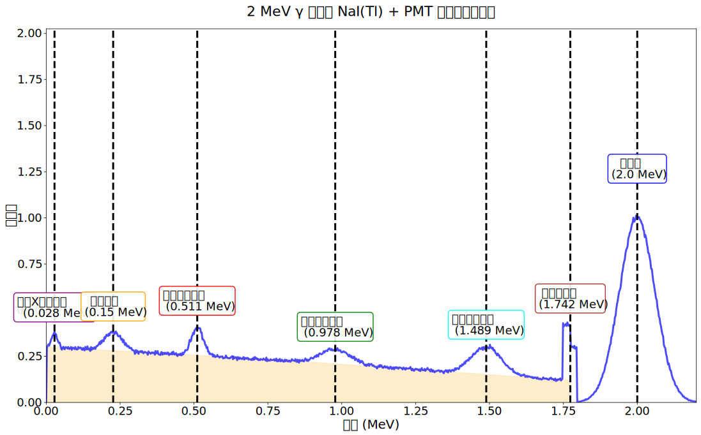
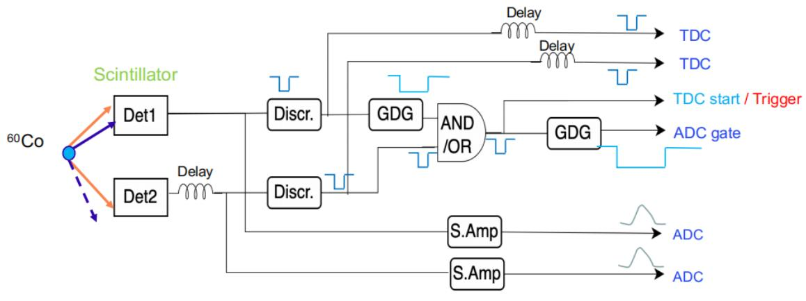

# 核物理实验方法期末开卷考试答案

1. 带电粒子的电离能量损失率（$- \mathrm{d}E / \mathrm{d}x$）与入射带电粒子的质量关系为**==无关==**，与入射带电粒子的带电数 $z$ 的关系为 $z^2$ 。

   ---

2. 在 $1 \ \mathrm{MeV}$ - $1000 \ \mathrm{MeV}$ 能量范围内，$\alpha$ 粒子的 $- \mathrm{d}E / \mathrm{d}x$ 随着能量的增加而**==减小==**（填增加或减小）。

   ---

3. 重带电粒子的能量损失主要通过**==电离==**和**==激发==**， 在 $1 \ \mathrm{MeV}$ 以上**==电离==**为主；电子的能损主要通过**==电离==**和**==韧致辐射==**， 随着能量的增加**==韧致辐射==**的贡献所占比例变大。

   ---

4. Gaussian 分布的 FWHM 与 $\sigma$ 的关系式为 $\mathrm{FWHM} = 2.35 \sigma$ ，测量值 $x \pm \sigma$ 意味着真值落在 $x - \sigma$ 和 $x + \sigma$ 之间的几率为 $68\%$ 。

   ---

5. 按衰减时间 (decay time) 由小到大的顺序排序 $\mathrm{NaI}$ ，$\mathrm{BaF_2}$ ，plastic ：$\mathrm{BaF_2} (\mathrm{fast}) < \mathrm{plastic} < \mathrm{NaI} < \mathrm{BaF_2} (\mathrm{slow})$ 。

   ---

6. 硅探测器和塑料闪烁体探测器都是 $\beta$ 射线探测中常见的探测器。对于能量测量和活度测量应优先使用哪种探测器？为什么？

   **答**：对于能量测量应该优先使用硅探测器，对于活度测量应优先使用塑料闪烁体探测器。

   **原因**：硅探测器产生电子-空穴对所需的能量很小，具有卓越的能量分辨率。密度相对较大，具有更好的阻止本领，阻停同样能量的束流，所需要的体积较小，更紧凑。塑料闪烁体探测器的能量分辨率较差，但是衰减时间仅几个纳秒，上升时间约 $4$ 纳秒（硅探测器的上升时间约 $60 \ \mathrm{ns}$），具有极好的时间分辨率，适宜做时间测量。

   ---

7. 能量为 $2 \ \mathrm{MeV}$ 的单能 $\gamma$ 光子被 $\mathrm{NaI} + \mathrm{PMT}$ 探测器所探测。

   - 画出能谱（$\mathrm{d}N / \mathrm{d}E \sim E $），标注主要特征。

     

      图 1: 能谱

   - 简述谱中各特征的产生机制。

     第一个峰是特征 X 射线谱线，第二个是由于背散射导致的峰，第三个是正电子湮灭导致的峰，第四个是全能峰的双电子逃逸峰，第五个是单电子逃逸峰，第六个是康普顿边缘，最后一个是全能峰。

     - 全能峰（Full-energy peak）  

        **位置：**  
       $$
       E = X
       $$

        **来源：** $\gamma$ 光子在晶体中完全沉积其能量（光电效应 / 多次康普顿散射后再经光电效应）。  

     - 康普顿连续谱 & 康普顿边缘（Compton edge）  

        **康普顿边缘位置：**  
       $$
       E_\mathrm{C} = X\left(1 - \frac{1}{1 + 2X / m_e c^2}\right)
       $$

        **来源：** 单次康普顿散射中，反冲电子获得的**最大动能**所对应的能量端点。  

     - 背散射峰（Backscatter peak）  

        **位置：**
       $$
       E_\mathrm{B} = \frac{X}{1 + 2X / m_e c^2}= \frac{X}{1 + \frac{m_e c^2}{2X}}
       $$

        **来源：** $\gamma$ 光子在探测器外部发生 $180\degree$ 康普顿散射后，再返回并在晶体中被吸收。  

     - 正电子湮灭峰（$511\ \mathrm{keV}$）  

        **位置：**  
       $$
       E = 0.511 \ \mathrm{MeV}
       $$

        **来源：** 当 $X > 1.022 \ \mathrm{MeV}$ 时发生对产生，正电子与电子湮灭产生两条 $511 \ \mathrm{keV}$ 光子。  

     - 单电子逃逸峰（Single escape peak）  

        **位置：**  
       $$
       E = X - 0.511 \ \mathrm{MeV}
       $$

        **来源：** 对产生后，两条湮灭光子中**有一条逃逸**出探测器。  

     - 双电子逃逸峰（Double escape peak）  

        **位置：**  
       $$
       E = X - 1.022 \ \mathrm{MeV}
       $$

        **来源：** 对产生后，两条 $511 \ \mathrm{keV}$ 湮灭光子**全部逃逸**出探测器。  

     - 特征 X 射线峰（Characteristic X-rays）  

        **来源核素：** $\mathrm{NaI}$ 探测器中主要来自 **$\mathrm{I}$（碘）原子的 K 线**。  

        **典型能量位置：**  
       $$
       28 \sim 33 \ \mathrm{keV}
       $$

        **来源：** $\gamma$ 光子发生光电效应后，原子内壳层空穴退激辐射产生的特征 X 射线。

   - 如果探测器的灵敏体积由小到大发生变化，能谱将发生什么变化？

     灵敏体积变大，探测效率增加，被探测到的 $\gamma$ 射线沉积的能量也增多。全能峰面积和多重康普顿散射增加，其他峰位包括康普顿坪减小。等探测器的灵敏体积“无限大”时，只剩下全能峰。

   - 描述课上讲过的 $\gamma$ 能谱测量中降低康普顿连续谱对低能区影响的两种方法。

     - 使用反康普顿谱仪：如果半导体探测器和包裹在半导体探测器外侧的 BGO 探测器同时有信号输出，则可以利用反符合的方式，拒绝在半导体中产生的信号，这样最后半导体探测器输出的信号就只有全能峰的信号。（ BGO 探测效率大）；
     - 使用复合锗探测器：设置多块锗探测器，若某一 $\gamma$ 先后在多个小探测器中沉积能量产生信号，则可通过符合的方式把多个探测器的输出信号幅度相加，以此增加最后能谱的峰康比。

   ---

8. 从电路负载和阻抗匹配对信号影响的角度，描述**能量路**和**时间路**电子学的前后级的 $Z_{\mathrm{out1}}$ 和 $Z_{\mathrm{in2}}$ 之间满足什么条件，为什么？

   **答**：
   能量测量：$Z_{\mathrm{in1}} = 1000 \ \Omega$ ，$Z_{\mathrm{out2}} < 1 \ \Omega$ 。
   时间测量：$Z_{\mathrm{in1}} = 50 \ \Omega$ ，$Z_{\mathrm{out2}} = 50 \ \Omega$ 。

   **原因**：
   用于能量测量、慢信号时最好总是有 $Z_{\mathrm{out2}} \ll Z_{\mathrm{in1}}$ ，这样当负载连接时，信号电平就不会改变。
   用于时间测量、快速信号时它要求有 $Z_{\mathrm{out2}} = Z_{\mathrm{in1}}$ ，这就是射频电路的情况，以避免信号反射。

   ---

9. 用金硅面垒探测器测 ${}^{210}\mathrm{Po}$ 的 $\alpha$ 粒子能谱。

   - 逐步增加反偏电压时观测到的脉冲幅度和分辨率有何变化，原因是什么？

     加反偏电压会使金硅面垒探测器的灵敏区增加，进而使得探测器中沉积的能量增大直至达到最大值饱和不变，因此脉冲幅度会先增加然后不变；对于分辨率而言，相对分辨率反比于沉积能量的 $1/2$ 次方，随着沉积能量的增大，能量分辨率逐渐提高，直至不变。

   - 描述利用 $\alpha$ 放射源确定探测器工作偏压的方法？

     1.  **选择适当的 $\alpha$ 放射源**：选择一个放射性核素，通常是一个放射性的 $\alpha$ 粒子源。
     2.  **放置 $\alpha$ 放射源**：将 $\alpha$ 放射源放置在离探测器表面一定距离的位置，以确保探测器可以被辐射到。
     3.  **逐步调整工作偏压**：从零开始逐步增加探测器的工作偏压，监测探测器输出的信号。
     4.  **记录信号变化**：随着工作偏压的增加，记录 $\alpha$ 粒子探测信号的变化。
     5.  **确定最佳工作偏压**：当输出信号的峰不再改变时，确定了最佳工作偏压。

   ---

10. 写出望远镜法、脉冲形状甄别法进行粒子鉴别的原理？

    **答**：

    *   **脉冲波形法**：入射粒子的 $\mathrm{d}E / \mathrm{d}x$ 的值越大，闪烁光里面的慢成分越多。在实验中，入射粒子在探测器中产生信号的尾部面积与脉冲总面积的比值越大，则说明粒子的 $\mathrm{d}E / \mathrm{d}x$ 越大，因此可以通过辨别脉冲形状来鉴别粒子。
    *   **望远镜法**：将两块探测器联合在一起，其中第一块探测能量损失，第二块探测粒子的能量。根据电离能损公式：$\frac{\mathrm{d}E}{\mathrm{d}x} \propto \frac{A Z^{2}}{E}$，当第一块探测器厚度很薄时，粒子的沉积能量很小，可以认为粒子在第一块探测器中的能量为一常数，因此粒子在第一块探测中的沉积能量 $\Delta E \propto \frac{A Z^{2}}{E}$，再利用第二块探测器探测粒子能量，将两块探测器的测量值绘制在一个图中，由于入射粒子的质量数以及质子数不同，可以得到一系列曲线，通过这些曲线可以辨别粒子。

    ---

11. 简述带电粒子在电离室区和正比区发生的物理过程。写出在本课程中出现的几种气体探测器的名称，至少 $5$ 种，并指明工作在哪一区。

    **答**：

    *   **电离室区**：随着外加电压增大，离子漂移速度增加，电子吸附、扩散效应的影响减小，发生复合的机会减小，被收集的电荷数增加。电压达到一定值（$V_a$）时，基本不存在复合，总电离数（$N_0$）全部被电极收集，达到饱和。在一定电压范围内（$ V_a - V_b$），被收集电荷不再增加，达到饱和。
    *   **正比区**：工作电压大于 $V_b$ 后，外加电场很强，电离电子在漂移过程中获得的能量很大，使气体分子再电离，又产生次级离子对。次级电子在漂移时又可能加速到足以再次产生次级离子对。如此不断继续下去，使电离的离子对数目比原总电离对数目 $N_0$ 增加很多，称为气体放大。经气体放大得到的电荷数 $N$ 与原总电离数 $N_0$ 之比，叫做气体放大倍数 $M$ ， $M = N / N_0$ ，气体放大倍数随电压的增加而增加。对确定的探测器，外加电压一定时，放大倍数一定。

    几种气体探测器及其工作区：

    1.  电离室（电离室区）；
    2.  正比计数器（正比区）；
    3.  多丝正比室（正比区）；
    4.  PPAC（正比区）；
    5.  G-M 计数器（G-M区）。

    ---

12. 试用误差传递公式求出飞行时间法 (TOF) 测量中子能量 $E_n$ 的相对误差 (不考虑 start 探测器时间分辨)，并讨论减少测量误差的方法。

    符号：飞行距离 $L$ ，飞行时间 $\mathrm{TOF}$ ，stop 探测器厚度 $\sigma_{L}$ ，stop 探测器时间分辨 $\sigma_{t}$ 。

    **答**：

    首先有：

    $$
    E_n = \frac{m_nL^2}{2\mathrm{TOF}^2}.
    $$

    已知有距离的不确定度 $\sigma_{L}$ 以及飞行时间的不确定度 $\sigma_{\mathrm{TOF}}$ 。根据不确定度传递公式，有

    $$
    \sigma_{E_n}^2 = (\partial_LE_n)^2\sigma_{L}^2 + (\partial_\mathrm{TOF}E_n)^2\sigma_{\mathrm{TOF}}^2 + 2\partial^2_{L,\mathrm{TOF}}E_n cov(L,\mathrm{TOF}) \\
    = \left(\frac{m_nL}{\mathrm{TOF}^2}\right)^2\sigma_{L}^2 + 
    \left(\frac{m_nL^2}{\mathrm{TOF}^3}\right)^2\sigma_{\mathrm{TOF}}^2 -2 
    \left(\frac{m_n^2L^3}{\mathrm{TOF}^5}\right) cov(L,\mathrm{TOF}).
    $$

    于是相对误差可以写为

    $$
    R = \frac{\sqrt{\left(\frac{m_nL}{\mathrm{TOF}^2}\right)^2\sigma_{L}^2 + \left(\frac{m_nL^2}{\mathrm{TOF}^3}\right)^2\sigma_{\mathrm{TOF}}^2 -2\left(\frac{m_n^2L^3}{\mathrm{TOF}^5}\right)cov(L,\mathrm{TOF})}}{E_n} = \frac{2}{L}\sqrt{\sigma_L^2 +\frac{L^2}{t^2}\sigma_t^2 - 2\frac{L}{t}cov(L,\mathrm{TOF})}.
    $$
    一般认为 $cov(L,\mathrm{TOF}) = 0$ 。

    减小误差的方法：

    1.  增加飞行距离 $L$ 或者飞行时间 $\mathrm{TOF}$ ；
    2.  选用密度大的阻止探测器以减小 $\sigma_{L}$ ；
    3.  选用时间分辨小的 stop 探测器以减小 $\sigma_{t}$ 。

    ---

13. 简述前置放大器和主放大器的功能。

    **答**：
    大多数核探测器输出的信号幅度很小，如硅探测器，直接输出信号小于 $1 \ \mathrm{mV}$ 。幅度小的信号在传输过程中易受到噪声的干扰，不利于远距离传输。因此，信号在传输前，需要先进行放大处理。

    *   **前置放大器**：位于探测器和下一级电子学之间。
        **作用**：
        
        *   将探测器的输出信号进行放大，提高信噪比；
        *   提供阻抗匹配；
        *   对信号脉冲进行整形，方便后续的信号处理。
        
        **前置放大器的分类**：
        
        *   电压灵敏型；
        *   电荷灵敏型（主要）；
        *   电流灵敏型。
        
    *   **主放大器**：又叫整形放大器，位于前置放大器后，由 CR 微分电路和 RC 积分电路构成，将前放的输出信号整成准高斯型。
        **作用**：
        
        *   经过谱仪放大输出器输出的信号顶端平，有利于后面的幅度分析；
        *   **放大**和**成形**，改善信噪比。

    ---

14. 简述前沿甄别和恒比定时甄别的定时原理及适用范围。

    **答**：

    *   **前沿定时法**：
        **原理**：当输入信号超过一个固定的阈值水平时，它会产生一个逻辑脉冲，该阈值水平应该高于噪声水平，以防止对噪声信号的杂散触发。
        **适用范围**：用于输入脉冲幅度和波形变化不大的情况。
    *   **恒比定时法**：
        **原理**：将输入信号进行翻转延时以及缩小处理，注意延时时间要**大于**信号的上升时间，当翻转延时的信号幅度与缩小处理的信号幅度之和为零时，输出信号。
        **适用范围**：主要用于**上升时间不变**的（保证延迟时间固定）快响应探测器，如有机闪烁体探测器。

    —

15. 用两个 HPGe 探测器来测量活度为 $n_0$ 的 ${}^{60}\mathrm{Co}$ 放射源的一对 $\gamma$ 光子，探测器探测效率分别为 $\varepsilon_1$ 、$\varepsilon_2$ ，两个**探测器时间信号的宽度均为** $\tau$ 。

    - 画出符合法测量 ${}^{60}\mathrm{Co}$ 的两个 $\gamma$ 是否有级联关系的电路框图（包含前置放大器、分路器、时间甄别、Delay、符合单元、触发器、ADC、TDC、ADC gate、TDC start）。

      **答**：符合电路（题目可能不一样）

      

       图 2: 符合电路

    - 给出用符合法测得的真符合和偶然符合的计数率。

      假设探测器 $1$ 记录 $\gamma_1$ 光子，对放射源立体角为 $\Omega_{\gamma_1}$ ；假设探测器 $2$ 记录 $\gamma_2$ 光子，对放射源立体角为 $\Omega_{\gamma_2}$ 。

      第一道计数率为：
      $$
      n_{\gamma_1} = n_0 \Omega_{\gamma_1} \varepsilon_{\gamma_1},
      $$
      第二道计数率为：
      $$
      n_{\gamma_2} = n_0 \Omega_{\gamma_2} \varepsilon_{\gamma_2},
      $$
      真符合计数率为：
      $$
      n_{\mathrm{tc}} = n_0 \Omega_{\gamma_1} \varepsilon_{\gamma_1} \Omega_{\gamma_2} \varepsilon_{\gamma_2}.
      $$
      偶然符合计数率为：
      $$
      n_{\mathrm{rc}} = 2 \tau n_0^2 \Omega_{\gamma_1} \varepsilon_{\gamma_1} \Omega_{\gamma_2} \varepsilon_{\gamma_2}.
      $$
      真偶符合比为：
      $$
      \frac{n_{\mathrm{tc}}}{n_{\mathrm{rc}}} = \frac{1}{2 \tau n_0}.
      $$
      
      
      

