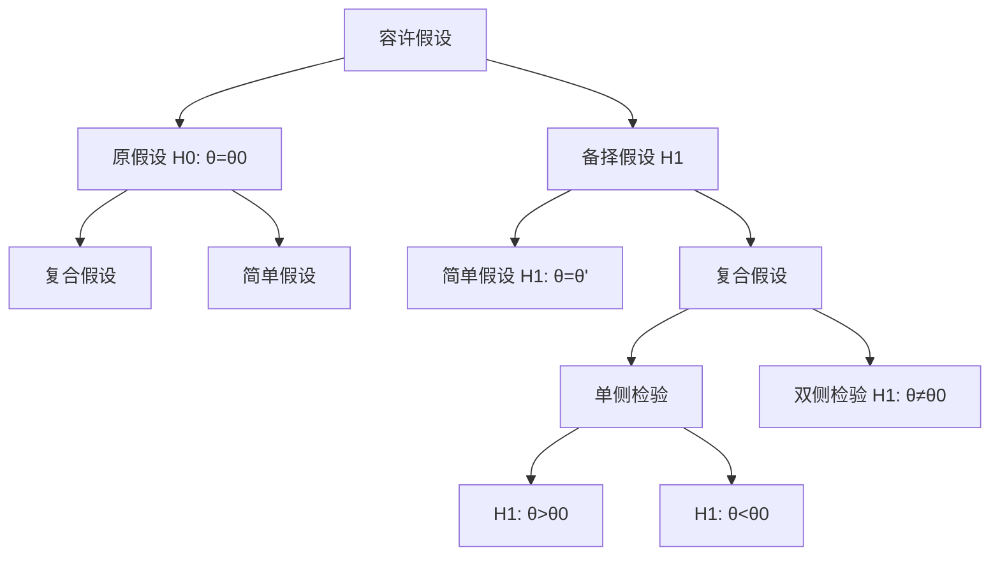

# 第一章 奇怪的绪论

## 1.1 误差的分类

- 过失误差
- 统计误差
- 系统误差

## 1.2 测量数据表示以及运算

1. 测量值末位要与误差末位相同；
2. 误差应与测量精度一致；
3. 需要对多个测量数据进行运算以得到结果，可将**测量值**多写一个估计位数字；
4. 误差**最多只有两位有效数字**

## 1.3 数据修约规则

四舍六入，五看奇偶，奇变偶不变

1. 误差的有效数字前 $3$ 位，位于 $100$ 与 $354$ 之间，保留两位有效数字；
2. 误差的有效数字前 $3$ 位，位于 $355$ 与 $949$ 之间，保留一位有效数字；
3. 误差的有效数字前 $3$ 位，位于 $950$ 与 $999$ 之间，修约为 $1000$ 。

> [!tip]
>
> - $1.827 \pm 0.119 \rightarrow 1.83 \pm 0.12$
> - $1.827 \pm 0.367 \rightarrow 1.8 \pm 0.4$
> - $1.827 \pm 0.966 \rightarrow 2 \pm 1$

## 1.4 误差的报告

- 上下误差限相同，就是 $x = \mu \pm \sigma$ 。
- 上下误差限不同，就是 $x = u^{+\sigma_1}_{-\sigma_2}$ 。


# 第二章 概率论初步

## 2.1 现象与事件

现象分为必然现象以及随机现象：

1. 必然现象：**过程**和**后果**是完全确定的，可以唯一地用一定的物理规律给予精确描述。

2. 随机现象：在完全相同的条件下，对同一事物做多次测量或实验，结果不止一个。但是所有的结果已经明确知道，**大量重复**实验的结果**呈现某种统计规律**。

   > [!note]
   >
   > 随机试验：随机现象中的试验，简称试验。
   >
   > 互相独立：随机试验重复多次，每次实验的结果互不影响。

事件有很多，比如：

- 随机事件：随机试验中**可能出现的各种结果**。

- 基本事件：随机试验中**每一种可能的结果**。

  > [!important]
  >
  > 注意，在投骰子中，丢出点数为 $1,2,3$ 是基本事件，丢出数目为偶数不是基本事件。
  >
  > 样本空间：基本事件的集合。事件是样本空间的子集。

- 必然事件：试验中必定发生的事件，是样本空间全域。

- 不可能事件：就是空集。

### 2.1.2 事件之间的关系及运算

已知随机事件 $E$ 的样本空间为 $S$ ，则事件 $A$ 与事件 $B$ 可能有如下关系
$$
A \subset B.
$$
就是事件 $A$ 的发生一定会导致事件 $B$ 的发生。还有和（$P(A \cup B) \eqqcolon P(A+B)$，并集，表示其中任意一个发生）、积（$P(A \cap B) \eqqcolon P(AB)$ ，交集，表示同时全部发生）以及差（表示一个发生另一个不发生）。

==如果有 $AB = \varnothing$ ，说明两个事件不可能同时发生（**互斥、互不相容**）；如果 $A = \bar B$ ，**互逆/对立**事件，代表两个事件中一个发生一个不发生。==

### 2.1.3 样本空间的划分

所谓的划分，就是指将样本空间划分为**互不重叠**且**完全**的多个事件。样本空间所有元素构成它的一个划分。

## 2.2 概率

### 2.2.1 古典概率

基本事件概率均匀，要求基本事件数目有限。

### 2.2.2 几何概率

略

### 2.2.3 统计概率

记事件 $A$ 的在 $N$ 次试验中出现的频数为 $n$ ，则认为其概率为
$$
P(A) = \lim_{N\rightarrow \infty} \frac{n}{N}.
$$
大数定律：在 $N$ 足够大的时候，频率可以认为是其概率。

### ==2.2.4 定义==

- 概率**非负**；

- 概率**归一**；

- 概率**可加**，对于**不相容事件** $A_k$ ，应有
  $$
  P\left(\sum_k A_k\right) = \sum_k P(A_k).
  $$

> [!important]
>
> 这里用于判断是否一个函数能否作为概率。

### 2.2.5 性质

- ==**概率加法定律**==
  $$
  P(A + B) = P(A) + P(B) - P(AB)\\
  \Rightarrow P(A + B) = P(A) + P(B) \quad \mathrm{when}\quad AB = \varnothing.
  $$

- 概率的乘法定律
  $$
  P(AB) = P(A|B)P(B) = P(B|A)P(A).
  $$

## 2.3 条件概率以及独立性

### 2.3.1 条件概率

事件 $B$ 在 $A$ 发生的前提下发生的概率为
$$
P(B|A) = \frac{P(AB)}{P(A)}.
$$
有如下特性

- $P(S|B) = 1$ ；
- 对于互不相容事件 $A_i$ ，有 $P(\sum_i A_i|B) = \sum_iP(A_i|B)$ ；
- $P(A|B) = 1 - P(\bar A|B)$ 。

### ==2.3.2 事件的独立性==

如果满足
$$
P(AB) = P(A)P(B).
$$
则认为 $A,B$ 相互独立，即 $P(A|B) = P(A)$ 。

如果有三个事件 $A,B,C$ ，则三个事件互不相关条件为
$$
P(ij) = P(i)P(j) \quad \mathrm{and} \quad P(ijk) = P(i)P(j)P(k).  \quad \mathrm{for} \quad i,j,k = A,B,C\quad i \neq j \neq k
$$
**注意！缺一不可！**

## ==2.4 边沿概率、全概率公式、贝叶斯公式==

### 2.4.1 边沿概率

如果将样本空间 $S$ 使用两种划分为 $\left\{A_i\right\}_{i=1}^n$ 以及 $\left\{B_j\right\}_{j=1}^n$ ，也就是说应有如下关系
$$
\sum_i P(A_i) = \sum_j P(B_j) = 1.
$$
那么 $A_i$ 的边沿概率就是
$$
P(A_i) = \sum_jP(A_iB_j).
$$

> [!note]
>
> 常见的表示为：
>
> 设 $X$ 和 $Y$ 是两个离散随机变量，$X$ 取值 ${x_i}$ ，$Y$ 取值 ${y_j}$ 。联合概率为 $P(X=x_i, Y=y_j)$ ，则 $X$ 的边沿概率为：
> $$
> P(x_i) = \sum_j P(X=x_i, Y=y_j).
> $$
>

### 2.4.2 全概率公式

如果 $\left\{B_i\right\}_{i=1}^n$ 为 $S$ 的一个划分，则任意事件 $A$ 的概率为
$$
P(A) = \sum_{j = 1}^n P(A|B_j)P(B_j) = \sum_{j = 1}^n P(AB_j).
$$

**我们要求的实际上只是一个事件的概率，但是整体此时被划分，事件在不同的划分中的概率不同，那么就可以认为事件的概率就是事件在各个划分中的加权平均。**并且我们需要注意，**划分的概率一定要是已知的**，所以说题目中已知的那个事件一定要作为划分。

本质上，全概率公式就是边沿概率公式。

### 2.4.3 贝叶斯公式

如果 $\left\{B_i\right\}_{i=1}^n$ 为 $S$ 的一个划分，则后验概率
$$
P(B_i|A) = \frac{P(A|B_i)P(B_i)}{\sum_{j = 1}^n P(A|B_j)P(B_j)}.
$$

==其中事件 $\left\{B_i\right\}_{i=1}^n$ 的概率是已知的（或者**基于已有知识或主观判断对某个假设或参数的概率评估**），也就是说 $P(B_i)$ 在试验前就是已知的，这种概率称为**先验概率**； $P(A|B_i)$ 这种条件概率是在实验中得出的。所以这里的意思就是通过先验概率以及实验中得到的概率，获得后验概率 $P(B_i|A)$ 。==

**也可以这样理解，我们已经知道了一个事件在这个整体中的概率，现在我们需要求的是事件发生在划分 $B_i$ 的概率。**

仔细观察一下贝叶斯公式，可以发现似乎这里这样等效
$$
P(B_i|A) = \frac{P(B_iA)}{P(A)} = \frac{P(A|B_i)P(B_i)}{\sum_{j = 1}^n P(A|B_j)P(B_j)\mathrm{（全概率公式）}}
$$
所以说**应用贝叶斯公式之前一定要用到全概率公式**。

> [!note]
>
> **题目 1 ：边沿概率**
>
> 假设有两个随机变量 $X$ 和 $Y$，其中 $X$ 取值为 $1$ 或 $2$，$Y$ 取值为 $1$、$2$ 或 $3$ 。联合概率分布如下表所示：
>
> | $X / Y$ |  $1$  |  $2$  |  $3$  |
> | :-----: | :---: | :---: | :---: |
> |   $1$   | $0.1$ | $0.2$ | $0.1$ |
> |   $2$   | $0.2$ | $0.3$ | $0.1$ |
>
> 求 $X = 1$ 的边沿概率。
>
> **解答**：
> 	边沿概率 $P(X=1)$ 是通过对 $Y$ 的所有可能值求和得到的：  
> $$
> P(X=1) = P(X=1, Y=1) + P(X=1, Y=2) + P(X=1, Y=3) = 0.1 + 0.2 + 0.1 = 0.4
> $$
> 因此，$X = 1$ 的边沿概率为 $0.4$ 。
>
> ---
>
> **题目 2 ：全概率公式**
>
> 假设有两个工厂生产灯泡：工厂 $A$ 和工厂 $B$ 。工厂 $A$ 生产 $60\%$ 的灯泡，工厂 $B$ 生产 $40\%$ 的灯泡。工厂 $A$ 生产的灯泡中，有 $95\%$ 是合格的；工厂 $B$ 生产的灯泡中，有 $90\%$ 是合格的。求随机抽取一个灯泡是合格的概率。
>
> **解答**：
> 	定义事件：  
>
> - $A$：灯泡来自工厂 $A$  
> - $B$：灯泡来自工厂 $B$  
> - $G$：灯泡合格  
>
> 已知：  
> $$
> P(A) = 0.6, \quad P(B) = 0.4, \quad P(G|A) = 0.95, \quad P(G|B) = 0.90
> $$
> 使用全概率公式：  
> $$
> P(G) = P(G|A) P(A) + P(G|B) P(B) = (0.95 \times 0.6) + (0.90 \times 0.4) = 0.57 + 0.36 = 0.93
> $$
> 因此，随机抽取一个灯泡是合格的概率为 $0.93$ 。
>
> ---
>
> **题目 3 ：贝叶斯公式**
>
> 继续使用题目 2 的场景。如果随机抽取一个灯泡是合格的，求它来自工厂 $A$ 的概率。
>
> **解答**： 
> 	我们要求后验概率 $P(A|G)$ 。使用贝叶斯公式：  
> $$
> P(A|G) = \frac{P(G|A) P(A)}{P(G)} = \frac{0.95 \times 0.6}{0.93} = \frac{0.57}{0.93} \approx 0.6129
> $$
> 因此，给定灯泡合格，它来自工厂 $A$ 的概率约为 $0.6129$ 。
>
> ---
>
> **题目 4 ：贝叶斯公式**
>
> 假设一种疾病在人口中的患病率是 $1\%$。有一种测试方法，如果某人患病，测试结果为阳性的概率是 $99\%$ ；如果某人没有患病，测试结果为阳性的概率是 $5\%$ 。如果一个人测试结果为阳性，求他实际患病的概率。
>
> **解答**：
>
> 首先观测题目，这里说的是“如果一个人测试结果为阳性，求他实际患病的概率”，就是要求条件概率。**一提到条件概率就要想到贝叶斯公式**。
>
> 定义事件：  
>
> - $D$：患病（先验概率，划分）
> - $T$：测试阳性  
>
> 已知：  
> $$
> P(D) = 0.01, \quad P(T|D) = 0.99, \quad P(T|\bar{D}) = 0.05
> $$
> 在这里，患病与否是先验概率，所以在这里要作为划分，测试阳性的概率就作为事件
>
> 首先，使用全概率公式求 $P(T)$ ：  
> $$
> P(T) = P(T|D) P(D) + P(T|\bar{D}) P(\bar{D}) = (0.99 \times 0.01) + (0.05 \times 0.99) = 0.0099 + 0.0495 = 0.0594
> $$
> 然后，使用贝叶斯公式求 $P(D|T)$：  
> $$
> P(D|T) = \frac{P(T|D) P(D)}{P(T)} = \frac{0.99 \times 0.01}{0.0594} \approx \frac{0.0099}{0.0594} \approx 0.1667
> $$
> 因此，如果测试结果为阳性，实际患病的概率约为 $16.67\%$。
>
> ---
>
> **题目 5 ：全概率公式结合**
>
> 假设有三个箱子：箱子 $1$ 有 $2$ 个红球和 $3$ 个蓝球，箱子 $2$ 有 $1$ 个红球和 $4$ 个蓝球，箱子 $3$ 有 $3$ 个红球和 $2$ 个蓝球。随机选择一个箱子（每个箱子被选中的概率相等），然后从该箱子中随机抽取一个球。求抽到红球的概率。
>
> **解答**：
>
> 首先观察题目，每个箱子被选中的概率相等，就是这里也许可以做为全概率公式中的划分。
>
> 定义事件：  
>
> - $B_1$：选择箱子 $1$  
> - $B_2$：选择箱子 $2$  
> - $B_3$：选择箱子 $3$  
> - $R$：抽到红球  
>
> 已知：  
> $$
> P(B_1) = P(B_2) = P(B_3) = \frac{1}{3}
> $$
> 每个箱子中抽到红球的概率：
> $$
> P(R|B_1) = \frac{2}{5} = 0.4, \quad P(R|B_2) = \frac{1}{5} = 0.2, \quad P(R|B_3) = \frac{3}{5} = 0.6
> $$
> 使用全概率公式求 $P(R)$ ：
> $$
> P(R) = P(R|B_1) P(B_1) + P(R|B_2) P(B_2) + P(R|B_3) P(B_3)\\ = 0.4 \times \frac{1}{3} + 0.2 \times \frac{1}{3} + 0.6 \times \frac{1}{3} = \frac{0.4 + 0.2 + 0.6}{3} = \frac{1.2}{3} = 0.4
> $$
> 因此，抽到红球的概率为 $0.4$ 。
>
> ---
>
> **题目 6 ：贝叶斯公式与多个条件**
>
> 在题目 5 的基础上，如果抽到的是红球，求它来自箱子 $2$ 的概率。
>
> **解答**：  我们要求后验概率 $P(B_2|R)$ 。  使用贝叶斯公式：  
> $$
> P(B_2|R) = \frac{P(R|B_2) P(B_2)}{P(R)} = \frac{0.2 \times \frac{1}{3}}{0.4} = \frac{0.2}{3 \times 0.4} = \frac{0.2}{1.2} = \frac{1}{6} \approx 0.1667
> $$
> 因此，给定抽到红球，它来自箱子 $2$ 的概率约为 $0.1667$ 。


# 第三章 随机变量及其分布

需要掌握一个重点，**分布的概念在两种变量中都存在，概率分布是对于离散型变量来说的，概率密度分布是对于连续型变量来说的**。因为连续型随机变量没有在一个点处的概率这种说法，只能说在某一点处的概率密度。

## 3.1 随机变量

随机变量 $X$ 是定义在样本空间 $S$ 上的，以相应的小写字母表示其可能的取值 $x_1,x_2,...$ 。

> [!tip]
>
> 区分：随机变量与普通变量
>
> - 普通变量定义在实轴上，随机变量定义在随机试验样本空间上；
> - 普通变量取值唯一、随机变量取值随机取决于概率。

## ==3.2 随机变量的分布（分布函数的定义）==

随机变量 $X$ 的一个特定值 $x$ 的概率 $P(x)$ 就是其概率分布特性。概率分布特性可以通过**累积分布函数**或者**概率密度函数**描述。

### 3.2.1 累积分布函数

$$
F(x) = P(X \le x).
$$

$F(x)$ 有如下性质：

- 非负；
- 非递减；
- $F(x_{min}) = 0$ 以及 $F(x_{max}) = 1$ 。

### 3.2.2 概率密度函数

$$
f(x) = \frac{\mathrm{d}F(x)}{\mathrm{d}x}.
$$

性质

- 连续非负；
- $\int_x f(x) \mathrm{d}x = 1$ ；
- 在 $x \notin \left[x_{min},x_{max}\right]$ 中 $f(x) = 0$ ；

- $P(x<X\leq x +\mathrm{d}x) = f(x)\mathrm{d}x$ ；

- $P(x_1<X\leq x_2) = \int_{x_1}^{x_2} f(x) \mathrm{d}x = F(x_2) - F(x_1) $ 。

在计算概率密度函数的时候注意考虑保证归一化，尤其**不能忘记算系数**。

### ==3.2.3 随机变量函数的分布==

即：已知 $X$ 是随机变量，如何求随机变量 $Y = y(x)$ 的分布。

- 如果 $Y$ 是 $X$ 的双射，也即是存在反函数 $X = x(y)$ ，那么概率按照如下方式计算
  $$
  \mathrm{离散随机变量：}P(y_i) = P(x_i), \quad \mathrm{连续随机变量：}P(a < Y < b) = \int_a^bg(y)\mathrm{d}y = \left|\int_{}^{}f(x)\mathrm d x\right|.
  $$

  注意！若随机变量连续，要**注意加绝对值保证非负**。其中 $\boxed{g(y) = f\left[x(y)\right]\left|\frac{\mathrm dx(y)}{\mathrm d y}\right|}$ 是随机变量 $Y$ 的概率密度函数。**如果此时 $f(x)$ 已经归一化，那么 $g(y)$ 也是归一化的**。

- 如果 $Y$ 不是 $X$ 的双射，就是说不能获得唯一反函数。一个 $y$ 可能对应多个 $x$ ，所以计算概率时应修正为：
  $$
  \mathrm{离散随机变量：}P(y_i) = \sum_{j,y_i = y(x_j)} P(x_j)\quad \mathrm{连续随机变量：}P(a < Y < b) = \int_a^bg(y)\mathrm{d}y = \left|\int_{}^{}f(x)\mathrm d x\right|.
  $$

  此时 $\boxed{g(y) = \sum_i f\left[x_i(y)\right]\left|\frac{\mathrm dx_i(y)}{\mathrm d y}\right|}$ 是随机变量 $Y$ 的概率密度函数。
  
  在后面会提到[多维随机变量函数的求法](#ewsjblhsfb)。

## ==3.3 随机变量的数字特征==

位置参数包括**期望**、**中值**以及**最可几值**。

- 期望

  数字特征包括数学期望、方差以及矩。

  期望是一个线性算符，满足
  $$
  E(a_ix_i) = a_iE(x_i).
  $$
  随机变量函数 $Y = y(x)$ ，其中 $y$ 是连续实函数

  - 如果 $X$ 是离散的，期望 $E(Y) = \sum_iy(x_i)P(x_i)$

  - 如果 $X$ 是连续的，期望 $E(Y) = \int_x y(x)f(x)\mathrm d x$

- 中值

  中值不一定只有一个。

  - 当 $X$ 是连续随机变量的时候，应满足
    $$
    \int_{-\infty}^{x_{1/2}}f(x)\mathrm d x = \frac{1}{2}.
    $$

- 最可几值

  - 离散型

  $$
  P(x_\mathrm{prob}) = \mathrm{MAX}\left\{P(x_1),....\right\}.
  $$
  
  

  - 连续性

  $$
  P(x_\mathrm{prob}) = \mathrm{MAX}\left\{f(x)\right\}.
  $$
  
- 随机变量的矩

  如果选择函数 $g(X) = (X-C)^l$ ，其中 $C$ 为常数， $l$ 为正整数，则其期望
  $$
  \alpha_l = E\left[(X-C)^l\right].
  $$
  为 $X$ 对于点 $C$ 的 $l$ 阶矩。当 $C = 0$ 的时候，称为 $X$ 的 $l$ 阶**原点矩或者代数矩**，记为 $\lambda_l$ ；当 $C = E(X)$ 的时候，称为 $X$ 的 $l$ 阶**中心矩**，记为 $\mu_l$ 。

  可以得到如下性质

  - 零阶中心矩为 $1$ ，一阶中心矩为 $0$ ，二阶中心矩为方差；
  - 一阶原点矩为期望值。

  重要公式
  $$
  V(X) = E(X^2) - E^2(X).
  $$

- 方差

  - $V(CX) = C^2V(X)$ ；

  - $V(\sum_i X_i) = \sum_i V(X_i)$ （详细可看[后面](#fangcha)）。

- 偏度系数
  $$
  \gamma_1  = \frac{\mu_3}{\mu_2^{3/2}}.
  $$

  表示随机变量概率密度**对其均值的不对称程度/偏斜程度**。 $\abs{\gamma_1}$ 越大，概率密度越不对称。==$\gamma_1 > 0$ 表示概率密度在峰右侧有长尾； $\gamma_1 < 0$ 表示概率密度在峰左侧有长尾。==

- 峰度系数
  $$
  \gamma_2 = \frac{\mu_4}{\mu_2^2} - 3.
  $$

  反应了**概率密度的尖锐程度**与**正态分布概率密度曲线尖锐程度**的对比。 ==$\gamma_2 > 0$ 表示概率密度曲线更尖锐； $\gamma_2 < 0$ 表示概率密度曲线更平缓。==

## ==3.4 切比雪夫不等式==

考虑期望为 $\mu$ 标准差为 $\sigma$ 的随机变量 $X$ ，对于任意**正数** $k$
$$
P(\left|X - \mu\right| \geq k\sigma) \leq \frac{1}{k^2}.
$$
当随机变量 $X$ 的概率密度未知的时候，切比雪夫不等式给出了 $X$ 的**取值与均值的离差**小于特定值 $k\sigma$ 的概率的估算方法。


# 第四章 多维随机变量及其分布

设随机试验 $E$ 的样本空间 $S = \left\{e \right\}$ ，其中 $e$ 是 $S$ 的所有基本元素。 $X_i = X_i(e),\ i = 1,2,...,n$ 定义为 $S$ 上的 $n$ 个随机变量，它们构成的 $X = \left\{X_1 , ...,X_n\right\}$ 称为 $n$ 维随机变量/随机向量。

随机向量的重要性质不仅与各个分量有关，还**依赖于各个分量之间的相互联系**。

## ==4.1 二维随机变量的分布==

定义二维随机变量 $\left\{X,Y\right\}$ 的**联合分布函数** $F(x,y)$ 定义为
$$
F(x,y) = P(X\leq x,Y\leq y).
$$
性质为

-   $F(x,y)$ 对于每一个自变量都是单调非减、**==右连续==**的函数；
-   $0 \leq F(x,y) \leq 1$ ；
-   $F(x_{min},y) = F(x,y_{min}) = F(x_{min},y_{min}) = 0 $ ；
-   $F(x_{max},y_{max}) = 1 $ 。

### 4.1.1 离散二维随机变量

二维随机变量 $\left\{X,Y\right\}$ 的所有可取值为**有限对**或者**无限可列多对**数值。定义二维随机变量 $\left\{X,Y\right\}$ 的**联合概率分布**
$$
P(X = x_i,Y=y_i) = p_{ij}.
$$

### 4.1.2 连续二维随机变量

二维随机变量 $\left\{X,Y\right\}$ **概率密度函数**为
$$
f(x,y) = \frac{\partial^2 F(x,y)}{\partial x \partial y}.
$$
它是一个非负连续的实函数。其性质与一维的概率密度相同。

### 4.1.3 边沿分布以及边沿概率

二维随机变量 $\left\{X,Y\right\}$ 的分量 $X,Y$ 也是随机变量，有自己的分布函数。下面用 $X$ 举例， $Y$ 的结果类似。

**随机变量 $\left\{X,Y\right\}$ 关于 $X$ 的边沿分布函数**，或者说通过联合分布函数计算出变量 $X$ 的分布函数为： 
$$
F_X(x) = P(X \leq x) = P(X \leq x, Y\leq y_{max}) = F(x,y_\mathrm{max}).
$$
**随机变量 $\left\{X,Y\right\}$ 关于 $X$ 的边沿概率**
$$
p_i = P(X = x_i) = \sum_j p_{ij},
$$
**$X$ 的边沿概率密度**是
$$
f_X(x) = \int_y f(x,y) \mathrm d y = \frac{\mathrm d F_X(x)}{\mathrm dx}.
$$

### ==4.1.4 相互独立性==

如果随机变量 $\left\{X,Y\right\}$ 的**分布函数等于两分量边沿分布之积**
$$
F(x,y) = F_X(x) F_Y(y).
$$
则称为随机变量 $X$ 与 $Y$ 相互独立。当然不能直接用这个式子去判断独立性，还是要分类讨论

- 离散型变量

  随机变量 $\left\{X,Y\right\}$  的**联合概率**等于两分量**边沿概率**之积
  $$
  P(X=x_i,Y=y_i) = P(X=x_i)P(Y=y_i).
  $$

- 连续型变量

  随机变量 $\left\{X,Y\right\}$  **联合概率密度**等于两分量**边沿概率密度**之积
  $$
  f(x,y) = f_X(x)f_Y(y).
  $$


## 4.2 条件概率分布

- 离散型变量

  随机变量 $X$ 在 $Y = y_i$ 下发生的概率为
  $$
  P(X=x_i|Y=y_j) = \frac{P(X=x_i,Y=y_j)}{P(Y=y_j)} = \frac{p_{ij}}{p_j}.
  $$


- 连续型变量

  **条件分布函数**可以通过**概率密度函数**以及**边沿概率密度函数**计算
  $$
  \boxed{F(x|y) = \int_{x_\mathrm{min}}^x \frac{f(u,y)}{f_Y(y)} \mathrm d u}.
  $$
  条件 $Y = y$ 下的随机变量 $X$ 的**条件概率密度**为

$$
f(x|y) = \frac{f(x,y)}{f_Y(y)} \Rightarrow f(x,y) = f(x|y)f_Y(y).
$$

> [!tip]
>
> 条件概率密度与边沿概率密度之间的相互联系为
> $$
> f_X(x) \coloneqq \int_y f(x,y)\mathrm dy = \int_y f(x|y)f_Y(y) \mathrm dy.
> $$
> 如果条件概率密度等于边沿概率密度，即 $\boxed{f_X(x) = f(x|y)}$ ，可以得到
> $$
> f_X(x) = \int_y f_X(y)f_Y(y) \mathrm dy = f_X(x),
> $$
> 可以看出，**==条件概率密度函数等于边沿概率密度函数就可以推出随机变量 $X$ 与 $Y$ 相互独立==**。这表明，在相互独立的两个随机变量之间，对于一个随机变量的约束不影响另一个随机变量的取值概率。

## 4.3 二维随机变量的数字特征

### 4.3.1 期望值

随机变量 $\left\{X,Y\right\}$ 的函数 $H(X,Y)$ 的均值为
$$
E \left[H(X,Y)\right] = \int_{x,y}H(X,Y)f(X,Y)\mathrm dx \mathrm dy.
$$
若 $H(X,Y)$ 是线性函数，有
$$
\boxed{E\left(\sum_i a_iX_i\right) = \sum_i a_iE\left(X_i\right)}.
$$

如果**随机变量 $X$ 与 $Y$ 相互独立**，有
$$
\boxed{E\left(XY\right) = E\left(X\right)E\left(Y\right)}.
$$
可以继续推广，如果有函数 $g(X,Y) = U(X)V(Y)$ 且 $X$ 与 $Y$ 相互独立，有
$$
E\left[g(X,Y)\right] = E\left[U(X)\right]\cdot E\left[V(Y)\right].
$$

### ==4.3.2 协方差==

定义协方差
$$
cov(X,Y) = E(XY) - E(X)E(Y).
$$
当随机变量 $X$ 与 $Y$ 相互独立，协方差为 $0$ （**严格地说是不线性相关则协方差为 $0$ **）。其具有如下性质

-  $cov(X,Y) = cov(Y,X)$
-  $cov(aX,bY) = ab \cdot cov(X,Y)$
-  $cov(X_1+X_2,Y) = cov(X_1,Y) + cov(X_2,Y)$

>  [!important]
>
> 我们可能会好奇 $cov(XY,Y)$ 是否有可以化简的结果，但实际上是没有！只可以通过定义 $cov(XY,Y) = E(XY^2) - E(XY)E(Y)$ 考虑有没有可能转换为已知形式。

所谓协方差，就是表明**随机变量取值的线性相关性**，比如

- $cov(X,Y) > 0$ 表示 $x > E(X), y > E(Y)$ 或者 $x < E(X), y < E(Y)$ 出现的概率比较大；
- $cov(X,Y) < 0$ 表示 $x > E(X), y < E(Y)$ 或者 $x < E(X), y > E(Y)$ 出现的概率比较大；
- $cov(X,Y) = 0$ 表示以上两种情况出现的概率相同。

### 4.3.3 协方差矩阵/误差矩阵

定义协方差矩阵，元素是其所有**二阶中心矩按顺序排列**，例如随机变量 $\left\{X_1,X_2 \right\}$ 
$$
V_{ij} = cov(X_i,X_j)
$$
于是协方差矩阵为
$$
V =\left( \begin{matrix}
V_{11}&V_{12}\\
V_{21}&V_{22}
\end{matrix} \right).
$$
当然也可以认为
$$
V = E\left[ (\vec X - \vec\mu)(\vec X - \vec\mu)^T \right] = \left( \begin{matrix}
V_{11}&V_{12}\\
V_{21}&V_{22}
\end{matrix} \right).
$$
在这里 $\vec X^T = \left[X_1,X_2\right],\ \vec \mu^T = \left[\mu_1,\mu_2\right]$ 。协方差矩阵是 $V_{ij} = V_{ji}$ 对称矩阵，第 $i$ 个对角元素是第 $i$ 个分量的方差。

### 4.3.4 方差 <a id="fangcha"></a>

随机变量 $\left\{X,Y\right\}$ 的线性函数方差为
$$
\boxed{V(aX+bY) = a^2V(X) + b^2V(Y) + \boxed{2ab  \cdot cov(X,Y)}}.
$$

### ==4.3.5 相关系数/标准协方差==

$$
\rho_{XY} \coloneqq \frac{cov(X,Y)}{\sigma(X)\sigma(Y)}.
$$

它无量纲，性质如下

-   $\left|\rho_{XY}\right| \leq 1 \rightarrow -1 \leq \rho_{XY} \leq 1$ ；
-   $\left|\rho_{XY}\right| = 1$ 的充分必要条件就是 $X$ 与 $Y$ 线性相关（ $Y = aX +b$ ）；**注意！这个性质要会证明！**
-   $\rho_{XY} = 1$ 意味着 $a > 0$ ； $\rho_{XY} = -1$ 意味着 $a < 0$ ； $\rho_{XY} = 0$ 意味着**互不线性相关**（简称为不相关）。

注意区分**相互独立**以及**不相关性**！

- 独立随机变量必定不相关；
- 不相关是线性不相关，也有可能是其它的相关关系；
- 不相关随机变量不一定独立。

**例如 $Y = X^2$ ，两者不独立，非线性相关，不相关，协方差/相关系数为 $0$ 。**

### 4.3.6 二维随机变量的函数的分布 <a id="ewsjblhsfb"></a>

设二维随机变量 $\left\{U = U(x,y),\ V = V(x,y)\right\}$ 以及 $\left\{X,Y\right\}$ ，则 $\left\{U,V\right\}$ 的联合分布函数可以通过如下步骤求得

- 如果 $\left\{U,V\right\}$ 是 $\left\{X,Y\right\}$ 的双射，则其 $U = U(x,y),\ V = V(x,y)$ 是存在反函数 $X = X(u,v),\ Y = Y(u,v)$ 。可以计算出 $\left\{U,V\right\}$ 的概率密度为
  $$
  \boxed{g(u,v) = f\left[ X(u,v), Y(u,v) \right] \left|J\left(\frac{x,y}{u,v}\right)\right|}.
  $$

  其中雅可比行列式为
  $$
  \boxed{J\left(\frac{x,y}{u,v}\right) = \left| \begin{matrix}
  \partial_u x&\partial_u y\\
  \partial_v x&\partial_v y
  \end{matrix}\right|}.
  $$
  只要 $f(x,y)$ 是归一的， $g(u,v)$ 也是归一的。

- 如果 $\left\{U,V\right\}$ 不是 $\left\{X,Y\right\}$ 的一一对应函数，则一个 $(U,V)$ 会对应多个 $(x_i,y_i)$ 。我们可以将 $\left\{U,V\right\}$ 划分为多段函数，在每一个子区间上是一一对应函数（记这个反函数关系为 $X_i(u,v),\ Y_i(u,v)$ 以及对应的 Jacobi 行列式 $\left|J_i\right|$ ），就可以在子区间中按照上面的方法操作，最后的结果就是简单相加
  $$
  g(u,v) = \sum_i f\left[ X_i(u,v), Y_i(u,v) \right] \left|J_i\left(\frac{x,y}{u,v}\right)\right|.
  $$
  当然实际我们要注意最后**不同的定义域对应不同的参加相加的项**，需要讨论。

## 4.4 准确性以及精确性

准确性（Accuracy）描述测量系统对某个物理量的**测量结果与其真值**之间的接近程度。

精确性又称可重复性（Precision），描述一个测量系统在同样的测量条件下，是否能够得到同样的测量结果（就是**描述分布是否集中**）。


### 4.4.1 不确定度传递

对于通过两个变量 $x$ 和 $y$ 确定的一个新随机变量 $a = f(x,y)$ ，不确定度传递公式为
$$
\boxed{\sigma_a^2 = \left.\left(\frac{\partial f}{\partial x}\right)^2\right|_{(\bar x,\bar y)}\sigma_x^2 + \left.\left(\frac{\partial f}{\partial y}\right)^2\right|_{(\bar x,\bar y)}\sigma_y^2 + \left.2\frac{\partial f}{\partial x}\frac{\partial f}{\partial y}\right|_{(\bar x,\bar y)} cov(x,y)}.
$$
在这里需要注意的是：**协方差不用取平方**。如果**两个变量完全线性不相关**，就会有
$$
\sigma_a^2 = \left.\left(\frac{\partial f}{\partial x}\right)^2\right|_{(\bar x,\bar y)}\sigma_x^2 + \left.\left(\frac{\partial f}{\partial y}\right)^2\right|_{(\bar x,\bar y)}\sigma_y^2
$$


> [!important]
>
> 可以记住如下结果
> $$
> \begin{aligned}
> f= xy \quad \mathrm{or}\quad f= \frac{x}{y} &\Rightarrow \left(\frac{\sigma_f}{f}\right)^2 = \left(\frac{\sigma_x}{x}\right)^2+ \left(\frac{\sigma_y}{y}\right)^2,\\
> f = ax^{\pm b} &\Rightarrow \frac{\sigma_f}{f} = \abs{b}\frac{\sigma_x}{x}\\
> f = a\mathrm{e}^{\pm bx} &\Rightarrow \frac{\sigma_f}{f} = \abs{b}\sigma_x\\
> f = a\ln{(\pm bx)} &\Rightarrow \frac{\sigma_f}{\abs{f}} = \frac{\sigma_x}{\abs{x\ln(\pm bx)}}
> \end{aligned}
> $$

### 4.4.2 联合结果 <a id="lianhejieguo"></a>

如果我们有 $n$ 个独立试验，其测量结果为 $a_i$ ，误差为 $\sigma_i$ ，联合结果就是
$$
a = \frac{\sum a_i / \sigma_i^2}{\sum 1/\sigma_i^2}\quad \sigma = \frac{1}{\sqrt{\sum \sigma_i^{-2}}}.
$$

这里需要注意就是**按权相加**，权重是 $1/\sigma_i^2$ 。


# 第五章 重要概率分布

## ==5.1 二项式分布==

定义排列、组合两个记号
$$
P( n,x ) = \frac{n!}{(n-x)!},\\
C_n^x = \frac{P_m(n,x)}{x!} \eqqcolon \left( \begin{matrix}
n \\
x
\end{matrix}\right).
$$
如果做 $n$ 次伯努利试验（随机试验，结果只有成功与失败），设其成功概率为 $p$ 。所以 $x$ 次成功的概率是
$$
p^x(1-p)^{n-x}.
$$
于是可以得到，在 $n$ 次重复独立事件中，观察到 $x$ 次成功的事件的概率分布服从二项分布，即
$$
\boxed{B(x;n,p) = C_n^xp^x(1-p)^{n-x}}.
$$
均值和方差分别为（**课堂上说过推导不要求**）
$$
\boxed{\mu = np,\quad \sigma^2 = np(1-p)}.
$$
如果 $p = 1/2$ ，那么分布关于均值 $\mu$ 对称，中位数以及最可几值都等于平均值（就是位置参数都等于均值），**方差最大**；如果 $p \neq 1/2$ ，则分布不对称且**方差会更小**。

> [!important]
>
> **==成功效率分布（考试原题）==**
>
> $n$ 次伯努利试验中， $p$ 是试验成功的概率，其中 $r$ 次成功。记为探测效率 $\varepsilon$ 为表示试验成功的相对比例 $r/n$ ，其均值和方差分别是
> $$
> E(\varepsilon) = E(\frac{r}{n}) = p,\\
> V(\varepsilon) = V(\frac{r}{n}) = \frac{p(1-p)}{n}.
> $$
> 这可以用于研究探测器的效率以及误差。
>
> 设探测器的效率为 $\varepsilon$ ，在 $n$ 足够大的时候，有 $\varepsilon \rightarrow p $ 。有限次测量确定的**探测效率的误差**可以表示为
> $$
> \sigma_\varepsilon = \sqrt{\frac{\varepsilon(1-\varepsilon)}{n}} = \sqrt{\frac{r}{n^2}(1 - \frac{r}{n})}.
> $$
> 可以看出来在**探测效率为 $1$ 的时候误差就是 $0$ **。

## 5.2 多项式分布

如果有 $n$ 次独立试验，$p_i,\ x_i$ 表示第 $i$ 种可能结果出现的概率与次数，对于试验结果 $ \vec x$ ，其多项分布为
$$
P(\vec x;n,\vec p) = n! \prod_i  \frac{p_i^{x_i}}{x_i!}.
$$
期望、方差以及协方差分别为
$$
\begin{aligned}
E(x_i) &= np_i,\\
V(x_i) &= np_i(1-p_i),\\
V_{ij} &= -np_ip_j, \ i \neq j.
\end{aligned}
$$

注意！期望以及方差和前面的二项式分布一样。

## ==5.3 泊松分布==

泊松分布适合于描述**单位时间内随机事件发生的次数**的概率分布。

在成功次数远远小于总次数的极限下，二项分布近似为泊松分布，即
$$
n \rightarrow \infty,\ p \rightarrow 0, \ E(x) = \mu \eqqcolon \nu
$$
这被称为泊松定理。泊松分布为
$$
\boxed{P_P(x;\nu) = \frac{\nu^x}{x!}\mathrm e ^{-\nu}\quad x \in \N^+}.
$$
泊松概率有以下性质

-  ==均值等于方差：$\mu = \sigma^2 = \nu $== （注意题目问的是标准差和方差）；
-  由于其是 $p \ll 1/2$ 的二项式分布近似，其分布相对于均值不对称，右侧长尾；
-  $x = 0$ 的时候概率不为 $0$ ；
-  $ x < 0 $ 时无定义；
-  当从泊松总体中进行二项抽样时，得到的子样本仍然是泊松分布的。反之也成立（其它抽样之后，这个结论不成立）；
-  **==加法定理==** <a id="jfdl"></a>：如果 $r_i$ 是均值为 $\mu_i$ 的**相互独立的泊松变量**，则随机变量 $r = \sum r_i$  是均值为 $\mu = \sum_i\mu_i$ 的泊松变量。

这可以用于探测器计数。如果一个物理量的分布服从泊松分布，那么其测定值就等于数学期望。

> [!note]
>
> 抽样性质比较重要，我们在这里做一点说明。
>
> 我们考虑如下情况：随机变量 $n$ 服从泊松分布，记为 $P(n,\mu)$ ，对其二项抽样，抽样函数可以记为 $B(r;n,p)$ 也就是从 $n$ 中随机抽样出 $r$ ，抽到一次的概率为 $p$ ，那么抽样 $r$ 也服从泊松分布，具体验证过程如下
> $$
> p(r) = \boxed{\sum_{n = r+1}^\infty} B(r;n,p)P(n,\mu) = \sum_{n = r+1}^\infty \frac{n!}{r!(n-r)!}p^r(1-p)^{n-r}\cdot \frac{1}{n!}\mu^n\mathrm{e}^{-\mu}\\
> = \frac{1}{r!}(p\mu)^r\mathrm{e}^{-p\mu}.
> $$
> 需要注意这里有一个求和，它开始的是 $r+1$ 这是因为抽样出来的元素数量肯定比原来数量的少，所以如果抽样 $r$ ，总体至少也是  $r+1$ ；结束是 $\infty$ ，这是因为 $n$ 作为泊松变量，它的取值应该是无限大的。

### 5.3.1 泊松过程

假设

- 在一定时间或者空间间隔内，出现多于一个事件的概率可以忽略。
- 在一定时间或者空间间隔内，出现一个事件的概率正比于 $\Delta t$ 。
- 在间隔 $\Delta t$ 内出现的事件数与此间隔外出现的事件数无关。

以上三个假设称为泊松假设，满足泊松假设的过程是泊松过程。泊松过程中，**一定时间或者空间间隔中出现的事件数**是服从泊松分布的随机变量。

> [!tip]
>
> 例如放射性衰变，记 $P_0(t)$ 以及 $P_n(t)$ 表示时间 $0\sim t$ 内不发生任何衰变和发生 $n$ 次衰变的概率，由推导可知其满足
> $$
> P_n(t) = \frac{1}{n!}(\lambda t )^n \mathrm e ^{-\lambda t}.
> $$

## ==5.4 均匀分布==

在区间 $\left(\alpha,\beta\right)$ 之间均匀分布函数为（**==课堂上明确提到要注意表明定义域，否则考试扣分==**）
$$
\boxed{f(x;\alpha,\beta) = 
\begin{cases}
\frac{1}{\beta - \alpha}, \ &\alpha \leq x \leq \beta\\
0, \ &\mathrm{else}
\end{cases}}.
$$
其均值以及方差为
$$
\boxed{E(x) = \frac{1}{2} (\alpha + \beta),\quad V(x) = \frac{1}{12} (\beta - \alpha)^2}.
$$
任何连续随机变量的概率密度经过适当的变化都可以转变为 $\left[0,1\right]$ 之间的均匀分布。

均匀分布常用于多微条探测器/多丝正比室中确定每条道的位置不确定度。

## ==5.5 指数分布==

指数分布定义在 $x \geq 0$ 上，为
$$
f(x,\xi) = \begin{cases}\frac{1}{\xi}\mathrm e^{-x/\xi},  &x \geq 0\\
0, &\mathrm{else}
\end{cases}.
$$
其期望以及方差为
$$
\boxed{\mu = \xi,\quad \sigma^2 = \xi^2}.
$$
泊松过程中两次**相续发生的事件之间的（时间、空间）间隔**服从指数分布。

指数分布具有**无记忆性**，也就是说分布概率的表达式与时间原点的选择无关。

## ==5.6 高斯分布==

在 $\mu$ 足够大的时候，泊松分布可以近似为高斯分布。

概率密度函数为（需要记住）
$$
\boxed{f(x;\mu,\sigma) = \frac{1}{\sqrt{2\pi}\sigma}\mathrm e^{\frac{-(x-\mu)^2}{2\sigma^2}}}.
$$
如果 $\mu = 0,\ \sigma^2 = 1$ ，则称为标准正态分布。所有正态分布都可以变换成标准正态分布（ $\boxed{z = \frac{x - \mu}{\sigma}}$ ）。

- 加法定理

  相互独立正态变量的**线性和**也是正态变量，其均值与方差是分量之线性和（与[泊松分布的加法定理](#jfdl)是一样的，因为高斯分布就是泊松分布的大均值近似）。

- **==上 $\alpha$ 分位数==**<a id="shangfenweishu"></a>

  满足 $\boxed{P(X > z_\alpha) = \alpha},\ 0< \alpha <1$ 的点 $z_\alpha$ 称为**上侧 $\alpha$ 分位数**。

  满足 $P(\abs{X} > z_{\alpha/2}) = \alpha,\ 0< \alpha <1$ 的点 $z_{\alpha/2}$ 称为**双侧 $\alpha$ 分位数**。

### 5.6.1 二维正态分布

二维正态分布定义为
$$
f(x_1,x_2) = \frac{1}{2\pi\sigma_1\sigma_2\sqrt{1-\rho^2}}\mathrm{e}^{-\frac{Q}{2}}.
$$
其中 $Q = \frac{1}{1-\rho^2}\left[\left(\frac{x_1-\mu_1}{\sigma_1}\right)^2+\left(\frac{x_2-\mu_2}{\sigma_2}\right)^2-2\rho\left(\frac{x_1-\mu_1}{\sigma_1}\right)\left(\frac{x_2-\mu_2}{\sigma_2}\right)\right]$，$\abs{\rho} < 1$ 为相关系数。

其期望以及协方差为
$$
E(x_1) = \mu_1,\quad E(x_2) = \mu_2, \quad E(x_1,x_2) = \mu_1\mu_2+\rho \sigma_1\sigma_2,\\
cov(x_1,x_2) = \rho_{12}\sigma_1\sigma_2.
$$
二维正态分布的每一个分量的边沿分布都是一维正态变量，也就是
$$
f_{X_1}(x_1) \sim N(\mu_1,\sigma_1^2).
$$
二维正态分布的条件概率密度也都是正态函数，也就是
$$
f(x_2 | x_1) = \frac{f(x_1,x_2)}{f_{X_1}(x_1)} \sim N\left[\mu_1+\frac{\sigma_1}{\sigma_2}\rho(x_2-\mu_2),\sigma_1^2(1-\rho^2)\right].
$$
**==对于二维正态分布而言，互不相关就是互相独立==**，也就是此时有
$$
f(x_1,x_2) = N(\mu_1,\sigma_1^2)N(\mu_2,\sigma_2^2),\\
f(x_2|x_1) = N(\mu_2,\sigma_2^2)f(x_1|x_2) = N(\mu_1,\sigma_1^2)
$$

## 5.7 柯西分布

定义为
$$
f(x) = \frac{1}{\pi}\frac{1}{1+x^2}.
$$
常用于描述核的共振态。

## 5.8 朗道分布

- **==描述 $\beta = v/c$ 的带电粒子穿过厚度为 $d$ 的物质后产生电离能损 $\Delta$ 的过程==**；
- 最可几值对 $\beta = v/c$ 敏感，可以用于**==粒子鉴别==**。

## ==5.9 $\chi^2$ 分布==

描述连续随机变量 $z > 0 $ 的自由度为 $n$ 的概率密度函数。

**其均值为 $n$ ，方差为 $2n$ ，最可几值 $n-2$ 。**

$\chi^2$ 分布也有==**[加法定理](#jfdl)**==：$i$ 个相互独立的 $\chi^2$ 变量，则
$$
\chi^2\left(\sum_i n_i\right) = \sum_i \chi^2(n_i).
$$
**在 $n \rightarrow \infty$ 的时候，$\chi^2$ 分布趋于正态分布。**

注意如下性质（**需要记住：服从标准正态分布的独立随机变量平方或者平方和服从 $\chi^2$ 分布**）

- 当 $X \sim N(0,1),\ Y = X^2$ 则 $Y \sim \chi^2(1)$ 。
- $n$ 个独立的**标准正态分布 $N(0,1)$ 变量平方和** $\sim \chi^2(n)$ 。

## ==5.10 $t$ 分布==<a id="tfb"></a>

如果随机变量 $X \sim N(0,1)$ 和 $Y \sim \chi^2(n)$ ，则有
$$
\frac{X}{\sqrt{Y/n}} \sim t(n).
$$
**==$t$ 分布是关于 $x = 0$ 对称的分布==**，有如下对称性
$$
\boxed{t_{1-\alpha/2} = - t_{\alpha/2}}.
$$
> [!important]
>
> 标准正态分布也有这个关系，其也是关于 $x=0$ 对称的分布。

## 5.11 $F$ 分布

如果 $U_{1,2} \sim \chi^2(n_{1,2})$ ，则
$$
\frac{U_1 / n_1}{U_2 / n_2} \sim F(n_1,n_2).
$$


# ==第六章 大数定律和中心极限定理==

## 6.1 大数定律

### 6.1.1 切比雪夫大数定理

设 $\left\{X_i\right\},\ i = 1,2,...$ 为相互独立的**==随机变量序列==**（注意这里不是随机变量而是随机变量序列，也就是一堆随机变量，每一个 $X_i$ 都是一个随机变量，拥有自己的均值和方差），他们有**有限的期望和方差**
$$
E(X_i) = \mu_i,\ V(X_i) = \sigma_i^2 .
$$
并且**方差有公共上界**。则对任意的 $\varepsilon >0$ ，有
$$
\lim_{n\rightarrow \infty} P\left(\abs{\frac{1}{n}\sum_iX_i - \frac{1}{n}\sum_i \mu_i}< \varepsilon\right) = 1
$$
这表示当 $n$ 充分大的时候，$\sum_iX_i$ 的这个新随机变量的算数平均趋近它们的数学期望的算术平均。

如果它们具有相同的数学期望和方差，则
$$
\lim_{n\rightarrow \infty} P\left(\abs{\frac{1}{n}\sum_ix_i -  \mu}< \varepsilon\right)  = 1
$$

这表示**当 $n$ 充分大的时候，$\sum_iX_i$ 的平均趋近它们的数学期望**。

### 6.1.2 辛钦大数定理

辛钦大数定律表明只要随机变量**独立同分布**，即使**不存在有限方差**，其**数学期望仍可由 $n$ 个随机变量的算术平均值作为近似**（ $n$ 充分大）。

### 6.1.3 伯努利大数定律

设 $m$ 是 $n$ 次独立随机试验中 $A$ 发生的次数，每次随机试验中 $A$ 发生的概率是 $p$ ，则对任意 $\varepsilon > 0$ ，有
$$
\lim_{n\rightarrow\infty} P\left(\abs{\frac{m}{n} - p} < \varepsilon \right) = 1。
$$
 当 $n$ 无限增加的时候，事件 $A$ 出现的**频率 $m/n$ 依概率收敛于事件 $A$ 的概率**。伯努利定律在数学上严格证明了**频率的稳定性**，即事件的**频率依概率收敛于事件概率**。

## 6.2 中心极限定理

许多随机变量是**大量相互独立的随机因素的综合影响**的结果，这种随机变量往往近似服从正态分布。也就是**大量相互独立**的随机变量**之和**近似地服从正态分布。

### 6.2.1 同分布的中心极限定理

中心思想：==**独立同分布随机变量之和服从高斯分布**==。

设独立、同分布的随机变量序列 $\left\{X_i\right\},\ i = 1,2,...$ 有**有限的数学期望以及方差**，则随机变量
$$
Y = \frac{\sum_j X_j - n\mu}{\sqrt{n}\sigma},
$$
的分布函数 $F(y)$ 满足
$$
\lim_{n\rightarrow\infty}F(y) = \lim_{n\rightarrow\infty} P(Y \leq y ) = \int_{-\infty}^y \frac{1}{\sqrt{2\pi}}\mathrm{e}^{-\frac{t^2}{2}}\mathrm{d} t.
$$
即当 $n\rightarrow\infty$ ，随机变量 $Y$ 依概率收敛于**标准正态函数**；或者说随机变量 $\sum_ix_i$ 依概率收敛于正态函数 $N(n\mu,n\sigma^2)$ 。

### 6.2.2 李亚普洛夫定理

中心思想：==**任意随机变量之和服从高斯分布**==。

设独立随机变量序列 $\left\{X_i\right\},\ i = 1,2,...$ 有**有限但不相同的数学期望以及方差**，记
$$
B_n^2 = \sum_i \sigma^2_i
$$
如果存在 $\delta > 0$ ，使 
$$
\lim_{n\rightarrow\infty} \frac{1}{B_n^{2+\delta}} \sum_i E\abs{X_i - \mu_i}^{2+\delta} = 0,
$$
则随机变量
$$
Y = \frac{\sum_j X_j - \sum_i\mu_i}{B_n},
$$
的分布函数满足
$$
\lim_{n\rightarrow\infty}F(y) = \lim_{n\rightarrow\infty} P(Y \leq y ) = \int_{-\infty}^y \frac{1}{\sqrt{2\pi}}\mathrm{e}^{-\frac{t^2}{2}}\mathrm{d} t.
$$
所以李亚普洛夫定理表明，只要满足有限的条件，当 $n$ 很大（ $n\geq 10$ ）的时候，随机变量 $\sum_i X_i$ 就近似服从正态分布。在许多物理测量中，测量误差是由许多相互独立的随机因素合成的，根据该定理可知，测量误差近似地服从正态分布。

> [!tip]
>
> 对于 $n$ 个**服从任意分布**的**独立**随机变量 $X_i$ ，方差 $\sigma_i^2$ 为有限值，每个随机变量存在概率密度函数，它们的和 <a id="zxjx"></a>
> $$
> Y = \sum_i X_i.
> $$
> 在 $n\rightarrow \infty$ 的条件下趋于高斯分布 $N(\sum_i\mu_i,\ {\sum_i \boxed{\sigma_i^2}})$ 。
>
> 注意这里是**方差直接相加**而不是标准差相加。

### 6.2.3 德莫佛-拉普拉斯定理

<span id="D-LPrinciple"></span>

> [!important]
>
> 中心思想：如果有服从二项式分布的随机变量 $Y_n \sim B(n,p)$ ，那么就会有 $ \lim_{n\rightarrow\infty}Y_n \sim N\left[np,\ np(1-p)\right] $ 。也可以说 **$n$ 无穷大的二项式分布趋于正态分布**。

设随机变量序列 $\left\{Y_i\right\},\ i = 1,2,...$ 服从参数 $n,p$ 的二项分布，则对任意 $a <b$ ，有
$$
\lim_{n\rightarrow\infty} P\left( a< \frac{Y_n - np}{\sqrt{np(1-p)}} <b \right) = \int_a^b \frac{1}{\sqrt{2\pi}} \mathrm{e}^{-\frac{t^2}{2}}\mathrm{d}t.
$$
这是同分布中心极限定理的特殊情况。这一定理提供了计算**二项分布若干项求和**的近似方法，例如
$$
\sum_{k = k_1}^{k_2} B(k;n,p) = \Phi(b) - \Phi(a),\ a = \frac{k_1-np}{\sqrt{np(1-p)}},\ b = \frac{k_2-np}{\sqrt{np(1-p)}}
$$
这里的 $\Phi$ 是**标准正态分布的累积分布函数**
$$
\Phi (x) = \int_{-\infty}^x \frac{1}{\sqrt{2\pi}}\mathrm{e}^{-\frac{t^2}{2}}\mathrm{d}t
$$

> [!note]
>
> **例**：假设 $Y \sim B(100, 0.3)$，求 $P(25 \leq Y \leq 35)$ 。
>
> **精确计算**：需要计算 $\sum_{k=25}^{35} \binom{100}{k} (0.3)^k (0.7)^{100-k}$ ，非常繁琐。
>
> **德莫佛-拉普拉斯近似**：
>
> 1. 计算均值与标准差： $\mu = np = 30, \quad \sigma = \sqrt{np(1-p)} = \sqrt{100 \times 0.3 \times 0.7} = \sqrt{21} \approx 4.583$ ；
> 2. 标准化区间端点： $a = \frac{25 - 30}{4.583} \approx -1.091, \quad b = \frac{35 - 30}{4.583} \approx 1.091$ ；
> 3. 查标准正态分布表或计算： $\Phi(1.091) \approx 0.862, \quad \Phi(-1.091) \approx 0.138$，最终得出 $P(25 \leq Y \leq 35) \approx 0.862 - 0.138 = 0.724$ 。
>
> 这种计算方法在 $n$ 越大时近似越好。


# 第七章 子样及分布

- 研究对象是一个随机变量。
- 总体：研究对象的全体元素，即随机变量的全体取值。总体元素有无限多，就是无限总体；反之就是有限总体。
- 个体：组成总体的每个元素，即随机变量的每一个可取值。
- 总体的分布：表征总体的随机变量的分布函数。
- 抽样：从总体中选取一个个体。
  - **简单随机抽样**：如果各次抽样是相互独立的，个体有**相同的机会被抽取**。抽样的元素称为**子样观测值**。简单随机抽样能反应总体的分布特征。
    - ==无限总体简单随机抽样**可以是**不放回抽样；有限总体抽样厚**必须是**放回抽样==。
    - 从总体 $X$ 中抽样出来的 $X_1,X_2,...,X_n$ 是**容量为 $n$ 的简单随机子样**，简称子样。 $x_1,x_2,...,x_n$ 是 $X_1,X_2,...,X_n$ 的一种观测值， $X_1,X_2,...,X_n$ 的所有取值称为子样空间。（可以类比试验，比如说做一次试验，测量某个物理量 $n$ 次得到  $x_1,x_2,...,x_n$ 。现在可以重复多次这个试验，所以可以获得很多组  $x_1,x_2,...,x_n$ ，这些 $x_1,x_2,...,x_n$ 都被记为 $X_1,X_2,...,X_n$ 。）
- **统计推断**：从**有限子样**来推断总体的性质，例如总体分布函数或数字特征等。

由于子样 $X_1,X_2,...,X_n$ 是相互独立又**和总体 $X$ 相同分布**的随机向量，它们的联合分布函数和联合概率密度为
$$
F( X_1,X_2,...,X_n )  = \prod_i F(X_i),\quad f( X_1,X_2,...,X_n )  = \prod_i f(X_i).
$$

## 7.1 子样的分布函数

容量为 $n$ 的简单随机子样按观测数值从小到大排列，令 $k$ 是小于等于 $x$ 的观测值个数，则在 $n$ 次试验中，事件 $X < x$ 的概率为
$$
F_n(x) = \left\{ \begin{array}{l}
0,\quad &x < x_1\\
k/n,\quad &x_k \leq x<x_{k+1}\\
1,\quad &x > x_n
\end{array}
\right.
$$
其中 $F_n(x)$ 是在 $\left[0,1\right]$ 区间中的非减阶梯函数，称为**子样分布函数**（其实和普通的分布函数定义是一样的）或者**经验分布函数**。当子样容量 $n$ 充分大，子样分布函数逼近总体的分布函数，这就是利用**子样对总体性质做统计推断**的依据。

## 7.2 统计量及其数字特征

统计量定义为一个**只有子样观测值作为参数**的函数。统计量本身就是随机变量。

- 子样顺序统计量

  将子样 $X_1,X_2,...,X_n$ 的观测值  $x_1,x_2,...,x_n$ 按从小到大递增的次序排列，获得的新的一组随机变量 $X_1^{(n)},X_2^{(n)},...,X_n^{(n)}$ 称为子样 $X_1,X_2,...,X_n$ 的顺序统计量。

- 子样中位数

  如果子样的顺序统计量为 $X_1^{(n)},X_2^{(n)},...,X_n^{(n)}$ ，子样中位数 $X_{1/2}$ 定义为
  $$
  \begin{cases}
  X_{1/2} = X_{k+1}^{(n)}, \quad n = 2k +1\\
  X_{1/2} = X_{k}^{(n)} \quad \mathrm{ and }\quad X_{k+1}^{(n)}. \quad n = 2k\\
  \end{cases}
  $$

- 子样平均
  $$
  \bar{X} = \frac{1}{n}\sum_i X_i.
  $$
  这里很绕，需要注意这里的 $\bar X$ 是**一个新的随机变量**，其平均值为 $E(\bar X)$ ，方差为 $V(\bar X)$ <a id="gsjd"></a>
  $$
  E(\bar X) = E(X),\quad \boxed{V(\bar X) = \frac{1}{n^2}E\left\{\left[\sum_i(X_i - \hat X)\right]^2\right\} = \frac{1}{n}V(X)}.
  $$
  在上面的最后一步中，考虑了每个子样取值是相互独立的，协方差为 $0$ 。即子样平均与总体有相同的数学期望、**子样均值的方差等于总体方差的 $1/n$** 。也就是说，在实验测量中，可以通过增加抽样次数（就是获得更多的子样 $X_1,X_2,...,X_n$ ），改善测量精度。
  
- 子样方差
  $$
  S^2 = \frac{1}{n-1}\sum_i \left(X_i - \bar{X}\right)^2 = \frac{1}{n-1}\left(\sum_i X_i^2 - n \bar{X}^2\right).
  $$
  子样方差 $S^2$ 的期望值 
  $$
  E(S^2) = V(X),
  $$
   即**==子样方差==（注意这里不是子样均值的方差）** $S^2$ 的期望值等于总体方差。这意味着在 $n$ 足够大的时候，可以用实验测量值（相当于总体的子样）直接计算得到总体数学期望以及方差的近似值，而不需要对总体的概率密度函数有所了解。
  
- 子样协方差

  如果总体是二维随机变量，则协方差也可以定义
  $$
  S_{XY} = \frac{1}{n-1}\sum_i\left(X_i - \bar{X}\right)\left(Y_i - \bar{Y}\right) = \frac{1}{n-1}\left(\sum_iX_iY_i - n\bar{X}\bar{Y}\right)
  $$
  子样的协方差与随机变量 $\left\{X,Y \right\}$ 的协方差有很多相似之处。如果 $n$ 足够大， $S_{XY}$ 是 $cov(X,Y)$ 的**恰当估计**。因此不再需要对总体的概率密度函数有所了解，可以直接获得整体的性质。

## 7.3 抽样分布（==重点==）

**统计量的分布称为抽样分布**。抽样分布与总体分布有一定联系。

- **子样平均值的分布**：如果子样容量 $n$ 

  - ==**总体泊松分布**==：$\sum_i X_i \sim P(n\mu) \Rightarrow P(\bar{X} = \frac{k}{n} ) = P(\sum_i X_i = k ) = P(k;n\mu)$ 。

  - 总体正态分布：$\bar{X} \sim N(\mu,\frac{\sigma^2}{n})$ 。

  - 总体任意分布，只知道 $\mu,\sigma^2$ ：根据[中心极限定理](#zxjx)可知，在 $n \rightarrow \infty$ 时，$\bar{X} \sim N(\mu,\frac{\sigma^2}{n})$ 。

  - 两个独立总体都是正态分布，已知 $\mu_{1,2},\ \sigma_{1,2}^2$ ，各自有容量 $n_1,\ n_2$ 子样，有
    $$
    \bar{X} - \bar{Y} \sim N(\mu_1-\mu_2,\frac{\sigma_1^2}{n_1} \boxed{+} \frac{\sigma_2^2}{n_2}), \quad \bar{X} + \bar{Y} \sim N(\mu_1+\mu_2,\frac{\sigma_1^2}{n_1} + \frac{\sigma_2^2}{n_2}).
    $$
    这一性质可推广到任意多个相互独立的正态总体子样平均值之差的分布。

- 服从 $\chi^2$ 分布的统计量与自由度

  - 总体服从标准正态分布，子样平方和的分布：
    $$
    S_n^2 = \sum_i X_i^2 \sim \chi^2(n).
    $$

  - 总体服从正态分布，不知道 $\mu,\ \sigma^2$ ，子样方差的分布：
    $$
    \frac{n-1}{\sigma^2}S^2 = \sum_i \left(\frac{X_i- \bar{X}}{\sigma}\right)^2 \sim \chi^2(n-1).
    $$
    
    > [!important]
    >
    > $\sum_i \left(\frac{X_i- \mu}{\sigma}\right)^2 \sim \chi^2(n)$ ，主要用于[求正态总体方差的置信区间](#ztztfc)。

  - 总体指数分布 $f(x)=\lambda\mathrm{e}^{-\lambda}x$ ，则
    $$
    \sum_i 2\lambda X_i = 2\lambda n \bar{X} \sim \boxed{\chi^2(2n)}.
    $$
    这个关系通常用于描述粒子半衰期，在后面[参数估计求置信区间](#zsfbcsgj)也有提到。

- 服从 $t$ 分布与 $F$ 分布的统计量（==重点==）

  - 总体正态分布。子样容量 $n$ ，有
    $$
    \frac{\bar{X} - \mu}{S/\sqrt{n}} \sim t(n-1).
    $$

    > [!important]
    >
    > 在这里如果将子样方差替换为总体方差，就不再服从 $t$ 分布而是服从标准正态分布，即
    > $$
    > \frac{\bar{X} - \mu}{\sigma/\sqrt{n}} \sim N(0,1).
    > $$
    > 主要用于[正态总体均值的置信区间](#ztztjz)。
    
    <a id="tn1n2"></a>
    
  - 两个独立总体都是正态分布，已知 $\mu_{1} \neq \mu_2,\ \boxed{\sigma_{1}^2=\sigma_{2}^2}$ ，各自有容量 $n_1,\ n_2$ 子样。统计量 
    $$
    \frac{\bar{X} - \bar{Y} - (\mu_1 - \mu_2)}{\boxed{S_\omega}\sqrt{\frac{1}{n_1} + \frac{1}{n_2}}} \sim t(n_1+n_2-2),
    $$
     其中 $\boxed{S_\omega^2} = \frac{(n_1 - 1) S_1^2 + (n_2 - 1)S_2^2}{n_1+n_2 - 2}$ 。
  
    <a id="Fn1n2"></a>
  
  - 两个独立总体都是正态分布，已知 $\mu_{1,2},\ \sigma_{1,2}^2$ ，各自有容量 $n_1,\ n_2$ 子样，则 
    $$
    \frac{S_1^2/\sigma_1^2}{S_2^2/\sigma_2^2} \sim F(n_1 - 1, n_2 - 1).
    $$
  
  需要注意，在上述讨论中使用的一直都是子样方差 $S^2$ ；如果使用总体方差 $\sigma^2$ 则 $n - 1 \rightarrow n$ 。


正态总体的子样均值和子样方差是相互独立的。

## 7.4 抽样数据的图形表示与频率分布

### 7.4.1 一维散点图、直方图以及频率分布

- 一维散点图：将测定值在轴上响应数值处用一根短线表示，**不能**反映总体分布特征。

- 一维直方图：见 PPT 06 子样与分布 Page 29，**能**反映总体分布特征。

  一般来说一维直方图是计数-数据。但是如果将**计数除以折线下总面积**，所得到的分布图就是子样频率分布图。如果区间间隔足够下，**子样频率分布**依概率收敛于**总体的概率密度曲线**。

  定义直方图数据平均值和方差为
  $$
  \hat{x} = \frac{1}{n}\sum_jx_{j0}n_j,\quad x_{j0} = x_j - \frac{\Delta x}{2}\\
  \hat{s}^2 = \frac{1}{n-1}\sum_j (x_{j0} - \hat x)^2 \cdot n_j = \frac{1}{n-1}\left(\sum_j n_jx_{j0}^2 - n\hat{x}^2 \right)
  $$

  这是**子样**均值和方差的近似值。

- 带误差棒的数据图：同上，Page 31。这种图的优点在于同时表述了子样的频数分布和误差。

为了使一维直方图的数据点能正确反应总体分布，选择适当的子区间宽度是很重要的。一般来说我们需要**保证每个子区间中的频数一定要大于 $5$ **。

### 7.4.2 二维散点图和直方图

- 二维散点图：只能大致判断子样分布的某些性质，例如子样均值的大致位置，相关系数。很难得到总体分布的数字特征的具体数值。

- 二维直方图：二维直方图的**一维投影就是子样的边沿频数分布**，反应总体的边沿概率密度的分布特性。
  $$
  \hat{x} = \frac{1}{n}\sum_{i=1}^{n_x}\left[x_{i0}\sum_{j=1}^{n_y}n_{ij}\right],\quad \hat{s}_x^2 = \frac{1}{n-1}\left[ \sum_{i,j} (x_{i0} - \hat{x})^2n_{ij}\right]\\
  \hat{s}_{xy}^2 = \frac{1}{n-1}\left[ \sum_{i,j} (x_{i0} - \hat{x})(y_{i0} - \hat{y})n_{ij}\right]
  $$
  在子区间宽度足够小的时候，这里的数据特征就是**子样的统计量的近似值**。同时也可以按照一维直方图的方式获得二维总体的子样频率分布图，它近似的表征了二维总体的概率密度


# 第八章 参数估计

总体分布函数形式已知，但是它与一个或者多个未知参数有关。

> [!note]
>
> 例如我知道某个随机变量服从正态分布，但是这个正态分布显然与参数（均值以及方差）有关。

## 8.1 估计量与似然函数

设 $\theta$ 是随机变量总体 $X$ 的某个未知参数，它的估计值用 $\hat\theta$ 表示，$\hat\theta$ 的所有可能值构成了参数空间。

试验测定的是子样观测值，如果根据子样的统计量 $T$ 估计参数 $\theta$ 或参数 $\theta$ 的某个函数，这个统计量 $T$ 就被称为“**估计量**”，估计量的观测值称为**估计值**。

子样可以获得很多的观测值，也就是估计值有很多，多组估计值可以形成一个参数 $\theta$ 的分布。可以通过 $\theta$ 的分布来判断估计量的优劣。未知参数的一个好的估计量应该是==**利用多组观测值获得的估计值与真值没有系统误差，并且估计值与真值的差异应当随着观测次数（抽样空间增加）的增多而改善**==。

一个好的估计量应当有：

- 一致性**（更重要）**：当观测次数增大（也就是子样空间无穷大，可以说就是此时考虑的是总体了）时，**估计值收敛到参数的真值**。
  $$
  \lim_{n\rightarrow \infty} T(x_n) = \theta.
  $$

- 无偏性**（更不重要）**：无偏性是估计量在子样容量 $n$ 为有限值时的性质，**多组估计值的均值等于参数的真值**。
  $$
  E\left[T(x_1^{(1)},x_2^{(1)},...x_n^{(1)}),T(x_1^{(2)},x_2^{(2)},...x_n^{(2)}),... \right] = \theta.
  $$
  例如，如果有多组估计值 $t_i, \ i = 1,2,..,k$ ，其均值 $E(t)$ 满足

  - $E(t) = \theta$ ，就是**无偏**估计量
  - $E(t) = \theta + b(\theta)$ ，就是**有偏**估计量
  - $\lim_{n\rightarrow\infty} E(t) = \theta$，就是**渐进无偏**估计量（注意这里的 $n$ 是子样的空间容量不是估计值的组数），具有 $b \sim 1/n^k,\ k>1$ 形式偏差的有偏估计量都是渐进无偏估计量。

  > [!important]
  >
  >  注意！如果 $T$ 是 $\theta$ 的无偏估计，那么**==不能得出==** $f(T)$ 是 $f(\theta)$ 的无偏估计。
  >
  > - 如果总体均值已知，则方差的无偏估计量就是 $\frac{1}{n}\sum_i (X_i - \mu)^2$
  > - 如果总体均值未知，则方差的无偏估计量就是 $\frac{1}{n-1}\sum_i (X_i - \bar{X})^2$ ，渐进无偏估计量是 $\frac{1}{n}\sum_i (X_i - \bar{X})^2$，偏差是 $-\frac{1}{n}\sigma^2$ 。
  
- 有效性最小方差：哪一个无偏估计量的估计值**分布的方差较小**，就认为它对参数的真值接近程度更好，比其它估计量更为优良，称为更有效。

  - 总体泊松分布/正态分布，未知参数为总体均值，则子样均值是总体均值的有效无偏估计。估计量的方差是总体方差的 $1/n$ （[第七章相关部分](#gsjd)）。

一致性和无偏性的要求**不能唯一确定**如何去选择一个好的估计量。例如正态总体，子样均值和中值都是无偏一致估计量。但是可以证明子样平均的方差小于子样中位数，所以子样均值是总体均值的有效估计量。

- 充分性：如果统计量运用了子样关于参数的全部信息，则称这个统计量是参数的充分统计量。充分统计量并不唯一。可以证明，**参数的有效统计量总是参数的充分统计量**。

设某个连续或离散的总体 $X$ 的概率密度用 $f(x,\theta)$ 表示。对于某个特定的 $\theta$ ，容量为 $n$ 的子样的联合概率密度等于
$$
L = L(X\mid \theta) = L(X_1,X_2,...,X_n \mid \theta) \coloneqq \prod_i f(X_i\mid \theta)
$$
称为似然函数。将观测值带入，就是似然函数值。

## 8.2 区间估计

对于 $0 < \gamma < 1$ ，由子样确定的两个统计量 $\theta_a$ 和 $\theta_b$ 满足 $\gamma = P(\theta_a < \theta < \theta_b)$ ，则称随机区间 $\left[\theta_a,\theta_b\right]$ 为参数 $\theta$ 的概率量 $\gamma$ 的置信区间。 $\gamma$ 称为置信水平或者置信概率， $\alpha \coloneqq 1- \gamma$ 被称为显著水平， $\theta_b$ 和 $\theta_a$ 称为上下置信限。

如果对总体做 $N$ 次抽样，每次抽样获得一组 $n$ 个观测值。这 $N$ 次抽样的结果代入统计量 $\theta_a = \left\{X_1,\cdots,X_n\right\},\ \theta_b = \left\{X_1,\cdots,X_n\right\}$ 得到 $N$ 个区间。真值有可能在这个区间中也有可能不在。记真值在区间中的区间个数为 $r$ ，则有
$$
\frac{r}{N} = \gamma.
$$
也就是说，区间 $\left[\theta_a,\theta_b\right]$ 包含参数 $\theta$ 真值的概率为 $\gamma$ 。

> [!note]
>
> 高置信概率对应较大置信区间，所以参数的性质会比较模糊。
>
> 区间估计的一般问题可以总结为通过置信水平求置信区间或者相反。

### 8.2.1 求解区间估计的一般方法

设有一个总体随机子样 $X_1,\cdots,X_n$ 和未知参数 $\theta$ 的**==单调、一一对应函数（估计值）==** $t = t(X_1,\cdots,X_2;\theta)$  。 $t$ 的**==概率密度（分布）已知且与 $\theta$ 无关==**。

> [!note]
>
> 或者可以说定义了一个新的单调随机变量 $t$ ，其分布与未知参数 $\theta$ 无关。

当参数取值 $\theta_a$ 和 $\theta_b$ 时，随机变量 $t$ 有对应值 $t_a = t(\theta_a)$ 和 $t_b = t(\theta_b)$ ，相应的有
$$
\gamma = P(\theta_a \leq \theta \leq \theta_b) = P(t_a \leq t(\theta) \leq t_b)= \abs{\int_{t_a}^{t_b} g(t) \mathrm{d}t},
$$
 这样子，在给定置信水平 $\gamma$ 之后可以得到区间上下信限或者相反。
> [!tip]
>
> 核心问题就是要构造一个分布已知，适当的估计量。

### 8.2.2 置信区间的种类

- 最短置信区间：给定置信概率，使得置信区间最短的解。

- 中心置信区间（==**考试**==）：给定置信概率，使得置信区间 $\left[\theta_a,\theta_b\right]$ 对应 $\left[t_a,t_b\right]$ 满足
  $$
  \frac{\alpha}{2} = \frac{1-\gamma}{2} = P(-\infty < t \leq t_a) = P(t_b \leq t < \infty) \quad \mathrm{单调递增}
  $$

- 单侧置信区间：选择置信区间 $\left[\theta_a,\infty\right)$ ，则会有
  $$
  p(\theta \geq \theta_a) = \gamma
  $$
  这就是**上侧置信区间**， $\theta_a$ 就是**置信区间的下限**；反之也可以有**下侧置信区间**以及**置信区间的上限**。

> [!note]
>
> **例题：总体指数分布 $f(x;\lambda) = \lambda\mathrm{e}^{-\lambda x}$ 求置信水平 $\gamma$ 的 $\lambda$ 置信区间。**<a id="zsfbcsgj"></a>
>
> 设总体随机子样 $X_1,\cdots,X_n$ ，它们相互独立并且服从指数分布，令
> $$
> \boxed{Y = \sum_j 2\lambda X_j = 2\lambda n\bar{X}}.
> $$
> 不经证明给出 $\boxed{Y \sim \chi^2(2n)}$ 。此时 $Y$ 是参数的单调一一对应函数，且分布不含有 $\lambda$ 。所以可以得到
> $$
> P(\chi^2_{\alpha/2} \geq Y \geq\chi^2_{1- \alpha/2} ) = 1-\alpha = \gamma
> $$
> 在这里 $\chi^2_{\alpha/2}$ 是上侧分位数，考试中会给出。
>
> 置信区间因此可以轻易求出。
>
> 我们在这里补充一下**分位数**的概念。如果某一个分布为 $A$ ，则上侧分位数 $a_\alpha$ 表示的是
> $$
> \int_{a_\alpha}^{\infty} A(y) \mathrm{d}y = \alpha.
> $$
> 也就是**在 $a_\alpha$ 的右侧，分布函数的面积为 $\alpha$** ，在[第五章正态分布部分](#shangfenweishu)也有提到过这个概念。

### 8.2.3 正态总体均值的置信区间<a id="ztztjz"></a>

- $\sigma^2$ 已知，求均值 $\mu$ 的置信区间

  子样均值 $\bar{X} = \frac{1}{n}\sum_iX_i \sim N(\mu,\sigma^2/n)$ 。定义随机变量 
  $$
  Y = \frac{\bar X - \mu}{\sigma/\sqrt{n}}\sim N(0,1).
  $$
  分布**==与参数无关且已知==**； **==$Y$ 是子样和参数的单调、一一对应函数==，满足条件**（**注意这里的论述**）。因此有
  $$
  P(-z_{\alpha/2} \leq Y \leq z_{\alpha/2}) = \int_{-z_{\alpha/2}}^{z_{\alpha/2}} g(y) \mathrm{d}y = \gamma = 1- \alpha.
  $$
  将上式转换为 $\mu$ 的置信区间，就是
  $$
  P(\bar X-z_{\alpha/2}\frac{\sigma}{\sqrt{n}} \leq \mu \leq \bar X+z_{\alpha/2}\frac{\sigma}{\sqrt{n}}) = \gamma = 1- \alpha.
  $$

- $\sigma^2$ 未知，求均值 $\mu$ 的置信区间

  定义随机变量
  $$
  \frac{\bar{X}-\mu}{S/\sqrt{n}} \sim t(n-1).
  $$
  此时计算
  $$
  \int_{-b}^{b}t(x;n-1)\mathrm{d}x = \gamma.
  $$
  注意，[$t$ 分布是对称的](#tfb)，用分位数表示就是 $b = t_{\alpha/2}(n-1)$ 。

### 8.2.4 正态总体方差的置信区间<a id="ztztfc"></a>

- $\mu$ 已知，求方差 $\sigma^2$ 的置信区间

  此时用统计量
  $$
  \sum_i\frac{(X_i - \mu)^2}{\sigma^2} \sim \chi^2(n).
  $$
  统计量与 $X_1,\cdots,X_n$ 和未知参数 $\sigma^2$ 有关，**满足单调性（单调递减）与一一对应关系，分布已知并且与参数无关**。所以可以利用上述方法操作。

  后面的操作同上…

  如果求中心置信区间，应该有
  $$
  \int_{-\infty}^a \chi^2(u;n)\mathrm{d}u = \int_b^\infty \chi^2(u;n)\mathrm du = \frac{1-\gamma}{2} = \frac{\alpha}{2}.
  $$
  其中 $a = \chi^2_{1-\alpha/2}(n),\ b = \chi^2_{\alpha/2}(n)$ 。

- $\mu$ 未知，求方差 $\sigma^2$ 的置信区间

  此时用
  $$
  \frac{(n-1)S^2}{\sigma^2}=\sum_i\frac{(X_i - \bar X)^2}{\sigma^2} \sim \chi^2(n-1).
  $$
  其余操作同上。


# 第九章 极大似然法

在子样容量 $n$ 很大的大样问题中，极大似然估计量服从正态分布。

## 9.1 极大似然原理

设**总体的概率密度或概率分布**总是已知（所以离散和连续变量都是下面这个步骤），待求解的问题是从容量 $n$ 的子样 $X_1,\cdots,X_n$ 对参数做估计。似然函数形式已知，应该满足归一化条件，就是
$$
\int_{X_1,\cdots,X_n} L(X\mid\theta)\mathrm{d} X = 1.
$$
如果有观测值 $x_1,\cdots,x_n$ ，那么子样落在 $x_1,\cdots,x_n$ 的邻域里面的概率为
$$
L(x_1,\cdots,x_n\mid \theta) \mathrm{d}x = \prod_i f(x_i \mid \theta).
$$
显然参数 $\theta$ 的取值不同，这个概率的值也不同，因此似然函数是 $\theta$ 的函数。应该选择令似然函数最大的参数值作为参数的估计值，也就是
$$
\begin{cases}
\frac{\partial L}{\partial\theta} = 0, \\
\frac{\partial^2 L}{\partial\theta^2} < 0.
\end{cases}
$$
如果这个方程组只有一个解，那么参数就有唯一估计值 $\hat\theta$ 。如果有多个解，那么就要根据问题选出合适的解。

一个常用的变化是取 $\ln{L}$ ，就会有
$$
\begin{cases}
\partial_\theta \ln{L(X_1,\cdots,X_n\mid\theta)} = 0 \Rightarrow \hat\theta,\\ \partial^2_{\theta\theta} \left.\ln{L(X_1,\cdots,X_n\mid\theta)} \right|_{\hat\theta} < 0.
\end{cases}
$$
在这里的第一个方程被称为似然方程。

## 9.2 正态总体参数的最大似然估计

### 9.2.1 均值 $\mu$ 的最大似然估计

- 各次测量的误差相同并且已知 $\sigma$

  对 $\mu$ 做 $n$ 次独立观测，各次测量的 $\sigma$ 相同并且已知。可以认为测量值服从正态分布。此时似然函数为
  $$
  L(X;\sigma,\mu) = \prod_i \frac{1}{\sqrt{2\pi}\sigma}\mathrm{e}^{-\frac{(x_i - \mu)^2}{2\sigma^2}}.
  $$
  求解之后，可以得到 $\mu = \bar X$ ，其误差为 $V(\mu) = \frac{\sigma^2}{n}$ 。

- 各次测量的误差不同并且已知 $\sigma$

  此时的似然函数就是
  $$
  L(X_1,\cdots,X_n;\sigma_1,\cdots\sigma_n,\mu) = \prod_i \frac{1}{\sqrt{2\pi}\sigma_i}\mathrm{e}^{-\frac{(x_i - \mu)^2}{2\sigma_i^2}}
  $$
  求解似然方程之后可以得到 $\hat{\mu} = \frac{\sum_i X_i/\sigma_i^2}{\sum_i 1/\sigma_i^2}$ ，其误差为 $V(\hat\mu) = \frac{1}{\sum_i \sigma_i^{-2}}$ 。（这里的结论类似[联合结果](#lianhejieguo)）

### 9.2.2 方差 $\sigma^2$ 的最大似然估计

似然函数为 $L(X_1,\cdots,X_n;\sigma_1,\cdots\sigma_n,\mu) = \prod_i \frac{1}{\sqrt{2\pi}\sigma_i}\mathrm{e}^{-\frac{1}{2}\frac{(x_i - \mu)^2}{\sigma_i^2}}$ ，最终解出的结果是 $\hat\sigma^2 = \frac{1}{n}\sum_{i=1}^{n}(X_i - \mu)^2,\ V(\hat\sigma^2) = \frac{2\sigma^4}{n}$ 。

### 9.2.3  $\mu, \ \sigma^2$ 的同时估计

若各次观测的**误差相同但都未知**
$$
L(X;\sigma,\mu) = \prod_i \frac{1}{\sqrt{2\pi}\sigma}\mathrm{e}^{-\frac{1}{2}\frac{(x_i - \mu)^2}{\sigma^2}}
$$
此时求解
$$
\partial_\mu L = 0 ,\quad \boxed{\partial_{\sigma^2}} L = 0
$$
最终结果是
$$
\hat\mu = \bar{X},\quad \hat{\sigma}^2 = \frac{1}{n}\sum_{i=1}^{n}(X_i - \bar{X})^2.
$$

> [!important]
>
> 最终得到的是**方差的有偏估计**。

## 9.3 利用似然函数做区间估计——似然区间

- 置信区间以及置信度

  在子样容量趋于无限的情况下，参数的极大似然估计服从均值为参数真值 $\theta$ ，方差为最小方差界 $\sigma^2$ 的正态分布，于是有
  $$
  P(\theta-m\sigma \leq \hat\theta \leq \theta + m\sigma) = \Phi(m) - \Phi(-m) =2\Phi(m)-1 = \gamma\\
  \Rightarrow P(\hat\theta-m\sigma \leq \theta \leq \hat\theta + m\sigma) = \gamma.
  $$
  这里的 $\Phi$ 意义与 [D - L 定理](#D-LPrinciple)中的意义一样。

- 似然区间以及可信度

  **置信区间使用参数的分布做区间估计，当然也可以利用似然函数做区间估计。**

  对于总体的一个子样，**参数 $\theta$ 的不同数值所对应的似然函数值**可以视为 $\theta$ **取该数值的可信度的度量**。也就是参数 $\theta$ 的真值落在区间 $\left[\theta_1,\theta_2\right]$ 的可信度为
  $$
  \boxed{\gamma = \frac{\int_{\theta_1}^{\theta_2}L(X\mid \theta)\mathrm{d}\theta}{\int_{-\infty}^{\infty}L(X\mid \theta)\mathrm{d}\theta}}.
  $$
  在该定义下，区间 $\left[\theta_1,\theta_2\right]$ 称为可信度为 $\gamma$ 的似然区间。

> [!note]
>
> 置信区间来自**频率学派（frequentist）**的统计思想。
>
> 在这种框架下：
>
> - 参数 $\theta$ 被看作是**固定但未知的常数**；
> - 数据 $X$ 是**随机的**；
> - 我们研究的是“样本如何变化时估计量 $\hat{\theta}$ 的分布”；
> - 概率 $\gamma$ 表示**区间覆盖真值的频率**。
>
> 于是定义：
>
> $$
> P(\hat{\theta}(X) - m\sigma \le \theta \le \hat{\theta}(X) + m\sigma) = \gamma
> $$
>
> 这个概率是针对**随机样本**而言的，即：“在重复进行无数次独立实验的情形下，所得置信区间中有 $\gamma$ 比例会包含参数真值 $\theta$ ”。
>
> ---
>
> 似然区间来自**似然原理（likelihood principle）**，它是一种更接近**贝叶斯思想**的度量方式。
>
> 在这里：
>
> - 数据 $X$ 已经观测到，因此是**固定的**；
> - 参数 $\theta$ 被视为**可变的量**；
> - 似然函数 $L(X|\theta)$ 反映了在给定数据 $X$ 下，不同 $\theta$ 值的“可信度”或“相对合理性”；
> - 概率 $\gamma$ 表示**在当前观测结果下，$\theta$ 真值位于该区间的可信度**
>
> 于是定义：
>
> $$
> \gamma = \frac{\int_{\theta_a}^{\theta_b} L(X|\theta)\, d\theta}{\int_{-\infty}^{\infty} L(X|\theta)\, d\theta}
> $$
>
> 这个比值表示：“在已知数据 $X$ 的前提下，参数真值落在 $[\theta_a, \theta_b]$ 范围内的**相对可信度（degree of belief）**为 $\gamma$ ”。
>
> **置信区间**是“如果我们一遍遍做实验，多少次能把真值包进去”；**似然区间**是“在当前数据下，哪一段 $\theta$ 值更可信”。

## 9.3 极大似然法应用于多个实验结果的合并

两个相互独立试验中各自一组观测值为 $\left\{X_1,\cdots,X_n\right\}$ 以及 $\left\{Y_1,\cdots,Y_n\right\}$ ，它们的总体分布分别是 $f(X\mid\theta)$ 以及 $f(Y\mid\theta)$ ，依赖同一个参数（试验要测定的物理量是同一个）。这样对于两个试验，所有观测值的**联合似然函数**可以表示为
$$
L(X,Y\mid\theta) = \prod_{i,j}f(X_i\mid\theta)f(Y_i\mid\theta) = L(X\mid\theta)L(Y\mid\theta).
$$

两个试验测量同一物理量（分别获得了 $n$ 和 $m$ 个数据）。可以认为两个子样**均值相等但方差不同**。两个试验对均值的**合并极大似然估计**为
$$
\hat\mu = \frac{\frac{n}{\sigma_x^2}\bar X+\frac{m}{\sigma_y^2}\bar Y}{\frac{n}{\sigma_x^2}+\frac{m}{\sigma_y^2}}.
$$
其中 $\bar X = \frac{1}{n}\sum_i X_i$ ， $\bar Y$ 同理，估计值的方差为
$$
V(\hat\mu) = \frac{1}{\frac{n}{\sigma_x^2} + \frac{m}{\sigma_y^2}}.
$$


# 第十章 最小二乘法

## 10.1 最小二乘原理

在 $N$ 个观测点 $X= \left\{X_1,\cdots,X_n\right\}$ 可以获得 $N$ 个相互独立的观测值 $\left\{Y_1,\cdots,Y_n\right\}$ ，相应的真值为 $\eta = \left\{\eta_1,\cdots,\eta_n\right\}$ ，假定某个模型 $f$ 可以**预测点与观测真值**之间的关系
$$
\eta_i = f(\theta_1,\cdots,\theta_n;X_i).
$$
按照最小二乘原理，未知参数最优估计值是令
$$
Q^2 = \sum_i (Y_i - \eta_i)^2w_i
$$
达到最小的参数值。其中 $w_i$ 是权重因子，所求的参数称为参数 $\theta$ 的最小二乘估计。

> [!note]
>
> 最小二乘估计实际上是在确定描述变量 $X$ 与 $\eta$ 之间的函数 
> $$
> \eta = f(\theta_1,\cdots,\theta_L;X).
> $$
> 中的参数。

- 等权最小二乘估计
  $$
  Q^2 = \sum_i (Y_i - \eta_i)^2
  $$

- 加权最小二乘估计

  - 如果误差不等但已知
    $$
    Q^2 = \sum_i \left(\frac{Y_i - \eta_i}{\sigma_i}\right)^2
    $$

  - 如果误差未知且不等

    估计 $\sigma = \sqrt{\eta} \approx \sqrt{Y}$ （泊松分布结果），有
    $$
    Q^2 = \sum_i \frac{\left(Y_i - \eta_i\right)^2}{\eta_i} \approx \sum_i \frac{\left(Y_i - \eta_i\right)^2}{Y_i} .
    $$

> [!important]
>
> 注意！在上述的讨论中我们假设观测点没有误差，观测值有误差。实际中，我们只需要将两个变量中相对**误差较小的变量作为自变量**就可以了。

观测点也可以不是点而是一个区间，比如 $X_i\sim X_i + \Delta X_i$ ，这个时候上式中的 $\eta_i = \frac{1}{\Delta X_i}\int_{X_i}^{X_i + \Delta X_i} f(\theta_1,\cdots,\theta_L;X) \mathrm{d}x $ 。

参数的最小二乘估计方法对于观测所服从的分布特性没有要求，**它是分布无关或分布自由的**。

==如果各次独立测量的**观测值是关于其真值的正态分布**的时候，最小二乘原理与极大似然原理可以等价。==

## 10.2 最小二乘拟合

定义测量值 $Y$ 与真值 $\eta$ 之间的测量误差为 $\varepsilon$ 。等权条件下有
$$
Q^2 = \vec\varepsilon^\mathrm{T}V^{-1}\vec\varepsilon.
$$
因此 $Q^2$ 的极小值可以表示为
$$
Q^2_{\mathrm{min}} = \hat{\vec\varepsilon}^TV^{-1}\hat{\vec\varepsilon}.
$$
其中 $\hat{\vec\varepsilon} = \vec Y - \vec\eta(\hat{\theta})$ 。这个时候 $\hat{\vec\eta} = \vec\eta(\hat\theta) $ 就是测量拟合值，可以认为它比 $\vec Y$ 更靠近真值 $\vec \eta$ 。

这个时候不妨将 $Q^2$ 用 $Q^2_{\mathrm{min}}$ 表示<a id="eq228"></a>
$$
Q^2 = Q_\mathrm{min}^2 + (\theta - \hat\theta)^TA^TV^{-1}A(\theta - \hat\theta).
$$

很容易地看出来 $Q^2_{\mathrm{min}}$ 是最佳拟合下的残差平方和（无法避免的误差）；而 $(\theta - \hat\theta)^TA^TV^{-1}A(\theta - \hat\theta)$ 是一个由于参数偏离真值而引起的惩罚项，如果获得的参数就是真值，这一项等于 $0$ 。

> [!tip]
>
> 在[式 (170)](#eq228) 中给出了一个非常有用的分解。和[前文的论述](#fff)一样，如果 $Y \sim N(\eta,\sigma^2)$ ，可以推出 $\theta \propto Y \sim N$ ，所以这个时候
> $$
> Q^2 \sim \chi^2(N),\quad Q^2_{\mathrm{min}} \sim \chi^2(N-L),\quad (\theta - \hat\theta)^TA^TV^{-1}A(\theta - \hat\theta) \sim \chi^2(L).
> $$
> 如果参数之间存在 $K$ 个约束，那么这个时候就有
> $$
> Q^2 \sim \chi^2(N),\quad Q^2_{\mathrm{min}} \sim \chi^2(N-L+K),\quad (\theta - \hat\theta)^TA^TV^{-1}A(\theta - \hat\theta) \sim \chi^2(L-K).
> $$

### 10.2.1 正态性假设、自由度<a id="fff"></a>

如果测量误差 $\varepsilon_i$ 相互独立并且  $\varepsilon_i \sim N(0,\sigma_i^2)$ ，且 $\eta$ 是待估计参数的线性函数。这个时候就有
$$
Q^2 \sim \chi^2(N).
$$
 但是实际上这里的真值是不清楚的，所以需要使用 $Q^2_\mathrm{min}$ 确定的 $\hat\eta$ 来做估计，所以此时
$$
Q^2_\mathrm{min} \sim \chi^2(N-L).
$$

> [!note]
>
> 可以总结为：
>
> $Q_\mathrm{min}^2$ 的自由度数总是等于独立测量个数与独立参数个数之差。
>
> 线性模型包含 $L$ 个独立参数，利用 $N$ 个独立测量的 $Y_i$ 正态假设， $Q^2_\mathrm{min} \sim \chi^2(N-L)$ 。
>
> 如果 $L$ 个未知参数不独立，由 $K$ 个方程相互关联，则独立参数只有 $L-K$ 个，此时 $Q^2_\mathrm{min} \sim \chi^2(N-L+K)$ 。

### 10.2.2 拟合优度

$Q_\mathrm{min}^2$ 的值的大小可以表征拟合的质量，越小越好。根据这个思想，可以提出 $\chi^2$ 检验

上面的论述中我们已知 $Q^2_\mathrm{min} \sim \chi^2(N-L)$ ，所以可以得到
$$
P_{\chi^2} = \int_{Q^2_\mathrm{min}}^\infty f(u,N-L) \mathrm{d}u.
$$
较小的 $P_\chi^2$ 对应于较差的拟合；反之对应于较好的拟合。如果 $P_\chi^2$ 不服从 $[0,1]$ 之间的均匀分布，就可以认为测量值不服从正态分布或者理论模型不恰当。

> [!note]
>
> 可以认为如果 $Q^2_\mathrm{min}$ 与自由度接近，拟合比较好。

## 10.3 最小二乘法应用于直方图数据

如果将随机变量 $X$ 划分为 $N$ 个互不相容的子区间，将 $n$ 个观测值 $X_1,\cdots,X_n$ 中落入第 $i$ 个子区间的个数记为 $n_i$ 。假定我们知道一个观测值落在第 $i$ 个子区间的概率是参数的函数，即
$$
p_i = p_i(\theta).
$$
那么第 $i$ 个子区间内的观测数为
$$
f_i(\theta) = np_i(\theta).
$$
可以证明，会有
$$
Q^2 = \sum_i \frac{(n_i - f_i)^2}{f_i} \approx \sum_i \frac{(n_i - f_i)^2}{n_i}.
$$
上述公式求得的参数值是**一致估计量**，具有**最小方差**，**渐进服从正态分布**。

在做直方图的时候需要注意如下参数

- 子区间的宽度：等宽度或者等概率；
- 子区间的数目：子区间中得频数必须足够大，一般要 $f_i \geq 5$ ；
- 等宽度子区间尾部的子区间宽度：尾部的概率一般比较小，在这区域需要将子区间取得比较宽以获得足够大得频数。


# 第十一章 小信号测量的区间估计

小信号定义为

- 待测物理量**本身数值很小**；
- 待测的现象**出现的概率很小**。

小信号测量的参数估计特点

- 信号的实验测量值通常是小量，有时只能给出一定置信水平。
- 实验测量值通常包括**信号**和**本底**的贡献，且两者都存在统计涨落和系统误差。
- 信号的测量值存在物理边界值（假设 $0$ 为信号的下界）。
- 子样容量小，实验对待测量只能给出少数甚至只有一个测量值。

信号真值的估计总是利用极大似然法和最小二乘法。


# 第十二章 假设检验

对于同一组观测值，使用不同的方法（最小二乘法或者最大似然法）获得的结果是否正确，需要使用统计假设的检验来解答。

如果观测值的分布函数确切形式未知，我们只能假设它服从的分布，

假设检验可以分为参数检验以及非参数检验

- 参数检验：总体 $X$ 的概率分布 $F(x;\theta)$ 的函数形式已知，其中包含未知参数 $\theta$ 。要求从总体的子样测量值来**检验未知参数 $\theta$ 是否等于某个指定值 $\theta_0$** ；
- 非参数检验：根据观测值检验**模型函数是否等于某个特定的函数**，或者**检验两个总体是否具有相同的分布**。

> [!note]
>
> 比如说一个碰撞实验中，出射粒子相对入射粒子的偏移角度 $\theta$ ，现在要确定是否有
> $$
> \theta \sim  C(1+a\cos^2\theta).
> $$
> 所谓参数检验，就是确定 $a$ 是否等于一个特定值 $a_0$ ；非参数检验就是确定上述分布是否真的成立。

**要验证的假设**称为原假设或者零假设： $H_0:\theta = \theta_0$ 。

与原假设相对是备择假设： $H_1 : \theta = \theta^\prime,\ \theta^\prime\neq\theta_0$  。

参数所有可能值称为容许假设，除原假设之外的容许假设都可作为备选假设。

如果假设对于参数的规定值是一个常数，就是简单假设；反之就是复合假设。

<a id="danshaung"></a>

如果备择假设具有如下形式，就称为**单侧检验**
$$
H_1:\theta>\theta_0 \quad \mathrm{or}\quad H_1:\theta<\theta_0.
$$
如果备择假设具有如下形式，就称为**双侧检验**
$$
H_1:\theta\neq\theta_0.
$$



设 $X = \left\{X_1,\cdots ,X_n\right\}$ 是从待检验总体中抽取的随机子样， $U = U(X) $ 是子样统计量，在假设检验中被称为**检验统计量**。如果 $U$ 的值域是 $W$ ，则

- $g(u\mid H_0)$ 是 $H_0$ 为真时统计量 $U$ 的条件概率密度；
- $g(u\mid H_1)$ 是 $H_1$ 为真时统计量 $U$ 的条件概率密度。

当 $H_0$ 为真的时候，子样统计量 $U$ 落入 $W$ 的一个子域 $R$ 的概率为
$$
\boxed{\alpha = \int_Rg(u\mid H_0)\mathrm{d}u}.
$$
用一组实际观测值 $x_1,\cdots,x_n$ 求出 $U$ 的实际观测值 $U_\mathrm{obs}(\vec{x})$ 。若 $U_\mathrm{obs}(\vec{x})$ 落在区域 $R$ 中，这意味着在**显著水平 $\alpha$ 上拒绝 $H_0$ 接受 $H_1$ **；若 $U_\mathrm{obs}(\vec{x})$ 落在区域 $W-R$ 中，这意味着**在显著水平 $\alpha$ 上接受 $H_0$ 拒绝 $H_1$ **。

> [!note]
>
> 通过观测值 $U_{\mathrm{obs}}$ 是否在拒绝域中，判断对原假设究竟是拒绝还是容许。再通过拒绝域中的概率来判断拒绝的置信度是多少。

 对原假设做出接受或者否定的判断，这被称为**对 $H_0$ 的显著性检验**。

子域 $R$ 称为**拒绝域**或者临界域、 $W-R$ 被称为**接受域**或容许域。接受域与拒绝域之间的分界点被称为临界点。

`````mermaid
graph TD
    A[抽取样本 X₁, X₂, ..., Xₙ] --> B[计算检验统计量 Uobs]
    B --> C{U₍obs₎ ∈ R ?}
    C -->|是| D[拒绝 H₀<br>接受 H₁]
    C -->|否| E[接受 H₀<br>拒绝 H₁]

    F[设定显著性水平 α] --> G[确定拒绝域 R]
    G --> C

`````

假设检验的结果有可能是错误的，这种错误分为两种

- 第一类错误——弃真：**当 $H_0$ 为真时，$U_\mathrm{obs}(\vec{x})$ 落入拒绝域 $R$ 的概率**

  当 $U_\mathrm{obs}(\vec{x}) < U_\mathrm{c}(\vec{x})$ 的时候判断 $H_0$ 为真。但 $H_0$ 为真时， $U_\mathrm{obs}(\vec{x}) < U_\mathrm{c}(\vec{x})$ 的概率为 $\alpha$ ，即这种判断出错的概率为 $\alpha$ 。

- 第二类错误——取伪：**当 $H_1$ 为真时，$U_\mathrm{obs}(\vec{x})$ 落入接受域 $W-R$ 的概率**

  取伪的错误概率为
  $$
  \beta = \int_{W-R}g(u\mid H_1)\mathrm{d}u.
  $$

所以参数检验的关键就是选择一个合适的检验统计量 $U$ 以及一个合适的临界值 $U_\mathrm{c}(\vec{x})$ ，使得 $\alpha,\beta$ 同时尽可能的小。 $H_0$ 对 $H_1$ 的势函数定义为
$$
\boxed{p \coloneqq 1- \beta = \int_{R}g(u\mid H_1)\mathrm{d}u}.
$$
在**相同显著水平 $\alpha$ 下势函数 $p$ 越大的统计量越优**。

## 12.1 参数的假设检验

### 12.1.1 简单假设的奈曼-皮尔逊检验

首先讨论**简单原假设和简单备择假设**的情况，即
$$
H_0:\theta = \theta_0,\ H_1:\theta = \theta_1.
$$
则势函数为
$$
p = 1-\beta = \int_{R}g(u\mid H_1)\mathrm{d}u = \int_{R}\frac{g(u\mid H_1)}{g(u\mid H_0)}g(u\mid H_0)\mathrm{d}u\\ = \left.\frac{g(u\mid H_1)}{g(u\mid H_0)}\right|_{u = \xi}\int_{R}g(u\mid H_0)\mathrm{d}u = \alpha\left.\frac{g(u\mid H_1)}{g(u\mid H_0)}\right|_{u = \xi}.
$$
在上面的推导中使用了拉格朗日中值定理， $\xi$ 是接受域中的某一点。

对于给定的显著水平 $\alpha$ ，为了使势函数达到最大，应当**选择适当的检验统计量，使得 $\frac{g(u\mid H_1)}{g(u\mid H_0)}$ 在接受域中尽可能大**。使得势函数最大的拒绝域被称为**最佳拒绝域**，它由满足以下不等式的点组成
$$
\frac{g(u\mid H_1)}{g(u\mid H_0)} > k.
$$
其中 $k$ 是一个由 $\alpha$ 确定的常数。

> [!note]
>
> 如果检验统计量 $U$ 就是观测随机值 $X$ 本身，则统计量的概率密度就是待检验总体的概率密度函数
> $$
> g(u\mid\theta) = f(x\mid\theta).
> $$
> 如果一组测量获得了多个观测值 $X = \left\{X_1,\cdots ,X_n\right\}$ ，概率密度函数需用联合概率密度（似然函数）代替
> $$
> L(X\mid\theta) = \prod_i f(X_i\mid\theta) \Rightarrow \frac{L(X\mid \theta_1)}{L(X\mid \theta_0)} > k.
> $$
> 按照上述过程建立的接受域令**犯第二类错误的概率最小**。

按照上述操作建立的拒绝域对于给定的显著水平，将给出==简单零假设对于简单备择假设==的==最佳势检验==。

### 12.1.2 复合假设的似然比检验

如果 $H_0,\ H_1$ 中至少有一个是**复合假设**，就必须使用似然比检验。

现在假设随机变量 $X$ 的概率密度为 $f(X\mid\theta)$ ，未知参数 $\theta = \left\{\theta_1,\cdots,\theta_k\right\}$ 。假设为 
$$
H_0 = \theta \in \omega, \ H_1 = \theta \in \Omega - \omega.
$$
其中 $\Omega$ 是参数空间总体，$\omega$ 是参数空间的子空间。所以 $X$ 的 $n$ 容量子样会有
$$
L = \prod_{i=1}^nf(x_i\mid\theta).
$$
记在 $\Omega$ 中极大值为 $L(\hat\Omega)$ ，在 $\omega$ 中的极大值为 $L(\hat\omega)$ 。于是似然比可以定义为
$$
1 \geq \lambda \coloneqq \frac{L(\hat\omega)}{L(\hat\Omega)} \geq 0.
$$
似然比是子样观测值的函数。如果 $\lambda \rightarrow 1$ ，就是 **$H_0$ 为真时的极大值**与**整个空间的极大值**接近，表示 $H_0$ 为真的可能性很大；反之就是 $H_0$ 为真的可能性很小。

- 似然比检验的方法：

  令 $H_0$ 为真时**似然比的概率密度**为 $g(\lambda\mid H_0)$ 。对于给定的显著性水平 $\alpha$ ，$\lambda$ 的拒绝域为
  $$
  \boxed{0 < \lambda < \lambda_\alpha}.
  $$
  其中 $\lambda_\alpha$ 满足
  $$
  \alpha = \boxed{\int_0^{\lambda_\alpha}} g(\lambda\mid H_0) \mathrm{d}\lambda.
  $$
  如果检验观测值 $\lambda_{\mathrm{obs}}$ 大于 $\lambda_\alpha$ ，则水平 $\alpha$ 上接受零假设 $H_0$ ；反之拒绝 $H_0$ 。

  > [!tip]
  >
  > 如果函数 $g(\lambda\mid H_0)$ 未知，那么使用 $\lambda$ 的某个**单调函数的概率密度**进行如上操作也可以。

- 似然比的近似分布

  通常 $g(\lambda\mid H_0)$ 很难找到，所以采用近似方法。假定**==零假设==使得 $\theta = \left\{\theta_1,\cdots,\theta_k\right\}$ 中 $r$ 个参数取固定值**，可以证明在 $H_0$ 为真的时候有
  $$
  \lim_{n\rightarrow\infty} \boxed{-2\ln\lambda} \sim \chi^2(r).
  $$
  其中 $n$ 是子样容量，$-2\ln\lambda$ 是一个统计量。因此有如下关系
  $$
  0 \leq \lambda \leq 1 \quad\Rightarrow\quad 0 \leq -2\ln\lambda < \infty.
  $$
  则拒绝域 $\left[0,\lambda_\alpha\right]$ 可以通过下式确定
  $$
  \alpha = \int_0^{\lambda_\alpha} g(\lambda\mid H_0) \mathrm{d}\lambda=\int_{-2\ln \lambda_\alpha}^{\infty} \chi^2(-2\ln \lambda;r) \mathrm{d}(-2\ln \lambda).
  $$
  如果检验观测值 $-2\ln\lambda_\mathrm{obs} < -2\ln \lambda_\alpha$ ，就接受 $H_0$ ；反之拒绝 $H_0$ 。

### 12.1.3 正态总体的参数检验

> [!important]
>
> 这里可以和参数估计中区间估计的相关部分作比较，两者其实非常相似，差别在于区间估计中是已知子样观测值，求未知参数的置信区间；此处是已知参数，求子样观测值的接受域/拒绝域。
>
> 正因如此，在做假设检验的时候，所有**统计量中的参数都要用原假设为真时的参数代入**。

- **正态总体均值的检验**

  此时原假设和备择假设有
  $$
  H_0:\mu = \mu_0,\quad H_1:\mu \neq \mu_0.
  $$
  根据[前文的论述](#ztztjz)，首先构造一个随机变量
  $$
  z = \frac{\bar{X} - \mu_0}{\sigma/\sqrt{n}} \sim N(0,1), \quad \mathrm{or} \quad z=\frac{\bar{X} - \mu_0}{S/\sqrt{n}} \sim t(n-1).
  $$
  这[显然是一个双侧检验问题](#danshaung)，要求双侧临界值
  $$
  \frac{\alpha}{2} = \int_{-\infty}^{-z_{\alpha/2}}f(z)\mathrm{d}z = \int^{\infty}_{z_{\alpha/2}}f(z)\mathrm{d}z
  $$
  如果有 $z_\mathrm{obs} \in \left(-z_{\alpha/2},z_{\alpha/2}\right)$ ，则认为显著水平 $\alpha$ 上接受零假设 $H_0$ ；反之拒绝 $H_0$ 。

- **正态总体方差的检验**

  过程和[上述](#ztztfc)一样，在这里简述

  此时原假设和备择假设有
  $$
  H_0:\sigma = \sigma_0,\quad H_1:\sigma \neq \sigma_0.
  $$
  构造

  - $\mu$ 已知：$\frac{\sum_i (x_i-\mu)^2}{\sigma_0^2} = \frac{n\sigma^2}{\sigma_0^2} \sim \chi^2(n)$ ；
  - $\mu$ 未知：$\frac{\sum_i (x_i-\bar{x})^2}{\sigma_0^2} = \frac{(n-1)S^2}{\sigma_0^2}  \sim \chi^2(n-1)$ 。

  > [!warning]
  >
  > 在这里需要尤其注意。后面读者会发现这里其实是**零假设为真时的检验统计量**，也就是说是将零假设条件代入之后获得的检验统计量。观察上面两个式子，为什么第一个式子中的 $\sigma$ 不用代入 $\sigma = \sigma_0$ 呢？<a id="smsljsjytjl"></a>
  >
  > 这其实是因为 $\sigma$ 并不是真值而是观测值，可以看如下过程
  > $$
  > \frac{\sum_i (x_i-\mu)^2}{\sigma^2} = \frac{n\hat\sigma^2}{\sigma^2\rightarrow \sigma_0^2} \sim \chi^2(n).
  > $$

  

  如果求双侧临界值
  $$
  \frac{\alpha}{2} = \int_{-\infty}^{z_d}f(z)\mathrm{d}z = \int^{\infty}_{z_u}f(z)\mathrm{d}z
  $$
  如果有 $z_\mathrm{obs} \in \left(z_d,z_u\right)$ ，则认为显著水平 $\alpha$ 上接受零假设 $H_0$ ；反之拒绝 $H_0$ 。

  如果求单侧临界值

  - 下侧临界值：$\alpha = \int_{-\infty}^{z_d}f(z)\mathrm{d}z$ 。
  - 上侧临界值：$\alpha = \int^{\infty}_{z_u}f(z)\mathrm{d}z$ 。

### 12.1.4 两个正态总体均值的比较

假设有两个正态总体 $N(\mu_1,\sigma_1^2),\ N(\mu_2,\sigma_2^2)$ ，**希望检验两个正态总体是否具有两个相同的均值**，即
$$
H_0:\mu_1=\mu_2,\quad H_1:\mu_1 \neq \mu_2.
$$
假设子样为 $\bar{X}\sim N(\mu_1,\sigma_1^2/n),\ \bar{Y}\sim N(\mu_2,\sigma_2^2/m)$ ，这个问题将分为三个部分讨论

- $\sigma_1^2,\ \sigma_2^2$ 已知

  构造的随机变量是
  $$
  \frac{(\bar{X} - \bar{Y})-(\mu_1-\mu_2)}{\sqrt{\frac{\sigma_1^2}{n}+\frac{\sigma_2^2}{m} }} \sim N(0,1).
  $$
  **零假设的检验统计量**（将零假设代入检验统计量）就是
  $$
  \frac{\bar{X} - \bar{Y}}{\sqrt{\frac{\sigma_1^2}{n}+\frac{\sigma_2^2}{m} }} \sim N(0,1).
  $$

- $\sigma_1^2,\ \sigma_2^2$ 未知但相等（[前文可以找到](#tn1n2)）

  不经证明给出，检验统计量是
  $$
  \frac{\bar{X} - \bar{Y}}{S_\omega\sqrt{\frac{1}{n}+\frac{1}{m} }} \sim t(n+m-2).
  $$
  其中 $S_\omega^2 = \frac{(n-1)S_1^2 + (m-1)S_2^2}{n+m-2}$ 。

- $\sigma_1^2,\ \sigma_2^2$ 未知且不等

  若子样容量足够大，子样方差可以作为总体方差，估计检验统计量是
  $$
  \frac{\bar{X} - \bar{Y}}{\sqrt{\frac{S_1^2}{n}+\frac{S_2^2}{m} }} \sim N(0,1).
  $$

### 12.1.5 两个正态总体方差的比较

假设有两个正态总体 $N(\mu_1,\sigma_1^2),\ N(\mu_2,\sigma_2^2)$ ，**希望检验两个正态总体是否具有两个相同的方差**，即
$$
H_0:\sigma_1=\sigma_2,\ H_1:\sigma_1 \neq \sigma_2.
$$
假设子样为 $\bar{X}\sim N(\mu_1,\sigma_1^2/n),\ \bar{Y}\sim N(\mu_2,\sigma_2^2/m)$ ，这个问题将分为两个部分讨论

- 总体均值未知，原假设成立下的检验统计量为：（[前文可以找到](#Fn1n2)）
  $$
  \frac{S_1^2}{S_2^2} \sim F(n-1,m-1).
  $$

- 总体均值已知，原假设成立下的检验统计量为：
  $$
  \frac{\sigma_1^2}{\sigma_2^2} \sim F(n,m).
  $$
  
  > [!tip]
  >
  > 这里为什么不考虑 $\sigma_1 = \sigma_2$ 的原因在[上文](#smsljsjytjl)已经解释过。

### 12.1.6 多个正态总体均值的比较

如果做了 $N$ 次实验对同一个物理量观测，假定每次实验均服从正态分布，得到的每次测量值及其误差可以表示为
$$
\bar{x}_i \pm \Delta x_i,\quad i = 1,2,3,\cdots,N.
$$
待检验的问题是这 $N$ 个测量结果**是否在误差范围内一致**。零假设可以表示为
$$
H_0: \mu_1 = \cdots = \mu_N.
$$

备择假设为其它任何可能性。

- 如果原假设规定了均值，也就是 $H_0: \mu_1 = \cdots = \mu_N = \mu$ 并且每个实验中的方差已知 $\sigma_i^2$ ，检验统计量为 

  $$
  \sum_{i=1}^N \frac{(x_i-\mu)^2}{\sigma_i^2} \sim \chi^2(N).
  $$
  
- 如果现在 $\mu$ 和 $\sigma_i^2$ 都是未知量，必须**用实验观测值来近似**，检验统计量是

  $$
  \sum_{i=1}^N \frac{(x_i-\bar X)^2}{(\Delta X_i)^2} \sim \chi^2(N-1)
  $$
  
  > [!important]
  >
  > 当 $H_0$ 为假时，上述检验统计量的值将偏大，因此**拒绝域在 $\chi^2(N-1)$ 上侧**。
  >
  > 或者说 **$\chi^2$ 分布的检验统计量，拒绝域都在上侧**。
  
  所以这里应该确定上侧临界值，也就是
  $$
  \alpha = \int_{\chi_u^2}^{\infty} \chi^2(z;N-1)\mathrm{d}z.
  $$
  如果 $\chi_\mathrm{obs}^2>\chi_u^2$ ，则拒绝零假设；反之则接受零假设，**同时通过[联合结果部分](#lianhejieguo)的式子确定总体方差以及总体均值**。

## 12.2 拟合优度检验

随机变量 $X$ 的概率分布函数 $F(x)$ 未知， $X_1,\cdots,X_n$ 是变量 $X$ 的一组随机子样，令 $F_0(x)$ 是某个给定的概率分布函数，现在原假设是
$$
H_0: F(x) = F_0(x).
$$
这就是拟合优度检验，其检验对象是**概率分布函数**的形式。

> [!important]
>
> 注意！这里写定了是概率**分布函数**，不是其它的函数。

- 离散随机变量：$H_0 : P(X = x_i) = p_i = p_{i0}$ 。
- 连续随机变量：$H_0 : f(x) = f_0(x)$ 。

**在拟合优度检验中，一般不给出备择假设，不考虑势函数。**

### 12.2.1 似然比检验

<a id="siranbijianyantiaojian"></a>

似然比检验是**大样问题**的拟合优度检验方法，要求 $f_0(x)$ 中**不存在未知参数**。

将随机变量的值域划分为互不相容的 $N$ 个子区间，子样容量为 $n_t$ ，记落在第 $i$ 个区间的子样观测值数目为 $n_i$ ，显然有
$$
\sum_i n_i = n_t.
$$
上面的做法就类似于作直方图。当 $H_0$ 为真时， $n = (n_1,\cdots,n_N)$ 的期望值 $\nu = (\nu_1,\cdots,\nu_N)$ 由零假设概率密度函数决定，也就是
$$
\nu_i = n_tp_{0i} = n_t \int_{x_i^\mathrm{min}}^{x_i^\mathrm{max}} f_0(x)\mathrm{d}x.
$$
其中 $x_i^\mathrm{min},\ x_i^\mathrm{max}$ 是第 $i$ 个子区间的上下限。

- 如果**子样容量 $n_t$ 是固定常数**，会有

  似然比
  $$
  \lambda_M \coloneqq \prod_{i=1}^N\left(\frac{\nu_i}{n_i}\right)^{n_i}.
  $$
  检验统计量为
  $$
  \chi_M^2 = -2\ln\lambda_M = 2\sum_{i=1}^N n_i \ln\frac{n_i}{\nu_i} \sim \boxed{\chi^2(N-1)}.
  $$
  这里自由度减一是因为存在限制条件 $\sum_ip_{0i} = 1$ （或者说是 $\sum_i n_i = n_t$ ）。需要注意这里的求和是对子区间求和。

  > [!note] 
  >
  > <a id="youcanshu"></a>
  >
  > 如果零假设 $H_0$ 的概率密度函数 $f_0(x)$ 中包含 $k$ 个待估计参数，那么会有
  > $$
  > \hat{\nu}_i = n_t \int_{x_i^\mathrm{min}}^{x_i^\mathrm{max}} f_0(x,\hat\theta)\mathrm{d}x.
  > $$
  > 其中 $\hat\theta$ 是最大似然估计量或者最小二乘估计，此时检验统计量
  > $$
  > \chi_M^2 = -2\ln\lambda_M = 2\sum_i n_i \ln\frac{n_i}{\hat\nu_i} \sim \chi^2(N-k-1).
  > $$

- 如果**子样容量 $n_t$ 是泊松变量**，会有似然比
  $$
  \lambda_P \coloneqq \boxed{\mathrm{e}^{n_t - \nu_t}}\prod_{i=1}^N\left(\frac{\nu_i}{n_i}\right)^{n_i}.
  $$
  检验统计量为
  $$
  \chi^2_P = -2\ln\lambda_P \sim \boxed{\chi^2(N)}.
  $$

  > [!note]
  >
  > 同上，如果概率密度函数 $f_0(x)$ 中仍然包括 $k$ 个待估计参数，最后会有
  > $$
  > \chi^2_P = -2\ln\lambda_P \sim \chi^2(N-k).
  > $$

给定显著水平 $\alpha$ ，则**上侧拒绝域**的临界值为
$$
\alpha = \int_{\chi^2_\alpha}^{\infty} \chi^2(\mu;\nu)\mathrm{d}\mu.
$$
如果 $\chi_{\mathrm{obs}}^2 > \chi^2_{\alpha}$ ，则在显著水平 $\alpha$ 上拒绝零假设。

### 12.2.2 皮尔逊 $\chi^2$ 检验

前提[同上](#siranbijianyantiaojian)。如果 $H_0$ 成立，就可以计算出第 $i$ 个子区间的理论频数 $n_tp_{0i}$ ，其中 $p_{0i}$ 是事例落入 $i$ 区间的概率。这显然要求限制条件
$$
\sum_{i=1}^Nn_i = \sum_{i=1}^N n_tp_{0i} .
$$
检验统计量为
$$
\chi^2 = \sum_{i=1}^N\frac{(n_i - n_tp_{0i})^2}{n_tp_{0i}} =\boxed{\frac{1}{n_t} \sum_{i=1}^N \frac{n_i^2}{p_{0i}} - n_t} \sim \chi^2(N-1).
$$

注意！在上述最后一个等号的推导中使用了 $\sum_i p_{0i} = 1$ 以及 $\sum_i n_i = n_t$ 。

- 连续随机变量：$p_{0i} = \int_{x_i^\mathrm{min}}^{x_i^\mathrm{max}} f_0(x)\mathrm{d}x$ 。

  > [!tip]
  >
  > 皮尔逊定理：无论分布 $f_0(x)$ 是何种函数，只要 $H_0$ 为真，统计量 $\chi^2 \sim \chi^2(N-1)$ 。这种检验统计量分布于总体概率密度函数无关的性质称为“**检验是分布自由的**”。

- 离散随机变量：$p_{0i} = P(X = x_i)$ 。

<a id="pierxunjianyan"></a>

在采用上述检验统计量的时候，==一般选择**上侧检验**==。给定置信水平 $\alpha$ ，则
$$
\alpha = \int_{\chi_\alpha^2(N-1)}^{\infty} \chi^2(y,N-1)\mathrm{d}y.
$$
拒绝域就是 $[\chi_\alpha^2(N-1),\infty]$ 。

<a id="chi2jianyandequexian"></a>

皮尔逊检验的缺陷就是没有充分利用 $n_i - np_{0i}$ 的符号。因此**最好检验一下 $n_i - np_{0i}$ 是否普遍地取相同的符号，看看是否存在系统偏差**。

### 12.2.3 最小二乘、极大似然估计中的皮尔逊检验

我们在[上面](#youcanshu)提到过，如果 $f_0(x)$ 中包含待估计参数，检验统计量的变化。现在再开始讨论不同方式确定的未知参数对检验统计量的影响。

- 使用最小二乘法确定未知参数： $\chi^2\sim\chi^2(N-k-1)$ 。这个结论仅适用于参数的线性模型，对于非线性的最小二乘估计，这个结论仅是一种近似。

- 使用极大似然估计量确定未知参数：

  由于参数是从数据中估计的，检验统计量 $\chi^2$ 的分布介于 $\chi^2(N-1)$ 和 $\chi^2(N-1-k)$ 之间。

  - 大样本情况：当样本量 $N$ 足够大时，$\chi^2(N-1)$ 和 $\chi^2(N-1-L)$ 的差异不显著。因此，在给定显著性水平 $\alpha$ 时，临界值可以从 $\chi^2(N-1)$ 分布中查找。
  - 小样本情况：当 $N$ 较小时，为了保守起见，要求观测值 $\chi^2_\mathrm{obs}$ **超过 $\chi^2(N-1)$ 和 $\chi^2(N-1-L)$ 的临界值中的较小者**就拒绝零假设 $H_0$ 。这降低了第二类错误（错误接受 $H_0$ ）的风险。

## 12.3 信号统计的显著性

实验测量值包含**信号**和**本底**，它们都是随机变量。当观察到的**==事例数 $n$==** 远远高于预期的**==本底事例数 $b$==** ，我们就会判断观测到了信号事例，定量地说，就是信号的统计显著性。在讨论信号的统计显著性问题时：

- 零假设是观测到的实验现象可以用已知的现象或本底函数圆满地描述（事例数完全来源于本底的贡献）；
- 备择假设表示观测到的实验现象需要用已知的现象或者本地函数加上未知、待寻找的新信号过程的贡献才能完整地描述（事例数来源于本底与信号的贡献）；
- 信号的统计显著性就是观测到的实验现象偏离已知的现象或者本底信号，发现新信号新过程的定量表述；
- 信号统计显著性越高，发现新过程的可信度越大。

在粒子物理实验中，**如果一个新信号的显著性 $S \geq 5$ ，可以认为发现了一个新信号； $S \geq 3 (2)$ 则是新信号由强（弱）证据**。

### 12.3.1 计数实验中统计显著性

基于实验测量中**信号区内的计数**来检验零假设和备择假设，这样的实验称为“计数实验”。如果信号和本底事例数服从泊松分布，具体的信号统计显著性 $S$ 有如下各种定义
$$
S_1 = \frac{n-b}{\sqrt{b}},\\
S_2 = \frac{n-b}{\sqrt{n}},\\
S_{12} = \sqrt{n} - \sqrt{b}.
$$


# 第十三章 贝叶斯统计

贝叶斯统计与经典统计是相互独立的。经典统计一般认为

- 待估计参数是一未知常数；
- 利用总体与子样信息推断未知待估计参数。

贝叶斯统计认为

- 待估计参数是一随机变量；
- 利用总体信息、样本信息以及先验信息来推断。

## 13.1 贝叶斯公式

在之前的讨论中我们给出过贝叶斯公式，贝叶斯公式用于计算后验概率。
$$
P(B_i\mid A) = \frac{P(A\mid B_i)P(B_i)}{\sum_jP(A\mid B_j)P(B_j)}.
$$
其中 $B_i$ 是**导致实验结果的原因**；$P(B_i)$ 是**各种原因发生的概率**，称为先验概率。条件概率 $P(A\mid B_i)$ 是**本次实验得到的信息**；$P(B_i\mid A)$ 是综合了先验概率只是和本次实验信息推断出来的**后验概率**。

> [!tip]
>
> 先验分布反应人们在抽样前对参数的认识；后验分布反应抽样后对参数的认识。

所以贝叶斯问题可以归纳为：通过先验概率和条件概率求后验概率。

对于连续变量，**贝叶斯公式的==后验概率分布函数==形式**为<a id="houyanfenbu"></a>
$$
h(\theta\mid x) = \frac{f(x\mid \theta)\pi(\theta)}{\int f(x\mid \theta)\pi(\theta) \mathrm{d} \theta}.
$$
其中 $\pi(\theta)$ 是**样本 $x$ 给定下的先验分布**。

## 13.2 先验分布的选取

没有先验信息，如何确定先验分布是贝叶斯统计中的重要问题。

贝叶斯假设遵循同等无知原则，即
$$
\pi(\theta) = \begin{cases} c , \ \theta \in \Theta \\ 0,\ \theta \notin \Theta \end{cases}.
$$
如果 $\Theta$ 是无穷区间，就没办法定义一个均匀分布。

先验分布的选取分如下两种情况讨论：

- 无信息先验分布：尽可能不引入主观信息，让后验分布完全由似然函数驱动。

  在这里我们直接给出一个例子而不做具体的理论

  > [!note]
  >
  > Jeffreys 原则：$\theta$ 和任意函数 $g(\theta)$ 的先验分布一致。

  设子样 $X = (X_1 , \cdots , x_n)$ 来自正态分布 $N(\mu, \sigma^2)$ 的一个样本，这里 $\theta = (\mu,\sigma) $ 的 Jeffreys 前验为 $\pi(\mu,\sigma) \propto \sigma^{-2}$ 。

- 经验的先验分布：

  即后验分布（总体概率密度，$h$ ）与先验分布（子样概率密度，$f$ ）是一个类型，则 $f$ 是 $h$ 的共轭先验分布。

  > [!tip]
  >
  > 共轭先验分布式对某一分布中的参数而言。离开指定参数及其所在分布不能讨论公共二先验分布。

## 13.3 贝叶斯统计推断

贝叶斯推断的任务是基于已知的样本观测值 $X$ ，根据后验分布对随机变量 $\theta$ 做出推断。

### 13.3.1 贝叶斯参数点估计

$\theta$ 的贝叶斯估计记为 $\hat\theta_B$ ，主要有三种

- 后验概率密度 $h(\theta\mid x)$ 达到最大的值 $\theta_p$ 称为**后验最可几估计**；
- 后验分布的中位数 $\hat\theta_m$ 称为 $\theta$ 的**后验中位数估计**；
- 后验分布的期望值 $\hat\theta_E$ 称为 $\theta$ 的**后验期望估计**。

当后验密度函数对称时，这三种贝叶斯估计重合。

### 13.3.2 贝叶斯假设检验

对于原假设 $H_0:\theta \in \Theta_0$ 和备择假设 $H_1 : \theta \in \Theta_1$ ，在获得[后验分布](#houyanfenbu)之后，计算
$$
\alpha_i = \int_{\Theta_i} h(\theta\mid x)\mathrm{d}\theta.\quad i=0,1
$$
**则 $\alpha_0/\alpha_1>1$ 时接受 $H_0$ ；反之接受 $H_1$ ，当 $\alpha_0/\alpha_1 \approx 1$ 不宜做出判断**。


# 第十四章 蒙特卡罗模拟

 一种采用统计抽样理论近似地求解物理或数学问题的方法，一句话总结就是**获得服从某一种特定分布的随机变量**。

**蒙特卡罗模拟**的主要组成部分为

- 描述物理系统的概率密度函数；

- 随机数产生器：能产生 $\left[0,1\right]$ 上均匀分布的随机数；

- 抽样规则：将 $\left[0,1\right]$ 上均匀随机数变成服从已知概率密度函数的随机变量；

  记我们获得的 $\left[0,1\right]$ 上均匀随机变量为 $u$ ，已知的归一概率密度函数为 $f(x)$，常用的抽样方法有：

  - 直接抽样法：首先获得概率分布函数 $F(x) = \int_{-\infty}^{x} f(x) \mathrm{d}x$ ，显然 $F(x) \in \left[0,1\right]$ ，要获得服从 $f(x)$ 的随机变量，只需要令
    $$
    \boxed{x = F^{-1}(u)}.
    $$
    $x$ 即为所求。

  - 简单舍取抽样法：有许多累积分布函数没有办法解析给出，或者说不存在反函数，此时就需要用这种方法，其流程如下图所示

    ```mermaid
    flowchart LR
    B["抽取 r1, r2 ∈ U(0,1)"]
    C["计算 x = a+(b-a)r1 以及 y = cr2"]
    E{"判断 y ≤ f(r2)?"}
    F["接受 x"]
    
    B --> C --> E
    E -->|是| F
    E -->|否| B
    ```

    具体解释为：

    首先产生 $\left[a,b\right]$ 之间均匀分布的随机数 $x$ 与 $\left[0,c\right]$ 之间均匀分布的随机数 $y$ 。当 $y \leq f(x)$ 时，接受 $x$ 为所求，否则重新抽取。

    用图表可以解释为

    

    选择位于矩形 ABCD 中的点 $(x,y)$ ，但是只采用位于概率密度曲线下的点，点的横坐标将服从 $f(x)$ 的分布。

- 模拟结果记录；

- 误差估计；

- 减少方差、并行与矢量化。


# 第十五章 附录

记录了最后一章中老师**==明确提到会考的内容==**。

## 15.1 效率和误判率

在粒子物理实验中：$\omega_1$ 对应**信号事例**，其概率密度为 $f_S(y)$ ；$\omega_2$ 对应**本底事例**，其概率密度为 $f_B(y)$ 。

- 决策规则**正确选定一个信号事例**的效率为：
  $$
  \varepsilon_{SS} = \int_{y_0}^{\infty} f_S(y) \, dy
  $$

- 决策规则**将本底信号判定为信号事例**的误判率为：
  $$
  \varepsilon_{SB} = \int_{y_0}^{\infty} f_B(y) \, dy
  $$

- 信号/本底事例的分辨能力定义为效率与误判率之比，：
  $$
  r \coloneqq \frac{\varepsilon_{SS}}{\varepsilon_{SB}}
  $$

一般的模式分类器的基本要求 $r$ 尽可能地大。

一般情况下 $f_S(y)$ 和 $f_B(y)$ 难以求得，但是如果有足够数量的**信号**（假设有 $N_S$ 个）和**本底事例**（假设有 $N_B$ 个）的训练样本，其中用决策规则 $y \geq y_0$ 选定为信号事例的个数分别为 $n_{SS}$ 和 $n_{SB}$ ，可以求得以下估计量：
$$
\boxed{\hat{\varepsilon}_{SS} = n_{SS} / N_S},\\
\boxed{\hat{\varepsilon}_{SB} = n_{SB} / N_B},\\
\boxed{\hat{r} = \frac{n_{SS} N_B}{n_{SB} N_S}}.
$$
这些估计量的方差为
$$
V(\hat{\varepsilon}_{SS}) = \frac{\hat{\varepsilon}_{SS}(1-\hat{\varepsilon}_{SS})}{N_S},\\
V(\hat{\varepsilon}_{SB}) = \frac{\hat{\varepsilon}_{SB}(1-\hat{\varepsilon}_{SB})}{N_B},\\
\frac{V(\hat{r})}{\hat{r}^2} = \frac{V(\hat{\varepsilon}_{SS})}{\hat\varepsilon_{SS}^2} + \frac{V(\hat{\varepsilon}_{SB})}{\hat\varepsilon_{SB}^2}.
$$

## 15.2 模式识别系统中的重要概念

模式识别的基本方法：**统计**模式识别以及**结构**模式识别。

模式识别的系统由**设计**和**实现**两个过程组成。

- 设计：用一定数量样本进行分类器设计；
- 实现：设计好的分类器对待识别的样本进行分类决策。

依据贝叶斯决策设计的分类器**具有理论上的最优性能**，即它的分类错误率或风险在所有可能的分类器中是最小的，因此经常用来作为衡量其他分类器设计方法优劣的标准。

但是贝叶斯决策有两个重要前提：

- 要决策分类的**类别数是已知**的；
- **各类别出现的先验概率**和**样本属于某类的条件概率**是已知的。

在实际中，第二个条件是很难得知的。其中**关键在于如何进行类条件概率密度的估计**。

### 15.2.1 特征提取和选择

特征提取和选择：为了有效地进行分类识别，就要对实验数据进行**筛选**和**变换**，得到最能反映**分类本质**的特征物理量。

特征提取和选择应遵循的原则：

- 有效性；
- 充分性；
- 降维能力：减少分类器设计和应用的计算量。

分类决策就是**在特征空间中**用**统计方法**把被识别的对象归为某一类别。基本做法是根据**样本训练集**的特征变量的行为**确定某个或若干个判据**，使得按照这种判据对识别对象进行分类得到的**效率（正确分类的比例）最高，误判率最低**。

样本训练集可以通过两种方式获得，分别为：

- 蒙卡模拟获得
  - （优点）样本量可以任意大；
  - （缺点）数据样本的正确性和精确性受到理论模型正确性和精确程度的限制。

- 真实的实验数据获得
  - 真实实验数据的数量受到实验收集的总事例数和粒子反应截面的限制；
  - 通过某些判据把一种特定的反应事例判选出来，可能存在误判，即混有其他本底事例，样本不纯。

在实际应用中，进行**粒子鉴别**时，训练样本应尽可能使用真实实验数据以反映真实情况；而在进行**事例判选**研究时，信号事例常使用纯净的蒙特卡洛模拟样本进行训练。

### 15.2.2 不同判别方法的特点

对于一个特定的分类问题，利用何种判别方法能达到最优的分类效果，主要需考虑两方面的因素：

- 待分类问题的**性质**和**复杂程度**；
- 所采用的判别方法的**适用范围**和**性能**。 

主要判别方法有：

- 贝叶斯决策：最理想的判别方法，但是实际中很难应用；
- 线性判别方法：不适用于线性不可分的样本数据的分类问题；
- 决策树方法；
- 人工神经网络；
- 近邻法；
- 概率密度估计量方法；
- $H$ 矩阵判别;
- 函数判别分析;
- 支持向量机。
